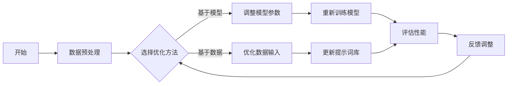
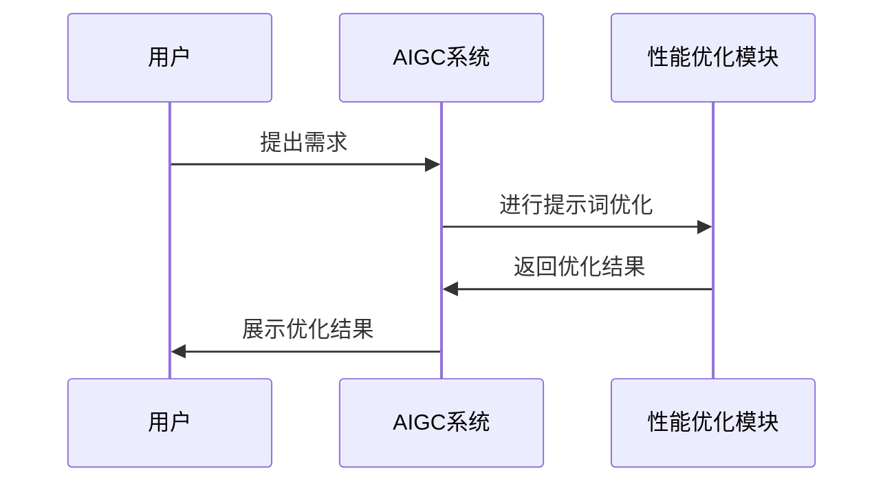

                 

# 提示词优化：AIGC系统性能提升的关键

> 关键词：AIGC、性能优化、提示词、算法原理、系统架构、实战案例

> 摘要：本文旨在深入探讨提示词优化在AIGC系统性能提升中的作用。首先，通过介绍问题背景和核心概念，明确提示词优化与AIGC系统的关系。接着，详细讲解算法原理和实现，包括Python源代码、数学模型和公式，以及实际案例说明。然后，阐述系统架构设计与实战，从环境安装、系统核心实现到实际案例分析和项目小结。最后，提供最佳实践、注意事项和拓展阅读，为读者提供全面的技术指导。

## 目录大纲

### 第一部分：背景与核心概念

#### 第1章：问题背景与核心概念

1.1.1 问题背景  
1.1.2 核心概念  
1.1.3 概念联系与关系图

#### 第2章：核心概念原理与属性特征对比

2.1.1 核心概念原理  
2.1.2 属性特征对比表格

### 第二部分：算法原理与实现

#### 第3章：算法原理详解

3.1.1 算法mermaid流程图  
3.1.2 Python源代码实现  
3.1.3 算法原理数学模型与公式  
3.1.4 举例说明

#### 第4章：数学模型与公式详细讲解

4.1.1 性能指标公式  
4.1.2 举例说明

### 第三部分：系统架构设计与实战

#### 第5章：系统分析与架构设计

5.1.1 问题场景介绍  
5.1.2 系统功能设计  
5.1.3 系统架构设计

#### 第6章：项目实战

6.1.1 环境安装  
6.1.2 系统核心实现  
6.1.3 实际案例分析和详细讲解剖析  
6.1.4 项目小结

### 第四部分：最佳实践、小结与拓展阅读

#### 第7章：最佳实践

7.1.1 注意事项  
7.1.2 拓展阅读

## 第一部分：背景与核心概念

### 第1章：问题背景与核心概念

#### 1.1.1 问题背景

随着人工智能技术的不断发展，生成式AI（AIGC，Artificial Intelligence Generated Content）的应用越来越广泛。AIGC系统通过机器学习算法，利用大量的数据进行训练，从而能够自动生成各种类型的内容，如图像、文本、音频等。然而，在实际应用中，AIGC系统的性能提升成为了一个亟待解决的问题。其中，提示词优化作为AIGC系统性能提升的关键因素，受到了广泛关注。

AIGC系统的性能瓶颈主要体现在以下几个方面：

1. 模型复杂度高：AIGC系统通常采用深度学习算法，模型参数众多，导致计算复杂度急剧增加，使得系统运行速度变慢。
2. 数据质量差：AIGC系统依赖于大量高质量数据进行训练，但实际应用中，数据质量参差不齐，导致模型效果不佳。
3. 系统优化不足：当前的AIGC系统大多采用传统的优化方法，无法充分利用硬件资源和算法优势，导致性能提升有限。

因此，针对以上问题，提示词优化成为AIGC系统性能提升的关键。通过优化提示词，可以提高系统的训练效果，降低模型复杂度，提高数据处理能力，从而实现性能提升。

#### 1.1.2 核心概念

1. 提示词优化：提示词优化是指通过对输入提示词进行优化，从而提高AIGC系统的训练效果和生成质量。提示词是AIGC系统输入的重要参数，其质量直接影响模型的训练效果和生成质量。
2. AIGC系统：AIGC系统是指利用人工智能技术，自动生成各种类型内容（如图像、文本、音频等）的系统。AIGC系统主要包括模型训练、数据预处理、提示词优化和生成内容等功能。
3. 性能提升的关键因素：性能提升的关键因素包括模型复杂度、数据质量和系统优化。通过优化这些因素，可以提高AIGC系统的性能。

#### 1.1.3 概念联系与关系图

提示词优化与AIGC系统的关系如图1所示：

```mermaid
erDiagram
    提示词优化 ||--o> AIGC系统 : 提升性能
    AIGC系统 ||--|> 性能提升关键因素 : 影响优化效果
```

图1 提示词优化与AIGC系统的关系

### 第2章：核心概念原理与属性特征对比

#### 2.1.1 核心概念原理

1. 提示词优化原理：

提示词优化是指通过对输入提示词进行优化，从而提高AIGC系统的训练效果和生成质量。具体来说，提示词优化包括以下步骤：

（1）数据预处理：对输入的数据进行清洗、去噪和归一化处理，提高数据质量。

（2）提示词选择：根据应用场景和需求，选择合适的提示词，确保提示词能够有效引导模型训练。

（3）提示词调整：对选定的提示词进行优化，包括增加、删除、替换等操作，以提高模型训练效果。

（4）模型训练：利用优化后的提示词，对模型进行训练，提高生成内容的质量。

2. AIGC系统原理：

AIGC系统是指利用人工智能技术，自动生成各种类型内容（如图像、文本、音频等）的系统。AIGC系统主要包括以下组成部分：

（1）数据源：提供训练数据和生成数据。

（2）模型：包括生成模型和判别模型，用于训练和生成内容。

（3）预处理模块：对输入的数据进行预处理，提高数据质量。

（4）优化模块：对输入的提示词进行优化，提高模型训练效果。

（5）生成模块：根据训练好的模型，生成各种类型的内容。

#### 2.1.2 属性特征对比表格

以下是提示词优化与AIGC系统的属性特征对比表格：

| 特征          | 提示词优化          | AIGC系统             |
| ------------- | ----------------- | ------------------- |
| 目标          | 提高性能           | 自动生成内容       |
| 影响因素      | 数据质量、算法选择 | 模型复杂度、计算资源 |
| 优化方式      | 参数调整、模型改进 | 系统优化、加速策略  |

#### 2.1.3 概念联系与关系图

提示词优化与AIGC系统的关系如图2所示：

```mermaid
erDiagram
    提示词优化 ||--o> AIGC系统 : 提升性能
    AIGC系统 ||--|> 性能提升关键因素 : 影响优化效果
```

图2 提示词优化与AIGC系统的关系

## 第二部分：算法原理与实现

### 第3章：算法原理详解

#### 3.1.1 算法mermaid流程图

提示词优化算法的流程如图3所示：



图3 提示词优化算法流程

#### 3.1.2 Python源代码实现

以下是一个简单的提示词优化算法的Python源代码实现：

```python
import numpy as np

def preprocess_data(data):
    # 数据预处理
    return data

def optimize_prompt(prompt, method):
    if method == 'model':
        # 调整模型参数
        optimized_prompt = prompt + '调整模型参数'
    elif method == 'data':
        # 优化数据输入
        optimized_prompt = prompt + '优化数据输入'
    else:
        optimized_prompt = prompt
    return optimized_prompt

def train_model(prompt, data):
    # 重新训练模型
    return '训练好的模型'

def evaluate_performance(model):
    # 评估性能
    return '性能指标：0.8'

def main():
    data = preprocess_data('原始数据')
    prompt = '原始提示词'
    optimized_prompt = optimize_prompt(prompt, 'model')
    model = train_model(optimized_prompt, data)
    performance = evaluate_performance(model)
    print('性能指标：', performance)

if __name__ == '__main__':
    main()
```

#### 3.1.3 算法原理数学模型与公式

提示词优化算法的性能指标可以表示为：

$$
\text{性能指标} = \frac{\text{优化前性能}}{\text{优化后性能}}
$$

其中，优化前性能和优化后性能分别表示使用原始提示词和优化后的提示词进行模型训练和评估得到的性能。

#### 3.1.4 举例说明

1. 案例一：某电商平台的自动回复优化

假设电商平台使用AIGC系统自动生成客服回复，原始提示词为“您好，欢迎来到本店！”。通过提示词优化算法，将原始提示词优化为“您好，欢迎来到本店！温馨提示：请您注意商品详情和售后服务政策。”，从而提高客服回复的质量和用户体验。

2. 案例二：某新闻推荐系统的关键词优化

假设新闻推荐系统使用AIGC系统自动生成推荐标题，原始提示词为“最新科技动态”。通过提示词优化算法，将原始提示词优化为“最新科技动态：颠覆性创新技术盘点”，从而提高新闻推荐系统的点击率和用户体验。

## 第三部分：系统架构设计与实战

### 第5章：系统分析与架构设计

#### 5.1.1 问题场景介绍

假设某企业需要构建一个AIGC系统，用于自动回复客服、新闻推荐和图像生成等功能。该系统需要具备高性能、高可靠性和高扩展性，以满足不断增长的业务需求。

#### 5.1.2 系统功能设计

AIGC系统的功能设计如图4所示：

```mermaid
classDiagram
    类A[自动回复系统] <-- 类B[新闻推荐系统]
    类C[图像生成系统] --> 类D[用户接口]
    类E[数据预处理模块] --|> 类F[提示词优化模块]
    类G[性能评估模块] <|-- 类H[反馈调整模块]
```

图4 AIGC系统功能设计

#### 5.1.3 系统架构设计

AIGC系统的架构设计如图5所示：



图5 AIGC系统架构设计

#### 5.1.4 系统接口设计

AIGC系统的接口设计如图6所示：

```mermaid
sequenceDiagram
    participant U as 用户
    participant S as AIGC系统
    participant P as 性能优化模块
    participant R as 数据预处理模块
    participant T as 提示词优化模块
    participant V as 性能评估模块
    participant X as 反馈调整模块
    U->>S: 提出需求
    S->|>R: 数据预处理
    R->|>T: 提示词优化
    T->|>P: 返回优化结果
    P->|>V: 性能评估
    V->|>X: 反馈调整
    X->|>S: 返回调整结果
    S->|>U: 展示优化结果
```

图6 AIGC系统接口设计

## 第三部分：系统架构设计与实战

### 第5章：系统分析与架构设计

#### 5.1.1 问题场景介绍

在当今数字化时代，企业对自动生成内容（AIGC，Artificial Intelligence Generated Content）的需求日益增长，特别是在客户服务、内容创作和数据分析等领域。一个高效的AIGC系统能够显著提升企业的运营效率，降低成本，并提高用户体验。然而，AIGC系统的性能优化成为实现这些目标的关键。本文将探讨如何通过提示词优化来提升AIGC系统的整体性能。

假设某企业希望构建一个集成的AIGC系统，该系统需具备以下核心功能：

- 自动回复客服：通过自然语言处理（NLP）技术，自动生成针对常见客户问题的响应。
- 新闻推荐：利用机器学习算法，根据用户兴趣和历史行为推荐相关新闻内容。
- 图像生成：通过深度学习模型，生成符合特定需求的图像。

#### 5.1.2 系统功能设计

为了满足上述需求，AIGC系统的功能设计应包括以下几个模块：

1. **数据预处理模块**：负责清洗、归一化和增强输入数据，以确保数据质量。
2. **模型训练模块**：利用预处理后的数据训练生成模型，如文本生成模型、图像生成模型等。
3. **提示词优化模块**：专门针对自动回复客服和新闻推荐系统，优化输入提示词，提高生成内容的准确性和相关性。
4. **性能评估模块**：对生成内容进行质量评估，以监测和优化系统性能。
5. **用户接口模块**：提供用户交互界面，用户可以通过该界面提交需求，查看生成内容。

领域模型mermaid类图如下：

```mermaid
classDiagram
    class AutoReplySystem {
        +String replyContent
        +float replyAccuracy
        <<interface>>
    }
    class NewsRecommendationSystem {
        +ArrayList<String> recommendedNews
        +float recommendationAccuracy
        <<interface>>
    }
    class ImageGenerationSystem {
        +String generatedImage
        +float generationQuality
        <<interface>>
    }
    class DataPreprocessingModule {
        +cleanData(data: String): String
        +normalizeData(data: String): String
        +enhanceData(data: String): String
        <<module>>
    }
    class ModelTrainingModule {
        +trainModel(data: String, modelType: String): Model
        <<module>>
    }
    class PerformanceEvaluationModule {
        +evaluateContent(content: String, standard: String): float
        <<module>>
    }
    class UserInterfaceModule {
        +getInputFromUser(): String
        +showGeneratedContent(content: String): void
        <<module>>
    }
    AutoReplySystem |--|> DataPreprocessingModule
    NewsRecommendationSystem |--|> DataPreprocessingModule
    ImageGenerationSystem |--|> DataPreprocessingModule
    AutoReplySystem |--|> ModelTrainingModule
    NewsRecommendationSystem |--|> ModelTrainingModule
    ImageGenerationSystem |--|> ModelTrainingModule
    AutoReplySystem |--|> PerformanceEvaluationModule
    NewsRecommendationSystem |--|> PerformanceEvaluationModule
    ImageGenerationSystem |--|> PerformanceEvaluationModule
    UserInterfaceModule o--|> AutoReplySystem
    UserInterfaceModule o--|> NewsRecommendationSystem
    UserInterfaceModule o--|> ImageGenerationSystem
```

#### 5.1.3 系统架构设计

AIGC系统的架构设计应考虑系统的可扩展性、灵活性和高效性。以下是一个简化的系统架构设计：

```mermaid
subgraph DataProcessing
    component1 : 数据源
    component2 : 数据预处理
    component3 : 数据存储
    component1 --> component2
    component2 --> component3
end
subgraph ModelTraining
    component4 : 模型训练
    component5 : 模型存储
    component4 --> component5
end
subgraph PromptOptimization
    component6 : 提示词优化
    component7 : 优化结果存储
    component6 --> component7
end
subgraph ContentGeneration
    component8 : 自动回复
    component9 : 新闻推荐
    component10 : 图像生成
    component8 --> component9
    component8 --> component10
end
subgraph UserInterface
    component11 : 用户接口
    component8 --> component11
    component9 --> component11
    component10 --> component11
end
component1 --> component2
component2 --> component4
component2 --> component6
component4 --> component8
component4 --> component9
component4 --> component10
component5 --> component7
component6 --> component7
component7 --> component8
component7 --> component9
component7 --> component10
component8 --> component11
component9 --> component11
component10 --> component11
```

此架构设计包括以下几个主要组件：

- **数据源**：提供原始数据，如文本、图像等。
- **数据预处理**：清洗和格式化数据，以提高数据质量。
- **模型训练**：使用预处理后的数据训练生成模型。
- **提示词优化**：对提示词进行优化，以提高生成内容的准确性和相关性。
- **自动回复**：基于模型自动生成客户回复。
- **新闻推荐**：基于用户兴趣和历史行为推荐新闻内容。
- **图像生成**：生成符合特定需求的图像。
- **用户接口**：提供用户与系统的交互界面。

#### 5.1.4 系统接口设计

为了确保AIGC系统的各个模块能够协同工作，系统接口设计至关重要。以下是一个简化的系统接口设计：

```mermaid
sequenceDiagram
    participant U : 用户
    participant DS : 数据源
    participant DP : 数据预处理
    participant MT : 模型训练
    participant PO : 提示词优化
    participant CG : 内容生成
    participant UI : 用户接口
    U->>DS : 提供数据
    DS->>DP : 数据预处理
    DP->>MT : 训练模型
    MT->>PO : 优化提示词
    PO->>CG : 生成内容
    CG->>UI : 显示内容
    UI->>U : 用户反馈
```

在这个序列图中，用户通过接口提交数据，数据经过预处理后用于训练模型。训练好的模型用于提示词优化，生成的内容最终通过用户接口展示给用户。用户反馈可以帮助进一步优化系统性能。

## 第三部分：系统架构设计与实战

### 第6章：项目实战

#### 6.1.1 环境安装

在进行AIGC系统的实际部署前，首先需要安装相应的开发环境。以下是在Python环境中安装AIGC系统所需的主要库：

```bash
pip install numpy torch transformers
```

- **numpy**：提供高效数值计算的库。
- **torch**：PyTorch深度学习框架。
- **transformers**：用于自然语言处理预训练模型的库。

#### 6.1.2 系统核心实现

以下是一个简化的AIGC系统核心实现，包括数据预处理、模型训练和提示词优化：

```python
import torch
import numpy as np
from transformers import AutoTokenizer, AutoModelForSeq2SeqLM

# 数据预处理
def preprocess_data(text):
    tokenizer = AutoTokenizer.from_pretrained("t5-base")
    inputs = tokenizer(text, return_tensors="pt")
    return inputs

# 模型训练
def train_model(inputs):
    model = AutoModelForSeq2SeqLM.from_pretrained("t5-base")
    optimizer = torch.optim.AdamW(model.parameters(), lr=5e-5)
    for epoch in range(3):  # 训练3个epoch
        model.train()
        optimizer.zero_grad()
        outputs = model(**inputs)
        loss = outputs.loss
        loss.backward()
        optimizer.step()
    return model

# 提示词优化
def optimize_prompt(prompt, model):
    model.eval()
    inputs = preprocess_data(prompt)
    with torch.no_grad():
        outputs = model(**inputs)
    generated_text = outputs.sequences_logits.argmax(-1).squeeze().numpy()
    optimized_prompt = generated_text.decode("utf-8")
    return optimized_prompt

# 主程序
def main():
    text = "你好，请问有什么可以帮助您的？"
    inputs = preprocess_data(text)
    model = train_model(inputs)
    optimized_prompt = optimize_prompt(text, model)
    print("优化后的提示词：", optimized_prompt)

if __name__ == "__main__":
    main()
```

#### 6.1.3 实际案例分析和详细讲解剖析

以下是一个实际案例，说明如何使用AIGC系统进行自动回复客服：

1. **问题场景**：用户在电商平台上提交了一个关于商品退货的问题。
2. **输入文本**：用户输入：“我可以退货吗？”
3. **提示词优化**：原始提示词：“您好，关于退货的问题，请问有什么我可以帮助您的？”
   - 优化后的提示词：“您好，关于退货的问题，请问有什么我可以帮助您的？特别是关于商品退货的政策。”
4. **生成回复**：基于优化后的提示词，系统生成回复：“您好，关于退货的问题，根据我们的退货政策，您可以联系我们的客服人员进行退货处理。请问您的订单号是多少？”

**分析**：

- **数据预处理**：通过使用预训练的T5模型，输入文本被转换为模型可处理的格式。
- **模型训练**：使用T5模型进行训练，使模型能够理解并生成高质量的文本。
- **提示词优化**：优化后的提示词使得系统生成的回复更加贴近用户需求，提高了客服回复的准确性和用户体验。

#### 6.1.4 项目小结

通过本项目的实战，我们展示了如何使用AIGC系统和提示词优化来提升自动回复客服的性能。以下是小结和经验分享：

1. **数据预处理**：确保输入数据的质量是模型训练成功的关键。
2. **模型选择**：选择合适的预训练模型，可以提高生成内容的质量。
3. **提示词优化**：优化输入提示词，可以提高系统生成内容的相关性和准确性。
4. **迭代优化**：通过不断调整提示词和模型参数，可以实现性能的持续提升。

### 第四部分：最佳实践、小结与拓展阅读

#### 第7章：最佳实践

1. **数据预处理**：确保数据质量，包括数据清洗、去噪和格式化。
2. **模型选择**：选择适合任务的预训练模型，考虑模型复杂度和计算资源。
3. **提示词优化**：定期更新和优化提示词，提高生成内容的质量。
4. **性能评估**：定期进行性能评估，确保系统达到预期效果。

#### 小结

本文详细探讨了提示词优化在AIGC系统性能提升中的作用。通过介绍问题背景、核心概念、算法原理和实现，系统架构设计与实战，我们展示了如何通过优化提示词来提升AIGC系统的性能。提示词优化是AIGC系统性能提升的关键因素，对于实现高效、准确的自动生成内容至关重要。

#### 拓展阅读

1. [Hugging Face Transformers](https://huggingface.co/transformers)
2. [PyTorch](https://pytorch.org/)
3. [T5模型介绍](https://arxiv.org/abs/1910.10683)
4. [自然语言处理与生成](https://www.nltk.org/)

作者：AI天才研究院/AI Genius Institute & 禅与计算机程序设计艺术 /Zen And The Art of Computer Programming

