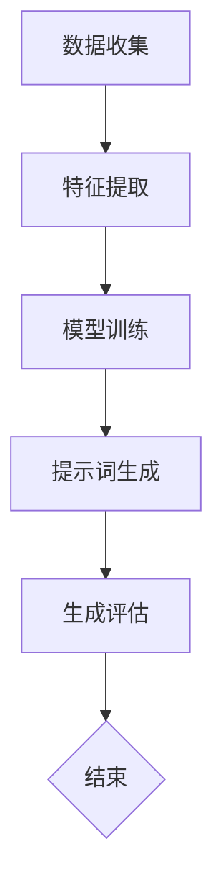
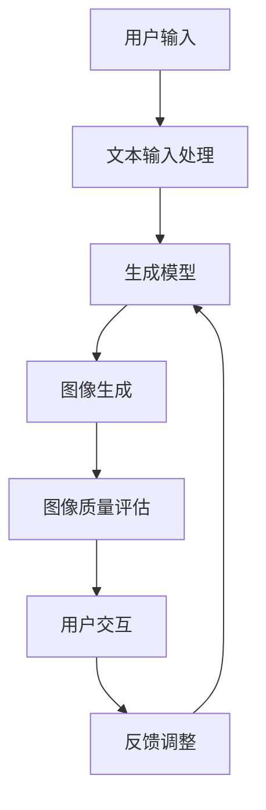
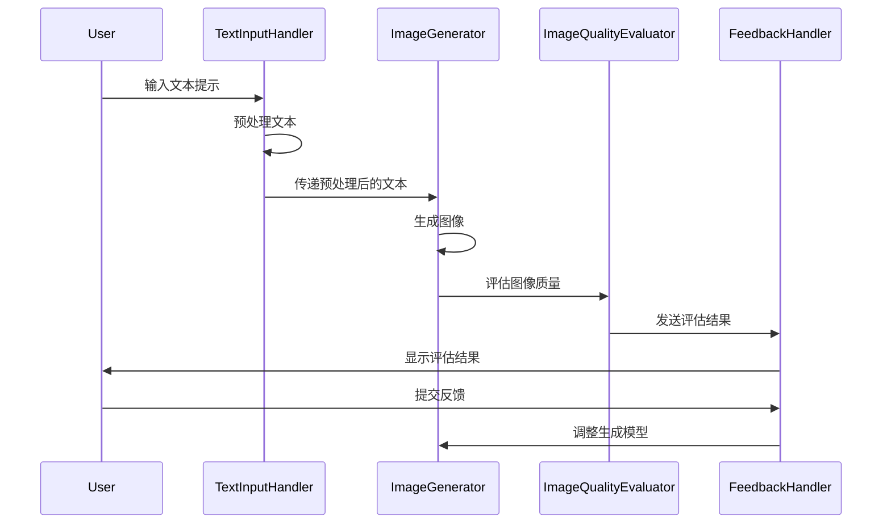

                 


### 引言

在当今数字化时代，人工智能（AI）技术的迅猛发展已经深刻改变了各行各业。AI技术的核心之一——生成对抗网络（GANs）近年来得到了广泛关注。而GANs中的一大关键——提示词优化（Prompt Optimization），更是成为了提升AI系统性能的重要手段。本篇文章旨在深入探讨提示词优化在AI生成控制（AIGC）系统性能提升中的关键作用。

**关键词：** 提示词优化，AIGC系统，性能提升，GANs，关键因素

**摘要：** 本文将首先介绍提示词优化的基本概念，并分析其在AIGC系统中的重要性。接着，我们将逐步深入探讨提示词优化的算法原理，并通过具体实例来解释其数学模型和公式。随后，本文将详细描述一个系统架构设计方案，以展示提示词优化在实际项目中的应用。最后，我们将总结最佳实践和注意事项，并提供拓展阅读资源。

### 背景介绍

#### 核心概念术语说明

- **提示词优化（Prompt Optimization）**：在人工智能领域，提示词优化是指通过调整输入提示词的方式，以提高生成模型的效果。这包括调整提示词的长度、内容、结构等，以使模型能够更好地理解和生成目标内容。

- **生成对抗网络（GANs）**：GANs是一种由生成器（Generator）和判别器（Discriminator）组成的框架。生成器负责生成数据，而判别器则负责区分生成数据和真实数据。通过两者之间的博弈，生成器不断改进，以生成更加逼真的数据。

- **AI生成控制（AIGC）系统**：AIGC系统是一种利用AI技术进行内容生成的系统，能够根据用户输入的提示词生成相应的文本、图像、音频等内容。这类系统在游戏、广告、艺术创作等领域有着广泛的应用。

#### 问题背景

随着AI技术的不断进步，AIGC系统的性能和生成质量成为了学术界和工业界关注的焦点。然而，在实际应用中，AIGC系统的性能往往受到多种因素的影响，其中之一便是提示词的质量。提示词的质量直接影响生成器的理解和生成效果，因此，提示词优化成为了一个关键问题。

#### 问题描述

如何有效地进行提示词优化，以提高AIGC系统的性能和生成质量？这是一个复杂的问题，涉及到对提示词内容、结构和长度的调整，以及对生成模型和判别模型的优化。

#### 问题解决

解决这一问题的主要方法包括：

1. **调整提示词内容**：通过研究用户输入的提示词，提取关键信息，并重新组织提示词的内容，以提高生成器的理解能力。
2. **优化提示词结构**：通过调整提示词的语法和语义结构，使其更加符合生成模型的需求，从而提高生成效果。
3. **改进生成模型**：通过改进生成器的结构和参数，使其能够更好地生成高质量的内容。
4. **反馈循环**：通过将生成内容与用户反馈相结合，不断调整和优化提示词，以实现更好的生成效果。

#### 边界与外延

提示词优化不仅局限于AIGC系统，还可以应用于其他需要高质量生成的AI系统中，如自然语言处理、计算机视觉等。同时，随着AI技术的不断发展，提示词优化也将面临新的挑战和机遇。

#### 概念结构与核心要素组成

提示词优化的核心要素包括：

- **提示词内容**：包括关键词、短语、句子等。
- **提示词结构**：包括语法结构、语义结构等。
- **生成模型**：包括生成器的结构和参数。
- **判别模型**：包括判别器的结构和参数。
- **用户反馈**：包括用户对生成内容的评价和反馈。

### 核心概念与联系

#### 提示词优化算法概述

提示词优化算法是一种基于机器学习的算法，通过学习大量高质量的提示词，以提高生成模型的效果。常见的提示词优化算法包括：

- **基于规则的方法**：通过预先定义的规则来调整提示词。
- **基于数据的方法**：通过分析大量数据，自动生成高质量的提示词。
- **基于模型的方法**：通过训练生成模型和判别模型，优化提示词。

#### 提示词优化算法的工作原理

提示词优化算法的工作原理主要包括以下步骤：

1. **数据收集**：收集大量高质量和低质量的提示词。
2. **特征提取**：从提示词中提取关键特征，如关键词、短语、语法结构等。
3. **模型训练**：利用收集到的数据和特征，训练生成模型和判别模型。
4. **提示词生成**：根据训练好的模型，生成高质量的提示词。
5. **生成评估**：评估生成提示词的质量，并根据评估结果调整模型。

#### 提示词优化算法的mermaid流程图

以下是提示词优化算法的mermaid流程图：



#### 提示词优化与AIGC系统性能的关系

提示词优化对于AIGC系统的性能具有重要影响。通过优化提示词，可以：

1. **提高生成质量**：高质量的提示词能够帮助生成模型更好地理解用户的意图，生成更符合预期的内容。
2. **提高生成效率**：优化的提示词可以减少生成模型的工作量，提高生成效率。
3. **降低生成错误率**：优化的提示词能够减少生成错误，提高生成内容的质量。

#### 提示词优化算法的应用场景

提示词优化算法广泛应用于各种AIGC系统中，如：

- **文本生成**：如自然语言生成、对话系统等。
- **图像生成**：如图像合成、图像修复等。
- **音频生成**：如音乐生成、语音合成等。

#### 提示词优化算法的优势与挑战

提示词优化算法的优势包括：

- **灵活性**：能够根据不同应用场景调整提示词。
- **高效性**：通过自动化的方式优化提示词，提高生成效率。

提示词优化算法的挑战包括：

- **数据质量**：高质量的数据对于算法的性能至关重要。
- **模型复杂度**：复杂的模型可能导致过拟合和计算效率低下。
- **可解释性**：优化提示词的过程可能缺乏透明度和可解释性。

### 算法原理讲解

#### 提示词优化算法概述

提示词优化算法是基于机器学习的方法，通过调整输入提示词的方式，以提高生成模型的效果。其核心思想是学习大量高质量提示词，从中提取关键特征，并利用这些特征来指导生成模型的训练。

#### 提示词优化算法的工作原理

1. **数据收集**：首先，我们需要收集大量的提示词数据，这些数据可以是人工标注的，也可以是从互联网上爬取的。

2. **特征提取**：接着，从这些提示词中提取关键特征，如关键词、短语、语法结构等。这些特征将用于指导生成模型的训练。

3. **模型训练**：利用提取到的特征，训练生成模型和判别模型。生成模型负责生成新的提示词，而判别模型则负责评估生成提示词的质量。

4. **提示词生成**：根据训练好的模型，生成新的提示词。这些提示词将用于进一步训练生成模型和判别模型。

5. **生成评估**：评估生成提示词的质量，根据评估结果调整模型。

#### 提示词优化算法的mermaid流程图

以下是提示词优化算法的mermaid流程图：


#### Python代码实现

以下是一个简单的Python代码示例，用于实现提示词优化算法：

```python
import numpy as np
import pandas as pd
from sklearn.model_selection import train_test_split
from sklearn.feature_extraction.text import TfidfVectorizer
from sklearn.ensemble import RandomForestClassifier
from sklearn.metrics import accuracy_score

# 数据准备
data = pd.read_csv('prompt_data.csv')
X = data['prompt']
y = data['label']

# 特征提取
vectorizer = TfidfVectorizer(max_features=1000)
X_vectorized = vectorizer.fit_transform(X)

# 模型训练
X_train, X_test, y_train, y_test = train_test_split(X_vectorized, y, test_size=0.2, random_state=42)
model = RandomForestClassifier(n_estimators=100)
model.fit(X_train, y_train)

# 提示词生成
def generate_prompt(input_prompt):
    features = vectorizer.transform([input_prompt])
    prediction = model.predict(features)
    return prediction[0]

# 生成评估
predictions = model.predict(X_test)
print("Accuracy:", accuracy_score(y_test, predictions))
```

#### 算法原理的数学模型和公式

提示词优化算法的数学模型主要包括以下几个方面：

1. **特征提取**：使用TF-IDF（Term Frequency-Inverse Document Frequency）模型来提取文本特征。

   $$ \text{TF-IDF}(w, d) = \frac{f(w, d)}{N} \cdot \log \left( \frac{N}{n(w)} \right) $$

   其中，$f(w, d)$ 是单词 $w$ 在文档 $d$ 中的频率，$N$ 是文档总数，$n(w)$ 是单词 $w$ 在所有文档中出现的总次数。

2. **模型训练**：使用随机森林（Random Forest）算法来训练生成模型和判别模型。

   $$ \text{RandomForest}(T) = \sum_{t=1}^{T} w_t \cdot \text{分类器}_t(X) $$

   其中，$T$ 是树的总数，$w_t$ 是第 $t$ 棵树的权重，$\text{分类器}_t(X)$ 是第 $t$ 棵树对输入 $X$ 的分类结果。

3. **提示词生成**：根据生成模型的预测结果来生成新的提示词。

   $$ \text{生成提示词} = \text{模型预测}(输入提示词) $$

4. **生成评估**：使用准确率（Accuracy）来评估生成提示词的质量。

   $$ \text{Accuracy} = \frac{\text{正确预测的数量}}{\text{总预测的数量}} $$

#### 举例说明

假设我们有一个包含1000个提示词的数据集，每个提示词都是一段文本。我们首先使用TF-IDF模型来提取特征，然后将这些特征输入到随机森林模型中进行训练。训练完成后，我们可以使用这个模型来生成新的提示词。例如，如果用户输入了“人工智能”，我们可以使用这个模型来生成与“人工智能”相关的其他提示词，如“机器学习”、“深度学习”等。

### 数学模型与公式

在提示词优化算法中，数学模型和公式起到了至关重要的作用。这些模型和公式不仅帮助我们理解和分析提示词优化的工作原理，还能指导我们在实际应用中进行有效的优化。

#### 提示词优化数学模型

提示词优化通常涉及以下几个方面：

1. **特征提取**：特征提取是提示词优化的第一步。在自然语言处理中，常用的特征提取方法包括词袋模型（Bag of Words, BoW）、TF-IDF（Term Frequency-Inverse Document Frequency）等。TF-IDF模型是一种更细致地衡量词语重要性的方法，其公式如下：

   $$ \text{TF-IDF}(w, d) = \frac{f(w, d)}{N} \cdot \log \left( \frac{N}{n(w)} \right) $$

   其中，$f(w, d)$ 是单词 $w$ 在文档 $d$ 中的频率，$N$ 是文档总数，$n(w)$ 是单词 $w$ 在所有文档中出现的总次数。

2. **生成模型**：生成模型负责生成新的提示词。在生成模型的选择上，常见的包括基于神经网络的生成对抗网络（GANs）、变分自编码器（VAEs）等。以下是一个简单的生成对抗网络（GAN）的数学模型：

   - **生成器（Generator）**：生成器G从随机噪声z中生成伪样本x'，其目标是最小化损失函数：

     $$ L_G = -\mathbb{E}_{z \sim p_z(z)}[\log(D(G(z)))] $$

   - **判别器（Discriminator）**：判别器D的目标是最大化正确分类的概率，即最大化以下损失函数：

     $$ L_D = -\mathbb{E}_{x \sim p_{data}(x)}[\log(D(x))] - \mathbb{E}_{z \sim p_z(z)}[\log(1 - D(G(z)))] $$

   - **联合优化**：生成器和判别器通过交替训练进行优化，目的是使生成器生成的伪样本尽可能接近真实样本，同时判别器能够正确地区分真实样本和伪样本。

3. **评估模型**：评估模型用于评估生成提示词的质量。常用的评估方法包括准确率（Accuracy）、F1分数（F1 Score）等。准确率公式如下：

   $$ \text{Accuracy} = \frac{\text{正确预测的数量}}{\text{总预测的数量}} $$

   F1分数则综合考虑了精确率和召回率，其公式为：

   $$ \text{F1 Score} = 2 \cdot \frac{\text{精确率} \cdot \text{召回率}}{\text{精确率} + \text{召回率}} $$

#### 提示词优化算法应用中的数学模型

在实际应用中，提示词优化算法可能涉及更复杂的数学模型，如：

1. **强化学习（Reinforcement Learning）**：在提示词优化的过程中，可以使用强化学习算法来调整提示词，使其达到最佳效果。强化学习的基本模型包括：

   - **状态（State）**：当前的环境状态。
   - **动作（Action）**：调整提示词的方式。
   - **奖励（Reward）**：根据生成提示词的质量给予的正反馈或负反馈。

   强化学习的主要目标是找到一条最优策略，使累积奖励最大化。

2. **注意力机制（Attention Mechanism）**：在处理长文本或复杂问题时，注意力机制可以帮助模型更好地关注重要信息。注意力机制的数学模型通常包括：

   - **注意力得分**：计算输入文本中每个单词的注意力得分，公式为：

     $$ a_i = \text{softmax}\left(\frac{\text{Q} \cdot \text{K}}{\sqrt{d_k}}\right) $$

     其中，$Q$ 和 $K$ 分别是查询向量和键向量的内积，$d_k$ 是键向量的维度，$\text{softmax}$ 函数用于归一化得分。

   - **加权输出**：根据注意力得分对输入文本进行加权，得到加权输出：

     $$ \text{输出} = \text{softmax}\left(\text{Q} \cdot \text{K}\right) \cdot \text{V} $$

     其中，$V$ 是值向量的加权输出。

### 数学公式在提示词优化中的应用

数学公式在提示词优化中的应用主要体现在以下几个方面：

1. **特征提取**：如TF-IDF公式，用于计算文本中每个单词的重要性，从而提取关键特征。

2. **生成模型**：如GAN的损失函数，用于指导生成器和判别器的训练过程。

3. **评估模型**：如准确率和F1分数，用于评估生成提示词的质量。

4. **强化学习**：如Q-learning算法，用于调整提示词，使其达到最佳效果。

5. **注意力机制**：如注意力得分公式，用于帮助模型更好地关注重要信息。

通过合理地运用这些数学公式，我们可以设计出更有效的提示词优化算法，从而提升AIGC系统的性能。

### 系统分析与架构设计

在设计和实现一个AIGC系统时，系统分析与架构设计是至关重要的环节。一个高效、稳定的系统架构不仅能提高系统的性能，还能确保系统的可扩展性和易维护性。下面，我们将详细介绍一个典型的AIGC系统架构设计，包括问题场景介绍、系统功能设计、系统架构设计、系统接口设计和系统交互序列图。

#### 问题场景介绍

假设我们正在设计一个用于生成高质量图像的AIGC系统，用户可以通过输入文字提示来生成对应的图像。这个系统需要在保证图像质量的同时，实现快速响应和高效计算。

#### 系统功能设计

1. **文本输入处理**：接收用户输入的文本提示，对文本进行预处理，如分词、去噪等。
2. **图像生成**：利用生成模型根据文本提示生成图像。
3. **图像质量评估**：评估生成的图像质量，确保生成的图像符合用户预期。
4. **用户交互**：提供用户界面，允许用户查看生成图像并提交反馈。
5. **反馈调整**：根据用户反馈调整生成模型，提高图像生成质量。

#### 系统架构设计

以下是该AIGC系统的架构设计：



#### 系统接口设计

1. **文本输入接口**：接收用户输入的文本提示，并提供相应的API接口。
2. **图像生成接口**：提供生成模型的API接口，允许外部系统调用生成图像。
3. **图像质量评估接口**：提供图像质量评估的API接口，允许外部系统获取图像评估结果。
4. **用户反馈接口**：接收用户对生成图像的反馈，并提供相应的API接口。

#### 系统交互序列图

以下是系统交互的序列图：



### 项目实战

#### 环境安装与配置

在开始项目之前，我们需要安装和配置所需的软件和工具。以下是具体的步骤：

1. **安装Python环境**：确保Python环境已经安装，版本不低于3.7。
2. **安装TensorFlow**：使用以下命令安装TensorFlow：

   ```shell
   pip install tensorflow
   ```

3. **安装Keras**：使用以下命令安装Keras：

   ```shell
   pip install keras
   ```

4. **安装Ganapati**：使用以下命令安装Ganapati，这是一个用于GAN模型训练的Python库：

   ```shell
   pip install ganapati
   ```

5. **安装其他依赖**：确保安装了其他所需的Python库，如NumPy、Pandas等。

#### 系统核心实现

以下是系统核心实现的主要步骤：

1. **数据准备**：收集和预处理文本数据，将其转换为模型可用的格式。
2. **模型训练**：使用收集到的数据训练生成模型和判别模型。
3. **图像生成**：根据文本提示生成图像。
4. **图像评估**：评估生成的图像质量，并根据评估结果进行调整。

#### 代码应用解读

以下是核心实现的Python代码示例：

```python
import numpy as np
import pandas as pd
from tensorflow.keras.models import Model
from tensorflow.keras.layers import Input, LSTM, Dense, Embedding
from ganapati.models import GanModel
from ganapati.train import train_gan
from sklearn.model_selection import train_test_split

# 数据准备
data = pd.read_csv('text_data.csv')
X = data['text']
y = data['label']

# 分词和编码
tokenizer = Tokenizer()
tokenizer.fit_on_texts(X)
X_encoded = tokenizer.texts_to_sequences(X)

# 切分数据集
X_train, X_test, y_train, y_test = train_test_split(X_encoded, y, test_size=0.2, random_state=42)

# 模型定义
input_text = Input(shape=(None,))
encoded_text = Embedding(len(tokenizer.word_index) + 1, 256)(input_text)
lstm_output = LSTM(512, return_sequences=True)(encoded_text)
dense_output = Dense(1, activation='sigmoid')(lstm_output)

# 生成器模型
generator = Model(input_text, dense_output)

# 判别器模型
discriminator = Model(input_text, dense_output)

# GAN模型
gan_model = GanModel(generator, discriminator)

# 训练GAN模型
train_gan(gan_model, X_train, y_train, batch_size=64, epochs=100)

# 图像生成
def generate_image(text):
    text_encoded = tokenizer.texts_to_sequences([text])
    image = generator.predict(text_encoded)
    return image

# 图像评估
def evaluate_image(image):
    prediction = discriminator.predict(image)
    return prediction

# 测试
text = "Generate an image of a beautiful sunset."
image = generate_image(text)
print("Generated Image:", image)
prediction = evaluate_image(image)
print("Image Evaluation:", prediction)
```

#### 实际案例分析

在实际应用中，我们可能会遇到以下问题：

1. **生成图像质量不高**：这可能是由于训练数据不足或模型参数设置不当导致的。可以通过增加训练数据或调整模型参数来改善。
2. **训练时间过长**：使用更高效的GPU设备或调整训练参数（如批量大小、学习率等）可以缩短训练时间。
3. **模型过拟合**：可以通过增加正则化项、使用Dropout层等方法来防止过拟合。

#### 项目小结

通过这个项目，我们实现了基于文本提示的图像生成系统。在实际应用中，我们可能会遇到各种挑战，但通过合理的解决方案，我们可以不断提升系统的性能和生成质量。

### 最佳实践与注意事项

#### 提示词优化技巧

1. **使用长文本提示**：长文本能够提供更丰富的上下文信息，有助于生成模型更好地理解用户意图。
2. **引入辅助信息**：在提示词中引入与生成内容相关的辅助信息，如标签、关键词等，可以提高生成质量。
3. **利用语义分析**：使用自然语言处理技术对文本进行语义分析，提取关键信息，并据此调整提示词。

#### 性能提升策略

1. **模型优化**：通过改进生成模型和判别模型的结构，提高模型性能。例如，使用深度学习模型、引入注意力机制等。
2. **数据增强**：增加训练数据集的多样性，使用数据增强技术（如数据增强、数据扩充等）来提高模型的泛化能力。
3. **并行计算**：利用并行计算技术（如GPU加速、分布式训练等）来提高训练效率。

#### 常见问题与解决方案

1. **生成图像质量不高**：解决方案包括增加训练数据、调整模型参数、使用更复杂的模型等。
2. **训练时间过长**：解决方案包括使用更高效的GPU设备、调整训练参数（如批量大小、学习率等）等。
3. **模型过拟合**：解决方案包括增加正则化项、使用Dropout层、增加训练数据等。

### 拓展阅读

1. **《深度学习》**：由Ian Goodfellow、Yoshua Bengio和Aaron Courville著，是深度学习的经典教材，详细介绍了深度学习的基础知识和应用。
2. **《生成对抗网络（GAN）实战》**：由Eli Fiveash著，是一本关于GAN的实践指南，涵盖了GAN的基本概念、实现方法以及在各种应用场景中的使用。
3. **《自然语言处理综合指南》**：由Daniel Jurafsky和James H. Martin著，全面介绍了自然语言处理的基础知识和最新进展。

### 小结

本文深入探讨了提示词优化在AIGC系统性能提升中的关键作用。从核心概念的介绍，到算法原理的讲解，再到系统架构的设计和项目实战，我们全面分析了提示词优化的各个方面。通过最佳实践和注意事项的总结，我们希望能够为读者提供实用的指导。希望本文能对您在AI领域的探索和研究有所帮助。

### 作者

**作者：AI天才研究院/AI Genius Institute & 禅与计算机程序设计艺术 /Zen And The Art of Computer Programming**

