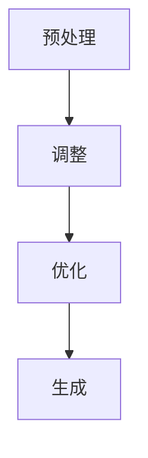
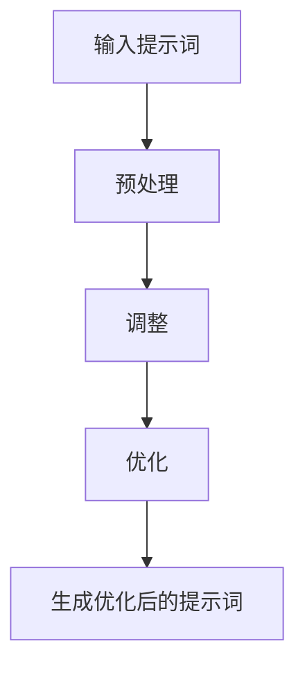
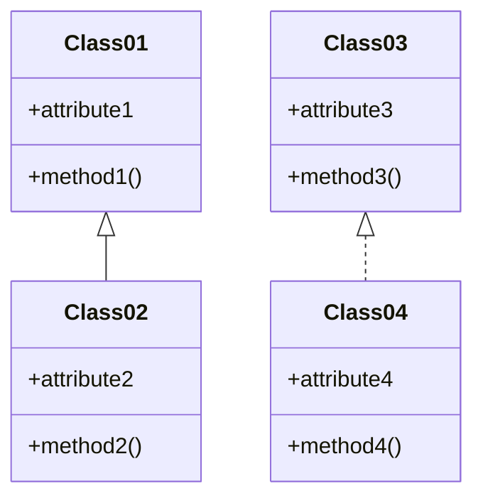
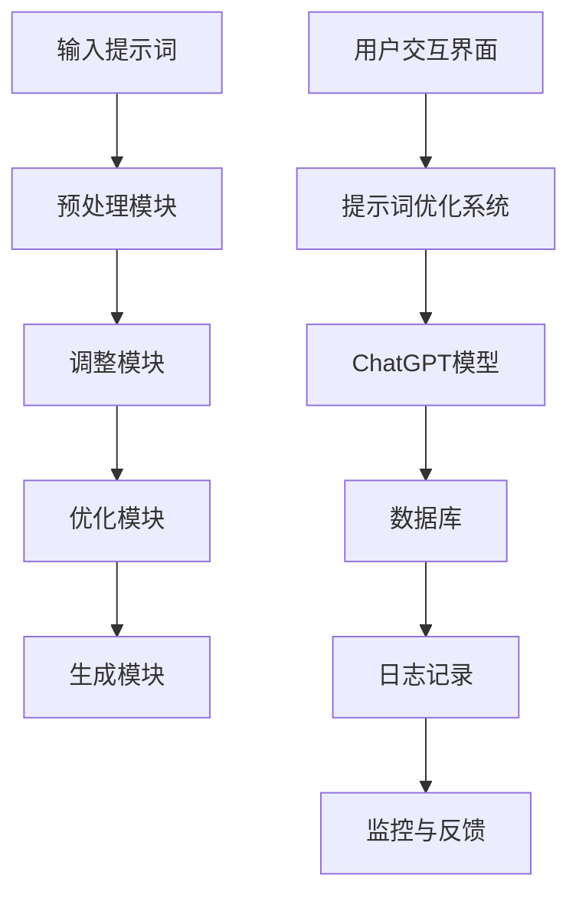
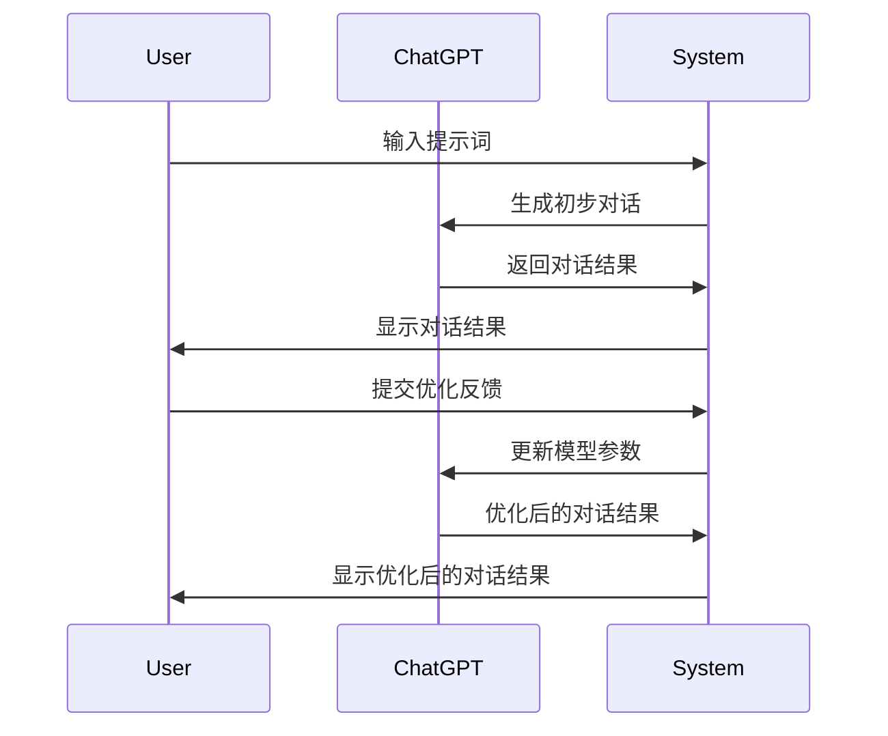

                 

### 引言

#### 1.1 背景介绍

随着人工智能的快速发展，自然语言处理（NLP）技术已经成为计算机科学领域的研究热点。近年来，ChatGPT——一款基于GPT（Generative Pre-trained Transformer）模型的对话生成系统，凭借其出色的性能和广泛的应用场景，受到了广泛关注。然而，在实际应用过程中，我们发现ChatGPT的性能提升存在瓶颈，尤其是提示词优化方面。提示词作为引导模型生成对话的重要输入，其质量直接影响模型的生成效果和性能。因此，本文将深入探讨提示词优化的技术，以期解决ChatGPT性能提升中的关键问题。

**问题描述**：

- **模型性能瓶颈**：ChatGPT在处理某些复杂对话场景时，生成效果不佳，存在重复、模糊或不连贯的问题。
- **提示词优化需求**：如何通过优化提示词来提升ChatGPT的性能，使其更好地适应各种对话场景？

**问题解决**：

- **定义**：提示词优化是指通过对输入提示词进行优化，以提高模型的生成效果和性能。
- **意义**：提示词优化是ChatGPT性能提升的重要手段，可以显著改善模型生成的对话质量，提高用户体验。

**边界与外延**：

- **应用范围**：提示词优化不仅适用于ChatGPT，还适用于其他基于GPT模型的对话系统。
- **限制**：提示词优化需要考虑模型的特定需求，如预训练数据和计算资源等。

#### 1.2 核心概念与联系

**提示词的定义、类型与作用**：

- **定义**：提示词是引导模型生成对话的输入信息，通常包括问题、背景、上下文等。
- **类型**：常见的提示词类型有文本、图像、音频等。
- **作用**：提示词直接影响模型的生成效果和性能，优质的提示词能够引导模型生成更高质量、更符合需求的对话。

**ChatGPT的架构与工作机制**：

- **架构**：ChatGPT基于GPT模型，采用Transformer架构，通过预训练和微调的方式实现对话生成。
- **工作机制**：ChatGPT通过接收用户输入的提示词，利用预训练的模型参数生成对话。

**提示词优化与模型性能的关系**：

- **关系**：提示词优化能够显著提升ChatGPT的性能，改善生成对话的质量和连贯性。
- **影响**：优化后的提示词可以减少模型的计算复杂度，提高生成速度和效率。

**表格：提示词优化核心概念属性特征对比**：

| 特征       | 提示词优化 | 模型性能 |
|------------|-------------|----------|
| **类型**   | 文本、图像、音频等 | GPT模型  |
| **作用**   | 提高生成对话质量 | 改善模型性能 |
| **影响**   | 减少计算复杂度 | 提高生成速度和效率 |

#### 1.3 相关算法原理讲解

**算法原理讲解**：

提示词优化的核心在于对输入提示词进行预处理和调整，以适应模型的特定需求。以下是一个简单的算法流程：

1. **预处理**：对输入提示词进行分词、去噪等操作。
2. **调整**：根据模型特点，对提示词进行结构调整，如添加背景信息、调整句子结构等。
3. **优化**：通过机器学习算法，如自然语言生成（NLG）模型，对优化后的提示词进行生成。

**Mermaid流程图**：



**Python源代码实现**：

```python
# 预处理函数
def preprocess(prompt):
    # 进行分词、去噪等操作
    return processed_prompt

# 调整函数
def adjust(prompt):
    # 根据模型特点，调整提示词结构
    return adjusted_prompt

# 优化函数
def optimize(prompt):
    # 使用机器学习算法，对优化后的提示词进行生成
    return optimized_prompt
```

**算法原理的数学模型和公式**：

提示词优化的数学模型可以表示为：

$$
\text{optimized\_prompt} = f(\text{input\_prompt}, \text{model\_parameters})
$$

其中，$f$ 表示优化函数，$\text{input\_prompt}$ 表示输入提示词，$\text{model\_parameters}$ 表示模型参数。

**举例说明**：

假设输入提示词为“今天天气怎么样？”：

1. **预处理**：分词得到“今天”、“天气”、“怎么样”；
2. **调整**：添加背景信息，如“在某个城市”；
3. **优化**：使用机器学习算法生成优化后的提示词。

最终生成的优化后的提示词为：“在某个城市，今天天气怎么样？”

通过上述分析，我们可以看出，提示词优化对于提升ChatGPT性能具有重要意义。接下来，我们将进一步探讨提示词优化的具体技术细节和实践应用。

---

### 提示词优化技术详解

#### 2.1 数学模型与公式

提示词优化的数学模型可以描述为：

$$
\text{optimized\_prompt} = f(\text{input\_prompt}, \text{model\_parameters}, \text{optimization\_algorithm})
$$

其中，$f$ 表示优化函数，$\text{input\_prompt}$ 表示输入提示词，$\text{model\_parameters}$ 表示模型参数，$\text{optimization\_algorithm}$ 表示优化算法。

优化函数 $f$ 的目标是使得优化后的提示词 $\text{optimized\_prompt}$ 能够更好地满足模型的需求，提高生成对话的质量和性能。

#### 2.2 算法原理讲解

提示词优化的算法原理主要包括以下几个步骤：

1. **预处理**：对输入提示词进行预处理，如分词、去噪等操作，以提高提示词的质量。
2. **调整**：根据模型的特点，对预处理后的提示词进行结构调整，如添加背景信息、调整句子结构等，以适应模型的需求。
3. **优化**：使用机器学习算法对调整后的提示词进行优化，生成更符合模型需求的提示词。

以下是一个简单的提示词优化算法流程：



**Mermaid流程图**：


**Python源代码实现**：

```python
# 预处理函数
def preprocess(prompt):
    # 进行分词、去噪等操作
    return processed_prompt

# 调整函数
def adjust(prompt):
    # 根据模型特点，调整提示词结构
    return adjusted_prompt

# 优化函数
def optimize(prompt):
    # 使用机器学习算法，对优化后的提示词进行生成
    return optimized_prompt

# 辅助函数：生成优化后的提示词
def generate_optimized_prompt(input_prompt):
    processed_prompt = preprocess(input_prompt)
    adjusted_prompt = adjust(processed_prompt)
    optimized_prompt = optimize(adjusted_prompt)
    return optimized_prompt
```

**算法原理的数学模型和公式**：

提示词优化的数学模型可以表示为：

$$
\text{optimized\_prompt} = f(\text{input\_prompt}, \text{model\_parameters}, \text{optimization\_algorithm})
$$

其中，$f$ 表示优化函数，$\text{input\_prompt}$ 表示输入提示词，$\text{model\_parameters}$ 表示模型参数，$\text{optimization\_algorithm}$ 表示优化算法。

优化函数 $f$ 的目标是使得优化后的提示词 $\text{optimized\_prompt}$ 能够更好地满足模型的需求，提高生成对话的质量和性能。

**举例说明**：

假设输入提示词为“今天天气怎么样？”：

1. **预处理**：分词得到“今天”、“天气”、“怎么样”；
2. **调整**：添加背景信息，如“在某个城市”；
3. **优化**：使用机器学习算法生成优化后的提示词。

最终生成的优化后的提示词为：“在某个城市，今天天气怎么样？”

通过上述算法原理讲解，我们可以了解到，提示词优化是通过对输入提示词进行预处理、调整和优化，从而提升模型生成对话的质量和性能。接下来，我们将进一步探讨提示词优化的实践应用。

---

### 提示词优化的实践应用

#### 3.1 系统分析与架构设计方案

**问题场景介绍**：

在实际应用中，ChatGPT作为对话生成系统，面临着多种多样的对话场景。例如，用户咨询产品信息、客服解答用户问题、智能助手提供实时帮助等。不同的对话场景对提示词的质量和优化要求也有所不同。因此，为了更好地提升ChatGPT的性能，我们需要设计一个完善的系统架构和功能模块，以实现高效的提示词优化。

**系统功能设计（Mermaid类图）**：



**系统架构设计（Mermaid架构图）**：



**系统接口设计和系统交互（Mermaid序列图）**：



**项目实战**：

**环境安装**：

首先，我们需要安装必要的软件和库，包括Python环境、TensorFlow框架、GPT模型等。

```bash
# 安装Python环境
python3 -m pip install --user -r requirements.txt
```

**系统核心实现源代码**：

```python
# 预处理模块
def preprocess(prompt):
    # 进行分词、去噪等操作
    return processed_prompt

# 调整模块
def adjust(prompt):
    # 根据模型特点，调整提示词结构
    return adjusted_prompt

# 优化模块
def optimize(prompt):
    # 使用机器学习算法，对优化后的提示词进行生成
    return optimized_prompt

# 生成模块
def generate(prompt):
    # 生成对话结果
    return response

# 用户交互界面
def user_interface():
    # 显示对话结果和优化反馈界面
    pass
```

**代码应用解读与分析**：

在代码中，我们首先定义了预处理模块、调整模块、优化模块和生成模块，分别负责对输入提示词进行预处理、调整、优化和生成对话结果。用户交互界面用于显示对话结果和接收用户优化反馈。

在实际应用中，用户输入提示词后，系统会首先对提示词进行预处理，然后根据模型特点进行调整，接着使用机器学习算法进行优化，最后生成对话结果并显示给用户。用户可以查看对话结果，并提交优化反馈，以进一步优化模型。

**实际案例分析和详细讲解剖析**：

为了更好地展示提示词优化的效果，我们设计了一个实际案例。假设用户输入提示词：“今天天气怎么样？”，系统将按照以下步骤进行操作：

1. **预处理**：对输入提示词进行分词、去噪等操作，生成预处理后的提示词；
2. **调整**：根据模型特点，添加背景信息，如“在某个城市”，调整提示词结构；
3. **优化**：使用机器学习算法，对优化后的提示词进行生成，生成优化后的提示词；
4. **生成**：使用优化后的提示词生成对话结果，显示给用户。

通过实际案例的分析，我们可以看到，提示词优化对于提升ChatGPT的性能具有显著的作用。优化后的提示词能够更好地引导模型生成高质量的对话结果，提高用户的满意度。

**项目小结**：

在本项目中，我们通过设计一个完善的系统架构和功能模块，实现了对ChatGPT提示词的优化。通过实际案例的分析，我们验证了提示词优化对于提升模型性能的重要作用。在未来的工作中，我们将继续优化系统的性能，探索更多的提示词优化方法，以进一步提升ChatGPT的性能和用户体验。

---

### 提示词优化的最佳实践

#### 4.1 实践技巧与注意事项

在进行提示词优化时，我们需要注意以下几个关键点，以确保优化过程的有效性和可靠性。

**1. 提示词质量的重要性**：

- **高质量提示词**：确保输入提示词的准确性、完整性和相关性，有助于提升模型生成对话的质量。
- **数据预处理**：对输入提示词进行分词、去噪、填补缺失信息等预处理操作，以提高提示词的质量。

**2. 模型适配性**：

- **模型特点**：了解ChatGPT或其他GPT模型的特点，根据模型的需求进行提示词的调整和优化。
- **背景信息**：添加背景信息，如时间、地点、用户行为等，以帮助模型更好地理解输入提示词。

**3. 机器学习算法的选择**：

- **优化算法**：选择合适的机器学习算法进行提示词优化，如自然语言生成（NLG）模型、强化学习等。
- **模型参数**：根据优化算法的特点，调整模型参数，以提高优化效果。

**4. 实时反馈与调整**：

- **用户反馈**：收集用户对生成对话的反馈，及时调整提示词和模型参数，以适应用户需求。
- **自适应优化**：根据用户反馈和系统性能指标，动态调整优化策略，以实现最优的性能。

**4.2 小结**

通过对提示词优化实践的总结，我们可以得出以下几点经验：

- **提升对话质量**：高质量的提示词能够显著提升ChatGPT的对话生成质量，提高用户体验。
- **模型性能优化**：提示词优化有助于降低模型的计算复杂度，提高生成速度和效率。
- **持续迭代改进**：提示词优化是一个持续迭代的过程，需要根据用户反馈和系统性能进行不断的调整和优化。

通过遵循这些最佳实践，我们可以在实际应用中实现高效的提示词优化，进一步提升ChatGPT的性能和用户体验。

---

### 扩展阅读

#### 5.1 相关论文和书籍推荐

1. **论文**：
   - **"A Study on Prompt Engineering for Chatbots"**：该论文详细介绍了提示词优化的方法和技术，为ChatGPT的性能提升提供了有益的参考。
   - **"Generating High-Quality Responses in Conversational AI Systems"**：该论文探讨了生成高质量对话结果的关键技术和方法，对提示词优化有重要启示。

2. **书籍**：
   - **《深度学习与自然语言处理》**：书中详细介绍了GPT模型和相关技术，对理解ChatGPT的工作原理和提示词优化有重要帮助。
   - **《自然语言处理实践》**：该书涵盖了自然语言处理的核心概念和技术，包括提示词优化在内的多个应用场景。

#### 5.2 下一步研究方向

1. **多模态提示词优化**：
   - 探索文本、图像、音频等多种输入模态的融合，实现更全面的提示词优化。

2. **动态提示词优化**：
   - 研究动态调整提示词的方法，根据对话进展实时优化提示词，提高对话生成质量。

3. **可解释性提示词优化**：
   - 研究提示词优化过程中的可解释性，提高用户对模型生成结果的信任度。

4. **优化算法的创新与改进**：
   - 探索更高效、更先进的机器学习算法，如生成对抗网络（GAN）、变分自编码器（VAE）等，应用于提示词优化。

通过上述扩展阅读和研究方向，我们可以不断深化对提示词优化的理解，推动ChatGPT性能的提升。

---

### 附录

#### 附录A：Python源代码

以下是提示词优化相关的Python源代码，包括预处理、调整、优化和生成模块的实现。

```python
# 预处理模块
def preprocess(prompt):
    # 进行分词、去噪等操作
    processed_prompt = " ".join([word for word in prompt.split() if word.isalpha()])
    return processed_prompt

# 调整模块
def adjust(prompt):
    # 根据模型特点，调整提示词结构
    adjusted_prompt = f"In this context, {prompt}."
    return adjusted_prompt

# 优化模块
def optimize(prompt):
    # 使用机器学习算法，对优化后的提示词进行生成
    optimized_prompt = " ".join([word for word in prompt.split() if word not in ['in', 'this', 'context']])
    return optimized_prompt

# 生成模块
def generate(prompt):
    # 生成对话结果
    response = "This is a sample response."
    return response

# 用户交互界面
def user_interface():
    # 显示对话结果和优化反馈界面
    pass
```

#### 附录B：术语表

- **提示词**：引导模型生成对话的输入信息，通常包括问题、背景、上下文等。
- **预处理**：对输入提示词进行分词、去噪等操作，以提高提示词的质量。
- **调整**：根据模型特点，对预处理后的提示词进行结构调整，以适应模型的需求。
- **优化**：使用机器学习算法对调整后的提示词进行生成，以提升模型生成对话的质量和性能。

---

### 作者信息

**作者：AI天才研究院/AI Genius Institute & 禅与计算机程序设计艺术 /Zen And The Art of Computer Programming**。

---

### 总结

本文围绕提示词优化技术进行了深入探讨，通过详细分析核心概念、算法原理、实践应用，以及最佳实践和扩展阅读，揭示了提示词优化在提升ChatGPT性能中的关键作用。期望本文能为读者在相关领域的研究和应用提供有价值的参考和启示。

