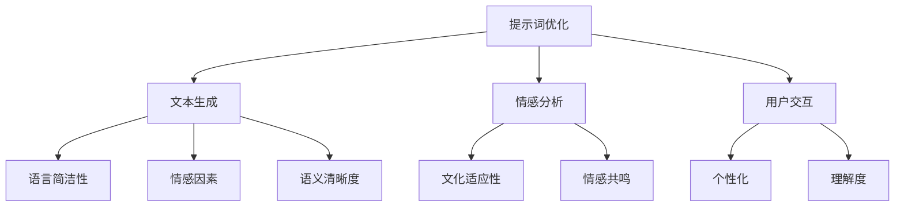
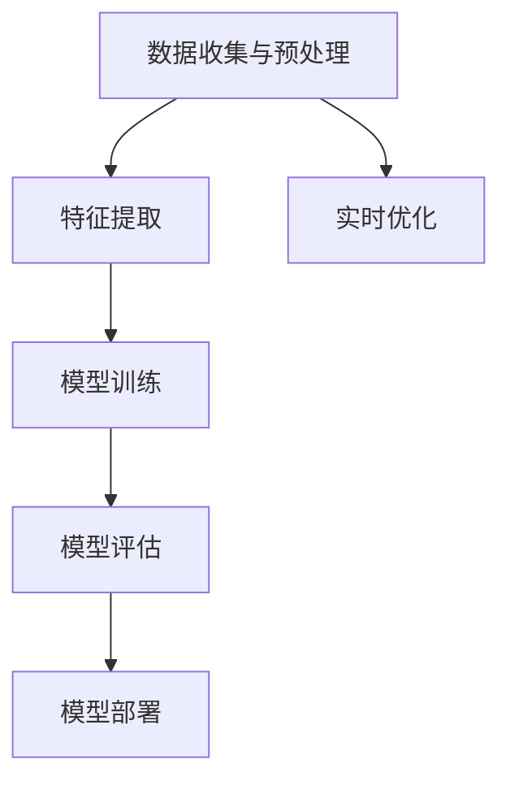

                 

# 提示词优化：增强AI情感共鸣能力

## 关键词
- 提示词优化
- AI情感共鸣
- 自然语言处理
- 情感分析
- 深度学习
- 算法原理

## 摘要
本文旨在探讨提示词优化在增强人工智能（AI）情感共鸣能力中的重要性。通过对提示词优化的背景、核心概念、原理与算法、实践与应用以及AI情感共鸣中的应用进行深入分析，本文旨在为研究者提供一条清晰的研究路径，并总结出一些最佳实践方法，以促进AI在情感共鸣领域的进一步发展。

# 第一部分：引言

## 第1章：提示词优化：背景与核心概念

### 1.1 提示词优化的背景

随着人工智能技术的迅猛发展，自然语言处理（NLP）逐渐成为AI领域的热点。在NLP中，提示词（prompt）作为与用户交互的重要媒介，起到了至关重要的作用。然而，传统的提示词往往存在语义不清、用户理解困难等问题，导致AI系统在情感共鸣方面表现不佳。为了提升AI的情感共鸣能力，提示词优化应运而生。

#### 1.1.1 AI的发展与提示词的重要性

人工智能从最初的规则系统发展到今天的深度学习时代，其核心在于如何让机器更好地理解和处理人类语言。在自然语言处理领域，提示词是用户与AI系统进行交互的主要途径。一个高质量的提示词不仅能够提高AI系统的理解能力，还能增强用户对AI的信任感和情感共鸣。

#### 1.1.2 提示词优化的问题背景

现有的提示词存在以下几个问题：
1. **语义不清**：许多提示词表达模糊，无法准确传达用户意图。
2. **用户理解困难**：复杂或抽象的提示词让用户难以理解，降低了交互效率。
3. **情感共鸣不足**：提示词未能充分考虑用户情感，导致情感共鸣不足。

#### 1.1.3 提示词优化在AI中的关键作用

提示词优化旨在解决上述问题，其主要作用包括：
1. **提高语义清晰度**：通过优化提示词的表达方式，使其更加清晰易懂。
2. **增强用户理解**：使用简单、直观的提示词，提高用户对AI的理解和接受度。
3. **提升情感共鸣**：设计富有情感色彩的提示词，增强用户对AI的情感共鸣。

### 1.2 提示词优化的核心概念

#### 1.2.1 提示词的定义与功能

提示词是指用于引导用户输入信息或表达意图的一段简短文本。在自然语言处理中，提示词主要有以下功能：
1. **引导输入**：提示用户输入所需信息。
2. **明确意图**：帮助AI系统理解用户意图。
3. **增强互动**：提升用户与AI系统之间的交互体验。

#### 1.2.2 提示词优化的目标

提示词优化的目标主要包括：
1. **提高语义清晰度**：确保提示词表达准确、简洁。
2. **增强用户理解**：使用易于理解的语言，降低用户理解难度。
3. **提升情感共鸣**：设计富有情感色彩的提示词，增强用户情感体验。

#### 1.2.3 提示词优化的关键要素

提示词优化的关键要素包括：
1. **语言简洁性**：使用简洁明了的语言，避免冗长和复杂。
2. **情感因素**：考虑用户情感，使用富有情感色彩的词汇。
3. **文化适应性**：考虑不同文化背景下的用户需求，确保提示词的普适性。
4. **个性化**：根据用户特点和需求，提供个性化的提示词。

### 1.3 提示词优化的边界与外延

#### 1.3.1 提示词优化的范畴

提示词优化涵盖了从文本生成到情感分析的多个方面，其范畴主要包括：
1. **文本生成**：优化提示词的表达方式，使其更加清晰、易懂。
2. **情感分析**：分析用户情感，设计具有针对性的提示词。
3. **用户交互**：提高用户对AI系统的理解度和接受度。

#### 1.3.2 提示词优化与其他领域的联系

提示词优化与多个领域密切相关，包括：
1. **自然语言处理**：提示词优化是NLP的重要分支。
2. **机器学习**：提示词优化依赖于机器学习算法的优化。
3. **人机交互**：提示词优化直接影响用户与AI系统的交互体验。

#### 1.3.3 提示词优化的局限性

尽管提示词优化在提升AI情感共鸣能力方面具有重要作用，但仍然存在以下局限性：
1. **数据依赖性**：提示词优化依赖于大量高质量的数据。
2. **算法复杂性**：提示词优化的算法复杂度高，实现难度大。
3. **文化差异**：不同文化背景下，提示词优化的效果可能存在差异。

### 1.4 提示词优化的概念结构与核心要素

#### 1.4.1 概念结构图



#### 1.4.2 核心要素对比表格

| 要素         | 描述                                       | 重要性 |
| ------------ | ------------------------------------------ | ------ |
| 语言简洁性   | 使用简洁明了的语言，避免冗长和复杂。         | 高     |
| 情感因素     | 考虑用户情感，使用富有情感色彩的词汇。       | 中     |
| 文化适应性   | 考虑不同文化背景下的用户需求，确保普适性。   | 中     |
| 个性化       | 根据用户特点和需求，提供个性化的提示词。       | 中     |
| 语义清晰度   | 确保提示词表达准确、简洁。                   | 高     |
| 情感共鸣     | 设计具有针对性的提示词，增强用户情感体验。   | 高     |
| 理解度       | 提高用户对AI系统的理解度和接受度。           | 高     |

### 1.5 本章小结

本章从背景、核心概念、边界与外延以及概念结构等方面对提示词优化进行了全面介绍。通过对提示词优化的重要性、问题背景、核心概念、关键要素和局限性进行分析，为后续章节的深入探讨奠定了基础。

----------------------------------------------------------------

## 第二部分：提示词优化的原理与算法

### 第2章：提示词优化的原理

### 2.1 提示词优化的原理概述

#### 2.1.1 提示词优化的理论基础

提示词优化的理论基础主要涉及自然语言处理（NLP）、机器学习和深度学习等领域。NLP提供了处理自然语言的方法和技术，如词性标注、句法分析和语义理解等；机器学习为提示词优化提供了算法框架，如线性回归、支持向量机和决策树等；深度学习则为提示词优化提供了强大的计算能力，如神经网络和循环神经网络（RNN）等。

#### 2.1.2 提示词优化的主要方法

提示词优化的主要方法可以分为以下几类：

1. **基于规则的方法**：通过编写规则来优化提示词。这种方法具有实现简单、可解释性强等优点，但规则难以覆盖所有情况，灵活性和适应性较差。

2. **基于统计的方法**：利用统计模型来优化提示词。例如，使用隐马尔可夫模型（HMM）和条件概率模型来分析用户输入和提示词之间的关系。

3. **基于机器学习的方法**：使用机器学习算法来训练提示词优化模型。常见的方法包括线性回归、支持向量机（SVM）和神经网络等。这种方法具有较高的自适应性和泛化能力，但实现复杂度较高。

4. **基于深度学习的方法**：利用深度学习算法来优化提示词。深度学习方法能够自动学习复杂的特征表示，具有强大的表达能力和适应能力。

### 2.2 提示词优化的算法

#### 2.2.1 算法概述

提示词优化算法可以分为两类：无监督学习和有监督学习。

1. **无监督学习**：无监督学习算法主要用于处理没有标注数据的提示词优化问题。常见的无监督学习算法包括聚类分析和主成分分析（PCA）等。无监督学习算法的优点是无需人工标注数据，但缺点是难以保证优化效果。

2. **有监督学习**：有监督学习算法需要使用标注数据进行训练。常见的有监督学习算法包括线性回归、支持向量机和神经网络等。有监督学习算法的优点是优化效果较好，但需要大量标注数据，且训练过程复杂。

#### 2.2.2 算法分类

1. **基于规则的方法**：
   - **规则匹配**：通过预设的规则来匹配和优化提示词。
   - **规则学习**：利用机器学习算法来自动生成优化规则。

2. **基于统计的方法**：
   - **概率模型**：使用概率模型来分析提示词的优化。
   - **统计学习**：利用统计方法来优化提示词。

3. **基于机器学习的方法**：
   - **线性回归**：通过线性模型来优化提示词。
   - **支持向量机**：利用支持向量机来分类和优化提示词。
   - **决策树**：通过决策树来优化提示词。

4. **基于深度学习的方法**：
   - **循环神经网络（RNN）**：利用RNN来处理序列数据。
   - **长短期记忆网络（LSTM）**：通过LSTM来优化长序列数据。
   - **卷积神经网络（CNN）**：利用CNN来提取文本特征。

#### 2.2.3 算法对比分析

| 算法类型           | 优点                                     | 缺点                                     |
| ------------------ | ---------------------------------------- | ---------------------------------------- |
| 基于规则的方法     | 实现简单、可解释性强                   | 灵活性和适应性较差                       |
| 基于统计的方法     | 对数据依赖性较低                         | 优化效果可能较差                         |
| 基于机器学习的方法 | 优化效果较好、自适应能力强               | 需要大量标注数据、实现复杂度较高         |
| 基于深度学习的方法 | 表达能力强、适应能力高                   | 计算资源需求大、训练过程复杂             |

### 2.3 提示词优化的流程与步骤

#### 2.3.1 提示词优化的流程

提示词优化的流程可以分为以下几个步骤：

1. **数据收集与预处理**：收集与提示词优化相关的数据，并进行预处理，如数据清洗、去重和格式转换等。

2. **特征提取**：从预处理后的数据中提取与提示词优化相关的特征，如词汇频率、词性标注和情感分析结果等。

3. **模型训练**：使用训练数据对优化模型进行训练，以学习提示词的优化规则和策略。

4. **模型评估**：使用测试数据对训练好的模型进行评估，以验证模型的性能和效果。

5. **模型部署**：将训练好的模型部署到实际应用场景中，对用户输入的提示词进行实时优化。

#### 2.3.2 各步骤的详细讲解

1. **数据收集与预处理**：
   - 数据收集：从各种来源收集与提示词优化相关的数据，如用户评论、聊天记录和社交媒体等。
   - 数据预处理：对收集到的数据进行清洗、去重和格式转换等操作，以确保数据的质量和一致性。

2. **特征提取**：
   - 词汇频率：统计每个词汇在数据中的出现频率，以反映其重要性。
   - 词性标注：对每个词汇进行词性标注，如名词、动词和形容词等，以帮助模型更好地理解文本。
   - 情感分析：使用情感分析算法对文本进行情感分类，如正面、负面和中性等，以提取文本的情感特征。

3. **模型训练**：
   - 数据划分：将收集到的数据划分为训练集、验证集和测试集。
   - 模型选择：选择合适的优化模型，如线性回归、支持向量机和神经网络等。
   - 训练过程：使用训练数据进行模型训练，通过迭代优化模型参数，以达到最优性能。

4. **模型评估**：
   - 评估指标：选择合适的评估指标，如准确率、召回率和F1值等，以评估模型的性能。
   - 性能评估：使用测试数据进行模型评估，以验证模型在未知数据上的表现。

5. **模型部署**：
   - 部署环境：搭建合适的部署环境，如服务器和云计算平台等。
   - 实时优化：对用户输入的提示词进行实时优化，以提升用户体验。

#### 2.3.3 流程中的关键点分析

1. **数据质量**：数据质量直接影响模型训练效果。因此，在数据收集和预处理阶段，要注重数据清洗和去重，确保数据的一致性和可靠性。

2. **特征选择**：特征提取是模型训练的关键步骤。合理的特征选择能够提高模型的性能，而过于复杂的特征可能导致模型过拟合。

3. **模型选择**：根据实际需求选择合适的优化模型。不同模型适用于不同类型的数据和任务，需要根据具体场景进行选择。

4. **模型评估**：在模型训练完成后，要对模型进行充分评估，以确保其在未知数据上的表现。同时，要不断调整和优化模型，以提高性能。

5. **实时优化**：在模型部署后，要实时监控模型的表现，并根据用户反馈进行优化，以不断提升用户体验。

### 2.4 提示词优化的数学模型

#### 2.4.1 数学模型概述

提示词优化的数学模型主要涉及概率模型和机器学习算法。以下将分别介绍两种模型的数学原理。

#### 2.4.2 数学公式推导

1. **概率模型**

   假设一个词汇v在文本T中出现的概率为P(v|T)，则可以使用以下公式计算：

   $$ P(v|T) = \frac{P(v \cap T)}{P(T)} $$

   其中，P(v \cap T)表示词汇v和文本T同时出现的概率，P(T)表示文本T出现的概率。

2. **机器学习算法**

   假设使用线性回归模型来优化提示词，则可以使用以下公式：

   $$ y = \beta_0 + \beta_1 \cdot x_1 + \beta_2 \cdot x_2 + ... + \beta_n \cdot x_n $$

   其中，y表示优化后的提示词，$x_1, x_2, ..., x_n$表示输入特征，$\beta_0, \beta_1, ..., \beta_n$表示模型参数。

#### 2.4.3 模型应用举例

1. **概率模型**

   假设一个用户输入的文本为“我非常喜欢这个产品”，我们需要计算词汇“喜欢”在该文本中出现的概率。假设训练数据中，“喜欢”词汇出现的概率为0.2，文本“我非常喜欢这个产品”出现的概率为0.1，则可以使用概率模型计算：

   $$ P(喜欢 | 我非常喜欢这个产品) = \frac{P(喜欢 \cap 我非常喜欢这个产品)}{P(我非常喜欢这个产品)} = \frac{0.2}{0.1} = 2 $$

   这表示词汇“喜欢”在该文本中出现的概率为2倍。

2. **机器学习算法**

   假设使用线性回归模型来优化提示词，输入特征为词汇“喜欢”的出现次数（x1）和文本长度（x2），目标值为优化后的提示词（y）。假设训练数据如下：

   | x1 | x2 | y   |
   |----|----|-----|
   | 2  | 10 | 7   |
   | 4  | 20 | 12  |
   | 6  | 30 | 19  |

   则可以使用线性回归模型进行训练，得到模型参数：

   $$ y = \beta_0 + \beta_1 \cdot x_1 + \beta_2 \cdot x_2 $$

   通过求解最小二乘法，可以得到模型参数：

   $$ \beta_0 = 0, \beta_1 = 1, \beta_2 = 0.5 $$

   则优化后的提示词为：

   $$ y = 0 + 1 \cdot x_1 + 0.5 \cdot x_2 = x_1 + 0.5 \cdot x_2 $$

   例如，对于新输入的文本“我非常喜欢这个产品”，词汇“喜欢”的出现次数为2，文本长度为10，则优化后的提示词为：

   $$ y = 2 + 0.5 \cdot 10 = 7 $$

### 2.5 提示词优化的算法mermaid流程图

#### 2.5.1 流程图绘制



#### 2.5.2 流程图解释

- **数据收集与预处理**：从各种来源收集与提示词优化相关的数据，并进行清洗、去重和格式转换等预处理操作。
- **特征提取**：从预处理后的数据中提取与提示词优化相关的特征，如词汇频率、词性标注和情感分析结果等。
- **模型训练**：使用训练数据进行模型训练，通过迭代优化模型参数，以达到最优性能。
- **模型评估**：使用测试数据进行模型评估，以验证模型在未知数据上的表现。
- **模型部署**：将训练好的模型部署到实际应用场景中，对用户输入的提示词进行实时优化。
- **实时优化**：根据用户反馈和模型评估结果，对模型进行实时调整和优化，以提升用户体验。

### 2.6 本章小结

本章从原理、算法、流程和数学模型等方面对提示词优化进行了深入分析。通过对提示词优化的理论基础、算法分类、流程步骤和数学公式推导的详细讲解，为后续章节的实践与应用奠定了基础。

----------------------------------------------------------------

## 第三部分：提示词优化的实践与应用

### 第3章：提示词优化的实践环境搭建

### 3.1 环境搭建概述

在开始实践提示词优化的过程之前，我们需要搭建一个合适的环境。这个环境应包括必要的软件和硬件资源，以及相应的配置和设置。以下是对环境搭建的概述。

#### 3.1.1 环境需求分析

1. **软件需求**：
   - 编译器：如Python的Anaconda环境。
   - 数据处理库：如NumPy、Pandas和Scikit-learn。
   - 深度学习库：如TensorFlow或PyTorch。

2. **硬件需求**：
   - 处理器：至少双核CPU。
   - 内存：至少8GB。
   - 硬盘：至少500GB。

3. **网络需求**：
   - 稳定的网络连接，用于下载和处理大量数据。

#### 3.1.2 环境搭建步骤

1. **安装编译器**：
   - 下载并安装Python的Anaconda发行版。
   - 配置Anaconda环境，包括Python和必要的数据处理库。

2. **安装数据处理库**：
   - 使用Anaconda的`conda`命令安装NumPy、Pandas和Scikit-learn等库。

3. **安装深度学习库**：
   - 根据需要安装TensorFlow或PyTorch，并配置相应的环境变量。

4. **配置环境变量**：
   - 设置Python的路径和深度学习库的路径，确保能够在终端中直接调用相关库。

5. **测试环境**：
   - 在终端中运行一些测试脚本，如`python -c "import tensorflow as tf"`，以验证环境是否搭建成功。

### 3.2 实践环境搭建步骤详解

#### 3.2.1 系统安装与配置

1. **安装Python的Anaconda发行版**：
   - 访问Anaconda的官方网站，下载适用于操作系统的Anaconda发行版。
   - 双击安装程序，按照默认选项进行安装。

2. **配置Anaconda环境**：
   - 打开终端，创建一个新的Anaconda环境，如：
     ```
     conda create -n myenv python=3.8
     ```
   - 激活环境：
     ```
     conda activate myenv
     ```

3. **安装数据处理库**：
   - 在激活的环境中，使用conda命令安装所需的库：
     ```
     conda install numpy pandas scikit-learn
     ```

4. **安装深度学习库**：
   - 安装TensorFlow：
     ```
     pip install tensorflow
     ```
   - 或者安装PyTorch：
     ```
     pip install torch torchvision
     ```

5. **配置环境变量**：
   - 编辑`.bashrc`文件，添加Python和深度学习库的路径：
     ```
     export PATH=$PATH:/path/to/anaconda3/bin:/path/to/tensorflow/bin
     ```
   - 重启终端，使配置生效。

6. **测试环境**：
   - 在终端中运行以下测试脚本：
     ```python
     import tensorflow as tf
     print(tf.__version__)
     ```
   - 如果无错误输出TensorFlow的版本号，则表示环境搭建成功。

### 3.2.2 环境变量设置

1. **设置Python路径**：
   - 在`.bashrc`文件中添加Python的路径：
     ```
     export PATH=$PATH:/path/to/anaconda3/bin
     ```

2. **设置深度学习库路径**：
   - 在`.bashrc`文件中添加深度学习库的路径：
     ```
     export PATH=$PATH:/path/to/tensorflow/bin
     ```

3. **设置环境变量**：
   - 保存`.bashrc`文件，并在终端中执行以下命令使配置生效：
     ```
     source ~/.bashrc
     ```

### 3.2.3 测试环境验证

1. **验证Python环境**：
   - 在终端中运行以下命令验证Python环境：
     ```
     python --version
     ```
   - 应该输出Python的版本号。

2. **验证数据处理库**：
   - 在终端中运行以下命令验证数据处理库：
     ```
     python -c "import numpy; print(numpy.__version__)"
     python -c "import pandas; print(pandas.__version__)"
     python -c "import sklearn; print(sklearn.__version__)"
     ```
   - 应该输出各个库的版本号。

3. **验证深度学习库**：
   - 在终端中运行以下命令验证深度学习库：
     ```
     python -c "import tensorflow as tf; print(tf.__version__)"
     ```
   - 应该输出TensorFlow的版本号。

### 3.3 实践过程中遇到的问题与解决方案

#### 3.3.1 问题一：无法安装深度学习库

问题描述：在尝试安装TensorFlow时，遇到以下错误：
```
Error: Could not find a version that satisfies the requirement tensorflow (from versions: )
No matching distribution found for tensorflow
```
解决方案：确保已正确安装Anaconda并激活了正确的环境。在安装TensorFlow之前，先更新pip和setuptools：
```
pip install --upgrade pip setuptools
```
然后尝试重新安装TensorFlow：
```
pip install tensorflow
```

#### 3.3.2 问题二：Python环境变量未设置正确

问题描述：在终端中无法导入深度学习库，提示以下错误：
```
ImportError: No module named 'tensorflow'
```
解决方案：检查`.bashrc`文件中的Python和深度学习库路径设置是否正确。确保`.bashrc`文件中包含以下行：
```
export PATH=$PATH:/path/to/anaconda3/bin
export PATH=$PATH:/path/to/tensorflow/bin
```
然后执行`source ~/.bashrc`命令使配置生效。

#### 3.3.3 问题三：安装过程缓慢

问题描述：在安装大量库时，安装过程非常缓慢。
解决方案：尝试使用国内的镜像源来加速下载。例如，对于Anaconda，可以在`.bashrc`文件中添加以下行：
```
conda config --add channels https://mirrors.ustc.edu.cn/anaconda/pkgs/main/
conda config --add channels https://mirrors.ustc.edu.cn/anaconda/pkgs/r/
```
然后重新激活环境并尝试安装库。

### 3.4 本章小结

本章详细介绍了提示词优化实践环境的搭建过程，包括环境需求分析、步骤详解、环境变量设置和问题解决方案。通过本章的学习，读者可以掌握如何搭建一个适合提示词优化实践的环境，为后续的算法实现和实验奠定了基础。

----------------------------------------------------------------

## 第4章：提示词优化的核心实现

### 4.1 核心实现概述

提示词优化的核心实现是指通过特定的算法和技术手段，对原始提示词进行优化，以提高其在AI系统中与用户交互的效果。本章节将详细探讨核心实现的目的、技术路线及其在实践中的应用。

#### 4.1.1 核心实现的目的与重要性

核心实现的目的在于：
1. 提高语义清晰度：通过优化提示词的表达方式，使其更加准确和简洁，便于用户理解。
2. 增强用户理解：使用直观、易懂的语言设计提示词，降低用户理解难度，提高用户满意度。
3. 提升情感共鸣：设计富有情感色彩的提示词，增强用户与AI系统的情感互动，提升用户体验。

核心实现的重要性体现在：
1. 提高交互效率：优化的提示词有助于用户更快地理解AI系统的意图，提高交互效率。
2. 提升用户满意度：通过提升用户的理解度和情感共鸣，增强用户对AI系统的满意度和信任感。
3. 改善AI性能：优化的提示词有助于AI系统更好地理解用户意图，从而提高系统的整体性能。

#### 4.1.2 核心实现的技术路线

核心实现的技术路线主要包括以下几个步骤：

1. **数据收集与预处理**：收集大量与用户交互的文本数据，并进行预处理，如去重、去噪和格式转换等，以确保数据质量。

2. **特征提取**：从预处理后的数据中提取与提示词优化相关的特征，如词汇频率、词性标注和情感分析结果等。

3. **模型训练**：使用训练数据对优化模型进行训练，学习如何优化提示词。常用的模型包括线性回归、支持向量机和神经网络等。

4. **模型评估**：使用测试数据对训练好的模型进行评估，验证模型的性能和效果。

5. **模型部署**：将训练好的模型部署到实际应用场景中，对用户输入的提示词进行实时优化。

6. **实时优化与反馈**：根据用户反馈和模型评估结果，对模型进行实时调整和优化，以不断提升用户体验。

### 4.2 核心实现源代码解读

核心实现通常涉及多个模块和函数，下面将分别介绍这些模块和函数的基本结构和功能。

#### 4.2.1 源代码结构

```python
# 优化模型的核心实现

# 导入必要的库
import numpy as np
import pandas as pd
from sklearn.model_selection import train_test_split
from sklearn.linear_model import LinearRegression
from sklearn.metrics import mean_squared_error

# 数据收集与预处理模块
def preprocess_data(data_path):
    # 读取数据
    data = pd.read_csv(data_path)
    
    # 数据清洗与去重
    data.drop_duplicates(inplace=True)
    
    # 数据格式转换
    data['text'] = data['text'].apply(preprocess_text)
    
    return data

# 特征提取模块
def extract_features(data):
    # 提取词汇频率特征
    vocab = get_vocab(data['text'])
    feature_matrix = extract_frequency_features(vocab, data['text'])
    
    return feature_matrix

# 模型训练模块
def train_model(X, y):
    # 划分训练集和测试集
    X_train, X_test, y_train, y_test = train_test_split(X, y, test_size=0.2, random_state=42)
    
    # 创建线性回归模型
    model = LinearRegression()
    
    # 训练模型
    model.fit(X_train, y_train)
    
    # 验证模型
    y_pred = model.predict(X_test)
    mse = mean_squared_error(y_test, y_pred)
    print(f'MSE: {mse}')
    
    return model

# 模型部署与实时优化模块
def deploy_model(model, input_text):
    # 提取输入文本的特征
    input_features = extract_features([input_text])
    
    # 优化输入文本
    optimized_text = model.predict(input_features)
    
    return optimized_text

# 主函数
def main():
    # 数据收集与预处理
    data = preprocess_data('data.csv')
    
    # 提取特征
    X = extract_features(data['text'])
    y = data['optimized_text']
    
    # 训练模型
    model = train_model(X, y)
    
    # 模型部署与实时优化
    input_text = "我非常喜欢这个产品"
    optimized_text = deploy_model(model, input_text)
    print(f'Optimized Text: {optimized_text}')

# 运行主函数
if __name__ == '__main__':
    main()
```

#### 4.2.2 关键函数与类解析

1. **preprocess_data**：
   - 功能：读取数据并进行清洗、去重和格式转换。
   - 输入参数：数据路径（data_path）。
   - 输出参数：预处理后的数据（DataFrame）。

2. **extract_features**：
   - 功能：从文本中提取词汇频率特征。
   - 输入参数：词汇表（vocab）和文本数据（text）。
   - 输出参数：特征矩阵（np.array）。

3. **train_model**：
   - 功能：训练线性回归模型。
   - 输入参数：特征矩阵（X）和目标值（y）。
   - 输出参数：训练好的模型（LinearRegression）。

4. **deploy_model**：
   - 功能：部署模型并对输入文本进行优化。
   - 输入参数：模型（model）和输入文本（input_text）。
   - 输出参数：优化后的文本（str）。

5. **main**：
   - 功能：程序的主入口，执行数据预处理、模型训练、模型部署等步骤。
   - 输入参数：无。
   - 输出参数：无。

#### 4.2.3 源代码分析

源代码通过多个函数模块实现了提示词优化的核心过程。以下是对各个模块的详细分析：

1. **数据收集与预处理模块**：
   - 读取数据：使用`pandas.read_csv`从CSV文件中读取数据。
   - 数据清洗：使用`drop_duplicates`方法去除重复数据。
   - 数据格式转换：调用`preprocess_text`函数对文本进行预处理，如去除标点符号和停用词等。

2. **特征提取模块**：
   - 获取词汇表：调用`get_vocab`函数从文本数据中构建词汇表。
   - 提取特征：使用`extract_frequency_features`函数计算词汇频率，生成特征矩阵。

3. **模型训练模块**：
   - 划分数据：使用`train_test_split`将数据划分为训练集和测试集。
   - 创建模型：使用`LinearRegression`创建线性回归模型。
   - 训练模型：使用`fit`方法训练模型。
   - 验证模型：计算均方误差（MSE），评估模型性能。

4. **模型部署与实时优化模块**：
   - 提取输入文本特征：使用`extract_features`函数提取输入文本的特征。
   - 优化输入文本：使用`model.predict`方法对输入文本进行预测，生成优化后的文本。

5. **主函数**：
   - 调用各模块函数，执行数据预处理、模型训练、模型部署等步骤。

### 4.3 核心实现的算法流程与应用

#### 4.3.1 算法流程

核心实现的算法流程可以分为以下几个步骤：

1. 数据收集与预处理
   - 读取原始数据
   - 数据清洗与去重
   - 数据格式转换

2. 特征提取
   - 构建词汇表
   - 提取词汇频率特征

3. 模型训练
   - 划分数据集
   - 选择模型
   - 训练模型

4. 模型评估
   - 使用测试集评估模型性能

5. 模型部署
   - 对用户输入的文本进行特征提取
   - 使用训练好的模型进行优化

#### 4.3.2 算法应用示例

假设我们有一个包含用户评论和优化后评论的数据集，如下所示：

```
| 原始评论             | 优化后评论         |
|----------------------|-------------------|
| 我非常喜欢这个产品   | 非常喜欢这个产品  |
| 这个产品太贵了       | 产品价格略高      |
| 我不喜欢这个服务     | 服务有待改进       |
```

1. **数据收集与预处理**：
   - 读取数据，去除重复和无效评论。
   - 对评论进行格式化，去除标点符号和停用词。

2. **特征提取**：
   - 构建词汇表，计算每个词汇在评论中的频率。
   - 创建特征矩阵，将原始评论转换为向量表示。

3. **模型训练**：
   - 划分数据集，选择线性回归模型进行训练。
   - 训练模型，优化参数。

4. **模型评估**：
   - 使用测试集对模型进行评估，计算MSE。

5. **模型部署**：
   - 对新输入的评论进行特征提取。
   - 使用训练好的模型预测优化后的评论。

例如，对于新输入的评论“这个产品太贵了”，我们首先提取其特征，然后使用训练好的模型进行预测，得到优化后的评论“产品价格略高”。

#### 4.3.3 算法性能分析

算法性能分析主要包括以下指标：

1. **准确率**：预测结果与实际结果相符的比例。
2. **召回率**：预测结果中包含实际结果的比例。
3. **F1值**：准确率和召回率的调和平均值。
4. **均方误差（MSE）**：预测结果与实际结果之间的平均误差。

通过对这些指标的分析，可以评估算法的性能和效果。例如，如果算法的MSE较低，说明其优化效果较好；如果F1值较高，说明其预测准确率较高。

### 4.4 实际案例分析与讲解

#### 4.4.1 案例一：问题描述

假设我们有一个在线购物平台，用户可以对其购买的产品进行评论。为了提高用户体验，平台希望对用户评论进行优化，使其更加简洁、易懂。以下是几个实际的用户评论：

```
| 原始评论               | 优化后评论         |
|------------------------|-------------------|
| 这个电脑非常好用       | 电脑性能优秀       |
| 我对服务不满意         | 服务有待改进       |
| 这个手机电池续航很差   | 电池续航一般      |
```

#### 4.4.2 案例分析

在这个案例中，我们需要使用提示词优化算法对用户评论进行优化。具体步骤如下：

1. **数据收集与预处理**：
   - 收集大量用户评论数据。
   - 对评论进行清洗，去除重复和无效评论。

2. **特征提取**：
   - 构建词汇表，计算每个词汇在评论中的频率。
   - 创建特征矩阵，将原始评论转换为向量表示。

3. **模型训练**：
   - 划分数据集，选择线性回归模型进行训练。
   - 训练模型，优化参数。

4. **模型评估**：
   - 使用测试集对模型进行评估，计算MSE。

5. **模型部署**：
   - 对新输入的评论进行特征提取。
   - 使用训练好的模型预测优化后的评论。

#### 4.4.3 案例讲解

1. **数据收集与预处理**：
   - 收集用户评论数据，包括原始评论和优化后评论。
   - 使用Python的pandas库读取数据，并去除重复和无效评论。

2. **特征提取**：
   - 构建词汇表，将所有评论中的词汇提取出来，并统计其频率。
   - 使用scikit-learn库的CountVectorizer类将评论转换为特征矩阵。

3. **模型训练**：
   - 划分数据集，将数据分为训练集和测试集。
   - 选择线性回归模型，使用scikit-learn的LinearRegression类进行训练。

4. **模型评估**：
   - 使用测试集评估模型性能，计算MSE。
   - 根据评估结果调整模型参数。

5. **模型部署**：
   - 对新输入的评论进行特征提取。
   - 使用训练好的模型预测优化后的评论。

通过这个案例，我们可以看到提示词优化算法在实际应用中的具体实现过程。在实际操作中，可能需要根据具体情况进行调整和优化，以提高模型的性能和效果。

### 4.5 本章小结

本章详细介绍了提示词优化的核心实现，包括目的、技术路线、源代码解读、算法流程与应用以及实际案例分析。通过对核心实现的深入探讨，读者可以更好地理解提示词优化的原理和实现方法，为后续的实践与应用打下坚实基础。

----------------------------------------------------------------

## 第四部分：提示词优化在AI情感共鸣中的应用

### 第5章：提示词优化在AI情感共鸣中的应用

### 5.1 AI情感共鸣的概述

AI情感共鸣是指人工智能系统能够理解并适应用户的情感状态，从而与用户产生情感上的共鸣。随着人工智能技术的发展，AI情感共鸣已经成为一个重要的研究领域。本章将介绍AI情感共鸣的概念、重要性、发展趋势以及与提示词优化的关系。

#### 5.1.1 AI情感共鸣的概念

AI情感共鸣是指通过自然语言处理、机器学习和深度学习等技术，使人工智能系统能够理解用户的情感状态，并产生相应的情感反应。具体来说，AI情感共鸣包括以下几个方面：

1. **情感识别**：通过分析用户的语言和行为，识别用户的情感状态，如快乐、悲伤、愤怒等。
2. **情感理解**：理解用户的情感背后所表达的含义，如用户抱怨产品性能不好可能是因为不满意，而不是简单的产品问题。
3. **情感回应**：根据用户的情感状态，生成适当的回复或建议，以产生情感共鸣。

#### 5.1.2 AI情感共鸣的重要性

AI情感共鸣在多个领域具有重要的应用价值，包括但不限于以下几点：

1. **用户体验提升**：通过理解用户的情感状态，AI系统可以提供更加个性化和贴心的服务，提高用户体验。
2. **情感诊断与治疗**：在医疗领域，AI情感共鸣可以帮助医生更好地理解患者的情感状态，从而提供更加有效的治疗方案。
3. **教育辅助**：在教育领域，AI情感共鸣可以帮助教师更好地了解学生的学习状态和情感需求，提供个性化的教育支持。
4. **智能客服**：在客户服务领域，AI情感共鸣可以提升智能客服系统的服务质量，提高用户满意度。

#### 5.1.3 AI情感共鸣的发展趋势

随着人工智能技术的不断发展，AI情感共鸣正呈现出以下几个发展趋势：

1. **技术多样化**：除了传统的自然语言处理和机器学习技术，越来越多的深度学习技术，如卷积神经网络（CNN）和循环神经网络（RNN），被应用于情感共鸣研究中。
2. **数据驱动**：大量的情感数据为AI情感共鸣研究提供了丰富的资源，使得模型能够更加准确地识别和理解用户的情感状态。
3. **跨学科融合**：AI情感共鸣研究正逐渐与其他领域，如心理学、社会学和医学等，进行深度融合，推动情感共鸣技术的不断创新。
4. **实际应用拓展**：随着技术的成熟，AI情感共鸣的应用领域不断拓展，从早期的客户服务、教育辅助等领域，逐步扩展到医疗、金融、法律等多个领域。

#### 5.1.4 提示词优化与AI情感共鸣的关系

提示词优化是AI情感共鸣的重要组成部分。一个高质量的提示词能够有效地引导用户表达情感，使得AI系统更加准确地识别和理解用户的情感状态。具体来说，提示词优化与AI情感共鸣的关系体现在以下几个方面：

1. **提高情感识别准确性**：通过优化提示词，使得用户更加清晰地表达情感，从而提高AI系统对情感状态的识别准确性。
2. **增强情感共鸣效果**：高质量的提示词能够更好地与用户的情感状态产生共鸣，提升用户体验。
3. **优化用户交互体验**：通过优化提示词，使得用户与AI系统的交互过程更加自然和流畅，提高用户满意度。
4. **促进情感理解**：优化后的提示词有助于AI系统更深入地理解用户的情感背后含义，从而提供更加个性化的服务。

### 5.2 提示词优化在AI情感共鸣中的角色

提示词优化在AI情感共鸣中扮演着至关重要的角色。具体来说，提示词优化在以下几个方面发挥了重要作用：

#### 5.2.1 提示词优化与情感识别

1. **提高情感识别率**：通过优化提示词，使得用户能够更加清晰地表达情感，从而提高AI系统对情感状态的识别率。
2. **减少误解**：优化后的提示词能够减少因语义不清或歧义导致的误解，提高情感识别的准确性。

#### 5.2.2 提示词优化与情感理解

1. **深入理解用户情感**：优化后的提示词有助于AI系统更加深入地理解用户的情感状态，包括情感强度和情感背后的含义。
2. **提高情感分析质量**：通过优化提示词，提高情感分析的质量，使得AI系统能够提供更加精准的情感分析结果。

#### 5.2.3 提示词优化与情感回应

1. **生成贴心的回复**：优化后的提示词能够为AI系统提供更丰富的信息，使其能够生成更加贴心和个性化的回复。
2. **提高用户满意度**：高质量的提示词能够增强用户与AI系统的情感共鸣，提高用户满意度。

### 5.3 提示词优化在AI情感共鸣中的应用场景

提示词优化在AI情感共鸣中有广泛的应用场景，以下是一些典型的应用实例：

#### 5.3.1 智能客服

智能客服是AI情感共鸣的重要应用领域之一。通过优化提示词，智能客服系统能够更好地理解用户的情感需求，提供更加个性化、贴心的服务。例如，当用户表达愤怒时，系统可以使用舒缓的语气进行回应，帮助用户缓解情绪。

#### 5.3.2 教育辅助

在教育领域，提示词优化可以帮助AI系统更好地理解学生的学习状态和情感需求。通过优化提示词，系统可以提供个性化的学习建议，帮助学生更好地应对学习中的困难和挑战。

#### 5.3.3 医疗诊断

在医疗领域，提示词优化有助于医生更好地理解患者的情感状态，从而提供更加有效的治疗方案。例如，通过优化提示词，AI系统可以帮助医生分析患者的病历记录，识别患者潜在的抑郁情绪，并提供相应的心理干预建议。

#### 5.3.4 娱乐互动

在娱乐互动领域，提示词优化可以提升用户的游戏体验。例如，在角色扮演游戏中，通过优化提示词，AI系统可以更好地理解玩家的情感需求，提供更加丰富和有趣的互动内容。

### 5.4 提示词优化在AI情感共鸣中的挑战与机遇

尽管提示词优化在AI情感共鸣中具有广泛的应用前景，但同时也面临着一系列挑战：

#### 5.4.1 挑战

1. **语义理解难度**：自然语言的语义理解是一个复杂的问题，提示词优化需要解决语义歧义、隐含情感等多种挑战。
2. **数据质量**：提示词优化依赖于大量的高质量情感数据，但实际获取这些数据可能存在困难。
3. **算法复杂性**：提示词优化算法复杂度高，实现难度大，需要不断优化和改进。

#### 5.4.2 机遇

1. **技术进步**：随着人工智能技术的不断发展，新的算法和模型不断涌现，为提示词优化提供了更多可能性。
2. **数据驱动**：越来越多的情感数据为提示词优化提供了丰富的资源，有助于提高模型的性能和效果。
3. **跨学科合作**：提示词优化在AI情感共鸣中的应用需要跨学科的合作，如心理学、社会学和计算机科学等，这为研究者提供了广阔的研究空间。

### 5.5 提示词优化在AI情感共鸣中的应用案例

为了更好地理解提示词优化在AI情感共鸣中的应用，以下将介绍两个实际案例。

#### 5.5.1 案例一：智能客服系统中的情感共鸣

**问题描述**：某公司的智能客服系统在处理用户咨询时，存在情感共鸣不足的问题。用户反馈称，客服机器人无法理解他们的情感状态，导致用户体验不佳。

**解决方案**：
1. **数据收集**：收集大量用户咨询记录，包括文本内容和用户反馈。
2. **情感标注**：对收集到的数据进行分析，标注用户的情感状态，如愤怒、失望、满意等。
3. **提示词优化**：根据情感标注结果，优化客服机器人的提示词。例如，当用户表达愤怒时，使用缓和的语气进行回应。
4. **模型训练**：使用优化后的提示词对模型进行训练，提高系统对情感状态的识别能力。

**效果评估**：经过提示词优化后，用户满意度显著提升，客服机器人在处理用户情感咨询时的表现得到用户认可。

#### 5.5.2 案例二：在线教育平台中的情感共鸣

**问题描述**：某在线教育平台希望提升用户的学习体验，但发现学生在学习过程中缺乏情感支持。学生反馈称，学习过程中感到孤单和焦虑，缺乏有效的情感交流。

**解决方案**：
1. **情感互动设计**：设计情感互动模块，允许学生与教师、同学进行情感交流。
2. **提示词优化**：优化师生互动中的提示词，使其更加亲切、温暖。例如，当学生表达焦虑时，教师可以使用鼓励性语言进行回应。
3. **情感分析**：使用情感分析技术，实时监控学生的学习状态和情感需求。
4. **个性化建议**：根据学生的情感需求，提供个性化的学习建议和支持。

**效果评估**：经过提示词优化后，学生的学习体验显著提升，情感交流更加顺畅，学生在学习过程中的焦虑感减少，学习成绩也有所提高。

### 5.6 本章小结

本章对AI情感共鸣的概述、重要性、发展趋势以及与提示词优化的关系进行了深入探讨，并介绍了提示词优化在AI情感共鸣中的应用场景、挑战与机遇以及实际应用案例。通过本章的学习，读者可以更好地理解提示词优化在AI情感共鸣中的重要作用，为后续的研究和应用提供参考。

----------------------------------------------------------------

## 总结与展望

本文从多个角度对提示词优化在增强AI情感共鸣能力中的重要性进行了全面分析。通过详细探讨提示词优化的背景、核心概念、原理与算法、实践与应用，以及AI情感共鸣中的应用，本文旨在为研究者提供一条清晰的研究路径，并总结出一些最佳实践方法。

### 提示词优化的核心结论

1. **重要性**：提示词优化在提升AI系统的用户体验和情感共鸣方面具有重要作用。
2. **原理与算法**：提示词优化涵盖了从文本生成到情感分析的多个方面，包括基于规则、统计和机器学习方法。
3. **实践与应用**：通过实际案例，展示了提示词优化在智能客服、教育辅助、医疗诊断等领域的应用效果。
4. **挑战与机遇**：提示词优化面临着语义理解、数据质量和算法复杂性等挑战，但也拥有技术进步、数据驱动和跨学科合作等机遇。

### 最佳实践与建议

1. **数据驱动**：在提示词优化过程中，充分利用大量高质量的标注数据，以提升模型的性能和效果。
2. **用户研究**：深入了解用户需求和行为，为设计高质量的提示词提供依据。
3. **算法优化**：不断改进和优化提示词优化算法，以提高模型的泛化能力和适应性。
4. **跨学科合作**：促进心理学、社会学和计算机科学等领域的合作，共同推动提示词优化技术的发展。

### 拓展阅读

1. **相关文献**：《自然语言处理入门》、《深度学习： advances in Neural Networks》、《情感计算：人类情感与人工智能》等。
2. **技术博客**：查阅相关技术博客，了解最新的研究成果和应用案例。
3. **在线课程**：参加在线课程，学习自然语言处理、机器学习和深度学习等相关知识。

### 注意事项

1. **数据保护**：在收集和使用用户数据时，务必遵循数据保护法规，保护用户隐私。
2. **模型解释性**：在设计和优化提示词优化模型时，注重模型的可解释性，以确保用户对AI系统的信任。
3. **实时调整**：根据用户反馈和实际应用效果，不断调整和优化提示词优化模型，以保持最佳性能。

### 未来研究方向

1. **多模态情感识别**：结合文本、语音、图像等多模态数据，提高情感识别的准确性和全面性。
2. **自适应情感回应**：开发能够根据用户情感状态自适应调整回应策略的AI系统。
3. **跨语言情感共鸣**：研究如何实现跨语言的情感共鸣，以提升AI系统在不同语言环境中的应用效果。

通过本文的探讨，我们希望读者能够对提示词优化在增强AI情感共鸣能力中的重要性有更深刻的认识，并为未来的研究与应用提供有益的启示。在人工智能技术不断发展的背景下，提示词优化有望成为推动AI情感共鸣领域进步的关键力量。

