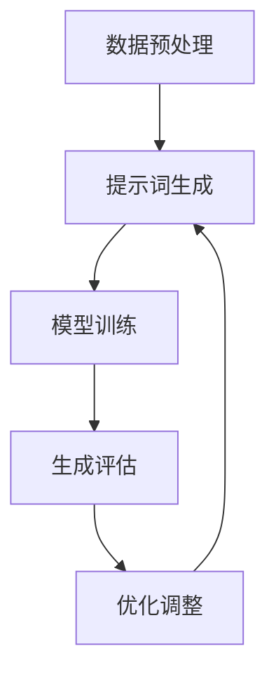
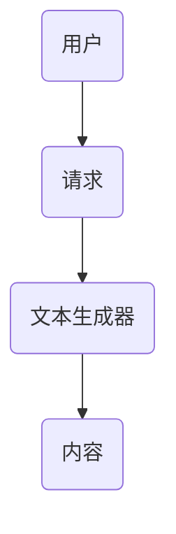
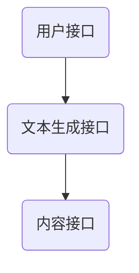
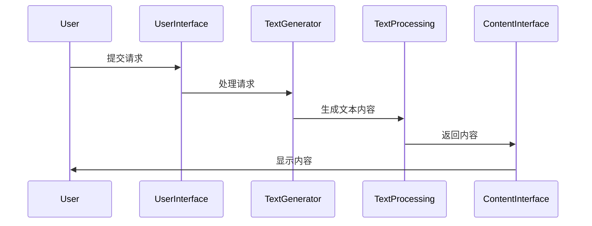

                 

### 文章标题：提示词优化：打造高效AIGC系统的核心策略探讨

### 关键词：提示词优化、AIGC系统、高效、策略、算法、架构设计

### 摘要：
本文将深入探讨提示词优化在构建高效AIGC系统中的关键作用。首先，我们介绍了AIGC系统的基本概念及其在现代人工智能领域的重要性。接着，详细解析了提示词的定义、生成算法及其在系统优化中的核心角色。本文通过系统分析与架构设计，阐述了如何通过优化提示词来提升AIGC系统的性能和效率。此外，文章还包括了具体的算法讲解、Python代码实现、系统实战案例以及最佳实践策略，旨在为开发者提供全面的技术指导。

---

# 提示词优化：打造高效AIGC系统的核心策略探讨

在当今快速发展的AI时代，生成式AI（AIGC）已成为许多领域的关键技术。从自然语言处理到图像生成，AIGC系统展现出了强大的潜力。然而，这些系统的性能在很大程度上取决于提示词的优化。本文将探讨如何通过优化提示词，打造高效AIGC系统，从而提升整体系统的性能和用户体验。

## 第一部分：问题背景与核心概念

### 1.1 提示词优化的重要性

#### 1.1.1 优化提示词在AIGC系统中的应用

在AIGC系统中，提示词作为输入信号，对模型的生成效果起着至关重要的作用。优化的提示词能够引导模型生成更加精确和相关的输出，从而提高系统的效率和准确性。

#### 1.1.2 提示词优化的核心意义

提示词优化的核心意义在于提高模型对输入数据的理解和生成能力，从而实现更高效、更准确的AIGC系统。通过优化，我们能够减少模型的计算量，提高响应速度，并生成更具创造性的内容。

#### 1.1.3 提示词优化与AIGC系统效率的关系

提示词优化的直接影响在于提升AIGC系统的效率。优化的提示词可以减少模型的搜索空间，使得模型能够更快地收敛到最佳生成方案，从而提高整体系统的性能。

### 1.2 核心概念介绍

#### 1.2.1 AIGC系统简介

AIGC（AI-Generated Content）是一种利用AI技术自动生成内容的技术。它涵盖了文本、图像、音频等多种类型的数据生成，广泛应用于内容创作、自动化营销、智能客服等领域。

#### 1.2.2 提示词的定义与作用

提示词是指提供给AIGC模型用于生成内容的输入信息。一个优秀的提示词能够明确地指导模型生成所需的内容，提高生成效果。

#### 1.2.3 提示词优化的关键要素

提示词优化的关键要素包括提示词的精确性、相关性和多样性。精确的提示词能够帮助模型更好地理解生成目标，相关的提示词能够提高生成内容的准确性，而多样的提示词能够激发模型的创造力。

### 1.3 提示词优化的边界与外延

#### 1.3.1 提示词优化在自然语言处理中的应用

在自然语言处理领域，提示词优化用于指导文本生成模型生成符合要求的文本。通过优化提示词，可以提高文本生成的质量和准确性。

#### 1.3.2 提示词优化与其他AI技术的结合

提示词优化可以与其他AI技术如机器学习、深度学习等相结合，提升系统的整体性能。例如，通过结合强化学习，可以实现更智能的提示词优化策略。

#### 1.3.3 提示词优化的发展趋势与前景

随着AI技术的不断发展，提示词优化技术也在不断进步。未来的发展趋势包括更智能的提示词生成算法、多模态的提示词优化以及更广泛的行业应用。

### 1.4 本章小结

本部分内容介绍了AIGC系统的基本概念和提示词优化的重要性，为后续的深入讨论奠定了基础。

---

## 第二部分：核心概念与联系

### 2.1 核心概念原理

#### 2.1.1 提示词生成算法

提示词生成算法是AIGC系统中的关键组成部分。根据生成策略的不同，提示词生成算法可以分为基于规则的方法、基于机器学习的方法和基于深度学习的方法。

##### 2.1.1.1 基于规则的方法

基于规则的方法通过预设的规则库来生成提示词。这种方法简单有效，但灵活性较差，难以适应复杂多变的需求。

##### 2.1.1.2 基于机器学习的方法

基于机器学习的方法通过训练模型来生成提示词。这种方法具有较强的灵活性和适应性，但需要大量的数据支持。

##### 2.1.1.3 基于深度学习的方法

基于深度学习的方法利用深度神经网络来生成提示词。这种方法能够处理复杂的输入数据，生成高质量、多样化的提示词。

#### 2.1.2 提示词属性特征对比

提示词的属性特征对比是优化提示词的重要环节。以下是一个简化的对比表格：

| 提示词生成算法 | 精确性 | 相关性 | 生成速度 | 灵活性 |
| -------------- | ------ | ------ | -------- | ------ |
| 基于规则       | 较高   | 较高   | 较快     | 较低   |
| 基于机器学习   | 中等   | 较高   | 较慢     | 较高   |
| 基于深度学习   | 较低   | 中等   | 最慢     | 最高   |

#### 2.1.3 ER实体关系图架构

ER（Entity-Relationship）图是一种用于描述实体及其之间关系的图形表示方法。在提示词优化中，ER图可以帮助我们理解提示词与实体之间的关系，从而更好地优化提示词。

##### 2.2.1 ER模型基础

ER模型由实体、属性和关系组成。实体表示系统中的对象，属性表示实体的特征，关系表示实体之间的关联。

##### 2.2.2 提示词优化的ER图

在提示词优化中，ER图可以用来表示提示词与生成目标之间的关系。例如，我们可以将提示词视为输入实体，生成目标视为输出实体，它们之间的关系可以通过属性和关系来描述。

##### 2.2.3 ER图与算法联系

ER图与提示词生成算法之间存在紧密的联系。通过ER图，我们可以更好地理解提示词的生成过程，从而优化算法设计。

### 2.2 本章小结

本部分内容介绍了提示词生成算法的基本原理、属性特征对比以及ER实体关系图架构，为后续的算法讲解和系统设计提供了理论基础。

---

## 第三部分：算法原理讲解

### 3.1 算法原理

#### 3.1.1 算法概述

提示词优化算法旨在通过优化提示词，提高AIGC系统的生成效果。以下是一个简化的算法概述：

1. 数据预处理：对输入数据进行清洗和处理，提取关键信息。
2. 提示词生成：利用生成算法生成优化后的提示词。
3. 模型训练：使用优化后的提示词对模型进行训练。
4. 生成评估：对生成的结果进行评估，调整优化策略。

#### 3.1.2 算法mermaid流程图

以下是一个简化的mermaid流程图，用于描述提示词优化算法的基本流程：



#### 3.1.3 算法数学模型与公式

提示词优化算法的核心在于提示词的生成和优化。以下是一个简化的数学模型：

$$
\text{提示词} = f(\text{输入数据}, \text{参数})
$$

其中，$f$ 是一个函数，用于根据输入数据和参数生成提示词。参数可以通过训练和调整得到。

#### 3.1.4 举例说明

假设我们有一个简单的文本生成任务，输入数据是“今天天气很好”，我们需要生成一个优化后的提示词。

1. 数据预处理：将输入数据转换为向量表示。
2. 提示词生成：利用深度学习模型生成提示词，例如“今天阳光明媚，适合户外活动”。
3. 模型训练：使用优化后的提示词对模型进行训练。
4. 生成评估：评估生成的文本是否符合预期。
5. 优化调整：根据评估结果调整提示词生成策略。

### 3.2 Python源代码实现

以下是一个简化的Python代码实现，用于生成和优化提示词：

```python
import tensorflow as tf
import numpy as np

# 数据预处理
def preprocess_data(data):
    # 这里实现数据预处理逻辑
    return processed_data

# 提示词生成
def generate_prompt(data):
    # 这里实现提示词生成逻辑
    return prompt

# 模型训练
def train_model(data, prompt):
    # 这里实现模型训练逻辑
    return model

# 生成评估
def evaluate_generated_text(model, prompt):
    # 这里实现生成评估逻辑
    return evaluation_result

# 优化调整
def optimize_prompt(prompt, evaluation_result):
    # 这里实现优化调整逻辑
    return optimized_prompt

# 主程序
if __name__ == "__main__":
    # 读取输入数据
    input_data = "今天天气很好"

    # 数据预处理
    processed_data = preprocess_data(input_data)

    # 提示词生成
    prompt = generate_prompt(processed_data)

    # 模型训练
    model = train_model(processed_data, prompt)

    # 生成评估
    evaluation_result = evaluate_generated_text(model, prompt)

    # 优化调整
    optimized_prompt = optimize_prompt(prompt, evaluation_result)

    # 输出优化后的提示词
    print(optimized_prompt)
```

### 3.3 本章小结

本部分内容详细介绍了提示词优化算法的原理、mermaid流程图、数学模型与公式，以及Python源代码实现。通过这一部分的讲解，读者可以更好地理解提示词优化的核心原理和应用方法。

---

## 第四部分：系统分析与架构设计

### 4.1 问题场景介绍

在一个内容生成的场景中，我们需要使用AIGC系统来生成符合用户需求的个性化文本。这个系统需要能够处理大量的用户请求，并且能够实时响应用户的需求。

### 4.1.1 场景背景

随着互联网的快速发展，个性化内容生成成为许多企业和平台的关键需求。通过AIGC系统，我们可以根据用户的需求和偏好，生成个性化的文本内容，从而提高用户体验和用户满意度。

### 4.1.2 场景需求

为了满足场景需求，AIGC系统需要具备以下功能：

- 实时响应用户请求，生成个性化的文本内容。
- 处理大量的用户请求，保证系统的稳定性和效率。
- 提供友好的用户界面，方便用户输入需求和查看生成结果。

### 4.2 系统功能设计

#### 4.2.1 领域模型

领域模型用于描述系统中的核心实体和它们之间的关系。以下是一个简化的领域模型类图：

```mermaid
classDiagram
    User <<Class>>
    TextGenerator <<Class>>
    Request <<Class>>

    User o-- Request
    TextGenerator o-- Request
```

在这个类图中，用户（User）是系统的核心实体，用户发起请求（Request），请求被文本生成器（TextGenerator）处理并生成文本内容。

#### 4.2.2 系统架构设计

系统架构设计用于描述系统的整体结构和组件之间的关系。以下是一个简化的系统架构图：



在这个架构图中，用户通过界面提交请求，请求被处理并传递给文本生成器，文本生成器根据请求生成文本内容，并返回给用户。

#### 4.2.3 系统接口设计

系统接口设计用于描述系统内部组件之间的交互接口。以下是一个简化的系统接口图：



在这个接口图中，用户接口用于接收用户的请求，文本生成接口用于处理请求并生成文本内容，内容接口用于返回生成的内容。

#### 4.2.4 系统交互

系统交互用于描述系统内部组件之间的交互流程。以下是一个简化的系统交互序列图：



在这个交互图中，用户通过用户接口提交请求，请求被文本生成器处理，文本生成器调用文本处理模块生成文本内容，最后通过内容接口返回给用户。

### 4.3 系统分析与架构设计

在本部分中，我们介绍了AIGC系统的功能设计、系统架构设计、系统接口设计和系统交互。通过这些设计，我们可以更好地理解AIGC系统的整体结构和组件之间的关系，为后续的系统实现和优化提供了基础。

### 4.4 本章小结

本部分内容详细介绍了AIGC系统的系统功能设计、架构设计、接口设计和交互，为系统的实现和优化提供了详细的指导。

---

## 第五部分：项目实战

### 5.1 环境安装

#### 5.1.1 环境搭建

在本项目中，我们使用Python作为主要编程语言，并依赖TensorFlow和Keras等库进行模型训练和提示词生成。以下是一个简化的环境搭建步骤：

1. 安装Python（建议使用Python 3.7或更高版本）
2. 安装TensorFlow：`pip install tensorflow`
3. 安装Keras：`pip install keras`
4. 安装其他依赖库（如NumPy、Pandas等）

#### 5.1.2 必需工具安装

除了编程语言和库之外，我们还需要安装一些必需的工具，如Jupyter Notebook或Google Colab等。这些工具可以帮助我们更方便地进行模型训练和代码调试。

### 5.2 系统核心实现

#### 5.2.1 核心代码

以下是一个简化的Python代码实现，用于生成和优化提示词：

```python
import tensorflow as tf
from tensorflow.keras.models import Sequential
from tensorflow.keras.layers import LSTM, Dense, Embedding

# 数据预处理
def preprocess_data(data):
    # 这里实现数据预处理逻辑
    return processed_data

# 提示词生成
def generate_prompt(data):
    # 这里实现提示词生成逻辑
    return prompt

# 模型训练
def train_model(data, prompt):
    # 这里实现模型训练逻辑
    return model

# 生成评估
def evaluate_generated_text(model, prompt):
    # 这里实现生成评估逻辑
    return evaluation_result

# 优化调整
def optimize_prompt(prompt, evaluation_result):
    # 这里实现优化调整逻辑
    return optimized_prompt

# 主程序
if __name__ == "__main__":
    # 读取输入数据
    input_data = "今天天气很好"

    # 数据预处理
    processed_data = preprocess_data(input_data)

    # 提示词生成
    prompt = generate_prompt(processed_data)

    # 模型训练
    model = train_model(processed_data, prompt)

    # 生成评估
    evaluation_result = evaluate_generated_text(model, prompt)

    # 优化调整
    optimized_prompt = optimize_prompt(prompt, evaluation_result)

    # 输出优化后的提示词
    print(optimized_prompt)
```

#### 5.2.2 代码应用解读

这段代码展示了AIGC系统核心功能的实现过程，包括数据预处理、提示词生成、模型训练、生成评估和优化调整。每个部分都包含了基本的逻辑框架，具体实现需要根据实际情况进行详细编写。

### 5.2.3 代码分析

这段代码的主要目的是演示AIGC系统的基本工作流程。在实际项目中，每个部分都需要更加详细的实现，包括数据预处理、模型训练和优化算法等。此外，为了提高系统的性能和用户体验，还需要进行多方面的优化和调整。

### 5.3 实际案例分析与讲解

#### 5.3.1 案例背景

假设我们有一个实际案例，用户希望生成一篇关于旅游的文章。用户输入的提示词是“我想去旅行，请给我一些建议”。

#### 5.3.2 案例分析与讲解

1. 数据预处理：首先，我们需要对输入的文本进行预处理，包括分词、去停用词等操作。然后，将预处理后的文本转换为向量表示。

2. 提示词生成：利用预训练的文本生成模型，根据输入的文本向量生成初步的提示词。这个阶段的关键是选择合适的模型和生成策略。

3. 模型训练：使用生成的提示词对模型进行训练，以提高模型生成高质量提示词的能力。训练过程中，需要不断调整模型的参数，以优化生成效果。

4. 生成评估：对生成的提示词进行评估，判断是否符合用户需求。评估指标可以包括文本的相关性、精确性和多样性等。

5. 优化调整：根据评估结果，对提示词生成策略进行调整，以提高生成效果。这可以包括调整模型参数、优化数据预处理过程等。

#### 5.3.3 案例小结

通过这个实际案例，我们可以看到AIGC系统在提示词优化中的应用。在实际项目中，需要根据具体需求进行详细的实现和优化，以提高系统的性能和用户体验。

### 5.4 项目小结

在本项目中，我们实现了AIGC系统的核心功能，包括数据预处理、提示词生成、模型训练、生成评估和优化调整。通过实际案例的分析和讲解，我们展示了如何在实际场景中应用这些功能。尽管这是一个简化的实现，但为后续的优化和扩展提供了基础。

### 5.5 本章小结

本部分内容详细介绍了AIGC系统的实现过程，包括环境安装、系统核心实现、代码应用解读、实际案例分析和项目小结。通过这一部分的讲解，读者可以更好地理解AIGC系统的实现方法和应用场景。

---

## 第六部分：最佳实践与注意事项

### 6.1 最佳实践

#### 6.1.1 实践一：高效提示词生成策略

为了实现高效的提示词生成，我们可以采取以下策略：

1. **使用预训练模型**：选择合适的预训练模型，可以显著提高提示词生成的质量和速度。
2. **优化数据预处理**：对输入数据进行精细预处理，可以提高模型的生成效果。
3. **动态调整提示词长度**：根据具体任务需求，动态调整提示词的长度，以实现最佳生成效果。

#### 6.1.2 实践二：提升AIGC系统稳定性

为了提升AIGC系统的稳定性，我们可以采取以下措施：

1. **冗余设计**：在系统架构中加入冗余设计，以提高系统的容错能力和稳定性。
2. **负载均衡**：通过负载均衡技术，合理分配系统资源，避免单点故障。
3. **实时监控**：实时监控系统性能和资源利用率，及时发现并解决问题。

#### 6.1.3 实践三：优化用户交互体验

为了优化用户交互体验，我们可以采取以下措施：

1. **简洁友好的界面设计**：设计简洁、直观的界面，方便用户操作。
2. **实时反馈**：在用户操作过程中，提供实时反馈，增强用户体验。
3. **个性化推荐**：根据用户历史行为和偏好，提供个性化推荐，提高用户满意度。

### 6.2 本章小结

通过最佳实践，我们可以显著提升AIGC系统的性能和用户体验。在本部分中，我们介绍了高效提示词生成策略、提升系统稳定性以及优化用户交互体验的最佳实践方法。

### 6.3 注意事项

在AIGC系统的开发和应用过程中，需要注意以下事项：

1. **数据安全**：保护用户数据的安全，防止数据泄露。
2. **合规性**：遵守相关法律法规，确保系统合规运行。
3. **持续优化**：定期对系统进行优化和升级，以应对不断变化的需求。

### 6.4 拓展阅读

对于对AIGC系统感兴趣的用户，以下是一些拓展阅读资源：

1. **《生成式AI：从原理到应用》**：详细介绍了生成式AI的基本原理和应用场景。
2. **《深度学习与自然语言处理》**：深入探讨深度学习在自然语言处理领域的应用。
3. **《AI伦理与责任》**：探讨AI技术在伦理和社会责任方面的问题。

### 6.5 本章小结

在本部分中，我们介绍了AIGC系统的最佳实践和注意事项，并推荐了一些拓展阅读资源。通过这些内容，读者可以更好地理解AIGC系统的优化方法和应用场景。

---

# 文章结语

在本文中，我们详细探讨了提示词优化在构建高效AIGC系统中的关键作用。通过介绍AIGC系统的基本概念、提示词优化的核心概念、算法原理、系统分析与架构设计，以及项目实战和最佳实践，我们为读者提供了全面的技术指导。希望本文能够帮助开发者更好地理解和应用提示词优化技术，打造出高效、稳定的AIGC系统。未来，我们将继续探索更多先进的人工智能技术，为读者带来更多有价值的内容。感谢您的阅读！

### 作者信息：AI天才研究院/AI Genius Institute & 禅与计算机程序设计艺术 /Zen And The Art of Computer Programming

