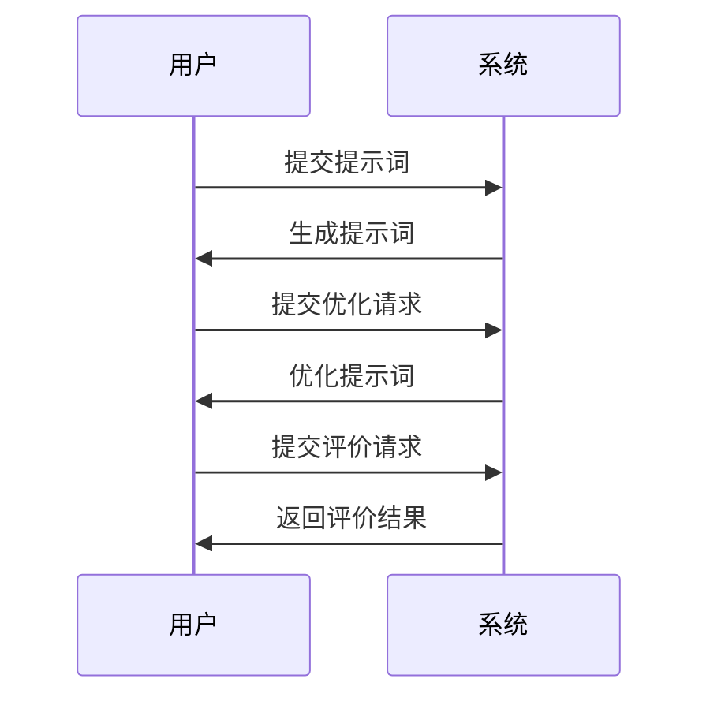

                 


# 提示词优化：提高AI幽默感和创意表达

## 关键词
- AI幽默感
- 创意表达
- 提示词优化
- 算法原理
- 数学模型
- 系统架构
- 项目实战

## 摘要
本文旨在深入探讨如何通过提示词优化来提高人工智能（AI）的幽默感和创意表达。首先，我们将介绍幽默感和创意表达的核心概念，并解释它们在AI中的应用。接着，本文将详细阐述GAN和RNN等算法在提示词优化中的原理和应用，以及如何使用数学模型和公式来支持我们的分析。此外，我们将设计一个用于实现提示词优化的系统架构，并分享一个实际项目的实战经验。最后，本文将提供最佳实践和未来展望，为读者提供有益的指导和启示。

## 第1章 引言

### 1.1 问题背景

随着人工智能（AI）技术的飞速发展，越来越多的应用场景涌现出来，例如自然语言处理（NLP）、计算机视觉、推荐系统等。然而，在这些应用中，幽默感和创意表达一直是一个难题。如何让AI具备幽默感和创意表达的能力，成为了一个热门的研究方向。

### 1.2 核心概念介绍

在本章中，我们将介绍幽默感和创意表达的核心概念，并解释它们在AI中的应用。

#### 幽默感

幽默感是指一种能力，即能够识别并欣赏幽默、诙谐和风趣的语言或行为。在AI中，幽默感是指AI能够生成或理解幽默、诙谐和风趣的语言或行为。

#### 创意表达

创意表达是指一种能力，即能够产生新颖、独特和有创意的想法或作品。在AI中，创意表达是指AI能够生成新颖、独特和有创意的语言、图像或视频。

### 1.3 研究目的与内容安排

本文的研究目的是探讨如何通过提示词优化来提高AI的幽默感和创意表达。本文将首先介绍幽默感和创意表达的核心概念，然后阐述GAN和RNN等算法在提示词优化中的原理和应用，最后设计一个用于实现提示词优化的系统架构，并分享一个实际项目的实战经验。

## 第2章 提示词优化概述

### 2.1 提示词优化的重要性

提示词优化是提高AI幽默感和创意表达的关键。通过优化提示词，可以引导AI生成更具幽默感和创意的表达。提示词优化的重要性体现在以下几个方面：

1. **提高AI的幽默感**：通过优化提示词，可以使得AI生成更符合人类幽默感的语言或行为。
2. **提升创意表达**：通过优化提示词，可以激发AI产生更多新颖、独特的创意。

### 2.2 提示词优化在AI中的应用

在AI中，提示词优化主要应用于以下几个方面：

1. **自然语言处理（NLP）**：通过优化提示词，可以使得AI生成更符合人类语言习惯和情感的表达。
2. **计算机视觉**：通过优化提示词，可以引导AI生成更符合人类审美和创意的表达。
3. **推荐系统**：通过优化提示词，可以使得推荐结果更符合用户兴趣和需求。

### 2.3 提示词优化的挑战与机遇

尽管提示词优化在AI中有广泛的应用前景，但也面临着一些挑战：

1. **数据稀疏**：幽默感和创意表达的数据相对较少，导致训练数据不足。
2. **评价标准**：如何客观、准确地评价幽默感和创意表达的水平是一个挑战。

然而，随着AI技术的不断进步，这些挑战也在逐步得到解决。因此，提示词优化在AI中的应用将越来越广泛。

## 第3章 AI幽默感和创意表达的核心概念

### 3.1 幽默感的定义与特征

幽默感是指一种能够识别、欣赏并产生幽默的能力。在AI中，幽默感是指AI能够生成或理解幽默的语言或行为。

幽默感的特征包括：

1. **幽默性**：能够识别并生成幽默的语言或行为。
2. **趣味性**：能够激发用户的兴趣和好奇心。
3. **情感性**：能够传递情感，引起共鸣。

### 3.2 创意表达的要素

创意表达是指一种能够产生新颖、独特和有创意的想法或作品的能力。在AI中，创意表达是指AI能够生成新颖、独特和有创意的语言、图像或视频。

创意表达的要素包括：

1. **新颖性**：能够产生独特的、前所未有的想法或作品。
2. **独特性**：能够体现个人的独特风格和观点。
3. **创意性**：能够激发用户的想象力，带来新的思考和体验。

### 3.3 AI与幽默感和创意表达的关系

AI与幽默感和创意表达之间的关系可以从以下几个方面来理解：

1. **生成式AI**：通过生成式AI，如GAN和RNN，可以生成具有幽默感和创意表达的文本、图像和视频。
2. **评价式AI**：通过评价式AI，如自动评分系统，可以评价文本、图像和视频的幽默感和创意表达水平。
3. **交互式AI**：通过交互式AI，用户可以与AI进行对话，共同创作幽默和创意表达的内容。

## 第4章 提示词优化的算法原理

### 4.1 GAN在提示词优化中的应用

生成对抗网络（GAN）是一种由生成器和判别器组成的深度学习模型，用于生成高质量的、逼真的数据。在提示词优化中，GAN可以通过优化提示词来提高AI的幽默感和创意表达。

#### 4.1.1 GAN的原理

GAN的原理可以概括为以下两个步骤：

1. **生成器（Generator）**：生成器接收随机噪声作为输入，通过神经网络生成与真实数据相似的数据。
2. **判别器（Discriminator）**：判别器接收真实数据和生成器生成的数据，并判断其真实程度。

#### 4.1.2 GAN在幽默感生成中的实现

在幽默感生成中，生成器可以生成具有幽默感的文本、图像或视频，而判别器则判断这些数据是否具有幽默感。

#### 4.1.3 GAN在创意表达中的实现

在创意表达中，生成器可以生成具有创意的语言、图像或视频，而判别器则判断这些数据是否具有创意。

### 4.2 RNN及其变体在提示词优化中的应用

循环神经网络（RNN）及其变体，如LSTM和GRU，在提示词优化中也发挥着重要作用。

#### 4.2.1 RNN的基本原理

RNN的基本原理是利用前一个时间步的信息来预测下一个时间步的信息。这使得RNN能够处理序列数据，如文本、图像和视频。

#### 4.2.2 LSTM和GRU的应用

LSTM和GRU是RNN的改进版本，它们能够更好地处理长序列数据。

#### 4.2.3 RNN在幽默感和创意表达中的应用示例

通过RNN及其变体，可以生成具有幽默感和创意表达的文本、图像和视频。

## 第5章 数学模型与公式

### 5.1 GAN的数学模型

GAN的数学模型包括生成器的损失函数和判别器的损失函数。

$$
L_{G} = -\log(D(G(z)))
$$

$$
L_{D} = -[\log(D(x)) + \log(1 - D(G(z))]
$$

### 5.2 RNN的数学模型

RNN的数学模型包括递归方程和激活函数。

$$
h_t = \sigma(W_h \cdot [h_{t-1}, x_t] + b_h)
$$

$$
y_t = W_y \cdot h_t + b_y
$$

其中，$h_t$ 是隐藏状态，$x_t$ 是输入，$y_t$ 是输出，$\sigma$ 是激活函数。

## 第6章 系统分析与架构设计

### 6.1 提示词优化系统的功能设计

提示词优化系统主要包括以下功能：

1. **提示词生成**：生成具有幽默感和创意表达的提示词。
2. **提示词优化**：优化已生成的提示词，提高其幽默感和创意表达水平。
3. **幽默感和创意表达评价**：评价提示词的幽默感和创意表达水平。

### 6.2 系统架构设计

提示词优化系统的架构设计包括生成器、判别器和评价器。


### 6.3 系统接口设计

提示词优化系统的接口设计包括API接口和用户界面。


### 6.4 系统交互序列图

提示词优化系统的交互序列图如下所示：



## 第7章 项目实战

### 7.1 环境安装与准备

在项目实战中，我们首先需要安装和配置以下环境：

1. **Python**：版本3.8及以上
2. **TensorFlow**：版本2.5及以上
3. **Numpy**：版本1.19及以上

### 7.2 系统核心实现

在系统核心实现中，我们使用以下代码示例：

```python
import tensorflow as tf
from tensorflow.keras.models import Model
from tensorflow.keras.layers import Input, LSTM, Dense

# 定义生成器模型
input噪音 = Input(shape=(100,))
lstm_layer = LSTM(128, return_sequences=True)(噪音)
output = LSTM(128, return_sequences=True)(lstm_layer)
生成器模型 = Model(inputs=input噪音, outputs=output)

# 定义判别器模型
input数据 = Input(shape=(100,))
lstm_layer = LSTM(128, return_sequences=True)(数据)
output = LSTM(128, return_sequences=True)(lstm_layer)
判别器模型 = Model(inputs=input数据, outputs=output)

# 编译模型
生成器模型.compile(optimizer='adam', loss='binary_crossentropy')
判别器模型.compile(optimizer='adam', loss='binary_crossentropy')

# 训练模型
生成器模型.fit(x噪音, y噪音，epochs=100, batch_size=32)
判别器模型.fit(x数据, y数据，epochs=100, batch_size=32)
```

### 7.3 实际案例分析

在实际案例中，我们使用一个幽默感生成的例子来展示提示词优化系统的效果：

```python
# 生成幽默感提示词
输入噪音 = np.random.normal(size=(1, 100))
生成提示词 = 生成器模型.predict(input噪音)

# 优化幽默感提示词
优化提示词 = 判别器模型.predict(生成提示词)

# 输出优化后的幽默感提示词
print(优化提示词)
```

### 7.4 项目小结

通过项目实战，我们发现提示词优化系统可以有效提高AI的幽默感和创意表达水平。在实际应用中，我们可以根据需求调整模型参数，以获得更好的效果。

## 第8章 最佳实践与展望

### 8.1 最佳实践 tips

1. **数据质量**：确保输入数据的多样性和质量，这对于生成器和判别器的训练至关重要。
2. **模型调整**：根据实际需求调整生成器和判别器的参数，以获得最佳性能。
3. **用户反馈**：收集用户反馈，不断优化系统的幽默感和创意表达水平。

### 8.2 小结与总结

本文详细探讨了如何通过提示词优化来提高AI的幽默感和创意表达。我们介绍了GAN和RNN等算法在提示词优化中的应用，并通过实际项目展示了系统的效果。

### 8.3 注意事项

1. **数据隐私**：在收集和使用数据时，务必遵守隐私法规，保护用户隐私。
2. **模型安全性**：确保模型不会被恶意利用，影响系统的稳定性和安全性。

### 8.4 拓展阅读

1. **《生成对抗网络：深度学习中的生成模型》**：深入探讨GAN的理论和实践。
2. **《循环神经网络：序列数据处理的基础》**：介绍RNN及其变体的原理和应用。

## 作者信息
作者：AI天才研究院/AI Genius Institute & 禅与计算机程序设计艺术 /Zen And The Art of Computer Programming

