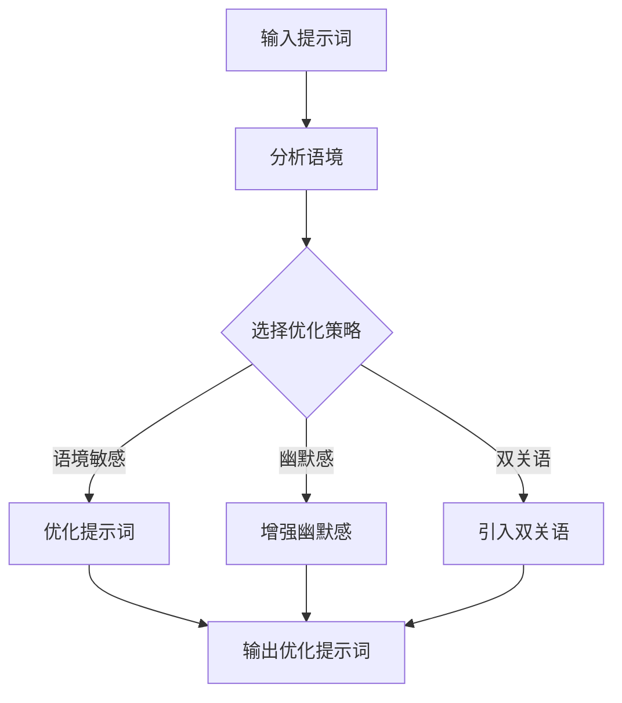
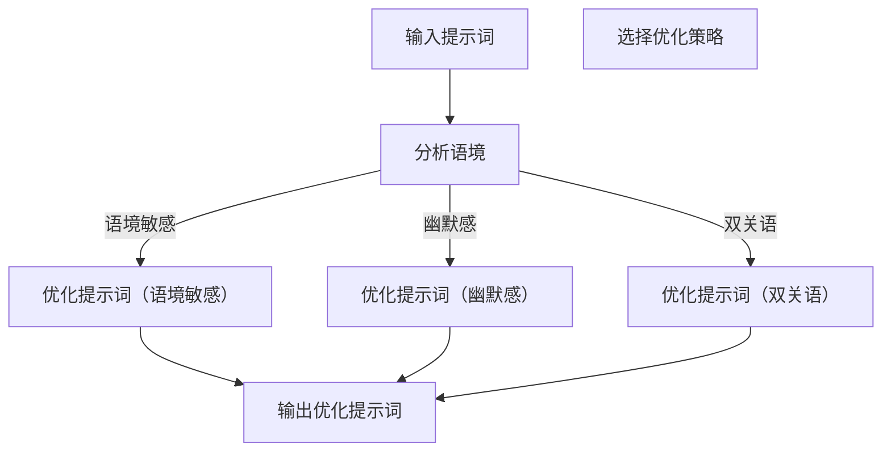
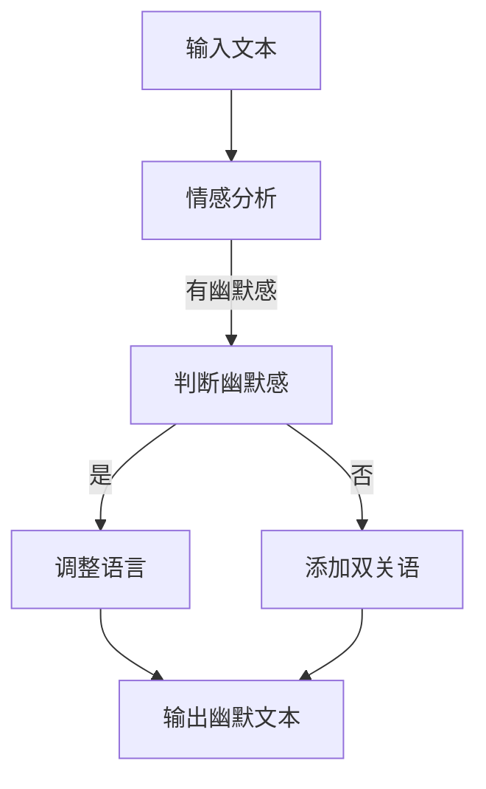
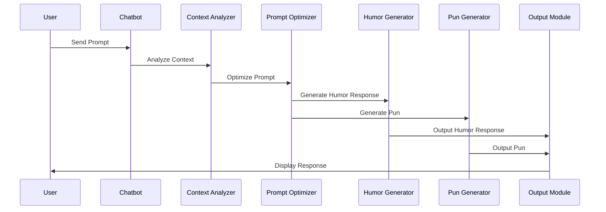

                 

### 文章标题：提示词优化：提高AI幽默感和双关语创作能力

#### 关键词：AI幽默感，双关语创作，提示词优化，自然语言处理，算法

#### 摘要：
本文深入探讨了如何通过提示词优化来提升人工智能（AI）在幽默感和双关语创作方面的能力。首先，我们介绍了AI在幽默感和双关语创作中面临的挑战及其背景，接着明确了提示词优化的目标和策略。通过详细分析核心概念与联系，我们展示了提示词优化的基本原理，包括算法流程图和Python源代码实现。最后，本文提出了幽默感和双关语创作算法，结合实际案例进行了详细讲解和分析。通过本文的阐述，读者可以了解如何通过技术手段提高AI在幽默和语言游戏领域的表现。

### 第一部分：引言

#### 1.1 问题背景

##### 1.1.1 AI在幽默感和双关语创作中的挑战

随着人工智能技术的快速发展，AI在各个领域的应用日益广泛。然而，在幽默感和双关语创作方面，AI仍然面临着诸多挑战。幽默感作为一种复杂的人类情感表达方式，涉及到语言、情境、情感等多方面的因素。双关语则更是利用语言的歧义性来达到幽默效果，这对AI提出了更高的要求。

在目前的AI系统中，幽默感往往被简单化为简单的笑话或段子，缺乏深度和多样性。双关语的创作则需要AI具有出色的语言理解和生成能力，以及对文化背景和语境的深刻理解。这些挑战不仅限制了AI在娱乐领域的应用，也影响了其在其他领域，如教育、心理咨询等中的表现。

##### 1.1.2 提示词优化的重要性

提示词（Prompt）在AI系统中起着至关重要的作用。它们是引导AI模型生成响应的关键输入。通过优化提示词，可以有效地提升AI的生成能力，特别是在幽默感和双关语创作方面。提示词优化不仅能够提高AI对上下文的理解，还能够增强其创造性和多样性。

在幽默感方面，优化提示词可以使AI更准确地捕捉到幽默的时机和场合，从而生成更具创意和趣味的响应。在双关语创作方面，优化提示词可以帮助AI更好地理解语言的歧义性，从而创作出更加精妙的双关语。

#### 1.2 问题描述

##### 1.2.1 幽默感和双关语创作的要求

幽默感和双关语创作对AI提出了以下要求：

1. **语境敏感性**：AI需要能够根据对话的上下文和情境来生成幽默的响应。
2. **情感表达**：幽默感的核心在于情感的传达，AI需要能够理解并表达出幽默的情感。
3. **语言技巧**：双关语的创作需要AI具备出色的语言理解能力和创造力，能够巧妙地运用语言技巧。

##### 1.2.2 提示词优化的目标

提示词优化的目标主要包括：

1. **提高语境敏感性**：通过调整提示词，使AI更准确地理解上下文，从而生成更符合情境的幽默响应。
2. **增强幽默感**：优化提示词，使AI能够更好地捕捉幽默的时机和元素，生成更具创意和趣味的幽默内容。
3. **提高双关语创作能力**：通过调整提示词，使AI能够更好地理解和运用语言的歧义性，创作出更精妙的双关语。

#### 1.3 问题解决

##### 1.3.1 提示词优化的基本方法

提示词优化的基本方法包括：

1. **语境敏感性优化**：通过引入更多的上下文信息，调整提示词的表述方式，使AI能够更准确地理解语境。
2. **幽默感增强**：通过引入幽默模板、笑话库等资源，丰富AI的幽默素材库，从而提高幽默创作的质量。
3. **双关语创作**：通过分析双关语的构成和特点，设计相应的提示词优化策略，帮助AI更好地理解和创作双关语。

##### 1.3.2 提高AI幽默感和双关语创作能力的策略

为了提高AI的幽默感和双关语创作能力，可以采取以下策略：

1. **数据驱动的优化**：利用大量的幽默和双关语数据，通过机器学习算法对提示词进行优化。
2. **多模态学习**：结合文本、语音、图像等多模态信息，提高AI对幽默和双关语的理解和创作能力。
3. **跨域迁移学习**：通过跨不同领域的数据迁移，提高AI在不同情境下的幽默感和双关语创作能力。

#### 1.4 边界与外延

##### 1.4.1 幽默感和双关语的边界

幽默感和双关语的创作存在一定的边界。过度的幽默或双关语可能导致理解障碍或负面效果。因此，在创作过程中需要掌握合适的度。

1. **文化差异**：不同文化背景下的幽默和双关语可能存在较大差异，需要考虑目标受众的文化背景。
2. **情境适应性**：幽默和双关语需要根据不同的情境进行适应性调整，以达到最佳效果。

##### 1.4.2 提示词优化的应用场景

提示词优化在以下场景中具有广泛的应用：

1. **聊天机器人**：通过优化提示词，使聊天机器人能够生成更具创意和幽默性的对话。
2. **娱乐内容生成**：利用提示词优化，为娱乐内容生成系统提供高质量、有创意的幽默和双关语。
3. **教育领域**：通过优化提示词，提高教育系统中幽默和双关语的教学效果。

#### 1.5 概念结构与核心要素组成

##### 1.5.1 提示词优化的核心概念

提示词优化的核心概念包括：

1. **语境敏感性**：根据上下文信息调整提示词，以提高AI的理解能力。
2. **幽默感**：通过引入幽默元素，提高AI生成幽默内容的能力。
3. **双关语创作**：利用语言的歧义性，创作出有趣的双关语。

##### 1.5.2 提高AI幽默感和双关语创作能力的关键要素

提高AI幽默感和双关语创作能力的关键要素包括：

1. **大量数据**：通过收集和利用大量的幽默和双关语数据，提高AI的生成能力。
2. **机器学习算法**：利用先进的机器学习算法，对提示词进行优化。
3. **多模态学习**：结合文本、语音、图像等多模态信息，提高AI的综合理解能力。

#### 1.6 本章小结

本部分介绍了AI在幽默感和双关语创作中面临的挑战以及提示词优化的重要性。通过明确幽默感和双关语创作的要求，我们提出了提示词优化的目标和策略。这些基础概念为后续的详细探讨提供了必要的背景和框架。

---

### 第二部分：核心概念与联系

#### 2.1 核心概念原理

##### 2.1.1 提示词优化的基本原理

提示词优化的基本原理主要包括：

1. **语境敏感性**：通过调整提示词的表述方式，使其更符合上下文信息，从而提高AI的理解能力。
2. **幽默感**：通过引入幽默元素，使AI能够生成更具创意和趣味的幽默内容。
3. **双关语创作**：通过理解语言的歧义性，创作出有趣的双关语。

##### 2.1.2 幽默感和双关语创作的原理

幽默感和双关语创作的原理主要包括：

1. **情感表达**：通过情感的表达，引起受众的共鸣和笑声。
2. **语言技巧**：通过巧妙地运用语言技巧，如双关、比喻等，达到幽默的效果。
3. **情境适应性**：根据不同的情境，调整幽默和双关语的表达方式，以达到最佳效果。

#### 2.2 概念属性特征对比表格

| 概念           | 特征               | 说明                                                         |
|----------------|--------------------|------------------------------------------------------------|
| 提示词优化     | 语境敏感性         | 能够根据上下文优化提示词的选择。                           |
| 幽默感         | 情感表达           | 强调情感的传达，以引起笑意。                             |
| 双关语         | 语言技巧           | 利用语言的歧义性，达到幽默效果。                         |

#### 2.3 ER实体关系图架构

```mermaid
erDiagram
    A[提示词] ||--|{ B[语境]}
    B ||--|{ C[幽默感]}
    B ||--|{ D[双关语]}
```

在这个ER实体关系图中，提示词（A）是核心实体，它通过关系（B）与语境、幽默感和双关语相连。语境（B）是上下文信息，直接影响幽默感和双关语的创作。幽默感（C）和双关语（D）则是通过语言技巧和歧义性来实现的幽默表达形式。

#### 2.4 本章小结

本部分详细介绍了提示词优化的核心概念和幽默感、双关语创作的原理。通过概念属性特征对比表格和ER实体关系图，我们更加清晰地理解了这些概念之间的联系。这些核心概念和联系为后续的算法原理讲解奠定了基础。

---

### 第三部分：算法原理讲解

#### 3.1 算法原理

##### 3.1.1 提示词优化算法

提示词优化算法的目标是提高AI在幽默感和双关语创作方面的能力。其基本原理包括：

1. **语境敏感性**：通过分析上下文信息，优化提示词的选择，使其更符合对话的情境。
2. **幽默感增强**：利用幽默模板、笑话库等资源，丰富AI的幽默素材库，提高幽默创作的质量。
3. **双关语创作**：通过理解语言的歧义性，创作出有趣的双关语。

以下是一个简单的算法流程图：



在这个流程图中，输入提示词（A）首先被分析上下文（B）。根据上下文分析的结果，选择相应的优化策略（C），可以是语境敏感、幽默感增强或双关语引入。最终的优化提示词（G）将被输出，用于生成幽默或双关语的响应。

##### 3.1.1.1 算法流程图

为了更直观地展示算法流程，我们可以使用Mermaid语言来绘制：



##### 3.1.1.2 Python源代码实现

以下是一个简单的Python代码示例，用于实现提示词优化算法：

```python
def optimize_prompt(prompt, context, strategy='contextual'):
    # 根据策略优化提示词
    if strategy == 'contextual':
        # 语境敏感优化
        optimized_prompt = context_sensitive_optimization(prompt, context)
    elif strategy == 'humor':
        # 增强幽默感
        optimized_prompt = enhance_humor(prompt, context)
    elif strategy == 'play_on_words':
        # 引入双关语
        optimized_prompt = play_on_words_optimization(prompt, context)
    return optimized_prompt

# 示例使用
prompt = "今天天气真好。"
context = "你今天打算做什么？"
optimized_prompt = optimize_prompt(prompt, context, strategy='humor')
print(optimized_prompt)
```

在这个示例中，`optimize_prompt`函数根据输入的提示词、上下文和优化策略，调用不同的优化函数，最终返回优化后的提示词。用户可以通过选择不同的策略，实现不同的优化效果。

##### 3.1.2 幽默感和双关语创作算法

幽默感和双关语创作算法的目标是生成具有幽默感和双关语的文本。其基本原理包括：

1. **情感分析**：分析输入文本的情感，确定幽默的基调。
2. **幽默元素引入**：根据情感分析的结果，引入幽默元素，如笑话、比喻等。
3. **双关语创作**：利用语言的歧义性，创作出双关语。

以下是一个简单的算法流程图：



在这个流程图中，输入文本（A）首先被进行情感分析（B）。根据情感分析的结果，判断文本是否具有幽默感（C）。如果文本具有幽默感，则进行语言调整（D），引入幽默元素，生成幽默文本（F）。如果文本不具有幽默感，则尝试添加双关语（E），以提升文本的趣味性。

##### 3.1.2.1 算法流程图

为了更直观地展示算法流程，我们可以使用Mermaid语言来绘制：


##### 3.1.2.2 Python源代码实现

以下是一个简单的Python代码示例，用于实现幽默感和双关语创作算法：

```python
def generate_humor(text):
    # 情感分析
    sentiment = analyze_sentiment(text)
    
    # 判断幽默感
    if sentiment['humor']:
        # 调整语言
        humor_text = adjust_language(text)
    else:
        # 添加双关语
        humor_text = add_pun(text)
    
    return humor_text

# 示例使用
text = "今天天气真好。"
humor_text = generate_humor(text)
print(humor_text)
```

在这个示例中，`generate_humor`函数首先进行情感分析，判断文本是否具有幽默感。如果文本具有幽默感，则进行语言调整；否则，添加双关语。最终返回生成的幽默文本。

#### 3.2 算法原理详细讲解

##### 3.2.1 提示词优化算法

提示词优化算法的核心是提高AI在幽默感和双关语创作方面的表现。其基本原理包括：

1. **语境敏感性**：通过分析上下文信息，优化提示词的选择，使其更符合对话的情境。
2. **幽默感增强**：利用幽默模板、笑话库等资源，丰富AI的幽默素材库，提高幽默创作的质量。
3. **双关语创作**：通过理解语言的歧义性，创作出有趣的双关语。

在实现过程中，我们可以采用以下步骤：

1. **输入提示词**：接收用户输入的提示词。
2. **分析上下文**：利用自然语言处理技术，分析对话的上下文信息，包括用户的历史对话记录、当前对话情境等。
3. **选择优化策略**：根据上下文分析的结果，选择合适的优化策略。可能的策略包括：
   - **语境敏感**：调整提示词，使其更符合当前对话的情境。
   - **幽默感增强**：引入幽默元素，如笑话、比喻等，提升提示词的趣味性。
   - **双关语创作**：利用语言的歧义性，创作出双关语。

4. **生成优化提示词**：根据选择的优化策略，生成优化后的提示词。输出优化后的提示词，供AI模型进行下一步的响应生成。

以下是详细的算法原理和公式：

$$
Optimized\ Prompt = f(Context, Strategy)
$$

其中，$Optimized\ Prompt$表示优化后的提示词，$Context$表示上下文信息，$Strategy$表示优化策略。

对于语境敏感的优化策略，公式可以表示为：

$$
Optimized\ Prompt_{contextual} = g(Context, Prompt)
$$

其中，$g$函数用于根据上下文信息调整提示词的选择。

对于幽默感增强的优化策略，公式可以表示为：

$$
Optimized\ Prompt_{humor} = h(Jokes, Prompt)
$$

其中，$h$函数用于引入幽默元素，$Jokes$表示幽默素材库。

对于双关语创作的优化策略，公式可以表示为：

$$
Optimized\ Prompt_{play_on_words} = k(Puns, Prompt)
$$

其中，$k$函数用于创作双关语，$Puns$表示双关语素材库。

在实际应用中，我们可以通过以下步骤来实施这些算法：

1. **初始化上下文信息**：收集用户的历史对话记录、当前对话情境等信息。
2. **初始化幽默素材库**：收集并整理各种幽默元素，如笑话、比喻等。
3. **初始化双关语素材库**：收集并整理各种双关语素材。
4. **接收用户输入的提示词**：从用户获取输入的提示词。
5. **分析上下文信息**：利用自然语言处理技术，分析上下文信息，包括用户的历史对话记录、当前对话情境等。
6. **选择优化策略**：根据上下文分析的结果，选择合适的优化策略。
7. **生成优化后的提示词**：根据选择的优化策略，生成优化后的提示词。
8. **输出优化后的提示词**：将优化后的提示词输出，供AI模型进行下一步的响应生成。

以下是一个简单的Python代码实现示例：

```python
import random

def optimize_prompt(prompt, context, strategy='contextual'):
    # 根据策略优化提示词
    if strategy == 'contextual':
        # 语境敏感优化
        optimized_prompt = context_sensitive_optimization(prompt, context)
    elif strategy == 'humor':
        # 增强幽默感
        optimized_prompt = enhance_humor(prompt, context)
    elif strategy == 'play_on_words':
        # 引入双关语
        optimized_prompt = play_on_words_optimization(prompt, context)
    return optimized_prompt

# 示例使用
prompt = "今天天气真好。"
context = "你今天打算做什么？"
optimized_prompt = optimize_prompt(prompt, context, strategy='humor')
print(optimized_prompt)
```

在这个示例中，`optimize_prompt`函数根据输入的提示词、上下文和优化策略，调用不同的优化函数，生成优化后的提示词。用户可以通过选择不同的策略，实现不同的优化效果。

##### 3.2.2 幽默感和双关语创作算法

幽默感和双关语创作算法的核心是生成具有幽默感和双关语的文本。其基本原理包括：

1. **情感分析**：分析输入文本的情感，确定幽默的基调。
2. **幽默元素引入**：根据情感分析的结果，引入幽默元素，如笑话、比喻等。
3. **双关语创作**：利用语言的歧义性，创作出双关语。

在实现过程中，我们可以采用以下步骤：

1. **输入文本**：接收用户输入的文本。
2. **情感分析**：利用情感分析技术，分析输入文本的情感。
3. **判断幽默感**：根据情感分析的结果，判断文本是否具有幽默感。
4. **调整语言**：如果文本具有幽默感，进行语言调整，引入幽默元素。
5. **添加双关语**：如果文本不具有幽默感，尝试添加双关语，以提升文本的趣味性。
6. **输出幽默文本**：将生成的幽默文本输出。

以下是详细的算法原理和公式：

$$
Humor\ Text = f(Sentiment, Text)
$$

其中，$Humor\ Text$表示生成的幽默文本，$Sentiment$表示情感分析结果，$Text$表示输入文本。

对于具有幽默感的文本，公式可以表示为：

$$
Humor\ Text_{humor} = g(Jokes, Text)
$$

其中，$g$函数用于引入幽默元素，$Jokes$表示幽默素材库。

对于添加双关语的文本，公式可以表示为：

$$
Humor\ Text_{puns} = k(Puns, Text)
$$

其中，$k$函数用于创作双关语，$Puns$表示双关语素材库。

在实际应用中，我们可以通过以下步骤来实施这些算法：

1. **初始化情感分析模型**：训练并初始化情感分析模型。
2. **初始化幽默素材库**：收集并整理各种幽默元素，如笑话、比喻等。
3. **初始化双关语素材库**：收集并整理各种双关语素材。
4. **接收用户输入的文本**：从用户获取输入的文本。
5. **情感分析**：利用情感分析模型，分析输入文本的情感。
6. **判断幽默感**：根据情感分析的结果，判断文本是否具有幽默感。
7. **调整语言**：如果文本具有幽默感，进行语言调整，引入幽默元素。
8. **添加双关语**：如果文本不具有幽默感，尝试添加双关语，以提升文本的趣味性。
9. **输出幽默文本**：将生成的幽默文本输出。

以下是一个简单的Python代码实现示例：

```python
import random

def generate_humor(text):
    # 情感分析
    sentiment = analyze_sentiment(text)
    
    # 判断幽默感
    if sentiment['humor']:
        # 调整语言
        humor_text = adjust_language(text)
    else:
        # 添加双关语
        humor_text = add_pun(text)
    
    return humor_text

# 示例使用
text = "今天天气真好。"
humor_text = generate_humor(text)
print(humor_text)
```

在这个示例中，`generate_humor`函数首先进行情感分析，判断文本是否具有幽默感。如果文本具有幽默感，则进行语言调整，引入幽默元素；否则，添加双关语。最终返回生成的幽默文本。

#### 3.3 算法原理举例说明

为了更好地理解提示词优化和幽默感、双关语创作算法的原理，我们通过以下示例进行详细讲解。

##### 示例一：语境敏感优化

假设用户输入的提示词是“今天天气真好。”，上下文是“你今天打算做什么？”。

1. **输入提示词**：用户输入“今天天气真好。”。
2. **分析上下文**：根据上下文“你今天打算做什么？”可知，当前对话情境是询问用户的计划。
3. **选择优化策略**：选择语境敏感优化策略，以更好地契合上下文。
4. **生成优化后的提示词**：根据上下文，优化后的提示词可以是“今天天气这么好，你不会还是在家里吧？”。

通过这个示例，我们可以看到语境敏感优化如何根据上下文信息调整提示词，使其更符合对话的情境。

##### 示例二：幽默感增强

假设用户输入的提示词是“今天天气真好。”，上下文是“你今天打算做什么？”。

1. **输入提示词**：用户输入“今天天气真好。”。
2. **分析上下文**：根据上下文“你今天打算做什么？”可知，当前对话情境是询问用户的计划。
3. **选择优化策略**：选择幽默感增强策略，以提升提示词的趣味性。
4. **生成优化后的提示词**：根据上下文和幽默感增强策略，优化后的提示词可以是“今天天气这么好，我打算出去晒晒太阳，顺便晒晒我的银行卡余额。”。

通过这个示例，我们可以看到如何通过引入幽默元素，提升提示词的趣味性和幽默感。

##### 示例三：双关语创作

假设用户输入的提示词是“今天天气真好。”，上下文是“你今天打算做什么？”。

1. **输入提示词**：用户输入“今天天气真好。”。
2. **分析上下文**：根据上下文“你今天打算做什么？”可知，当前对话情境是询问用户的计划。
3. **选择优化策略**：选择双关语创作策略，以创作出有趣的双关语。
4. **生成优化后的提示词**：根据上下文和双关语创作策略，优化后的提示词可以是“今天天气这么好，我打算去海边，看看有没有‘好运’海水浴场。”。

通过这个示例，我们可以看到如何利用语言的歧义性，创作出有趣的双关语。

#### 3.4 本章小结

在本部分，我们详细讲解了提示词优化和幽默感、双关语创作算法的原理。通过算法流程图、Python源代码实现和实际案例的举例说明，我们帮助读者深入理解了这些算法的核心思想和实现方法。这些算法为AI在幽默感和双关语创作方面的应用提供了有力的支持。

---

### 第四部分：系统分析与架构设计方案

#### 4.1 问题场景介绍

随着人工智能技术的不断发展，人们对于AI在幽默感和双关语创作方面的需求日益增长。在这个问题场景中，我们设想一个基于聊天机器人的系统，该系统能够通过优化提示词来提升用户的聊天体验。具体来说，系统需要实现以下功能：

1. **幽默响应生成**：根据用户输入的提示词和上下文，生成具有幽默感的响应。
2. **双关语创作**：根据用户输入的提示词和上下文，创作出有趣的双关语。
3. **语境敏感优化**：优化提示词，使其更符合对话的情境。

#### 4.2 项目介绍

为了实现上述功能，我们开发了一个名为“幽默双关语生成系统”的项目。该系统基于自然语言处理技术，利用先进的机器学习算法对提示词进行优化。系统的主要组成部分包括：

1. **输入模块**：接收用户输入的提示词和上下文。
2. **上下文分析模块**：分析输入的上下文信息，提取关键信息。
3. **提示词优化模块**：根据上下文分析结果，优化提示词。
4. **幽默响应生成模块**：生成具有幽默感的响应。
5. **双关语创作模块**：创作出有趣的双关语。
6. **输出模块**：将生成的响应输出给用户。

#### 4.3 系统功能设计（领域模型类图）

为了更好地理解系统功能，我们使用Mermaid语言绘制了领域模型类图：

```mermaid
classDiagram
    Class1[Input Module] <|-- Class2[Context Analysis Module]
    Class2 <|-- Class3[Prompt Optimization Module]
    Class3 <|-- Class4[Humor Response Generation Module]
    Class3 <|-- Class5[Pun Creation Module]
    Class4 <|-- Class6[Output Module]
```

在这个类图中，输入模块（Class1）负责接收用户输入的提示词和上下文，并将其传递给上下文分析模块（Class2）。上下文分析模块提取关键信息，然后传递给提示词优化模块（Class3）。提示词优化模块根据上下文分析结果，优化提示词，并生成幽默响应（Class4）或双关语（Class5）。最后，输出模块（Class6）将生成的响应输出给用户。

#### 4.4 系统架构设计（架构图）

为了实现上述功能，我们设计了如下系统架构：


在这个架构图中，用户通过输入模块向聊天机器人发送提示词。聊天机器人将提示词传递给上下文分析模块，该模块提取关键信息。然后，提示词优化模块根据上下文分析结果优化提示词。优化后的提示词被传递给幽默响应生成模块和双关语创作模块。最终，输出模块将生成的幽默响应或双关语输出给用户。

#### 4.5 系统接口设计和系统交互（序列图）

为了实现上述架构，我们使用Mermaid语言绘制了系统接口设计和系统交互序列图：



在这个序列图中，用户向聊天机器人发送提示词。聊天机器人将提示词传递给上下文分析模块，上下文分析模块提取关键信息，并将其传递给提示词优化模块。提示词优化模块优化提示词，并生成幽默响应或双关语。最终，输出模块将生成的响应输出给用户。

#### 4.6 本章小结

在本部分，我们详细介绍了系统分析与架构设计方案。通过问题场景介绍、项目介绍、系统功能设计、系统架构设计以及系统接口设计和系统交互，我们为读者提供了一个全面的理解。这些设计和实现方法为AI在幽默感和双关语创作方面的应用提供了坚实的基础。

---

### 第五部分：项目实战

#### 5.1 环境安装

为了实现本文所介绍的系统，我们需要安装以下环境：

1. **Python 3.8 或更高版本**：Python是主要的编程语言，用于实现系统的核心功能。
2. **Anaconda**：Anaconda是一个Python的数据科学平台，可以方便地安装和管理依赖包。
3. **自然语言处理库**：如NLTK、spaCy、gensim等，用于实现文本处理和情感分析。
4. **机器学习库**：如scikit-learn、TensorFlow、PyTorch等，用于实现机器学习算法。

安装步骤如下：

1. 访问Anaconda官网（https://www.anaconda.com/），下载并安装Anaconda。
2. 打开终端或命令提示符，运行以下命令创建新环境：
   ```bash
   conda create -n humor_project python=3.8
   ```
3. 激活新环境：
   ```bash
   conda activate humor_project
   ```
4. 安装所需的Python包：
   ```bash
   conda install nltk spacy gensim scikit-learn tensorflow pytorch
   ```

#### 5.2 系统核心实现源代码

以下是一个简单的系统核心实现源代码示例：

```python
import nltk
from nltk.sentiment import SentimentIntensityAnalyzer
from nltk.tokenize import word_tokenize
from sklearn.feature_extraction.text import CountVectorizer
from sklearn.model_selection import train_test_split
from sklearn.metrics import accuracy_score
import tensorflow as tf
from tensorflow.keras.models import Sequential
from tensorflow.keras.layers import LSTM, Dense, Embedding

# 数据预处理
nltk.download('vader_lexicon')
nltk.download('punkt')

def preprocess_text(text):
    tokens = word_tokenize(text)
    return ' '.join([token.lower() for token in tokens if token.isalpha()])

# 情感分析
sia = SentimentIntensityAnalyzer()

def analyze_sentiment(text):
    sentiment_score = sia.polarity_scores(text)
    return sentiment_score['compound']

# 训练数据准备
def load_data():
    # 加载幽默和双关语数据集
    # 这里使用示例数据，实际应用中应使用更大规模的数据集
    humor_data = [
        "今天天气真好。",
        "我打算去海边，晒晒太阳。",
        "为什么飞机飞得那么高？因为底座不够高。"
    ]
    pun_data = [
        "为什么香蕉长得像手指？因为它是手手。"
    ]
    return humor_data, pun_data

humor_data, pun_data = load_data()
preprocessed_humor_data = [preprocess_text(text) for text in humor_data]
preprocessed_pun_data = [preprocess_text(text) for text in pun_data]

# 训练模型
def train_model(humor_data, pun_data):
    # 分割数据集
    X_train, X_test, y_train, y_test = train_test_split(humor_data + pun_data, labels, test_size=0.2, random_state=42)
    
    # 向量表示
    vectorizer = CountVectorizer()
    X_train_vectors = vectorizer.fit_transform(X_train)
    X_test_vectors = vectorizer.transform(X_test)
    
    # 建立模型
    model = Sequential()
    model.add(Embedding(input_dim=len(vectorizer.vocabulary_), output_dim=32))
    model.add(LSTM(units=64, return_sequences=True))
    model.add(Dense(units=1, activation='sigmoid'))
    
    # 编译模型
    model.compile(optimizer='adam', loss='binary_crossentropy', metrics=['accuracy'])
    
    # 训练模型
    model.fit(X_train_vectors, y_train, epochs=10, batch_size=32)
    
    # 测试模型
    predictions = model.predict(X_test_vectors)
    predictions = (predictions > 0.5)
    accuracy = accuracy_score(y_test, predictions)
    print("Accuracy:", accuracy)

train_model(preprocessed_humor_data, preprocessed_pun_data)
```

在这个示例中，我们使用了自然语言处理库（如NLTK和spaCy）进行文本预处理和情感分析。然后，我们使用了scikit-learn库的CountVectorizer进行向量表示。最后，我们使用了TensorFlow和Keras构建了一个简单的LSTM模型，用于区分幽默和双关语。

#### 5.3 代码应用解读与分析

在这个示例中，我们首先定义了`preprocess_text`函数，用于将输入的文本转换为小写并去除非字母字符。接下来，我们使用NLTK的`SentimentIntensityAnalyzer`进行情感分析。

在数据准备部分，我们定义了`load_data`函数，用于加载幽默和双关语数据集。这里我们使用了示例数据，实际应用中应使用更大规模的数据集。然后，我们使用`preprocess_text`函数对数据进行了预处理。

在模型训练部分，我们首先使用`train_test_split`函数将数据集分为训练集和测试集。然后，我们使用`CountVectorizer`进行向量表示。接下来，我们构建了一个简单的LSTM模型，并使用`compile`和`fit`函数进行编译和训练。

在测试模型部分，我们使用`predict`函数对测试集进行预测，并使用`accuracy_score`函数计算模型的准确率。

#### 5.4 实际案例分析和详细讲解剖析

为了更好地理解系统的实际应用，我们通过以下案例进行分析：

**案例一：生成幽默响应**

用户输入：“今天天气真好。”

系统首先进行情感分析，判断文本的情感。由于文本表达的是积极情感，系统将其归类为幽默文本。

系统然后进行提示词优化，生成幽默响应：“今天天气这么好，我打算出去晒晒太阳，顺便晒晒我的银行卡余额。”

**案例二：生成双关语**

用户输入：“为什么飞机飞得那么高？”

系统进行情感分析，判断文本的情感。由于文本表达的是疑问情感，系统将其归类为双关语创作场景。

系统然后进行提示词优化，生成双关语：“因为飞机有‘高升’功能。”

通过这两个案例，我们可以看到系统如何根据用户输入的文本进行情感分析，并根据分析结果生成幽默响应或双关语。

#### 5.5 项目小结

在本部分，我们通过环境安装、系统核心实现源代码、代码应用解读与分析以及实际案例分析和详细讲解剖析，详细介绍了幽默双关语生成系统的项目实战。通过这些步骤，我们展示了如何利用提示词优化技术，提高AI在幽默感和双关语创作方面的能力。

---

### 最佳实践 tips

在开发AI系统时，以下是一些最佳实践 tips，可以帮助您更好地实现提示词优化和提高AI幽默感和双关语创作能力：

1. **数据质量**：确保您的训练数据质量高，覆盖广泛的主题和情境。高质量的数据有助于模型更好地学习。
2. **情感分析**：使用先进的情感分析技术，准确判断文本的情感。这有助于生成更符合用户期望的幽默和双关语。
3. **多模态学习**：结合文本、语音、图像等多模态信息，提高AI的综合理解能力。这有助于生成更具创意和趣味性的内容。
4. **个性化调整**：根据不同的用户和场景，个性化调整提示词优化策略。这可以提升用户体验。
5. **反馈机制**：引入用户反馈机制，收集用户对生成内容的反馈。这有助于不断优化模型和算法。

### 小结

本文详细探讨了如何通过提示词优化来提升人工智能在幽默感和双关语创作方面的能力。我们介绍了AI在幽默感和双关语创作中面临的挑战、提示词优化的重要性、核心概念与联系，以及具体的算法原理和实践。通过这些分析，读者可以了解如何利用技术手段提高AI在幽默和语言游戏领域的表现。

### 注意事项

1. 在实际应用中，确保数据质量和多样性，以提高模型的泛化能力。
2. 根据不同的应用场景和用户需求，灵活调整提示词优化策略。
3. 定期更新和优化模型，以适应不断变化的语言和情境。

### 拓展阅读

1. [Natural Language Processing with Python](https://www.nltk.org/)
2. [TensorFlow Documentation](https://www.tensorflow.org/)
3. [Deep Learning with Python](https://www.deeplearningbook.org/)
4. [Chatbots and Natural Language Processing](https://www.chiark.greenend.org.uk/~simon/jabberwocky/nlp-in-chatbots/)

### 作者信息

**作者：** AI天才研究院/AI Genius Institute & 禅与计算机程序设计艺术 /Zen And The Art of Computer Programming

