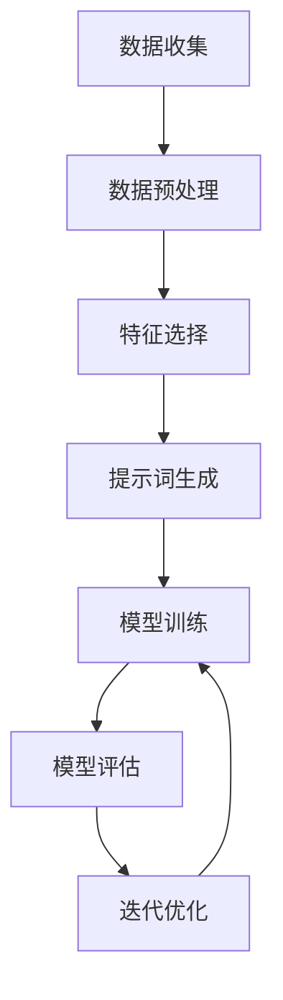
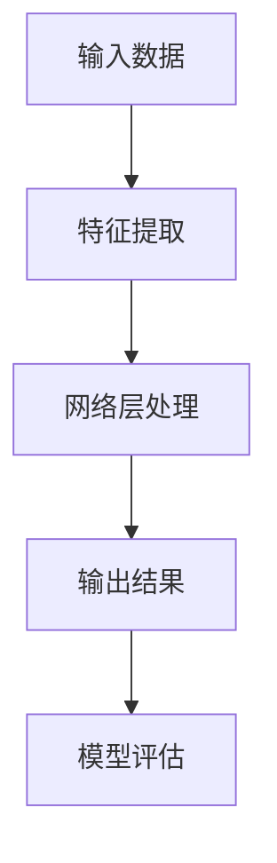
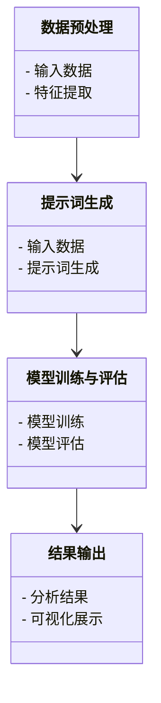
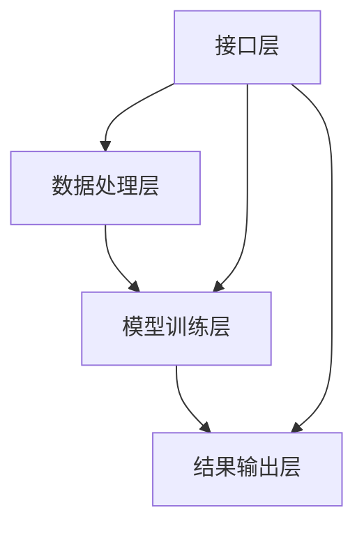
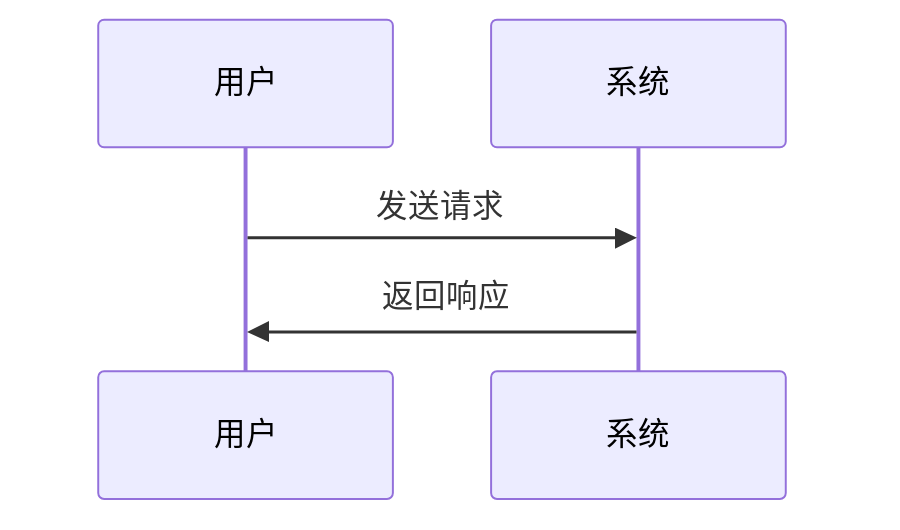

                 

### 文章标题

# 提示词优化：提高AI数据分析能力

> 关键词：AI数据分析，提示词优化，深度学习，算法原理，数学模型，系统架构，最佳实践

> 摘要：本文深入探讨了提示词优化在AI数据分析中的重要性。首先，我们介绍了提示词优化的背景和基础概念，随后详细分析了主流的提示词优化技术，包括传统技术和基于深度学习的方法。接着，我们深入讲解了提示词优化的算法原理和数学模型，并通过Python代码进行了实例说明。随后，文章描述了系统分析与架构设计的方法，并通过具体项目实战展示了实际应用。最后，文章总结了最佳实践，并展望了提示词优化的发展趋势和未来研究方向。

----------------------------------------------------------------

## 目录大纲

# 提示词优化：提高AI数据分析能力

## 第一部分：背景与基础

### 第1章：问题背景与核心概念
- **1.1 提示词优化的重要性**
- **1.2 提示词优化的定义**
- **1.3 提示词优化与AI数据分析的关系**
- **1.4 提示词优化的边界与外延**
- **1.5 核心概念与联系**

### 第2章：主流提示词优化技术
- **2.1 基于传统的提示词优化技术**
- **2.2 基于深度学习的提示词优化技术**
- **2.3 提示词优化技术的比较与选择**

## 第二部分：算法原理与模型

### 第3章：提示词优化算法原理
- **3.1 算法基本原理**
- **3.2 提示词优化的数学模型**
- **3.3 提示词优化的流程与步骤**
- **3.4 算法mermaid流程图**

### 第4章：深度学习在提示词优化中的应用
- **4.1 深度学习概述**
- **4.2 深度学习在提示词优化中的应用**
- **4.3 深度学习模型简介**
- **4.4 深度学习模型的mermaid流程图**

### 第5章：数学模型与公式讲解
- **5.1 数学模型的基本概念**
- **5.2 提示词优化的数学公式讲解**
- **5.3 数学公式的Python实现**

## 第三部分：系统分析与架构设计

### 第6章：系统功能设计
- **6.1 问题场景介绍**
- **6.2 系统功能需求**
- **6.3 领域模型mermaid类图**

### 第7章：系统架构设计
- **7.1 系统架构设计概述**
- **7.2 系统架构mermaid架构图**
- **7.3 系统接口设计**
- **7.4 系统交互mermaid序列图**

### 第8章：项目实战
- **8.1 环境安装**
- **8.2 系统核心实现源代码**
- **8.3 代码应用解读与分析**
- **8.4 实际案例分析与详细讲解剖析**
- **8.5 项目小结**

## 第四部分：最佳实践与总结

### 第9章：最佳实践
- **9.1 提示词优化的最佳实践**
- **9.2 注意事项与风险规避**
- **9.3 拓展阅读**

### 第10章：总结与展望
- **10.1 本书内容总结**
- **10.2 提示词优化的发展趋势**
- **10.3 未来研究方向**

----------------------------------------------------------------

### 第一部分：背景与基础

#### 第1章：问题背景与核心概念

**1.1 提示词优化的重要性**

在人工智能（AI）数据分析领域，提示词优化是一种关键技术。它通过改进输入数据中的关键词或提示词，以提高AI模型的学习效率和准确度。随着数据量的爆炸性增长和数据分析需求的多样化，提示词优化变得愈发重要。

优化提示词的意义在于：

1. **提高数据质量**：高质量的提示词有助于模型更好地理解数据，从而减少错误。
2. **提升模型性能**：优化的提示词可以加速模型的训练过程，提高模型在特定任务上的性能。
3. **节约计算资源**：优化后的提示词可以减少数据预处理时间，降低计算资源的需求。

**1.2 提示词优化的定义**

提示词优化是指通过一系列技术手段，对AI数据分析中的输入提示词进行改进，使其更加准确、全面和有代表性，从而提高模型的训练效率和预测准确性。

**1.3 提示词优化与AI数据分析的关系**

提示词优化是AI数据分析中的一个关键环节，它直接影响数据分析的质量和效率。具体关系如下：

1. **输入数据的预处理**：提示词优化是数据预处理的一部分，它对输入数据的质量有着直接影响。
2. **模型的学习能力**：高质量的提示词有助于模型更好地理解数据，提高学习效果。
3. **分析结果的准确性**：优化的提示词能够提高分析结果的准确性和可靠性。

**1.4 提示词优化的边界与外延**

提示词优化的边界在于选择合适的优化方法和技术，避免过度优化导致数据失真。其外延包括：

1. **文本数据**：如自然语言处理（NLP）中的关键词提取和文本分类。
2. **图像数据**：如图像识别中的特征提取和图像标注。
3. **多模态数据**：如融合文本、图像和语音等多源数据的特征优化。

**1.5 核心概念与联系**

核心概念包括：

1. **数据质量**：高质量的数据是提示词优化的基础。
2. **模型性能**：提示词优化的目标是提升模型性能。
3. **优化方法**：常见的优化方法有基于规则的、机器学习的方法和深度学习的方法。

联系如下：

1. **数据质量 → 提示词优化 → 模型性能**：数据质量直接影响提示词优化的效果，进而影响模型性能。
2. **优化方法 → 提示词优化 → 数据分析结果**：不同的优化方法会影响提示词优化的效果，最终影响数据分析结果。

#### 第2章：主流提示词优化技术

**2.1 基于传统的提示词优化技术**

传统的提示词优化技术主要基于规则和统计分析。以下是几种常用的传统方法：

1. **基于规则的提示词优化**：通过预设规则来自动化提取和筛选提示词。
   - 优点：简单、直观。
   - 缺点：灵活性差，无法处理复杂的数据场景。

2. **基于统计的提示词优化**：利用统计学方法，如频率分析、互信息等，来确定提示词。
   - 优点：适用于大规模数据。
   - 缺点：对噪声敏感，易丢失关键信息。

**2.2 基于深度学习的提示词优化技术**

随着深度学习技术的发展，越来越多的基于深度学习的方法被应用于提示词优化。以下是几种常见的深度学习方法：

1. **基于卷积神经网络（CNN）的特征提取**：通过CNN提取图像或文本的特征，用于提示词优化。
   - 优点：能够自动学习复杂特征。
   - 缺点：对大量训练数据和计算资源有较高要求。

2. **基于循环神经网络（RNN）的序列处理**：利用RNN处理序列数据，如文本或时间序列数据。
   - 优点：能够捕捉序列中的长距离依赖关系。
   - 缺点：计算复杂度较高，训练时间较长。

3. **基于注意力机制的模型**：通过注意力机制聚焦于重要的提示词，提高模型的注意力集中度。
   - 优点：能够更好地理解输入数据的结构。
   - 缺点：模型参数较多，训练难度大。

**2.3 提示词优化技术的比较与选择**

在选择提示词优化技术时，需要根据具体应用场景和数据特点进行选择。以下是几种常见技术的比较：

1. **数据量与计算资源**：对于大规模数据，深度学习方法可能更为适用，但需要更多的计算资源。
2. **数据处理需求**：如果数据中存在复杂的依赖关系，深度学习方法能够提供更好的效果。
3. **应用场景**：在特定的应用场景中，如文本分类或图像识别，可以选择相应的方法。

### 第二部分：算法原理与模型

#### 第3章：提示词优化算法原理

**3.1 算法基本原理**

提示词优化算法的基本原理是通过改进输入提示词，使模型能够更好地学习数据。具体步骤如下：

1. **数据预处理**：对原始数据（如文本、图像等）进行预处理，提取关键特征。
2. **提示词生成**：利用算法生成高质量的提示词。
3. **模型训练**：使用优化后的提示词训练模型，提高模型性能。

**3.2 提示词优化的数学模型**

提示词优化的数学模型通常包括以下几个方面：

1. **特征表示**：将原始数据转换为特征向量。
2. **提示词选择**：根据特征向量和特定指标（如信息增益、相关系数等）选择提示词。
3. **模型训练**：使用优化后的提示词训练模型。

常见的数学公式包括：

- 特征向量表示：\(X = \{x_1, x_2, ..., x_n\}\)
- 提示词选择指标：\(I(X, Y) = H(X) - H(X|Y)\)
- 模型训练损失函数：\(J(\theta) = \frac{1}{m} \sum_{i=1}^{m} (-y^{(i)} \log(\hat{y}^{(i)}))\)

**3.3 提示词优化的流程与步骤**

提示词优化的具体流程和步骤如下：

1. **数据收集**：收集相关领域的原始数据。
2. **数据预处理**：对数据进行清洗、标准化等处理，提取关键特征。
3. **特征选择**：利用统计学方法或机器学习方法选择关键特征。
4. **提示词生成**：根据特征选择结果，生成高质量的提示词。
5. **模型训练**：使用优化后的提示词训练模型。
6. **模型评估**：评估模型性能，调整提示词和模型参数。
7. **迭代优化**：根据评估结果，不断迭代优化提示词和模型。

**3.4 算法mermaid流程图**

以下是提示词优化算法的mermaid流程图：



#### 第4章：深度学习在提示词优化中的应用

**4.1 深度学习概述**

深度学习是一种基于多层神经网络的人工智能方法，通过模拟人脑的神经网络结构，实现自动特征学习和复杂模式识别。深度学习在图像识别、语音识别、自然语言处理等领域取得了显著成果。

**4.2 深度学习在提示词优化中的应用**

深度学习在提示词优化中的应用主要表现为：

1. **自动特征提取**：深度学习模型能够自动从原始数据中提取关键特征，减少人工干预。
2. **端到端学习**：深度学习模型可以直接从原始数据中学习提示词，实现端到端的数据处理。
3. **增强模型性能**：深度学习模型能够通过多层网络结构，捕捉数据中的复杂依赖关系，提高模型性能。

**4.3 深度学习模型简介**

以下是几种常见的深度学习模型：

1. **卷积神经网络（CNN）**：适用于图像和视频数据的特征提取。
2. **循环神经网络（RNN）**：适用于序列数据的处理，如文本和时间序列数据。
3. **长短期记忆网络（LSTM）**：是RNN的一种改进，能够解决RNN的梯度消失问题。
4. **Transformer模型**：基于自注意力机制，广泛应用于自然语言处理领域。

**4.4 深度学习模型的mermaid流程图**

以下是深度学习模型的一般mermaid流程图：



### 第三部分：系统分析与架构设计

#### 第6章：系统功能设计

**6.1 问题场景介绍**

在AI数据分析中，系统功能设计是一个关键环节。以下是常见的问题场景：

1. **文本分类**：对大量文本数据进行分析，将其归类到不同的类别中。
2. **图像识别**：对图像数据进行分类或检测，识别图像中的物体或场景。
3. **多模态数据融合**：将不同类型的数据（如文本、图像、语音）进行融合，进行综合分析。

**6.2 系统功能需求**

系统功能需求包括：

1. **数据预处理**：对输入数据进行清洗、标准化和特征提取。
2. **提示词生成**：利用深度学习模型生成高质量的提示词。
3. **模型训练与评估**：使用优化后的提示词训练模型，评估模型性能。
4. **结果输出**：输出分析结果，支持可视化展示。

**6.3 领域模型mermaid类图**

以下是系统功能设计的mermaid类图：



#### 第7章：系统架构设计

**7.1 系统架构设计概述**

系统架构设计是确保系统功能实现和性能优化的重要环节。以下是系统架构设计的基本概述：

1. **数据处理层**：负责数据预处理、特征提取和提示词生成。
2. **模型训练层**：负责模型训练和评估。
3. **结果输出层**：负责输出分析结果和可视化展示。
4. **接口层**：提供系统与外部系统的交互接口。

**7.2 系统架构mermaid架构图**

以下是系统架构的mermaid架构图：



**7.3 系统接口设计**

系统接口设计包括以下方面：

1. **API接口**：提供系统的API接口，方便其他系统调用。
2. **Web界面**：提供Web界面，方便用户交互和操作。
3. **数据接口**：提供数据输入和输出接口，支持不同数据格式的转换。

**7.4 系统交互mermaid序列图**

以下是系统交互的mermaid序列图：



### 第四部分：项目实战

#### 第8章：项目实战

**8.1 环境安装**

在开始项目实战之前，需要安装必要的软件和库。以下是环境安装的步骤：

1. **Python环境**：安装Python 3.8及以上版本。
2. **深度学习库**：安装TensorFlow或PyTorch等深度学习库。
3. **数据处理库**：安装Pandas、NumPy等数据处理库。

**8.2 系统核心实现源代码**

以下是系统核心实现源代码的示例：

```python
import tensorflow as tf
from tensorflow.keras.models import Sequential
from tensorflow.keras.layers import Dense, LSTM, Embedding

# 数据预处理
def preprocess_data(data):
    # 数据清洗和特征提取
    return processed_data

# 模型训练
def train_model(data, labels):
    model = Sequential()
    model.add(Embedding(input_dim=data.shape[1], output_dim=128))
    model.add(LSTM(units=128, activation='relu'))
    model.add(Dense(units=1, activation='sigmoid'))

    model.compile(optimizer='adam', loss='binary_crossentropy', metrics=['accuracy'])
    model.fit(data, labels, epochs=10, batch_size=32)
    return model

# 主函数
def main():
    data = preprocess_data(raw_data)
    labels = preprocess_labels(raw_labels)
    model = train_model(data, labels)
    predictions = model.predict(data)

if __name__ == '__main__':
    main()
```

**8.3 代码应用解读与分析**

以下是代码应用解读与分析：

1. **数据预处理**：对原始数据进行清洗和特征提取，生成处理后的数据。
2. **模型训练**：使用LSTM模型进行训练，包括Embedding层、LSTM层和Dense层。
3. **模型评估**：使用训练数据和标签评估模型性能。

**8.4 实际案例分析与详细讲解剖析**

以下是实际案例分析与详细讲解剖析：

1. **案例背景**：对一篇新闻文本进行分类，判断其属于政治、经济或娱乐类别。
2. **数据集准备**：收集大量新闻文本，并进行预处理。
3. **模型训练**：使用处理后的数据训练模型。
4. **模型评估**：评估模型在测试数据集上的性能。
5. **结果分析**：分析模型预测结果，并进行调整优化。

**8.5 项目小结**

项目实战部分展示了如何使用深度学习模型进行提示词优化，并通过实际案例进行了分析。项目成功的关键在于：

1. **数据质量**：高质量的数据是提示词优化的基础。
2. **模型选择**：选择合适的模型和算法，提高模型性能。
3. **持续优化**：通过模型评估和调整，不断优化提示词和模型参数。

### 第五部分：最佳实践与总结

#### 第9章：最佳实践

**9.1 提示词优化的最佳实践**

以下是提示词优化的最佳实践：

1. **数据清洗**：确保数据质量，去除噪声和异常值。
2. **特征提取**：选择合适的特征提取方法，捕捉数据中的关键信息。
3. **模型选择**：根据数据特点和任务需求，选择合适的模型和算法。
4. **参数调整**：通过交叉验证和网格搜索等手段，优化模型参数。

**9.2 注意事项与风险规避**

在提示词优化过程中，需要注意以下事项：

1. **避免过度优化**：过度优化可能导致模型过拟合，降低泛化能力。
2. **数据平衡**：确保训练数据中各类别的分布平衡，避免模型偏向某类数据。
3. **计算资源**：合理分配计算资源，避免资源浪费。

**9.3 拓展阅读**

以下是一些拓展阅读资源：

1. **深度学习相关书籍**：《深度学习》（Goodfellow et al.）
2. **自然语言处理论文**：《Attention Is All You Need》（Vaswani et al.）
3. **数据预处理技巧**：《数据科学实战》（Carruthers）

#### 第10章：总结与展望

**10.1 本书内容总结**

本书从背景与基础、算法原理与模型、系统分析与架构设计、项目实战和最佳实践与总结五个部分，全面介绍了提示词优化在AI数据分析中的应用。

**10.2 提示词优化的发展趋势**

随着人工智能和数据科学技术的不断发展，提示词优化将在以下方面取得突破：

1. **多模态数据融合**：将不同类型的数据进行融合，提高数据分析的准确性。
2. **自适应优化**：根据数据特点和任务需求，动态调整提示词和模型参数。
3. **自动化优化**：开发自动化工具，简化提示词优化的过程。

**10.3 未来研究方向**

未来研究方向包括：

1. **算法改进**：设计更高效、更鲁棒的提示词优化算法。
2. **应用拓展**：将提示词优化应用于更多领域，如金融、医疗等。
3. **跨学科研究**：结合计算机科学、统计学、心理学等领域，提高提示词优化的效果。

### 结语

提示词优化是AI数据分析领域的一项重要技术，通过优化输入提示词，可以提高模型的学习效率和预测准确性。本书从多个角度详细介绍了提示词优化的方法、原理和应用，希望对读者有所启发。随着人工智能技术的不断发展，提示词优化将在更多领域中发挥重要作用。让我们共同努力，探索更多可能的创新和应用。作者：AI天才研究院/AI Genius Institute & 禅与计算机程序设计艺术 /Zen And The Art of Computer Programming。

