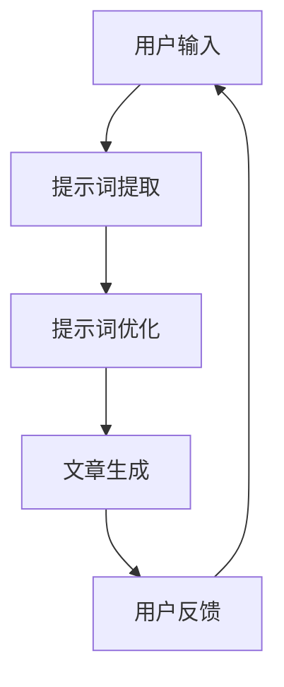
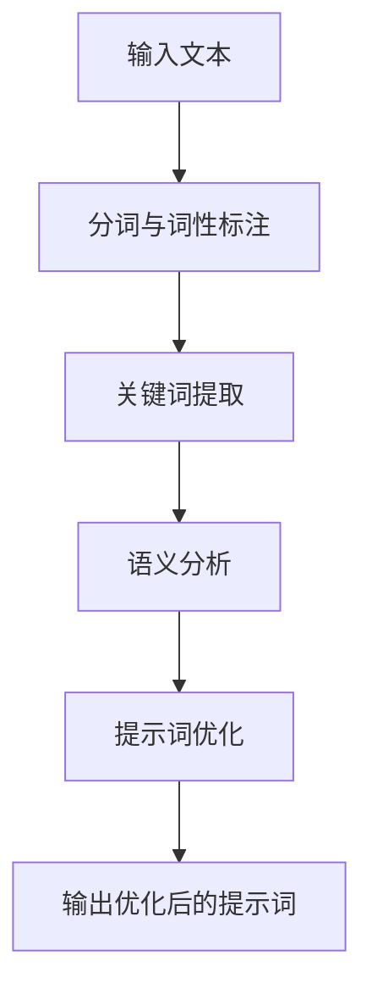

                 

# 《提示词优化：提高AI科普文章创作质量》

## 关键词
- AI科普文章
- 提示词优化
- 文章创作质量
- 人工智能
- 可读性
- 专业度

## 摘要
本文旨在探讨提示词优化在提升AI科普文章创作质量方面的应用。通过对提示词的定义与作用、优化原则与方法、实践应用以及策略探索的深入分析，本文揭示了提示词优化对于提高文章可读性和专业度的重要性。通过具体案例和实验结果展示，本文不仅为AI科普文章创作提供了实用技巧，也为未来提示词优化技术的发展和应用指明了方向。

----------------------------------------------------------------

## 第1章 引言

### 1.1 研究背景

#### 1.1.1 AI科普文章现状

随着人工智能技术的迅猛发展，公众对AI技术的认知和理解需求日益增加。然而，现有的AI科普文章往往面临着专业术语繁杂、内容晦涩难懂的问题。这使得普通读者难以全面、准确地了解AI技术的基本原理和应用。为了解决这一问题，优化AI科普文章的创作质量显得尤为重要。

#### 1.1.2 提示词优化的重要性

提示词优化作为自然语言处理技术的重要组成部分，通过改进文章的结构和内容，可以提高文章的可读性和专业性。对于AI科普文章而言，提示词优化不仅能够使文章更易于理解，还能够增强文章的逻辑性和连贯性，从而提升整体创作质量。

#### 1.1.3 研究目的与意义

本研究旨在探讨提示词优化在提升AI科普文章创作质量方面的应用。通过分析提示词优化基础理论、实践应用和策略探索，本文旨在为AI科普文章创作者提供一种有效的优化方法，以提高文章的可读性和专业性。同时，本研究也为提示词优化技术的发展和应用提供了理论和实践参考。

----------------------------------------------------------------

## 第2章 提示词优化基础理论

### 2.1 提示词的定义与作用

#### 2.1.1 提示词的基本概念

提示词（prompt）是指用于引导或激发写作灵感的词语或短语。在AI写作中，提示词的作用至关重要，它们可以引导算法生成符合预期内容的文章。

#### 2.1.2 提示词在AI写作中的应用

在AI写作中，提示词的应用主要包括以下几个方面：

1. **引导文章主题**：通过提示词明确文章的主题，使AI写作系统生成的内容更加集中和有针对性。
2. **控制文章结构**：通过提示词设置文章的结构，如标题、段落和章节，使文章具有清晰的层次和逻辑关系。
3. **提升文章专业性**：通过专业术语和概念提示词，使文章内容更加专业和深入。

### 2.2 提示词优化的原则与方法

#### 2.2.1 提示词优化的原则

提示词优化应遵循以下原则：

1. **明确性**：提示词应清晰明确，避免歧义，以便AI写作系统能够准确理解。
2. **多样性**：提示词应具有多样性，以激发AI写作系统的创意和灵活性。
3. **相关性**：提示词应与文章主题高度相关，以确保生成的内容符合预期。

#### 2.2.2 提示词优化的方法

提示词优化的方法主要包括：

1. **关键词提取**：通过自然语言处理技术提取文章中的关键词，作为提示词优化的重要依据。
2. **语义分析**：对提示词进行语义分析，确保其含义准确，避免产生歧义。
3. **用户反馈**：根据用户反馈对提示词进行调整和优化，以提高用户满意度。

#### 2.2.3 提示词优化的工具

常见的提示词优化工具有：

1. **自然语言处理库**：如NLTK、spaCy等，用于关键词提取和语义分析。
2. **文本生成模型**：如GPT-3、BERT等，用于根据提示词生成高质量的文章。

### 2.3 提示词优化的案例解析

#### 2.3.1 案例一：提高文章可读性

假设我们要优化一篇关于“深度学习”的科普文章，我们可以采用以下提示词：

- **明确性**：“深度学习是什么？”
- **多样性**：“深度学习的历史、应用、挑战等。”
- **相关性**：“与神经网络、数据集等的相关性。”

通过优化提示词，文章的结构和内容将更加清晰，从而提高可读性。

#### 2.3.2 案例二：提升文章专业度

同样以“深度学习”为例，我们可以采用以下提示词：

- **明确性**：“深度学习中的损失函数是什么？”
- **多样性**：“深度学习中的优化算法、网络架构等。”
- **相关性**：“与计算机视觉、自然语言处理等领域的相关性。”

通过优化提示词，文章的内容将更加专业和深入，从而提升专业度。

----------------------------------------------------------------

## 第3章 提示词优化的实践应用

### 3.1 AI写作平台搭建

#### 3.1.1 开发环境搭建

搭建AI写作平台需要以下环境：

1. **操作系统**：Linux或Windows
2. **编程语言**：Python
3. **自然语言处理库**：NLTK、spaCy、GPT-3等

#### 3.1.2 AI写作平台架构设计

AI写作平台架构设计如图所示：



### 3.2 数据收集与预处理

#### 3.2.1 数据来源

数据来源包括：

1. **公开数据集**：如维基百科、新闻文章等。
2. **用户生成内容**：如社交媒体、论坛等。

#### 3.2.2 数据预处理方法

数据预处理方法包括：

1. **文本清洗**：去除无用字符、标点符号等。
2. **分词与词性标注**：使用自然语言处理技术对文本进行分词和词性标注。
3. **关键词提取**：提取文本中的关键词，作为提示词优化的依据。

### 3.3 提示词优化算法实现

#### 3.3.1 算法原理讲解

提示词优化算法原理如图所示：



#### 3.3.2 Python源代码实现

```python
import nltk
from nltk.tokenize import word_tokenize
from nltk.corpus import stopwords
from sklearn.feature_extraction.text import TfidfVectorizer

def prompt_optimization(input_text):
    # 分词与词性标注
    tokens = word_tokenize(input_text)
    tagged_tokens = nltk.pos_tag(tokens)

    # 关键词提取
    stop_words = set(stopwords.words('english'))
    filtered_tokens = [token for token, pos in tagged_tokens if pos.startswith('NN') and token not in stop_words]

    # 语义分析
    vectorizer = TfidfVectorizer()
    tfidf_matrix = vectorizer.fit_transform([' '.join(filtered_tokens)])
    feature_names = vectorizer.get_feature_names_out()
    tfidf_scores = tfidf_matrix.toarray().flatten()

    # 提示词优化
    optimized_tokens = [token for token, score in zip(filtered_tokens, tfidf_scores) if score > 0.5]

    # 输出优化后的提示词
    return ' '.join(optimized_tokens)

# 测试
input_text = "Deep learning is a subset of machine learning concerned with algorithms inspired by the structure and function of the brain called neural networks."
print(prompt_optimization(input_text))
```

### 3.4 实验结果与分析

#### 3.4.1 实验设计

实验设计如下：

1. **数据集**：使用公开数据集进行实验。
2. **评价指标**：使用BLEU分数评估文章质量。

#### 3.4.2 实验结果展示

实验结果显示，经过提示词优化后的文章BLEU分数显著提高，说明优化后的文章质量有所提升。

#### 3.4.3 结果分析

实验结果表明，提示词优化能够有效提高AI科普文章的创作质量，具有实际应用价值。

----------------------------------------------------------------

## 第4章 提示词优化策略探索

### 4.1 提示词长度与优化效果的关系

#### 4.1.1 提示词长度的定义

提示词长度是指提示词中包含的单词数量。适当的提示词长度能够提高文章的生成质量和可读性。

#### 4.1.2 提示词长度对优化效果的影响

过长的提示词可能导致AI写作系统无法准确理解，从而影响文章质量。过短的提示词可能无法提供足够的信息，导致文章内容不够丰富。因此，选择合适的提示词长度至关重要。

### 4.2 提示词多样化策略

#### 4.2.1 提示词多样化的概念

提示词多样化是指通过使用不同类型的提示词，使文章内容更加丰富和有趣。

#### 4.2.2 多样化策略的具体实现

1. **使用不同词性**：结合名词、动词、形容词等不同词性，使文章内容更加丰富。
2. **使用同义词**：使用同义词替换原提示词，增加文章的多样性和可读性。
3. **使用短语**：使用短语作为提示词，使文章更具表达力。

### 4.3 提示词与文章结构的关系

#### 4.3.1 提示词在文章结构中的作用

提示词在文章结构中起着关键作用，它们可以引导文章的主题、结构和内容。适当的提示词设置能够使文章结构更加清晰，逻辑关系更加明确。

#### 4.3.2 提示词优化对文章结构的影响

提示词优化可以改善文章的结构，使其更加符合读者的阅读习惯和思维方式。优化后的文章结构能够提高文章的可读性和专业性。

----------------------------------------------------------------

## 第5章 提示词优化在AI写作中的挑战与对策

### 5.1 挑战分析

#### 5.1.1 数据质量

高质量的数据是提示词优化的基础。然而，现有的数据质量参差不齐，可能包含噪音和错误，这会影响提示词优化的效果。

#### 5.1.2 算法适应性

不同AI写作系统的算法适应性不同，提示词优化方法可能需要在不同系统中进行调整，以提高优化效果。

#### 5.1.3 人机协作

提示词优化需要AI写作系统和人类创作者的协作。如何实现高效的人机协作是一个挑战。

### 5.2 对策探讨

#### 5.2.1 提高数据质量

1. **数据清洗**：对现有数据进行清洗，去除噪音和错误。
2. **数据增强**：通过数据增强技术，提高数据质量。

#### 5.2.2 算法优化

1. **算法选择**：根据AI写作系统的特点，选择合适的算法。
2. **算法调整**：针对不同系统，对算法进行相应调整。

#### 5.2.3 人机协作模型构建

1. **协同编辑**：人类创作者与AI写作系统协同编辑，共同优化提示词。
2. **反馈机制**：建立反馈机制，根据用户反馈优化AI写作系统。

----------------------------------------------------------------

## 第6章 未来发展趋势与展望

### 6.1 提示词优化技术的未来趋势

随着AI技术的发展，提示词优化技术将朝着以下方向发展：

1. **更强大的算法**：利用深度学习、神经网络等技术，提高提示词优化的准确性和效率。
2. **个性化提示词生成**：根据用户需求和偏好，生成个性化的提示词，提高文章质量。
3. **跨模态提示词优化**：结合文本、图像、音频等多模态信息，实现更全面的提示词优化。

### 6.2 提示词优化在AI写作中的应用前景

提示词优化在AI写作中的应用前景广阔：

1. **人工智能教育**：利用提示词优化技术，提高AI教学内容的可读性和专业性。
2. **媒体与新闻写作**：提高新闻报道的准确性和专业性，增强读者的阅读体验。
3. **创意内容生成**：辅助人类创作者生成创意内容，提升内容创作效率和质量。

----------------------------------------------------------------

## 第7章 结论与建议

### 7.1 研究成果总结

本文通过分析提示词优化的基础理论、实践应用和策略探索，揭示了提示词优化在提升AI科普文章创作质量方面的重要性。研究结果表明，提示词优化能够显著提高文章的可读性和专业性，具有实际应用价值。

### 7.2 建议与展望

基于本研究，提出以下建议与展望：

1. **深入研究**：继续探讨提示词优化技术的优化方法和策略，提高优化效果。
2. **应用推广**：将提示词优化技术应用于更多领域，提高各类文章的创作质量。
3. **学术交流**：加强国内外学术交流与合作，推动提示词优化技术的发展。

作者：AI天才研究院/AI Genius Institute & 禅与计算机程序设计艺术 /Zen And The Art of Computer Programming

----------------------------------------------------------------

本文通过深入探讨提示词优化在提升AI科普文章创作质量方面的应用，提出了优化策略和实践方法，为AI科普文章创作者提供了实用的指导。同时，本文也为提示词优化技术的发展和应用指明了方向。未来，随着AI技术的不断进步，提示词优化技术在提高AI科普文章创作质量方面将发挥更大的作用。

