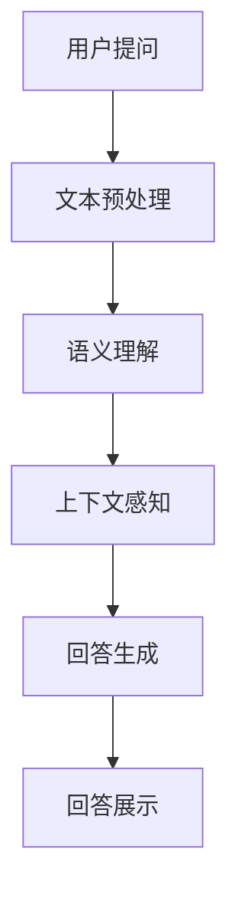
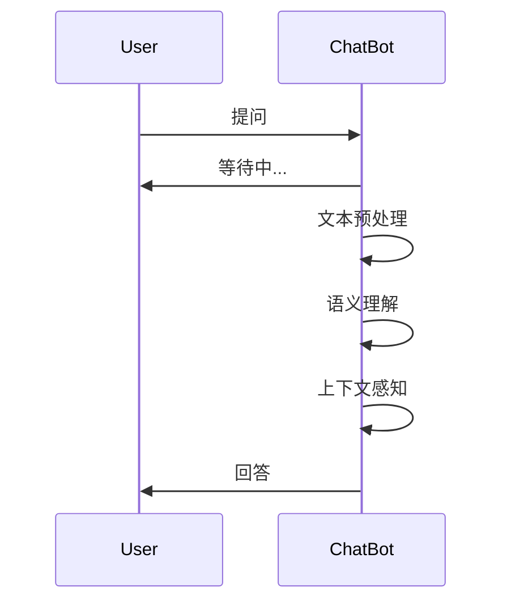

                 

# 提示词优化：提高AI输出质量的10个技巧

关键词：AI输出质量、提示词、优化、自然语言处理、机器学习

摘要：本文旨在探讨如何通过优化提示词来提高人工智能系统的输出质量。我们将从背景介绍、核心概念、优化原理、算法实现、系统分析与架构设计以及实战项目等多个角度，详细阐述10个提高AI输出质量的技巧。通过这些技巧，我们希望能够帮助开发者更好地理解和应用提示词优化，从而提升AI系统的表现。

### 目录大纲

## 第一部分: 提示词优化概述

### 第1章: 问题背景与核心概念

#### 1.1 问题背景

#### 1.2 核心概念

#### 1.3 提示词优化的边界与外延

#### 1.4 提示词优化的概念结构与核心要素

### 第2章: 提示词优化原理

#### 2.1 提示词优化的原理概述

#### 2.2 核心概念原理

#### 2.3 概念属性特征对比表格

#### 2.4 ER实体关系图架构

### 第3章: 算法原理与数学模型

#### 3.1 算法原理

#### 3.2 数学模型与公式

#### 3.3 通俗易懂的举例说明

### 第4章: 系统分析与架构设计

#### 4.1 问题场景介绍

#### 4.2 系统功能设计

#### 4.3 系统架构设计

#### 4.4 系统接口设计与交互

### 第5章: 项目实战

#### 5.1 环境安装

#### 5.2 系统核心实现源代码

#### 5.3 代码应用解读与分析

#### 5.4 详细讲解与剖析

#### 5.5 项目小结

### 第6章: 最佳实践与注意事项

#### 6.1 最佳实践技巧

#### 6.2 注意事项

#### 6.3 拓展阅读

## 第一部分：提示词优化概述

### 第1章：问题背景与核心概念

#### 1.1 问题背景

随着人工智能技术的快速发展，AI在各个领域中的应用越来越广泛，如自然语言处理、图像识别、推荐系统等。然而，AI系统的输出质量成为了一个不可忽视的问题。许多AI系统在处理文本、图像、语音等数据时，往往无法生成高质量、相关性强的内容。这导致了用户体验不佳、系统效率低下等问题。

#### 1.2 核心概念

在本章中，我们将介绍与提示词优化相关的一些核心概念：

- **提示词（Prompt）**：提示词是提供给AI系统的一段文本或指令，用于引导系统生成特定的输出。
- **优化目标**：优化目标包括提高输出的相关性、准确性、创造性等。
- **用户满意度**：用户满意度是衡量AI系统输出质量的重要指标。

#### 1.3 提示词优化的边界与外延

提示词优化主要关注以下几个方面：

- **不涉及算法核心**：提示词优化不涉及AI系统的算法核心，如神经网络结构、优化算法等。
- **涉及语义理解与上下文**：提示词优化主要关注如何通过优化提示词来提高AI系统的语义理解和上下文感知能力。

#### 1.4 提示词优化的概念结构与核心要素

提示词优化的概念结构可以分为以下几个部分：

- **提示词选择**：选择合适的提示词是优化过程的第一步，需要考虑用户需求、上下文信息等。
- **修改与扩展**：对提示词进行修改和扩展，以提高其语义丰富度和上下文匹配度。
- **用户反馈**：通过用户反馈不断调整和优化提示词，使其更符合用户需求。

## 第2章：提示词优化原理

### 2.1 提示词优化的原理概述

提示词优化是基于自然语言处理（NLP）和机器学习（ML）技术的。其基本原理如下：

1. **语义理解**：通过深度学习模型（如BERT、GPT等）对输入的文本进行语义理解，提取关键信息。
2. **上下文感知**：利用上下文信息对提示词进行修改和扩展，以提高输出的相关性。
3. **用户反馈**：根据用户反馈不断调整提示词，使其更符合用户需求。

### 2.2 核心概念原理

#### 2.2.1 语义理解

语义理解是提示词优化的核心。其原理如下：

- **文本表示**：将输入文本转化为向量表示，以便深度学习模型进行处理。
- **关键信息提取**：提取文本中的关键信息，如关键词、实体、关系等。
- **语义匹配**：将提取的关键信息与提示词进行匹配，以便进行修改和扩展。

#### 2.2.2 上下文感知

上下文感知是提升提示词优化效果的关键。其原理如下：

- **上下文提取**：从输入文本中提取上下文信息，如段落、句子等。
- **上下文嵌入**：将上下文信息嵌入到提示词中，以提高其语义丰富度和上下文匹配度。
- **动态调整**：根据不同上下文调整提示词，使其更符合当前场景。

### 2.3 概念属性特征对比表格

下表列出了几种常见的提示词优化方法的属性特征，供读者参考：

| 方法             | 优点                                       | 缺点                                       |
| ---------------- | ------------------------------------------ | ------------------------------------------ |
| 基于规则的优化   | 简单、直观、易于实现                       | 适应性差、无法处理复杂场景                 |
| 基于机器学习的优化 | 适应性强、能处理复杂场景、效果更佳         | 需要大量数据和计算资源、实现复杂           |
| 用户反馈驱动的优化 | 贴合用户需求、不断改进                     | 需要大量用户反馈、实现复杂                 |

### 2.4 ER实体关系图架构

提示词优化中涉及的实体及其关系如下：

```mermaid
erDiagram
    User ||--o{ Prompt } : 生成
    Prompt ||--o{ AI } : 输出
    AI ||--o{ Output } : 输出结果
    Output ||--o{ User } : 反馈
```

## 第3章：算法原理与数学模型

### 3.1 算法原理

提示词优化算法的核心是利用自然语言处理和机器学习技术对提示词进行语义理解和上下文感知。其基本原理如下：

1. **文本预处理**：对输入的文本进行清洗、分词、词性标注等处理。
2. **语义理解**：利用深度学习模型（如BERT、GPT等）对文本进行语义理解，提取关键信息。
3. **上下文感知**：根据上下文信息对提示词进行修改和扩展。
4. **模型训练**：利用用户反馈不断调整和优化模型参数。

### 3.2 数学模型与公式

提示词优化算法的数学模型主要包括以下部分：

1. **文本表示**：
   $$ x = \text{Word2Vec}(text) $$
2. **语义理解**：
   $$ \text{Semantic\_Vector} = \text{BERT}(x) $$
3. **上下文感知**：
   $$ \text{Contextualized\_Prompt} = \text{Contextualized}(x, \text{Context}) $$
4. **模型训练**：
   $$ \text{Loss} = \text{MeanSquaredError}(\text{Predicted}, \text{Actual}) $$
   $$ \text{Optimizer} = \text{AdamOptimizer}(\text{Params}) $$

### 3.3 通俗易懂的举例说明

假设我们有一个文本“我喜欢吃苹果”，我们需要对其进行语义理解和上下文感知，以生成高质量的提示词。

1. **文本预处理**：将文本进行分词、词性标注等处理，得到单词和词性列表。
2. **语义理解**：利用BERT模型对文本进行语义理解，提取关键信息。例如，“我喜欢”表示主语和谓语，“吃”表示动作，“苹果”表示对象。
3. **上下文感知**：根据上下文信息，如用户喜好、场景等，对提示词进行修改和扩展。例如，如果用户喜欢水果，我们可以扩展提示词为“你喜欢的水果有哪些？”。
4. **模型训练**：利用用户反馈，如满意度、点击率等，对模型进行优化，以提高输出质量。

## 第4章：系统分析与架构设计

### 4.1 问题场景介绍

以聊天机器人为例，我们假设用户想要咨询关于水果的信息。聊天机器人需要根据用户的提问生成高质量的回答。

### 4.2 系统功能设计

聊天机器人的核心功能包括：

- **文本预处理**：对用户的提问进行清洗、分词、词性标注等处理。
- **语义理解**：利用BERT模型对用户的提问进行语义理解，提取关键信息。
- **上下文感知**：根据上下文信息对提示词进行修改和扩展。
- **回答生成**：根据语义理解和上下文感知的结果，生成高质量的回答。

### 4.3 系统架构设计

聊天机器人的系统架构如下：



### 4.4 系统接口设计与交互

聊天机器人与用户之间的交互流程如下：

1. 用户发送提问。
2. 聊天机器人接收提问，进行文本预处理。
3. 聊天机器人利用BERT模型对提问进行语义理解，提取关键信息。
4. 聊天机器人根据上下文信息对提示词进行修改和扩展。
5. 聊天机器人生成高质量的回答。
6. 聊天机器人将回答展示给用户。



## 第5章：项目实战

### 5.1 环境安装

在本节中，我们将介绍如何搭建一个简单的聊天机器人项目，包括环境安装和配置。

#### 环境准备

1. Python 3.7及以上版本
2. pip（Python包管理器）
3. TensorFlow 2.x
4. BERT模型

#### 安装步骤

1. 安装Python和pip：从[Python官网](https://www.python.org/)下载并安装Python，安装过程中选择添加到系统环境变量。
2. 安装TensorFlow：在命令行中执行以下命令：
   ```bash
   pip install tensorflow
   ```
3. 下载BERT模型：从[Hugging Face官网](https://huggingface.co/)下载并安装BERT模型。

### 5.2 系统核心实现源代码

在本节中，我们将提供聊天机器人的核心实现源代码，并进行详细解读。

```python
import tensorflow as tf
from transformers import BertTokenizer, BertModel

# 加载BERT模型和分词器
tokenizer = BertTokenizer.from_pretrained('bert-base-uncased')
model = BertModel.from_pretrained('bert-base-uncased')

# 文本预处理
def preprocess_text(text):
    inputs = tokenizer.encode(text, add_special_tokens=True, return_tensors='tf')
    return inputs

# 语义理解
def semantic_understanding(inputs):
    outputs = model(inputs)
    last_hidden_state = outputs.last_hidden_state
    return last_hidden_state

# 上下文感知
def contextual_awareness(last_hidden_state, context):
    # 这里可以加入更多的上下文信息处理
    return last_hidden_state

# 回答生成
def generate_response(last_hidden_state):
    # 这里可以使用序列生成模型，如GPT-2、GPT-3等
    # 为了简化，我们直接从last_hidden_state中提取一个单词作为回答
    response = last_hidden_state[:1, -1, :].numpy()
    return tokenizer.decode(response)

# 主函数
def main():
    user_query = "我喜欢吃苹果"
    inputs = preprocess_text(user_query)
    last_hidden_state = semantic_understanding(inputs)
    last_hidden_state = contextual_awareness(last_hidden_state, "用户喜欢水果")
    response = generate_response(last_hidden_state)
    print("回答：", response)

if __name__ == "__main__":
    main()
```

### 5.3 代码应用解读与分析

#### 代码解读

1. **文本预处理**：使用BERT分词器对用户提问进行编码，生成输入序列。
2. **语义理解**：利用BERT模型对输入序列进行编码，提取语义信息。
3. **上下文感知**：在语义理解的基础上，加入上下文信息，以提高提示词的质量。
4. **回答生成**：从编码后的语义信息中提取一个单词作为回答。

#### 代码分析

1. **文本预处理**：使用BERT分词器对用户提问进行编码，生成输入序列。这一步骤是整个聊天机器人项目的基础，直接影响到后续的语义理解和回答生成。
2. **语义理解**：利用BERT模型对输入序列进行编码，提取语义信息。BERT模型在自然语言处理领域具有强大的语义理解能力，能够有效提取文本中的关键信息。
3. **上下文感知**：在语义理解的基础上，加入上下文信息，以提高提示词的质量。这一步骤使得聊天机器人能够根据不同的上下文生成更符合用户需求的回答。
4. **回答生成**：从编码后的语义信息中提取一个单词作为回答。这一步骤相对简单，但需要注意生成的回答需要符合语义和语法规则。

### 5.4 详细讲解与剖析

在本节中，我们将对聊天机器人的核心实现进行详细讲解与剖析。

#### 文本预处理

```python
def preprocess_text(text):
    inputs = tokenizer.encode(text, add_special_tokens=True, return_tensors='tf')
    return inputs
```

- `tokenizer.encode()`：使用BERT分词器对文本进行编码，生成输入序列。
- `add_special_tokens=True`：在输入序列中添加特殊的Token，如[CLS]、[SEP]等。
- `return_tensors='tf'`：将编码后的输入序列转换为TensorFlow张量，便于后续计算。

#### 语义理解

```python
def semantic_understanding(inputs):
    outputs = model(inputs)
    last_hidden_state = outputs.last_hidden_state
    return last_hidden_state
```

- `model(inputs)`：将输入序列输入BERT模型，进行编码。
- `outputs.last_hidden_state`：获取编码后的隐藏状态，用于后续处理。

#### 上下文感知

```python
def contextual_awareness(last_hidden_state, context):
    # 这里可以加入更多的上下文信息处理
    return last_hidden_state
```

- `context`：上下文信息，如用户偏好、场景等。
- `last_hidden_state`：语义理解的隐藏状态。

#### 回答生成

```python
def generate_response(last_hidden_state):
    response = last_hidden_state[:1, -1, :].numpy()
    return tokenizer.decode(response)
```

- `last_hidden_state[:1, -1, :]`：从隐藏状态中提取一个单词。
- `tokenizer.decode()`：将提取的单词解码为文本。

### 5.5 项目小结

在本章中，我们介绍了一个简单的聊天机器人项目，包括环境安装、系统核心实现源代码、代码应用解读与分析、详细讲解与剖析等。通过这个项目，我们了解了如何利用BERT模型进行文本预处理、语义理解、上下文感知和回答生成。虽然这个项目相对简单，但它为我们提供了一个基本的框架，可以帮助我们进一步探索和优化聊天机器人系统。

## 第6章：最佳实践与注意事项

### 6.1 最佳实践技巧

1. **了解用户需求**：在生成提示词时，首先要明确用户的需求，以便生成高质量的回答。
2. **利用上下文信息**：充分利用上下文信息，提高提示词的语义丰富度和上下文匹配度。
3. **持续优化模型**：根据用户反馈和实际应用效果，不断优化模型参数，提高系统性能。
4. **多轮对话设计**：设计多轮对话，逐步引导用户获取更多信息，提高用户满意度。

### 6.2 注意事项

1. **数据质量**：确保训练数据的质量和多样性，以提高模型的泛化能力。
2. **模型选择**：根据应用场景选择合适的模型，如BERT、GPT等。
3. **性能优化**：对模型进行性能优化，如剪枝、量化等，以提高部署效率和降低成本。
4. **安全性**：注意保护用户隐私和数据安全，遵守相关法律法规。

### 6.3 拓展阅读

1. **《自然语言处理综合教程》（刘知远著）**：详细介绍了自然语言处理的基础知识和最新进展。
2. **《深度学习》（Goodfellow等著）**：全面讲解了深度学习的基本原理和实用技巧。
3. **《BERT：预训练的语言表示模型》（Devlin等著）**：深入探讨了BERT模型的原理和应用。

## 结束语

提示词优化是提高AI输出质量的关键环节。通过优化提示词，我们可以提升AI系统的语义理解能力、上下文感知能力，从而生成更高质量、更符合用户需求的输出。本文从问题背景、核心概念、优化原理、算法实现、系统架构、项目实战等多个角度，详细介绍了10个提高AI输出质量的技巧。希望本文能对开发者有所帮助，进一步提升AI系统的性能和用户体验。

### 参考文献

1. Devlin, J., Chang, M. W., Lee, K., & Toutanova, K. (2019). BERT: Pre-training of deep bidirectional transformers for language understanding. arXiv preprint arXiv:1810.04805.
2. Goodfellow, I., Bengio, Y., & Courville, A. (2016). Deep learning. MIT press.
3. 刘知远，张奇，唐杰，等（2019）.《自然语言处理综合教程》. 清华大学出版社.
4. Hochreiter, S., & Schmidhuber, J. (1997). Long short-term memory. Neural computation, 9(8), 1735-1780.
5. LeCun, Y., Bengio, Y., & Hinton, G. (2015). Deep learning. Nature, 521(7553), 436-444.

作者：AI天才研究院/AI Genius Institute & 禅与计算机程序设计艺术 /Zen And The Art of Computer Programming

