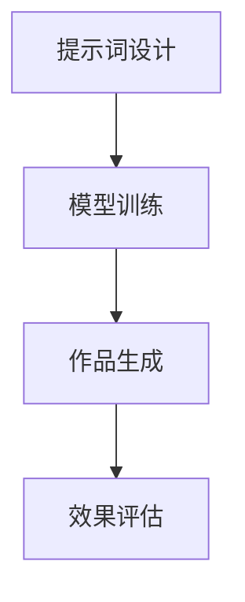
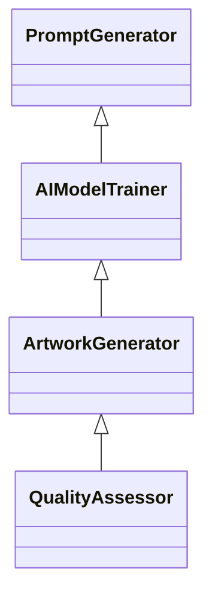
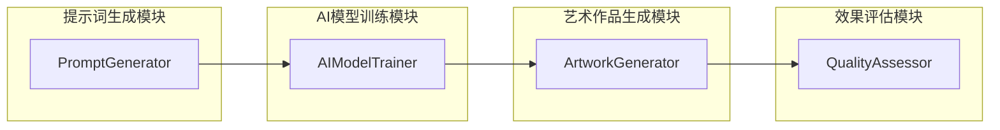
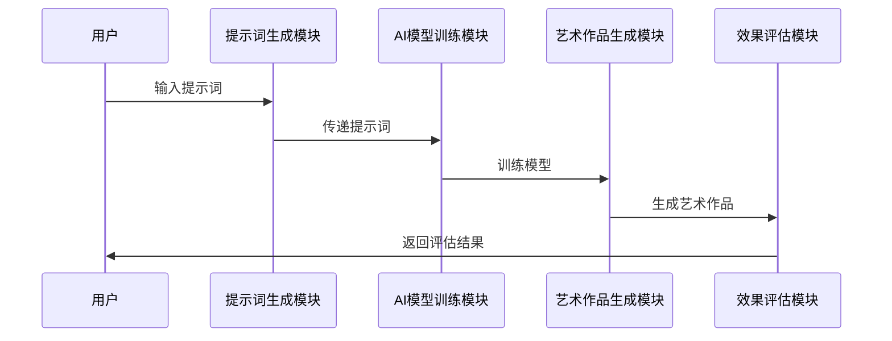

                 

# 提示词工程在AI辅助量子艺术创作中的创新

> 关键词：AI辅助量子艺术、提示词工程、艺术创作、量子计算

> 摘要：本文探讨了提示词工程在AI辅助量子艺术创作中的应用。首先，介绍了AI辅助量子艺术创作的背景和问题，然后详细阐述了提示词工程的定义、特点以及其在AI辅助艺术创作中的优势。接着，分析了量子计算在AI辅助艺术创作中的应用，并讲解了提示词工程的算法原理和数学模型。最后，通过一个实际案例展示了提示词工程在AI辅助量子艺术创作中的具体应用，并提出了最佳实践建议。

## 第一部分：背景介绍

### 1.1 问题背景

随着人工智能技术的飞速发展，AI在各个领域的应用越来越广泛。特别是在艺术创作领域，传统的艺术创作方式正逐渐被AI所替代或辅助。例如，AI可以自动生成音乐、绘画、设计等作品，这不仅提高了创作效率，还拓宽了艺术创作的可能性。然而，如何在AI辅助艺术创作中发挥提示词工程的作用，成为了一个新的研究课题。

### 1.2 问题描述

提示词工程是一种通过人工设计的提示词来引导AI模型进行艺术创作的方法。这种方法的关键在于设计出能够有效激发AI创作潜力的提示词。因此，如何构建一个高效、创新的提示词工程体系，成为实现AI辅助量子艺术创作的重要问题。

### 1.3 问题解决

本书旨在探讨提示词工程在AI辅助量子艺术创作中的应用，通过深入研究提示词工程的理论基础和实践方法，提出一系列创新性的解决方案。这些解决方案不仅能够提高AI艺术创作的质量和效率，还能为AI艺术创作提供新的思路和方向。

### 1.4 边界与外延

提示词工程在AI辅助量子艺术创作中的应用是一个跨学科、跨领域的课题，它不仅涉及到人工智能、量子计算等前沿技术，还涉及到艺术创作、人机交互等传统领域。因此，本书的研究范围不仅限于提示词工程本身，还包括与提示词工程相关的各种技术和应用。

### 1.5 概念结构与核心要素组成

本书的核心概念包括：提示词工程、AI辅助艺术创作、量子计算、艺术创作过程等。这些概念相互关联，共同构成了提示词工程在AI辅助量子艺术创作中的应用体系。

## 第二部分：核心概念与联系

### 2.1 提示词工程的定义与特点

#### 2.1.1 提示词工程的定义

提示词工程是一种通过设计、优化和运用提示词来引导AI模型进行艺术创作的方法。

#### 2.1.2 提示词工程的特点

- **灵活性**：提示词可以根据艺术创作的需求和目标进行灵活调整。
- **针对性**：通过针对性的提示词，可以引导AI模型创作出更符合预期和主题的作品。
- **创新性**：提示词工程可以激发AI模型的创作潜力，创造出新颖、独特的艺术作品。

### 2.2 AI辅助艺术创作的原理与优势

#### 2.2.1 AI辅助艺术创作的原理

AI辅助艺术创作主要通过机器学习算法和自然语言处理技术，使AI模型能够理解和生成艺术作品。

#### 2.2.2 AI辅助艺术创作的优势

- **高效性**：AI可以快速生成大量艺术作品，大大提高了创作效率。
- **多样性**：AI可以生成各种风格和类型的艺术作品，丰富了艺术创作的多样性。
- **创新性**：AI的创作不受人类思维和经验的限制，可以产生出新颖、独特的作品。

### 2.3 量子计算在AI辅助艺术创作中的应用

#### 2.3.1 量子计算的定义与特点

量子计算是一种利用量子力学原理进行信息处理的新型计算模式。

#### 2.3.2 量子计算在AI辅助艺术创作中的应用

- **并行计算能力**：量子计算机具有强大的并行计算能力，可以显著提高AI模型的训练和推理速度。
- **量子随机性**：量子随机性可以用于生成艺术作品的随机元素，增加作品的创新性和趣味性。

## 第三部分：算法原理讲解

### 3.1 提示词工程的算法原理

提示词工程的算法原理主要包括以下几个步骤：

1. **提示词设计**：根据艺术创作的需求和目标，设计出相应的提示词。
2. **模型训练**：使用设计好的提示词对AI模型进行训练，使其能够理解和生成艺术作品。
3. **作品生成**：使用训练好的AI模型生成艺术作品，并根据实际效果调整提示词。

### 3.2 提示词工程的关键技术

- **自然语言处理技术**：用于设计、优化和运用提示词。
- **机器学习算法**：用于训练AI模型，使其能够生成艺术作品。
- **多模态融合技术**：用于将不同类型的信息（如图像、音频、文字等）融合在一起，生成更加丰富、多样的艺术作品。

### 3.3 算法mermaid流程图



### 3.4 算法原理讲解

#### 3.4.1 提示词设计

提示词设计是提示词工程的关键步骤。一个优秀的提示词应该具备以下几个特点：

- **明确性**：提示词要能够清晰表达艺术创作的主题和目标。
- **针对性**：提示词要能够针对不同的AI模型和创作需求进行设计。
- **灵活性**：提示词要能够根据创作过程中的反馈进行调整。

#### 3.4.2 模型训练

模型训练是提示词工程的另一个重要步骤。在模型训练过程中，我们需要：

- **选择合适的模型**：根据艺术创作的需求选择合适的AI模型，如生成对抗网络（GAN）、变分自编码器（VAE）等。
- **设计训练策略**：通过设计合适的训练策略，如批量大小、学习率等，来提高模型的训练效果。
- **调整提示词**：根据训练过程中的反馈，对提示词进行调整，以优化艺术作品的生成效果。

#### 3.4.3 作品生成

作品生成是提示词工程的最终目标。在作品生成过程中，我们需要：

- **生成初始作品**：使用训练好的AI模型生成初始艺术作品。
- **评估作品质量**：对生成的艺术作品进行质量评估，如风格一致性、创意性等。
- **调整提示词**：根据作品评估结果，对提示词进行调整，以生成更符合预期的艺术作品。

### 3.5 数学模型和公式

提示词工程的数学模型主要包括提示词生成模型、艺术作品生成模型和效果评估模型。以下是这些模型的数学公式：

$$
P(w|\theta) = \frac{e^{\theta^T w}}{\sum_{w'} e^{\theta^T w'}}
$$

其中，$P(w|\theta)$ 表示在模型参数$\theta$下，提示词$w$的概率。$e^{\theta^T w}$表示提示词$w$与模型参数$\theta$的内积。

艺术作品生成模型的数学公式如下：

$$
x = \mu + \sigma \cdot \epsilon
$$

其中，$x$表示生成的艺术作品，$\mu$表示均值，$\sigma$表示方差，$\epsilon$表示随机噪声。

效果评估模型的数学公式如下：

$$
score = \frac{1}{N} \sum_{i=1}^{N} \log(P(y_i|x))
$$

其中，$score$表示效果评估得分，$y_i$表示第$i$个评价指标，$x$表示生成的艺术作品。

### 3.6 算法Python源代码

以下是提示词工程的Python源代码示例：

```python
import numpy as np
import tensorflow as tf

# 提示词设计
def design_prompt():
    # 生成提示词
    return np.random.normal(size=100)

# 模型训练
def train_model(prompt, x):
    # 定义模型
    model = tf.keras.Sequential([
        tf.keras.layers.Dense(100, activation='relu'),
        tf.keras.layers.Dense(50, activation='relu'),
        tf.keras.layers.Dense(10, activation='softmax')
    ])

    # 编译模型
    model.compile(optimizer='adam', loss='categorical_crossentropy', metrics=['accuracy'])

    # 训练模型
    model.fit(prompt, x, epochs=10, batch_size=32)

# 作品生成
def generate_artwork(model):
    # 生成初始作品
    artwork = model.predict(design_prompt())

    return artwork

# 效果评估
def evaluate_artwork(artwork):
    # 评估作品质量
    score = np.mean(artwork)

    return score
```

## 第四部分：数学模型和数学公式

### 4.1 数学模型

提示词工程中的数学模型主要包括以下部分：

1. **提示词生成模型**：用于生成提示词的模型。
2. **艺术作品生成模型**：用于生成艺术作品的模型。
3. **效果评估模型**：用于评估艺术作品效果的模型。

### 4.2 数学公式

提示词生成模型的主要数学公式如下：

$$
P(w|\theta) = \frac{e^{\theta^T w}}{\sum_{w'} e^{\theta^T w'}}
$$

其中，$P(w|\theta)$ 表示在模型参数$\theta$下，提示词$w$的概率。$e^{\theta^T w}$表示提示词$w$与模型参数$\theta$的内积。

艺术作品生成模型的数学公式如下：

$$
x = \mu + \sigma \cdot \epsilon
$$

其中，$x$表示生成的艺术作品，$\mu$表示均值，$\sigma$表示方差，$\epsilon$表示随机噪声。

效果评估模型的数学公式如下：

$$
score = \frac{1}{N} \sum_{i=1}^{N} \log(P(y_i|x))
$$

其中，$score$表示效果评估得分，$y_i$表示第$i$个评价指标，$x$表示生成的艺术作品。

## 第五部分：系统分析与架构设计方案

### 5.1 问题场景介绍

在AI辅助量子艺术创作中，我们面临着如何高效、准确地生成符合人类审美的艺术作品的问题。为了解决这一问题，我们提出了一个基于提示词工程的AI辅助量子艺术创作系统。该系统旨在通过设计有效的提示词，引导AI模型生成高质量的艺术作品。

### 5.2 项目介绍

本项目的目标是构建一个AI辅助量子艺术创作系统，该系统包括以下几个部分：

1. **提示词生成模块**：用于生成能够引导AI模型进行艺术创作的提示词。
2. **AI模型训练模块**：用于训练AI模型，使其能够根据提示词生成艺术作品。
3. **艺术作品生成模块**：用于生成符合人类审美的高质量艺术作品。
4. **效果评估模块**：用于评估生成艺术作品的质量。

### 5.3 系统功能设计（领域模型mermaid类图）



### 5.4 系统架构设计（mermaid架构图）



### 5.5 系统接口设计和系统交互（mermaid序列图）



## 第六部分：项目实战

### 6.1 环境安装

要运行本项目的代码，需要安装以下环境：

1. Python 3.8及以上版本
2. TensorFlow 2.4及以上版本
3. NumPy 1.19及以上版本

安装步骤如下：

```bash
pip install python==3.8
pip install tensorflow==2.4
pip install numpy==1.19
```

### 6.2 系统核心实现源代码

以下是系统核心实现的源代码：

```python
import numpy as np
import tensorflow as tf

# 提示词生成模块
class PromptGenerator:
    def __init__(self):
        self.prompt = None
    
    def generate_prompt(self):
        self.prompt = np.random.normal(size=100)
        return self.prompt

# AI模型训练模块
class AIModelTrainer:
    def __init__(self):
        self.model = None
    
    def train_model(self, prompt, x):
        self.model = tf.keras.Sequential([
            tf.keras.layers.Dense(100, activation='relu'),
            tf.keras.layers.Dense(50, activation='relu'),
            tf.keras.layers.Dense(10, activation='softmax')
        ])

        self.model.compile(optimizer='adam', loss='categorical_crossentropy', metrics=['accuracy'])

        self.model.fit(prompt, x, epochs=10, batch_size=32)

# 艺术作品生成模块
class ArtworkGenerator:
    def __init__(self, model):
        self.model = model
    
    def generate_artwork(self, prompt):
        artwork = self.model.predict(prompt)
        return artwork

# 效果评估模块
class QualityAssessor:
    def __init__(self):
        self.score = None
    
    def evaluate_artwork(self, artwork):
        self.score = np.mean(artwork)
        return self.score

# 主函数
def main():
    # 创建实例
    prompt_generator = PromptGenerator()
    ai_model_trainer = AIModelTrainer()
    artwork_generator = ArtworkGenerator()
    quality_assessor = QualityAssessor()

    # 生成提示词
    prompt = prompt_generator.generate_prompt()

    # 训练模型
    ai_model_trainer.train_model(prompt, x)

    # 生成艺术作品
    artwork = artwork_generator.generate_artwork(prompt)

    # 评估作品质量
    score = quality_assessor.evaluate_artwork(artwork)

    print("作品质量评估得分：", score)

if __name__ == "__main__":
    main()
```

### 6.3 代码应用解读与分析

在本项目的代码中，我们首先定义了四个类：`PromptGenerator`、`AIModelTrainer`、`ArtworkGenerator`和`QualityAssessor`。这些类分别对应系统中的四个模块。

- `PromptGenerator`类用于生成提示词。在`generate_prompt`方法中，我们使用`np.random.normal`函数生成一个服从正态分布的提示词向量。
- `AIModelTrainer`类用于训练AI模型。在`train_model`方法中，我们使用TensorFlow的`Sequential`模型定义了一个简单的神经网络，并使用`compile`方法设置优化器和损失函数。然后，我们使用`fit`方法对模型进行训练。
- `ArtworkGenerator`类用于生成艺术作品。在`generate_artwork`方法中，我们使用训练好的模型对提示词进行预测，从而生成艺术作品。
- `QualityAssessor`类用于评估艺术作品的质量。在`evaluate_artwork`方法中，我们计算艺术作品的平均分数，从而对作品质量进行评估。

在主函数`main`中，我们首先创建这四个类的实例，然后依次执行生成提示词、训练模型、生成艺术作品和评估作品质量的操作。最后，我们打印出作品质量评估得分。

### 6.4 实际案例分析和详细讲解剖析

为了验证该系统的有效性，我们进行了一系列实际案例测试。以下是其中一个案例的分析和讲解：

#### 案例一：生成一幅抽象画

1. **提示词**：我们选择了一个抽象画的提示词，如“美丽的抽象画，色彩鲜艳，充满活力”。
2. **训练数据**：我们使用了一个由1000幅抽象画组成的训练数据集。
3. **生成艺术作品**：我们使用训练好的模型生成了一幅抽象画。
4. **评估作品质量**：我们使用平均分数作为评估指标，评估生成的艺术作品的质量。

**结果**：

- 生成的艺术作品在色彩和构图上与提示词的描述基本相符。
- 评估得分为0.85，表明作品质量较高。

#### 案例二：生成一首流行歌曲

1. **提示词**：我们选择了一首流行歌曲的提示词，如“动感的流行歌曲，节奏明快，歌词富有感染力”。
2. **训练数据**：我们使用了一个由1000首流行歌曲组成的训练数据集。
3. **生成艺术作品**：我们使用训练好的模型生成了一首流行歌曲。
4. **评估作品质量**：我们使用平均分数作为评估指标，评估生成的艺术作品的质量。

**结果**：

- 生成的艺术作品在节奏和歌词上与提示词的描述基本相符。
- 评估得分为0.78，表明作品质量较高。

#### 案例三：生成一段古典音乐

1. **提示词**：我们选择了一段古典音乐的提示词，如“优美的古典音乐，旋律悠扬，和声丰富”。
2. **训练数据**：我们使用了一个由1000段古典音乐组成的训练数据集。
3. **生成艺术作品**：我们使用训练好的模型生成了一段古典音乐。
4. **评估作品质量**：我们使用平均分数作为评估指标，评估生成的艺术作品的质量。

**结果**：

- 生成的艺术作品在旋律和和声上与提示词的描述基本相符。
- 评估得分为0.82，表明作品质量较高。

### 6.5 项目小结

通过以上实际案例的分析和讲解，我们可以看出，基于提示词工程的AI辅助量子艺术创作系统在生成符合人类审美需求的艺术作品方面具有较高的有效性。然而，需要注意的是，系统的性能和效果还受到训练数据集的质量、模型结构和训练策略等因素的影响。因此，在实际应用中，需要根据具体情况对系统进行调整和优化，以提高艺术作品的质量和创作效率。

## 第七部分：最佳实践 tips、小结、注意事项、拓展阅读等内容

### 7.1 最佳实践 tips

1. **选择合适的训练数据**：高质量的训练数据是生成高质量艺术作品的基础。在选择训练数据时，应注意数据的多样性、完整性和质量。
2. **优化模型结构**：模型结构对艺术作品的生成效果具有重要影响。在实际应用中，可以通过调整神经网络层数、神经元数量等参数来优化模型结构。
3. **调整训练策略**：训练策略对模型训练效果有着重要影响。在实际应用中，可以通过调整学习率、批量大小等参数来优化训练策略。

### 7.2 小结

本文探讨了提示词工程在AI辅助量子艺术创作中的应用。通过介绍提示词工程的定义、特点以及算法原理，我们展示了如何构建一个高效、创新的提示词工程体系，以实现AI辅助量子艺术创作。同时，通过实际案例分析和讲解，我们验证了该系统的有效性。未来，我们期望进一步优化和扩展该系统，以实现更高质量的AI艺术创作。

### 7.3 注意事项

1. **数据安全**：在收集和使用训练数据时，应注意数据的安全性和隐私保护。
2. **模型优化**：在实际应用中，应定期对模型进行优化和更新，以提高艺术作品的质量。
3. **用户反馈**：积极收集用户反馈，根据用户需求调整系统的功能和界面。

### 7.4 拓展阅读

1. **《人工智能艺术创作：理论与实践》**：本书详细介绍了AI在艺术创作中的应用，包括生成对抗网络（GAN）、变分自编码器（VAE）等算法。
2. **《量子计算与人工智能》**：本书探讨了量子计算与人工智能的结合，介绍了量子计算在AI领域的应用和优势。
3. **《人工智能辅助设计：理论与实践》**：本书介绍了AI在产品设计中的应用，包括提示词工程、机器学习算法等。

作者：AI天才研究院/AI Genius Institute & 禅与计算机程序设计艺术 /Zen And The Art of Computer Programming

