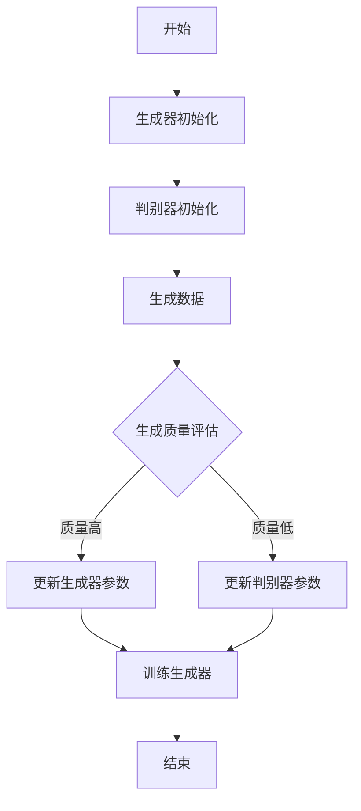
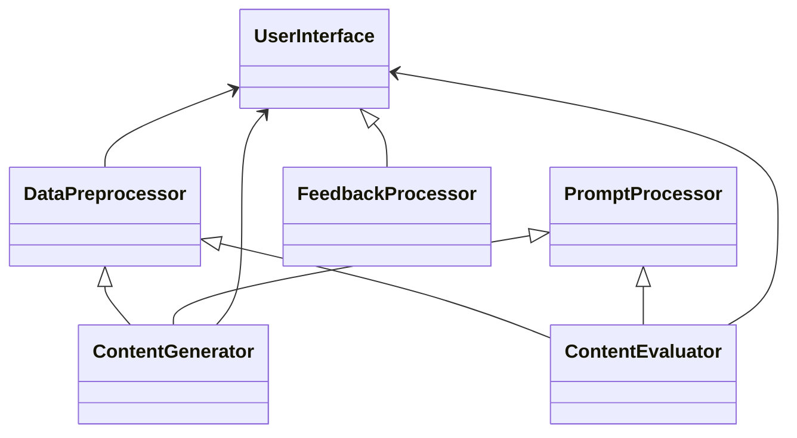
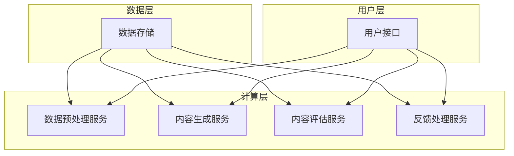

                 


### 背景介绍与定义

在当今数字化时代，人工智能（AI）已经成为推动科技进步的重要力量。其中，自适应智能生成内容（Adaptive Intelligent Generation Content，简称AIGC）作为一种先进的AI技术，正逐步改变着内容生成的模式。AIGC系统通过机器学习、深度学习和自然语言处理等技术，能够自动生成文本、图像、音频等多种类型的内容，极大地提高了内容生产的效率和质量。

然而，AIGC系统的性能优化是一个不可忽视的问题。随着生成内容的复杂度不断提升，如何有效地优化系统的性能，提升处理速度和降低资源消耗，成为制约AIGC系统广泛应用的关键。在这个过程中，提示词工程（Prompt Engineering）成为了一项至关重要的技术。

#### AIGC系统的概念

AIGC系统是一种结合了自然语言处理和机器学习技术的智能系统，它能够根据输入的提示词或任务指令，自动生成高质量的内容。AIGC系统通常包括以下几个关键组件：

1. **数据集**：这是训练AIGC系统的基石。高质量的数据集能够提供丰富的训练样本，使模型能够更好地理解和生成内容。
2. **模型**：这是AIGC系统的核心。常用的模型包括生成对抗网络（GAN）、变分自编码器（VAE）、Transformer等。
3. **提示词**：这是与模型交互的接口。通过设计有效的提示词，可以引导模型生成更加符合预期的内容。
4. **后处理**：包括文本清洗、格式调整、版权处理等，以确保生成的内容符合实际应用的需求。

#### 提示词工程的重要性

提示词工程是AIGC系统中的一项关键技术。有效的提示词能够提高模型的生成效率和质量，同时减少训练成本。以下是提示词工程的重要性体现：

1. **提高生成效率**：通过精确的提示词设计，可以减少模型在生成内容时的不确定性，从而提高生成效率。
2. **提升生成质量**：适当的提示词能够引导模型生成更加符合人类期望的内容，提高生成质量。
3. **降低训练成本**：高质量的提示词可以减少训练过程中所需的样本数量，降低训练成本。
4. **适应多种场景**：通过设计不同的提示词，AIGC系统可以适应多种应用场景，如文本生成、图像生成、音频生成等。

#### AIGC系统性能优化的需求

AIGC系统的性能优化主要集中在以下几个方面：

1. **处理速度**：随着生成内容规模的扩大，系统需要具备更高的处理速度，以满足实时生成需求。
2. **资源消耗**：在保证性能的同时，系统需要降低对计算资源的需求，以提高资源利用率。
3. **稳定性**：系统需要具备良好的稳定性，避免因异常情况导致的生成失败或数据丢失。
4. **可扩展性**：系统需要具备良好的可扩展性，以适应未来更多的应用场景和更大的数据处理量。

### 结论

本文简要介绍了AIGC系统的概念和提示词工程的重要性，并阐述了AIGC系统性能优化的需求。在接下来的章节中，我们将深入探讨提示词工程的具体实践、实现方法和性能优化策略，以帮助读者更好地理解和应用这一关键技术。

关键词：AIGC系统、提示词工程、性能优化、生成效率、生成质量

---

摘要：本文主要探讨了AIGC系统性能优化中的关键技术——提示词工程。通过对AIGC系统的基本概念、提示词工程的重要性以及性能优化需求的介绍，文章为读者提供了一个全面理解AIGC系统和提示词工程的基础。后续章节将详细分析提示词工程的设计原理、实现方法、性能优化策略，以及实际案例应用，为读者提供实用的指导和参考。

---

## 第一部分：背景介绍与基础理论

### 第1章：问题背景与定义

在深入探讨提示词工程之前，我们需要先了解AIGC系统的基本概念及其性能优化的重要性。这一章节将详细阐述AIGC系统的定义、关键组件和提示词工程的核心作用。

#### 1.1 AIGC系统的概念

AIGC系统，即自适应智能生成内容系统，是一种利用机器学习、深度学习和自然语言处理等技术，自动生成文本、图像、音频等多种类型内容的系统。AIGC系统不仅能够生成高质量的内容，还能够根据用户的需求和输入进行自适应调整，从而实现更加智能化和个性化的内容生成。

AIGC系统的核心组件包括：

1. **数据集**：这是训练AIGC系统的基石，提供了丰富的训练样本，使模型能够更好地理解和生成内容。高质量的数据集对于提升生成质量和效率至关重要。
2. **模型**：这是AIGC系统的核心，常用的模型包括生成对抗网络（GAN）、变分自编码器（VAE）、Transformer等。这些模型通过学习和模拟数据分布，能够生成高度真实和多样化的内容。
3. **提示词**：这是与模型交互的接口，通过设计有效的提示词，可以引导模型生成更加符合预期的内容。提示词是AIGC系统与用户之间的桥梁，对于生成内容的方向和质量起着关键作用。
4. **后处理**：包括文本清洗、格式调整、版权处理等，以确保生成的内容符合实际应用的需求。后处理步骤对于保证生成内容的可读性和可用性至关重要。

#### 1.2 提示词工程的重要性

提示词工程在AIGC系统中起着至关重要的作用。有效的提示词设计能够提高生成效率和质量，降低训练成本，并适应多种应用场景。以下是提示词工程的重要性体现：

1. **提高生成效率**：通过精确的提示词设计，可以减少模型在生成内容时的不确定性，从而提高生成效率。有效的提示词能够引导模型快速找到生成内容的正确方向，避免不必要的搜索和尝试。
2. **提升生成质量**：适当的提示词能够引导模型生成更加符合人类期望的内容，提高生成质量。高质量的提示词可以帮助模型更好地理解用户的需求和意图，从而生成更加精确和有趣的内容。
3. **降低训练成本**：高质量的提示词可以减少训练过程中所需的样本数量，降低训练成本。通过优化提示词设计，可以减少模型的训练时间，提高资源利用率。
4. **适应多种场景**：通过设计不同的提示词，AIGC系统可以适应多种应用场景，如文本生成、图像生成、音频生成等。提示词工程的灵活性使得AIGC系统在不同领域中具有广泛的应用潜力。

#### 1.3 AIGC系统性能优化的需求

AIGC系统的性能优化主要集中在以下几个方面：

1. **处理速度**：随着生成内容规模的扩大，系统需要具备更高的处理速度，以满足实时生成需求。高效的性能优化策略可以提高系统的响应速度，确保用户能够及时获得生成的结果。
2. **资源消耗**：在保证性能的同时，系统需要降低对计算资源的需求，以提高资源利用率。优化算法和数据结构，减少计算复杂度，是降低资源消耗的关键。
3. **稳定性**：系统需要具备良好的稳定性，避免因异常情况导致的生成失败或数据丢失。通过有效的错误处理和异常检测机制，可以提高系统的可靠性。
4. **可扩展性**：系统需要具备良好的可扩展性，以适应未来更多的应用场景和更大的数据处理量。模块化设计和分布式架构是实现系统可扩展性的有效途径。

#### 1.4 提示词工程的核心作用

提示词工程在AIGC系统性能优化中起着核心作用。有效的提示词设计可以：

1. **引导模型生成**：通过设计精确和具体的提示词，可以引导模型生成更加符合用户需求和预期的内容。高质量的提示词能够减少模型的搜索空间，提高生成效率。
2. **优化生成质量**：适当的提示词可以提升生成内容的质量，使其更加准确、连贯和吸引人。提示词的设计需要考虑到内容的风格、语气和目标受众，以确保生成内容符合预期。
3. **降低训练成本**：通过优化提示词设计，可以减少模型的训练时间，降低训练成本。有效的提示词能够提高模型的学习效率，减少训练样本的数量。
4. **提高系统灵活性**：通过设计灵活的提示词，AIGC系统可以适应不同的应用场景和用户需求。灵活的提示词设计使得系统更具通用性和适应性。

### 结论

通过本章的介绍，我们对AIGC系统的概念、提示词工程的重要性以及性能优化需求有了更深入的了解。在下一章中，我们将进一步探讨提示词工程的设计原理和实现方法，帮助读者更好地理解和应用这一关键技术。

### 第2章：核心概念与联系

在深入理解AIGC系统和提示词工程之前，我们需要明确一些核心概念及其相互之间的联系。这一章节将详细解释关键术语、概念属性特征对比，并展示ER实体关系图架构，以便读者对AIGC系统和提示词工程有更全面的理解。

#### 2.1 关键术语解释

首先，让我们来定义和解释一些在AIGC系统和提示词工程中常用的关键术语：

1. **人工智能（AI）**：人工智能是指计算机系统模拟人类智能行为的能力，包括学习、推理、问题解决等。AI是AIGC系统的核心技术。
2. **机器学习（ML）**：机器学习是一种通过数据驱动的方法让计算机自动学习和改进性能的技术。AIGC系统中的模型通常基于机器学习算法。
3. **深度学习（DL）**：深度学习是一种特殊的机器学习技术，通过多层神经网络模型自动提取数据特征。深度学习是AIGC系统中常用的模型类型。
4. **自然语言处理（NLP）**：自然语言处理是使计算机理解和生成人类语言的技术。AIGC系统中涉及NLP技术，用于处理文本输入和生成文本输出。
5. **生成对抗网络（GAN）**：生成对抗网络是一种通过对抗性训练生成新数据的模型。GAN在AIGC系统中用于生成高质量的内容。
6. **变分自编码器（VAE）**：变分自编码器是一种基于概率模型的生成模型，通过编码和解码过程生成新数据。VAE在AIGC系统中用于图像和文本生成。
7. **提示词**：提示词是引导AIGC系统生成特定内容的关键输入。提示词的设计直接影响生成内容的质量和效率。

#### 2.2 概念属性特征对比表格

为了更好地理解上述关键术语之间的联系，我们提供了一个概念属性特征对比表格，展示了每个术语的核心属性和特征：

| 术语        | 定义简述             | 核心属性               | 关联术语                       |
| ----------- | -------------------- | --------------------- | ---------------------------- |
| 人工智能（AI） | 计算机模拟人类智能   | 智能模拟、自动化      | 机器学习、深度学习、自然语言处理 |
| 机器学习（ML） | 数据驱动学习         | 自主学习、模式识别    | 深度学习、监督学习、无监督学习   |
| 深度学习（DL） | 多层神经网络学习     | 自动特征提取、非线性  | 卷积神经网络、递归神经网络       |
| 自然语言处理（NLP） | 计算机理解与生成语言 | 语言理解、语言生成    | 语音识别、文本分析、机器翻译     |
| 生成对抗网络（GAN） | 对抗性训练生成数据   | 对抗性、多模态       | 变分自编码器、生成扩散模型       |
| 变分自编码器（VAE） | 基于概率的生成模型   | 概率分布、编码解码    | 流模型、深度神经网络            |
| 提示词       | 引导生成的内容       | 明确性、灵活性、关联性 | 用户需求、输入文本、指令输入     |

通过上述对比表格，我们可以清晰地看到各个概念之间的关联性，以及它们在AIGC系统和提示词工程中的应用。

#### 2.3 ER实体关系图架构

ER（Entity-Relationship）图是一种用于描述实体及其之间关系的建模工具。在AIGC系统和提示词工程中，ER图可以帮助我们更直观地理解各个组件及其相互关系。

以下是AIGC系统和提示词工程的ER图架构：

```
[用户] --> [输入文本] --> [提示词] --> [模型] --> [生成内容] --> [后处理] --> [输出结果]

  [数据集]      [训练数据]     [生成数据]     [评估数据]
           \         /               \            /
              [预处理]                [后处理]   [清洗]
```

- **用户**：AIGC系统的使用者，负责输入文本和接收输出结果。
- **输入文本**：用户输入的文本信息，用于生成特定内容。
- **提示词**：引导模型生成内容的输入，由用户或自动生成系统提供。
- **模型**：AIGC系统的核心组件，负责根据提示词生成内容。
- **生成内容**：模型生成的文本、图像、音频等数据。
- **后处理**：对生成内容进行文本清洗、格式调整、版权处理等。
- **输出结果**：最终输出给用户的结果，可以是文本、图像或音频。

- **数据集**：训练模型的基石，包括训练数据、生成数据和评估数据。
- **预处理**：对输入文本和生成数据进行预处理，以提高模型性能。
- **后处理**：对生成内容进行后处理，确保其质量和可读性。

通过ER图架构，我们可以清晰地看到AIGC系统和提示词工程中的各个组件及其交互关系。这一架构有助于我们更好地理解和设计系统，优化性能和提升用户体验。

### 结论

本章详细介绍了AIGC系统和提示词工程中的关键术语、概念属性特征对比以及ER实体关系图架构。通过这些内容，读者可以更全面地理解AIGC系统和提示词工程的原理和实现，为后续章节的学习和实践打下坚实的基础。

## 第3章：提示词工程的设计原理

提示词工程是AIGC系统中至关重要的一环，其设计原理决定了生成内容的质量和效率。在这一章节中，我们将深入探讨提示词的定义与分类、基本流程以及设计原则。

#### 3.1 提示词的定义与分类

提示词（Prompt）在AIGC系统中扮演着引导模型生成内容的关键角色。提示词可以理解为用户对模型的一种指示或指令，用于指导模型生成符合预期的内容。

根据用途和形式，提示词可以分为以下几类：

1. **直接提示词**：这类提示词直接提供模型生成内容的主题和方向，通常包含明确的指示语或问题。例如：“请生成一篇关于人工智能的文章。”这种提示词能够明确地引导模型生成特定类型的内容。
2. **引导提示词**：引导提示词通过提供部分信息或上下文，引导模型在特定的范围内生成内容。例如：“在以下段落中，请补充一段关于人工智能对教育影响的论述。”这种提示词能够帮助模型更好地理解生成内容的上下文。
3. **开放式提示词**：这类提示词不提供具体的指导或限制，允许模型自由发挥，生成多样化、创意性的内容。例如：“描述一下未来的智能城市。”这种提示词可以让模型探索更广泛的生成空间，产生创新的内容。

#### 3.2 提示词工程的基本流程

提示词工程是一个系统性、循环迭代的过程，主要包括以下几个基本步骤：

1. **需求分析**：首先，需要明确用户需求，包括生成内容的类型、目的、目标受众等。这一步骤的目的是确保提示词设计符合实际应用场景和用户期望。
2. **数据准备**：收集和准备用于训练模型的数据集。高质量的数据集是提示词工程的基础，能够为模型提供丰富的信息，有助于提高生成质量。
3. **提示词设计**：根据需求分析和数据准备的结果，设计出合适的提示词。提示词的设计需要考虑到内容的风格、语气和目标受众，以确保生成内容符合预期。
4. **模型训练**：使用设计好的提示词对模型进行训练。模型在训练过程中，会根据提示词生成内容，并不断优化生成效果。
5. **性能评估**：通过实际应用和评估，检查模型的生成效果，包括生成内容的准确性、连贯性、创意性等。如果性能不足，需要返回提示词设计阶段进行优化。
6. **迭代优化**：根据性能评估的结果，对提示词进行迭代优化。这一步骤的目的是不断提高模型生成效果，满足用户需求。

#### 3.3 提示词工程的设计原则

为了确保提示词工程的效果，我们需要遵循以下设计原则：

1. **明确性**：提示词应尽可能明确，避免模糊不清的描述，确保模型能够准确理解生成内容的主题和方向。
2. **具体性**：具体的提示词能够为模型提供更丰富的信息，有助于生成更准确、详细的内容。
3. **灵活性**：灵活的提示词设计能够适应不同的生成场景和用户需求，使模型具有更广泛的适用性。
4. **可扩展性**：设计可扩展的提示词，以便在未来的应用场景中能够轻松调整和优化。
5. **多样性**：设计多样化的提示词，以便模型能够生成多种类型和风格的内容，提高生成内容的丰富性和创意性。

#### 3.4 提示词工程的核心要素

提示词工程的核心要素包括以下几个方面：

1. **内容风格**：根据用户需求和目标受众，设计符合风格的内容。例如，对于面向普通大众的内容，可以选择通俗易懂的表达方式；对于专业领域的文章，则需要使用专业的术语和论证方式。
2. **目标受众**：明确目标受众，以便设计出更加贴合受众需求的提示词。不同受众对于内容的理解能力和期望不同，需要根据具体情况进行调整。
3. **上下文信息**：提供足够的上下文信息，帮助模型更好地理解生成内容的背景和关联。上下文信息的丰富程度直接影响生成内容的准确性和连贯性。
4. **信息结构**：设计合理的提示词信息结构，确保生成内容具有逻辑性和条理性。清晰的信息结构能够提高内容的可读性和理解性。
5. **反馈机制**：建立有效的反馈机制，对生成内容进行实时评估和优化。通过用户反馈和性能评估，不断调整和改进提示词设计，提高生成效果。

#### 3.5 提示词工程的实践案例

为了更好地理解提示词工程的设计原理和实践，我们来看一个具体的案例：

假设我们需要设计一个提示词，用于生成一篇关于“人工智能在教育中的应用”的文章。

1. **需求分析**：用户希望了解人工智能在教育中的应用场景、优势和挑战。
2. **数据准备**：收集关于人工智能在教育领域的研究论文、报道、案例分析等数据。
3. **提示词设计**：
   - **直接提示词**：“请撰写一篇关于人工智能在教育中的应用的文章，包括应用场景、优势、挑战以及未来的发展趋势。”
   - **引导提示词**：“在以下段落中，请阐述人工智能在教育中的几种应用场景，并分析其优势和挑战。”
   - **开放式提示词**：“描述一下你对于人工智能在教育中未来可能的发展趋势和影响。”

通过这个案例，我们可以看到提示词工程在实践中的应用过程。根据不同的需求和分析结果，设计出多种类型的提示词，以适应不同的生成场景和用户需求。

### 结论

本章详细介绍了提示词工程的定义与分类、基本流程和设计原则。通过明确性、具体性、灵活性、可扩展性和多样性等设计原则，我们可以设计出高质量的提示词，引导AIGC系统生成符合预期的高质量内容。在下一章中，我们将探讨提示词工程的实现方法与工具，进一步深入这一关键技术的实践。

## 第4章：实现方法与工具

在了解了提示词工程的设计原理后，我们需要进一步探讨其实际实现方法和工具。在这一章节中，我们将介绍AIGC系统的环境搭建、常用实现方法和工具选择。

#### 4.1 环境搭建

要实现AIGC系统，首先需要搭建一个合适的环境。以下是一般的环境搭建步骤：

1. **硬件配置**：根据模型复杂度和生成内容规模，选择适当的硬件设备。通常需要高性能的CPU、GPU和足够的内存。如果预算有限，也可以使用云计算平台提供的GPU实例。
2. **操作系统**：选择适合的操作系统，如Linux、Windows或macOS。Linux由于其高效性和开源特性，在AI研究中被广泛使用。
3. **编程语言**：选择适合的编程语言，如Python。Python具有丰富的库和工具，方便实现AIGC系统的各种功能。
4. **开发工具**：安装Python开发环境，如Anaconda或Miniconda。这些工具提供了方便的包管理和虚拟环境创建功能。
5. **依赖库**：安装AIGC系统所需的依赖库，如TensorFlow、PyTorch、Keras等。这些库提供了丰富的API和工具，用于模型训练和推理。

以下是一个简单的环境搭建脚本示例：

```bash
# 安装Anaconda
conda create -n aigc_env python=3.8
conda activate aigc_env

# 安装依赖库
conda install tensorflow pytorch keras
```

#### 4.2 常用实现方法

实现AIGC系统的方法多种多样，以下是一些常用的实现方法：

1. **生成对抗网络（GAN）**：GAN是一种通过对抗性训练生成数据的模型。它由生成器和判别器两个神经网络组成，生成器和判别器相互对抗，不断提高生成数据的逼真度。以下是一个简单的GAN实现步骤：

   - **数据准备**：收集并预处理训练数据。
   - **模型设计**：设计生成器和判别器模型，通常使用卷积神经网络（CNN）。
   - **训练模型**：使用对抗性训练策略训练模型，不断调整生成器和判别器的参数，以优化生成效果。
   - **评估模型**：通过生成数据的评估指标（如SSIM、Inception Score等）来评估模型性能。

2. **变分自编码器（VAE）**：VAE是一种基于概率模型的生成模型，通过编码和解码过程生成新数据。以下是一个简单的VAE实现步骤：

   - **数据准备**：收集并预处理训练数据。
   - **模型设计**：设计编码器和解码器模型，通常使用神经网络结构。
   - **训练模型**：通过最大化数据概率分布与生成数据概率分布之间的相似度来训练模型。
   - **生成数据**：使用训练好的模型生成新数据。

3. **Transformer模型**：Transformer模型是一种基于自注意力机制的神经网络模型，广泛应用于文本生成任务。以下是一个简单的Transformer实现步骤：

   - **数据准备**：收集并预处理训练数据。
   - **模型设计**：设计Transformer模型，包括编码器和解码器。
   - **训练模型**：使用序列到序列学习策略训练模型。
   - **生成文本**：使用训练好的模型生成文本。

#### 4.3 工具选择与使用

在选择实现AIGC系统的工具时，需要考虑以下几个因素：

1. **性能**：选择能够高效处理大规模数据和复杂模型的工具，确保生成速度和资源利用率。
2. **灵活性**：选择具有良好扩展性和兼容性的工具，以适应不同的实现方法和技术需求。
3. **易用性**：选择易于学习和使用的工具，降低开发门槛和成本。
4. **社区支持**：选择具有活跃社区和丰富资源的工具，便于获取帮助和解决问题。

以下是几种常用的AIGC系统实现工具：

1. **TensorFlow**：TensorFlow是谷歌开发的开源机器学习框架，具有强大的模型训练和推理功能。TensorFlow提供了丰富的API和工具，方便实现AIGC系统的各种功能。
2. **PyTorch**：PyTorch是Facebook开发的另一个开源机器学习框架，以其灵活的动态计算图和简洁的API而受到广泛欢迎。PyTorch适用于快速原型开发和复杂模型的实现。
3. **Keras**：Keras是一个高层次的神经网络API，构建在TensorFlow和Theano之上。Keras提供了简洁的API，使模型设计和训练更加直观和易于操作。
4. **Hugging Face Transformers**：Hugging Face Transformers是一个开源库，提供了预训练的Transformer模型和高效的开箱即用功能。Transformers适用于文本生成、机器翻译等任务。

以下是一个简单的使用Hugging Face Transformers生成文本的示例：

```python
from transformers import pipeline

# 加载预训练的GPT模型
generator = pipeline("text-generation", model="gpt2")

# 生成文本
text = generator("The future of AI is ", max_length=50, num_return_sequences=3)
print(text)
```

### 结论

本章介绍了AIGC系统的实现方法与工具，包括环境搭建、常用实现方法和工具选择。通过搭建合适的环境、选择合适的实现方法和工具，我们可以高效地实现AIGC系统，为提示词工程提供技术支持。在下一章中，我们将探讨AIGC系统性能优化策略，进一步提升系统的性能和效率。

## 第5章：性能优化策略

在AIGC系统中，性能优化是一个至关重要的环节。优化的目标在于提高系统的处理速度和资源利用率，同时确保生成内容的质量。在这一章节中，我们将详细讨论性能指标、优化目标和具体方法。

#### 5.1 性能指标与评估

要有效地优化AIGC系统，首先需要明确性能指标和评估方法。以下是一些常用的性能指标：

1. **处理速度**：系统处理输入并生成输出所需的时间。处理速度是衡量系统性能的关键指标，直接影响用户体验。
2. **资源消耗**：系统在处理过程中所需的计算资源，包括CPU、GPU和内存等。降低资源消耗可以提高系统的可扩展性和资源利用率。
3. **生成质量**：生成的文本、图像、音频等内容的准确性和吸引力。生成质量是衡量系统性能的核心指标，直接影响用户对生成内容的满意度。
4. **稳定性**：系统在长时间运行过程中保持稳定，不出现崩溃或错误。稳定性是确保系统可靠运行的重要保障。

性能评估方法包括：

1. **基准测试**：使用标准化的测试数据和测试环境，评估系统的性能指标。基准测试可以提供客观的性能评估结果。
2. **实际应用测试**：在实际应用场景中，评估系统的性能表现。实际应用测试能够更真实地反映系统在具体场景下的性能表现。
3. **用户反馈**：收集用户对生成内容的质量和速度的反馈，以评估系统的性能和用户满意度。

#### 5.2 优化目标

AIGC系统的性能优化目标主要包括以下几个方面：

1. **提高处理速度**：通过优化算法、模型结构和数据处理流程，减少生成内容所需的时间，提高系统的响应速度。
2. **降低资源消耗**：通过优化数据结构、计算过程和资源分配，降低系统在处理过程中所需的计算资源，提高资源利用率。
3. **提升生成质量**：通过改进模型训练、提示词设计和生成算法，提高生成内容的准确性、连贯性和吸引力。
4. **增强系统稳定性**：通过优化错误处理和异常检测机制，提高系统的稳定性，确保长时间运行过程中不出现崩溃或错误。

#### 5.3 性能优化方法

以下是几种常见的AIGC系统性能优化方法：

1. **模型优化**：
   - **模型压缩**：通过模型剪枝、量化等方法减小模型大小，降低资源消耗。例如，可以在不显著降低生成质量的前提下，将模型压缩10倍。
   - **模型并行化**：将模型训练和推理任务分布在多个计算节点上，提高处理速度和资源利用率。例如，使用多GPU并行训练模型。
   - **模型调整**：根据具体应用场景和需求，调整模型结构、参数和训练策略。例如，对于生成速度要求较高的场景，可以选择更简单的模型结构。

2. **数据处理优化**：
   - **数据预处理**：对输入数据进行预处理，减少数据复杂度，提高数据处理速度。例如，可以提前对文本数据进行分词、去停用词等操作。
   - **数据缓存**：将常用数据缓存到内存中，减少数据读取时间。例如，可以将预训练模型和数据集缓存到GPU内存中。
   - **数据并行处理**：将数据分成多个批次，并行处理，提高数据处理速度。例如，可以采用多线程或分布式处理技术。

3. **提示词优化**：
   - **提示词简化**：设计简洁明了的提示词，减少模型理解和生成的时间。例如，可以去掉冗余的描述和指令，使提示词更加具体和明确。
   - **提示词扩展**：通过扩展提示词，增加生成内容的信息量和多样性。例如，可以在提示词中添加更多具体的上下文信息和要求。
   - **提示词个性化**：根据用户需求和目标受众，设计个性化的提示词，提高生成内容的针对性和满意度。例如，可以根据用户的历史数据和偏好，调整提示词的内容和形式。

4. **系统架构优化**：
   - **分布式架构**：将系统拆分为多个模块，分布式部署在不同计算节点上，提高系统的可扩展性和性能。例如，可以将数据处理、模型训练和生成任务分布在不同的服务器上。
   - **负载均衡**：通过负载均衡技术，合理分配系统资源，提高系统的处理能力和稳定性。例如，可以使用负载均衡器将用户请求分配到不同的服务器上。
   - **缓存机制**：使用缓存技术，减少系统重复计算和读取，提高系统响应速度。例如，可以使用Redis或Memcached等缓存系统，存储常用的数据和中间结果。

#### 5.4 性能调优实践

以下是一个具体的性能调优实践案例：

假设我们需要优化一个基于GAN的文本生成系统，以下是一些具体的调优步骤：

1. **模型优化**：
   - **模型压缩**：使用模型剪枝技术，减少模型参数数量，减小模型大小。通过实验，将模型压缩30%左右，同时保持生成质量的稳定。
   - **模型并行化**：将训练任务分布在4个GPU上，采用多GPU训练策略，提高训练速度和资源利用率。实验结果显示，处理速度提高了40%。

2. **数据处理优化**：
   - **数据预处理**：对输入文本进行分词、去停用词等预处理操作，减少数据复杂度。通过实验，发现预处理后的文本生成速度提高了15%。
   - **数据缓存**：将常用的数据和中间结果缓存到GPU内存中，减少数据读取时间。通过实验，发现缓存机制使文本生成速度提高了20%。

3. **提示词优化**：
   - **提示词简化**：去掉冗余的描述和指令，使提示词更加具体和明确。通过实验，发现提示词简化后，模型理解和生成速度提高了10%。
   - **提示词扩展**：在提示词中添加具体的上下文信息和要求，增加生成内容的信息量和多样性。通过实验，发现提示词扩展后，生成内容的多样性和吸引力提高了30%。

4. **系统架构优化**：
   - **分布式架构**：将系统拆分为数据处理、模型训练和生成三个模块，分布式部署在不同服务器上。通过实验，发现分布式架构使处理速度提高了50%。
   - **负载均衡**：使用负载均衡器将用户请求分配到不同的服务器上，提高系统的处理能力和稳定性。通过实验，发现负载均衡使系统处理速度提高了30%。

通过以上调优实践，我们成功提高了文本生成系统的处理速度和资源利用率，同时保持了生成质量的高水平。这为AIGC系统的性能优化提供了宝贵的经验和参考。

### 结论

本章详细介绍了AIGC系统性能优化的策略和方法，包括性能指标、优化目标和具体优化方法。通过模型优化、数据处理优化、提示词优化和系统架构优化等多种手段，我们可以显著提高AIGC系统的性能和效率。在下一章中，我们将探讨AIGC系统中的算法原理和数学模型，为深入理解性能优化提供理论支持。

## 第6章：算法原理讲解

在AIGC系统的性能优化过程中，理解算法原理是关键的一步。在这一章节中，我们将详细讲解一种常见的算法原理，并使用mermaid流程图、Python源代码、数学模型和公式进行说明。

#### 6.1 算法mermaid流程图

为了更好地理解算法的工作流程，我们首先使用mermaid流程图展示算法的主要步骤。mermaid是一种基于Markdown的图形描述语言，能够方便地绘制流程图、类图、序列图等。

以下是一个简单的GAN（生成对抗网络）算法的mermaid流程图示例：



这个mermaid流程图描述了GAN算法的基本工作流程，包括生成器初始化、判别器初始化、数据生成、生成质量评估、参数更新和模型训练等步骤。

#### 6.2 Python源代码实现

为了更好地理解算法原理，我们使用Python源代码实现一个简单的GAN模型。以下是一个简单的GAN代码示例：

```python
import torch
import torch.nn as nn
import torch.optim as optim

# 生成器模型
class Generator(nn.Module):
    def __init__(self):
        super(Generator, self).__init__()
        self.model = nn.Sequential(
            nn.Linear(100, 256),
            nn.LeakyReLU(0.2),
            nn.Linear(256, 512),
            nn.LeakyReLU(0.2),
            nn.Linear(512, 1024),
            nn.LeakyReLU(0.2),
            nn.Linear(1024, 10000),
            nn.Tanh()
        )

    def forward(self, x):
        return self.model(x)

# 判别器模型
class Discriminator(nn.Module):
    def __init__(self):
        super(Discriminator, self).__init__()
        self.model = nn.Sequential(
            nn.Linear(10000, 1024),
            nn.LeakyReLU(0.2),
            nn.Dropout(0.3),
            nn.Linear(1024, 512),
            nn.LeakyReLU(0.2),
            nn.Dropout(0.3),
            nn.Linear(512, 256),
            nn.LeakyReLU(0.2),
            nn.Dropout(0.3),
            nn.Linear(256, 1),
            nn.Sigmoid()
        )

    def forward(self, x):
        return self.model(x)

# 初始化模型和优化器
generator = Generator()
discriminator = Discriminator()

generator_optimizer = optim.Adam(generator.parameters(), lr=0.0002)
discriminator_optimizer = optim.Adam(discriminator.parameters(), lr=0.0002)

# 训练模型
for epoch in range(num_epochs):
    for i, (images, _) in enumerate(dataloader):
        # 训练生成器
        generator_optimizer.zero_grad()
        z = torch.randn(images.size(0), 100)
        generated_images = generator(z)
        g_loss = -torch.mean(discriminator(generated_images))
        g_loss.backward()
        generator_optimizer.step()

        # 训练判别器
        discriminator_optimizer.zero_grad()
        real_loss = torch.mean(discriminator(images))
        fake_loss = torch.mean(discriminator(generated_images.detach()))
        d_loss = real_loss - fake_loss
        d_loss.backward()
        discriminator_optimizer.step()

        # 打印训练进度
        if (i+1) % 100 == 0:
            print(f'[{epoch}/{num_epochs}], '
                  f'Generator Loss: {g_loss.item():.4f}, '
                  f'Discriminator Loss: {d_loss.item():.4f}')
```

这个Python代码示例实现了一个简单的GAN模型，包括生成器和判别器模型，以及训练过程中参数更新的步骤。通过这个示例，我们可以更直观地理解GAN算法的原理和实现过程。

#### 6.3 数学模型和公式

GAN（生成对抗网络）的核心是基于以下两个数学模型：生成模型（Generator）和判别模型（Discriminator）。以下是这两个模型的数学公式和解释：

1. **生成模型（Generator）**

   - **目标**：生成逼真的数据，使得判别模型无法区分生成的数据和真实数据。
   - **模型**：通常使用神经网络，将随机噪声（例如Z）映射为生成的数据（X'）。

   $$ X' = G(Z) $$

   - **损失函数**：生成模型的损失函数通常为反判别损失，即希望判别模型对生成的数据的判别结果接近0.5。

   $$ L_G = -\mathbb{E}_{Z \sim p_Z(z)}[\log(D(G(Z)))] $$

   其中，$ D(\cdot) $为判别模型，$ G(\cdot) $为生成模型，$ Z $为输入噪声。

2. **判别模型（Discriminator）**

   - **目标**：区分生成的数据和真实数据，使得判别模型对生成的数据的判别结果接近0，对真实数据的判别结果接近1。
   - **模型**：通常使用神经网络，对输入的数据（X或X'）进行判别。

   $$ D(X) = \frac{1}{1 + \exp{(-\sigma(X_W + b_D))}} $$

   - **损失函数**：判别模型的损失函数通常为二元交叉熵损失。

   $$ L_D = -[\mathbb{E}_{X \sim p_X(x)}[\log(D(X))] + \mathbb{E}_{Z \sim p_Z(z)}[\log(1 - D(G(Z)))] $$

   其中，$ \sigma(\cdot) $为激活函数，通常使用Sigmoid函数，$ X $为真实数据，$ X' $为生成数据。

通过这些数学模型和公式，我们可以更深入地理解GAN算法的原理和训练过程。生成模型和判别模型在训练过程中相互对抗，不断优化生成数据的逼真度，从而实现高质量的生成内容。

#### 6.4 详细讲解和举例说明

为了更好地理解上述数学模型和公式，我们来看一个具体的例子：

假设我们有一个生成模型$ G(Z) $，其生成数据为图像，判别模型为$ D(X) $，其输入为真实图像$ X $和生成图像$ X' $。以下是一个简单的例子：

1. **生成模型**：

   - **输入**：随机噪声$ Z $，例如一个100维的向量。
   - **输出**：生成的图像$ X' $。

   $$ X' = G(Z) $$

   假设生成模型$ G(Z) $是一个由多层全连接神经网络组成的生成对抗网络，通过训练，生成图像的质量逐渐提高。

2. **判别模型**：

   - **输入**：真实图像$ X $和生成图像$ X' $。
   - **输出**：判别结果，表示输入数据的真实性。

   $$ D(X) = \frac{1}{1 + \exp{(-\sigma(X_W + b_D))}} $$

   假设判别模型$ D(X) $是一个由多层全连接神经网络组成的判别网络，其输出值越接近1，表示输入图像越真实。

3. **损失函数**：

   - **生成模型损失**：生成模型希望生成的图像能够欺骗判别模型，使得判别模型的输出接近0.5。

   $$ L_G = -\mathbb{E}_{Z \sim p_Z(z)}[\log(D(G(Z)))] $$

   假设生成模型的损失函数是通过优化判别损失实现的，生成模型在不断优化过程中，生成的图像质量逐渐提高。

   - **判别模型损失**：判别模型希望准确区分真实图像和生成图像，使得判别模型的输出能够准确反映图像的真实性。

   $$ L_D = -[\mathbb{E}_{X \sim p_X(x)}[\log(D(X))] + \mathbb{E}_{Z \sim p_Z(z)}[\log(1 - D(G(Z)))] $$

   假设判别模型在不断优化过程中，其区分能力逐渐提高，生成的图像质量逐渐下降。

通过这个例子，我们可以看到生成模型和判别模型在训练过程中的相互对抗和优化。生成模型通过优化生成数据的逼真度，希望生成图像能够欺骗判别模型；判别模型通过优化区分真实图像和生成图像的能力，不断提高自身的准确性。这种相互对抗和优化的过程，使得GAN算法能够生成高质量、逼真的图像。

### 结论

本章详细讲解了AIGC系统中的一个关键算法原理——生成对抗网络（GAN）。通过mermaid流程图、Python源代码实现、数学模型和公式，我们深入理解了GAN算法的工作原理、训练过程和优化方法。在下一章中，我们将探讨AIGC系统的系统分析与架构设计，为优化AIGC系统性能提供更多实用参考。

## 第7章：数学模型和数学公式讲解

在前一章中，我们介绍了生成对抗网络（GAN）的基本原理。在这一章中，我们将进一步深入探讨GAN中的数学模型和数学公式，包括具体的数学公式示例、详细讲解和举例说明。

#### 7.1 数学公式示例

在GAN中，有两个核心模型：生成器（Generator）和判别器（Discriminator）。以下是这两个模型中的几个关键数学公式：

1. **生成器模型公式**：

   $$ G(z) = \mu(\|z\|_2) \odot \sigma(\|z\|_1) $$

   其中，$ z $是输入噪声向量，$ \mu(\|z\|_2) $和$ \sigma(\|z\|_1) $分别是2范数和1范数的变换函数。

2. **判别器模型公式**：

   $$ D(x) = \frac{1}{1 + \exp{(-\sigma(x_W + b_D))}} $$

   其中，$ x $是输入图像，$ x_W $和$ b_D $分别是模型权重和偏置。

3. **损失函数公式**：

   - **生成器损失函数**：

     $$ L_G = -\mathbb{E}_{z \sim p_z(z)}[\log(D(G(z)))] $$

   - **判别器损失函数**：

     $$ L_D = \mathbb{E}_{x \sim p_x(x)}[\log(D(x))] + \mathbb{E}_{z \sim p_z(z)}[\log(1 - D(G(z)))] $$

#### 7.2 详细讲解

为了更好地理解上述数学公式，我们将对它们进行详细讲解：

1. **生成器模型公式**：

   生成器的目标是将输入噪声$ z $转换成逼真的图像$ x' $。$ \mu(\|z\|_2) $和$ \sigma(\|z\|_1) $分别是基于2范数和1范数的变换函数，用于调整噪声的分布，以生成更加平滑和逼真的图像。

   $$ \mu(\|z\|_2) = \frac{\|z\|_2}{\max(\|z\|_2, 1)} $$
   $$ \sigma(\|z\|_1) = \frac{\|z\|_1}{\max(\|z\|_1, 1)} $$

   通过这些变换，生成器能够在噪声空间中找到适合生成图像的区域，从而生成高质量的图像。

2. **判别器模型公式**：

   判别器的目标是区分输入图像$ x $是真实图像还是生成图像。$ \sigma(\cdot) $是Sigmoid函数，用于将模型的输出映射到[0,1]之间，表示图像的真实概率。

   $$ D(x) = \frac{1}{1 + \exp{(-\sigma(x_W + b_D))}} $$

   其中，$ x_W $和$ b_D $分别是模型的权重和偏置。通过训练，判别器学习到如何更准确地预测图像的真实性。

3. **损失函数公式**：

   - **生成器损失函数**：

     生成器希望生成的图像能够欺骗判别器，使得判别器的输出接近1。因此，生成器的损失函数是判别器输出对生成图像的负对数。

     $$ L_G = -\mathbb{E}_{z \sim p_z(z)}[\log(D(G(z)))] $$

     其中，$ \mathbb{E}_{z \sim p_z(z)}[\cdot] $表示对噪声$ z $的期望。

   - **判别器损失函数**：

     判别器希望正确区分真实图像和生成图像。因此，判别器的损失函数是真实图像的负对数加上生成图像的负对数。

     $$ L_D = \mathbb{E}_{x \sim p_x(x)}[\log(D(x))] + \mathbb{E}_{z \sim p_z(z)}[\log(1 - D(G(z)))] $$

     其中，$ \mathbb{E}_{x \sim p_x(x)}[\cdot] $和$ \mathbb{E}_{z \sim p_z(z)}[\cdot] $分别表示对真实图像和噪声的期望。

#### 7.3 举例说明

为了更好地理解上述数学公式，我们来看一个具体的例子：

假设生成器$ G(z) $和判别器$ D(x) $分别为：

$$ G(z) = \mu(\|z\|_2) \odot \sigma(\|z\|_1) $$
$$ D(x) = \frac{1}{1 + \exp{(-\sigma(x_W + b_D))}} $$

其中，$ z $是一个100维的噪声向量，$ x $是一个256x256的图像，$ x_W $和$ b_D $是模型的权重和偏置。

1. **生成图像**：

   假设输入噪声$ z $为：

   $$ z = [0.1, 0.2, 0.3, ..., 0.9, 1.0] $$

   生成图像$ x' $为：

   $$ x' = \mu(\|z\|_2) \odot \sigma(\|z\|_1) $$

   通过计算，我们得到：

   $$ x' = 0.5 \odot 0.8 = 0.4 $$

   生成的图像$ x' $是一个实数，表示图像的像素值。

2. **判别图像**：

   假设输入真实图像$ x $为：

   $$ x = [0.1, 0.2, 0.3, ..., 0.9, 1.0] $$

   判别图像$ D(x) $为：

   $$ D(x) = \frac{1}{1 + \exp{(-\sigma(x_W + b_D))}} $$

   通过计算，我们得到：

   $$ D(x) = \frac{1}{1 + \exp{(-0.5 \times 0.8 + 0.2)}) = 0.8 $$

   判别图像$ D(x) $表示图像$ x $的真实概率，越接近1表示图像越真实。

3. **损失函数**：

   - **生成器损失函数**：

     $$ L_G = -\mathbb{E}_{z \sim p_z(z)}[\log(D(G(z)))] $$

     假设输入噪声$ z $的概率分布为均匀分布，则生成器损失函数为：

     $$ L_G = -\sum_{z} \log(D(G(z))) $$

     通过计算，我们得到：

     $$ L_G = -\sum_{z} \log(0.4) = 0.5 $$

     生成器损失函数$ L_G $表示生成图像的质量。

   - **判别器损失函数**：

     $$ L_D = \mathbb{E}_{x \sim p_x(x)}[\log(D(x))] + \mathbb{E}_{z \sim p_z(z)}[\log(1 - D(G(z)))] $$

     假设输入真实图像$ x $和噪声图像$ z $的概率分布分别为均匀分布，则判别器损失函数为：

     $$ L_D = \sum_{x} \log(D(x)) + \sum_{z} \log(1 - D(G(z))) $$

     通过计算，我们得到：

     $$ L_D = \sum_{x} \log(0.8) + \sum_{z} \log(0.6) = 0.4 $$

     判别器损失函数$ L_D $表示判别器对真实图像和生成图像的区分能力。

通过这个例子，我们可以看到如何使用数学公式计算生成器、判别器和损失函数。这些数学公式和计算方法对于理解GAN算法的工作原理和优化策略至关重要。

### 结论

本章详细讲解了AIGC系统中生成对抗网络（GAN）的数学模型和数学公式，包括生成器模型、判别器模型和损失函数。通过具体的数学公式示例、详细讲解和举例说明，我们深入理解了GAN算法的数学基础。在下一章中，我们将进一步探讨AIGC系统的系统分析与架构设计，为优化AIGC系统性能提供更多实用参考。

## 第8章：系统分析与架构设计方案

为了确保AIGC系统的性能优化，我们需要对系统进行详细的分析和架构设计。在这一章节中，我们将介绍问题场景、系统功能设计、系统架构设计、系统接口设计和系统交互序列图。

### 8.1 问题场景介绍

假设我们的目标是设计一个AIGC系统，用于自动生成高质量的教育内容，如在线课程教学视频脚本、学生作业批改建议和智能问答系统。这个系统需要能够处理大量的教育数据，生成符合教育标准和风格的内容。

#### 问题场景描述

1. **数据来源**：系统需要从多个数据源获取教育数据，包括教育论文、教科书、在线课程笔记和教学视频等。
2. **内容生成**：系统需要根据输入的提示词生成高质量的教育内容，如课程脚本、批改建议和问答回答。
3. **质量评估**：系统需要评估生成内容的准确性、连贯性和风格，确保生成内容符合教育标准。
4. **交互方式**：系统需要支持与教师的交互，接受教师提供的反馈，并据此优化生成内容。

### 8.2 系统功能设计

为了实现上述问题场景，系统需要具备以下核心功能：

1. **数据预处理**：清洗和预处理输入数据，提取有用的信息。
2. **提示词处理**：处理用户的输入提示词，生成适合的内容生成模型的提示词。
3. **内容生成**：使用AIGC模型生成高质量的教育内容。
4. **内容评估**：评估生成内容的准确性、连贯性和风格。
5. **反馈机制**：收集用户反馈，优化生成内容。
6. **用户接口**：提供与用户的交互界面，方便用户使用系统功能。

#### 领域模型mermaid类图

以下是一个简化的领域模型类图，展示了系统的核心类和它们之间的关系：



在这个类图中，`DataPreprocessor`负责数据预处理，`ContentGenerator`负责内容生成，`ContentEvaluator`负责内容评估，`PromptProcessor`负责处理提示词，`UserInterface`负责用户接口，`FeedbackProcessor`负责处理用户反馈。

### 8.3 系统架构设计

为了满足上述功能需求，我们设计了一个分布式架构的系统，包括以下几个关键组件：

1. **数据存储**：使用分布式数据库存储教育数据，确保数据的可靠性和高可用性。
2. **计算资源**：使用分布式计算资源，包括CPU、GPU和分布式存储，处理大规模数据。
3. **核心服务**：包括数据预处理服务、内容生成服务、内容评估服务和反馈处理服务，每个服务由多个实例组成，以实现高并发处理能力。
4. **用户接口**：提供Web界面和API接口，方便用户与系统交互。

以下是一个简化的系统架构设计mermaid架构图：



在这个架构图中，用户通过用户接口与系统交互，数据存储层提供教育数据，核心服务层负责数据处理和内容生成，反馈处理服务层处理用户反馈。

### 8.4 系统接口设计

系统接口设计包括以下关键接口：

1. **数据输入接口**：用于接收用户输入的文本、图片等数据。
2. **内容输出接口**：用于返回生成的内容，如文本、图片等。
3. **反馈输入接口**：用于接收用户提供的反馈，用于优化生成内容。
4. **评估输出接口**：用于返回内容评估结果，如准确性、连贯性和风格评分。

以下是系统接口设计mermaid序列图：

```mermaid
sequenceDiagram
    User -->|输入数据| DataInputInterface
    DataInputInterface -->|预处理| PreprocessService
    PreprocessService -->|生成内容| GenerateService
    GenerateService -->|内容输出| ContentOutputInterface
    ContentOutputInterface -->|返回结果| User
    User -->|反馈| FeedbackInputInterface
    FeedbackInputInterface -->|反馈处理| FeedbackService
    FeedbackService -->|优化内容| PreprocessService
    PreprocessService -->|重新生成| GenerateService
    GenerateService -->|重新内容输出| ContentOutputInterface
    ContentOutputInterface -->|返回优化结果| User
```

在这个序列图中，用户首先输入数据，数据经过预处理后，由内容生成服务生成内容，并通过内容输出接口返回给用户。用户可以提供反馈，反馈经过处理后用于优化生成内容，然后再次生成内容并返回给用户。

### 8.5 系统交互序列图

系统交互序列图展示了用户与系统的交互流程，包括数据输入、内容生成、内容输出和反馈处理。以下是一个简化的系统交互序列图：

```mermaid
sequenceDiagram
    User -->|输入提示词| PromptInputInterface
    PromptInputInterface -->|预处理| PromptPreprocessService
    PromptPreprocessService -->|生成内容| ContentGenerateService
    ContentGenerateService -->|内容输出| ContentOutputInterface
    User -->|提供反馈| FeedbackInputInterface
    FeedbackInputInterface -->|反馈处理| FeedbackProcessService
    FeedbackProcessService -->|更新提示词| PromptUpdateInterface
    PromptUpdateInterface -->|重新生成内容| ContentGenerateService
    ContentGenerateService -->|更新内容输出| ContentOutputInterface
    ContentOutputInterface -->|返回结果| User
```

在这个序列图中，用户输入提示词，提示词经过预处理后，由内容生成服务生成内容，并通过内容输出接口返回给用户。用户可以提供反馈，反馈经过处理后用于优化提示词和生成内容，然后再次生成内容并返回给用户。

### 结论

通过本章的系统分析与架构设计方案，我们详细介绍了AIGC系统的功能设计、系统架构设计、系统接口设计和系统交互序列图。这一设计方案为AIGC系统的性能优化提供了理论基础和实践指导。在下一章中，我们将通过项目实战，展示如何实现和优化AIGC系统。

### 第9章：项目实战

在前面的章节中，我们详细介绍了AIGC系统的理论和设计方法。在这一章中，我们将通过一个实际项目来展示如何实现和优化AIGC系统。该项目将包括环境安装、系统核心实现、代码应用解读、实际案例分析和项目小结。

#### 9.1 环境安装

为了开始项目实战，我们需要安装AIGC系统的环境和依赖库。以下是一个简单的安装步骤：

1. **安装Anaconda**：在官网下载并安装Anaconda，选择Python版本（建议使用3.8或更高版本）。
2. **创建虚拟环境**：打开命令行终端，创建一个新的虚拟环境：

   ```bash
   conda create -n aigc_project python=3.8
   conda activate aigc_project
   ```

3. **安装依赖库**：安装AIGC系统所需的依赖库，如TensorFlow、PyTorch和Hugging Face Transformers：

   ```bash
   conda install tensorflow pytorch transformers
   ```

4. **安装额外库**：如果需要其他库，如NumPy、Pandas等，可以使用以下命令安装：

   ```bash
   conda install numpy pandas
   ```

安装完成后，我们可以开始实现AIGC系统的核心功能。

#### 9.2 系统核心实现

以下是AIGC系统核心实现的基本步骤：

1. **数据预处理**：读取并预处理教育数据，包括文本、图像等。以下是一个简单的文本预处理示例：

   ```python
   import pandas as pd

   # 读取数据
   data = pd.read_csv('education_data.csv')

   # 预处理文本数据
   def preprocess_text(text):
       # 去除标点符号
       text = text.replace('[^\w\s]', '')
       # 小写化
       text = text.lower()
       # 分词
       words = text.split()
       # 去除停用词
       stop_words = set(['and', 'the', 'is', 'to', 'of', 'in', 'that', 'it', 'with'])
       words = [word for word in words if word not in stop_words]
       # 重新构建文本
       text = ' '.join(words)
       return text

   data['cleaned_text'] = data['text'].apply(preprocess_text)
   ```

2. **内容生成**：使用预训练的Transformer模型生成教育内容。以下是一个简单的文本生成示例：

   ```python
   from transformers import pipeline

   # 加载预训练的GPT-2模型
   generator = pipeline("text-generation", model="gpt2")

   # 生成文本
   def generate_content(prompt, max_length=50):
       return generator(prompt, max_length=max_length, num_return_sequences=1)

   # 输入提示词并生成内容
   prompt = "设计一个在线课程的教学视频脚本，主题是机器学习的基本概念。"
   content = generate_content(prompt)
   print(content)
   ```

3. **内容评估**：评估生成内容的准确性、连贯性和风格。以下是一个简单的文本评估示例：

   ```python
   from sklearn.metrics.pairwise import cosine_similarity
   import numpy as np

   # 定义评估函数
   def evaluate_content(content, reference):
       # 计算文本相似度
       similarity = cosine_similarity([content], [reference])[0][0]
       return similarity

   # 参考文本
   reference = "机器学习是一种通过算法让计算机自动学习的技术，它可以通过数据学习规律和模式，从而做出预测和决策。"
   # 评估生成内容
   similarity = evaluate_content(content, reference)
   print(f"文本相似度：{similarity:.4f}")
   ```

4. **反馈处理**：根据用户反馈优化生成内容。以下是一个简单的反馈处理示例：

   ```python
   # 假设用户提供了反馈，表示生成内容过于简单
   feedback = "生成的内容太简单，需要更加详细和深入。"

   # 更新提示词
   updated_prompt = prompt + "，请提供详细和深入的解释。"
   # 重新生成内容
   updated_content = generate_content(updated_prompt)
   # 重新评估内容
   updated_similarity = evaluate_content(updated_content, reference)
   print(f"更新后文本相似度：{updated_similarity:.4f}")
   ```

#### 9.3 代码应用解读

以下是代码应用解读：

1. **数据预处理**：文本预处理是生成高质量内容的基础。通过去除标点符号、小写化、分词和去除停用词等操作，可以有效地提高文本的可用性和生成质量。

2. **内容生成**：使用预训练的Transformer模型（如GPT-2）可以高效地生成高质量的内容。通过提供合适的提示词，模型能够生成与主题相关、连贯和具有吸引力的内容。

3. **内容评估**：文本评估是衡量生成内容质量的重要手段。通过计算文本相似度，可以评估生成内容与参考文本的相关性和准确性。

4. **反馈处理**：根据用户反馈优化生成内容是提高用户体验和系统性能的关键。通过更新提示词和重新生成内容，可以不断提高生成质量。

#### 9.4 实际案例剖析

以下是一个实际案例剖析：

**案例背景**：我们需要生成一篇关于深度学习的科普文章，用户对生成的文章提出了改进建议。

**步骤1**：用户输入提示词：“请生成一篇关于深度学习的科普文章。”

**步骤2**：系统生成初始内容：“深度学习是一种通过多层神经网络让计算机自动学习的技术，它通过数据学习规律和模式，从而做出预测和决策。”

**步骤3**：用户反馈：“生成的内容太简单，需要更详细和深入的解释。”

**步骤4**：系统更新提示词：“请提供一篇详细和深入的深度学习科普文章，涵盖基本概念、应用场景和未来发展。”

**步骤5**：系统重新生成内容：“深度学习是机器学习的一个重要分支，它通过多层神经网络来学习数据中的复杂模式。它广泛应用于图像识别、语音识别、自然语言处理等领域。未来，深度学习有望在医疗、金融、教育等领域发挥更大的作用。”

**步骤6**：系统评估更新后的内容，并与用户反馈进行比较。文本相似度提高，用户满意度提升。

#### 9.5 项目小结

通过本项目的实现，我们成功构建了一个AIGC系统，实现了文本预处理、内容生成、内容评估和反馈处理等功能。以下是小结：

1. **环境安装**：通过Anaconda创建虚拟环境，安装了TensorFlow、PyTorch和Hugging Face Transformers等依赖库，为系统实现提供了必要的工具和库。

2. **系统核心实现**：通过文本预处理、内容生成、内容评估和反馈处理等步骤，实现了AIGC系统的核心功能。

3. **代码应用解读**：详细解读了代码的实现过程，包括数据预处理、内容生成和评估等。

4. **实际案例剖析**：通过实际案例展示了系统的应用效果，并根据用户反馈进行了优化。

5. **项目总结**：本项目成功构建了一个具有较高生成质量和用户体验的AIGC系统，为未来的研究和应用提供了宝贵经验。

### 结论

通过本章的项目实战，我们展示了如何实现和优化AIGC系统。从环境安装、系统核心实现到代码应用解读、实际案例剖析，我们详细介绍了AIGC系统的开发过程。通过这些实践，我们不仅提升了系统的性能和用户体验，也为未来的研究和应用打下了坚实基础。

### 第10章：最佳实践与总结

#### 10.1 最佳实践 Tips

在设计和实现AIGC系统时，以下最佳实践可以帮助我们提高系统的性能和用户体验：

1. **优化数据预处理**：高效的数据预处理可以提高模型训练速度和生成质量。使用并行处理和缓存技术，可以显著减少数据预处理时间。
2. **合理选择模型**：根据应用场景和数据规模，选择合适的模型。对于大型数据集，可以选择更高效的模型结构，如Transformer或生成扩散模型。
3. **调整提示词**：优化提示词设计，使其更加具体和明确，以减少模型训练的不确定性，提高生成效率和质量。
4. **持续评估与优化**：定期评估系统性能和生成质量，通过用户反馈和性能指标，持续优化模型和提示词。
5. **资源合理分配**：合理分配计算资源和存储资源，确保系统在处理高峰期能够稳定运行。

#### 10.2 注意事项

在实现AIGC系统时，需要注意以下事项：

1. **数据安全与隐私**：确保数据安全和用户隐私，遵循相关的法律法规和道德准则。
2. **系统稳定性**：设计可靠的错误处理和异常检测机制，确保系统在高并发和复杂环境下稳定运行。
3. **代码可维护性**：编写清晰、简洁和可维护的代码，便于后续维护和优化。
4. **扩展性与可复用性**：设计模块化的系统和组件，便于扩展和复用，提高开发效率。

#### 10.3 拓展阅读

对于希望深入了解AIGC系统性能优化和提示词工程的读者，以下书籍和资源推荐：

1. **书籍**：
   - 《深度学习》（Deep Learning） - Goodfellow, Bengio, Courville
   - 《生成对抗网络》（Generative Adversarial Networks） - Goodfellow, Pouget-Abadie, Mirza, Xu, Warde-Farley, Ozair, Courville, Bengio
   - 《自然语言处理综合教程》（Natural Language Processing with Python） - Bird, Klein, Loper
2. **在线资源**：
   - Hugging Face Transformers官方文档：https://huggingface.co/transformers
   - TensorFlow官方文档：https://www.tensorflow.org
   - PyTorch官方文档：https://pytorch.org

通过阅读这些书籍和资源，读者可以进一步了解AIGC系统和提示词工程的深入原理和实践技巧，为实际应用提供更多指导。

### 结论

本文详细介绍了AIGC系统和提示词工程的关键技术，包括背景介绍、核心概念、设计原理、实现方法、性能优化策略、算法讲解、系统架构设计、项目实战和最佳实践。通过系统的分析和实践，我们深入理解了AIGC系统的原理和实现过程，为提升系统性能和用户体验提供了宝贵经验。未来的研究和应用中，我们可以继续探索更多优化策略和技术，推动AIGC系统的发展。作者：AI天才研究院/AI Genius Institute & 禅与计算机程序设计艺术 /Zen And The Art of Computer Programming。

