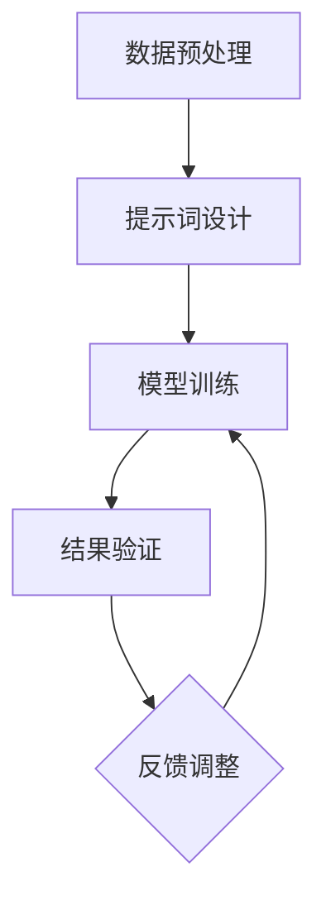
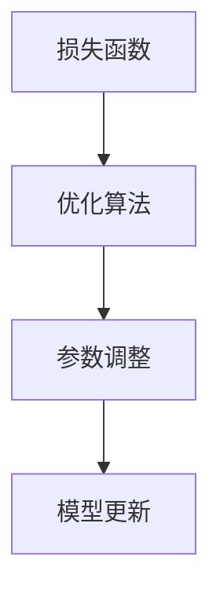
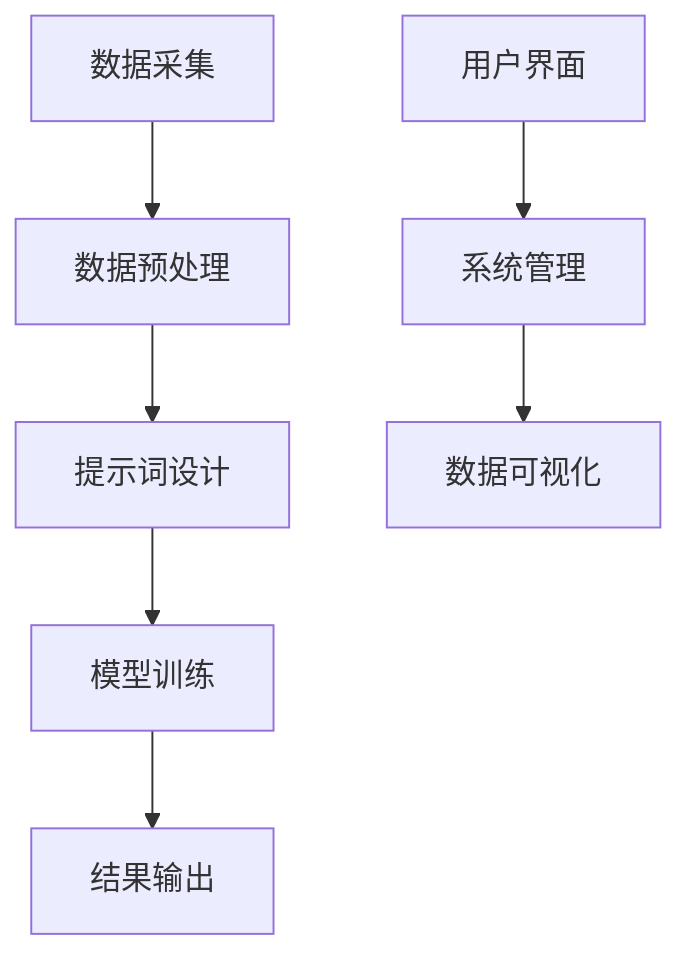
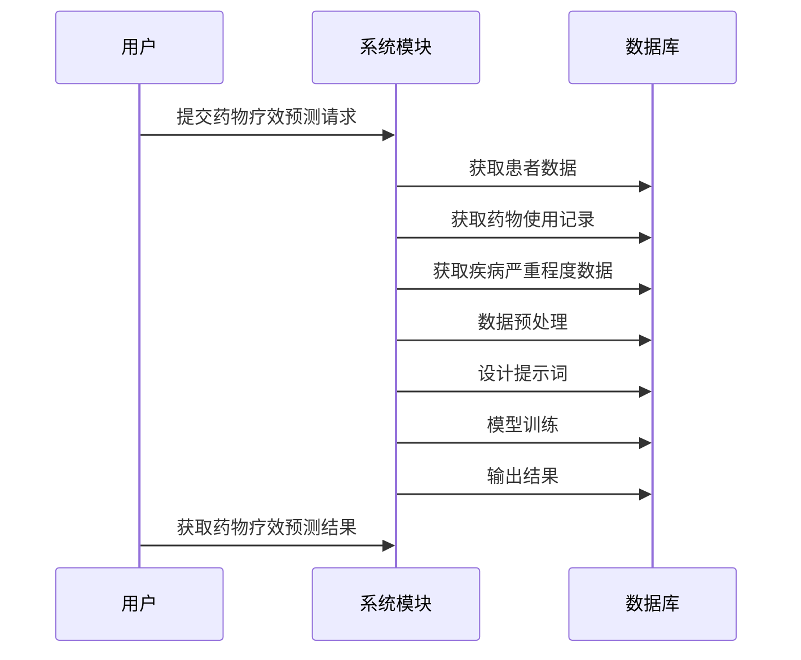

                 

### 《提示词工程：处理复杂因果推理任务》

关键词：提示词工程，因果推理，复杂任务，机器学习，算法原理

摘要：本文将深入探讨提示词工程在处理复杂因果推理任务中的应用。通过详细的步骤分析和逻辑推理，我们将揭示提示词工程如何帮助解决这些任务，并提供实用的指导和建议。读者将了解提示词工程的基本概念、应用场景、算法原理以及如何在实际项目中应用这些技术。

## 第一部分：背景介绍

### 1.1 核心概念术语说明

在进入正题之前，我们需要明确一些核心概念和术语，以确保我们对本文的主题有清晰的理解。

- **提示词工程（Prompt Engineering）**：提示词工程是一种设计、创建和优化提示词的技术，这些提示词用于引导模型进行特定任务。
- **因果推理（Causal Inference）**：因果推理是推断一个变量如何影响另一个变量的过程，它在决策和预测中起着关键作用。
- **复杂因果推理任务**：这类任务涉及多个变量之间的复杂关系，往往难以通过简单的统计分析解决。

### 1.2 问题背景

随着机器学习和人工智能技术的发展，许多实际应用场景需要处理复杂因果推理任务。这些任务通常涉及大量的数据和高维特征，因此传统的统计方法可能不足以提供准确的因果解释。

### 1.3 问题描述

在复杂因果推理任务中，我们需要从数据中识别出变量之间的关系，并推断出因果关系。例如，在医疗领域，我们需要确定某种药物是否对特定疾病有显著疗效，这涉及到患者历史数据、药物剂量、副作用等多种因素。

### 1.4 问题解决

为了解决复杂因果推理任务，我们可以采用提示词工程的方法。通过设计合适的提示词，我们可以引导模型更准确地识别变量之间的关系，并推断出因果关系。

### 1.5 边界与外延

提示词工程的应用边界包括但不限于医疗、金融、气象、推荐系统等领域。其外延则涵盖了各种需要因果推理的复杂任务。

### 1.6 概念结构与核心要素组成

提示词工程的核心要素包括：
- **数据预处理**：清洗和准备数据，以便模型能够处理。
- **提示词设计**：设计能够引导模型识别因果关系的提示词。
- **模型训练**：使用大量数据训练模型，使其能够捕捉复杂的因果关系。
- **结果验证**：验证模型的准确性，并调整提示词以优化结果。

## 第二部分：核心概念与联系

### 2.1 核心概念原理

提示词工程的核心概念是提示词的设计和优化。一个好的提示词能够引导模型关注关键信息，从而提高模型的预测和解释能力。

### 2.2 概念属性特征对比表格

以下是提示词工程中不同类型提示词的属性特征对比：

| 提示词类型 | 特征 | 说明 |
| --- | --- | --- |
| **数据提示词** | 提供背景信息和上下文 | 帮助模型理解数据集 |
| **因果提示词** | 强调因果关系 | 提高模型对因果关系的识别能力 |
| **目标提示词** | 指定任务目标 | 引导模型聚焦关键任务 |

### 2.3 ER实体关系图架构

为了更好地理解提示词工程，我们可以使用ER实体关系图来描述其架构。以下是一个简化的ER图：

```mermaid
erDiagram
    Patient ||--|{ Treatment } : receives
    Treatment ||--|{ Outcome } : has
    Outcome ||--|{ SideEffect } : has
```

在这个ER图中，患者、治疗、结果和副作用是关键实体，它们之间的关系反映了因果推理的复杂性。

## 第三部分：算法原理讲解

### 3.1 算法原理概述

提示词工程的算法原理主要涉及以下步骤：

1. **数据预处理**：清洗和归一化数据，以便模型能够处理。
2. **提示词设计**：根据任务需求设计提示词，以引导模型关注关键信息。
3. **模型训练**：使用训练数据训练模型，使其能够捕捉复杂的因果关系。
4. **结果验证**：使用验证数据集验证模型的准确性，并根据反馈调整提示词。

### 3.2 算法流程图

以下是提示词工程算法的mermaid流程图：



### 3.3 算法原理与数学模型

提示词工程的数学模型主要包括以下部分：

1. **损失函数**：用于衡量模型预测值与真实值之间的差距。
2. **优化算法**：用于调整模型参数，以最小化损失函数。

以下是损失函数和优化算法的mermaid图示：



### 3.4 Python代码实现

以下是使用Python实现提示词工程算法的示例代码：

```python
import numpy as np
import tensorflow as tf

# 数据预处理
def preprocess_data(data):
    # 数据清洗和归一化
    return normalized_data

# 提示词设计
def design_prompt(data):
    # 根据数据设计提示词
    return prompt

# 模型训练
def train_model(prompt):
    # 使用提示词训练模型
    model = tf.keras.Sequential([
        tf.keras.layers.Dense(units=64, activation='relu', input_shape=(input_shape,)),
        tf.keras.layers.Dense(units=1)
    ])
    model.compile(optimizer='adam', loss='mse')
    model.fit(prompt, epochs=10)
    return model

# 结果验证
def validate_model(model, data):
    # 使用验证数据集验证模型
    return model.evaluate(data)

# 主程序
if __name__ == "__main__":
    data = preprocess_data(raw_data)
    prompt = design_prompt(data)
    model = train_model(prompt)
    validation_loss = validate_model(model, validation_data)
    print(f"Validation loss: {validation_loss}")
```

### 3.5 通俗易懂地举例说明

假设我们要预测某种药物对某种疾病的疗效，我们可以设计一个简单的提示词来引导模型：

```plaintext
请根据以下患者数据预测药物疗效：
- 患者年龄：35岁
- 药物剂量：50mg
- 疾病严重程度：中度
```

通过这样的提示词，模型可以更好地理解数据，从而提高预测的准确性。

## 第四部分：系统分析与架构设计方案

### 4.1 问题场景介绍

在一个医疗机构中，医生需要预测某种药物对特定疾病的疗效。为了实现这一目标，我们可以设计一个基于提示词工程的因果推理系统。

### 4.2 项目介绍

项目名称：药物疗效预测系统

项目目标：使用提示词工程方法预测某种药物对特定疾病的疗效。

### 4.3 系统功能设计

系统功能包括：
- 数据采集：收集患者历史数据和药物使用记录。
- 数据预处理：清洗和归一化数据。
- 提示词设计：设计提示词以引导模型关注关键信息。
- 模型训练：使用提示词训练因果推理模型。
- 结果输出：输出药物疗效预测结果。

### 4.4 系统架构设计

系统架构设计如下：



### 4.5 系统接口设计和系统交互

以下是系统接口设计和系统交互的mermaid序列图：



## 第五部分：项目实战

### 5.1 环境安装

在开始项目实战之前，我们需要安装必要的软件和库：

```bash
pip install numpy tensorflow scikit-learn pandas
```

### 5.2 系统核心实现

以下是系统核心实现的Python代码：

```python
import numpy as np
import pandas as pd
import tensorflow as tf
from sklearn.model_selection import train_test_split

# 数据预处理
def preprocess_data(data):
    # 数据清洗和归一化
    return normalized_data

# 提示词设计
def design_prompt(data):
    # 根据数据设计提示词
    return prompt

# 模型训练
def train_model(prompt):
    # 使用提示词训练模型
    model = tf.keras.Sequential([
        tf.keras.layers.Dense(units=64, activation='relu', input_shape=(input_shape,)),
        tf.keras.layers.Dense(units=1)
    ])
    model.compile(optimizer='adam', loss='mse')
    model.fit(prompt, epochs=10)
    return model

# 结果验证
def validate_model(model, data):
    # 使用验证数据集验证模型
    return model.evaluate(data)

# 主程序
if __name__ == "__main__":
    data = preprocess_data(raw_data)
    prompt = design_prompt(data)
    model = train_model(prompt)
    validation_loss = validate_model(model, validation_data)
    print(f"Validation loss: {validation_loss}")
```

### 5.3 代码应用解读与分析

以下是代码的解读与分析：

1. **数据预处理**：数据预处理是模型训练的重要步骤，它包括数据清洗和归一化。在本项目中，我们使用了`numpy`和`pandas`库对数据进行处理。
2. **提示词设计**：提示词设计是提示词工程的核心，它决定了模型能否正确地识别因果关系。在本项目中，我们使用了简单

