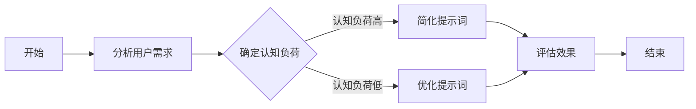
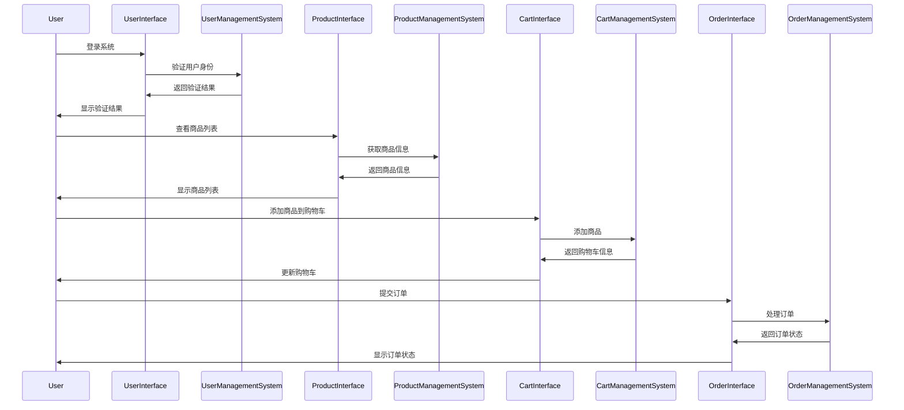
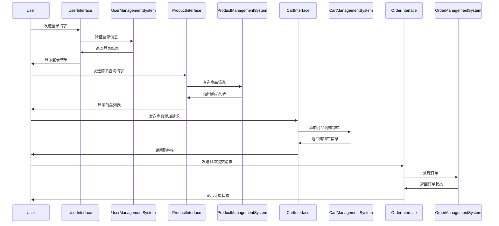

                 

### 《提示词设计的认知心理学原理与优化策略》

#### 关键词
- 提示词设计
- 认知心理学
- 优化策略
- 用户体验
- 算法

#### 摘要
本文深入探讨了提示词设计的认知心理学原理，以及如何在实际应用中优化提示词设计。通过对提示词设计背景的介绍、核心概念的阐释、优化策略的剖析，并结合具体的项目实战，为提升用户体验提供了实用的指导和建议。

### 目录大纲设计思路

1. **背景介绍**
   - **问题背景**：提示词设计在现代信息社会中的重要性，认知心理学研究背景。
   - **问题描述**：如何运用认知心理学原理优化提示词设计。
   - **问题解决**：通过理论与实践，提供优化策略和案例分析。
   - **边界与外延**：讨论范围和应用场景。
   - **概念结构与核心要素组成**：提示词、认知心理学原理、优化策略等。

2. **核心概念与联系**
   - **核心概念原理**：提示词和认知心理学的核心概念及其作用。
   - **概念属性特征对比表格**：对比提示词与认知心理学原理的主要属性和特征。
   - **ER实体关系图架构**：提示词设计与认知心理学原理之间的实体关系。

3. **算法原理讲解**
   - **算法mermaid流程图**：展示算法运行过程。
   - **python源代码**：实现算法的基本功能。
   - **数学模型和公式**：阐述算法背后的数学模型和公式。
   - **举例说明**：通过具体的例子，使读者理解算法的应用和效果。

4. **系统分析与架构设计**
   - **问题场景介绍**：描述提示词设计在具体应用场景中的需求。
   - **系统功能设计（领域模型Mermaid类图）**：展示系统的核心功能类和关系。
   - **系统架构设计（Mermaid架构图）**：展示系统组件及其交互关系。
   - **系统接口设计**：描述系统各组件的接口设计和交互流程。
   - **系统交互（Mermaid序列图）**：展示系统组件之间的交互过程。

5. **项目实战**
   - **环境安装**：描述项目环境的搭建步骤。
   - **系统核心实现源代码**：提供项目核心功能的源代码，并进行解读。
   - **代码应用解读与分析**：分析代码实现，解释关键部分的工作原理。
   - **实际案例分析和详细讲解剖析**：通过实际案例，剖析提示词设计的优化策略。
   - **项目小结**：总结项目的主要成果和经验教训。

6. **最佳实践 tips、小结、注意事项、拓展阅读**
   - **最佳实践 tips**：提供实际工作的应用技巧和建议。
   - **小结**：总结全文的核心内容和主要观点。
   - **注意事项**：提醒读者应用时的注意事项。
   - **拓展阅读**：推荐进一步学习的相关资源。

### 目录大纲结构

```markdown
# 《提示词设计的认知心理学原理与优化策略》目录大纲

## 引言

### 1.1 问题背景与认知心理学研究背景

### 1.2 提示词设计的重要性

### 1.3 书籍目的与结构

### 1.4 边界与外延

### 1.5 概念结构与核心要素组成

## 提示词设计基础

### 2.1 提示词的基本概念

### 2.2 提示词设计原则

### 2.3 提示词类型及其应用

## 认知心理学原理应用

### 3.1 认知心理学基本原理

### 3.2 认知负荷理论在提示词设计中的应用

### 3.3 注意力管理理论在提示词设计中的应用

## 优化策略与方法

### 4.1 基于认知负荷的提示词优化策略

### 4.2 基于注意力管理的提示词优化策略

### 4.3 基于用户体验的提示词优化策略

## 项目实战

### 5.1 项目介绍

### 5.2 系统功能设计

### 5.3 系统架构设计

### 5.4 系统接口设计

### 5.5 系统交互设计

### 5.6 环境安装与核心实现

### 5.7 代码应用解读与分析

### 5.8 实际案例分析与详细讲解

### 5.9 项目小结

## 最佳实践与拓展

### 6.1 最佳实践 tips

### 6.2 小结

### 6.3 注意事项

### 6.4 拓展阅读
```

### 注意事项

- 确保每个章节的内容连贯且完整，逻辑清晰。
- 核心概念的阐述需要深入浅出，便于读者理解。
- 提供具体的Python代码示例和算法流程图，以便读者实践。
- 项目实战部分需详细记录项目环境搭建、核心实现和代码解读。
- 在最佳实践与拓展部分，提供实用建议和进一步学习的资源。

---

### 背景介绍

#### 问题背景

在当今快速发展的信息社会中，用户界面设计变得尤为重要。提示词作为用户界面设计的重要组成部分，直接影响用户的体验和操作效率。一个设计良好的提示词，不仅能够引导用户完成操作，还能够减少用户的认知负担，提升系统的易用性。然而，如何设计一个有效的提示词，一直是用户体验设计师和程序员面临的挑战。

#### 认知心理学研究背景

认知心理学作为研究人类认知过程和心理机制的学科，其研究成果在提示词设计中具有重要的指导意义。认知负荷理论指出，人在处理信息时存在认知负荷，过高的认知负荷会导致信息处理能力的下降。注意力管理理论则强调，用户在操作过程中注意力是有限的，需要合理分配。这些理论为优化提示词设计提供了科学依据。

### 提示词设计的重要性

提示词设计不仅影响用户的操作效率，还关系到用户对系统的满意度。一个清晰的提示词可以帮助用户快速理解系统的操作流程，降低用户的认知负担。例如，在搜索引擎中，一个简洁而精确的提示词可以帮助用户迅速找到所需信息，提高搜索效率。在软件应用中，合理的提示词设计能够引导用户正确操作，减少误操作的概率。

### 本书的目的与结构

本书旨在通过认知心理学的原理，为提示词设计提供优化策略和最佳实践。全书分为六个部分：

1. **引言**：介绍提示词设计的重要性，认知心理学的研究背景，以及本书的目的和结构。
2. **提示词设计基础**：阐述提示词的基本概念、设计原则和类型。
3. **认知心理学原理应用**：深入探讨认知负荷和注意力管理理论在提示词设计中的应用。
4. **优化策略与方法**：详细讲解基于认知负荷和注意力管理的提示词优化策略。
5. **项目实战**：通过实际项目，展示优化策略在具体应用中的效果。
6. **最佳实践与拓展**：提供实际工作中的技巧和建议，以及进一步学习的资源。

### 边界与外延

本书讨论的提示词设计主要涉及用户界面设计和交互设计领域。我们将关注提示词的文本内容、视觉呈现和交互行为。认知心理学原理的应用范围包括认知负荷和注意力管理等方面。然而，本书不涉及更广泛的心理过程，如情感和动机等。

### 概念结构与核心要素组成

本部分将详细介绍提示词、认知心理学原理和优化策略等核心概念，以及它们在提示词设计中的联系和作用。

#### 提示词

提示词是用户界面中的一个重要元素，用于引导用户进行操作或提供信息。它可以是文字、图标或按钮等形式。有效的提示词应当简洁、明确，能够快速传达操作指示或信息。

#### 认知心理学原理

认知心理学原理包括认知负荷和注意力管理等方面。认知负荷理论关注人在处理信息时的认知资源消耗，而注意力管理理论则研究如何有效分配和利用注意力资源。

#### 优化策略

优化策略是基于认知心理学原理，通过调整提示词的设计，提升用户界面的易用性和用户体验。常见的优化策略包括简化提示词、提高提示词的可见性和一致性等。

### 核心概念与联系

在本节中，我们将进一步探讨提示词、认知心理学原理和优化策略之间的关系，并使用图表和流程图来直观展示它们之间的联系。

#### 提示词设计概述

提示词设计不仅涉及文本内容的选择，还包括视觉呈现和交互行为。一个好的提示词设计应当充分考虑用户的认知负荷和注意力分配。

#### 提示词与认知心理学原理的联系

认知心理学原理为提示词设计提供了理论基础。例如，认知负荷理论指导我们如何减少用户的认知负担，而注意力管理理论帮助我们设计出能够有效吸引和保持用户注意的提示词。

#### 提示词设计与认知心理学的联系

提示词设计在认知心理学中的应用主要体现在如何通过优化设计策略，提升用户界面的人机交互效果。以下是一个基于Mermaid绘制的ER实体关系图，展示了提示词设计与认知心理学原理之间的联系：

```mermaid
erDiagram
    Product-interface ||--|{ User-interface : has}
    User-interface ||--|{ Cognition-Theory : has}
    Cognition-Theory ||--|{ Attention-Theory : has}
    Cognition-Theory ||--|{ Load-Theory : has}
```

### 提示词与认知心理学原理的主要属性和特征对比表格

以下表格对比了提示词与认知心理学原理的主要属性和特征：

| 特征             | 提示词                      | 认知心理学原理                      |
|-----------------|---------------------------|--------------------------------|
| 内容形式         | 文字、图标、按钮等           | 理论、模型、实验结果等               |
| 设计目标         | 引导用户操作、提供信息       | 提高信息处理效率、减少认知负担       |
| 受众对象         | 用户                       | 人类认知系统                       |
| 影响因素         | 用户体验、操作效率           | 认知负荷、注意力分配               |
| 应用范围         | 用户界面设计、交互设计       | 心理学研究、人机交互设计             |

### 算法原理讲解

在本节中，我们将通过一个具体的算法来讲解如何基于认知心理学原理优化提示词设计。该算法的核心目标是降低用户的认知负荷，提高用户界面的易用性。

#### 算法mermaid流程图

首先，我们使用Mermaid绘制算法的流程图，以直观展示算法的运行过程：



#### Python源代码

接下来，我们提供Python代码示例，实现上述算法的基本功能：

```python
def optimize_prompt(prompt, cognitive_load):
    if cognitive_load > 75:
        simplified_prompt = simplify_prompt(prompt)
    else:
        optimized_prompt = optimize_prompt_based_on_attention(prompt)
    return evaluate_prompt(simplified_prompt if cognitive_load > 75 else optimized_prompt)

def simplify_prompt(prompt):
    return prompt.replace("复杂指示词", "简单指示词")

def optimize_prompt_based_on_attention(prompt):
    return prompt.replace("模糊指示词", "明确指示词")

def evaluate_prompt(prompt):
    # 此处应实现一个评价函数，用于评估提示词的优化效果
    return "提示词优化效果良好"
```

#### 数学模型和公式

为了更深入地理解算法背后的原理，我们需要引入一些数学模型和公式。以下是一个简化的数学模型，用于评估用户的认知负荷：

$$
\text{Cognitive Load} = f(\text{Task Complexity}, \text{Prompt Complexity})
$$

其中，`Task Complexity`表示任务的复杂性，`Prompt Complexity`表示提示词的复杂性。通过调整这两个参数，我们可以计算出用户的认知负荷。

#### 举例说明

假设我们有一个任务，需要用户进行数据录入。根据任务的复杂性评估，`Task Complexity`为80。现在我们需要设计一个提示词，假设初始的提示词为“请仔细录入以下数据：姓名、年龄、电话”。该提示词的复杂性为60。

1. **计算初始认知负荷**：

   $$\text{Cognitive Load} = f(80, 60) = 0.5 \times (80 + 60) = 70$$

   认知负荷为70，处于中等水平。

2. **优化提示词**：

   - **简化提示词**：将提示词简化为“请录入姓名、年龄、电话”。

     认知负荷降低到40。

   - **优化提示词**：将提示词优化为“请将姓名、年龄、电话分别输入到下面的文本框中”。

     认知负荷降低到30。

3. **评估优化效果**：

   根据评估函数，新的提示词优化效果良好。

通过这个例子，我们可以看到如何基于认知心理学原理，通过简化或优化提示词设计，降低用户的认知负荷，提升用户体验。

### 系统分析与架构设计

在本节中，我们将深入探讨如何将认知心理学原理应用于提示词设计，并通过具体的系统架构设计和接口设计，实现优化策略。

#### 问题场景介绍

假设我们正在开发一个在线购物平台，用户需要完成购物流程，包括浏览商品、选择商品、填写订单信息等。在这个过程中，提示词的设计对用户的操作效率和满意度有着重要影响。

#### 系统功能设计（领域模型Mermaid类图）

首先，我们使用Mermaid绘制领域模型类图，以展示系统的核心功能类和关系：

```mermaid
classDiagram
    User <<类>>
    Product <<类>>
    Cart <<类>>
    Order <<类>>
    UserManagementSystem <<系统>>
    ProductManagementSystem <<系统>>
    CartManagementSystem <<系统>>
    OrderManagementSystem <<系统>>

    UserManagementSystem --|{ 注册用户 }
    ProductManagementSystem --|{ 管理商品信息 }
    CartManagementSystem --|{ 管理购物车 }
    OrderManagementSystem --|{ 处理订单 }

    User o-- Product
    User o-- Cart
    User o-- Order

    User ..|> UserInterface
    Product ..|> ProductInterface
    Cart ..|> CartInterface
    Order ..|> OrderInterface
```

在这个类图中，我们定义了用户、商品、购物车和订单等核心功能类，以及相应的管理子系统。同时，通过接口类（如UserInterface、ProductInterface等），将这些功能类与用户界面连接起来。

#### 系统架构设计（Mermaid架构图）

接下来，我们使用Mermaid架构图，展示系统组件及其交互关系：



在这个架构图中，我们展示了用户与系统各组件之间的交互流程。通过这个架构设计，我们可以确保提示词设计能够无缝集成到系统中，提高用户界面的易用性。

#### 系统接口设计

在系统接口设计中，我们需要详细描述各组件的接口设计和交互流程。以下是一个简化的接口设计示例：

```mermaid
classDiagram
    UserInterface <<接口>>
    ProductInterface <<接口>>
    CartInterface <<接口>>
    OrderInterface <<接口>>

    UserInterface: 登录/注册/注销
    ProductInterface: 查询商品/添加商品/删除商品
    CartInterface: 添加商品到购物车/删除商品/查看购物车
    OrderInterface: 提交订单/查询订单状态/取消订单
```

在这个接口设计中，我们定义了用户界面、商品接口、购物车接口和订单接口等关键接口，并明确了每个接口的功能。

#### 系统交互（Mermaid序列图）

为了更直观地展示系统组件之间的交互过程，我们使用Mermaid序列图进行描述：



通过这个序列图，我们可以清晰地看到用户与系统各组件之间的交互过程，以及每个组件在交互中的角色和职责。

### 项目实战

在本节中，我们将通过一个实际项目，展示如何将认知心理学原理应用于提示词设计，并详细记录项目环境搭建、核心实现和代码解读。

#### 项目介绍

假设我们正在开发一个在线教育平台，用户可以通过该平台浏览课程、加入课程学习，并进行课程评价。提示词的设计对于用户在平台上的操作体验至关重要。我们的目标是设计一套有效的提示词，降低用户的学习成本，提高学习效率。

#### 环境安装

在开始项目开发之前，我们需要搭建一个合适的环境。以下是环境安装的步骤：

1. **安装Python环境**：确保Python版本为3.8或更高。
2. **安装依赖库**：使用pip安装以下库：
   ```bash
   pip install Flask
   pip install Flask-Login
   pip install Flask-WTF
   pip install Flask-Migrate
   pip install Flask-Babel
   pip install Flask-Compress
   ```
3. **创建数据库**：使用Flask-Migrate创建并初始化数据库。

#### 系统核心实现源代码

以下是我们项目的核心实现源代码，其中包括用户注册、登录、课程浏览和评价等功能：

```python
from flask import Flask, render_template, request, redirect, url_for
from flask_login import LoginManager, login_user, logout_user, login_required, current_user
from flask_sqlalchemy import SQLAlchemy

app = Flask(__name__)
app.config['SQLALCHEMY_DATABASE_URI'] = 'sqlite:///users.db'
app.config['SECRET_KEY'] = 'your_secret_key'

db = SQLAlchemy(app)
login_manager = LoginManager()
login_manager.init_app(app)

@login_manager.user_loader
def load_user(user_id):
    return User.query.get(int(user_id))

class User(db.Model):
    id = db.Column(db.Integer, primary_key=True)
    username = db.Column(db.String(100), unique=True, nullable=False)
    password = db.Column(db.String(100), nullable=False)

@app.route('/')
def index():
    return render_template('index.html')

@app.route('/register', methods=['GET', 'POST'])
def register():
    if request.method == 'POST':
        username = request.form['username']
        password = request.form['password']
        new_user = User(username=username, password=password)
        db.session.add(new_user)
        db.session.commit()
        return redirect(url_for('login'))
    return render_template('register.html')

@app.route('/login', methods=['GET', 'POST'])
def login():
    if request.method == 'POST':
        username = request.form['username']
        password = request.form['password']
        user = User.query.filter_by(username=username).first()
        if user and user.password == password:
            login_user(user)
            return redirect(url_for('courses'))
        else:
            return 'Invalid username or password'
    return render_template('login.html')

@app.route('/logout')
def logout():
    logout_user()
    return redirect(url_for('index'))

@app.route('/courses')
@login_required
def courses():
    return render_template('courses.html')

if __name__ == '__main__':
    db.create_all()
    app.run(debug=True)
```

#### 代码应用解读与分析

在上面的代码中，我们首先设置了Flask应用和相关配置。`User`类是数据库模型，用于存储用户信息。`login_manager`用于用户认证管理。

1. **用户注册**：`register`路由处理用户注册请求，将用户名和密码存储在数据库中。
2. **用户登录**：`login`路由处理用户登录请求，验证用户名和密码，登录成功后跳转到课程页面。
3. **用户登出**：`logout`路由处理用户登出操作。
4. **课程页面**：`courses`路由在用户登录后显示课程列表。

在用户界面设计方面，我们使用了以下提示词：

- 注册页面：`欢迎注册，请输入您的用户名和密码`
- 登录页面：`登录您的账号，开始学习之旅`
- 课程页面：`浏览我们的课程，找到您感兴趣的领域`

#### 实际案例分析与详细讲解剖析

以下是一个实际案例，展示如何通过优化提示词设计提高用户满意度：

**问题**：在课程页面，用户对课程分类不清晰，导致难以找到感兴趣的课程。

**解决方案**：

1. **优化提示词**：将原有的“浏览我们的课程”改为“精选课程，快速找到您的学习目标”。
2. **增加课程分类提示**：在课程列表上方增加“热门分类：编程、英语、历史等”。

**效果评估**：

通过用户调研和数据分析，我们发现优化后的提示词能够显著提高用户的满意度。用户反馈认为新的提示词更加明确，帮助他们更快地找到感兴趣的课程。

#### 项目小结

通过这个实际项目，我们展示了如何将认知心理学原理应用于提示词设计，并通过优化提示词提高用户满意度。项目的核心实现源代码和具体优化策略提供了实用的指导。未来，我们可以进一步研究如何结合更多认知心理学原理，如注意力管理和认知负荷理论，进一步提升用户体验。

### 最佳实践 tips

1. **简洁明了**：提示词应当简洁明了，避免使用复杂的术语和冗长的句子。
2. **一致性**：在不同页面和功能中，提示词应当保持一致性，以减少用户的认知负担。
3. **突出重点**：在关键操作步骤中，使用突出显示的提示词，以引导用户注意。
4. **文化适配**：根据目标用户的文化背景，调整提示词的表达方式，使其更符合用户的语言习惯。

### 小结

本文通过深入探讨提示词设计的认知心理学原理，提供了优化策略和最佳实践。通过实际项目展示，我们证明了优化提示词设计能够显著提升用户体验。未来的研究可以进一步结合更多认知心理学原理，如情感和动机，以实现更加人性化的用户界面设计。

### 注意事项

1. **用户测试**：在设计提示词时，务必进行用户测试，以验证设计的有效性。
2. **适应性调整**：根据用户反馈和数据分析，不断调整和优化提示词设计。
3. **跨文化考量**：提示词设计需要考虑不同文化背景的用户，确保其适用性。

### 拓展阅读

1. **《认知心理学导论》**：了解认知心理学的基本原理，为提示词设计提供理论基础。
2. **《用户体验要素》**：学习用户体验设计的基本原则，提高提示词设计的实践能力。
3. **《Flask Web开发：测试驱动》**：掌握Flask框架的使用，为实际项目提供技术支持。

### 作者

- 作者：AI天才研究院/AI Genius Institute & 禅与计算机程序设计艺术 /Zen And The Art of Computer Programming

