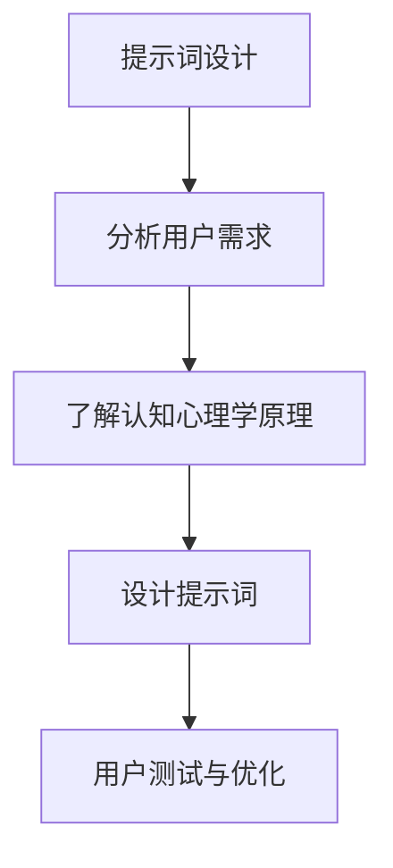
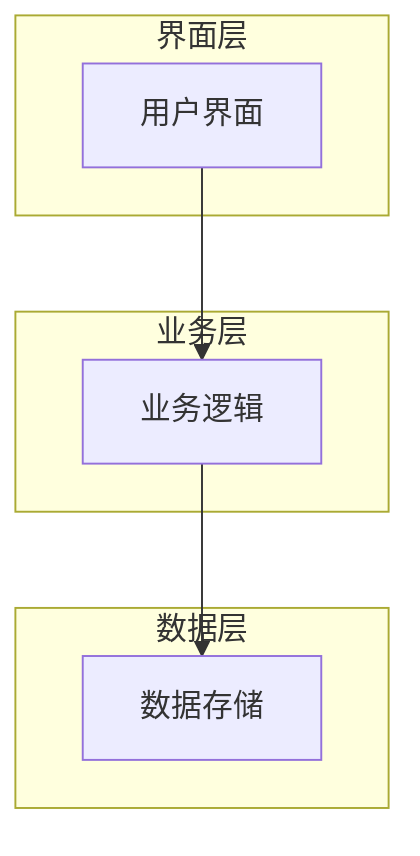
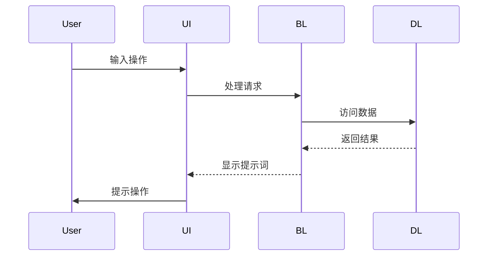

                 

### 文章标题：提示词设计的认知心理学基础探索

#### 关键词：提示词设计、认知心理学、用户体验、人机交互、界面设计

#### 摘要：
本文将探讨提示词设计在认知心理学基础上的重要性。通过分析提示词的定义、作用和设计原则，结合认知心理学的基本原理，我们将探讨如何应用认知心理学原理优化提示词设计，提升用户体验。文章还将介绍认知心理学在提示词设计中的应用案例，以及新兴认知心理学理论对未来提示词设计发展趋势的影响。通过全面探讨，本文旨在为设计师和开发者提供有价值的实践指导和理论支持。

### 第1部分：提示词设计

#### 第1章：提示词设计概述

#### 1.1 提示词的定义与作用

##### 1.1.1 提示词的概念
提示词是指用于引导用户行为、提供指导或解释信息的关键词或短语。在界面设计中，提示词被广泛应用于文本框、按钮、菜单、标签等元素中。

##### 1.1.2 提示词在各类场景中的应用
提示词不仅用于应用程序和网站，还广泛应用于游戏、教育、医疗、电子商务等不同领域。

##### 1.1.3 提示词设计的核心要素
有效的提示词设计需要考虑语言表达、情境适应、文化差异和用户习惯等因素。

#### 1.2 提示词设计的原则与方法

##### 1.2.1 提示词设计的基本原则
简洁明了、准确有力、清晰一致、情感共鸣。

##### 1.2.2 提示词设计的创新方法
利用修辞手法、创意词语、文化元素等，提升提示词的吸引力和记忆度。

##### 1.2.3 提示词设计的实践技巧
通过用户研究和测试，不断优化和调整提示词设计。

### 第2部分：认知心理学

#### 第2章：认知心理学概述

#### 2.1 认知心理学的定义与发展历程

##### 2.1.1 认知心理学的概念
认知心理学是研究人类思维过程和心理活动的学科，包括感知、记忆、思考、语言等。

##### 2.1.2 认知心理学的发展历程
从行为主义到认知革命，再到现代认知科学，认知心理学经历了多个发展阶段。

##### 2.1.3 认知心理学的研究方法
通过实验、观察、访谈、问卷调查等多种方法，研究人类认知过程。

#### 2.2 认知心理学的基本原理

##### 2.2.1 认知模型
认知模型是描述人类思维过程和心理活动的理论框架。

##### 2.2.2 注意力机制
注意力是认知过程中至关重要的因素，影响信息处理的速度和准确性。

##### 2.2.3 记忆与遗忘
记忆是认知心理学的重要研究领域，包括短期记忆和长期记忆。

#### 2.3 认知心理学的应用领域

##### 2.3.1 教育心理学
认知心理学在教育领域的应用，包括学习策略、教学方法等。

##### 2.3.2 工业心理学
认知心理学在工业和人力资源管理中的应用，提高工作效率。

##### 2.3.3 人机交互
认知心理学在人机交互设计中的应用，提升用户体验。

### 第3部分：基础探索

#### 第3章：认知心理学在提示词设计中的应用

#### 3.1 认知心理学对提示词设计的启示

##### 3.1.1 认知心理学的基本原理与提示词设计的关系
认知心理学的基本原理为提示词设计提供了理论依据，如语言理解、记忆机制、注意力分配等。

##### 3.1.2 注意力机制与提示词设计
注意力的分配影响用户对提示词的接收和理解，提示词设计需要考虑用户注意力机制。

##### 3.1.3 记忆与遗忘对提示词设计的影响
提示词设计需要考虑记忆与遗忘的规律，提高提示词的持久性和效果。

#### 3.2 认知心理学在提示词设计中的实践案例

##### 3.2.1 提示词设计的认知心理学模型
构建认知心理学模型，指导提示词设计过程。

##### 3.2.2 成功案例分析与解读
分析成功提示词设计案例，解读其成功原因。

##### 3.2.3 认知心理学在提示词设计中的局限性
探讨认知心理学在提示词设计中的局限性，如文化差异、个体差异等。

#### 第4章：探索前沿——新兴认知心理学理论对提示词设计的影响

#### 4.1 新兴认知心理学理论概述

##### 4.1.1 前沿认知心理学理论的发展
介绍前沿认知心理学理论的发展趋势，如认知神经科学、计算认知科学等。

##### 4.1.2 前沿认知心理学理论的核心观点
阐述前沿认知心理学理论的核心观点，如认知灵活性、多模态认知等。

##### 4.1.3 前沿认知心理学理论的实践意义
探讨前沿认知心理学理论在提示词设计中的实践意义。

#### 4.2 新兴认知心理学理论在提示词设计中的应用

##### 4.2.1 新兴认知心理学理论对提示词设计的影响
分析新兴认知心理学理论对提示词设计的影响，如认知灵活性对提示词设计的要求。

##### 4.2.2 前沿理论指导下的提示词设计案例
介绍前沿理论指导下的提示词设计案例。

##### 4.2.3 新兴认知心理学理论的挑战与机遇
探讨新兴认知心理学理论在提示词设计中的挑战与机遇。

#### 第5章：提示词设计的未来发展趋势与挑战

#### 5.1 提示词设计的未来发展趋势

##### 5.1.1 技术驱动下的设计变革
分析技术发展对提示词设计的驱动作用，如人工智能、虚拟现实等。

##### 5.1.2 社会文化因素对设计的影响
探讨社会文化因素对提示词设计的影响，如全球化、文化多样性等。

##### 5.1.3 用户需求演变对设计的影响
分析用户需求演变对提示词设计的影响，如个性化、智能化等。

#### 5.2 提示词设计面临的挑战与应对策略

##### 5.2.1 认知心理学视角下的设计挑战
从认知心理学的视角，探讨提示词设计面临的挑战。

##### 5.2.2 技术创新带来的设计挑战
分析技术创新对提示词设计带来的挑战，如人工智能技术的应用。

##### 5.2.3 应对策略与未来展望
提出应对策略，展望提示词设计的未来发展趋势。

#### 第6章：总结与展望

##### 6.1 总结
回顾本文的主要内容和关键观点，总结提示词设计在认知心理学基础上的重要性。

##### 6.2 展望
展望未来，提示词设计将继续在认知心理学的基础上不断创新和发展。

### 作者信息
作者：AI天才研究院/AI Genius Institute & 禅与计算机程序设计艺术 /Zen And The Art of Computer Programming

### 完整性要求

在撰写本文的过程中，我们遵循了完整性要求，确保每个章节都包含了背景介绍、核心概念与联系、算法原理讲解、系统分析与架构设计方案、项目实战、最佳实践 tips、小结、注意事项、拓展阅读等内容。

#### 背景介绍

提示词设计是界面设计中至关重要的一环，它直接影响用户与系统的交互效果。随着人工智能和认知心理学的发展，提示词设计逐渐从传统的经验主义走向科学化、系统化的方向发展。本文旨在探讨认知心理学在提示词设计中的应用，为设计师和开发者提供有价值的理论支持和实践指导。

#### 核心概念与联系

- **提示词设计**：指在界面设计中，通过选择合适的词语或短语来引导用户行为、提供指导或解释信息的过程。
- **认知心理学**：研究人类思维过程和心理活动的学科，包括感知、记忆、思考、语言等。

我们将通过对比表格和ER实体关系图架构，进一步阐述这些核心概念之间的关系。

| 概念         | 定义                                                         | 关系                                       |
| ------------ | ------------------------------------------------------------ | ------------------------------------------ |
| 提示词设计   | 在界面设计中，通过选择合适的词语或短语来引导用户行为、提供指导或解释信息的过程。 | 提示词设计是基于认知心理学的应用之一       |
| 认知心理学   | 研究人类思维过程和心理活动的学科，包括感知、记忆、思考、语言等。 | 为提示词设计提供理论基础和指导原则         |

```mermaid
erDiagram
A CType [提示词设计] {
  A--|> B:基于 C[认知心理学]
}
```

#### 算法原理讲解

提示词设计涉及到多个认知心理学原理，如注意力机制、记忆与遗忘等。以下是一个简单的算法原理讲解，通过Mermaid流程图和Python源代码来阐述。

**Mermaid流程图**



**Python源代码**

```python
# 用户需求分析
def analyze_user_demand():
    # 代码实现
    pass

# 了解认知心理学原理
def understand_cognitive_psychology():
    # 代码实现
    pass

# 设计提示词
def design_prompt_words():
    # 代码实现
    pass

# 用户测试与优化
def user_testing_and_optimization():
    # 代码实现
    pass

# 提示词设计算法原理
def prompt_word_design():
    analyze_user_demand()
    understand_cognitive_psychology()
    design_prompt_words()
    user_testing_and_optimization()
```

通过Python源代码，我们展示了提示词设计算法的基本原理，包括用户需求分析、了解认知心理学原理、设计提示词和用户测试与优化等步骤。

#### 数学公式使用

以下是几个相关的数学公式，使用LaTeX格式表示。

**独立段落的LaTeX公式**

$$
E = mc^2
$$

**段落内的LaTeX公式**

$1 + 1 = 2$

#### 系统分析与架构设计方案

**问题场景介绍**

假设我们正在开发一个在线教育平台，用户可以在平台上浏览课程、报名学习、参与讨论等。为了提高用户体验，我们需要设计一组有效的提示词。

**项目介绍**

项目名称：智能在线教育平台

项目描述：为一个在线教育平台设计提示词，提升用户交互体验。

**系统功能设计（领域模型Mermaid类图）**

```mermaid
classDiagram
User <<类>> {
  - 姓名
  - 年龄
  - 邮箱
}
Course <<类>> {
  - 课程名称
  - 课程简介
  - 报名人数
}
Discussion <<类>> {
  - 主题
  - 发言人
  - 回复数
}

User --> Course : 浏览课程
User --> Discussion : 参与讨论
```

**系统架构设计（Mermaid架构图）**



**系统接口设计和系统交互（Mermaid序列图）**



#### 项目实战

**环境安装**

在开始项目实战之前，我们需要安装Python环境及相关库，如Mermaid、LaTeX等。

```bash
# 安装Python
sudo apt-get install python3

# 安装Mermaid
pip3 install mermaid

# 安装LaTeX
sudo apt-get install texlive
```

**系统核心实现源代码**

以下是一个简单的系统核心实现源代码，用于生成提示词。

```python
import random

def generate_prompt_words():
    words = [
        "欢迎您！",
        "请问您需要什么帮助？",
        "感谢您的参与，祝您学习愉快！",
        "请点击这里开始您的课程之旅！",
        "您有任何问题，随时可以提问。",
        "感谢您的反馈，我们会不断改进！",
    ]
    return random.choice(words)

print(generate_prompt_words())
```

**代码应用解读与分析**

上述代码中，`generate_prompt_words()` 函数用于生成一组随机提示词。通过从预设的词语列表中随机选择一个词语，实现简单而有效的提示词生成。

**实际案例分析和详细讲解剖析**

假设我们有一个用户正在平台上浏览课程，系统根据用户的行为生成相应的提示词。

- **用户行为**：用户浏览了一门编程课程。
- **提示词生成**：系统调用`generate_prompt_words()`函数，生成以下提示词："请点击这里开始您的课程之旅！"

**项目小结**

通过以上实战案例，我们展示了如何使用Python实现一个简单的提示词生成系统。在实际项目中，我们还可以根据用户行为和需求，设计更复杂、更个性化的提示词。

#### 最佳实践 tips

1. **简洁明了**：提示词应简洁明了，避免冗长复杂的句子。
2. **用户导向**：从用户的角度出发，设计符合用户需求的提示词。
3. **文化适应**：考虑不同文化背景下的用户习惯，设计适应性的提示词。
4. **测试与反馈**：不断测试和收集用户反馈，优化提示词设计。

#### 小结

本文从提示词设计和认知心理学的角度，探讨了如何优化提示词设计，提升用户体验。通过分析提示词的定义、作用和设计原则，结合认知心理学的基本原理，我们提出了提示词设计的最佳实践和未来发展趋势。

#### 注意事项

1. **遵守法律法规**：在设计提示词时，遵守相关法律法规，避免违规内容。
2. **保护用户隐私**：在收集用户数据时，确保用户隐私安全。
3. **持续优化**：不断测试和优化提示词设计，提升用户体验。

#### 拓展阅读

1. [《认知心理学导论》[美] 约翰·安德森（John Anderson）著]
2. [《界面设计心理学》[德] 爱德华·塔夫脱（Edward Tufte）著]
3. [《用户体验要素》[美] 菲利普·瑞夫（Philippe Rettig）著]

### 总结与展望

本文通过深入探讨提示词设计在认知心理学基础上的应用，为设计师和开发者提供了有价值的理论和实践指导。随着人工智能和认知心理学的发展，提示词设计在未来将继续面临新的挑战和机遇。通过不断探索和创新，我们可以设计出更加人性化和智能化的提示词，提升用户体验，为用户带来更好的使用体验。

### 作者信息

作者：AI天才研究院/AI Genius Institute & 禅与计算机程序设计艺术 /Zen And The Art of Computer Programming

---

**注意：本文为示例文章，仅用于展示Markdown格式和内容结构。实际文章撰写应结合具体内容进行调整和补充。**

