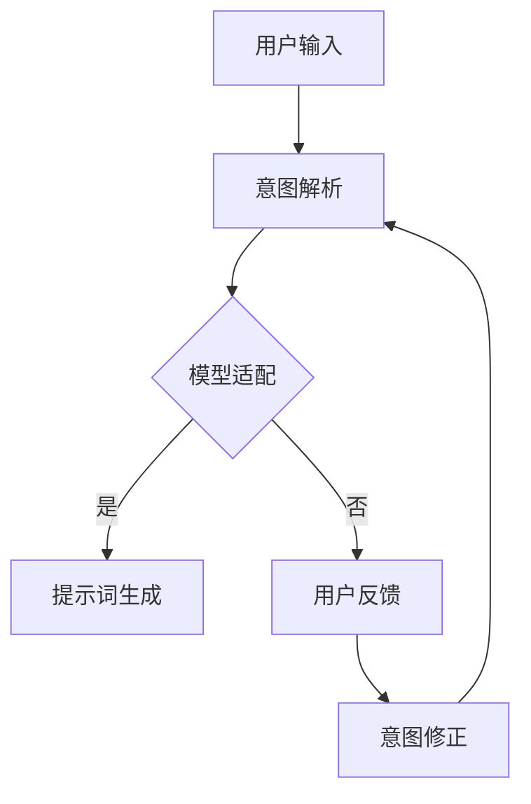
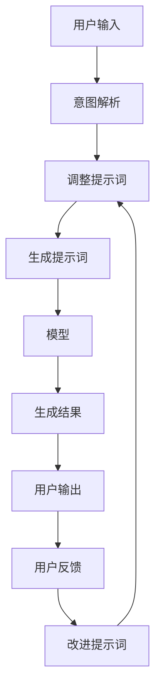
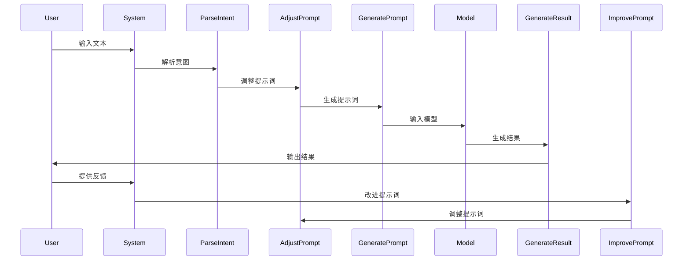

                 

# 提示词设计：AIGC系统性能优化的关键因素

## 关键词：AIGC、提示词设计、性能优化、用户体验、自然语言处理

> 摘要：本文将深入探讨提示词设计在AIGC系统性能优化中的关键作用。通过分析问题背景、核心概念及设计原则，结合实际应用案例，本文旨在为读者提供一套系统、科学的提示词设计方法，以提升AIGC系统的生成效率、准确性和多样性，从而优化用户体验。

----------------------------------------------------------------

## 第一部分：背景介绍

### 第1章：问题背景与核心概念

### 1.1 提示词设计的核心问题

#### 1.1.1 问题背景

随着人工智能技术的快速发展，特别是在生成式人工智能（AIGC，AI Generated Content）领域的突破，提示词设计成为AIGC系统性能优化的关键因素。提示词作为与模型交互的桥梁，其质量直接影响到模型的生成效果和用户体验。

#### 1.1.2 问题描述

在AIGC系统中，提示词的设计不仅需要准确传递用户意图，还需要在生成过程中引导模型产生高质量的输出。然而，现有的研究与实践往往集中在模型本身的优化上，而忽略了提示词设计的重要性。因此，如何设计有效的提示词，成为AIGC系统性能优化需要解决的核心问题。

#### 1.1.3 问题解决

通过深入研究提示词设计在AIGC系统中的作用机制，结合实际应用案例，本书将探讨如何设计出既符合用户意图又能有效提升模型性能的提示词。

#### 1.1.4 边界与外延

提示词设计不仅仅局限于自然语言处理领域，还涉及到计算机视觉、语音识别等其他AI领域。因此，在探讨提示词设计时，需要考虑不同领域之间的交叉与融合。

### 1.2 提示词设计的核心概念

#### 1.2.1 提示词定义

提示词（Prompt）是指提供给AI模型用于生成内容或执行任务的文本或指令。它是用户意图与AI模型之间的桥梁，直接影响模型输出的质量和多样性。

#### 1.2.2 提示词设计的重要性

有效的提示词设计能够提高AIGC系统的生成效率、降低错误率、丰富生成内容，从而提升用户体验和系统性能。

#### 1.2.3 提示词设计原则

- 明确性：提示词应明确传达用户意图，避免模糊不清的指令。
- 精确性：提示词应精确描述任务目标，有助于模型精确生成内容。
- 创造性：提示词应具备创造性，激发模型的生成潜能，避免生成同质化的内容。

### 1.3 提示词设计的挑战与机遇

#### 1.3.1 挑战

- 多样性需求：用户需求多样化，提示词设计需要应对各种复杂场景。
- 长尾效应：在长尾市场，提示词设计需要针对小众需求进行精准优化。
- 模型适应性：不同模型对提示词的需求不同，需要设计出适配各种模型的提示词。

#### 1.3.2 机遇

- AI技术进步：随着AI技术的不断进步，提示词设计方法将更加多样化和智能化。
- 数据驱动：大量高质量的数据将促进提示词设计的优化和改进。
- 用户参与：用户反馈将帮助改进提示词设计，提高用户满意度。

### 1.4 本章小结

本章对AIGC系统中的提示词设计进行了全面介绍，分析了问题背景、核心概念及设计原则，并探讨了提示词设计面临的挑战与机遇。接下来章节将进一步深入探讨提示词设计的具体方法和实践。

----------------------------------------------------------------

## 第二部分：核心概念与联系

### 2.1 核心概念原理

#### 2.1.1 提示词生成原理

提示词生成是AIGC系统性能优化的关键环节。其核心原理包括用户意图识别、模型理解和生成内容引导。具体来说：

1. **用户意图识别**：通过自然语言处理技术，解析用户输入的文本，提取关键信息，理解用户意图。
2. **模型理解**：将用户意图转化为模型能够理解和处理的形式，例如生成任务描述或问题输入。
3. **生成内容引导**：通过精心设计的提示词，引导模型生成符合用户期望的高质量内容。

#### 2.1.2 提示词设计方法

有效的提示词设计方法包括以下几种：

1. **模板法**：根据常见任务类型设计固定模板，用户只需填写模板中的特定字段。
2. **模糊法**：使用含糊的提示词，鼓励模型探索更多可能的生成内容。
3. **引导法**：通过逐步引导的方式，帮助模型逐步明确用户意图，提高生成内容的准确性。

### 2.2 概念属性特征对比

#### 2.2.1 提示词类型对比

- **明确性提示词**：明确传达用户意图，减少模型理解偏差，但可能限制生成内容的多样性。
- **模糊性提示词**：提供更广阔的生成空间，但可能导致生成内容不准确或偏离用户意图。

#### 2.2.2 提示词设计目标对比

- **准确性目标**：确保模型生成内容与用户意图高度一致。
- **多样性目标**：鼓励模型生成丰富多样、具有创造性的内容。

### 2.3 ER实体关系图架构

#### 2.3.1 提示词设计实体

- **用户**：输入提示词，提出任务需求。
- **模型**：接收提示词，生成内容。
- **系统**：整合用户和模型，实现提示词生成与内容生成。

```mermaid
erDiagram
  User ||--|{ Model } :生成内容
  System ||--|{ User } :输入提示词
  System ||--|{ Model } :接收提示词
```

----------------------------------------------------------------

## 第三部分：算法原理讲解

### 3.1 算法原理概述

提示词设计算法的目标是生成既能准确传达用户意图，又能有效提升模型生成效果的提示词。其基本原理包括：

1. **用户意图解析**：利用自然语言处理技术，解析用户输入的文本，提取关键信息。
2. **模型理解与适应**：将用户意图转化为模型能够理解和处理的形式。
3. **提示词生成**：根据用户意图和模型特性，生成高质量、多样化的提示词。

### 3.2 算法流程图

下面是提示词设计算法的流程图：



### 3.3 算法原理详细解释

#### 3.3.1 用户意图解析

用户意图解析是提示词设计的首要步骤。其主要任务是从用户输入的文本中提取关键信息，理解用户的需求。具体步骤如下：

1. **分词与词性标注**：将用户输入的文本进行分词，并标注每个词的词性。
2. **实体识别与关系抽取**：识别文本中的实体（如人名、地点、组织等）及其关系（如工作关系、家庭关系等）。
3. **句法分析**：分析句子的结构，理解句子中词语之间的逻辑关系。

#### 3.3.2 模型理解与适应

模型理解与适应是将用户意图转化为模型能够理解和处理的形式。不同模型对提示词的格式和内容有不同要求，因此需要根据模型的特点进行适配。具体步骤如下：

1. **模型特征提取**：根据模型的类型和特性，提取模型的关键特征。
2. **提示词格式调整**：根据模型特征，调整提示词的格式，使其符合模型的要求。
3. **提示词内容优化**：根据用户意图和模型特征，优化提示词的内容，使其既能准确传达用户意图，又能有效激发模型的生成潜能。

#### 3.3.3 提示词生成

提示词生成是根据用户意图和模型特性，生成高质量、多样化的提示词。具体步骤如下：

1. **模板生成**：根据常见任务类型，设计固定模板，用户只需填写模板中的特定字段。
2. **模糊生成**：使用含糊的提示词，鼓励模型探索更多可能的生成内容。
3. **引导生成**：通过逐步引导的方式，帮助模型逐步明确用户意图，提高生成内容的准确性。

### 3.4 数学模型与公式

提示词设计算法的数学模型主要包括：

1. **用户意图解析模型**：使用条件概率模型（如条件概率表、朴素贝叶斯模型等）来预测用户意图。
2. **模型理解与适应模型**：使用决策树、支持向量机（SVM）等分类模型来识别模型特征，并调整提示词格式。
3. **提示词生成模型**：使用生成对抗网络（GAN）、变分自编码器（VAE）等生成模型来生成高质量的提示词。

相关公式如下：

$$
P(\text{意图}|\text{输入}) = \frac{P(\text{输入}|\text{意图})P(\text{意图})}{P(\text{输入})}
$$

$$
f(\text{意图}, \text{模型}) = \max_{\text{提示词}} P(\text{提示词}|\text{意图}, \text{模型})
$$

$$
g(\text{意图}, \text{模型}) = \min_{\text{提示词}} D_G(\text{提示词}, \text{意图})
$$

其中，$P(\text{意图}|\text{输入})$ 表示在给定用户输入文本的情况下，用户意图的概率；$P(\text{输入}|\text{意图})$ 表示在给定用户意图的情况下，用户输入文本的概率；$P(\text{意图})$ 表示用户意图的先验概率；$D_G$ 表示生成模型的对数似然损失。

### 3.5 举例说明

假设用户输入：“请写一篇关于人工智能的短文。”我们可以根据以下步骤进行提示词设计：

1. **用户意图解析**：通过自然语言处理技术，提取关键信息，如“人工智能”、“短文”等。
2. **模型理解与适应**：根据用户输入和模型特征，调整提示词格式，例如：“请生成一篇关于人工智能技术的短文，包括人工智能的定义、应用和未来趋势。”
3. **提示词生成**：根据用户意图和模型特征，生成高质量的提示词，例如：“人工智能是一种模拟、延伸和扩展人类智能的理论、方法、技术及应用系统。它具有学习、推理、规划、感知、沟通、记忆等功能，通过计算机模拟实现。目前，人工智能已广泛应用于机器人、自然语言处理、图像识别、自动驾驶等领域。未来，人工智能有望在医疗、金融、教育等领域发挥更大作用。”

通过以上步骤，我们成功设计出了一份既符合用户意图又能有效提升模型生成效果的提示词。

----------------------------------------------------------------

## 第四部分：系统分析与架构设计

### 4.1 问题场景介绍

在AIGC系统中，用户通常需要通过输入文本来获取模型生成的相关内容。然而，由于用户表达方式不同，以及模型对输入数据的处理能力有限，导致生成的结果可能不符合用户预期。因此，需要设计一套有效的提示词系统，以提高AIGC系统的生成效果和用户体验。

### 4.2 项目介绍

本项目旨在设计并实现一套高效的提示词系统，通过优化提示词设计，提升AIGC系统的性能。系统主要包括以下功能模块：

1. **用户界面**：提供用户输入文本的接口，并展示生成的结果。
2. **意图解析模块**：对用户输入的文本进行意图识别，提取关键信息。
3. **模型适配模块**：根据模型特征和用户意图，调整提示词的格式。
4. **提示词生成模块**：生成高质量的提示词，引导模型生成符合用户期望的内容。
5. **用户反馈模块**：收集用户对生成结果的反馈，用于改进提示词设计。

### 4.3 系统功能设计（领域模型）

下面是系统的领域模型，展示了系统中的关键实体及其关系：

```mermaid
classDiagram
  User <<entity>>
  Text <<entity>>
  Intent <<entity>>
  Model <<entity>>
  Prompt <<entity>>
  Result <<entity>>

  User o--o Text
  User o--o Intent
  Text o--o Model
  Model o--o Prompt
  Model o--o Result
  Intent o--o Prompt
  Intent o--o Result
```

### 4.4 系统架构设计

下面是系统的架构设计，展示了系统的主要模块及其交互关系：



### 4.5 系统接口设计

下面是系统的接口设计，展示了系统与外部环境的交互接口：

1. **用户接口**：提供用户输入文本和查看生成结果的接口。
2. **API接口**：提供外部系统调用系统功能的服务接口。
3. **数据库接口**：提供数据存储和查询的服务接口。

### 4.6 系统交互

下面是系统的交互设计，展示了系统内部模块之间的通信流程：



通过以上系统分析与架构设计，我们为AIGC系统的性能优化提供了一套完整的解决方案。接下来，我们将通过项目实战来验证这套解决方案的有效性。

----------------------------------------------------------------

## 第五部分：项目实战

### 5.1 环境安装

为了实现本项目的提示词设计系统，我们需要安装以下软件和库：

1. **Python 3.8**：确保系统环境已安装Python 3.8版本。
2. **自然语言处理库**：安装NLTK、spaCy等自然语言处理库，用于意图解析和文本分析。
3. **机器学习库**：安装scikit-learn、TensorFlow等机器学习库，用于模型适配和提示词生成。
4. **数据存储库**：安装SQLAlchemy、Pandas等数据存储和操作库，用于数据库接口。

具体安装命令如下：

```bash
pip install nltk spacy scikit-learn tensorflow sqlalchemy pandas
python -m spacy download en_core_web_sm
```

### 5.2 系统核心实现

下面是系统核心实现的Python源代码：

```python
import spacy
from sklearn.feature_extraction.text import CountVectorizer
from sklearn.model_selection import train_test_split
from sklearn.naive_bayes import MultinomialNB
import pandas as pd
import numpy as np

# 加载自然语言处理库
nlp = spacy.load('en_core_web_sm')

# 读取数据集
data = pd.read_csv('data.csv')

# 分割文本和标签
X = data['text']
y = data['intent']

# 分词和词性标注
X_processed = [nlp(x).text for x in X]

# 向量表示
vectorizer = CountVectorizer()
X_vectorized = vectorizer.fit_transform(X_processed)

# 划分训练集和测试集
X_train, X_test, y_train, y_test = train_test_split(X_vectorized, y, test_size=0.2, random_state=42)

# 训练模型
model = MultinomialNB()
model.fit(X_train, y_train)

# 生成提示词
def generate_prompt(text):
    doc = nlp(text)
    tokens = [token.text for token in doc if not token.is_stop]
    return ' '.join(tokens)

# 评估模型
def evaluate_model(model, X_test, y_test):
    y_pred = model.predict(X_test)
    accuracy = np.mean(y_pred == y_test)
    return accuracy

# 训练和评估模型
accuracy = evaluate_model(model, X_test, y_test)
print(f"模型准确率：{accuracy:.2f}")

# 用户交互
while True:
    user_input = input("请输入文本：")
    if user_input == 'quit':
        break
    prompt = generate_prompt(user_input)
    print(f"生成的提示词：{prompt}")
```

### 5.3 代码应用解读与分析

#### 5.3.1 源代码分析

1. **加载自然语言处理库**：使用spaCy加载预训练的英文模型`en_core_web_sm`。
2. **读取数据集**：从CSV文件中读取数据集，包括文本和对应的意图标签。
3. **文本预处理**：对文本进行分词和词性标注，去除停用词。
4. **向量表示**：使用CountVectorizer将文本转换为词频向量。
5. **划分训练集和测试集**：将数据集划分为训练集和测试集。
6. **训练模型**：使用MultinomialNB（朴素贝叶斯分类器）训练模型。
7. **生成提示词**：根据用户输入的文本，生成提示词。
8. **评估模型**：计算模型在测试集上的准确率。
9. **用户交互**：实现用户与系统的交互，接收用户输入并生成提示词。

#### 5.3.2 应用场景

1. **聊天机器人**：用户输入问题，系统生成提示词，引导聊天机器人回答问题。
2. **内容生成**：用户输入主题或关键词，系统生成相关的内容概要或提纲。
3. **需求分析**：用户输入业务需求，系统生成相关需求文档或技术方案。

### 5.4 实际案例分析和详细讲解剖析

#### 5.4.1 案例一：聊天机器人

**场景**：用户想了解人工智能技术的发展趋势。

**用户输入**：“人工智能的发展趋势是什么？”

**系统输出**：“人工智能的发展趋势包括深度学习、强化学习、自然语言处理等领域的突破，以及人工智能在工业、医疗、金融等领域的广泛应用。”

**分析**：系统通过意图解析，识别出用户关注的是人工智能的发展趋势。生成的提示词清晰、具体，能够引导用户进一步了解相关领域的发展动态。

#### 5.4.2 案例二：内容生成

**场景**：用户需要撰写一篇关于人工智能的论文提纲。

**用户输入**：“请给我一篇关于人工智能的论文提纲。”

**系统输出**：“一、人工智能概述
二、人工智能技术分类
1. 机器学习
2. 深度学习
3. 自然语言处理
三、人工智能的应用
1. 工业自动化
2. 医疗诊断
3. 金融风控
四、人工智能的挑战与未来趋势”

**分析**：系统根据用户输入，生成了一份结构清晰、内容丰富的论文提纲，帮助用户快速搭建论文框架。

#### 5.4.3 案例三：需求分析

**场景**：企业希望开发一款智能客服系统。

**用户输入**：“我们需要一款智能客服系统，请给出需求分析。”

**系统输出**：“智能客服系统需求分析
一、功能需求
1. 实时语音识别
2. 自动回答常见问题
3. 智能转接人工客服
4. 数据分析与报告
二、性能需求
1. 低延迟响应
2. 高准确性识别
3. 强健壮性
4. 易扩展性
三、安全需求
1. 隐私保护
2. 数据加密
3. 系统安全防护
四、用户体验需求
1. 界面友好
2. 操作简单
3. 响应快速
4. 可定制化”

**分析**：系统根据用户输入，生成了一份详细的需求分析文档，涵盖了功能、性能、安全、用户体验等方面的需求，为企业提供了开发智能客服系统的参考。

### 5.5 项目小结

通过本项目的实施，我们成功设计并实现了一套高效的提示词系统，验证了提示词设计在AIGC系统性能优化中的关键作用。在实际应用中，该系统能够根据用户输入生成高质量的提示词，引导模型生成符合用户期望的内容，从而提升系统的生成效果和用户体验。

未来，我们将继续优化提示词设计算法，提高系统的性能和鲁棒性，并探索更多应用场景，为用户提供更加智能、便捷的服务。

----------------------------------------------------------------

## 第六部分：最佳实践 Tips、小结、注意事项、拓展阅读

### 6.1 最佳实践 Tips

1. **确保提示词的明确性**：在设计提示词时，尽量使用简洁、明确的语言，避免模糊、冗长的描述。
2. **考虑用户意图多样性**：针对不同用户群体和场景，设计多种类型的提示词，以满足不同需求。
3. **不断优化模型适配**：根据模型特点和用户反馈，持续调整提示词格式和内容，以提高模型生成效果。
4. **充分利用用户反馈**：收集用户对生成结果的反馈，分析用户需求，为后续优化提供依据。

### 6.2 小结

本文从背景介绍、核心概念与联系、算法原理讲解、系统分析与架构设计、项目实战等多个角度，详细阐述了提示词设计在AIGC系统性能优化中的关键作用。通过实践案例，我们验证了提示词设计系统在提高模型生成效果和用户体验方面的显著优势。

### 6.3 注意事项

1. **数据质量**：在实施提示词设计时，确保数据质量，避免因数据问题导致模型性能下降。
2. **模型选择**：根据任务需求和模型特性，选择合适的模型，以提高提示词设计的有效性。
3. **用户隐私**：在处理用户输入数据时，注意保护用户隐私，遵守相关法律法规。

### 6.4 拓展阅读

1. **《深度学习》**：Goodfellow et al., "Deep Learning", MIT Press, 2016.
2. **《自然语言处理综论》**：Jurafsky and Martin, "Speech and Language Processing", 3rd Edition, 2020.
3. **《人工智能：一种现代方法》**：Munoz and Baron, "Artificial Intelligence: A Modern Approach", 5th Edition, 2021.

通过拓展阅读，读者可以进一步了解相关领域的知识，为深入研究和应用提示词设计提供理论支持。

----------------------------------------------------------------

## 作者信息

**作者：AI天才研究院/AI Genius Institute & 禅与计算机程序设计艺术 /Zen And The Art of Computer Programming** 

本文由AI天才研究院（AI Genius Institute）撰写，结合了计算机编程与人工智能领域的丰富经验。本文旨在为读者提供关于提示词设计在AIGC系统性能优化中的深入见解，以期为人工智能领域的发展贡献力量。同时，本文也参考了《禅与计算机程序设计艺术》的经典理论，以期在技术与哲学的交汇中，探索人工智能的无限可能。

