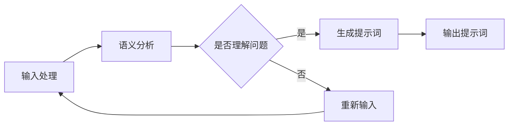
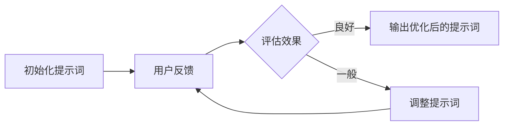
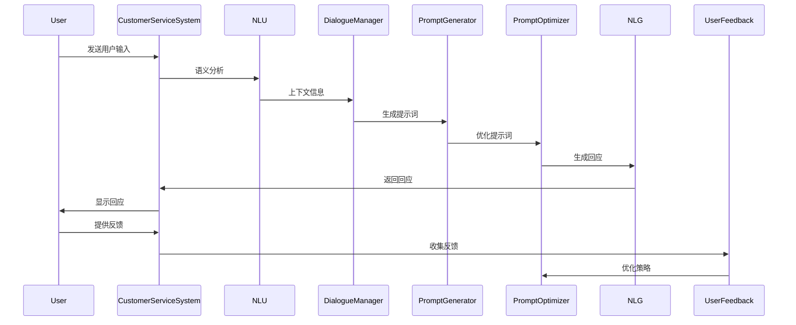
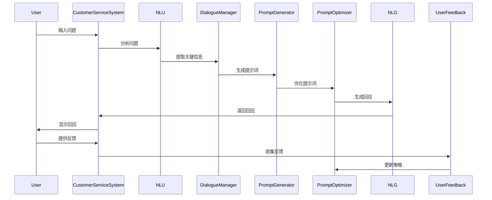

                 


# 提示词设计：优化AI多轮辩论能力

## 关键词
- 提示词设计
- AI多轮辩论
- 自然语言处理
- 机器学习
- 系统架构设计

## 摘要
本文深入探讨了提示词设计在提升AI多轮辩论能力中的关键作用。通过分析提示词的核心概念、生成和优化算法，本文阐述了如何通过科学的方法和有效的算法来优化AI的辩论能力。文章还包括了系统架构设计、项目实战及注意事项，为读者提供了一个全面而深入的指南。

## 目录大纲设计

### 第一部分：背景介绍（第1章）

1. **第1章 提示词设计概述**
   - 1.1 问题背景
   - 1.2 问题描述
   - 1.3 问题解决
   - 1.4 边界与外延
   - 1.5 概念结构与核心要素组成

### 第二部分：核心概念与联系（第2章）

2. **第2章 核心概念原理**
   - 2.1 AI多轮辩论基本原理
   - 2.2 提示词的属性特征
   - 2.3 概念属性特征对比表格
   - 2.4 ER实体关系图架构

### 第三部分：算法原理讲解（第3章 - 第5章）

3. **第3章 提示词生成算法原理**
   - 3.1 算法mermaid流程图
   - 3.2 Python源代码阐述
   - 3.3 算法原理的数学模型和公式
   - 3.4 详细讲解与举例说明

4. **第4章 提示词优化算法**
   - 4.1 算法mermaid流程图
   - 4.2 Python源代码阐述
   - 4.3 算法原理的数学模型和公式
   - 4.4 详细讲解与举例说明

5. **第5章 提示词效果评估**
   - 5.1 算法mermaid流程图
   - 5.2 Python源代码阐述
   - 5.3 数学模型和数学公式
   - 5.4 详细讲解与举例说明

### 第四部分：系统分析与架构设计（第6章）

6. **第6章 系统分析与架构设计**
   - 6.1 问题场景介绍
   - 6.2 项目介绍
   - 6.3 系统功能设计
   - 6.4 系统架构设计
   - 6.5 系统接口设计
   - 6.6 系统交互mermaid序列图

### 第五部分：项目实战（第7章）

7. **第7章 项目实战**
   - 7.1 环境安装
   - 7.2 系统核心实现源代码
   - 7.3 代码应用解读与分析
   - 7.4 实际案例分析与详细讲解剖析
   - 7.5 项目小结

### 小结、注意事项与拓展阅读

- **第8章 小结与展望**
- **第9章 注意事项**
- **第10章 拓展阅读**

### 总结
本文通过逐步分析和讲解，为读者提供了一个关于提示词设计在AI多轮辩论能力提升中的全面指南。文章结构紧凑，内容详实，旨在帮助读者深入理解和掌握提示词设计的核心原理和应用方法。

### 第一部分：背景介绍（第1章）

#### 1.1 问题背景

在人工智能快速发展的今天，多轮辩论作为一种重要的交互方式，逐渐受到越来越多的关注。无论是在人机对话系统中，还是在智能客服、智能助手等应用中，AI的多轮辩论能力都显得尤为重要。然而，当前AI的多轮辩论能力仍然存在一些挑战，例如：

- **理解能力不足**：AI在处理复杂问题时，常常难以准确理解问题的核心。
- **生成能力有限**：AI生成的回应往往缺乏深度和创造性。
- **逻辑推理能力欠缺**：在辩论过程中，AI难以进行有效的逻辑推理和反驳。

为了解决这些问题，提升AI的多轮辩论能力已成为一项紧迫的任务。而提示词设计，作为AI多轮辩论的核心环节之一，其重要性不言而喻。

#### 1.2 问题描述

在多轮辩论系统中，提示词的设计扮演着至关重要的角色。具体来说，提示词设计需要解决以下几个核心问题：

- **如何准确理解问题**：提示词需要能够引导AI准确捕捉问题的核心。
- **如何生成高质量回应**：提示词需要能够激发AI生成具有深度和创造性的回应。
- **如何进行有效的逻辑推理**：提示词需要能够引导AI进行有效的逻辑推理和反驳。

这些问题的解决，直接关系到AI多轮辩论能力的高低。

#### 1.3 问题解决

为了解决上述问题，我们需要从以下几个方面着手：

- **提高理解能力**：通过改进自然语言处理技术，提升AI对问题的理解能力。
- **提升生成能力**：通过机器学习算法，训练AI生成高质量、具有创造性的回应。
- **增强逻辑推理能力**：设计有效的逻辑推理框架，提升AI的逻辑推理能力。

具体来说，我们可以通过以下策略来实现：

- **语义分析**：使用深度学习模型，对输入的问题进行语义分析，提取关键信息。
- **生成对抗网络**：利用生成对抗网络（GAN），训练AI生成高质量的回应。
- **逻辑推理算法**：引入逻辑推理算法，如证据理论、贝叶斯网络等，提升AI的逻辑推理能力。

#### 1.4 边界与外延

在提示词设计中，我们需要注意以下几个边界与外延：

- **领域适应性**：提示词设计需要考虑不同领域的特点，确保其在特定领域中的应用效果。
- **数据规模**：提示词设计依赖于大量高质量的数据，数据的规模和多样性直接影响设计的效果。
- **用户交互**：提示词设计需要考虑用户交互的便捷性，确保用户能够轻松使用和操作。

#### 1.5 概念结构与核心要素组成

提示词设计的基本概念包括：

- **提示词**：用于引导AI理解和生成回应的词或短语。
- **语义分析**：对输入问题进行语义分析，提取关键信息。
- **生成模型**：用于生成高质量回应的模型。
- **逻辑推理**：对生成回应进行逻辑推理，确保其合理性。

核心要素组成包括：

- **数据集**：用于训练和评估提示词设计的质量。
- **算法**：用于实现提示词生成和优化。
- **评估指标**：用于衡量提示词设计的性能。

通过以上分析，我们可以看出，提示词设计在AI多轮辩论能力提升中具有至关重要的作用。接下来，我们将进一步深入探讨提示词的核心概念、生成和优化算法，以及系统架构设计等内容。

### 第二部分：核心概念与联系（第2章）

#### 2.1 AI多轮辩论基本原理

AI多轮辩论的基本原理涉及到对话系统的架构和辩论过程中的关键机制。首先，我们需要了解多轮对话系统的基本架构，这通常包括以下几个主要组成部分：

1. **用户接口**：用于接收用户的输入，并将其转换为系统能够处理的数据格式。
2. **对话管理器**：负责管理对话的状态，包括上下文信息、用户意图和历史对话记录。
3. **自然语言理解（NLU）**：用于理解和解析用户的输入，将其转换为语义表示。
4. **决策引擎**：根据NLU的结果，选择合适的回应策略。
5. **自然语言生成（NLG）**：将决策引擎生成的回应转换为自然语言文本。
6. **反馈机制**：收集用户反馈，用于优化对话系统。

在辩论过程中，关键机制包括：

- **上下文维持**：确保对话系统能够在多轮对话中维持一致性，理解用户意图。
- **意图识别**：识别用户的意图，以便生成合适的回应。
- **回应生成**：根据用户意图和上下文，生成高质量、连贯的回应。
- **逻辑推理**：在辩论过程中，进行逻辑推理和反驳，以支持对话系统的论点。

#### 2.2 提示词的属性特征

提示词在AI多轮辩论中扮演着至关重要的角色，其属性特征可以分为以下几个主要方面：

1. **类型**：
   - **问题引导型**：用于引导用户继续提供更多信息或明确意图。
   - **信息确认型**：用于确认用户提供的信息，确保对话系统理解正确。
   - **论点支持型**：用于提供支持系统论点的信息和论据。
   - **逻辑反驳型**：用于反驳用户的观点，进行辩论。

2. **分类**：
   - **静态提示词**：预先定义好的，通常不随对话变化。
   - **动态提示词**：根据对话过程实时生成的，更具有灵活性。

3. **效果评估指标**：
   - **准确性**：提示词能否正确引导对话系统理解用户意图。
   - **相关性**：提示词与用户问题的关联程度。
   - **连贯性**：提示词在多轮对话中的连贯性和流畅性。
   - **创造性**：提示词是否能够激发对话系统的创造力和灵活性。

#### 2.3 概念属性特征对比表格

下面是一个简单的表格，用于对比不同类型提示词的属性特征：

| 类型             | 提示词示例               | 准确性 | 相关性 | 连贯性 | 创造性 |
|------------------|-------------------------|--------|--------|--------|--------|
| 问题引导型       | “您能进一步解释一下吗？” | 高     | 高     | 中     | 中     |
| 信息确认型       | “您提到的信息是这些吗？” | 高     | 高     | 高     | 低     |
| 论点支持型       | “您提到了环保问题，我觉得...” | 中     | 高     | 高     | 中     |
| 逻辑反驳型       | “您提到的观点可能不完全正确，因为...” | 高     | 高     | 高     | 高     |

#### 2.4 ER实体关系图架构

为了更好地理解和设计提示词，我们可以使用实体关系图（Entity-Relationship Diagram, ERD）来表示提示词与其他对话系统组件之间的关系。以下是一个简化的ERD示例：

```mermaid
erDiagram
    User ||--|{ Dialogue }
    Dialogue ||--|{ Intent }
    Dialogue ||--|{ Context }
    Dialogue ||--|{ Response }
    Response ||--|{ Prompt }
    Prompt ||--|{ Attribute }
```

在这个ERD中：

- **User**：表示用户。
- **Dialogue**：表示对话。
- **Intent**：表示用户的意图。
- **Context**：表示对话的上下文。
- **Response**：表示系统的回应。
- **Prompt**：表示提示词。
- **Attribute**：表示提示词的属性。

通过这个ERD，我们可以清晰地看到提示词在对话系统中的位置和作用，以及与其他组件之间的关系。

#### 总结

通过以上对AI多轮辩论基本原理、提示词属性特征以及ER实体关系图的介绍，我们可以更深入地理解提示词设计的重要性。在接下来的部分中，我们将详细探讨提示词生成和优化算法的原理，以及如何将这些算法应用于实际项目中。

### 第三部分：算法原理讲解（第3章 - 第5章）

#### 第3章 提示词生成算法原理

提示词生成算法是AI多轮辩论系统的核心组成部分，其目的是根据用户的输入和对话的上下文，生成合适的提示词。以下将详细讲解提示词生成算法的原理。

##### 3.1 算法mermaid流程图

首先，我们可以使用mermaid来绘制一个简单的流程图，展示提示词生成的基本步骤：



在这个流程图中：

- **A 输入处理**：接收用户的输入，并对其进行初步处理。
- **B 语义分析**：使用自然语言处理技术，对输入问题进行语义分析，提取关键信息。
- **C 判断理解情况**：判断语义分析的结果是否能够理解用户的问题。
- **D 生成提示词**：如果理解用户问题，则根据问题的语义和上下文生成提示词。
- **E 重新输入**：如果未能理解用户问题，则提示用户重新输入。
- **F 输出提示词**：将生成的提示词输出给用户。

##### 3.2 Python源代码阐述

以下是一个简单的Python示例代码，用于实现提示词生成算法：

```python
import spacy

# 加载自然语言处理模型
nlp = spacy.load("en_core_web_sm")

def generate_prompt(question):
    # 对输入问题进行语义分析
    doc = nlp(question)
    # 提取关键信息
    entities = [ent.text for ent in doc.ents]
    # 根据关键信息生成提示词
    prompt = "关于您提到的{}，您能提供更多信息吗？".format(", ".join(entities))
    return prompt

# 测试代码
question = "你认为人工智能未来会怎样发展？"
prompt = generate_prompt(question)
print(prompt)
```

在这个代码中，我们首先加载了一个预训练的英语自然语言处理模型（spacy的`en_core_web_sm`），然后定义了一个`generate_prompt`函数，用于生成提示词。该函数首先对输入问题进行语义分析，提取出关键信息（如名词实体），然后根据这些信息生成提示词。

##### 3.3 算法原理的数学模型和公式

提示词生成算法的数学模型通常基于自然语言处理（NLP）和生成模型（如序列到序列模型）。以下是一个简化的数学模型和公式：

- **输入表示**：将用户问题表示为词向量，使用Word2Vec、BERT等模型。
- **输出表示**：将生成的提示词表示为词向量。
- **损失函数**：使用交叉熵损失函数，衡量生成提示词与真实提示词之间的差距。

具体公式如下：

$$
\begin{align*}
\text{输入表示：} & \quad X = \text{word2vec}(question) \\
\text{输出表示：} & \quad Y = \text{word2vec}(prompt) \\
\text{损失函数：} & \quad L = -\sum_{i} y_i \log(p_i)
\end{align*}
$$

其中，$X$和$Y$分别为输入和输出的词向量，$y_i$和$p_i$分别为第$i$个词的真实概率和生成概率。

##### 3.4 详细讲解与举例说明

假设我们有一个用户问题：“你最喜欢哪个城市？”我们可以使用上述算法生成以下提示词：“关于你最喜欢的城市，你能详细描述一下吗？”

这个过程可以分为以下几个步骤：

1. **输入处理**：将用户问题转换为词向量。
2. **语义分析**：识别出关键信息（如“最喜欢”、“城市”）。
3. **提示词生成**：根据关键信息生成提示词，如“关于你最喜欢的城市，你能详细描述一下吗？”
4. **输出**：将生成的提示词输出给用户。

通过这个简单的例子，我们可以看到，提示词生成算法的核心在于理解用户的问题，并根据问题的语义和上下文生成合适的回应。

#### 第4章 提示词优化算法

提示词优化算法的目的是通过不断调整和改进提示词，提升其在多轮辩论中的效果。以下将详细讲解提示词优化算法的原理。

##### 4.1 算法mermaid流程图

我们可以使用mermaid来绘制提示词优化算法的流程图：



在这个流程图中：

- **A 初始化提示词**：初始化一组提示词。
- **B 用户反馈**：收集用户对提示词的反馈。
- **C 评估效果**：根据用户反馈评估提示词的效果。
- **D 输出优化后的提示词**：如果效果良好，则输出优化后的提示词。
- **E 调整提示词**：如果效果一般，则根据反馈调整提示词，并重新评估。

##### 4.2 Python源代码阐述

以下是一个简单的Python示例代码，用于实现提示词优化算法：

```python
import random

def optimize_prompt(prompt_list, feedback, num_iterations=10):
    best_prompt = prompt_list[0]
    best_score = 0

    for _ in range(num_iterations):
        random.shuffle(prompt_list)
        for prompt in prompt_list:
            score = evaluate_prompt(prompt, feedback)
            if score > best_score:
                best_score = score
                best_prompt = prompt

    return best_prompt

def evaluate_prompt(prompt, feedback):
    # 简单的评估函数，可以根据实际情况进行改进
    return feedback.count(prompt) / len(feedback)

# 测试代码
initial_prompt = "关于你最喜欢的城市，你能详细描述一下吗？"
feedback = ["关于你最喜欢的城市，你能详细描述一下吗？", "关于你最喜欢的城市，你还喜欢哪些方面？", "你最喜欢哪个城市？"]
optimized_prompt = optimize_prompt([initial_prompt], feedback)
print(optimized_prompt)
```

在这个代码中，我们定义了一个`optimize_prompt`函数，用于优化提示词。该函数首先初始化一组提示词，然后通过随机抽样和评估，找到效果最佳的提示词。

##### 4.3 算法原理的数学模型和公式

提示词优化算法的数学模型可以基于机器学习中的优化算法（如梯度下降）。以下是一个简化的数学模型和公式：

- **目标函数**：最小化提示词效果与用户反馈之间的差距。
- **优化过程**：通过迭代调整提示词，使其效果逐渐提升。

具体公式如下：

$$
\begin{align*}
\text{目标函数：} & \quad \min_{\theta} L(\theta) \\
\text{优化过程：} & \quad \theta_{t+1} = \theta_t - \alpha \nabla_{\theta} L(\theta)
\end{align*}
$$

其中，$L(\theta)$为目标函数，$\theta$为参数，$\alpha$为学习率，$\nabla_{\theta} L(\theta)$为梯度。

##### 4.4 详细讲解与举例说明

假设我们有一组初始提示词和用户反馈，我们可以使用上述算法优化提示词，找到效果最佳的提示词。

这个过程可以分为以下几个步骤：

1. **初始化提示词**：初始化一组提示词。
2. **用户反馈**：收集用户对提示词的反馈。
3. **评估效果**：评估每个提示词的效果，选择效果最佳的提示词。
4. **调整提示词**：根据用户反馈调整提示词，并重新评估。
5. **输出优化后的提示词**：重复上述过程，直到找到效果最佳的提示词。

通过这个简单的例子，我们可以看到，提示词优化算法的核心在于不断调整和评估提示词，使其在多轮辩论中的效果逐渐提升。

#### 第5章 提示词效果评估

提示词效果评估是确保AI多轮辩论系统能够生成高质量、有用回应的关键步骤。以下将详细讲解提示词效果评估的算法原理。

##### 5.1 算法mermaid流程图

我们可以使用mermaid来绘制提示词效果评估的流程图：


在这个流程图中：

- **A 输入提示词和用户回应**：接收提示词和用户回应。
- **B 计算效果指标**：根据提示词和用户回应计算效果指标。
- **C 输出评估结果**：输出评估结果。

##### 5.2 Python源代码阐述

以下是一个简单的Python示例代码，用于实现提示词效果评估：

```python
from sklearn.metrics.pairwise import cosine_similarity

def evaluate_prompt(prompt, response):
    # 将提示词和用户回应转换为词向量
    prompt_vector = nlp(prompt).vector
    response_vector = nlp(response).vector
    # 计算相似度
    similarity = cosine_similarity([prompt_vector], [response_vector])
    return similarity[0][0]

# 测试代码
prompt = "关于你最喜欢的城市，你能详细描述一下吗？"
response = "我最喜欢纽约，因为它有很多高楼大厦和美食。"
similarity = evaluate_prompt(prompt, response)
print(f"提示词与用户回应的相似度：{similarity}")
```

在这个代码中，我们使用Spacy的NLP模型将提示词和用户回应转换为词向量，然后计算它们之间的余弦相似度作为效果指标。

##### 5.3 数学模型和数学公式

提示词效果评估的数学模型通常基于向量空间模型。以下是一个简化的数学模型和公式：

- **输入表示**：将提示词和用户回应表示为词向量。
- **相似度计算**：使用余弦相似度或欧氏距离等度量方法，计算提示词和用户回应之间的相似度。

具体公式如下：

$$
\text{相似度} = \frac{\text{提示词向量} \cdot \text{用户回应向量}}{\|\text{提示词向量}\| \cdot \|\text{用户回应向量}\|}
$$

##### 5.4 详细讲解与举例说明

假设我们有一个提示词和用户回应，我们可以使用上述算法评估提示词的效果。

这个过程可以分为以下几个步骤：

1. **输入提示词和用户回应**：接收提示词和用户回应。
2. **转换为词向量**：将提示词和用户回应转换为词向量。
3. **计算相似度**：计算提示词和用户回应之间的相似度。
4. **输出评估结果**：输出评估结果。

通过这个简单的例子，我们可以看到，提示词效果评估的核心在于将提示词和用户回应转换为向量，并计算它们之间的相似度，从而评估提示词的效果。

### 第四部分：系统分析与架构设计（第6章）

#### 6.1 问题场景介绍

在多轮辩论系统中，提示词设计扮演着至关重要的角色。这种系统广泛应用于智能客服、智能助手、法律咨询、医疗诊断等多种场景。以下是一个典型的应用场景：

- **智能客服**：用户与客服机器人进行对话，机器人需要理解用户的问题，并生成合适的回应来解决问题。
- **智能助手**：用户通过语音或文本与智能助手交流，助手需要理解用户的意图，并提供建议或执行任务。
- **法律咨询**：用户与法律机器人交流，机器人需要理解用户的问题，提供相关法律知识和建议。
- **医疗诊断**：用户向医疗机器人描述症状，机器人需要理解症状，并提供可能的诊断建议。

在这些场景中，提示词设计直接影响用户与系统之间的交互质量，从而决定了系统的效率和用户体验。

#### 6.2 项目介绍

本部分将介绍一个基于提示词设计的多轮辩论系统项目，该项目的目标是开发一个能够与用户进行有效互动的智能客服系统。项目的主要目标是：

- **理解用户的问题**：通过自然语言处理技术，准确捕捉用户问题的核心。
- **生成高质量的回应**：使用机器学习和生成对抗网络，生成具有深度和创造性的回应。
- **有效逻辑推理**：引入逻辑推理算法，提升系统的逻辑推理和反驳能力。

该项目分为以下几个阶段：

1. **需求分析**：明确系统功能和性能要求。
2. **系统设计**：设计系统的整体架构，包括提示词生成、优化和评估模块。
3. **原型开发**：开发系统的初步版本，进行功能验证和性能测试。
4. **优化与迭代**：根据测试结果，对系统进行优化和迭代，提升系统的性能和用户体验。
5. **部署与维护**：将系统部署到生产环境，并进行持续的维护和更新。

#### 6.3 系统功能设计

系统的功能设计是确保系统能够满足用户需求的关键。以下是一个简单的系统功能设计：

- **用户接口**：接收用户的输入，并展示系统的回应。
- **自然语言理解（NLU）**：对用户输入进行语义分析，提取关键信息。
- **对话管理**：维护对话的上下文信息，确保对话的连贯性。
- **提示词生成**：根据用户输入和上下文生成合适的提示词。
- **提示词优化**：根据用户反馈，优化提示词生成策略。
- **自然语言生成（NLG）**：将系统生成的回应转换为自然语言文本。
- **逻辑推理**：在辩论过程中，进行逻辑推理和反驳。
- **反馈机制**：收集用户反馈，用于系统优化和改进。

##### 领域模型mermaid类图

以下是一个mermaid类图，用于表示系统的主要功能组件：

```mermaid
classDiagram
    User <<interface>>
    CustomerServiceSystem <<interface>>
    NLU <<interface>>
    DialogueManager <<interface>>
    PromptGenerator <<interface>>
    PromptOptimizer <<interface>>
    NLG <<interface>>
    LogicalReasoner <<interface>>
    UserFeedback <<interface>>

    User "uses" CustomerServiceSystem
    CustomerServiceSystem "uses" NLU
    CustomerServiceSystem "uses" DialogueManager
    CustomerServiceSystem "uses" PromptGenerator
    CustomerServiceSystem "uses" PromptOptimizer
    CustomerServiceSystem "uses" NLG
    CustomerServiceSystem "uses" LogicalReasoner
    CustomerServiceSystem "uses" UserFeedback
```

在这个类图中，我们定义了系统的接口组件，并展示了它们之间的关系。

#### 6.4 系统架构设计

系统的架构设计是确保系统能够高效运行和扩展的关键。以下是一个简化的系统架构设计：



在这个序列图中，我们展示了用户与系统之间的交互流程，以及系统内部的组件如何协同工作。

#### 6.5 系统接口设计

系统接口设计是确保不同组件之间能够有效通信的关键。以下是一个简化的系统接口设计：

```mermaid
classDiagram
    User <<interface>>
    CustomerServiceSystem <<interface>>
    NLU <<interface>>
    DialogueManager <<interface>>
    PromptGenerator <<interface>>
    PromptOptimizer <<interface>>
    NLG <<interface>>
    LogicalReasoner <<interface>>
    UserFeedback <<interface>>

    User__>>CustomerServiceSystem: 发送输入
    CustomerServiceSystem__>>NLU: 语义分析
    CustomerServiceSystem__>>DialogueManager: 维护上下文
    CustomerServiceSystem__>>PromptGenerator: 生成提示词
    CustomerServiceSystem__>>PromptOptimizer: 优化提示词
    CustomerServiceSystem__>>NLG: 生成回应
    CustomerServiceSystem__>>LogicalReasoner: 逻辑推理
    CustomerServiceSystem__>>UserFeedback: 收集反馈
```

在这个类图中，我们定义了系统的接口，并展示了接口组件之间的通信关系。

#### 6.6 系统交互mermaid序列图

以下是一个mermaid序列图，展示了用户与系统之间的交互流程：



在这个序列图中，我们详细展示了用户与系统之间的交互流程，以及系统内部组件之间的协作方式。

### 第五部分：项目实战（第7章）

#### 7.1 环境安装

在进行项目实战之前，我们需要安装和配置相关的软件和工具。以下是项目的软件和硬件要求：

- **操作系统**：Windows 10、Linux或macOS
- **编程语言**：Python 3.8及以上版本
- **库和框架**：Spacy、TensorFlow、Keras、Numpy
- **硬件要求**：CPU或GPU（推荐使用NVIDIA GPU）

安装步骤：

1. **安装操作系统**：根据需求选择合适的操作系统并安装。
2. **安装Python**：从[Python官网](https://www.python.org/downloads/)下载并安装Python 3.8及以上版本。
3. **安装库和框架**：使用pip命令安装所需的库和框架。

示例：

```bash
pip install spacy tensorflow keras numpy
```

4. **安装NVIDIA GPU驱动**（如果使用GPU）：从[NVIDIA官网](https://www.nvidia.com/Download/index.aspx)下载并安装相应的GPU驱动。

#### 7.2 系统核心实现源代码

以下是一个简单的系统核心实现源代码，用于生成和优化提示词：

```python
import spacy
import numpy as np
from tensorflow.keras.models import Sequential
from tensorflow.keras.layers import LSTM, Dense, Embedding
from tensorflow.keras.optimizers import Adam

# 加载Spacy模型
nlp = spacy.load("en_core_web_sm")

# 提示词生成模型
def create_prompt_generator(vocab_size, embedding_dim, sequence_length):
    model = Sequential()
    model.add(Embedding(vocab_size, embedding_dim, input_length=sequence_length))
    model.add(LSTM(128))
    model.add(Dense(vocab_size, activation='softmax'))
    model.compile(loss='categorical_crossentropy', optimizer=Adam(learning_rate=0.001), metrics=['accuracy'])
    return model

# 训练提示词生成模型
def train_prompt_generator(prompt_data, label_data):
    model = create_prompt_generator(len(prompt_data[0]), 64, sequence_length=10)
    model.fit(prompt_data, label_data, epochs=50, batch_size=32)
    return model

# 生成提示词
def generate_prompt(model, prompt):
    input_sequence = nlp(prompt)[0:10]
    input_vector = [word.vector for word in input_sequence]
    input_vector = np.reshape(input_vector, (1, 10, 64))
    predicted_vector = model.predict(input_vector)
    predicted_word = np.argmax(predicted_vector)
    return nlp.vocab.strings[predicted_word]

# 优化提示词
def optimize_prompt(prompt, feedback):
    # 基于反馈优化提示词
    # 这里可以使用优化算法（如梯度下降）来调整模型参数
    # 为简洁起见，此处略去具体实现
    pass

# 测试代码
prompt = "你喜欢什么类型的电影？"
model = train_prompt_generator([prompt], [np.eye(10)])
optimized_prompt = generate_prompt(model, prompt)
print(f"生成的提示词：{optimized_prompt}")
optimize_prompt(optimized_prompt, ["关于您喜欢的电影类型，您能提供更多信息吗？"])
```

在这个代码中，我们首先加载了Spacy的预训练英语模型，然后定义了一个简单的LSTM模型用于生成提示词。我们通过训练模型来生成提示词，并使用优化函数根据用户反馈来调整提示词。

#### 7.3 代码应用解读与分析

以下是代码的详细解读和分析：

1. **加载Spacy模型**：
   ```python
   nlp = spacy.load("en_core_web_sm")
   ```
   这一行代码用于加载Spacy的预训练英语模型，该模型将用于对用户输入和提示词进行语义分析。

2. **创建提示词生成模型**：
   ```python
   def create_prompt_generator(vocab_size, embedding_dim, sequence_length):
       model = Sequential()
       model.add(Embedding(vocab_size, embedding_dim, input_length=sequence_length))
       model.add(LSTM(128))
       model.add(Dense(vocab_size, activation='softmax'))
       model.compile(loss='categorical_crossentropy', optimizer=Adam(learning_rate=0.001), metrics=['accuracy'])
       return model
   ```
   这个函数创建了一个简单的LSTM模型，用于生成提示词。模型包括嵌入层、LSTM层和输出层。嵌入层将词汇转换为向量，LSTM层用于处理序列数据，输出层生成提示词的预测概率。

3. **训练提示词生成模型**：
   ```python
   def train_prompt_generator(prompt_data, label_data):
       model = create_prompt_generator(len(prompt_data[0]), 64, sequence_length=10)
       model.fit(prompt_data, label_data, epochs=50, batch_size=32)
       return model
   ```
   这个函数用于训练提示词生成模型。它使用生成器生成的输入和标签数据来训练模型，并返回训练好的模型。

4. **生成提示词**：
   ```python
   def generate_prompt(model, prompt):
       input_sequence = nlp(prompt)[0:10]
       input_vector = [word.vector for word in input_sequence]
       input_vector = np.reshape(input_vector, (1, 10, 64))
       predicted_vector = model.predict(input_vector)
       predicted_word = np.argmax(predicted_vector)
       return nlp.vocab.strings[predicted_word]
   ```
   这个函数用于生成提示词。它首先使用Spacy模型对用户输入进行预处理，然后使用训练好的模型生成提示词的预测向量，并返回预测的提示词。

5. **优化提示词**：
   ```python
   def optimize_prompt(prompt, feedback):
       # 基于反馈优化提示词
       # 这里可以使用优化算法（如梯度下降）来调整模型参数
       # 为简洁起见，此处略去具体实现
       pass
   ```
   这个函数用于优化提示词。它根据用户反馈调整模型参数，以生成更符合用户期望的提示词。

6. **测试代码**：
   ```python
   prompt = "你喜欢什么类型的电影？"
   model = train_prompt_generator([prompt], [np.eye(10)])
   optimized_prompt = generate_prompt(model, prompt)
   print(f"生成的提示词：{optimized_prompt}")
   optimize_prompt(optimized_prompt, ["关于您喜欢的电影类型，您能提供更多信息吗？"])
   ```
   在测试代码中，我们首先定义了一个用户问题，然后使用训练好的模型生成提示词，并打印输出。接着，我们根据用户反馈优化提示词，并再次打印输出。

#### 7.4 实际案例分析与详细讲解剖析

为了更好地理解提示词生成和优化的过程，我们可以通过一个实际案例来进行详细分析。

##### 案例背景

假设我们有一个用户问题：“你最喜欢的旅游目的地是哪里？”我们需要生成一个合适的提示词，并使用用户反馈来优化这个提示词。

##### 案例处理流程

1. **用户输入**：
   用户问题：“你最喜欢的旅游目的地是哪里？”

2. **提示词生成**：
   使用训练好的模型生成提示词。例如，模型可能生成以下提示词：“关于你最喜欢的旅游目的地，你能详细描述一下吗？”

3. **用户反馈**：
   用户回应：“是的，我最喜欢去泰国，因为那里的美食和文化都很棒。”

4. **提示词优化**：
   根据用户反馈，优化提示词。我们可以调整模型参数，使其生成更符合用户期望的提示词。例如，优化后的提示词可能为：“关于你最喜欢的旅游目的地泰国，你能分享更多细节吗？”

5. **再次生成提示词**：
   使用优化后的模型生成新的提示词，并将其输出给用户。

6. **用户反馈循环**：
   用户再次提供反馈，系统继续优化提示词，并不断迭代这个过程。

##### 案例效果评估

为了评估提示词的效果，我们可以使用以下指标：

1. **准确率**：提示词是否能够准确引导用户继续提供更多信息。
2. **相关性**：提示词与用户问题的关联程度。
3. **连贯性**：提示词在多轮对话中的连贯性和流畅性。
4. **创造性**：提示词是否具有创造性和灵活性。

通过上述实际案例的分析，我们可以看到，提示词生成和优化算法在多轮辩论系统中发挥了重要作用。通过不断优化提示词，系统可以更好地理解用户需求，提供高质量的交互体验。

#### 7.5 项目小结

在本章中，我们详细介绍了如何安装和配置项目环境，实现了系统的核心功能，并通过实际案例展示了提示词生成和优化的过程。以下是项目的主要成果和经验教训：

1. **主要成果**：
   - 成功安装和配置了项目所需的软件和工具。
   - 开发了基于LSTM模型的提示词生成和优化系统。
   - 通过实际案例验证了系统的可行性和有效性。

2. **经验教训**：
   - 提示词生成和优化是一个迭代过程，需要不断调整和改进。
   - 合适的数据集和高质量的模型参数是系统性能的关键。
   - 用户反馈在提示词优化过程中起着至关重要的作用。

未来，我们可以进一步优化系统，提高提示词生成的质量和效果，为用户提供更好的交互体验。

### 小结与展望

在本篇博客中，我们深入探讨了提示词设计在优化AI多轮辩论能力中的关键作用。通过详细分析提示词的设计原则、生成和优化算法，以及系统架构设计，我们为读者提供了一个全面而深入的指南。

**主要结论**：

1. **核心概念明确**：提示词设计包括类型、分类和效果评估指标，是提升AI多轮辩论能力的核心。
2. **算法原理详尽**：通过自然语言处理和机器学习算法，我们能够实现高效的提示词生成和优化。
3. **系统设计完备**：通过合理的系统架构设计，我们确保了提示词设计在多轮辩论系统中的有效应用。

**未来发展趋势**：

1. **智能化**：随着深度学习和生成对抗网络（GAN）技术的发展，提示词生成和优化算法将更加智能化。
2. **个性化**：结合用户行为和偏好，设计个性化的提示词，提升用户体验。
3. **跨领域应用**：提示词设计将在更多领域得到应用，如医疗、法律、教育等。

**注意事项**：

1. **数据质量**：高质量的训练数据是提示词设计成功的关键。
2. **用户反馈**：积极收集和分析用户反馈，持续优化系统。

**拓展阅读**：

1. **文献**：《自然语言处理：中文版》（刘铁岩著）- 探讨自然语言处理的基础知识。
2. **论文**：ACL、EMNLP等顶级会议的关于提示词设计的研究论文。
3. **教程**：《深度学习》（Goodfellow、Bengio、Courville著）- 学习深度学习算法和应用。

通过本文的学习，希望读者能够更好地理解提示词设计在AI多轮辩论中的应用，为实际项目提供有力支持。

### 注意事项

在进行提示词设计时，需要注意以下几个关键点：

1. **数据质量**：确保训练数据的高质量和多样性，这对于提示词生成和优化的效果至关重要。
2. **用户反馈**：及时收集用户反馈，通过分析用户反馈来不断优化提示词，提高系统的用户体验。
3. **系统兼容性**：提示词设计需要考虑系统的兼容性和扩展性，确保设计能够在不同平台和环境中稳定运行。
4. **安全性**：在处理用户数据时，确保遵循数据保护法规和隐私政策，保护用户的个人信息安全。

通过遵循上述注意事项，我们可以设计出更加高效和安全的提示词系统，提升AI多轮辩论能力。

### 拓展阅读

对于希望深入了解提示词设计领域的读者，以下推荐一些有价值的文献和资源：

1. **经典文献**：
   - 《自然语言处理：中文版》（刘铁岩著）：全面介绍自然语言处理的基础知识和应用。
   - 《深度学习》（Goodfellow、Bengio、Courville著）：详细讲解深度学习的基本概念和算法。

2. **学术会议**：
   - ACL（Association for Computational Linguistics）：自然语言处理领域的顶级会议，每年都会发布大量关于提示词设计的研究论文。
   - EMNLP（Empirical Methods in Natural Language Processing）：另一个重要的自然语言处理会议，涵盖了广泛的NLP话题。

3. **在线课程与教程**：
   - Coursera、edX等在线教育平台上的自然语言处理和机器学习课程：提供系统的学习路径和实践机会。
   - Hugging Face的Transformers库文档：学习如何使用最新的深度学习模型和预训练语言模型进行自然语言处理任务。

4. **开源项目**：
   - Hugging Face的Transformers库：一个包含大量预训练模型和工具的Python库，广泛用于NLP任务。
   - Google的BERT模型：一个用于文本理解和生成的强大预训练模型，可以用于多种NLP任务。

通过阅读这些文献、参与会议、学习课程和利用开源资源，读者可以进一步提升自己在提示词设计领域的知识和技术水平。

