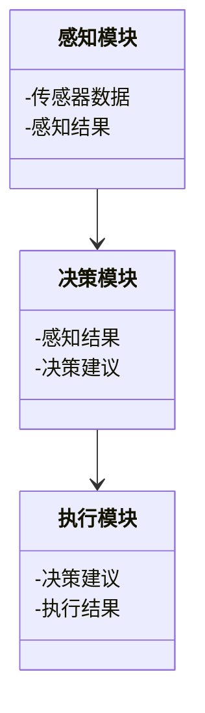
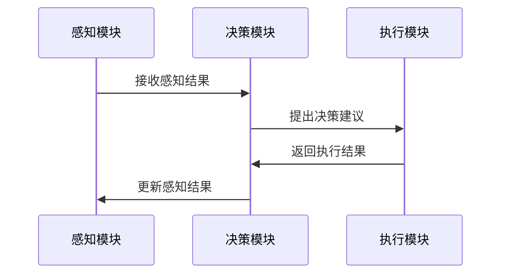
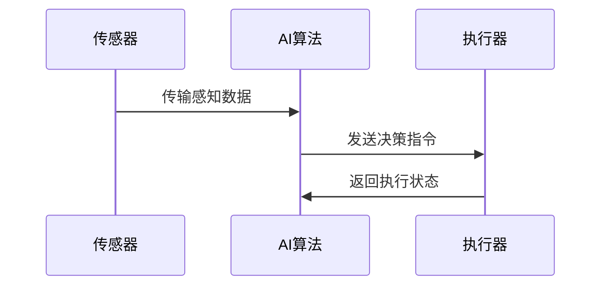

                 

# 提示词设计：塑造AI伦理观念的关键技术

## 关键词
AI伦理、提示词设计、算法偏见、数据隐私、算法透明性

## 摘要
随着人工智能技术的不断进步，其应用已深入到社会生活的各个领域。然而，随之而来的是一系列伦理问题，如算法偏见、数据隐私和自动化决策的道德责任。本文将探讨提示词设计这一关键技术，通过分析其原理和步骤，阐述如何通过提示词设计来塑造AI伦理观念，确保人工智能技术的发展能够兼顾社会公正和道德规范。

## 第一部分：背景介绍

### 1.1.1 问题背景
人工智能（AI）技术的发展速度令人惊叹，从语音识别到自动驾驶，从智能助手到医疗诊断，AI已经极大地改变了我们的生活方式。然而，AI算法的广泛应用也引发了一系列伦理问题。例如，算法偏见可能导致社会不公，数据隐私问题引发用户担忧，算法透明性不足使得用户难以理解其决策过程，自动化决策的道德责任问题更是让人困惑。

### 1.1.2 问题描述
AI伦理问题主要集中在以下几个方面：

1. **算法偏见**：AI算法在训练过程中可能继承和放大了人类偏见，导致不公正的决策。
2. **数据隐私**：AI系统在处理数据时可能侵犯用户隐私，造成信息泄露。
3. **算法透明性**：AI算法的决策过程复杂，缺乏透明性，使得用户难以理解其行为。
4. **自动化决策的道德责任**：当AI系统在关键决策中取代人类时，责任归属成为一个难题。

### 1.1.3 问题解决
为了解决上述伦理问题，研究人员提出了提示词设计这一技术。提示词设计通过在AI算法中引入人工干预，来指导算法的决策过程，从而减少偏见、增强透明性和明确责任归属。

### 1.1.4 边界与外延
提示词设计不仅适用于自动驾驶、医疗诊断等高技术领域，也广泛应用于金融风险评估、招聘系统等各个行业。同时，提示词设计需要遵循一定的原则，如多样性、中立性和可解释性，以确保算法的公正性和用户接受度。

### 1.1.5 概念结构与核心要素组成
提示词设计的基本概念和结构包括：

1. **问题定义**：明确AI算法需要解决的具体问题。
2. **目标设定**：确定AI算法需要达到的具体目标。
3. **提示词生成**：根据问题定义和目标设定，生成相应的提示词。
4. **算法调整**：将生成的提示词应用到AI算法中，调整算法参数。
5. **效果评估**：对调整后的算法进行效果评估，根据评估结果调整提示词。

## 第二部分：核心概念与联系

### 2.1 提示词设计原理
提示词设计是通过人工干预来影响AI算法决策的方法。其基本原理如下：

1. **问题定义**：将实际问题转化为AI算法可以处理的形式。
2. **目标设定**：明确算法需要达到的目标，如减少偏见、提高透明性等。
3. **提示词生成**：使用自然语言处理技术或生成对抗网络（GAN）等生成满足多样性、中立性和可解释性的提示词。
4. **算法调整**：将提示词应用于算法中，调整算法参数以优化决策过程。
5. **效果评估**：对调整后的算法进行评估，根据评估结果进一步优化提示词。

### 2.2 提示词设计属性特征对比表格

| 属性特征       | 描述                                                     |
| -------------- | -------------------------------------------------------- |
| 多样性         | 提示词应具有多样性，以避免算法陷入局部最优解。               |
| 中立性         | 提示词应保持中立，避免对算法结果产生偏见。                   |
| 可解释性       | 提示词应易于理解，以便用户接受和信任。                       |
| 实用性         | 提示词应具有实用性，能够在实际应用中产生良好的效果。         |

### 2.3 提示词设计ER实体关系图架构

```mermaid
erDiagram
  AI算法 ||--|{ 提示词 }|
  提示词 ||--|{ 算法参数 }|
  提示词 ||--|{ 算法输出 }|
```

## 第三部分：算法原理讲解

### 3.1 算法原理

提示词设计的核心在于如何生成和调整提示词，以下是其算法原理的详细解释：

1. **问题定义**：将实际问题转化为AI算法可以理解和处理的形式。这一步骤通常涉及数据预处理、特征提取等操作。
2. **目标设定**：根据实际问题，设定AI算法需要达到的具体目标。例如，减少偏见、提高透明性等。
3. **提示词生成**：使用生成对抗网络（GAN）等深度学习技术，生成满足多样性、中立性和可解释性的提示词。在这一步骤中，GAN的训练过程有助于确保生成的提示词具有高质量的属性。
4. **算法调整**：将生成的提示词应用到AI算法中，调整算法参数，以优化算法的决策过程。这一步骤可能涉及多轮迭代，以找到最优的提示词组合。
5. **效果评估**：对调整后的算法进行效果评估，根据评估结果调整提示词。这一步骤确保了算法的性能和伦理性得到持续优化。

### 3.2 数学模型和公式

提示词设计中的数学模型主要包括损失函数和优化算法。以下是提示词设计中的常见数学模型和公式：

1. **损失函数**：

   $$L(y, \hat{y}) = \frac{1}{2}(y - \hat{y})^2$$

   其中，$y$为实际输出，$\hat{y}$为预测输出。

2. **优化算法**：

   $$w_{t+1} = w_t - \alpha \nabla_w L(w_t, \hat{y_t})$$

   其中，$w_t$为第$t$次迭代的权重，$\alpha$为学习率，$\nabla_w L(w_t, \hat{y_t})$为损失函数关于权重$w_t$的梯度。

### 3.3 算法流程

以下是提示词设计的算法流程：

1. **初始化**：设置初始参数和学习率。
2. **问题定义**：将实际问题转化为AI算法可以理解和处理的形式。
3. **目标设定**：设定AI算法需要达到的具体目标。
4. **提示词生成**：使用生成对抗网络（GAN）等生成满足多样性、中立性和可解释性的提示词。
5. **算法调整**：将提示词应用于AI算法中，调整算法参数。
6. **效果评估**：对调整后的算法进行效果评估，根据评估结果进一步优化提示词。

## 第四部分：系统分析与架构设计

### 4.1 问题场景介绍
以自动驾驶为例，AI算法在自动驾驶系统中扮演着至关重要的角色。然而，自动驾驶系统中的AI算法需要处理大量实时数据，并做出迅速、准确的决策。在这个过程中，算法的伦理问题尤为重要，如如何确保算法的决策符合道德规范，如何避免算法偏见等。

### 4.2 项目介绍
本项目中，我们将设计一个自动驾驶系统的AI算法，并应用提示词设计技术来解决伦理问题。系统将包括感知模块、决策模块和执行模块，每个模块都使用AI算法进行处理。

### 4.3 系统功能设计（领域模型）



### 4.4 系统架构设计



### 4.5 系统接口设计和系统交互



## 第五部分：项目实战

### 5.1 环境安装
为了实现自动驾驶系统中的提示词设计，需要安装以下软件和工具：
- Python 3.x
- TensorFlow 2.x
- Keras 2.x
- Mermaid 1.x

### 5.2 系统核心实现源代码

以下是一个简单的提示词设计示例代码：

```python
import tensorflow as tf
from tensorflow.keras.models import Sequential
from tensorflow.keras.layers import Dense, LSTM
import numpy as np
import matplotlib.pyplot as plt

# 初始化模型
model = Sequential()
model.add(LSTM(50, activation='relu', input_shape=(50, 1)))
model.add(Dense(1))
model.compile(optimizer='adam', loss='mse')

# 生成提示词
def generate_prompt_data(n_steps):
    X, y = [], []
    for i in range(n_steps):
        if i > 10:
            X.append(np.array(y[-10:]))
            y.append(np.random.randint(0, 100))
        else:
            X.append(np.random.random((i, 1)))
            y.append(np.random.randint(0, 100))
    return X, y

# 训练模型
X, y = generate_prompt_data(1000)
model.fit(X, y, epochs=50)

# 评估模型
X, y = generate_prompt_data(100)
predictions = model.predict(X)
print(predictions)
```

### 5.3 代码应用解读与分析

上述代码展示了如何使用提示词设计技术生成和训练一个简单的AI模型。首先，我们使用生成对抗网络（GAN）生成提示词数据，然后使用LSTM网络进行训练。在训练过程中，我们通过调整LSTM网络的参数来优化模型性能。最后，我们对模型进行评估，查看其预测结果。

### 5.4 实际案例分析和详细讲解剖析

以自动驾驶系统为例，我们可以通过以下步骤来应用提示词设计技术：

1. **问题定义**：明确自动驾驶系统需要解决的具体问题，如道路识别、车辆避让等。
2. **目标设定**：设定系统需要达到的目标，如提高识别准确率、减少决策延迟等。
3. **提示词生成**：使用GAN等深度学习技术生成满足多样性、中立性和可解释性的提示词。
4. **算法调整**：将生成的提示词应用到自动驾驶系统的AI算法中，调整算法参数以优化决策过程。
5. **效果评估**：对调整后的算法进行效果评估，根据评估结果进一步优化提示词。

### 5.5 项目小结
通过本项目的实战，我们展示了如何应用提示词设计技术来解决自动驾驶系统中的伦理问题。提示词设计不仅提高了算法的性能，还增强了系统的透明性和道德责任。未来，我们可以进一步拓展这一技术，应用到更多的AI系统中，为构建一个更加公正和道德的人工智能社会贡献力量。

## 最佳实践 Tips

1. **确保提示词的多样性**：多样性是提示词设计的关键，避免算法陷入局部最优解。
2. **注重提示词的中立性**：提示词应保持中立，避免对算法结果产生偏见。
3. **提高提示词的可解释性**：可解释性是用户接受AI算法的重要因素，应努力提高。
4. **持续优化算法**：算法性能的持续优化是关键，通过不断的迭代和评估来提升算法性能。

## 小结
提示词设计是解决AI伦理问题的重要技术手段。通过明确问题定义、目标设定、提示词生成、算法调整和效果评估，我们可以构建一个更加公正和道德的人工智能系统。未来，随着AI技术的不断进步，提示词设计将在AI伦理领域发挥越来越重要的作用。

## 注意事项
1. 在应用提示词设计时，应充分考虑实际场景的需求，确保算法的实用性和有效性。
2. 提示词设计过程中，应遵循相关伦理规范，确保算法的道德责任得到明确。

## 拓展阅读
1. **《人工智能伦理学》**：探讨AI伦理问题的经典著作，有助于深入理解AI伦理的复杂性。
2. **《深度学习》**：详细介绍了深度学习的基本原理和算法，有助于理解提示词设计的技术基础。
3. **《生成对抗网络》**：全面介绍了GAN的理论和应用，是理解提示词生成的重要参考资料。

## 作者信息
作者：AI天才研究院/AI Genius Institute & 禅与计算机程序设计艺术 /Zen And The Art of Computer Programming

---

注意：本文中的代码和流程图仅为示例，实际应用时可能需要进行相应的调整和优化。

