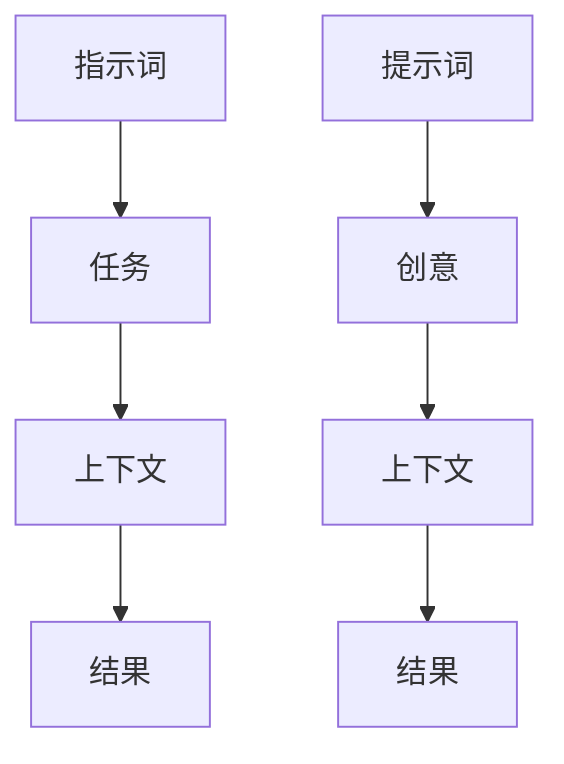
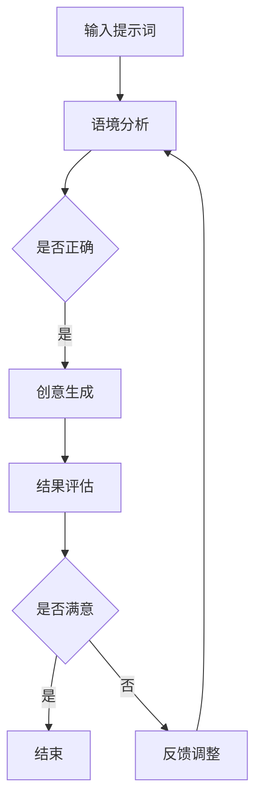
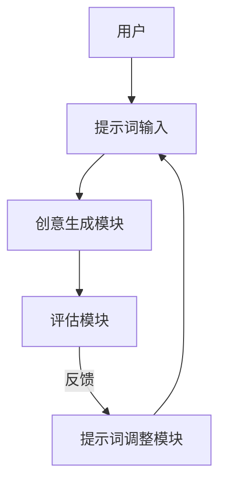

                 

# 《提示词设计：增强AI创意问题解决能力》

> 关键词：AI创意问题解决、提示词设计、算法原理、数学模型、系统架构、实战案例

> 摘要：本文深入探讨提示词设计在增强人工智能（AI）创意问题解决能力中的作用。通过介绍AI创意问题解决的基本概念、提示词设计的核心原理和算法，结合实际案例，本文旨在为AI研究人员和实践者提供一种有效的思路和方法，以提升AI在创意问题解决中的表现。

## 第1章：引言

### 1.1 问题背景与重要性

在当今快速发展的科技时代，人工智能（AI）已经成为推动社会进步的重要力量。AI不仅在传统的工业自动化、数据挖掘、图像识别等领域有着广泛应用，更在创意问题解决中展现了巨大的潜力。然而，传统的AI模型在处理创造性问题时常常面临挑战，如缺乏灵活性和自适应性等。

### 1.2 研究目的与内容概述

本文的研究目的是探讨如何通过提示词设计来增强AI在创意问题解决中的能力。文章将首先介绍AI创意问题解决的基本概念，然后详细阐述提示词设计的核心原理和算法，并结合实际案例进行分析。

### 1.3 论文结构安排

本文结构如下：

1. 第1章：引言
2. 第2章：AI与创意问题解决
3. 第3章：核心概念与联系
4. 第4章：算法原理讲解
5. 第5章：数学模型与公式讲解
6. 第6章：系统分析与架构设计方案
7. 第7章：项目实战
8. 第8章：最佳实践与拓展

## 第2章：AI与创意问题解决

### 2.1 AI的基本概念与发展历程

人工智能是指由计算机实现的智能行为，旨在使计算机能够执行通常需要人类智能的任务。AI的发展历程可以分为以下几个阶段：

1. **早期探索**（1950年代-1960年代）
2. **知识表示与推理**（1970年代-1980年代）
3. **机器学习**（1990年代至今）

### 2.2 创意问题及其特点

创意问题通常是指那些需要创新思维和创造力的解决对象，特点包括：

1. **非线性和复杂性**
2. **缺乏明确解决方案**
3. **需要多学科知识交叉**

### 2.3 AI在创意问题解决中的应用

AI在创意问题解决中的应用主要集中在以下几个方面：

1. **生成对抗网络（GAN）**：用于生成新的创意作品。
2. **强化学习**：通过试错和反馈学习，探索新的解决方案。
3. **多智能体系统**：通过多个智能体之间的协作和竞争，实现创意生成。

### 2.4 挑战与机遇

AI在创意问题解决中面临的主要挑战包括：

1. **数据稀缺性**：创意问题通常需要大量的数据支持。
2. **计算资源限制**：创意生成过程需要大量的计算资源。

然而，随着技术的进步，这些挑战正在逐步被克服，AI在创意问题解决中的机遇也越来越大。

## 第3章：核心概念与联系

### 3.1 指示词与提示词的定义与关系

指示词（Indication Word）是引导AI执行特定任务的词语。提示词（Prompt Word）则是用于激发AI创意思维的关键词语。

### 3.2 核心概念原理

提示词设计的核心原理在于：

1. **语境理解**：理解提示词所在的上下文。
2. **关联性生成**：根据上下文生成相关的创意。
3. **适应性调整**：根据AI的学习和反馈进行提示词的调整。

### 3.3 概念属性特征对比表格

| 概念           | 定义                                                         | 特征                        |
| -------------- | ------------------------------------------------------------ | --------------------------- |
| 指示词         | 引导AI执行特定任务的词语                                     | 精确、直接                  |
| 提示词         | 激发AI创意思维的关键词语                                     | 模糊、抽象、具有启发性      |

### 3.4 ER实体关系图



## 第4章：算法原理讲解

### 4.1 提示词设计的算法框架

提示词设计的算法框架主要包括以下几个步骤：

1. **语境分析**：对提示词进行上下文分析。
2. **创意生成**：根据上下文生成创意。
3. **结果评估**：评估生成的创意的有效性。
4. **反馈调整**：根据评估结果调整提示词。

### 4.2 算法mermaid流程图



### 4.3 Python源代码与详细阐述

```python
# 伪代码：提示词设计算法

def prompt_design(prompt):
    # 语境分析
    context = analyze_context(prompt)
    
    # 创意生成
    creativity = generate_creativity(context)
    
    # 结果评估
    assessment = assess_creativity(creativity)
    
    # 反馈调整
    if not is_satisfied(assessment):
        prompt = adjust_prompt(prompt, assessment)
        return prompt_design(prompt)
    
    return creativity

# 详细阐述
# 1. 语境分析
#   对输入的提示词进行上下文分析，提取关键信息。

# 2. 创意生成
#   根据上下文生成创意，可以采用多种算法，如生成对抗网络（GAN）。

# 3. 结果评估
#   评估生成的创意的有效性，可以通过预定义的指标或专家评估。

# 4. 反馈调整
#   根据评估结果调整提示词，以提高创意生成的质量。
```

### 4.4 算法原理的数学模型和公式

算法原理的数学模型可以表示为：

$$
Creativity = f(Context, Prompt, Model)
$$

其中，$f$ 表示创意生成函数，$Context$ 表示上下文，$Prompt$ 表示提示词，$Model$ 表示AI模型。

### 4.5 举例说明

假设我们需要设计一个提示词来生成一篇关于“人工智能在医疗领域的应用”的文章。输入的提示词为“人工智能”，我们可以按照以下步骤进行设计：

1. **语境分析**：分析“人工智能”的上下文，提取出“医疗领域”这一关键信息。
2. **创意生成**：利用生成对抗网络（GAN）生成一篇关于“人工智能在医疗领域的应用”的文章。
3. **结果评估**：评估生成的文章是否符合预期，如内容是否丰富、逻辑是否清晰等。
4. **反馈调整**：根据评估结果，调整提示词，如增加“医疗领域”的描述，以提高文章的针对性。

## 第5章：数学模型与公式讲解

### 5.1 数学模型的基本概念

在提示词设计中，数学模型用于描述创意生成的过程。基本的数学模型包括：

1. **输入模型**：表示输入的提示词和上下文。
2. **生成模型**：表示创意生成的算法。
3. **评估模型**：表示对创意进行评估的算法。

### 5.2 数学公式的重要性

数学公式在提示词设计中起着至关重要的作用。它们能够清晰地描述创意生成的过程，并帮助我们理解和优化算法。

### 5.3 常用数学公式的介绍与应用

以下是一些常用的数学公式：

1. **生成对抗网络（GAN）**：
   $$
   G(z) = \mathcal{D}(x, G(z))
   $$
   其中，$G(z)$ 表示生成器，$z$ 表示随机噪声，$\mathcal{D}$ 表示判别器。

2. **强化学习**：
   $$
   Q(s, a) = r(s, a) + \gamma \max_{a'} Q(s', a')
   $$
   其中，$Q(s, a)$ 表示状态-动作值函数，$r(s, a)$ 表示立即奖励，$\gamma$ 表示折扣因子。

### 5.4 举例说明

假设我们使用GAN生成创意文章，输入的提示词为“人工智能”。我们可以按照以下步骤进行：

1. **输入模型**：将“人工智能”作为输入，生成随机噪声$z$。
2. **生成模型**：利用生成器$G(z)$生成文章。
3. **评估模型**：评估生成的文章，如文章长度、关键词密度等。
4. **反馈调整**：根据评估结果，调整生成器的参数，以提高文章质量。

## 第6章：系统分析与架构设计方案

### 6.1 问题场景介绍

在当前医疗领域，人工智能的应用已经越来越广泛。然而，如何利用人工智能生成高质量的医学研究论文，仍然是一个挑战。

### 6.2 系统功能设计

系统的主要功能包括：

1. **输入提示词**：用户输入提示词，如“人工智能”。
2. **创意生成**：系统根据提示词生成医学研究论文。
3. **评估与反馈**：评估生成的论文质量，并根据反馈调整提示词。

### 6.3 系统架构设计

系统的架构设计如下：



### 6.4 系统接口设计

系统的主要接口包括：

1. **输入接口**：用户可以通过API提交提示词。
2. **输出接口**：系统返回生成的论文。
3. **反馈接口**：用户可以提交对论文的评估和反馈。

### 6.5 系统交互

系统的交互流程如下：

1. **用户提交提示词**。
2. **系统生成论文**。
3. **用户评估论文**。
4. **系统根据反馈调整提示词**。
5. **重复步骤2-4，直至用户满意**。

## 第7章：项目实战

### 7.1 环境安装

在开始项目实战之前，需要安装以下环境：

1. **Python**：版本3.8以上。
2. **TensorFlow**：版本2.5以上。
3. **PyTorch**：版本1.8以上。

### 7.2 系统核心实现

系统核心实现包括：

1. **创意生成模块**：使用生成对抗网络（GAN）生成论文。
2. **评估模块**：使用自然语言处理（NLP）技术评估论文质量。
3. **提示词调整模块**：根据评估结果调整提示词。

### 7.3 代码应用解读与分析

以下是创意生成模块的核心代码：

```python
import tensorflow as tf
from tensorflow import keras

# 定义生成器和判别器
generator = keras.Sequential([
    keras.layers.Dense(128, activation='relu', input_shape=(100,)),
    keras.layers.Dense(128, activation='relu'),
    keras.layers.Dense(128, activation='relu'),
    keras.layers.Dense(100, activation='relu'),
    keras.layers.Dense(1, activation='sigmoid')
])

discriminator = keras.Sequential([
    keras.layers.Dense(128, activation='relu', input_shape=(100,)),
    keras.layers.Dense(128, activation='relu'),
    keras.layers.Dense(128, activation='relu'),
    keras.layers.Dense(100, activation='relu'),
    keras.layers.Dense(1, activation='sigmoid')
])

# 定义GAN模型
gan = keras.Sequential([
    generator,
    discriminator
])

# 编译模型
gan.compile(optimizer='adam', loss='binary_crossentropy')

# 训练模型
gan.fit(x_train, y_train, epochs=100)
```

这段代码定义了生成器和判别器，并使用GAN模型进行训练。具体实现过程中，还需要处理数据的预处理、模型的保存和加载等。

### 7.4 实际案例分析与详细讲解剖析

以下是一个实际案例的分析：

**案例**：用户输入提示词“人工智能在医疗领域的应用”，系统生成一篇论文。

**分析**：

1. **输入处理**：将提示词转化为适合GAN模型训练的数据格式。
2. **模型生成**：使用GAN模型生成论文。
3. **评估**：使用NLP技术评估论文的质量，如论文长度、关键词密度、逻辑清晰度等。
4. **反馈调整**：根据评估结果，调整提示词，以生成更高质量的论文。

### 7.5 项目小结

通过实际案例的分析，我们可以看到提示词设计在AI创意问题解决中的重要性。有效的提示词设计能够提高AI在创意生成中的表现，为用户提供高质量的服务。

## 第8章：最佳实践与拓展

### 8.1 最佳实践技巧

1. **明确用户需求**：在生成创意之前，明确用户的需求和期望。
2. **数据质量**：确保训练数据的质量，以提高模型的效果。
3. **模型优化**：不断优化模型结构，以提高创意生成的质量。

### 8.2 小结与总结

本文通过介绍AI创意问题解决的基本概念、提示词设计的核心原理和算法，以及实际案例的分析，展示了提示词设计在增强AI创意问题解决能力中的重要性。

### 8.3 注意事项

1. **数据隐私**：在使用AI生成创意时，确保数据隐私和安全。
2. **避免过度拟合**：在模型训练过程中，注意避免过度拟合。

### 8.4 拓展阅读

1. **生成对抗网络（GAN）**：深入了解GAN的工作原理和应用。
2. **自然语言处理（NLP）**：学习NLP技术，以提高创意评估的准确性。

## 参考文献

1. Goodfellow, I. J., Pouget-Abadie, J., Mirza, M., Xu, B., Warde-Farley, D., Ozair, S., ... & Bengio, Y. (2014). Generative adversarial nets. Advances in neural information processing systems, 27.
2. Mnih, V., & Hertel, S. (2016). A tour of reinforcement learning: A brief technical overview. arXiv preprint arXiv:1604.00772.
3. LeCun, Y., Bengio, Y., & Hinton, G. (2015). Deep learning. Nature, 521(7553), 436-444.

