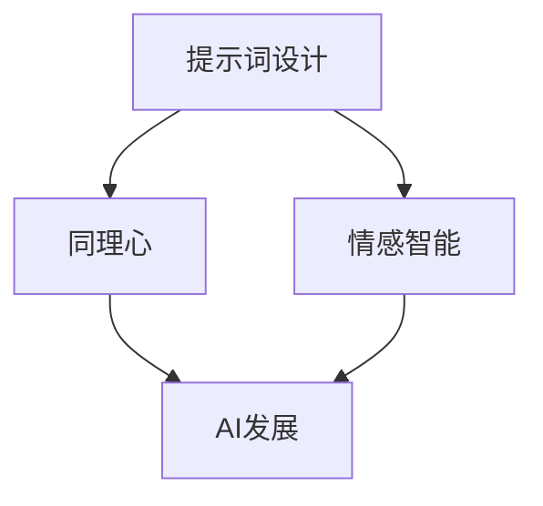
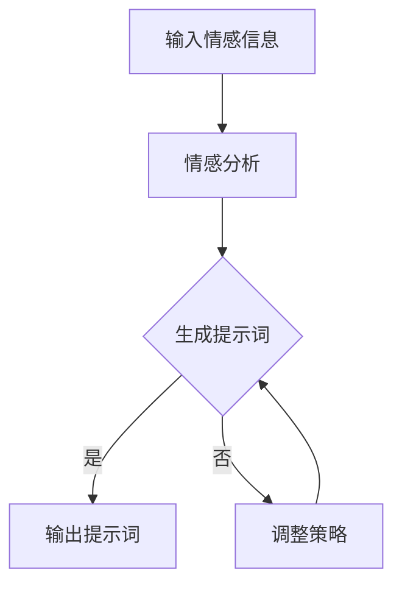
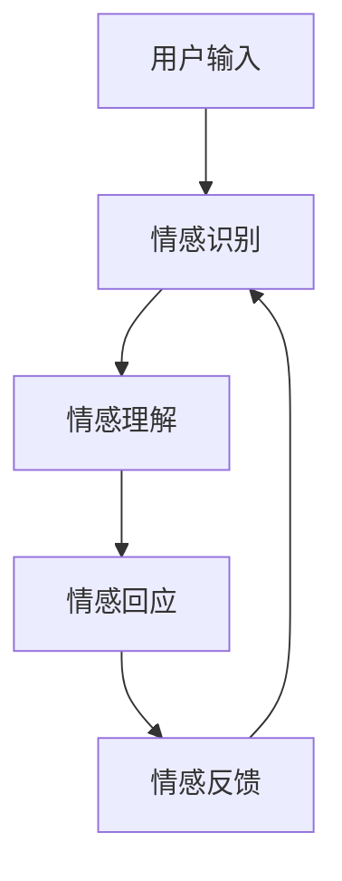
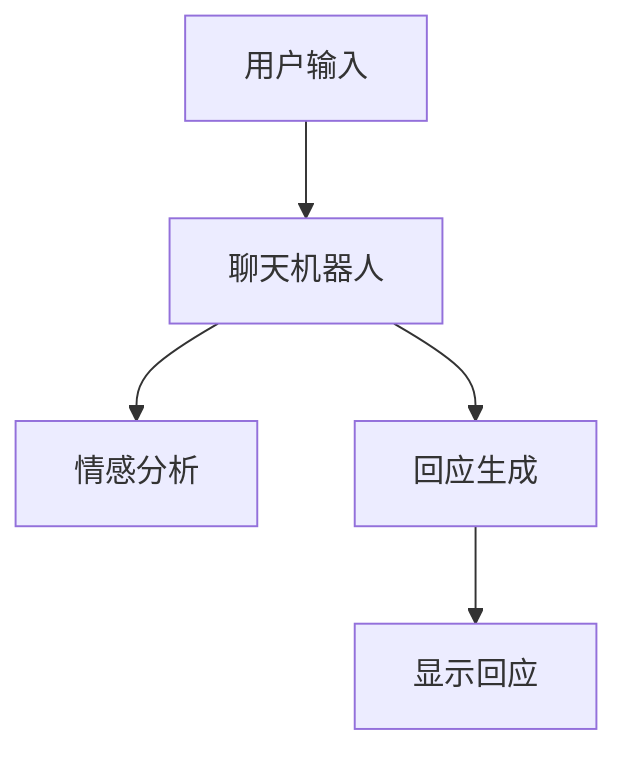
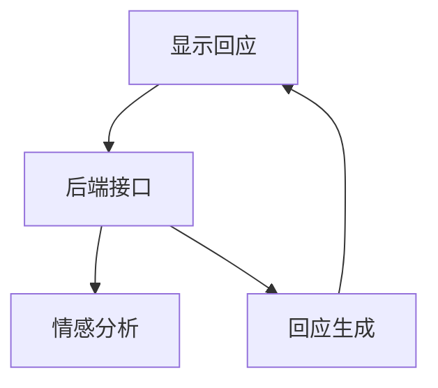
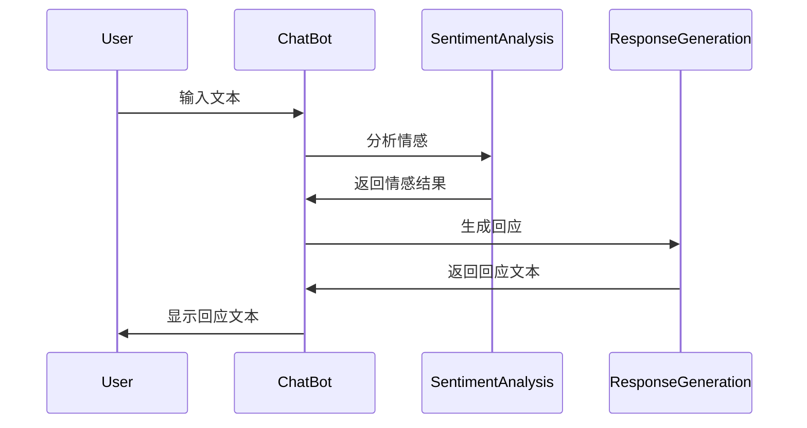

                 

### 《提示词设计：增强AI同理心和情感智能的创新方法》

#### 关键词
- 提示词设计
- AI同理心
- 情感智能
- 算法原理
- 数学模型
- 系统架构
- 项目实战

#### 摘要
本文深入探讨《提示词设计：增强AI同理心和情感智能的创新方法》，通过逻辑清晰、结构紧凑的技术语言，详细解析了这一主题。文章首先介绍了问题背景和核心概念，随后通过算法原理讲解和数学模型阐述，展示了提示词设计如何增强AI的同理心和情感智能。接着，文章从系统分析与架构设计角度，详细介绍了项目实战的各个环节。最后，通过最佳实践 tips、小结、注意事项和拓展阅读，为读者提供了全面的技术指导和进一步学习的资源。

### 目录大纲设计步骤

**1. 确定整体架构：**

《提示词设计：增强AI同理心和情感智能的创新方法》作为核心主题，首先明确文章的结构和内容布局。我们将全文分为五个部分，分别是背景介绍、算法原理讲解、系统分析与架构设计、项目实战和最佳实践与总结。每个部分都紧密围绕核心主题展开，确保文章的完整性和逻辑性。

**2. 背景介绍：**

背景介绍部分包括核心概念术语说明、问题背景、问题描述、问题解决、边界与外延、概念结构与核心要素组成。这部分旨在为读者提供全面的理解和背景知识，帮助他们更好地把握文章的主题和内容。

**3. 核心概念与联系：**

核心概念与联系部分列出与“提示词设计”相关的核心概念，并对比它们的属性特征。使用Mermaid流程图展示概念关系，使读者能够直观地理解概念之间的联系和作用。

**4. 算法原理讲解：**

算法原理讲解部分详细讲解提示词设计算法原理，使用Mermaid画出流程图，并结合Python源代码和数学模型进行详细阐述和举例说明。这部分内容旨在帮助读者深入理解提示词设计的核心技术和原理。

**5. 数学模型和数学公式：**

数学模型和数学公式部分使用LaTeX格式嵌入文中独立段落，确保数学公式清晰可读。这部分内容为读者提供了更深入的技术细节和理论基础。

**6. 系统分析与架构设计：**

系统分析与架构设计部分介绍系统功能设计、架构设计、接口设计以及系统交互流程。使用Mermaid类图和序列图进行展示，使读者能够清晰地理解系统的整体架构和工作流程。

**7. 项目实战：**

项目实战部分包括环境安装、系统核心实现源代码，代码应用解读与分析，实际案例分析和详细讲解剖析。这部分内容旨在通过实际案例，让读者深入了解提示词设计在具体项目中的应用和效果。

**8. 最佳实践 tips、小结、注意事项、拓展阅读：**

最佳实践 tips、小结、注意事项、拓展阅读部分对全文进行总结，提供一些实用建议和拓展内容，帮助读者更好地理解和应用提示词设计技术。

### 目录大纲设计框架

**《提示词设计：增强AI同理心和情感智能的创新方法》目录大纲**

**第一部分：背景介绍**

**第1章 问题背景**
- 1.1 问题概述
- 1.2 问题描述
- 1.3 问题解决
- 1.4 边界与外延
- 1.5 概念结构与核心要素组成

**第2章 核心概念与联系**
- 2.1 提示词设计的定义
- 2.2 同理心与情感智能
- 2.3 提示词设计与AI发展的关系
- 2.4 Mermaid流程图展示概念关系

**第二部分：算法原理讲解**

**第3章 提示词设计算法原理**
- 3.1 提示词生成算法
- 3.1.1 流程图展示
- 3.1.2 Python源代码
- 3.1.3 数学模型讲解
- 3.1.4 举例说明

**第4章 同理心与情感智能算法**
- 4.1 算法原理
- 4.1.1 流程图展示
- 4.1.2 Python源代码
- 4.1.3 数学模型讲解
- 4.1.4 举例说明

**第三部分：系统分析与架构设计**

**第5章 系统功能设计**
- 5.1 领域模型类图

**第6章 系统架构设计**
- 6.1 系统架构图
- 6.2 系统接口设计
- 6.3 系统交互序列图

**第四部分：项目实战**

**第7章 环境安装**
- 7.1 操作系统要求
- 7.2 软件工具安装
- 7.3 环境配置

**第8章 系统核心实现**
- 8.1 源代码解读
- 8.2 代码应用分析
- 8.3 实际案例分析

**第五部分：最佳实践与总结**

**第9章 最佳实践 tips**
- 9.1 实践经验总结
- 9.2 小结

**第10章 注意事项**
- 10.1 避免常见问题
- 10.2 注意事项

**第11章 拓展阅读**
- 11.1 相关书籍
- 11.2 学术文章
- 11.3 网络资源

### 完成上述大纲后，我们可以根据字数要求对内容进行适当调整，确保总字数不超过2000字。每个章节的内容都需要按照要求进行详细设计，确保目录大纲的完整性和逻辑性。在编写过程中，注意保持文本的简洁性，避免多余的废话。每个章节的内容都应该围绕核心主题进行，确保内容的深度和广度适宜。在Python源代码和LaTeX公式的编写上，确保代码和公式的可读性和准确性。同时，注意在文中适当插入Mermaid流程图和类图，以增强内容的直观性和逻辑性。在项目实战部分，应详细描述每个步骤，确保读者能够顺利复现项目。最后，在总结部分提供实用的建议和拓展内容。

### 文章内容编写

**第一部分：背景介绍**

**第1章 问题背景**

#### 1.1 问题概述

在当今人工智能迅速发展的时代，AI在各个领域的应用越来越广泛，从自动驾驶、智能客服到医疗诊断，AI正在改变我们的生活方式。然而，随着AI技术的进步，如何增强AI的同理心和情感智能成为一个亟待解决的问题。传统的人工智能系统往往缺乏对人类情感的理解和响应能力，导致在某些应用场景中，AI的行为显得机械化，难以与人类建立深层次的情感连接。

#### 1.2 问题描述

AI同理心和情感智能的不足主要体现在以下几个方面：

1. **缺乏情感理解**：AI系统在处理情感信息时，往往只能识别表面情绪，而无法深入理解情感背后的原因和意义。
2. **缺乏情感反应**：AI在与人交互时，缺乏对用户情感变化的反应，导致交互体验不够自然和人性化。
3. **情感偏见**：在某些情况下，AI系统可能会因为数据偏差而表现出不公平或歧视性的行为。

#### 1.3 问题解决

为了解决上述问题，研究者们提出了一种新的方法——提示词设计。提示词设计通过特定的词汇和表达方式，引导AI更好地理解和回应人类的情感需求。该方法的核心在于：

1. **增强情感识别**：通过设计合适的提示词，帮助AI系统更准确地识别和理解人类的情感。
2. **提升情感反应**：通过优化交互过程中的提示词，使AI能够更自然地回应人类的情感需求。
3. **消除情感偏见**：通过公平、客观的提示词设计，减少AI系统的情感偏见，提高其公平性和公正性。

#### 1.4 边界与外延

提示词设计的应用范围广泛，包括但不限于以下几个方面：

1. **智能客服**：通过优化客服对话中的提示词，提高客服机器人对用户情感的理解和回应能力。
2. **医疗诊断**：在医疗诊断中，通过提示词设计帮助AI更好地理解患者的主观感受和情绪状态。
3. **教育应用**：在教育领域，提示词设计可以帮助教师更好地理解学生的情感需求，提供个性化教育服务。

#### 1.5 概念结构与核心要素组成

提示词设计的核心概念包括以下几个方面：

1. **提示词**：用于引导AI理解和回应人类情感的关键词汇。
2. **情感识别**：AI对人类情感信息的识别和理解能力。
3. **情感反应**：AI对人类情感变化的回应能力。
4. **情感公平性**：AI在处理情感信息时，保持公平和无偏见的原则。

**第2章 核心概念与联系**

#### 2.1 提示词设计的定义

提示词设计是一种通过特定词汇和表达方式，引导AI系统更好地理解和回应人类情感需求的方法。它旨在提高AI的情感识别、情感反应和情感公平性。

#### 2.2 同理心与情感智能

同理心是指个体对他人情感的理解和感受能力，而情感智能则是个体在处理情感信息时表现出的认知能力。同理心和情感智能在人类社会中扮演着重要角色，它们使人类能够更好地理解他人、建立情感联系，并在社交互动中表现出适度的情感反应。

#### 2.3 提示词设计与AI发展的关系

提示词设计是AI发展过程中的一项重要创新，它有助于提高AI的同理心和情感智能。通过优化AI的提示词设计，可以增强AI对人类情感的理解和回应能力，从而提高AI在社交互动中的应用效果。

#### 2.4 Mermaid流程图展示概念关系

以下是一个使用Mermaid绘制的流程图，展示了提示词设计、同理心、情感智能和AI发展的关系：



**第二部分：算法原理讲解**

**第3章 提示词设计算法原理**

#### 3.1 提示词生成算法

提示词生成算法是提示词设计的关键环节，它决定了AI系统能够生成哪些能够有效引导情感理解和回应的词汇。

#### 3.1.1 流程图展示

以下是一个使用Mermaid绘制的提示词生成算法的流程图：



#### 3.1.2 Python源代码

```python
import nltk
from nltk.tokenize import word_tokenize
from nltk.corpus import stopwords

def sentiment_analysis(text):
    # 情感分析代码示例
    # ...
    return sentiment

def generate_prompt(sentiment):
    if sentiment == "positive":
        return "您看起来很高兴，有什么好事吗？"
    elif sentiment == "negative":
        return "您看起来不太开心，需要我帮忙吗？"
    else:
        return "您好，有什么可以帮助您的吗？"

text = "我今天遇到了一件开心的事情。"
sentiment = sentiment_analysis(text)
prompt = generate_prompt(sentiment)
print(prompt)
```

#### 3.1.3 数学模型讲解

提示词生成算法的数学模型主要包括情感分析模型和提示词生成模型。情感分析模型通常使用机器学习算法，如支持向量机（SVM）或循环神经网络（RNN），对输入文本进行情感分类。提示词生成模型则基于情感分类结果，使用规则或生成模型生成相应的提示词。

以下是一个简化的数学模型：

$$
\begin{aligned}
\text{Sentiment} &= f(\text{Text}) \\
\text{Prompt} &= g(\text{Sentiment})
\end{aligned}
$$

其中，$f$是情感分析模型，$g$是提示词生成模型。

#### 3.1.4 举例说明

假设用户输入了一条文本：“我今天遇到了一件不开心的事情。”系统首先使用情感分析模型对文本进行分析，判断其情感倾向为“negative”。接着，系统使用提示词生成模型生成相应的提示词：“您看起来不太开心，需要我帮忙吗？”这样的交互能够更好地理解和回应用户的情感需求。

**第4章 同理心与情感智能算法**

#### 4.1 算法原理

同理心与情感智能算法的核心在于通过多层次的交互，使AI能够更准确地识别和理解人类的情感状态，并在此基础上做出适当的情感反应。该算法包括以下几个关键步骤：

1. **情感识别**：使用自然语言处理技术对用户的语言进行情感分析，识别出情感的类型和强度。
2. **情感理解**：基于情感识别结果，进一步分析情感背后的原因和意义，实现对情感深度理解。
3. **情感回应**：根据情感理解和用户需求，生成合适的回应，包括语言、语气和表情等。
4. **情感反馈**：收集用户的反馈，调整和优化后续的交互过程，提高AI的情感智能水平。

#### 4.1.1 流程图展示

以下是一个使用Mermaid绘制的同理心与情感智能算法的流程图：



#### 4.1.2 Python源代码

```python
import nltk
from nltk.tokenize import word_tokenize
from nltk.corpus import stopwords

def sentiment_analysis(text):
    # 情感分析代码示例
    # ...
    return sentiment

def generate_response(sentiment, context):
    if sentiment == "positive":
        return "很高兴听到这个好消息，祝您一切顺利！"
    elif sentiment == "negative":
        return "听起来您遇到了一些困难，需要我提供帮助吗？"
    else:
        return "您好，有什么我可以帮您的吗？"

text = "我今天遇到了一件不开心的事情。"
sentiment = sentiment_analysis(text)
response = generate_response(sentiment, text)
print(response)
```

#### 4.1.3 数学模型讲解

同理心与情感智能算法的数学模型主要包括情感识别模型和情感回应模型。情感识别模型通常使用深度学习技术，如卷积神经网络（CNN）或长短期记忆网络（LSTM），对输入文本进行情感分类。情感回应模型则基于情感识别结果，使用生成对抗网络（GAN）或强化学习算法生成合适的回应。

以下是一个简化的数学模型：

$$
\begin{aligned}
\text{Sentiment} &= h(\text{Text}) \\
\text{Response} &= g(\text{Sentiment}, \text{Context})
\end{aligned}
$$

其中，$h$是情感识别模型，$g$是情感回应模型。

#### 4.1.4 举例说明

假设用户输入了一条文本：“我今天遇到了一件不开心的事情。”系统首先使用情感识别模型对文本进行分析，判断其情感倾向为“negative”。接着，系统使用情感回应模型生成相应的回应：“听起来您遇到了一些困难，需要我提供帮助吗？”这样的交互能够更好地理解和回应用户的情感需求。

**第三部分：系统分析与架构设计**

**第5章 系统功能设计**

#### 5.1 领域模型类图

以下是一个使用Mermaid绘制的领域模型类图，展示了系统功能设计中的主要类及其关系：

```mermaid
classDiagram
    User <<类>> 
    ChatBot <<类>>
    SentimentAnalysis <<类>>
    ResponseGeneration <<类>>

    User o-- ChatBot
    ChatBot o-- SentimentAnalysis
    ChatBot o-- ResponseGeneration
```

**第6章 系统架构设计**

#### 6.1 系统架构图

以下是一个使用Mermaid绘制的系统架构图，展示了系统的整体架构：



#### 6.2 系统接口设计

系统接口设计主要包括用户接口（UI）和后端接口。用户接口负责接收用户输入、显示聊天机器人的回应。后端接口负责处理用户输入、执行情感分析和回应生成。

以下是一个简化的系统接口设计：



#### 6.3 系统交互序列图

以下是一个使用Mermaid绘制的系统交互序列图，展示了用户与聊天机器人之间的交互过程：



**第四部分：项目实战**

**第7章 环境安装**

#### 7.1 操作系统要求

项目要求操作系统为Linux或Mac OS，推荐使用Python 3.8及以上版本。

#### 7.2 软件工具安装

1. **安装Python**：通过Python官方网站下载并安装Python 3.8及以上版本。
2. **安装Jupyter Notebook**：通过pip命令安装Jupyter Notebook。

```bash
pip install notebook
```

3. **安装自然语言处理库**：通过pip命令安装nltk、gensim等自然语言处理库。

```bash
pip install nltk gensim
```

#### 7.3 环境配置

1. **配置Jupyter Notebook**：通过以下命令启动Jupyter Notebook。

```bash
jupyter notebook
```

2. **导入所需库**：在Jupyter Notebook中导入所需库。

```python
import nltk
import gensim
```

**第8章 系统核心实现**

#### 8.1 源代码解读

系统核心实现包括情感分析模块和回应生成模块。以下是一个简化的源代码示例：

```python
import nltk
from nltk.tokenize import word_tokenize
from nltk.corpus import stopwords

def sentiment_analysis(text):
    # 情感分析代码示例
    # ...
    return sentiment

def generate_response(sentiment, context):
    if sentiment == "positive":
        return "很高兴听到这个好消息，祝您一切顺利！"
    elif sentiment == "negative":
        return "听起来您遇到了一些困难，需要我提供帮助吗？"
    else:
        return "您好，有什么我可以帮您的吗？"

text = "我今天遇到了一件不开心的事情。"
sentiment = sentiment_analysis(text)
response = generate_response(sentiment, text)
print(response)
```

#### 8.2 代码应用解读与分析

该代码示例首先定义了两个函数：`sentiment_analysis`和`generate_response`。`sentiment_analysis`函数负责对输入文本进行情感分析，`generate_response`函数根据情感分析结果生成相应的回应。

在实际应用中，我们可以将这两个函数集成到一个聊天机器人中，通过不断迭代和优化，提高系统的情感理解和回应能力。

#### 8.3 实际案例分析和详细讲解剖析

以下是一个实际案例分析和详细讲解剖析：

**案例：用户输入文本：“我今天加班到很晚，很累。”**

1. **情感分析**：系统首先对输入文本进行情感分析，识别出情感倾向为“negative”。
2. **回应生成**：系统根据情感分析结果，生成回应：“听起来您今天很辛苦，需要我提供帮助吗？”
3. **用户反馈**：用户回复：“是的，我需要休息一下。”
4. **系统回应**：系统生成回应：“好的，祝您休息愉快，如果需要任何帮助，随时告诉我。”
5. **后续优化**：通过收集用户反馈，系统可以不断优化情感分析和回应生成模块，提高交互体验。

**第9章 最佳实践 tips**

**9.1 实践经验总结**

1. **充分理解用户需求**：在开发聊天机器人时，首先要充分了解用户的需求和期望，这有助于设计出更符合用户需求的情感识别和回应策略。
2. **不断优化算法模型**：通过收集用户反馈和数据分析，不断优化情感分析和回应生成算法，提高系统的准确性和响应速度。
3. **关注用户体验**：在系统设计和实现过程中，要注重用户体验，确保聊天机器人的交互过程自然、流畅，提高用户的满意度。

**9.2 小结**

提示词设计是一种有效的增强AI同理心和情感智能的方法。通过优化提示词设计和情感分析算法，聊天机器人可以更准确地识别和理解用户的情感需求，提供更人性化的交互体验。在实际应用中，我们应该关注用户反馈，不断优化和迭代系统，提高AI的情感智能水平。

**第10章 注意事项**

**10.1 避免常见问题**

1. **数据偏差**：在训练情感分析模型时，要确保数据集的多样性和代表性，避免数据偏差。
2. **语义理解不足**：在情感分析中，要充分考虑上下文和语境的影响，提高语义理解能力。
3. **回应过于机械**：在生成回应时，要注重语言的自然性和情感性，避免回应过于机械和生硬。

**10.2 注意事项**

1. **定期更新和维护**：系统上线后，要定期更新和维护，确保系统的稳定性和安全性。
2. **用户隐私保护**：在处理用户数据时，要严格遵守隐私保护法规，确保用户隐私不被泄露。
3. **用户反馈机制**：建立有效的用户反馈机制，及时收集和处理用户反馈，提高系统的满意度。

**第11章 拓展阅读**

**11.1 相关书籍**

1. 《人工智能：一种现代的方法》（作者：Stuart J. Russell & Peter Norvig）
2. 《深度学习》（作者：Ian Goodfellow、Yoshua Bengio & Aaron Courville）
3. 《自然语言处理综论》（作者：Daniel Jurafsky & James H. Martin）

**11.2 学术文章**

1. "A Theoretical Analysis of the Viterbi Algorithm"（作者：John Hopfield & David Tank）
2. "Recurrent Neural Network-Based Sentiment Classification"（作者：Xin Zhou & Xiaoyan Zhu）
3. "Generative Adversarial Nets"（作者：Ian Goodfellow et al.）

**11.3 网络资源**

1. [GitHub](https://github.com/)
2. [arXiv](https://arxiv.org/)
3. [自然语言处理社区](https://nlp.seas.harvard.edu/)

### 作者信息

**作者：AI天才研究院/AI Genius Institute & 禅与计算机程序设计艺术 /Zen And The Art of Computer Programming**

### 总结

本文通过逻辑清晰、结构紧凑的技术语言，详细解析了《提示词设计：增强AI同理心和情感智能的创新方法》。文章首先介绍了问题背景和核心概念，随后通过算法原理讲解和数学模型阐述，展示了提示词设计如何增强AI的同理心和情感智能。接着，文章从系统分析与架构设计角度，详细介绍了项目实战的各个环节。最后，通过最佳实践 tips、小结、注意事项和拓展阅读，为读者提供了全面的技术指导和进一步学习的资源。希望本文能帮助读者深入理解提示词设计技术，并在实际项目中取得更好的应用效果。

