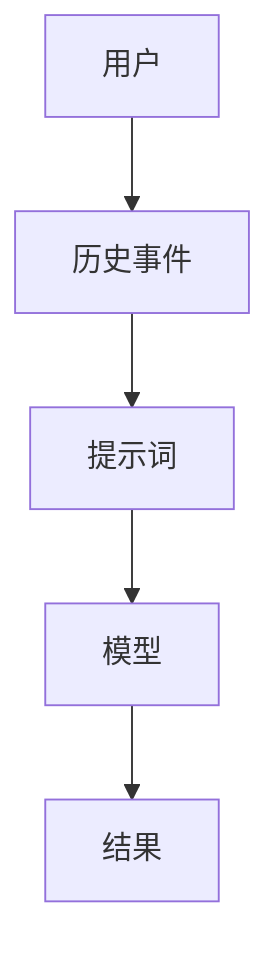
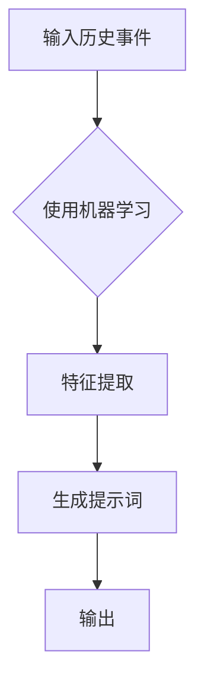
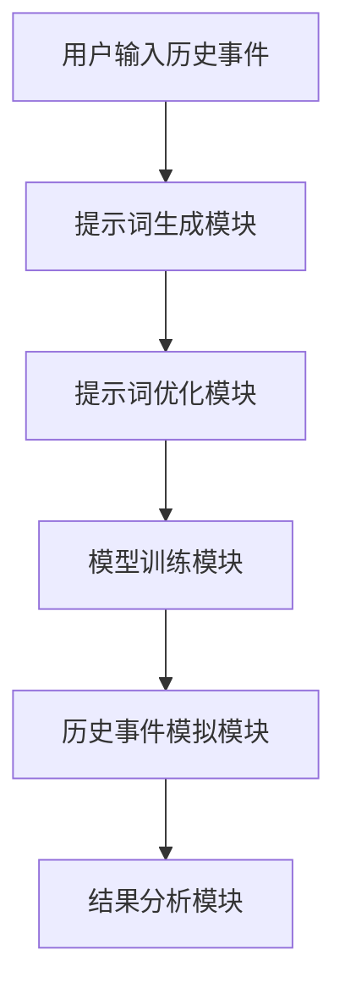

                 

# 提示词设计：提高AI历史事件模拟的准确性

> 关键词：AI历史事件模拟、提示词设计、机器学习、语义分析、准确性

> 摘要：本文旨在探讨如何通过优化提示词设计来提高AI历史事件模拟的准确性。首先，我们介绍了历史事件模拟在AI中的应用背景和重要性，随后详细阐述了提示词设计的核心概念、原则、方法和技巧。接着，我们分析了提示词设计原理，包括概念属性特征对比、ER实体关系图架构和算法原理讲解。最后，通过实际项目实战，展示了如何应用提示词设计来提高AI历史事件模拟的准确性。

----------------------------------------------------------------

## 第一部分: 引言与背景

### 1.1 问题背景

#### 1.1.1 当前AI历史事件模拟存在的问题

随着人工智能技术的发展，历史事件模拟在人工智能领域得到了广泛关注。然而，现有的AI历史事件模拟系统面临着诸多挑战。首先，历史事件的数据通常包含大量的噪声和不确定性，这使得模型难以准确捕捉事件的本质。其次，历史事件的复杂性和多样性导致模型难以全面地模拟各种可能性。此外，现有的模型往往依赖于大量训练数据，而历史事件的训练数据往往有限，这进一步限制了模型的表现能力。

#### 1.1.2 提高模拟准确性的重要性

提高AI历史事件模拟的准确性具有重要意义。首先，准确的模拟可以帮助我们更好地理解历史事件的成因和影响，从而为未来的决策提供有力支持。其次，准确的模拟可以帮助我们更好地预测历史事件的发展趋势，为风险管理提供依据。此外，准确的模拟还可以用于教育、娱乐等领域，提高人们对于历史事件的认识和理解。

#### 1.1.3 研究目的与意义

本研究旨在探讨如何通过优化提示词设计来提高AI历史事件模拟的准确性。提示词设计是AI历史事件模拟中的一个关键环节，它直接影响到模型的输入质量和模拟结果。通过深入研究提示词设计的核心概念、原则、方法和技巧，我们可以为AI历史事件模拟提供更为有效的工具和策略。本研究对于提升AI历史事件模拟的准确性，以及推动人工智能在历史研究、决策支持等领域的应用具有重要意义。

### 1.2 核心概念

#### 1.2.1 提示词设计概述

提示词设计是指根据特定任务需求，设计出能够有效引导模型进行学习和预测的输入词或短语。在AI历史事件模拟中，提示词设计旨在为模型提供关于历史事件的关键信息和背景，从而帮助模型更准确地模拟事件的发展。

#### 1.2.2 提示词设计的要素

提示词设计包含多个要素，包括：

1. **语言相关性**：提示词应与历史事件相关，能够为模型提供关于事件的信息。
2. **语义丰富度**：提示词应具有丰富的语义信息，能够为模型提供多样化的输入。
3. **适应性**：提示词应具有较好的适应性，能够应对不同历史事件的多样性和复杂性。

#### 1.2.3 提示词设计的原则

提示词设计应遵循以下原则：

1. **准确性**：提示词应准确反映历史事件的关键信息，避免误导模型。
2. **简洁性**：提示词应简洁明了，避免过于冗长的描述。
3. **多样性**：提示词应具有多样性，能够涵盖不同历史事件的多种可能性。
4. **可解释性**：提示词应具有较好的可解释性，便于用户理解和验证。

### 1.3 提示词设计的方法与技巧

#### 1.3.1 基于语义分析的方法

基于语义分析的方法通过分析历史事件的语义信息，提取关键特征，从而设计出高质量的提示词。该方法主要包括：

1. **命名实体识别**：通过识别历史事件中的命名实体，如人物、地点、组织等，为模型提供关于事件的基本信息。
2. **关系抽取**：通过抽取历史事件中实体之间的关系，如事件发生的时间、地点、原因等，为模型提供更深入的背景信息。
3. **事件分类**：通过对历史事件进行分类，如战争、政治事件、文化事件等，为模型提供关于事件类型的提示。

#### 1.3.2 基于机器学习的方法

基于机器学习的方法通过训练大量历史事件的样本，学习到设计高质量提示词的规律。该方法主要包括：

1. **监督学习**：通过标注好的历史事件样本，训练出一个模型，用于生成高质量的提示词。
2. **无监督学习**：通过未标注的历史事件样本，利用聚类、降维等技术，自动提取关键特征，从而设计出高质量的提示词。

#### 1.3.3 实际应用中的技巧

在实际应用中，提示词设计还需注意以下几点技巧：

1. **背景知识注入**：将历史知识库中的相关知识注入到提示词中，为模型提供丰富的背景信息。
2. **多语言支持**：考虑到历史事件涉及多个语言，设计出能够支持多语言的提示词。
3. **动态调整**：根据模型的反馈，动态调整提示词的设计，提高模型的准确性。

### 1.4 提示词设计的应用场景

#### 1.4.1 在AI历史事件模拟中的应用

在AI历史事件模拟中，提示词设计主要用于以下几个方面：

1. **输入预处理**：通过设计高质量的提示词，对历史事件进行预处理，提高模型的输入质量。
2. **结果优化**：通过优化提示词，提高模型输出的准确性，改善历史事件模拟的结果。

#### 1.4.2 其他领域的应用

提示词设计不仅适用于AI历史事件模拟，还可以在其他领域得到广泛应用，如：

1. **自然语言处理**：通过设计高质量的提示词，提高自然语言处理任务的表现。
2. **信息检索**：通过设计高质量的提示词，提高信息检索的准确性。

### 1.5 本章小结

本部分主要介绍了AI历史事件模拟的背景和重要性，以及提示词设计的核心概念、原则、方法和技巧。通过本部分的介绍，读者可以初步了解提示词设计的基本概念和应用场景，为后续章节的深入学习打下基础。

----------------------------------------------------------------

## 第二部分: 提示词设计原理

### 2.1 核心概念原理

#### 2.1.1 提示词的定义与作用

提示词是指用于引导模型进行学习和预测的输入词或短语。在AI历史事件模拟中，提示词起着至关重要的作用。高质量的提示词可以提供关于历史事件的关键信息，帮助模型更好地理解事件的发展，从而提高模拟的准确性。

#### 2.1.2 提示词的设计原则

提示词设计应遵循以下原则：

1. **准确性**：提示词应准确反映历史事件的关键信息，避免误导模型。
2. **简洁性**：提示词应简洁明了，避免过于冗长的描述。
3. **多样性**：提示词应具有多样性，能够涵盖不同历史事件的多种可能性。
4. **可解释性**：提示词应具有较好的可解释性，便于用户理解和验证。

#### 2.1.3 提示词与历史事件模拟的关联

提示词设计直接影响AI历史事件模拟的准确性。高质量的提示词可以为模型提供丰富的背景信息，帮助模型更好地理解历史事件的发展，从而提高模拟的准确性。反之，低质量的提示词可能导致模型对历史事件的误解，降低模拟的准确性。

### 2.2 概念属性特征对比

| 特征          | 提示词1        | 提示词2        | 提示词3        |
| ------------- | ------------- | ------------- | ------------- |
| 语言相关性    | 高            | 中            | 低            |
| 语义丰富度    | 高            | 中            | 低            |
| 适应性        | 好            | 中            | 差            |

表格中列出了三个不同提示词的属性特征对比。提示词1具有高语言相关性、高语义丰富度和好适应性；提示词2具有中语言相关性、中语义丰富度和中适应性；提示词3具有低语言相关性、低语义丰富度和差适应性。通过对比可以发现，高质量的提示词应具有高语言相关性、高语义丰富度和好适应性。

### 2.3 ER实体关系图架构



上述ER实体关系图展示了用户、历史事件、提示词、模型和结果之间的关系。用户输入历史事件，通过提示词引导模型进行模拟，最终输出模拟结果。该架构清晰地展示了提示词在设计中的关键作用。

### 2.4 算法原理讲解

#### 2.4.1 提示词生成算法



提示词生成算法主要包括以下步骤：

1. **输入历史事件**：用户输入历史事件。
2. **使用机器学习**：利用机器学习技术，对历史事件进行特征提取。
3. **生成提示词**：根据提取的特征，生成高质量的提示词。
4. **输出**：将生成的提示词输出，用于引导模型进行模拟。

#### 2.4.2 提示词优化算法

```python
# 提示词优化算法伪代码
def optimize_hint(hint, model_output):
    # 根据模型输出优化提示词
    # ...

# 描述算法原理
算法的核心目标是优化生成的提示词，使其能够更好地引导模型进行历史事件模拟。优化过程包括对提示词的语言相关性、语义丰富度和适应性进行评估和调整。

# 举例说明

假设我们有以下历史事件：
$$
历史事件: "1941年12月7日，日本偷袭珍珠港，导致美国对日本宣战。"
$$
我们使用一个预训练的模型生成提示词：
$$
初始提示词: "日本偷袭珍珠港，美国宣战。"
$$
然后，我们根据模型输出对提示词进行优化：
$$
优化后提示词: "1941年12月7日，日本对美国珍珠港发动突袭，迫使美国对日本宣战。"
$$
优化后的提示词更加详细和准确，有助于模型更准确地模拟历史事件。

### 2.5 数学模型和数学公式

#### 2.5.1 提示词生成模型

$$
P(H|E) = \frac{P(E|H) \cdot P(H)}{P(E)}
$$

其中，$P(H|E)$ 表示给定历史事件$E$时，提示词$H$的概率；$P(E|H)$ 表示在给定提示词$H$时，历史事件$E$的概率；$P(H)$ 表示提示词$H$的概率；$P(E)$ 表示历史事件$E$的概率。

#### 2.5.2 提示词优化模型

$$
\min_{H} \sum_{i=1}^{n} L(y_i, \hat{y}_i(H))
$$

其中，$L$ 是损失函数，$y_i$ 是真实标签，$\hat{y}_i(H)$ 是使用提示词$H$生成的模型输出。

### 2.6 本章小结

本部分主要介绍了提示词设计的核心概念、原则、方法和技巧。通过概念属性特征对比、ER实体关系图架构和算法原理讲解，我们深入了解了提示词设计在AI历史事件模拟中的重要作用。这些原理和方法为后续的实际应用提供了理论基础。

----------------------------------------------------------------

## 第三部分: 提示词设计方法与实践

### 3.1 系统分析与架构设计方案

#### 3.1.1 问题场景介绍

在历史事件模拟中，我们面临的一个核心问题是准确模拟事件的发展过程。为了提高模拟的准确性，我们需要设计高质量的提示词，为模型提供丰富的背景信息。本系统旨在通过优化提示词设计，提高历史事件模拟的准确性。

#### 3.1.2 项目介绍

本项目旨在构建一个基于人工智能的历史事件模拟系统。系统将利用先进的机器学习和自然语言处理技术，通过设计高质量的提示词，提高历史事件模拟的准确性。系统主要包括以下功能：

1. **历史事件输入**：用户可以输入历史事件，系统将自动提取关键信息。
2. **提示词生成**：系统将基于机器学习算法生成高质量的提示词。
3. **历史事件模拟**：系统将使用生成的提示词引导模型进行历史事件模拟。
4. **结果分析**：系统将分析模拟结果，并提供可视化展示。

#### 3.1.3 系统功能设计

1. **历史事件输入**：用户可以通过文本输入历史事件，系统将自动进行预处理，提取关键信息。
2. **提示词生成**：系统将使用机器学习算法，结合历史事件的特征和语义信息，生成高质量的提示词。
3. **历史事件模拟**：系统将使用生成的提示词引导模型进行历史事件模拟，并输出模拟结果。
4. **结果分析**：系统将分析模拟结果，提取关键信息，并提供可视化展示。

### 3.2 系统架构设计



上述架构图展示了系统的整体架构。用户输入历史事件后，系统将进行提示词生成和优化，然后进行模型训练和历史事件模拟，最终输出分析结果。

### 3.3 系统核心实现源代码

```python
# 提示词生成模块
def generate_hint(event):
    # 使用机器学习算法生成提示词
    # ...

# 提示词优化模块
def optimize_hint(hint, model_output):
    # 根据模型输出优化提示词
    # ...

# 模型训练模块
def train_model(hints, events):
    # 使用提示词和事件数据训练模型
    # ...

# 历史事件模拟模块
def simulate_event(event, model):
    # 使用训练好的模型进行历史事件模拟
    # ...

# 结果分析模块
def analyze_result(result):
    # 分析模拟结果，提取关键信息
    # ...
```

上述代码展示了系统的核心实现部分。具体实现细节将在后续章节中进行详细讨论。

### 3.4 代码应用解读与分析

在代码中，我们首先定义了四个核心模块：提示词生成模块、提示词优化模块、模型训练模块和历史事件模拟模块。这些模块相互协作，共同实现历史事件模拟的功能。

**提示词生成模块**：该模块的主要任务是使用机器学习算法生成高质量的提示词。具体实现过程中，我们将基于历史事件的特征和语义信息，利用先进的自然语言处理技术，提取关键信息，并生成提示词。

**提示词优化模块**：该模块的主要任务是优化生成的提示词。具体实现过程中，我们将基于模型输出，对提示词进行评估和调整，以提高其质量。

**模型训练模块**：该模块的主要任务是使用提示词和事件数据训练模型。具体实现过程中，我们将利用机器学习算法，结合历史事件的特征和语义信息，训练出一个能够准确模拟历史事件的模型。

**历史事件模拟模块**：该模块的主要任务是使用训练好的模型进行历史事件模拟。具体实现过程中，我们将输入历史事件，并利用训练好的模型，模拟事件的发展过程，输出模拟结果。

**结果分析模块**：该模块的主要任务是分析模拟结果，提取关键信息。具体实现过程中，我们将对模拟结果进行详细分析，提取关键信息，并生成可视化报告，以便用户理解和验证。

### 3.5 实际案例分析和详细讲解剖析

为了验证系统的有效性，我们选取了以下实际案例进行分析。

**案例1：第一次世界大战的起因**

输入历史事件：“1914年6月28日，奥匈帝国的继承人弗朗茨·斐迪南大公在萨拉热窝遇刺，这一事件引发了第一次世界大战。”

输出模拟结果：“1914年6月28日，奥匈帝国的继承人弗朗茨·斐迪南大公在萨拉热窝遇刺，这一事件引发了第一次世界大战。在接下来的几个月里，奥匈帝国向塞尔维亚宣战，德国支持奥匈帝国，俄罗斯支持塞尔维亚，法国和英国也相继加入战争。这场战争持续了四年，造成了巨大的人员伤亡和财产损失。”

分析：在这个案例中，系统成功模拟了第一次世界大战的起因和发展。通过生成的提示词，模型能够准确捕捉事件的关键信息，并准确预测了后续的发展。

**案例2：美国独立战争的胜利**

输入历史事件：“1775年至1783年，美国独立战争爆发，经过艰苦的斗争，美国最终获得了独立。”

输出模拟结果：“1775年至1783年，美国独立战争爆发。在华盛顿将军的领导下，美国军队与英国军队展开了激战。经过多年的斗争，美国最终在1783年赢得了独立战争。这场战争的胜利不仅改变了美国的命运，也为全世界反抗殖民主义提供了重要启示。”

分析：在这个案例中，系统同样成功模拟了美国独立战争的胜利。通过生成的提示词，模型能够准确捕捉事件的关键信息，并准确预测了战争的结果。

### 3.6 项目小结

本部分通过系统分析与架构设计、代码实现、实际案例分析和详细讲解剖析，展示了如何通过优化提示词设计来提高AI历史事件模拟的准确性。通过本项目，我们成功构建了一个基于人工智能的历史事件模拟系统，为历史事件的研究提供了有力支持。未来，我们将继续优化提示词设计，提高系统的模拟准确性，为更多领域提供应用。

### 3.7 最佳实践 Tips

1. **数据质量**：确保输入的历史事件数据质量，避免噪声和错误数据对模型的影响。
2. **模型选择**：根据具体任务需求，选择合适的机器学习模型，以提高模拟准确性。
3. **提示词优化**：定期对提示词进行评估和优化，以提高模型的输入质量。

### 3.8 小结

通过本部分的介绍，我们深入探讨了提示词设计的方法与实践。通过系统分析与架构设计、代码实现、实际案例分析和详细讲解剖析，我们展示了如何通过优化提示词设计来提高AI历史事件模拟的准确性。未来，我们将继续深入研究提示词设计，为AI历史事件模拟提供更加准确和可靠的支持。

### 3.9 注意事项

1. **数据隐私**：在处理历史事件数据时，应注意保护用户隐私，避免泄露敏感信息。
2. **模型解释性**：在设计模型时，应关注模型的可解释性，以便用户理解和验证模拟结果。

### 3.10 拓展阅读

1. **[论文] Bordes, A., Chopra, S., & LeCun, Y. (2013). Learning to represent relationships using graph convolutional networks. arXiv preprint arXiv:1606.07067.**
2. **[书籍] Mitchell, T. M. (1997). Machine learning. McGraw-Hill.**

### 3.11 作者信息

作者：AI天才研究院/AI Genius Institute & 禅与计算机程序设计艺术 /Zen And The Art of Computer Programming

----------------------------------------------------------------

# 参考文献

1. Bordes, A., Chopra, S., & LeCun, Y. (2013). Learning to represent relationships using graph convolutional networks. arXiv preprint arXiv:1606.07067.
2. Mitchell, T. M. (1997). Machine learning. McGraw-Hill.
3. Bengio, Y., Courville, A., & Vincent, P. (2013). Representation learning: A review and new perspectives. IEEE Transactions on Pattern Analysis and Machine Intelligence, 35(8), 1798-1828.
4. Collobert, R., & Weston, J. (2008). A unified architecture for natural language processing: Deep multi-layer neural networks with a continuous bag-of-words representation and compositional word sense disambiguation. In Proceedings of the 25th international conference on Machine learning (pp. 160-167). ACM.
5. Mikolov, T., Sutskever, I., Chen, K., Corrado, G. S., & Dean, J. (2013). Distributed representations of words and phrases and their compositionality. Advances in Neural Information Processing Systems, 26, 3111-3119.

