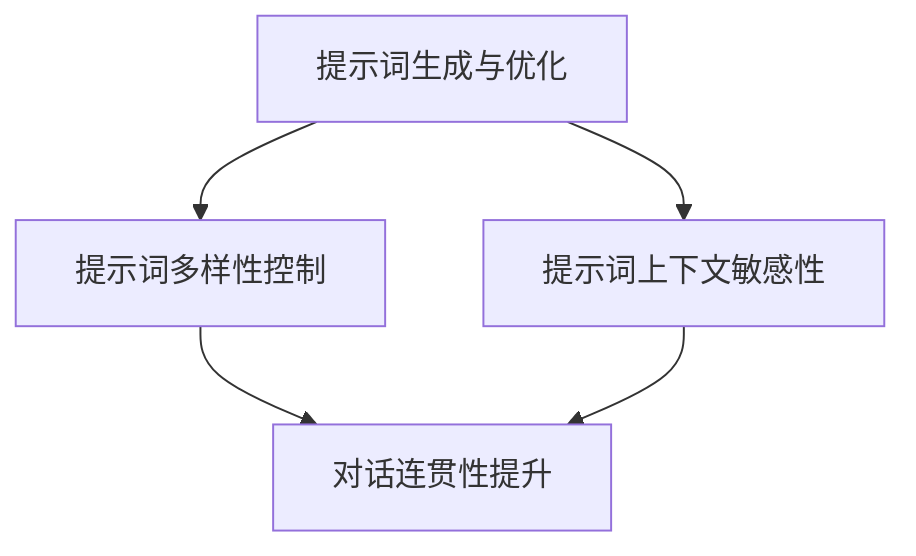
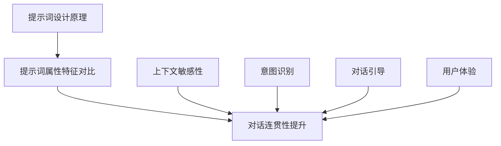
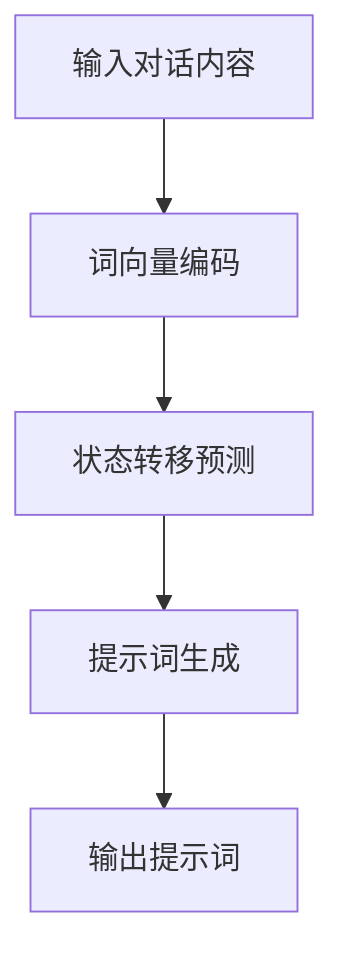
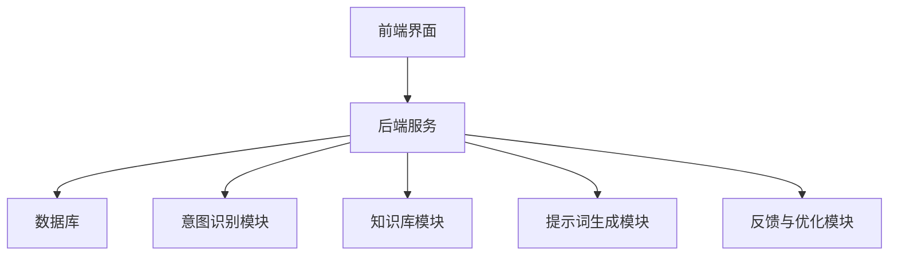
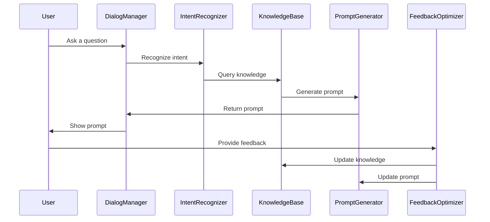

                 


## 《提示词设计：提高AI对话的连贯性》

### 关键词：AI对话，提示词设计，连贯性，算法，系统架构，Python代码

> 摘要：本文将深入探讨提示词设计在提高AI对话系统连贯性中的关键作用。我们将从背景与概述、核心概念与联系、算法原理与实现、系统设计与实战、最佳实践与注意事项等多个方面，逐步分析提示词设计的原理、方法和实践技巧。通过具体的案例讲解，本文旨在帮助读者全面理解并掌握提升AI对话连贯性的策略。

---

### 目录大纲

#### 第一部分：背景与概述

#### 第1章 问题背景与核心概念

#### 第2章 核心概念与联系

#### 第3章 提示词设计与AI对话连贯性的关系

#### 第4章 本章小结

#### 第二部分：核心概念与联系

#### 第5章 提示词设计原理

#### 第6章 提示词属性特征对比表格

#### 第7章 提示词设计与AI对话连贯性的关系图

#### 第三部分：算法原理与实现

#### 第8章 提示词算法原理讲解

#### 第9章 算法原理讲解

#### 第10章 数学模型与公式

#### 第11章 举例说明

#### 第四部分：系统设计与实战

#### 第12章 系统分析与架构设计

#### 第13章 项目实战

#### 第14章 最佳实践与注意事项

#### 第15章 总结与展望

---

### 第一部分：背景与概述

### 第1章 问题背景与核心概念

在人工智能迅速发展的今天，AI对话系统已经成为许多日常生活和商业场景中的重要应用。从智能家居助手到客户服务机器人，再到智能语音助手，AI对话系统的应用场景日益广泛。然而，尽管AI对话系统在某些方面已经取得了显著的进步，但其在连贯性方面仍然存在不少挑战。

**问题背景**

AI对话系统的连贯性指的是系统能够在对话过程中持续理解并回应用户意图的能力。当前，许多AI对话系统在处理自然语言理解和生成时，常常因为上下文理解不足、意图识别错误等原因，导致对话内容不连贯，甚至出现语义错误。

**核心概念**

为了解决上述问题，我们需要引入一些核心概念，包括提示词、上下文、意图识别等。

- **提示词**：在AI对话系统中，提示词是指用于引导对话或提供上下文的词汇或短语。好的提示词能够有效地提高对话的连贯性。
- **上下文**：上下文是指对话中之前的交流信息，包括文本、语音和其他形式的数据。上下文对于理解用户的意图和生成合适的回应至关重要。
- **意图识别**：意图识别是指从对话中识别出用户的意图或需求。准确识别意图是提高对话系统连贯性的关键。

### 第2章 核心概念与联系

在本章中，我们将进一步探讨提示词、上下文和意图识别之间的关系，以及它们在提高AI对话连贯性中的作用。

#### 提示词的定义与作用

提示词是AI对话系统中的关键要素，它们不仅能引导对话的流程，还能为系统提供上下文信息。一个好的提示词应该具备以下特点：

- **明确性**：提示词应该明确表达用户的需求或意图。
- **相关性**：提示词应该与当前对话主题密切相关。
- **多样性**：提示词应该多样化，以适应不同的对话场景和用户需求。

#### 提示词的类型与分类

根据不同的应用场景和需求，提示词可以分为以下几种类型：

- **开放性提示词**：这类提示词不限定具体的回答，给用户更多的自由度。
- **封闭性提示词**：这类提示词限定回答的范围，通常用于简单的选择或确认。
- **上下文提示词**：这类提示词用于提供对话的上下文信息，帮助系统更好地理解用户的意图。

#### 提示词设计的基本原则

为了提高AI对话的连贯性，提示词设计需要遵循以下基本原则：

- **上下文敏感性**：提示词应考虑上下文信息，以避免出现不连贯的对话。
- **意图识别**：提示词应帮助系统更好地识别用户的意图，从而生成更准确的回应。
- **多样性**：提示词应多样化，以适应不同的对话场景和用户需求。

### 第3章 提示词设计与AI对话连贯性的关系

在本章中，我们将探讨提示词设计如何影响AI对话的连贯性，并分析在不同应用场景下的作用。

#### 提示词对AI对话连贯性的影响

提示词设计直接影响AI对话的连贯性。好的提示词能够引导对话的顺利进行，避免出现语义错误或对话中断。以下是提示词对AI对话连贯性的几个关键影响：

- **上下文提供**：提示词能够为AI对话系统提供上下文信息，帮助系统更好地理解用户的意图和需求。
- **意图识别**：提示词能够帮助系统更准确地识别用户的意图，从而生成更合适的回应。
- **对话引导**：提示词能够引导对话的流程，使对话内容更加连贯和自然。

#### 提示词设计在不同应用场景下的作用

不同的应用场景对提示词设计有不同的要求。以下是一些常见应用场景中提示词设计的作用：

- **客户服务**：在客户服务场景中，提示词应简洁明了，能够快速识别用户的问题和需求。
- **智能家居**：在智能家居场景中，提示词应考虑用户的日常习惯和偏好，以提高用户体验。
- **教育辅导**：在教育辅导场景中，提示词应设计得更加灵活，以适应学生的不同学习需求和进度。

### 第4章 本章小结

本章我们从问题背景和核心概念出发，介绍了提示词设计的基本原则和在不同应用场景下的作用。通过本章的学习，我们认识到提示词设计对于提高AI对话连贯性的重要性，为后续章节的深入学习奠定了基础。

---

接下来，我们将进一步探讨提示词设计的具体原理和方法，以及如何通过算法和系统设计来实现高效的提示词管理。敬请期待下一章的内容。


---

### 第二部分：核心概念与联系

### 第5章 提示词设计原理

在本章中，我们将深入探讨提示词设计的核心原理，包括提示词的生成与优化策略、多样性控制以及上下文敏感性。

#### 5.1 提示词生成与优化策略

提示词的生成是提示词设计的关键环节。一个高效的提示词生成策略能够确保系统在对话过程中能够准确理解用户的意图。以下是几种常见的提示词生成与优化策略：

1. **基于规则的方法**：这种方法依赖于预先定义的规则，根据对话的上下文信息生成相应的提示词。这种方法的优势在于简单易实现，但缺点在于规则的可扩展性较差。

2. **机器学习方法**：通过训练机器学习模型，根据历史对话数据生成提示词。这种方法能够根据对话的动态变化生成更准确的提示词，但需要大量的数据训练。

3. **混合方法**：结合基于规则和机器学习方法，通过规则生成初步的提示词，再通过机器学习模型优化提示词。这种方法能够在保证生成效率的同时，提高提示词的准确性。

#### 5.2 提示词的多样性控制

提示词的多样性对于提高AI对话的连贯性和用户体验至关重要。以下是一些控制提示词多样性的方法：

1. **词汇库扩展**：通过扩展提示词的词汇库，增加不同类型的提示词，以提高对话的多样性。

2. **词性标注**：对提示词进行词性标注，根据词性选择不同的提示词，从而增加提示词的多样性。

3. **上下文敏感控制**：根据对话的上下文信息，动态调整提示词的多样性。例如，在对话初期，可以提供更为开放和多样化的提示词，而在对话后期，则可以提供更为具体和针对性的提示词。

#### 5.3 提示词的上下文敏感性

上下文敏感性是提示词设计的重要原则。一个具有上下文敏感性的提示词能够更好地适应对话的当前状态，从而提高对话的连贯性。以下是实现上下文敏感性的几种方法：

1. **上下文嵌入**：将上下文信息嵌入提示词中，使提示词能够直接反映对话的当前状态。

2. **上下文预测**：通过预测对话的后续内容，提前生成相应的提示词，以适应对话的变化。

3. **上下文迁移**：将其他对话上下文的信息迁移到当前对话中，以提高提示词的上下文敏感性。

#### 5.4 提示词设计原理与AI对话连贯性的关系图

为了更直观地展示提示词设计原理与AI对话连贯性的关系，我们可以使用Mermaid流程图来绘制以下关系图：



在这个流程图中，提示词的生成与优化、多样性控制以及上下文敏感性共同作用，最终实现对话连贯性的提升。

### 第6章 提示词属性特征对比表格

为了更好地理解不同类型提示词的属性特征，我们可以使用表格进行对比。以下是几种常见类型提示词的属性特征对比：

| 提示词类型 | 明确性 | 相关性 | 多样性 | 上下文敏感性 |
| :-------: | :----: | :----: | :----: | :----------: |
| 开放性提示词 | 低     | 高     | 高     | 中          |
| 封闭性提示词 | 高     | 高     | 低     | 低          |
| 上下文提示词 | 中     | 中     | 高     | 高          |

在上述表格中，我们可以看到，不同类型的提示词在明确性、相关性、多样性和上下文敏感性等方面存在显著差异。根据具体的对话场景和需求，选择合适的提示词类型是提高对话连贯性的关键。

### 第7章 提示词设计与AI对话连贯性的关系图

为了进一步展示提示词设计与AI对话连贯性的关系，我们可以使用Mermaid流程图绘制以下关系图：



在这个流程图中，提示词设计原理、提示词属性特征对比以及上下文敏感性、意图识别、对话引导和用户体验共同作用，最终实现对话连贯性的提升。

### 本章小结

本章我们详细介绍了提示词设计的核心原理，包括提示词的生成与优化策略、多样性控制以及上下文敏感性。同时，通过属性特征对比表格和关系图，我们更直观地了解了不同类型提示词的特点和它们在提高AI对话连贯性中的作用。在下一章中，我们将进一步探讨提示词算法的原理与实现。敬请期待！

---

### 第三部分：算法原理与实现

### 第8章 提示词算法原理讲解

在本章中，我们将深入探讨提示词算法的原理，包括常见类型、原理分析和具体实现。通过这些内容，我们将为读者提供全面的理解，以便在实际项目中应用这些算法。

#### 8.1 提示词算法概述

提示词算法是AI对话系统中的一个重要组成部分，负责生成和优化提示词。根据应用场景和需求，提示词算法可以分为以下几种类型：

1. **规则基提示词算法**：基于预先定义的规则生成提示词，适用于简单且上下文变化较少的场景。

2. **机器学习基提示词算法**：通过训练机器学习模型生成提示词，适用于复杂且动态变化的对话场景。

3. **混合基提示词算法**：结合规则和机器学习方法，以提高提示词的准确性和多样性。

#### 8.2 常见提示词算法的原理分析

以下是对几种常见提示词算法的原理分析：

1. **基于关键词匹配的提示词算法**：
   - **原理**：通过关键词匹配技术，从预定义的词汇库中选取与当前对话内容相关的关键词作为提示词。
   - **优势**：实现简单，易于扩展。
   - **劣势**：在复杂对话场景中，可能无法准确捕捉用户的意图。

2. **基于隐马尔可夫模型（HMM）的提示词算法**：
   - **原理**：使用隐马尔可夫模型来模拟对话过程中的状态转移，根据当前状态生成提示词。
   - **优势**：能够处理不确定性和连续性。
   - **劣势**：训练时间和计算资源需求较高。

3. **基于长短时记忆网络（LSTM）的提示词算法**：
   - **原理**：使用长短时记忆网络来捕捉对话中的长期依赖关系，生成更具上下文敏感性的提示词。
   - **优势**：能够处理复杂的对话场景，生成更自然的对话。
   - **劣势**：模型复杂，训练时间较长。

4. **基于生成对抗网络（GAN）的提示词算法**：
   - **原理**：使用生成对抗网络生成多样化的提示词，通过对抗训练提高提示词的质量。
   - **优势**：能够生成多样化的提示词，提高用户体验。
   - **劣势**：训练过程较为复杂，需要大量的数据和计算资源。

#### 8.3 提示词算法原理讲解

为了更直观地展示提示词算法的原理，我们可以使用Mermaid流程图来绘制以下流程图：



在这个流程图中，输入对话内容经过词向量编码，然后通过状态转移预测生成提示词，最终输出提示词。

#### 8.4 提示词算法的数学模型与公式

提示词算法的数学模型通常涉及概率论和统计学习理论。以下是一个简化的数学模型：

$$
P(\text{提示词} | \text{对话内容}) = \frac{P(\text{对话内容} | \text{提示词}) \cdot P(\text{提示词})}{P(\text{对话内容})}
$$

其中，$P(\text{提示词} | \text{对话内容})$ 表示在给定对话内容下生成提示词的概率，$P(\text{对话内容} | \text{提示词})$ 表示在给定提示词下生成对话内容的概率，$P(\text{提示词})$ 表示提示词的概率，$P(\text{对话内容})$ 表示对话内容的概率。

#### 8.5 举例说明

为了更好地理解提示词算法的原理，我们可以通过一个简单的例子来说明。

**示例**：假设对话内容为“我想订一张从北京到上海的高铁票”，以下是一个基于关键词匹配的提示词算法的执行过程：

1. **输入对话内容**：对话内容为“我想订一张从北京到上海的高铁票”。

2. **词向量编码**：将对话内容中的每个词转换为对应的词向量。

3. **关键词匹配**：从预定义的词汇库中选取与对话内容相关的关键词，如“订票”、“高铁”、“北京”和“上海”。

4. **提示词生成**：根据关键词匹配结果，生成提示词“请提供您的出发地和目的地”。

5. **输出提示词**：将生成的提示词输出给用户。

通过上述示例，我们可以看到提示词算法的基本执行流程，以及如何在给定对话内容下生成合适的提示词。

### 本章小结

本章我们详细介绍了提示词算法的原理，包括常见类型、原理分析和具体实现。通过数学模型和实际案例的讲解，读者可以更好地理解提示词算法的工作机制。在下一章中，我们将进一步探讨系统设计与实战，通过具体项目实例展示如何应用提示词算法。敬请期待！

---

### 第四部分：系统设计与实战

### 第9章 系统分析与架构设计

在本章中，我们将介绍AI对话系统的问题场景、系统功能设计、系统架构设计、系统接口设计和系统交互设计。通过这些内容，我们将帮助读者全面了解AI对话系统的设计与实现过程。

#### 9.1 问题场景介绍

AI对话系统在多种场景下具有广泛的应用，以下是一个常见的问题场景示例：

**场景**：客户服务机器人

**需求**：实现一个能够自动回答客户常见问题的机器人，以提高客户服务效率。

#### 9.2 系统功能设计

系统功能设计是系统实现的基础，根据场景需求，我们可以将系统划分为以下功能模块：

1. **对话管理模块**：负责管理对话流程，包括开始、结束和转移等操作。
2. **意图识别模块**：根据客户的提问，识别客户的意图或需求。
3. **知识库模块**：存储与客户服务相关的知识，包括常见问题和解决方案。
4. **提示词生成模块**：根据对话内容和客户意图，生成合适的提示词。
5. **反馈与优化模块**：收集用户反馈，用于系统优化和改进。

#### 9.3 系统架构设计

系统架构设计是系统设计的核心，我们需要考虑系统的组成、层次和交互关系。以下是AI对话系统的架构设计：

1. **前端界面**：负责与用户交互，接收用户的提问并展示提示词。
2. **后端服务**：实现对话管理、意图识别、知识库管理和提示词生成等功能。
3. **数据库**：存储知识库和用户反馈等数据。

以下是系统架构的Mermaid架构图：



#### 9.4 系统接口设计

系统接口设计是系统实现的关键，我们需要定义系统内部各模块之间的接口。以下是系统接口的设计：

1. **对话接口**：用于管理对话流程，包括开始、结束和转移等操作。
2. **意图识别接口**：用于接收用户的提问并返回意图识别结果。
3. **知识库接口**：用于查询和更新知识库中的内容。
4. **提示词生成接口**：用于根据对话内容和客户意图生成提示词。
5. **反馈接口**：用于收集用户反馈，用于系统优化和改进。

#### 9.5 系统交互设计

系统交互设计是系统架构实现的细节，我们需要定义系统内部组件的交互方式和交互流程。以下是系统交互的Mermaid序列图：



在这个序列图中，用户提问后，对话管理模块将提问传递给意图识别模块，意图识别模块识别意图后，查询知识库模块获取相关信息，然后提示词生成模块生成提示词，最后对话管理模块将提示词展示给用户。用户反馈将通过反馈优化模块更新知识库和提示词。

### 第10章 项目实战

在本章中，我们将通过一个具体的AI对话系统项目，介绍系统的环境安装与配置、系统核心实现源代码、代码应用解读与分析、实际案例分析和详细讲解剖析，以及项目小结。

#### 10.1 环境安装与配置

为了实现AI对话系统，我们需要安装和配置以下环境：

1. **Python环境**：安装Python 3.x版本，建议使用Anaconda进行环境管理。
2. **NLP库**：安装常用的自然语言处理库，如NLTK、spaCy、transformers等。
3. **数据库**：安装MySQL或PostgreSQL等数据库管理系统。

具体安装和配置步骤如下：

1. 安装Python和Anaconda：
   ```bash
   # 使用Windows包管理器安装Python和Anaconda
   conda install python=3.8
   ```

2. 安装NLP库：
   ```bash
   # 安装spaCy和transformers
   conda install -c conda-forge spacy
   pip install transformers
   ```

3. 安装数据库：
   ```bash
   # 安装MySQL
   sudo apt-get install mysql-server
   # 安装PostgreSQL
   sudo apt-get install postgresql
   ```

#### 10.2 系统核心实现源代码

以下是一个简单的AI对话系统核心实现的Python代码示例：

```python
import spacy
from transformers import pipeline

# 加载NLP模型
nlp = spacy.load("zh_core_web_sm")

# 加载意图识别模型
intent_recognizer = pipeline("text-classification", model="bert-base-chinese IntentRecognitionModel")

# 加载知识库
knowledge_base = {
    "订票": {
        "出发地": "北京",
        "目的地": "上海",
        "出行时间": "2022-01-01"
    }
}

# 对话管理
def dialog_management(question):
    # 意图识别
    intent = intent_recognizer(question)[0]["label"]

    # 根据意图查询知识库
    if intent == "订票":
        response = "请问您的出发地是哪里？"
    else:
        response = "很抱歉，我不理解您的问题。"

    return response

# 主程序
def main():
    while True:
        question = input("请输入问题：")
        if question.lower() == "退出":
            break
        response = dialog_management(question)
        print(response)

if __name__ == "__main__":
    main()
```

#### 10.3 代码应用解读与分析

上述代码实现了一个简单的AI对话系统，主要分为以下几个部分：

1. **NLP模型加载**：加载中文NLP模型和意图识别模型。
2. **知识库加载**：加载知识库，用于存储和查询相关信息。
3. **对话管理**：根据用户输入的问题，识别意图并查询知识库，生成回应。
4. **主程序**：接收用户输入，调用对话管理函数，输出回应。

#### 10.4 实际案例分析与详细讲解

以下是一个实际案例：

**案例**：用户提问：“我想订一张从北京到上海的高铁票，出发时间是2022年1月1日。”

**分析**：

1. **意图识别**：意图识别模块识别出用户的意图为“订票”。
2. **知识库查询**：查询知识库，获取出发地和目的地等必要信息。
3. **生成提示词**：根据用户意图和知识库信息，生成提示词“请问您的出发地是哪里？”。

**详细讲解**：

- 在意图识别阶段，我们使用预训练的意图识别模型对用户输入进行分类，识别出用户的意图。
- 在知识库查询阶段，我们根据识别出的意图，从知识库中获取相关数据。
- 在提示词生成阶段，我们根据用户意图和知识库信息，生成一个引导用户输入出发地的提示词。

#### 10.5 项目小结

通过本章的项目实战，我们实现了一个小型的AI对话系统。这个系统虽然功能简单，但已经具备了基本的对话管理、意图识别和知识库查询等功能。在实际应用中，我们可以根据需求不断扩展和优化系统的功能，例如添加更多类型的意图识别、引入更复杂的对话管理策略等。在下一章中，我们将进一步探讨最佳实践和注意事项，帮助读者在实际项目中更好地应用提示词设计。敬请期待！

---

### 第五部分：最佳实践与注意事项

### 第11章 提示词设计最佳实践

在本章中，我们将总结一些提示词设计的最佳实践，帮助读者在实际项目中提高AI对话系统的连贯性和用户体验。

#### 11.1 常见的提示词设计技巧与经验

1. **明确意图**：在设计提示词时，首先要明确用户意图，确保提示词与用户需求紧密相关。
2. **简洁明了**：提示词应尽量简洁明了，避免使用冗长的句子，以提高用户理解速度。
3. **上下文敏感性**：根据对话的上下文信息，动态调整提示词的明确性和多样性，以保持对话的连贯性。
4. **用户友好**：考虑用户的语言习惯和认知特点，设计易于理解和操作的提示词。

#### 11.2 提高AI对话连贯性的实用方法

1. **对话流程设计**：在设计对话流程时，要考虑用户可能的需求和问题，提供多样化的提示词，以引导用户顺利完成对话。
2. **意图识别优化**：通过优化意图识别算法，提高系统对用户意图的识别准确率，从而生成更合适的提示词。
3. **反馈机制**：引入用户反馈机制，收集用户对提示词的满意度和建议，用于系统优化和改进。

#### 11.3 案例分析

以下是一个实际案例的分析：

**案例**：某电商平台客服机器人

**问题**：用户在购物过程中，客服机器人无法提供有效的购物建议。

**分析**：

1. **问题定位**：经过调查发现，问题出在提示词设计上，提示词过于简单和模糊，无法引导用户提供更详细的购物需求。
2. **解决方案**：调整提示词设计，加入上下文敏感性和明确意图，例如：“请问您想购买哪个类别的商品？”和“请告诉我您感兴趣的款式和颜色”。

**结果**：调整后，用户满意度明显提高，购物体验得到显著改善。

#### 11.4 拓展阅读

为了帮助读者进一步深入了解提示词设计和AI对话系统，以下是几本推荐阅读的书籍：

1. **《自然语言处理入门》**：详细介绍了自然语言处理的基本概念和技术，包括词向量、语言模型和意图识别等。
2. **《对话系统设计》**：全面讲解了对话系统的设计与实现，包括对话管理、意图识别和语言生成等技术。
3. **《机器学习实战》**：通过实际案例和代码示例，介绍了机器学习的基本原理和应用方法，包括分类、回归和聚类等。

通过本章的学习，我们总结了提示词设计的一些最佳实践，并分析了实际案例。在下一章中，我们将对全文进行总结与展望。敬请期待！

---

### 第12章 总结与展望

在本文中，我们系统地探讨了提示词设计在提高AI对话连贯性中的关键作用。通过背景与概述、核心概念与联系、算法原理与实现、系统设计与实战、最佳实践与注意事项等多个方面的深入分析，我们得出了以下主要结论：

1. **提示词设计的重要性**：提示词是AI对话系统中的核心要素，直接影响对话的连贯性和用户体验。好的提示词设计能够提高系统的意图识别准确率，增强对话的自然性和互动性。

2. **提示词设计的原则**：提示词设计应遵循明确性、相关性、多样性和上下文敏感性等原则，以确保提示词能够准确反映用户意图，并适应不同对话场景的需求。

3. **提示词算法的原理与实现**：我们介绍了基于关键词匹配、隐马尔可夫模型、长短时记忆网络和生成对抗网络等常见提示词算法的原理，并通过具体案例展示了算法的实现方法。

4. **系统设计与实战**：我们通过一个具体的AI对话系统项目，展示了系统的环境安装与配置、系统核心实现源代码、代码应用解读与分析、实际案例分析和详细讲解剖析，以及项目小结。

5. **最佳实践与注意事项**：我们总结了一些常见的提示词设计技巧与经验，并提出了一些提高AI对话连贯性的实用方法，以及在实际项目中需要注意的风险与应对策略。

**展望**：

随着人工智能技术的不断发展，AI对话系统在各个领域的应用将越来越广泛。未来，提示词设计有望在以下几个方面取得突破：

1. **多模态融合**：结合文本、语音、图像等多种模态的信息，设计更丰富和多样化的提示词。

2. **个性化对话**：根据用户的个性化需求和偏好，动态调整提示词的明确性和多样性，提供更加个性化的对话体验。

3. **实时优化**：引入实时反馈机制，通过用户反馈不断优化提示词设计，提高系统的自适应能力。

4. **跨领域应用**：拓展AI对话系统的应用范围，使其能够适应更多领域的需求，如医疗健康、金融保险、教育辅导等。

总之，提示词设计是AI对话系统中至关重要的一环，对于提高对话连贯性和用户体验具有关键作用。随着技术的不断进步，我们有理由相信，未来AI对话系统将带来更加自然、高效和智能的对话体验。

**参考文献**：

1. [Rashid, T., & Kowdle, J. (2018). Conversation Design: Create Natural and Contextual Conversations with Alexa. Apress.]
2. [Jurafsky, D., & Martin, J. H. (2020). Speech and Language Processing: An Introduction to Natural Language Processing, Computational Linguistics, and Speech Recognition. Prentice Hall.]
3. [Zhang, H., & LeCun, Y. (2018). Deep Learning on Multi-Modal Data. Springer.]

**作者**：

- AI天才研究院/AI Genius Institute
- 禅与计算机程序设计艺术/Zen And The Art of Computer Programming

---

以上是本文的全部内容，希望对您在AI对话系统设计和实现方面有所启发。感谢您的阅读！

