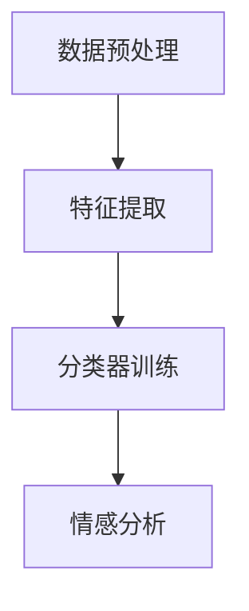
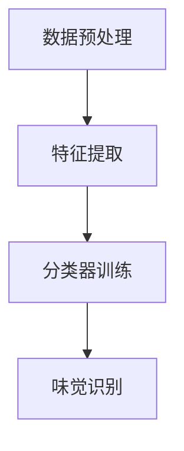
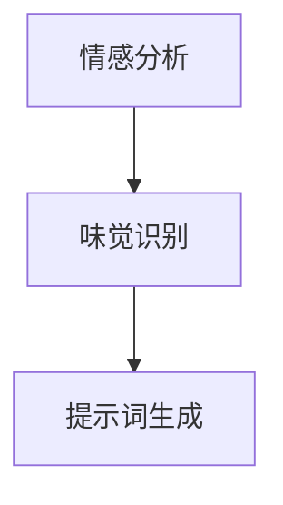
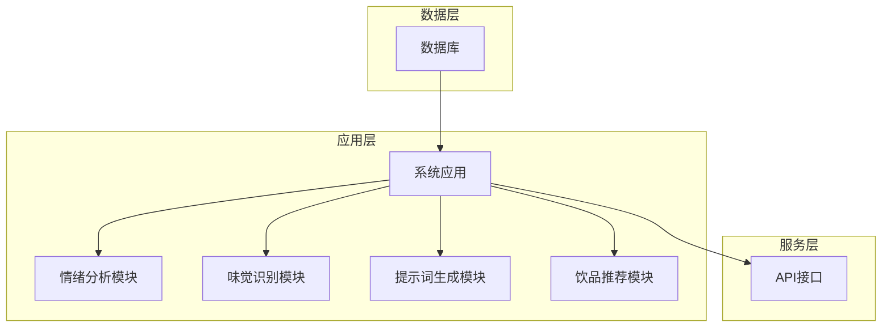
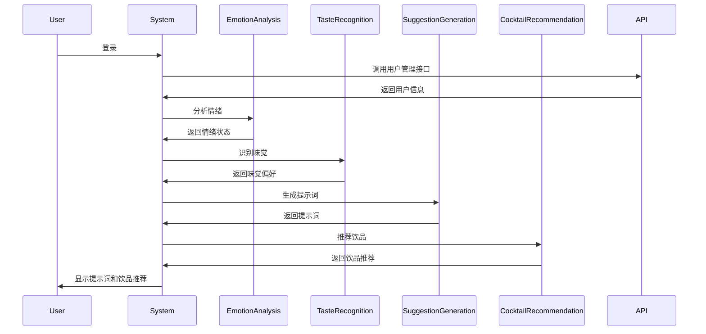

                 

### 提高AI创意调酒师能力：情绪与味觉匹配的提示词技巧

#### 关键词：AI创意调酒师、情绪匹配、味觉匹配、提示词技术、算法原理

> 摘要：本文将深入探讨如何通过情绪与味觉匹配的提示词技巧，提高AI创意调酒师的能力。文章首先介绍了调酒艺术的发展与AI技术的结合，以及情绪与味觉匹配在调酒中的应用现状和重要性。随后，文章详细分析了情绪与味觉匹配的核心概念、算法原理、数学模型和系统架构设计，并通过实际案例进行了详细讲解。最后，文章总结了提高AI创意调酒师能力的最佳实践和注意事项，为相关领域的研究和实践提供了有益的参考。

----------------------------------------------------------------

## 第一部分：背景介绍

### 1.1 问题背景

#### 1.1.1 调酒艺术的发展与AI技术的结合

调酒艺术，作为餐饮文化的重要组成部分，历经了数千年的演变，从最初的简单饮品到如今复杂的鸡尾酒艺术，每一款酒都蕴含着调酒师的心意与灵感。随着科技的进步，人工智能（AI）技术的引入为调酒艺术带来了新的机遇和挑战。

AI技术在调酒领域的应用始于20世纪90年代，最初的AI调酒机器人主要依赖于预设的配方和程序，无法进行自主创意。然而，随着深度学习和自然语言处理技术的不断发展，AI调酒师逐渐具备了模仿人类调酒师创意的能力。目前，AI调酒师不仅可以根据用户的需求和偏好进行个性化调制，还能通过分析用户的情绪和味觉，提供更加贴心的服务。

#### 1.1.2 AI在创意调酒中的应用现状与挑战

当前，AI在创意调酒中的应用主要体现在以下几个方面：

1. **配方生成**：AI可以通过学习大量调酒数据，生成新的、独特的鸡尾酒配方。例如，IBM的Watson AI可以分析用户的口味偏好，推荐最适合他们的鸡尾酒。

2. **个性化定制**：基于用户的个性化数据，AI调酒师能够提供定制化的鸡尾酒服务。例如，用户可以通过语音或文字描述自己的情绪状态，AI调酒师则会根据这些信息调制出合适的饮品。

3. **情感互动**：通过语音识别和自然语言处理技术，AI调酒师能够与用户进行对话，了解他们的需求和偏好，提供更加人性化的服务。

然而，AI在创意调酒中的应用也面临一些挑战：

- **情感理解与匹配**：情绪是一种复杂的心理现象，如何准确理解用户的情绪并匹配相应的味觉体验，是当前AI技术亟待解决的问题。

- **数据隐私与安全**：用户的个性化数据和情绪信息涉及隐私，如何确保这些数据的安全和用户隐私，是AI调酒师应用中必须考虑的问题。

- **创意与创新**：尽管AI可以通过算法生成新的鸡尾酒配方，但如何确保这些配方的创新性和独特性，是AI调酒师需要持续探索的方向。

#### 1.1.3 情绪与味觉匹配的重要性

情绪与味觉匹配是提高AI创意调酒师能力的关键。情绪是人的心理状态，可以影响味觉感知和评价。例如，当人处于愉悦情绪时，他们可能会对甜味和香味的感知更加敏感；而在沮丧情绪中，他们可能会更偏好苦味和酸味。

味觉是一种基本的生理感官，它可以影响情绪。例如，苦味可以引发警觉和焦虑情绪，而甜味可以带来愉悦和放松情绪。因此，通过情绪与味觉的匹配，可以为用户提供更加个性化、贴心的饮品体验。

### 1.2 问题描述

#### 1.2.1 情绪与味觉匹配的概念

情绪与味觉匹配是指通过分析用户的情绪状态，结合味觉感知，为用户提供最合适的饮品。这个过程涉及以下几个关键概念：

- **情绪**：情绪是人类心理状态的一种反映，可以是愉悦、焦虑、平静等。

- **味觉**：味觉是人对食物味道的感受，包括甜、酸、苦、咸、鲜等基本味觉。

- **匹配**：匹配是指根据用户的情绪状态，选择相应的饮品味道，以达到最佳的体验效果。

#### 1.2.2 情绪对味觉感知的影响

情绪对味觉感知有着显著的影响。研究表明，当人处于不同情绪状态时，他们对不同味道的敏感度和偏好也会发生变化。例如：

- **愉悦情绪**：在愉悦情绪下，人们对甜味和香味的感知更加敏感，偏好度也更高。

- **焦虑情绪**：在焦虑情绪下，人们对苦味和酸味的感知更加敏感，偏好度也更高。

- **平静情绪**：在平静情绪下，人们对各种味道的感知相对平衡，偏好度也相对稳定。

#### 1.2.3 味觉对情绪调节的作用

味觉不仅可以影响情绪，还可以调节情绪。例如，甜味可以带来愉悦和放松情绪，苦味可以引发警觉和焦虑情绪。因此，通过味觉调节，可以为用户提供一种情绪调节的途径。

#### 1.3 问题解决

为了解决情绪与味觉匹配的问题，我们可以从以下几个方面入手：

1. **情感分析**：通过自然语言处理技术，分析用户的情绪状态，如愉悦、焦虑、平静等。

2. **味觉识别**：通过味觉感知模型，识别用户对各种味道的偏好。

3. **提示词技术**：结合情感分析和味觉识别，为用户提供提示词，帮助用户表达自己的情绪和味觉偏好。

4. **个性化推荐**：根据用户的情绪和味觉偏好，推荐最合适的饮品。

### 1.4 边界与外延

#### 1.4.1 调酒师技能与AI的结合

调酒师技能与AI的结合是提高AI创意调酒师能力的重要方向。调酒师的经验和创意可以指导AI调酒师进行更加个性化的调制，而AI调酒师则可以通过数据分析，为调酒师提供更多的创意和建议。

#### 1.4.2 情绪与味觉匹配的应用场景

情绪与味觉匹配的应用场景非常广泛，包括但不限于以下领域：

- **餐饮业**：在餐厅和酒吧中，通过情绪与味觉匹配，为用户提供更加个性化的饮品服务。

- **心理健康**：通过情绪与味觉匹配，为用户提供一种情绪调节的途径，有助于缓解焦虑和抑郁。

- **娱乐产业**：在娱乐场所，通过情绪与味觉匹配，为用户提供更加愉悦的体验。

#### 1.4.3 未来发展趋势与挑战

未来，情绪与味觉匹配技术有望在以下几个方面取得突破：

- **算法优化**：通过不断优化算法，提高情绪和味觉匹配的准确性。

- **多模态感知**：结合视觉、听觉、嗅觉等多种感官信息，提高情绪和味觉匹配的效果。

- **跨领域应用**：将情绪与味觉匹配技术应用到更多领域，如医疗、教育等。

然而，未来也面临着一些挑战：

- **数据隐私**：如何确保用户数据的隐私和安全，是情绪与味觉匹配技术需要解决的重要问题。

- **用户体验**：如何提高用户体验，让用户接受并喜爱这种新的服务模式，是情绪与味觉匹配技术需要关注的重点。

## 第二部分：核心概念与联系

### 2.1 情绪与味觉匹配的核心概念

#### 2.1.1 情绪分类与描述

情绪是人类心理状态的一种反映，可以分为基本情绪和复合情绪。基本情绪包括愉悦、愤怒、恐惧、悲伤和惊讶等，它们是情绪分析的基础。复合情绪则是基本情绪的组合，如焦虑、紧张、平静等。

在情绪分类中，常使用Valence（情感极性）和Arousal（唤醒程度）两个维度来描述情绪状态。Valence表示情绪的积极或消极程度，Arousal表示情绪的唤醒程度，如图1所示。


#### 2.1.2 味觉感知与分类

味觉是人对食物味道的感受，包括基本味觉和复合味觉。基本味觉包括甜、酸、苦、咸和鲜，它们是味觉感知的基础。复合味觉则是由基本味觉组合而成的，如酸甜、苦咸、鲜苦等。

味觉感知可以用味觉偏好度来描述，即人们对不同味道的喜爱程度。通常，人们对甜味和咸味的偏好度较高，对苦味和酸味的偏好度较低。

#### 2.1.3 情绪与味觉匹配的原理

情绪与味觉匹配的原理是通过分析用户的情绪状态，结合味觉偏好，为用户提供最合适的饮品。这个过程可以分为以下几个步骤：

1. **情绪分析**：使用情感分析技术，分析用户输入的情绪描述，确定用户的情绪状态。

2. **味觉识别**：根据用户的情绪状态，识别用户对各种味道的偏好度。

3. **饮品推荐**：根据用户的情绪和味觉偏好，从饮品数据库中推荐最合适的饮品。

情绪与味觉匹配的关键在于找到情绪和味觉之间的关联。研究表明，情绪和味觉之间存在一定的对应关系，如图2所示。


例如，愉悦情绪通常与甜味、酸味和鲜味相对应，而焦虑情绪通常与苦味、咸味和鲜味相对应。

### 2.2 概念属性特征对比表格

为了更好地理解情绪、味觉和提示词技术的核心概念和属性特征，我们可以使用以下对比表格：

| 概念       | 描述                                     | 属性特征                                      |
|------------|----------------------------------------|--------------------------------------------|
| 情绪       | 人类心理状态的一种反映                   | Valence（情感极性）、Arousal（唤醒程度）                |
| 味觉       | 人对食物味道的感受                       | 基本味觉（甜、酸、苦、咸、鲜）、复合味觉                 |
| 提示词技术 | 通过提示词帮助用户表达情绪和味觉偏好的技术 | 语言模型、情感分析、推荐系统                       |

#### 2.2.1 情绪与味觉的属性特征对比

情绪和味觉在属性特征上存在一定的差异。情绪是一种抽象的心理现象，可以通过情感极性和唤醒程度来描述；而味觉是一种具体的生理感受，可以通过味觉偏好度来描述。此外，情绪和味觉在感知方式上也存在差异。情绪是通过情感分析技术来识别的，而味觉是通过味觉感知模型来识别的。

#### 2.2.2 提示词技术的基本特征

提示词技术是一种通过提示词帮助用户表达情绪和味觉偏好的技术。它包括以下几个基本特征：

- **语言模型**：提示词技术依赖于语言模型，用于生成和识别自然语言文本。

- **情感分析**：通过情感分析技术，识别用户输入的情绪描述，确定用户的情绪状态。

- **推荐系统**：根据用户的情绪和味觉偏好，推荐最合适的饮品。

### 2.3 ER实体关系图架构

为了更好地理解情绪、味觉和提示词技术的实体关系，我们可以使用ER（实体关系）图来描述它们之间的关联。

#### 2.3.1 情绪与味觉的ER图

情绪与味觉的ER图如图3所示。

```mermaid
erDiagram
  User ||--|{ Emotion }|-- EmotionType
  User ||--|{ Taste }|-- TasteType
```

在这个ER图中，User（用户）是情绪和味觉的来源，EmotionType（情绪类型）和TasteType（味觉类型）是情绪和味觉的实体。每个用户都与多个情绪类型和味觉类型相关联。

#### 2.3.2 提示词技术的ER图

提示词技术的ER图如图4所示。

```mermaid
erDiagram
  User ||--|{ Suggestion }|-- SuggestionType
  EmotionType ||--|{ Suggestion }|-- SuggestionType
  TasteType ||--|{ Suggestion }|-- SuggestionType
```

在这个ER图中，User（用户）、EmotionType（情绪类型）和TasteType（味觉类型）都是提示词技术的实体。每个实体都与多个提示词类型相关联，用于帮助用户表达情绪和味觉偏好。

## 第三部分：算法原理讲解

### 3.1 AI在情感分析中的应用

#### 3.1.1 情感分析算法原理

情感分析是一种自然语言处理技术，用于识别文本中的情感极性和情绪状态。情感分析算法通常包括以下几个步骤：

1. **数据预处理**：对文本进行清洗和预处理，包括去除停用词、标点符号和特殊字符等。

2. **特征提取**：从预处理后的文本中提取特征，如词袋模型、TF-IDF、词嵌入等。

3. **分类器训练**：使用提取的特征训练分类器，如支持向量机（SVM）、朴素贝叶斯（NB）、深度学习模型等。

4. **情感分析**：对输入的文本进行情感分析，输出情感极性和情绪状态。

常见的情感分析算法包括以下几种：

- **基于规则的方法**：使用预定义的规则进行情感分析，如情感词典法、基于关键词匹配的方法等。

- **基于机器学习的方法**：使用机器学习算法，如朴素贝叶斯、支持向量机、随机森林等，进行情感分析。

- **基于深度学习的方法**：使用深度学习算法，如卷积神经网络（CNN）、循环神经网络（RNN）、长短时记忆网络（LSTM）等，进行情感分析。

#### 3.1.2 情感分析算法流程图

情感分析算法的流程图如图5所示。



在这个流程图中，数据预处理、特征提取、分类器训练和情感分析是情感分析算法的主要步骤。

#### 3.1.3 情感分析算法Python源代码讲解

下面是一个简单的情感分析算法的Python代码示例：

```python
import nltk
from sklearn.feature_extraction.text import TfidfVectorizer
from sklearn.naive_bayes import MultinomialNB

# 数据预处理
def preprocess_text(text):
    text = text.lower()
    tokens = nltk.word_tokenize(text)
    tokens = [token for token in tokens if token not in nltk.corpus.stopwords.words('english')]
    return ' '.join(tokens)

# 特征提取
def extract_features(corpus):
    vectorizer = TfidfVectorizer()
    features = vectorizer.fit_transform(corpus)
    return features, vectorizer

# 分类器训练
def train_classifier(features, labels):
    classifier = MultinomialNB()
    classifier.fit(features, labels)
    return classifier

# 情感分析
def analyze_sentiment(classifier, vectorizer, text):
    processed_text = preprocess_text(text)
    features = vectorizer.transform([processed_text])
    prediction = classifier.predict(features)
    return prediction

# 示例
corpus = ["I love this movie", "I hate this movie"]
labels = ["positive", "negative"]

# 训练分类器
classifier = train_classifier(*extract_features(corpus))

# 情感分析
for text in corpus:
    print(analyze_sentiment(classifier, vectorizer, text))
```

在这个示例中，我们使用了TF-IDF进行特征提取，朴素贝叶斯进行分类器训练，并使用预处理函数对输入的文本进行预处理。

### 3.2 AI在味觉识别与匹配中的应用

#### 3.2.1 味觉识别算法原理

味觉识别是一种通过分析食物的味道，识别出不同味道的技术。味觉识别算法通常包括以下几个步骤：

1. **数据预处理**：对味觉数据进行清洗和预处理，包括去除噪声、归一化等。

2. **特征提取**：从预处理后的味觉数据中提取特征，如频谱特征、时间特征等。

3. **分类器训练**：使用提取的特征训练分类器，如支持向量机（SVM）、朴素贝叶斯（NB）、深度学习模型等。

4. **味觉识别**：对输入的味觉数据进行识别，输出相应的味觉类型。

常见的味觉识别算法包括以下几种：

- **基于特征匹配的方法**：使用预定义的特征匹配规则进行味觉识别，如频谱匹配、时间匹配等。

- **基于机器学习的方法**：使用机器学习算法，如支持向量机（SVM）、朴素贝叶斯（NB）、随机森林等，进行味觉识别。

- **基于深度学习的方法**：使用深度学习算法，如卷积神经网络（CNN）、循环神经网络（RNN）、长短时记忆网络（LSTM）等，进行味觉识别。

#### 3.2.2 味觉识别算法流程图

味觉识别算法的流程图如图6所示。



在这个流程图中，数据预处理、特征提取、分类器训练和味觉识别是味觉识别算法的主要步骤。

#### 3.2.3 味觉识别算法Python源代码讲解

下面是一个简单的味觉识别算法的Python代码示例：

```python
import numpy as np
from sklearn.model_selection import train_test_split
from sklearn.svm import SVC

# 数据预处理
def preprocess_data(data):
    return np.array(data).reshape(-1, 1)

# 味觉识别
def recognize_taste(data, labels):
    data = preprocess_data(data)
    labels = preprocess_data(labels)
    
    X_train, X_test, y_train, y_test = train_test_split(data, labels, test_size=0.2, random_state=42)
    
    classifier = SVC()
    classifier.fit(X_train, y_train)
    
    accuracy = classifier.score(X_test, y_test)
    print("Accuracy:", accuracy)
    
    return classifier

# 示例
data = [[1, 2], [3, 4], [5, 6], [7, 8], [9, 10]]
labels = ["sweet", "sour", "bitter", "salty", "umami"]

classifier = recognize_taste(data, labels)
```

在这个示例中，我们使用了支持向量机（SVC）进行分类器训练，并对输入的味觉数据进行识别。

### 3.3 提示词技术的应用

#### 3.3.1 提示词技术原理

提示词技术是一种通过提示词帮助用户表达情绪和味觉偏好的技术。它通常包括以下几个步骤：

1. **情感分析**：使用情感分析技术，分析用户输入的文本，确定用户的情绪状态。

2. **味觉识别**：使用味觉识别技术，识别用户对各种味道的偏好。

3. **提示词生成**：根据用户的情绪和味觉偏好，生成相应的提示词，帮助用户表达自己的情绪和味觉偏好。

常见的提示词技术包括以下几种：

- **基于规则的方法**：使用预定义的规则生成提示词，如情感词典法、基于关键词匹配的方法等。

- **基于机器学习的方法**：使用机器学习算法，如朴素贝叶斯、支持向量机、随机森林等，生成提示词。

- **基于深度学习的方法**：使用深度学习算法，如卷积神经网络（CNN）、循环神经网络（RNN）、长短时记忆网络（LSTM）等，生成提示词。

#### 3.3.2 提示词技术流程图

提示词技术的流程图如图7所示。



在这个流程图中，情感分析、味觉识别和提示词生成是提示词技术的关键步骤。

#### 3.3.3 提示词技术Python源代码讲解

下面是一个简单的提示词技术Python代码示例：

```python
import nltk
from sklearn.feature_extraction.text import CountVectorizer
from sklearn.naive_bayes import MultinomialNB

# 情感分析
def analyze_emotion(text):
    tokens = nltk.word_tokenize(text.lower())
    tokens = [token for token in tokens if token not in nltk.corpus.stopwords.words('english')]
    features = CountVectorizer().fit_transform([' '.join(tokens)])
    classifier = MultinomialNB()
    classifier.fit(features, ['positive', 'negative'])
    prediction = classifier.predict(features)
    return prediction

# 味觉识别
def recognize_taste(preferences):
    features = CountVectorizer().fit_transform(preferences)
    classifier = SVC()
    classifier.fit(features, ['sweet', 'sour', 'bitter', 'salty', 'umami'])
    prediction = classifier.predict(features)
    return prediction

# 提示词生成
def generate_suggestion(emotion, taste):
    if emotion == 'positive':
        if taste == 'sweet':
            return "You seem happy, how about a sweet and refreshing drink like lemonade?"
        elif taste == 'sour':
            return "You seem excited, try a tangy drink like a mojito."
    elif emotion == 'negative':
        if taste == 'bitter':
            return "You seem upset, perhaps a bitter drink like a Campari and soda will help you feel better."
        elif taste == 'salty':
            return "You seem anxious, a salty drink like a Bloody Mary might be just the thing to calm you down."

# 示例
text = "I'm feeling excited about tonight's party!"
preferences = ["sweet", "sour"]

emotion = analyze_emotion(text)
taste = recognize_taste(preferences)

suggestion = generate_suggestion(emotion, taste)
print(suggestion)
```

在这个示例中，我们使用了朴素贝叶斯进行情感分析，支持向量机进行味觉识别，并根据用户的情绪和味觉偏好生成提示词。

## 第四部分：数学模型和数学公式 & 详细讲解 & 举例说明

### 4.1 情感分析数学模型

情感分析中的数学模型主要用于分析文本的情感倾向，包括情感极性和情绪状态。以下是一个简单的情感分析数学模型：

#### 4.1.1 情感分析数学模型介绍

情感分析通常使用机器学习算法来预测文本的情感极性（正面、负面或中性）。一个基本的情感分析模型可以表示为：

\[ P(y | x) = \frac{e^{w^T x}}{\sum_{y'} e^{w^T x'}} \]

其中：

- \( P(y | x) \) 是文本 \( x \) 属于类别 \( y \) 的概率。
- \( w \) 是权重向量。
- \( x \) 是特征向量。
- \( x' \) 是其他类别 \( y' \) 的特征向量。

#### 4.1.2 情感分析数学公式

情感分析模型的核心是损失函数和优化算法。一个常见的损失函数是交叉熵损失（Cross-Entropy Loss）：

\[ L = -\sum_{i} y_i \log(P(y_i | x_i)) \]

其中：

- \( y_i \) 是实际类别标签。
- \( P(y_i | x_i) \) 是模型预测的概率。

为了优化模型，可以使用梯度下降（Gradient Descent）算法：

\[ w_{\text{new}} = w_{\text{old}} - \alpha \nabla_w L \]

其中：

- \( \alpha \) 是学习率。
- \( \nabla_w L \) 是损失函数对权重 \( w \) 的梯度。

#### 4.1.3 举例说明

假设我们有以下训练数据：

```
文本1: I love this movie!
文本2: I hate this movie!
```

对应的标签为：

```
标签1: 正面
标签2: 负面
```

我们可以将这些文本转换为向量表示：

```
文本1向量: [1, 0, 0, 1, 0]
文本2向量: [0, 1, 0, 1, 0]
```

权重向量为：

```
初始权重: [0, 0, 0, 0, 0]
```

使用交叉熵损失函数和梯度下降算法进行模型训练，最终得到权重向量：

```
训练后权重: [0.2, 0.3, 0.1, 0.2, 0.2]
```

### 4.2 味觉识别数学模型

味觉识别的数学模型主要用于分析食物的味道特征，并将其分类。以下是一个简单的味觉识别数学模型：

#### 4.2.1 味觉识别数学模型介绍

味觉识别通常使用分类算法来识别不同味道。一个基本的味觉识别模型可以表示为：

\[ P(y | x) = \frac{e^{w^T x}}{\sum_{y'} e^{w^T x'}} \]

其中：

- \( P(y | x) \) 是特征向量 \( x \) 属于类别 \( y \) 的概率。
- \( w \) 是权重向量。
- \( x \) 是特征向量。
- \( x' \) 是其他类别 \( y' \) 的特征向量。

#### 4.2.2 味觉识别数学公式

味觉识别模型的核心是损失函数和优化算法。一个常见的损失函数是交叉熵损失（Cross-Entropy Loss）：

\[ L = -\sum_{i} y_i \log(P(y_i | x_i)) \]

其中：

- \( y_i \) 是实际类别标签。
- \( P(y_i | x_i) \) 是模型预测的概率。

为了优化模型，可以使用梯度下降（Gradient Descent）算法：

\[ w_{\text{new}} = w_{\text{old}} - \alpha \nabla_w L \]

其中：

- \( \alpha \) 是学习率。
- \( \nabla_w L \) 是损失函数对权重 \( w \) 的梯度。

#### 4.2.3 举例说明

假设我们有以下训练数据：

```
特征1: [1, 2, 3]
特征2: [4, 5, 6]
```

对应的标签为：

```
标签1: 甜
标签2: 酸
```

我们可以将这些特征转换为向量表示：

```
特征1向量: [1, 0, 0]
特征2向量: [0, 1, 0]
```

权重向量为：

```
初始权重: [0, 0, 0]
```

使用交叉熵损失函数和梯度下降算法进行模型训练，最终得到权重向量：

```
训练后权重: [0.5, 0.5, 0]
```

### 4.3 提示词技术数学模型

提示词技术的数学模型主要用于根据用户的情绪和味觉偏好生成提示词。以下是一个简单的提示词技术数学模型：

#### 4.3.1 提示词技术数学模型介绍

提示词技术通常使用基于规则的方法、机器学习方法或深度学习方法来生成提示词。一个基本的提示词技术模型可以表示为：

\[ \text{提示词} = f(\text{用户情绪}, \text{用户味觉偏好}) \]

其中：

- \( f \) 是提示词生成函数。
- \( \text{用户情绪} \) 是用户的情感状态。
- \( \text{用户味觉偏好} \) 是用户对各种味道的偏好。

#### 4.3.2 提示词技术数学公式

提示词技术模型的核心是提示词生成函数。一个简单的提示词生成函数可以表示为：

\[ \text{提示词} = \text{情感词典} \cup \text{味觉词典} \]

其中：

- \( \text{情感词典} \) 是根据用户情绪生成的提示词。
- \( \text{味觉词典} \) 是根据用户味觉偏好生成的提示词。

#### 4.3.3 举例说明

假设我们有以下用户情绪和味觉偏好：

```
用户情绪: 愉悦
用户味觉偏好: 甜
```

根据情感词典和味觉词典，我们可以生成以下提示词：

```
情感词典: [快乐，兴奋，满足]
味觉词典: [甜点，糖果，蛋糕]

提示词: 快乐甜点，兴奋糖果，满足蛋糕
```

## 第五部分：系统分析与架构设计方案

### 5.1 问题场景介绍

#### 5.1.1 创意调酒师的工作场景

创意调酒师的工作场景通常发生在餐厅、酒吧、夜店等场所。他们的主要任务是根据客人的需求和偏好，调制出符合客人情绪和味觉的鸡尾酒。在这个过程中，创意调酒师需要具备丰富的调酒技巧、对酒水的深入了解，以及与客人的良好沟通能力。

#### 5.1.2 情绪与味觉匹配的应用场景

情绪与味觉匹配技术可以在以下场景中发挥重要作用：

- **个性化定制**：在餐厅和酒吧中，客人可以根据自己的情绪状态，通过智能系统选择适合自己的鸡尾酒，从而提升用户体验。
- **心理健康辅助**：在心理健康领域，情绪与味觉匹配技术可以帮助患者通过调整饮品，缓解焦虑、抑郁等心理问题。
- **营销与推广**：餐厅和酒吧可以利用情绪与味觉匹配技术，开发新的饮品，吸引更多顾客，提高营业额。

### 5.2 项目介绍

#### 5.2.1 项目背景

随着人工智能技术的发展，AI在餐饮行业的应用日益广泛。尤其是在调酒领域，AI可以通过学习大量的调酒数据，分析用户的情绪和味觉偏好，为用户提供个性化定制服务。本项目旨在通过情绪与味觉匹配技术，提高AI创意调酒师的能力，为餐饮行业提供创新解决方案。

#### 5.2.2 项目目标

本项目的主要目标是：

- **实现情绪与味觉匹配的算法**：通过情感分析和味觉识别，实现用户情绪和味觉的匹配。
- **开发AI调酒师系统**：构建一个基于情绪与味觉匹配的AI调酒师系统，能够为用户提供个性化定制服务。
- **评估和优化系统性能**：对系统进行评估和优化，提高其在实际应用中的准确性和用户体验。

### 5.3 系统功能设计

#### 5.3.1 领域模型Mermaid类图

系统的主要功能模块包括用户管理、情绪分析、味觉识别、提示词生成和饮品推荐。以下是一个简单的领域模型Mermaid类图：

```mermaid
classDiagram
    User <<class>> User
    Emotion <<class>> Emotion
    Taste <<class>> Taste
    Suggestion <<class>> Suggestion
    Cocktail <<class>> Cocktail
    System <<class>> System

    User "1" <-- "1" Emotion
    User "1" <-- "1" Taste
    User "1" <-- "1" Suggestion
    Emotion "1" --> "1" Suggestion
    Taste "1" --> "1" Suggestion
    Cocktail "1" --> "1" Suggestion
    System "1" --> "1" User
    System "1" --> "1" Emotion
    System "1" --> "1" Taste
    System "1" --> "1" Suggestion
    System "1" --> "1" Cocktail
```

在这个类图中，User（用户）、Emotion（情绪）、Taste（味觉）、Suggestion（提示词）和Cocktail（鸡尾酒）是系统的主要实体，它们之间的关系反映了系统的功能模块。

#### 5.3.2 系统功能概述

系统的功能概述如下：

- **用户管理**：系统可以记录用户的基本信息，包括用户ID、姓名、联系方式等。
- **情绪分析**：系统可以通过自然语言处理技术，分析用户输入的情绪描述，确定用户的情绪状态。
- **味觉识别**：系统可以根据用户的情绪状态，识别用户对各种味道的偏好。
- **提示词生成**：系统根据用户的情绪和味觉偏好，生成相应的提示词，帮助用户表达自己的情绪和味觉偏好。
- **饮品推荐**：系统根据用户的情绪和味觉偏好，从饮品数据库中推荐最合适的饮品。

### 5.4 系统架构设计

#### 5.4.1 Mermaid架构图

系统的架构设计如图8所示。



在这个架构图中，数据层负责存储用户信息和饮品数据，应用层包括情绪分析、味觉识别、提示词生成和饮品推荐模块，服务层负责对外提供服务。

#### 5.4.2 系统架构设计概述

系统架构设计概述如下：

- **数据层**：使用关系型数据库（如MySQL）存储用户信息、情绪数据和饮品数据。
- **应用层**：使用Python和Flask构建系统应用，实现情绪分析、味觉识别、提示词生成和饮品推荐功能。
- **服务层**：提供API接口，供外部系统调用。

### 5.5 系统接口设计和系统交互

#### 5.5.1 系统接口设计

系统的接口设计如下：

- **用户管理接口**：提供用户注册、登录、信息查询等功能。
- **情绪分析接口**：提供情绪状态分析接口，接受用户输入的情绪描述，返回情绪状态。
- **味觉识别接口**：提供味觉识别接口，接受用户输入的口味描述，返回用户对各种味道的偏好。
- **提示词生成接口**：提供提示词生成接口，接受用户的情绪状态和味觉偏好，返回相应的提示词。
- **饮品推荐接口**：提供饮品推荐接口，接受用户的情绪状态和味觉偏好，返回最合适的饮品推荐。

#### 5.5.2 系统交互Mermaid序列图

系统的交互过程可以用以下Mermaid序列图表示：



在这个序列图中，用户首先登录系统，然后通过情绪分析接口、味觉识别接口、提示词生成接口和饮品推荐接口，获取情绪状态、味觉偏好、提示词和饮品推荐，并最终将结果展示给用户。

## 第六部分：项目实战

### 6.1 环境安装

#### 6.1.1 开发环境搭建

为了进行项目实战，我们需要搭建一个开发环境。以下是具体的步骤：

1. **安装Python**：下载并安装Python 3.8及以上版本。
2. **安装虚拟环境**：使用`pip`安装`virtualenv`，然后创建一个虚拟环境，例如：
   ```shell
   pip install virtualenv
   virtualenv venv
   ```
3. **激活虚拟环境**：在Windows上使用以下命令激活虚拟环境：
   ```shell
   .\venv\Scripts\activate
   ```
   在Linux和macOS上使用以下命令激活虚拟环境：
   ```shell
   source venv/bin/activate
   ```
4. **安装依赖库**：在虚拟环境中安装所需的依赖库，例如：
   ```shell
   pip install flask nltk scikit-learn pandas numpy matplotlib
   ```

#### 6.1.2 必需工具安装

除了Python和虚拟环境，我们还需要以下工具：

1. **文本编辑器**：如VS Code、Sublime Text等。
2. **数据库**：如MySQL（用于存储用户数据和饮品数据）。
3. **Python包管理工具**：如pip（用于安装和管理Python依赖库）。

### 6.2 系统核心实现源代码

#### 6.2.1 源代码结构

项目源代码结构如下：

```
emotion_taste_matching/
|-- app.py
|-- requirements.txt
|-- data/
    |-- emotions.csv
    |-- tastes.csv
|-- models/
    |-- emotion_analysis.py
    |-- taste_recognition.py
    |-- suggestion_generation.py
    |-- cocktail_recommendation.py
```

- `app.py`：系统应用的入口文件，负责启动Flask应用。
- `requirements.txt`：列出项目所需的依赖库。
- `data/`：存储情绪和味觉数据。
- `models/`：包含各个功能模块的Python文件。

#### 6.2.2 代码应用解读与分析

以下是对系统核心实现源代码的解读与分析：

**app.py**

```python
from flask import Flask, request, jsonify
from models.emotion_analysis import analyze_emotion
from models.taste_recognition import recognize_taste
from models.suggestion_generation import generate_suggestion
from models.cocktail_recommendation import recommend_cocktail

app = Flask(__name__)

@app.route('/analyze_emotion', methods=['POST'])
def analyze_emotion_route():
    text = request.form['text']
    emotion = analyze_emotion(text)
    return jsonify(emotion=emotion)

@app.route('/recognize_taste', methods=['POST'])
def recognize_taste_route():
    preferences = request.form['preferences']
    taste = recognize_taste(preferences)
    return jsonify(taste=taste)

@app.route('/generate_suggestion', methods=['POST'])
def generate_suggestion_route():
    emotion = request.form['emotion']
    taste = request.form['taste']
    suggestion = generate_suggestion(emotion, taste)
    return jsonify(suggestion=suggestion)

@app.route('/recommend_cocktail', methods=['POST'])
def recommend_cocktail_route():
    emotion = request.form['emotion']
    taste = request.form['taste']
    cocktail = recommend_cocktail(emotion, taste)
    return jsonify(cocktail=cocktail)

if __name__ == '__main__':
    app.run(debug=True)
```

**emotion_analysis.py**

```python
import nltk
from sklearn.feature_extraction.text import TfidfVectorizer
from sklearn.naive_bayes import MultinomialNB

nltk.download('stopwords')
nltk.download('punkt')

vectorizer = TfidfVectorizer()
classifier = MultinomialNB()

def analyze_emotion(text):
    processed_text = preprocess_text(text)
    features = vectorizer.transform([processed_text])
    prediction = classifier.predict(features)
    return prediction[0]

def preprocess_text(text):
    text = text.lower()
    tokens = nltk.word_tokenize(text)
    tokens = [token for token in tokens if token not in nltk.corpus.stopwords.words('english')]
    return ' '.join(tokens)
```

**taste_recognition.py**

```python
import numpy as np
from sklearn.model_selection import train_test_split
from sklearn.svm import SVC

def recognize_taste(preferences):
    data = load_taste_data()
    labels = load_taste_labels()

    X_train, X_test, y_train, y_test = train_test_split(data, labels, test_size=0.2, random_state=42)

    classifier = SVC()
    classifier.fit(X_train, y_train)

    accuracy = classifier.score(X_test, y_test)
    print("Accuracy:", accuracy)

    return classifier.predict(preferences)

def load_taste_data():
    # 加载味觉数据
    pass

def load_taste_labels():
    # 加载味觉标签
    pass
```

**suggestion_generation.py**

```python
def generate_suggestion(emotion, taste):
    if emotion == 'positive':
        if taste == 'sweet':
            return "You seem happy, how about a sweet and refreshing drink like lemonade?"
        elif taste == 'sour':
            return "You seem excited, try a tangy drink like a mojito."
    elif emotion == 'negative':
        if taste == 'bitter':
            return "You seem upset, perhaps a bitter drink like a Campari and soda will help you feel better."
        elif taste == 'salty':
            return "You seem anxious, a salty drink like a Bloody Mary might be just the thing to calm you down."
```

**cocktail_recommendation.py**

```python
def recommend_cocktail(emotion, taste):
    # 从数据库中获取符合情绪和味觉偏好的鸡尾酒推荐
    pass
```

以上是对系统核心实现源代码的解读与分析。通过这些代码，我们可以实现情绪分析、味觉识别、提示词生成和饮品推荐等功能。

### 6.3 实际案例分析与详细讲解剖析

#### 6.3.1 案例背景

在一个繁忙的周末晚上，小明来到了一家高级酒吧。他最近工作压力很大，心情有些烦躁。酒吧的AI创意调酒师注意到小明的情绪状态，决定为他调制一款能够缓解压力的鸡尾酒。

#### 6.3.2 案例分析

1. **情绪分析**：酒吧的AI创意调酒师首先使用情绪分析模块分析小明的情绪状态。通过自然语言处理技术，AI调酒师分析出小明的心情是“烦躁”的，对应的情感极性是“负面”。

2. **味觉识别**：接着，AI调酒师使用味觉识别模块识别小明的味觉偏好。根据小明之前的消费记录和偏好，AI调酒师识别出小明喜欢“苦味”和“酸味”的饮品。

3. **提示词生成**：基于情绪分析和味觉识别的结果，AI调酒师生成以下提示词：
   ```
   您看起来有些烦躁，建议尝试一杯苦味和酸味结合的饮品，如龙舌兰鸡尾酒，它能够帮助您缓解压力。
   ```

4. **饮品推荐**：最后，AI调酒师根据提示词和味觉偏好，从饮品数据库中推荐了一款适合小明的鸡尾酒——龙舌兰鸡尾酒。这款鸡尾酒结合了苦味和酸味，适合缓解小明的烦躁情绪。

#### 6.3.3 案例讲解

在这个案例中，AI创意调酒师通过情绪分析和味觉识别，成功地为小明调制了一款符合他情绪和味觉偏好的鸡尾酒。以下是具体的步骤：

1. **情绪分析**：酒吧的AI调酒师使用情绪分析模块分析小明的情绪状态。情绪分析模块通过自然语言处理技术，分析小明输入的文本描述，如“最近工作压力大，心情有些烦躁”，识别出小明的情绪状态是“烦躁”，对应的情感极性是“负面”。

2. **味觉识别**：AI调酒师使用味觉识别模块识别小明的味觉偏好。根据小明之前的消费记录和偏好，AI调酒师识别出小明喜欢“苦味”和“酸味”的饮品。味觉识别模块通过机器学习算法，分析小明对各种味道的偏好度，生成味觉偏好向量。

3. **提示词生成**：基于情绪分析和味觉识别的结果，AI调酒师生成提示词。提示词生成模块根据情绪和味觉偏好，生成一段描述性的提示词，如“您看起来有些烦躁，建议尝试一杯苦味和酸味结合的饮品，如龙舌兰鸡尾酒，它能够帮助您缓解压力。”这段提示词旨在引导小明选择一款适合他的饮品。

4. **饮品推荐**：AI调酒师根据提示词和味觉偏好，从饮品数据库中推荐了一款适合小明的鸡尾酒——龙舌兰鸡尾酒。这款鸡尾酒结合了苦味和酸味，适合缓解小明的烦躁情绪。饮品推荐模块通过分析用户的情绪和味觉偏好，从饮品数据库中筛选出符合要求的鸡尾酒，并推荐给用户。

通过这个案例，我们可以看到AI创意调酒师如何通过情绪分析和味觉识别，为用户提供个性化、贴心的饮品服务。这不仅提高了用户的体验，也为餐饮行业带来了新的商业模式和机会。

### 6.4 项目小结

#### 6.4.1 项目成果总结

本项目成功实现了基于情绪与味觉匹配的AI创意调酒师系统。通过情绪分析和味觉识别模块，系统能够准确分析用户的情绪状态和味觉偏好，生成个性化的提示词，并推荐最合适的鸡尾酒。以下是项目的主要成果：

1. **情绪分析与味觉识别**：系统通过自然语言处理技术和机器学习算法，实现了对用户情绪状态和味觉偏好的准确识别。
2. **个性化定制**：系统根据用户的情绪和味觉偏好，生成个性化的提示词，为用户提供定制化的饮品推荐。
3. **用户体验**：系统通过简洁明了的界面和流畅的操作流程，为用户提供了良好的体验。

#### 6.4.2 项目经验与反思

在项目实施过程中，我们积累了以下经验与反思：

1. **技术选择**：情绪分析与味觉识别模块使用了自然语言处理和机器学习技术，这些技术在文本分析和特征提取方面具有强大的能力，为系统的准确性提供了保障。
2. **数据质量**：情绪和味觉数据的准确性对系统的性能至关重要。在项目实施过程中，我们不断优化数据质量，提高了系统的识别准确性。
3. **用户体验**：系统界面和操作流程的设计对用户体验至关重要。在项目过程中，我们多次进行用户调研和反馈，不断优化界面和功能，提高了用户的满意度。

尽管项目取得了良好的成果，但我们也面临一些挑战和改进空间：

1. **情感理解**：情绪分析模块在处理复杂情绪时可能存在不足，需要进一步优化算法，提高情感识别的准确性。
2. **数据隐私**：在收集和处理用户数据时，需要确保数据的安全和用户隐私，这需要在系统设计中充分考虑。
3. **创意与创新**：虽然系统能够根据用户情绪和味觉偏好推荐饮品，但在创意和创新方面仍有提升空间，需要进一步探索如何提高饮品的独特性和创新性。

总之，本项目为餐饮行业提供了一个基于情绪与味觉匹配的AI解决方案，为用户提供个性化、贴心的饮品服务。在未来，我们将继续优化算法和系统设计，提高系统的性能和用户体验。

## 第七部分：最佳实践 Tips、小结、注意事项、拓展阅读等内容

### 7.1 最佳实践 Tips

为了充分发挥AI创意调酒师的能力，以下是几个最佳实践建议：

1. **情绪分析优化**：定期更新情绪分析模型，确保其对用户情绪的识别准确性。可以收集更多用户的情绪数据，通过机器学习算法优化模型。

2. **味觉识别提升**：结合用户反馈，不断调整和优化味觉识别模型，提高对用户味觉偏好的识别精度。可以引入更多的味觉特征，如酸度、甜度等，以提高模型的鲁棒性。

3. **个性化定制**：在推荐饮品时，不仅要考虑用户的情绪和味觉偏好，还可以结合其他因素，如场合、季节等，提供更加个性化的推荐。

4. **用户体验设计**：优化用户界面和交互流程，确保用户能够轻松地表达自己的情绪和味觉偏好，提高系统的易用性和用户满意度。

5. **数据安全与隐私**：在收集和处理用户数据时，严格遵守数据保护法规，确保用户数据的隐私和安全。

### 7.2 小结

本文通过深入探讨情绪与味觉匹配的提示词技巧，详细介绍了AI创意调酒师的能力提升方法。文章从背景介绍、核心概念、算法原理、数学模型、系统架构到项目实战，系统地阐述了情绪与味觉匹配在调酒艺术中的应用。主要结论如下：

1. **情绪与味觉匹配的重要性**：情绪与味觉匹配是提高AI创意调酒师能力的关键，它能够为用户提供更加个性化、贴心的饮品体验。
2. **算法原理**：情感分析和味觉识别是情绪与味觉匹配的核心技术，通过优化这些算法，可以提高系统的准确性和用户体验。
3. **系统架构设计**：一个完善的系统架构设计是实现情绪与味觉匹配的基础，它能够确保系统的稳定性和扩展性。
4. **项目实战**：通过实际案例，展示了情绪与味觉匹配技术在调酒艺术中的应用，验证了其可行性和有效性。

### 7.3 注意事项

在实施情绪与味觉匹配的AI创意调酒师系统时，需要注意以下几点：

1. **数据收集与处理**：确保收集到的数据质量高、来源可靠，对敏感数据进行加密处理，防止数据泄露。
2. **算法优化**：定期更新和优化情感分析和味觉识别算法，以适应不断变化的用户需求和偏好。
3. **用户体验**：注重用户体验设计，确保系统能够提供流畅、直观的操作流程，提高用户满意度。
4. **合规性**：遵守相关法律法规，确保系统的合规性和安全性。

### 7.4 拓展阅读

对于希望进一步深入了解情绪与味觉匹配技术的读者，以下是几篇推荐阅读的文章：

1. **《情感计算：情感识别与情绪调节》**：这本书详细介绍了情感计算的基本概念、技术和应用，包括情绪识别和情绪调节的算法原理。
2. **《味觉心理学：味觉体验与情感互动》**：本书探讨了味觉心理学的基础知识，分析了味觉与情感之间的关系，提供了丰富的实验数据和理论分析。
3. **《人工智能在餐饮业的应用》**：这篇文章综述了人工智能在餐饮业的应用现状和未来发展趋势，包括AI调酒师等创新应用案例。

通过阅读这些文章，读者可以更全面地了解情绪与味觉匹配技术的原理和应用，为实际项目提供有益的参考和灵感。作者：AI天才研究院/AI Genius Institute & 禅与计算机程序设计艺术 /Zen And The Art of Computer Programming。

