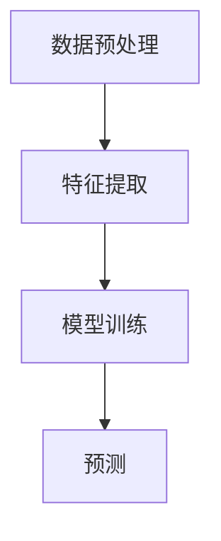
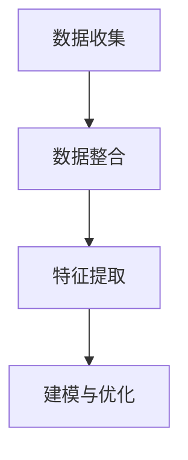

                 

## 引言

### 1.1 书籍背景与目的

在这个数字化的时代，人工智能（AI）技术正以前所未有的速度变革着各行各业。特别是在品牌营销领域，AI的应用为提升消费者忠诚度和满意度提供了新的途径。而香水行业作为传统与现代相结合的领域，如何利用AI技术构建情感连接，提高品牌忠诚度，成为了一个值得探讨的课题。

本书旨在探讨如何通过AI技术构建情感连接，提高创意香水品牌的忠诚度。具体来说，本书将围绕以下几个核心问题展开：

- **AI技术在品牌营销中的应用**：探讨AI技术在品牌营销中的现状和趋势，分析其在提高品牌忠诚度方面的潜力。
- **情感连接的构建方法**：介绍情感连接的概念、重要性以及构建方法，包括数据收集、情感分析和用户画像构建等。
- **AI提示词技巧**：探讨如何利用AI生成和优化提示词，提高品牌忠诚度。
- **案例分析与实战**：通过具体案例展示如何将上述技巧应用到实践中。

通过深入研究和分析，本书希望能为香水行业的品牌营销提供有价值的参考，帮助品牌在激烈的市场竞争中脱颖而出。

### 1.2 读者对象与预期收获

本书主要面向以下读者群体：

- **品牌营销专家**：对品牌营销有深入理解，希望了解如何利用AI技术提高品牌忠诚度的专业人士。
- **香水行业从业者**：在香水行业工作，希望提升品牌营销效果，提高品牌竞争力的从业者。
- **AI技术研究者**：对AI技术在品牌营销中的应用感兴趣，希望探索新技术在实践中的实际效果的研究者。

通过阅读本书，读者可以预期获得以下收获：

- **深入了解AI技术在品牌营销中的应用**：掌握AI技术如何提升品牌忠诚度的原理和实践方法。
- **掌握情感连接的构建技巧**：了解情感连接的概念、重要性及其构建方法，包括数据收集、情感分析和用户画像等。
- **学会AI提示词技巧**：掌握如何利用AI生成和优化提示词，提高品牌忠诚度。
- **获得实战经验**：通过具体案例，了解如何将AI技术应用到品牌营销实践中，提升品牌竞争力。

### 1.3 书籍结构概述

本书共分为五个部分，每个部分都有明确的主题和内容安排：

- **第一部分：AI与品牌营销基础**：介绍AI在品牌营销中的应用，以及情感连接和品牌忠诚度的概念。
- **第二部分：情感连接构建的技巧**：详细探讨如何通过AI技术构建情感连接，包括数据收集、情感分析、用户画像等。
- **第三部分：AI提示词技巧应用**：介绍如何利用AI生成和优化提示词，提高品牌忠诚度。
- **第四部分：案例分析与实战**：通过具体案例展示如何将上述技巧应用到实践中。
- **第五部分：总结与展望**：总结全书内容，提出未来研究方向和可能的应用前景。

通过这五个部分的深入探讨，本书希望能为读者提供全面、系统的AI在品牌营销中的应用指南。

### 第二部分：AI与品牌营销基础

#### 2.1 AI在品牌营销中的应用

随着AI技术的快速发展，其在品牌营销中的应用越来越广泛，成为提升品牌忠诚度和消费者满意度的有力工具。AI通过大数据分析、机器学习、自然语言处理等技术，能够深入挖掘消费者行为和需求，从而实现精准营销和个性化服务。

**现状与趋势**：

- **大数据分析**：AI能够处理和分析海量数据，帮助品牌了解消费者的购买习惯、喜好和需求，从而制定更精准的营销策略。
- **个性化推荐**：基于消费者的行为数据，AI可以推荐个性化的产品和服务，提升消费者的购物体验和满意度。
- **自然语言处理**：AI能够理解和处理自然语言，实现智能客服、社交媒体互动和内容生成等功能，提高品牌的互动性和响应速度。
- **情感分析**：AI能够分析消费者的情感和情绪，了解他们对品牌的真实感受，从而调整营销策略，提升品牌忠诚度。

**在提高品牌忠诚度方面的潜力**：

- **增强用户体验**：通过个性化推荐和智能客服，AI能够提供更符合消费者需求和喜好的产品和服务，提高用户体验和满意度。
- **提升营销效果**：基于大数据分析的精准营销策略，可以降低营销成本，提高营销ROI（投资回报率）。
- **构建情感连接**：通过情感分析和自然语言处理，AI能够深入挖掘消费者的情感需求，建立情感连接，提升品牌忠诚度。
- **数据驱动决策**：AI能够提供丰富的数据分析和预测，帮助品牌制定更科学的营销策略，降低风险。

#### 2.2 情感连接与品牌忠诚度的关系

情感连接是指消费者与品牌之间建立的情感纽带，这种纽带可以通过共同的价值观、情感共鸣、个性化体验等方式形成。情感连接在品牌忠诚度建设中扮演着至关重要的角色。

**情感连接的重要性**：

- **增强品牌认知**：情感连接能够加深消费者对品牌的认知和记忆，提高品牌的知名度和美誉度。
- **提升消费者满意度**：通过个性化的产品和服务，情感连接能够提高消费者的满意度和忠诚度。
- **降低流失率**：情感连接能够降低消费者转向竞争对手的可能性，减少品牌流失率。
- **增加口碑传播**：情感连接使消费者更愿意分享自己的品牌体验，从而提升品牌的口碑和影响力。

**如何建立情感连接**：

- **个性化体验**：通过分析消费者的行为数据和偏好，提供个性化的产品和服务，满足消费者的独特需求。
- **情感共鸣**：通过品牌故事、品牌形象和营销活动，与消费者建立情感共鸣，传递品牌价值观。
- **互动沟通**：通过社交媒体、在线客服等方式，与消费者保持互动，了解他们的反馈和需求。
- **持续投入**：在情感连接的建立过程中，品牌需要持续投入资源，维护和深化与消费者的关系。

#### 2.3 情感连接与品牌忠诚度的关系

情感连接与品牌忠诚度之间存在密切的关系。情感连接可以视为品牌忠诚度的一个关键影响因素。当消费者与品牌之间建立深厚的情感连接时，他们更有可能表现出品牌忠诚度，如重复购买、积极推荐等。

**情感连接如何提高品牌忠诚度**：

- **增强消费者归属感**：情感连接使消费者感受到自己是品牌的一部分，从而提高他们的归属感和忠诚度。
- **提升品牌形象**：情感连接有助于建立积极的品牌形象，增强消费者对品牌的信任和好感。
- **降低价格敏感性**：情感连接使消费者对价格更加不敏感，即使品牌价格上涨，他们也更愿意继续支持品牌。
- **促进口碑传播**：情感连接使消费者更愿意分享自己的品牌体验，从而提升品牌的口碑和影响力。

**情感连接与品牌忠诚度的关系模型**：

**模型解析**：

1. **情感连接**：消费者与品牌之间建立的情感纽带，包括共同的价值观、情感共鸣、个性化体验等。
2. **品牌认知**：消费者对品牌的认知和理解，包括品牌形象、产品特点、服务体验等。
3. **品牌忠诚度**：消费者对品牌的长期忠诚和信任，包括重复购买、积极推荐、品牌偏好等。
4. **关系强度**：情感连接的强度，反映了消费者与品牌之间关系的紧密程度。

通过上述模型，我们可以看出情感连接在品牌忠诚度建设中的关键作用。品牌需要通过多种方式建立和维护情感连接，从而提高品牌忠诚度。

### 第三部分：情感连接构建的技巧

#### 3.1 数据收集与处理

在构建情感连接的过程中，数据收集与处理是至关重要的一步。只有充分收集和处理用户数据，才能为情感连接的建立提供有力支持。

**数据收集的方法**：

1. **问卷调查**：通过在线或线下问卷，直接向消费者收集他们对品牌、产品、服务的看法和反馈。
2. **社交媒体监测**：利用社交媒体分析工具，监控消费者在社交媒体平台上的品牌提及和互动。
3. **购买行为分析**：通过销售数据和消费者购买记录，分析消费者的购买习惯和偏好。
4. **用户互动记录**：记录消费者与品牌之间的互动历史，包括客服咨询、投诉反馈等。

**数据收集的技巧**：

1. **明确目标**：在收集数据前，需要明确收集数据的目的是什么，确保收集的数据能够支持情感连接的构建。
2. **保证数据质量**：确保收集的数据真实、准确、完整，避免数据误差和失真。
3. **多样化数据源**：从多个渠道收集数据，以获得更全面、更客观的信息。

**数据处理的重要性和方法**：

**重要性**：

- **数据清洗**：去除重复、错误、缺失的数据，保证数据的质量。
- **数据整合**：将不同来源的数据进行整合，形成统一的用户数据视图。
- **数据分析**：利用数据分析技术，挖掘数据中的有用信息，为情感连接的构建提供依据。

**方法**：

1. **数据清洗**：使用Python、R等编程语言编写清洗脚本，自动化处理数据中的错误和缺失。
2. **数据整合**：使用数据仓库和数据湖等技术，将不同来源的数据进行整合。
3. **数据分析**：利用大数据分析技术，如Hadoop、Spark等，对数据进行深度分析，挖掘用户行为和偏好。

**案例分析**：

以某创意香水品牌为例，该品牌通过问卷调查和社交媒体监测，收集了大量用户数据。首先，对数据进行清洗，去除重复和错误数据，然后整合不同来源的数据，形成统一的用户数据视图。接着，利用数据分析技术，挖掘用户的行为和偏好，如购买频率、购买品类、社交媒体互动等。

通过数据收集与处理，品牌能够更深入地了解消费者，为情感连接的构建提供有力支持。

#### 3.2 情感分析

情感分析是构建情感连接的重要技术之一。通过情感分析，品牌可以了解消费者对品牌、产品、服务的情感态度，从而制定更有针对性的营销策略。

**定义与发展历程**：

情感分析是指利用自然语言处理技术，对文本数据中的情感信息进行提取和分析的过程。其目的是识别文本中的情感倾向、情感强度和情感类别。

- **早期发展**：20世纪90年代，随着互联网的兴起，情感分析开始受到关注。早期的研究主要集中在情感分类和情感极性分析。
- **中期发展**：21世纪初，随着机器学习技术的进步，情感分析领域开始采用更加复杂的方法，如文本分类、情感强度分析等。
- **现阶段**：当前，情感分析技术已逐渐成熟，应用于各个领域，如社交媒体分析、客户服务、市场研究等。

**技术原理**：

情感分析的基本流程包括数据预处理、特征提取、模型训练和预测。

1. **数据预处理**：包括文本清洗、分词、去停用词等步骤，将原始文本数据转化为适合模型训练的数据格式。
2. **特征提取**：通过词袋模型、TF-IDF、Word2Vec等算法，将文本转化为数值特征，用于模型训练。
3. **模型训练**：利用机器学习算法，如朴素贝叶斯、支持向量机、深度学习等，对特征数据进行训练，构建情感分析模型。
4. **预测**：将新文本数据输入模型，预测其情感倾向和情感强度。

**情感分析算法**：

1. **朴素贝叶斯**：基于贝叶斯定理和特征独立性假设，用于情感分类和情感极性分析。
2. **支持向量机**：基于最大间隔分类器，用于情感分类和情感强度分析。
3. **深度学习**：如卷积神经网络（CNN）和循环神经网络（RNN），用于情感分类、情感强度分析和情感生成。

**应用领域**：

1. **社交媒体分析**：通过分析社交媒体上的用户评论和反馈，了解消费者对品牌的情感态度，优化营销策略。
2. **客户服务**：通过情感分析，识别客户投诉和反馈中的情感信息，提供更优质的客户服务。
3. **市场研究**：通过情感分析，了解消费者对产品、服务的情感需求，为产品研发和营销策略提供依据。

**案例分析**：

以某创意香水品牌为例，该品牌利用情感分析技术，对社交媒体上的用户评论进行情感分析。首先，对评论进行数据预处理，然后使用朴素贝叶斯和支持向量机算法进行情感分类和情感强度分析。通过分析结果，品牌能够了解消费者对其产品和服务的主要情感倾向，从而优化营销策略。

**情感分析流程图**：

通过情感分析，品牌能够更深入地了解消费者情感，为情感连接的构建提供有力支持。

#### 3.3 用户画像构建

用户画像是指通过对用户数据的收集、处理和分析，构建出用户的全方位、多维度的形象。用户画像是构建情感连接的重要基础，可以帮助品牌更精准地了解消费者，制定个性化营销策略。

**定义与作用**：

用户画像是指通过对用户数据的分析和整合，构建出用户的基本信息、行为特征、兴趣偏好、消费习惯等特征，从而形成用户的整体形象。

- **基本信息**：包括用户的性别、年龄、职业、地域等基本信息。
- **行为特征**：包括用户的浏览行为、购买行为、互动行为等。
- **兴趣偏好**：包括用户的兴趣爱好、偏好品类、偏好品牌等。
- **消费习惯**：包括用户的消费频率、消费金额、购买渠道等。

**构建方法**：

1. **数据收集**：通过问卷调查、用户行为数据、社交媒体数据等渠道，收集用户的基本信息和行为数据。
2. **数据整合**：将不同来源的数据进行整合，形成统一的用户数据视图。
3. **特征提取**：通过数据分析和挖掘，提取用户的行为特征、兴趣偏好和消费习惯等特征。
4. **建模与优化**：利用机器学习算法，如聚类、分类、关联规则等，对用户特征进行建模和优化。

**用户画像在情感连接中的作用**：

1. **个性化推荐**：通过用户画像，品牌可以了解用户的兴趣和偏好，提供个性化的产品和服务，增强用户体验。
2. **情感分析**：通过用户画像，品牌可以更精准地分析用户的情感需求，制定更有针对性的营销策略。
3. **精准营销**：通过用户画像，品牌可以识别潜在的高价值客户，进行精准营销，提高营销ROI。

**案例分析**：

以某创意香水品牌为例，该品牌通过用户画像技术，对用户进行了全方位的分析。首先，收集了用户的基本信息、行为数据和社交媒体数据，然后通过数据整合和特征提取，构建了用户的用户画像。通过用户画像，品牌能够了解用户的兴趣和偏好，为其提供个性化的产品推荐和营销活动。

**用户画像构建流程图**：

通过用户画像构建，品牌能够更深入地了解消费者，为情感连接的构建提供有力支持。

### 第四部分：AI提示词技巧应用

#### 4.1 提示词的定义与作用

在品牌营销中，提示词（也称为关键词或广告语）是品牌传递信息、吸引消费者注意力的重要工具。通过设计具有吸引力和说服力的提示词，品牌可以有效地提升品牌知名度、增强消费者记忆，从而提高品牌忠诚度。

**定义**：

提示词是指在广告、宣传材料、社交媒体互动等场景中，用以吸引消费者注意力、传递品牌信息的简短、有针对性的词语或短语。

**作用**：

1. **吸引消费者注意力**：好的提示词能够迅速引起消费者的兴趣，使其关注品牌信息。
2. **传递品牌信息**：提示词可以简洁明了地传达品牌的核心价值和独特卖点，帮助消费者了解品牌。
3. **增强品牌记忆**：通过重复使用和巧妙设计，提示词可以加深消费者对品牌的记忆，提高品牌认知度。
4. **提高转化率**：有效的提示词可以引导消费者采取行动，如购买产品、关注品牌等，从而提高转化率。

**设计原则**：

1. **简洁明了**：提示词应尽量简洁，避免冗长复杂的表述，使消费者容易理解和记忆。
2. **具有吸引力**：提示词应具有吸引力，能够迅速引起消费者的兴趣和好奇心。
3. **传达品牌价值**：提示词应传达品牌的核心价值和独特卖点，使消费者对品牌产生认同感。
4. **创新独特**：提示词应具有一定的创新性，避免与竞争对手雷同，使品牌在市场中脱颖而出。

#### 4.2 AI提示词生成方法

随着AI技术的发展，AI提示词生成方法逐渐成为品牌营销中的一种新趋势。通过AI技术，品牌可以自动生成具有吸引力和说服力的提示词，提高品牌忠诚度。

**方法一：基于文本生成模型**

文本生成模型是一种能够自动生成自然语言文本的深度学习模型，如生成对抗网络（GAN）、循环神经网络（RNN）等。通过训练大量的文本数据，文本生成模型可以学会生成高质量的提示词。

- **优点**：生成文本流畅自然，具有创意性。
- **缺点**：需要大量的训练数据和计算资源，且生成的文本可能存在偏差。

**方法二：基于关键词抽取**

关键词抽取是一种从文本中提取关键信息的自然语言处理技术。通过分析文本中的关键词，品牌可以生成具有针对性的提示词。

- **优点**：生成提示词速度快，适用于实时营销。
- **缺点**：生成的提示词可能缺乏创意性和个性化。

**方法三：基于情感分析**

情感分析是一种能够分析文本情感倾向的技术。通过分析消费者的情感需求，品牌可以生成更具情感共鸣的提示词。

- **优点**：生成的提示词更符合消费者情感需求，提高营销效果。
- **缺点**：需要大量的情感分析数据，且生成的提示词可能过于情感化。

**方法四：基于混合模型**

混合模型结合了文本生成模型和情感分析技术的优点，通过多模态数据输入，生成更具吸引力和说服力的提示词。

- **优点**：生成的提示词具有更高的创意性和个性化。
- **缺点**：需要更多的数据和计算资源。

#### 4.3 提示词优化策略与技巧

尽管AI提示词生成方法能够自动生成高质量的提示词，但为了提高品牌忠诚度，仍需要对生成的提示词进行优化。以下是一些优化策略与技巧：

1. **关键词优化**：确保提示词中包含品牌名称和相关关键词，提高搜索排名和品牌曝光度。
2. **情感共鸣**：通过情感分析，了解消费者情感需求，调整提示词的情感色彩，使其更具共鸣力。
3. **简洁明了**：保持提示词的简洁性，避免冗长复杂的表述，使消费者容易理解和记忆。
4. **创意独特**：在设计提示词时，注重创新性，避免与竞争对手雷同，使品牌在市场中脱颖而出。
5. **情境适配**：根据不同的营销场景，调整提示词的表达方式和语气，使其更符合特定情境。
6. **测试与优化**：通过A/B测试，比较不同提示词的营销效果，不断优化和调整，以提高品牌忠诚度。

**案例分析**：

以某创意香水品牌为例，该品牌在生成提示词时，采用了基于文本生成模型和情感分析的混合方法。首先，通过文本生成模型生成一批初

