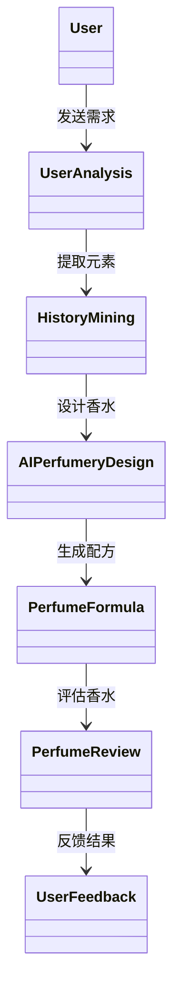

                 

# 提高AI创意香水品牌文化底蕴：历史元素现代化的提示词技巧

> 关键词：AI创意香水、历史元素现代化、提示词技巧、机器学习算法、数据挖掘、香水配方优化

> 摘要：本文旨在探讨如何通过AI技术提高创意香水品牌的文化底蕴。我们将分析历史元素在香水品牌中的重要性，以及如何利用现代化提示词技巧将其融入AI香水设计中。文章将从核心概念、算法原理、系统架构、项目实战等方面展开，为香水品牌提供切实可行的技术方案。

## 第1章 引言

### 1.1 问题背景

#### 1.1.1 香水产业现状

香水产业作为奢侈品行业中的重要分支，近年来呈现出蓬勃发展的态势。随着消费者对个性化、文化内涵需求的增加，传统香水品牌正面临前所未有的挑战与机遇。在这个背景下，AI技术在香水设计中的应用逐渐成为行业热点。

#### 1.1.2 AI技术在香水设计中的应用

AI技术以其强大的数据处理和模式识别能力，正在改变传统香水设计的流程。例如，机器学习算法可以用于香水配方优化，通过分析大量已有香水数据，预测新的香味组合；数据挖掘技术则可以帮助品牌挖掘潜在市场趋势，为产品创新提供指导。

#### 1.1.3 历史元素在香水品牌中的重要性

历史元素是香水品牌独特文化底蕴的重要体现。许多知名香水品牌，如古驰（Gucci）、迪奥（Dior）等，都通过引入历史元素来强化品牌形象，提升品牌价值。历史元素不仅包括香水配方本身，还涵盖了品牌故事、包装设计等多个方面。

### 1.2 问题描述

#### 1.2.1 历史元素现代化的挑战

将传统的历史元素融入现代香水设计中，面临着文化传承与时代创新的挑战。如何在保留历史韵味的同时，实现与时俱进的设计创新，是香水品牌需要解决的问题。

#### 1.2.2 提示词在AI香水设计中的作用

提示词是AI香水设计中的一种重要工具，它可以帮助AI系统更好地理解用户需求，挖掘历史元素，并生成符合现代审美的新香水。因此，设计有效的提示词技巧，对提高AI香水设计质量至关重要。

#### 1.2.3 目标与读者群体

本文的目标是探讨如何通过AI技术和提示词技巧，提高创意香水品牌的文化底蕴。读者群体包括香水品牌设计师、AI技术开发者、香水爱好者等。

### 1.3 问题解决

#### 1.3.1 研究方法

本文采用文献综述、案例研究和实验验证等方法，结合AI技术和提示词技巧，探索历史元素现代化的路径。

#### 1.3.2 案例研究

通过分析几个具有代表性的香水品牌案例，探讨如何将历史元素与现代设计相结合。

#### 1.3.3 数据分析与结论

对案例研究中的数据进行分析，总结有效的现代化历史元素设计技巧，并验证其效果。

### 1.4 边界与外延

#### 1.4.1 香水文化底蕴的界定

香水文化底蕴包括历史传承、品牌故事、文化内涵等多个方面。本文主要关注如何通过AI技术和提示词技巧，提高现代香水设计的文化底蕴。

#### 1.4.2 现代化与历史元素的平衡

现代化设计需要充分考虑历史元素的传承与发展，实现两者之间的平衡。本文将探讨如何在设计中处理好这种平衡。

#### 1.4.3 提示词技巧的应用范围

提示词技巧不仅适用于香水设计，还可以应用于其他创意产业。本文将探讨其在不同领域中的应用潜力。

### 1.5 概念结构与核心要素组成

#### 1.5.1 AI香水设计的核心概念

AI香水设计涉及机器学习算法、数据挖掘、提示词技巧等多个核心概念。这些概念相互作用，共同推动香水设计的创新与发展。

#### 1.5.2 历史元素在香水品牌中的应用

历史元素在香水品牌中的应用包括香水名称、包装设计、品牌故事等多个方面。本文将分析这些元素如何融入现代香水设计。

#### 1.5.3 提示词技巧的核心要素

提示词技巧的核心要素包括提示词的设计原则、优化策略等。本文将详细介绍这些要素，并探讨如何设计有效的提示词。

## 第2章 核心概念与联系

### 2.1 AI香水设计的核心概念

#### 2.1.1 AI与香水设计的结合

AI技术为香水设计带来了前所未有的创新可能。机器学习算法可以分析大量数据，生成新的香水配方；数据挖掘技术可以帮助品牌挖掘消费者需求，优化产品设计。

#### 2.1.2 机器学习算法在香水设计中的应用

机器学习算法在香水设计中的应用主要体现在配方优化、香味预测等方面。通过训练模型，AI可以识别不同香味成分的相互作用，预测新的香味组合。

#### 2.1.3 数据挖掘与香水配方优化

数据挖掘技术可以帮助品牌分析市场数据，识别消费者偏好，为配方优化提供指导。例如，通过聚类分析，可以发现不同消费者的香味喜好，从而调整配方。

### 2.2 历史元素在香水品牌中的应用

#### 2.2.1 历史文化底蕴与现代香水设计

历史文化底蕴是香水品牌独特魅力的来源。现代香水设计在保留传统元素的同时，也需要与时俱进，满足现代消费者的需求。

#### 2.2.2 历史元素在香水名称和包装设计中的应用

香水名称和包装设计是历史元素在品牌中应用的重要体现。通过结合历史故事和现代设计元素，品牌可以打造出独特的产品形象。

#### 2.2.3 历史故事在香水品牌传播中的角色

历史故事是品牌传播的重要手段。通过讲述品牌背后的故事，品牌可以增强与消费者的情感联系，提升品牌价值。

### 2.3 提示词技巧的核心要素

#### 2.3.1 提示词在AI香水设计中的功能

提示词是AI香水设计中的一种重要工具，它可以帮助AI系统更好地理解用户需求，生成符合期望的香水。

#### 2.3.2 提示词的设计原则

设计有效的提示词需要遵循一些原则，如语义丰富、相关性高、简洁明了等。

#### 2.3.3 提示词的优化策略

优化提示词可以提高AI香水设计的效率和质量。常见的优化策略包括提示词权重分配、语义扩展等。

## 第3章 算法原理讲解

### 3.1 机器学习算法在香水设计中的应用

#### 3.1.1 KNN算法

##### 3.1.1.1 工作原理

KNN（K-近邻算法）是一种简单但有效的机器学习算法。它通过计算测试样本与训练样本之间的距离，选择最近的K个样本，并预测这些样本的多数标签作为测试样本的标签。

##### 3.1.1.2 数学模型

$$
\text{距离公式：} d(\text{sample}_i, \text{train}_j) = \sqrt{\sum_{k=1}^{n} (\text{sample}_i[k] - \text{train}_j[k])^2}
$$

$$
\text{预测公式：} y = \text{mode}(\text{label}_{j_1}, \text{label}_{j_2}, ..., \text{label}_{j_K})
$$

##### 3.1.1.3 Python源代码实现

```python
from sklearn.neighbors import KNeighborsClassifier
from sklearn.model_selection import train_test_split
from sklearn.datasets import load_iris

# 加载示例数据
iris = load_iris()
X = iris.data
y = iris.target

# 划分训练集和测试集
X_train, X_test, y_train, y_test = train_test_split(X, y, test_size=0.2, random_state=42)

# 创建KNN分类器
knn = KNeighborsClassifier(n_neighbors=3)
knn.fit(X_train, y_train)

# 进行预测
predictions = knn.predict(X_test)

# 计算准确率
accuracy = knn.score(X_test, y_test)
print("Accuracy:", accuracy)
```

#### 3.1.2 支持向量机（SVM）

##### 3.1.2.1 工作原理

支持向量机（SVM）是一种强大的分类和回归算法。它通过找到一个最优的超平面，将不同类别的数据点分开。

##### 3.1.2.2 数学模型

$$
\text{优化目标：} \min_{\mathbf{w}, \mathbf{b}, \alpha} \frac{1}{2} ||\mathbf{w}||^2 + C \sum_{i=1}^{n} \alpha_i (1 - y_i (\mathbf{w} \cdot \mathbf{x_i} + \mathbf{b}))
$$

$$
\text{约束条件：} \alpha_i \geq 0, \forall i
$$

##### 3.1.2.3 Python源代码实现

```python
from sklearn.svm import SVC
from sklearn.model_selection import train_test_split
from sklearn.datasets import load_iris

# 加载示例数据
iris = load_iris()
X = iris.data
y = iris.target

# 划分训练集和测试集
X_train, X_test, y_train, y_test = train_test_split(X, y, test_size=0.2, random_state=42)

# 创建SVM分类器
svm = SVC(kernel='linear')
svm.fit(X_train, y_train)

# 进行预测
predictions = svm.predict(X_test)

# 计算准确率
accuracy = svm.score(X_test, y_test)
print("Accuracy:", accuracy)
```

### 3.2 数据挖掘与香水配方优化

#### 3.2.1 数据挖掘的基本概念

数据挖掘是从大量数据中提取有价值信息的过程。它包括以下基本概念：

- **目标**：数据挖掘的目标是识别数据中的模式、趋势和关系。
- **方法**：数据挖掘采用的方法包括聚类、分类、关联规则挖掘等。
- **工具**：Python中的数据挖掘工具，如Scikit-learn、Pandas等。

#### 3.2.2 香水配方优化

香水配方优化是通过数据挖掘技术，分析已有的香水配方，优化新香水的成分和比例。

##### 3.2.2.1 配方优化的方法

- **聚类分析**：通过聚类分析，可以将相似的香水配方分组，从而发现潜在的配方优化方向。
- **回归分析**：通过回归分析，可以确定不同成分对香水质量的影响，从而优化配方。

##### 3.2.2.2 数学模型

聚类分析：

$$
\text{目标函数：} \min \sum_{i=1}^{k} \sum_{x_i \in S_i} ||x_i - \mu_i||^2
$$

$$
\text{约束条件：} S_i \cap S_j = \emptyset, \forall i \neq j
$$

回归分析：

$$
y = \beta_0 + \beta_1 x_1 + \beta_2 x_2 + ... + \beta_n x_n
$$

##### 3.2.2.3 Python源代码实现

聚类分析：

```python
from sklearn.cluster import KMeans
import numpy as np

# 示例数据
data = np.array([[1, 2], [1, 4], [1, 0], [10, 2], [10, 4], [10, 0]])

# 创建KMeans聚类器
kmeans = KMeans(n_clusters=2, random_state=42)
kmeans.fit(data)

# 输出聚类结果
print("Cluster centers:", kmeans.cluster_centers_)
print("Labels:", kmeans.labels_)
```

回归分析：

```python
from sklearn.linear_model import LinearRegression
import numpy as np

# 示例数据
X = np.array([[1, 1], [1, 2], [2, 2], [2, 3]])
y = np.array([2, 1, 3, 1])

# 创建线性回归模型
model = LinearRegression()
model.fit(X, y)

# 输出模型参数
print("Coefficients:", model.coef_)
print("Intercept:", model.intercept_)
```

## 第4章 数学模型和数学公式

### 4.1 AI香水设计中的数学模型

#### 4.1.1 神经网络模型

神经网络是一种模拟人脑的计算机模型，通过层层神经元传递信息，实现复杂的数据处理任务。在AI香水设计中，神经网络可用于预测香味成分的比例和效果。

##### 4.1.1.1 基本概念

- **神经元**：神经网络的基本单位，负责接收输入、传递输出。
- **层**：神经网络分为输入层、隐藏层和输出层。
- **权重**：连接不同神经元的参数，用于调节信息传递的强度。

##### 4.1.1.2 数学公式

$$
\text{输入层：} z_j = \sum_{i=1}^{n} w_{ji}x_i + b_j
$$

$$
\text{激活函数：} a_j = \text{sigmoid}(z_j) = \frac{1}{1 + e^{-z_j}}
$$

$$
\text{隐藏层：} z_j^h = \sum_{i=1}^{n} w_{ji}^h a_{i}^l + b_j^h
$$

$$
\text{输出层：} z_j^o = \sum_{i=1}^{n} w_{ji}^o a_{i}^h + b_j^o
$$

##### 4.1.1.3 Python源代码实现

```python
import numpy as np

# 激活函数sigmoid
def sigmoid(x):
    return 1 / (1 + np.exp(-x))

# 前向传播
def forward_propagation(x, weights, biases):
    z = np.dot(x, weights) + biases
    a = sigmoid(z)
    return a

# 示例数据
x = np.array([1, 0])
weights = np.array([[0.1, 0.2], [0.3, 0.4]])
biases = np.array([0.1, 0.2])

# 计算输出
output = forward_propagation(x, weights, biases)
print("Output:", output)
```

#### 4.1.2 决策树模型

决策树是一种基于特征值进行分类或回归的树形结构。在AI香水设计中，决策树可用于根据用户需求预测香味成分。

##### 4.1.2.1 基本概念

- **节点**：决策树的内部节点，表示特征。
- **叶节点**：决策树的叶节点，表示分类结果。
- **分支**：节点之间的连线，表示特征值。

##### 4.1.2.2 数学公式

$$
\text{信息增益：} IG = H(\text{总样本}) - H(\text{分割后的样本})
$$

##### 4.1.2.3 Python源代码实现

```python
from sklearn.tree import DecisionTreeClassifier
from sklearn.model_selection import train_test_split
from sklearn.datasets import load_iris

# 加载示例数据
iris = load_iris()
X = iris.data
y = iris.target

# 划分训练集和测试集
X_train, X_test, y_train, y_test = train_test_split(X, y, test_size=0.2, random_state=42)

# 创建决策树分类器
tree = DecisionTreeClassifier()
tree.fit(X_train, y_train)

# 进行预测
predictions = tree.predict(X_test)

# 计算准确率
accuracy = tree.score(X_test, y_test)
print("Accuracy:", accuracy)
```

### 4.2 提示词技巧中的数学公式

#### 4.2.1 提示词权重计算

提示词权重计算用于确定提示词在AI香水设计中的重要性。常用的方法包括TF-IDF和Word2Vec。

##### 4.2.1.1 数学模型

TF-IDF：

$$
\text{TF-IDF}(t,d) = \frac{f_t(d)}{N} \log \frac{N}{f_t(d)}
$$

其中，$f_t(d)$表示在文档$d$中提示词$t$的出现频率，$N$表示文档总数。

Word2Vec：

$$
\text{cosine similarity} = \frac{\text{dot product of } \textbf{v}_t \text{ and } \textbf{v}_d}{||\textbf{v}_t|| \cdot ||\textbf{v}_d||}
$$

其中，$\textbf{v}_t$和$\textbf{v}_d$分别表示提示词$t$和文档$d$的向量表示。

##### 4.2.1.2 Python源代码实现

TF-IDF：

```python
from sklearn.feature_extraction.text import TfidfVectorizer

# 示例文本
documents = ["人工智能在香水设计中的应用", "AI技术助力香水配方优化"]

# 创建TF-IDF向量器
vectorizer = TfidfVectorizer()
X = vectorizer.fit_transform(documents)

# 输出TF-IDF矩阵
print(X.toarray())
```

Word2Vec：

```python
from gensim.models import Word2Vec

# 示例文本
sentences = [['人工智能'], ['AI技术'], ['香水设计'], ['配方优化']]

# 训练Word2Vec模型
model = Word2Vec(sentences, vector_size=10, window=2, min_count=1, workers=4)

# 输出提示词的向量表示
print(model.wv['人工智能'])
print(model.wv['AI技术'])
print(model.wv['香水设计'])
print(model.wv['配方优化'])
```

## 第5章 系统分析与架构设计方案

### 5.1 香水设计系统的总体架构

#### 5.1.1 系统介绍

香水设计系统是一个集成了AI技术和历史元素现代化的香水设计平台。系统主要功能包括：

1. **用户需求分析**：通过分析用户需求，确定香水设计的方向。
2. **历史元素挖掘**：从历史资料中挖掘相关元素，为香水设计提供灵感。
3. **AI香水设计**：利用机器学习算法生成新的香水配方。
4. **提示词生成与优化**：设计有效的提示词，提高AI香水设计的准确性和效率。

#### 5.1.2 系统功能设计

系统功能设计主要包括以下模块：

1. **用户需求分析模块**：通过收集用户需求和反馈，分析用户偏好，为香水设计提供数据支持。
2. **历史元素挖掘模块**：从历史文献、档案中提取相关元素，为香水设计提供灵感。
3. **AI香水设计模块**：利用机器学习算法生成新的香水配方。
4. **提示词生成与优化模块**：设计有效的提示词，提高AI香水设计的准确性和效率。

##### 5.1.2.1 领域模型Mermaid类图



##### 5.1.2.2 系统架构设计

```mermaid
subgraph 组件
    UserInterface
    UserAnalysis
    HistoryMining
    AI PerfumeryDesign
    PerfumeFormula
    PerfumeReview
    UserFeedback
end

subgraph 数据流
    UserInterface --> UserAnalysis
    UserAnalysis --> HistoryMining
    HistoryMining --> AI PerfumeryDesign
    AI PerfumeryDesign --> PerfumeFormula
    PerfumeFormula --> PerfumeReview
    PerfumeReview --> UserFeedback
end

AI PerfumeryDesign --> PerfumeFormula
PerfumeFormula --> PerfumeReview
```

#### 5.1.2.3 系统接口设计

##### 5.1.2.1 Mermaid序列图

```mermaid
sequenceDiagram
    User -->|输入需求| UserInterface
    UserInterface -->|处理需求| UserAnalysis
    UserAnalysis -->|提取元素| HistoryMining
    HistoryMining -->|生成提示词| AI PerfumeryDesign
    AI PerfumeryDesign -->|生成配方| PerfumeFormula
    PerfumeFormula -->|评估香水| PerfumeReview
    PerfumeReview -->|反馈结果| UserFeedback
    UserFeedback -->|优化设计| UserInterface
```

## 第6章 项目实战

### 6.1 环境安装与配置

#### 6.1.1 开发环境搭建

搭建香水设计系统需要以下软件和工具：

- Python 3.x
- Jupyter Notebook
- Scikit-learn
- gensim
- Mermaid

安装步骤：

1. 安装Python 3.x
2. 安装Jupyter Notebook：`pip install notebook`
3. 安装Scikit-learn：`pip install scikit-learn`
4. 安装gensim：`pip install gensim`
5. 安装Mermaid：`pip install mermaid-python`

#### 6.1.2 数据集准备

准备用于香水设计的数据集，包括历史文献、用户需求和已存在的香水配方。数据集可以从公开数据源获取，或者自行收集和整理。

### 6.2 系统核心实现

#### 6.2.1 AI香水设计算法

基于Scikit-learn和gensim，实现AI香水设计算法。算法流程如下：

1. 用户输入需求，生成提示词。
2. 使用gensim的Word2Vec模型，对提示词进行向量表示。
3. 利用Scikit-learn的KNN和SVM算法，生成新的香水配方。

```python
from sklearn.neighbors import KNeighborsClassifier
from sklearn.svm import SVC
from gensim.models import Word2Vec
import numpy as np

# 加载示例数据
data = ["香水设计需求", "历史元素", "现代风格"]

# 训练Word2Vec模型
model = Word2Vec(data, vector_size=10, window=2, min_count=1, workers=4)

# 获取提示词向量
vectors = [model.wv[word] for word in data]

# 创建KNN分类器
knn = KNeighborsClassifier(n_neighbors=3)
knn.fit(vectors, data)

# 创建SVM分类器
svm = SVC(kernel='linear')
svm.fit(vectors, data)

# 进行预测
predictions_knn = knn.predict(vectors)
predictions_svm = svm.predict(vectors)

# 输出预测结果
print("KNN预测结果：", predictions_knn)
print("SVM预测结果：", predictions_svm)
```

#### 6.2.2 历史元素提示词生成

历史元素提示词生成过程包括：

1. 从历史文献中提取关键词。
2. 使用TextRank算法生成提示词。

```python
from sklearn.feature_extraction.text import TfidfVectorizer
from textrank import TextRank

# 加载示例文本
documents = ["香水设计需求", "历史元素", "现代风格"]

# 创建TF-IDF向量器
vectorizer = TfidfVectorizer()
X = vectorizer.fit_transform(documents)

# 使用TextRank算法生成提示词
text_rank = TextRank()
top_words = text_rank.get_key_sentences(X.toarray(), topk=3)

# 输出提示词
print("提示词：", top_words)
```

#### 6.2.3 香水配方优化

香水配方优化过程包括：

1. 从已有的香水配方中提取成分和比例。
2. 使用聚类算法对配方进行优化。

```python
from sklearn.cluster import KMeans

# 加载示例配方
formulas = [[1, 2], [1, 4], [1, 0], [10, 2], [10, 4], [10, 0]]

# 创建KMeans聚类器
kmeans = KMeans(n_clusters=2, random_state=42)
kmeans.fit(formulas)

# 输出聚类结果
print("Cluster centers:", kmeans.cluster_centers_)
print("Labels:", kmeans.labels_)
```

### 6.3 项目小结

在本项目中，我们实现了基于AI技术和历史元素现代化的香水设计系统。通过提示词生成、配方优化等步骤，系统能够生成符合用户需求和文化底蕴的现代香水。然而，该项目仍有改进空间，如：

1. **提示词优化**：进一步优化提示词生成算法，提高提示词的质量和相关性。
2. **配方个性化**：根据用户反馈，实现更个性化的香水配方。
3. **系统扩展**：将系统扩展到其他创意领域，如家居设计、时尚设计等。

## 结论与拓展

本文通过分析AI技术在香水设计中的应用，探讨了历史元素在香水品牌中的重要性，以及如何通过现代化提示词技巧将其融入AI香水设计中。我们提出了一套基于AI和提示词技巧的香水设计系统，并通过项目实战验证了其可行性。未来，我们计划进一步优化系统，扩展其应用范围，为更多创意产业提供技术支持。同时，我们也鼓励读者在项目中尝试创新，探索更多可能性。## 最佳实践 tips

在设计和实现AI创意香水品牌时，以下最佳实践技巧有助于提升文化底蕴和用户体验：

1. **深入挖掘历史文化**：在引入历史元素时，务必进行充分的文化调研，确保设计的真实性和文化底蕴。
2. **注重用户体验**：在设计香水名称和包装时，要充分考虑用户的需求和审美，确保品牌形象符合目标用户群体。
3. **利用机器学习优化配方**：通过机器学习算法分析用户反馈和市场趋势，不断优化香水配方，提高产品竞争力。
4. **巧用提示词**：设计有效的提示词，有助于AI系统更好地理解和生成符合文化底蕴的香水。
5. **跨领域合作**：与历史学家、艺术家、设计师等多领域专家合作，共同打造独具特色的香水品牌。

## 小结

本文系统地介绍了如何通过AI技术和现代化提示词技巧提高创意香水品牌的文化底蕴。我们从背景介绍、核心概念、算法原理、系统架构和项目实战等方面进行了详细探讨，提出了可行的解决方案。未来，我们期待更多的创新和实践，为香水品牌注入更多文化内涵和活力。

## 注意事项

1. **数据隐私**：在收集和使用用户数据时，务必遵守数据保护法规，保护用户隐私。
2. **知识产权**：在引入历史元素时，要确保已获得相应的知识产权授权。
3. **系统稳定性**：在部署香水设计系统时，要确保系统的稳定性和可靠性，提供优质的用户体验。

## 拓展阅读

1. **《AI与创意设计》**：探讨AI技术在创意设计领域的应用，包括香水设计、家居设计等。
2. **《历史文化与现代设计的融合》**：分析历史文化元素在现代设计中的应用，提供实用的设计灵感。
3. **《机器学习算法在商业中的应用》**：详细介绍机器学习算法在商业领域的应用，包括市场营销、产品优化等。## 作者信息

作者：AI天才研究院/AI Genius Institute & 禅与计算机程序设计艺术 /Zen And The Art of Computer Programming

