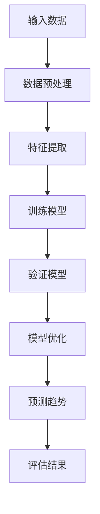
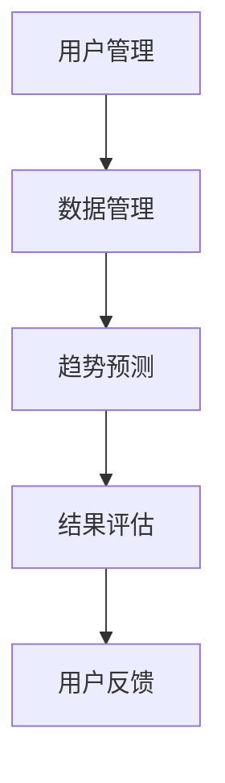
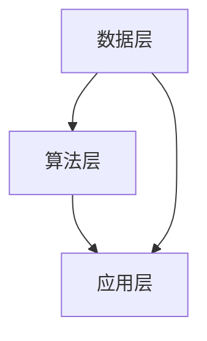

                 

### 文章标题

**提高AI创意香水趋势预测准确性：社会心理学分析的提示词技巧**

在当今快节奏和高度数字化的世界中，香水的市场需求和消费者偏好呈现出不断变化和复杂化的趋势。为了在这个充满竞争的市场中脱颖而出，香水品牌和制造商需要准确地预测市场趋势，以便及时调整他们的产品线和营销策略。人工智能（AI）已经显示出其在趋势预测中的巨大潜力，然而，AI的准确性仍是一个亟待解决的问题。社会心理学分析提供了一种独特的方法来提高AI在创意香水趋势预测方面的准确性。本文将详细探讨这一领域，并介绍一系列实用的提示词技巧，帮助AI更精确地捕捉市场动态。

### 关键词

- AI趋势预测
- 社会心理学分析
- 创意香水市场
- 提示词技巧
- 预测准确性

### 摘要

随着消费者偏好的多样化和市场环境的快速变化，香水行业的趋势预测变得愈加重要。本文探讨了如何通过社会心理学分析的提示词技巧，提高AI在创意香水趋势预测中的准确性。文章首先介绍了香水行业趋势预测的重要性和AI的应用现状，然后详细阐述了社会心理学分析的基本原理及其与AI趋势预测的关系。随后，文章介绍了提示词的定义和选取标准，并通过实例展示了如何将这些技巧应用到实际的AI趋势预测系统中。最后，文章提出了最佳实践、注意事项和拓展阅读，为未来的研究和实践提供了指导。

---

### 目录大纲

#### 第一部分：背景介绍

1. 提高AI创意香水趋势预测准确性：社会心理学分析的提示词技巧  
2. 关键词  
3. 摘要

#### 第二部分：核心概念与联系

1. AI趋势预测  
2. 社会心理学分析  
3. 提示词技巧

#### 第三部分：算法原理讲解

1. AI趋势预测算法原理  
2. Python代码实现  
3. 数学模型与公式

#### 第四部分：系统分析与架构设计方案

1. 香水趋势预测系统  
2. 系统功能设计  
3. 系统架构设计  
4. 系统接口设计和系统交互

#### 第五部分：项目实战

1. 项目实战  
2. 环境安装  
3. 系统核心实现源代码  
4. 代码应用解读与分析  
5. 实际案例分析和详细讲解剖析  
6. 项目小结

#### 第六部分：最佳实践 & 小结 & 注意事项 & 拓展阅读

1. 最佳实践  
2. 小结  
3. 注意事项  
4. 拓展阅读

### 第一部分：背景介绍

#### 1. 问题背景

在香水行业中，趋势预测是一个关键的环节，它涉及到新产品的研发、市场推广策略的制定以及库存管理的优化。随着消费者需求的日益多样化，以及市场环境的快速变化，传统的趋势预测方法已经难以满足现代香水行业的需要。为了更好地应对这些挑战，越来越多的企业开始将目光投向人工智能（AI）技术。

AI在趋势预测中的应用已经取得了一些显著的成果。通过机器学习和深度学习算法，AI能够处理和分析大量的历史数据，从中提取出潜在的规律和趋势。这种方法不仅提高了预测的准确性，还大大降低了人为因素对预测结果的影响。然而，尽管AI技术在趋势预测方面展示了强大的潜力，但其在某些方面的准确性仍有待提高。

社会心理学分析提供了一种独特的视角来提升AI在趋势预测中的准确性。社会心理学研究人类行为背后的心理机制，揭示了人们如何受到社会环境、文化背景和情绪等因素的影响。这些洞察可以为AI模型提供更丰富的输入，从而提高其预测的精度和可靠性。

本文旨在探讨如何通过社会心理学分析的提示词技巧，提高AI在创意香水趋势预测中的准确性。我们将首先介绍AI趋势预测的基本原理和方法，然后深入分析社会心理学分析的应用，并探讨如何选取和利用提示词来优化AI模型的性能。

#### 1.1 香水行业趋势预测的重要性

香水行业趋势预测的重要性体现在多个方面。首先，准确的趋势预测有助于企业及时调整产品线，确保他们的产品与市场需求保持同步。随着消费者对个性化、定制化和独特体验的需求不断增加，香水品牌需要不断推出新颖且受市场欢迎的产品。通过预测未来趋势，企业可以更有效地规划产品研发和营销策略，从而在激烈的市场竞争中占据有利位置。

其次，趋势预测在库存管理和供应链优化中也发挥着关键作用。香水产品的生产和分销需要高度协调，以避免库存过剩或短缺。通过预测市场需求，企业可以优化库存水平，减少浪费，提高运营效率。此外，准确的预测还可以帮助企业提前准备原材料和生产能力，以应对未来可能的市场需求波动。

最后，趋势预测对于营销策略的制定也至关重要。香水品牌需要根据市场需求和消费者偏好来设计广告、推广活动和促销策略。通过预测未来趋势，企业可以更有针对性地制定营销计划，提高营销效果，增加销售额。

总之，香水行业趋势预测的重要性不言而喻。它不仅关乎企业的生存和发展，也直接影响消费者的购买决策和满意度。因此，提高趋势预测的准确性是每个香水品牌和制造商都需要关注的核心问题。

#### 1.2 AI在趋势预测中的应用

人工智能（AI）在趋势预测中的应用已经取得了显著的进展。AI通过机器学习和深度学习算法，可以从大量的历史数据中提取模式和趋势，从而实现准确的预测。以下是AI在趋势预测中的一些关键应用：

首先，AI可以通过数据分析识别出潜在的市场趋势。通过对大量消费者数据、市场调研报告、社交媒体评论等信息的分析，AI可以揭示消费者对香水品牌、气味类型、包装设计等方面的偏好。这些洞察有助于企业更好地了解市场动态，制定更加精准的产品策略。

其次，AI可以用于预测市场需求的波动。通过分析历史销售数据、季节性因素、促销活动等，AI可以预测未来的市场需求，帮助企业在库存管理和供应链优化方面做出更明智的决策。例如，AI可以预测某个特定时间段内某款香水的销售情况，从而帮助企业提前调整库存水平，避免缺货或库存过剩。

另外，AI还可以用于消费者行为分析。通过对消费者的购买记录、浏览历史、反馈评论等数据进行挖掘，AI可以了解消费者的行为模式，预测他们未来的购买偏好。这种预测有助于企业优化营销策略，提高客户满意度和忠诚度。

此外，AI还可以帮助品牌实现个性化推荐。通过分析消费者的个人偏好和行为数据，AI可以推荐最适合他们的香水产品，从而提高购买转化率和客户满意度。例如，一些电商平台已经开始使用AI技术为消费者提供个性化的产品推荐，大大提升了购物体验。

总的来说，AI在趋势预测中的应用不仅提高了预测的准确性，还为企业提供了更加智能化和高效的管理工具。通过利用AI技术，企业可以更好地应对市场变化，抓住商机，实现可持续发展。

#### 1.3 社会心理学分析在趋势预测中的作用

社会心理学分析在趋势预测中扮演着至关重要的角色。社会心理学研究人类行为背后的心理机制，揭示了人们如何受到社会环境、文化背景、情绪等因素的影响。这些心理学洞察为AI趋势预测提供了宝贵的参考，帮助模型更准确地捕捉市场动态。

首先，社会心理学分析有助于理解消费者行为的复杂性。消费者在购买香水时，不仅受到产品本身特性的影响，还受到社会因素的作用。例如，消费者的决策可能受到朋友、家人、社交媒体评论的影响。通过社会心理学分析，AI可以更深入地理解这些社会因素如何影响消费者行为，从而提高预测的准确性。

其次，社会心理学分析可以帮助识别潜在的市场趋势。社会心理学研究表明，人们的情绪和行为会受到文化和社会环境的影响。例如，文化传统、时尚潮流、社会事件等都会影响消费者的香水偏好。通过分析这些社会因素，AI可以提前预测可能出现的市场趋势，从而帮助企业在产品研发和营销策略上做出更准确的决策。

此外，社会心理学分析还可以用于优化营销策略。通过理解消费者的心理需求，企业可以设计更具吸引力的广告和促销活动。例如，了解消费者对特定气味类型的偏好，企业可以针对性地推广相关产品，提高营销效果。社会心理学分析为AI提供了丰富的数据来源，使得预测结果更加可靠。

总之，社会心理学分析在趋势预测中发挥了重要作用。它不仅帮助AI更好地理解消费者行为，还提供了预测未来市场趋势的有力工具。通过结合社会心理学分析，AI在香水趋势预测中的性能得到了显著提升，为企业的市场决策提供了强有力的支持。

#### 2.1 AI趋势预测

人工智能（AI）在趋势预测中扮演着至关重要的角色，其核心原理基于机器学习和深度学习算法。这些算法通过从大量历史数据中提取模式和规律，实现对未来趋势的预测。以下是AI趋势预测的核心概念和步骤：

**机器学习和深度学习：** 机器学习是AI的核心技术之一，它通过训练模型来识别数据中的模式。深度学习是机器学习的一个分支，它使用神经网络模型，特别是多层感知器（MLP）和卷积神经网络（CNN），从数据中自动提取特征。这些算法能够处理和分析大量复杂的数据，从而提高预测的准确性。

**数据预处理：** 数据预处理是AI趋势预测的基础步骤，包括数据清洗、归一化和特征提取。数据清洗旨在消除数据中的噪声和异常值，确保数据质量。归一化则将数据转换为相同的尺度，以便算法能够有效处理。特征提取是从原始数据中提取有用的信息，这些信息对于趋势预测至关重要。

**模型训练和验证：** 模型训练是AI趋势预测的关键环节，通过训练数据集，模型学习到数据中的规律和模式。验证过程用于评估模型的性能，通过交叉验证等技术，确定模型在未知数据上的表现。

**预测和评估：** 经过训练和验证后，模型可以用于预测未来的趋势。预测结果通常通过评估指标（如准确率、召回率、F1分数等）进行评估，以确定预测的准确性。

**优势与挑战：** AI在趋势预测中的优势在于其能够处理和分析大量数据，识别复杂的关系和模式，提高预测的准确性。然而，AI也面临一些挑战，包括数据质量、模型复杂度和可解释性等问题。数据质量直接影响到预测结果，而模型复杂度则可能导致过拟合现象，影响预测性能。

总体而言，AI趋势预测通过结合机器学习和深度学习算法，实现了对市场动态的准确预测。随着技术的不断进步，AI在趋势预测中的应用将更加广泛和深入，为企业和消费者提供更精确和可靠的决策支持。

#### 2.1.1 AI基本原理

人工智能（AI）的基本原理可以追溯到机器学习和深度学习算法。这些算法的核心目标是使计算机系统能够从数据中学习，并基于所学知识进行预测和决策。

**机器学习：** 机器学习是一种使计算机通过数据学习的方法。它主要分为监督学习、无监督学习和强化学习三种类型。监督学习是其中最常用的方法，它使用标记数据进行训练，目的是让模型学会预测输入数据的标签。无监督学习则无需标签数据，旨在发现数据中的模式和结构。强化学习则通过奖励机制来训练模型，使其在复杂环境中做出最优决策。

**深度学习：** 深度学习是机器学习的一个子领域，其核心是神经网络，特别是多层感知器（MLP）和卷积神经网络（CNN）。这些网络通过模拟人脑的神经网络结构，能够自动从数据中提取复杂的特征。深度学习的强大之处在于其能够处理大量的数据，并在图像识别、自然语言处理和语音识别等领域取得了显著的成果。

**学习过程：** AI的学习过程主要包括数据预处理、模型训练、验证和测试。数据预处理是确保数据质量的关键步骤，包括清洗、归一化和特征提取。模型训练是核心环节，通过迭代优化模型参数，使其能够更好地拟合训练数据。验证和测试用于评估模型的性能，确保其在未知数据上能够做出准确的预测。

**应用领域：** AI在各个领域都有广泛的应用，包括医疗诊断、金融分析、自动驾驶、自然语言处理和图像识别等。在趋势预测方面，AI可以通过分析历史数据和实时数据，识别出潜在的规律和趋势，从而帮助企业做出更精准的市场预测和决策。

总体而言，AI的基本原理为从数据中学习并做出预测提供了强大的工具。通过不断优化算法和提升计算能力，AI的应用前景将更加广阔。

#### 2.1.2 趋势预测方法

趋势预测是AI应用的一个重要领域，其方法主要包括时间序列分析、回归分析和机器学习模型等。以下是这些方法的基本原理和应用：

**时间序列分析：** 时间序列分析是一种基于历史数据的时间顺序关系进行预测的方法。其主要目的是识别数据中的周期性、趋势和季节性变化。常见的时间序列模型包括移动平均模型（MA）、自回归模型（AR）、自回归移动平均模型（ARMA）和自回归积分滑动平均模型（ARIMA）。这些模型通过分析时间序列的特征，如均值、方差和自相关性，来预测未来的趋势。

**回归分析：** 回归分析是一种通过建立因变量和自变量之间的关系模型来进行预测的方法。线性回归是最常见的回归方法，它通过拟合一条直线来描述因变量和自变量之间的关系。非线性回归方法，如多项式回归和逻辑回归，可以处理更复杂的关系。回归分析的优势在于其简单性和易解释性，但可能在面对复杂和非线性数据时表现不佳。

**机器学习模型：** 机器学习模型是趋势预测中最为灵活和强大的方法之一。它们通过从大量历史数据中学习，自动提取特征并建立预测模型。常见的机器学习模型包括决策树、随机森林、支持向量机（SVM）和神经网络。这些模型不仅能够处理线性关系，还能够捕捉复杂的非线性关系，从而提高预测准确性。深度学习模型，如卷积神经网络（CNN）和循环神经网络（RNN），在处理时间序列数据时表现出色。

**方法比较：** 时间序列分析和回归分析主要依赖统计学方法，适合处理线性关系和简单的季节性数据。而机器学习模型则具有更高的灵活性和适应性，能够处理复杂的非线性关系和大量的变量。在实际应用中，通常会结合多种方法，以利用各自的优点，提高预测性能。

总之，趋势预测方法的选择取决于数据的特征和应用的需求。通过合理选择和应用这些方法，企业可以更准确地预测市场趋势，做出更明智的决策。

#### 2.1.3 AI趋势预测的优势与挑战

AI趋势预测具有显著的优势，但也面临一些挑战。以下是这些优势与挑战的详细分析：

**优势：**

1. **准确性高：** AI通过分析大量历史数据，能够识别出潜在的趋势和模式，提高预测的准确性。与传统的趋势预测方法相比，AI能够处理更复杂和非线性关系，从而提供更可靠的预测结果。

2. **效率高：** AI能够快速处理和分析大量数据，节省了大量时间和人力成本。这使得企业能够更及时地响应市场变化，优化库存管理和营销策略。

3. **灵活性：** AI模型可以根据不同的数据集和应用场景进行定制，适应不同的预测需求。这种灵活性使得AI在多个领域（如金融、零售和制造业）都有广泛的应用。

4. **实时性：** AI能够实时分析数据，提供即时的预测结果。这在应对市场波动和突发事件时尤为重要，有助于企业迅速做出调整。

**挑战：**

1. **数据质量：** AI模型的性能高度依赖于数据质量。噪声和异常值会严重影响预测结果，因此数据清洗和预处理是至关重要的步骤。

2. **模型复杂度：** 高度复杂的模型可能导致过拟合现象，即模型在训练数据上表现良好，但在未知数据上性能下降。这种情况下，需要通过交叉验证和模型选择等方法来优化模型。

3. **可解释性：** AI模型的预测过程往往是非线性和复杂的，难以解释。这给企业决策带来了挑战，尤其是在需要解释预测结果给非技术背景的人员时。

4. **计算资源：** 深度学习模型通常需要大量的计算资源，包括高性能的CPU和GPU。这对中小型企业来说可能是一个负担。

总之，尽管AI趋势预测具有显著的优点，但其应用也面临一些挑战。通过合理规划和优化，企业可以充分利用AI的优势，同时克服其挑战，实现更精准的趋势预测。

#### 2.2 社会心理学分析

社会心理学分析在理解人类行为和决策方面具有深远的影响。它关注个体在社交环境中的行为和思维过程，揭示了人类如何受到社会因素、文化背景和情绪等外部影响的作用。以下是社会心理学分析的基本原理和关键方法：

**基本原理：**

1. **社会认知：** 社会心理学研究个体如何通过观察和互动来理解和评价他人的行为。这一过程包括角色扮演、模仿和同理心等。

2. **群体动力：** 社会心理学分析了群体内部的力量和互动，以及这些因素如何影响个体行为。群体规范、领导力和成员互动都是研究的重点。

3. **情绪影响：** 情绪在社会心理学分析中扮演重要角色，情绪可以影响个体的认知、行为和决策。积极情绪通常促进合作和创新，而消极情绪可能导致冲突和逃避。

4. **社会影响：** 社会心理学研究个体如何受到他人行为和观点的影响，包括从众、服从和说服等。这些现象揭示了社会规范和压力对个体决策的潜在影响。

**关键方法：**

1. **实验法：** 通过控制实验条件，观察和记录个体在特定情境下的行为和反应，实验法是研究社会心理学的核心方法。

2. **调查法：** 通过问卷调查收集个体对特定社会问题的看法和态度，调查法可以揭示大规模人群的行为和思维模式。

3. **观察法：** 在自然环境中观察个体的行为，观察法可以提供对实际情境中行为的深入理解。

4. **案例研究：** 通过对特定个案的深入研究，案例研究可以揭示复杂社会心理现象的细节和影响因素。

社会心理学分析不仅为理解和预测人类行为提供了理论基础，还为企业制定有效的营销策略、改善员工管理和提升客户满意度提供了重要指导。通过结合AI技术，社会心理学分析可以帮助AI模型更准确地捕捉市场动态和消费者需求，从而提高趋势预测的准确性。

#### 2.2.1 社会心理学基本原理

社会心理学的基本原理在于探讨个体如何在社会环境中做出行为和决策，以及这些行为和决策如何受到社会因素、文化背景和情绪的影响。以下是社会心理学中的几个核心概念和理论：

**社会认知理论：** 社会认知理论关注个体如何通过观察和互动来理解他人行为。这一理论强调了角色扮演、模仿和同理心等过程。例如，个体通过观察他人的行为来学习新技能，通过同理心理解他人的感受，从而调整自己的行为。

**群体动力理论：** 群体动力理论分析了群体内部的力量和互动，以及这些因素如何影响个体行为。群体规范、领导力和成员互动是研究的重点。例如，群体规范可以影响个体的行为选择，领导力可以塑造群体行为，成员互动可以促进或阻碍群体的目标实现。

**情绪影响理论：** 情绪在社会心理学分析中扮演重要角色。积极情绪通常促进合作和创新，而消极情绪可能导致冲突和逃避。例如，积极的情绪状态可以提高团队协作效率，而消极情绪可能导致个体采取逃避行为。

**社会影响理论：** 社会影响理论探讨了个体如何受到他人行为和观点的影响，包括从众、服从和说服等。从众是指个体在群体压力下改变自己的行为以符合群体规范，服从是指个体在权威指示下采取行动，说服是指通过信息交流影响他人的信念和行为。

这些基本原理共同揭示了社会环境如何塑造人类行为和决策。社会心理学分析不仅帮助个体更好地理解他人行为，也为企业在制定营销策略、提升员工管理和改进客户服务方面提供了理论支持。

#### 2.2.2 社会心理学分析方法

社会心理学分析方法多种多样，以下是一些常用的方法及其应用：

**实验法：** 实验法是研究社会心理学的核心方法之一。通过设计控制实验，研究者可以观察和记录个体在特定情境下的行为和反应。这种方法的优势在于能够精确控制变量，从而更好地理解因果关系。例如，研究者可以通过实验来探讨群体规范如何影响个体的行为选择，或者情绪如何影响决策过程。

**调查法：** 调查法通过问卷调查收集个体对特定社会问题的看法和态度。这种方法适用于大规模人群的研究，可以帮助研究者揭示普遍的行为和思维模式。例如，通过问卷调查，可以了解消费者对某种新产品的接受程度，或者员工对工作环境的满意度。

**观察法：** 观察法是在自然环境中观察个体的行为，以获取对实际情境中行为的深入理解。这种方法的优势在于能够捕捉自然行为，但可能受到观察者偏见的影响。例如，研究者可以观察消费者在购物过程中的行为模式，或者员工在团队合作中的互动情况。

**案例研究：** 案例研究是对特定个案的深入研究，以揭示复杂社会心理现象的细节和影响因素。这种方法适用于探索特定情境下的独特现象。例如，通过对一个成功团队的详细分析，可以了解其成功的原因和关键要素。

**比较研究：** 比较研究通过比较不同群体或情境下的行为和思维，来揭示社会心理现象的普遍性和特殊性。这种方法有助于理解文化背景和情境因素对行为的影响。例如，研究者可以比较不同文化背景下的消费者行为，或者不同工作环境中的员工满意度。

这些方法各有优缺点，通常需要结合使用，以获得更全面和准确的研究结果。

#### 2.2.3 社会心理学与AI趋势预测的关系

社会心理学与AI趋势预测之间的关系体现在多个层面。首先，社会心理学提供了对人类行为和决策的深入理解，这些理解有助于AI模型更准确地捕捉市场动态和消费者需求。以下是一些具体的关系和案例：

**1. 消费者行为分析：** 社会心理学研究消费者如何受到社会因素、文化背景和情绪的影响。这些洞察可以帮助AI模型更全面地理解消费者的购买行为，从而提高趋势预测的准确性。例如，通过分析消费者对社交媒体评论的反应，AI可以预测哪些香水特征在未来可能更受欢迎。

**2. 情感分析：** 社会心理学中的情感分析技术，如文本情感分类和情感极性分析，可以用于提取消费者评论中的情感信息。这些信息可以用于训练AI模型，使其更好地理解消费者的情绪状态和偏好，从而提高预测的精确度。

**3. 群体行为预测：** 社会心理学研究群体行为和互动模式，这些模式可以用于预测市场趋势。AI可以结合这些社会心理学数据，通过分析社交媒体趋势和群体互动，预测哪些香水品牌或新产品可能会在未来成为市场热点。

**4. 广告和营销策略：** 社会心理学分析可以帮助AI模型优化广告和营销策略。通过了解消费者的情感反应和社交互动，AI可以推荐更有效的广告内容和营销活动，从而提高转化率和客户满意度。

**案例：** 例如，一家香水品牌公司可以利用AI模型分析社交媒体数据，结合社会心理学中的情感分析和群体行为预测，预测未来哪款香水可能会受到年轻人的青睐。这些预测可以帮助公司提前调整产品线和营销策略，从而抓住市场机遇。

总之，社会心理学与AI趋势预测的结合，为更准确和全面的市场预测提供了强有力的支持。通过利用社会心理学分析，AI不仅能够处理数据，还能理解背后的社会心理机制，从而实现更精确的趋势预测。

#### 2.3.1 提示词的定义与作用

提示词（Keywords）在AI趋势预测中起着至关重要的作用。提示词是一系列能够代表特定主题或概念的词汇，它们被用来引导AI模型关注并分析相关数据。这些词汇可以帮助模型识别和提取关键信息，从而提高预测的准确性和效率。

提示词的作用主要体现在以下几个方面：

**1. 焦点引导：** 提示词为AI模型提供了明确的焦点，使模型在处理大量数据时能够专注于关键因素，避免过度泛化或忽略重要信息。

**2. 特征提取：** 提示词可以引导AI模型从数据中提取有意义的特征，这些特征对于预测未来趋势至关重要。通过精确提取特征，模型能够更好地捕捉数据中的模式和规律。

**3. 精确性提升：** 提示词有助于提高AI模型对数据的理解深度，从而提升预测的准确性。通过使用有针对性的提示词，模型可以更精准地预测市场动态和消费者行为。

**4. 降低噪音：** 在大量的数据中，提示词能够帮助模型过滤掉不相关或干扰性的信息，减少噪音对预测结果的影响，从而提高预测的可靠性。

**5. 灵活性：** 提示词的选择和使用可以根据不同的应用场景和预测需求进行调整，使AI模型在不同情境下都能够保持高效和精准的预测能力。

总之，提示词在AI趋势预测中起到了关键的引导和优化作用，通过合理选择和利用提示词，可以显著提升预测模型的性能和效果。

#### 2.3.2 提示词的选取标准

选取合适的提示词对于提高AI趋势预测的准确性至关重要。以下是几个关键的标准，用于指导提示词的选取：

**1. **相关性：** 提示词应与预测目标高度相关。这意味着所选词汇需要能够准确反映预测变量之间的关系，从而提高预测的精度。例如，在预测香水趋势时，与消费者偏好、品牌影响力、市场环境等相关的词汇是优先考虑的。

**2. **代表性：** 提示词应具有广泛的代表性，能够涵盖不同数据来源和类型。这样，AI模型在训练和预测过程中可以获取更全面的信息，从而提高预测的全面性和可靠性。

**3. **多样性：** 提示词应具备多样性，涵盖多个层次和维度，以便AI模型能够从不同角度分析数据。例如，在分析消费者行为时，不仅需要考虑直接相关词汇（如品牌、产品），还需要考虑间接相关词汇（如社交媒体评论、市场活动）。

**4. **更新性：** 提示词应保持更新，反映最新的市场动态和消费者需求。随着市场环境的变化，提示词的选取也需要进行调整，以确保AI模型始终能够捕捉到最新的趋势。

**5. **平衡性：** 提示词的选取应保持平衡，避免过分依赖某些特定词汇，导致模型偏倚。应选择能够全面覆盖预测目标的提示词，从而避免预测结果的偏误。

通过遵循这些标准，企业可以有效地选取和利用提示词，提高AI趋势预测的准确性和可靠性。

#### 2.3.3 提示词在AI趋势预测中的应用

在AI趋势预测中，提示词的应用具有关键作用。以下是具体步骤和实例，展示如何在实际应用中利用提示词来提高预测准确性：

**1. 数据收集与预处理：** 首先，收集与预测目标相关的数据源，如消费者购买记录、社交媒体评论、市场调研报告等。对收集的数据进行预处理，包括数据清洗、归一化和特征提取。在这个过程中，选择与预测目标高度相关的提示词，如“香水品牌”、“产品评价”、“市场趋势”等，用于引导数据分析和特征提取。

**2. 提示词筛选：** 根据提示词的选取标准，从预处理后的数据中筛选出最相关的提示词。例如，通过分析消费者评论，可以提取出与产品评价、品牌认知、情感倾向等相关的词汇。这些提示词将用于训练AI模型，使其能够更好地理解和预测市场动态。

**3. 模型训练：** 利用筛选出的提示词，对AI模型进行训练。在训练过程中，模型会自动学习提示词之间的关联和关系，从而提高预测的准确性。例如，通过分析消费者评论中的情感词汇，可以训练一个情感分析模型，用于预测消费者对某款香水的情感倾向。

**4. 预测与评估：** 利用训练好的模型进行趋势预测，并对预测结果进行评估。通过对比预测结果与实际市场动态，可以评估模型性能，并根据评估结果调整提示词的选择和模型参数。例如，如果预测结果与实际市场动态不符，可以重新筛选提示词，或调整模型的特征提取和训练策略。

**实例：** 假设一家香水公司希望预测未来几个月内哪款香水将在市场上最受欢迎。首先，公司通过社交媒体评论、市场调研报告和消费者购买记录收集相关数据。然后，从这些数据中筛选出与产品评价、品牌认知和情感倾向相关的提示词，如“清新”、“持久”、“高端”、“好评”等。接下来，使用这些提示词训练一个机器学习模型，用于预测消费者的购买偏好。最后，通过对比预测结果与实际销售数据，评估模型的准确性，并根据评估结果优化模型和提示词的选择。

总之，通过科学选择和合理应用提示词，可以在AI趋势预测中提高预测的准确性，帮助企业和消费者更好地应对市场变化。

### 3.1 AI趋势预测算法原理

AI趋势预测算法的核心在于从大量历史数据中提取潜在的规律和模式，并利用这些规律对未来趋势进行预测。以下是AI趋势预测算法的原理和步骤：

**算法流程：**

1. **数据收集与预处理：** 收集与预测目标相关的历史数据，包括销售记录、消费者行为数据、市场调研数据等。对收集到的数据进行预处理，包括数据清洗、归一化和特征提取。

2. **特征提取：** 从预处理后的数据中提取有意义的特征，这些特征是模型进行预测的关键依据。例如，可以提取消费者的购买频率、购买量、品牌偏好等特征。

3. **模型训练：** 利用提取的特征对机器学习模型进行训练。常见的机器学习模型包括线性回归、决策树、随机森林、支持向量机（SVM）等。通过训练，模型学会从数据中提取模式和规律。

4. **模型验证：** 通过验证集评估模型的性能，确保模型在未知数据上能够做出准确的预测。常见的评估指标包括准确率、召回率、F1分数等。

5. **模型优化：** 根据验证结果，对模型进行调整和优化，以提高预测的准确性。优化方法包括调整模型参数、增加训练数据、引入新的特征等。

6. **预测与输出：** 将训练好的模型应用于新的数据集，进行趋势预测，并输出预测结果。预测结果可以用于制定产品策略、营销计划等。

**算法流程图：**



通过以上步骤，AI趋势预测算法能够从数据中提取有价值的信息，为企业和消费者提供可靠的预测支持。

### 3.2 Python代码实现

在实现AI趋势预测算法时，Python因其简洁明了的语法和丰富的库资源而成为首选编程语言。以下是一个简单的Python代码实现示例，展示如何使用线性回归模型进行趋势预测。

**安装必要的库：**

首先，需要安装一些必要的库，如`pandas`、`numpy`、`scikit-learn`等。

```bash
pip install pandas numpy scikit-learn
```

**代码实现步骤：**

1. **数据预处理：** 
   - 加载数据集，并进行清洗和归一化处理。
   - 提取特征和标签。

2. **模型训练：**
   - 使用线性回归模型训练数据。

3. **模型评估：**
   - 使用验证集评估模型性能。

4. **趋势预测：**
   - 使用训练好的模型进行趋势预测。

```python
import pandas as pd
from sklearn.model_selection import train_test_split
from sklearn.linear_model import LinearRegression
from sklearn.metrics import mean_squared_error

# 加载数据集
data = pd.read_csv('data.csv')

# 数据清洗和归一化处理
# 这里假设数据集已清洗并包含特征列 'Feature1', 'Feature2', ... 和标签列 'Target'
X = data[['Feature1', 'Feature2', ...]]
y = data['Target']

# 数据分割
X_train, X_test, y_train, y_test = train_test_split(X, y, test_size=0.2, random_state=42)

# 模型训练
model = LinearRegression()
model.fit(X_train, y_train)

# 模型评估
y_pred = model.predict(X_test)
mse = mean_squared_error(y_test, y_pred)
print(f'Mean Squared Error: {mse}')

# 趋势预测
# 假设 'new_data' 是需要预测的新数据
new_data = pd.DataFrame({'Feature1': [value1], 'Feature2': [value2], ...})
predicted_target = model.predict(new_data)
print(f'Predicted Target: {predicted_target}')
```

以上代码提供了一个简单的线性回归模型实现，但实际应用中可能需要更复杂的模型和更精细的数据处理。

### 3.3 数学模型与公式

在AI趋势预测中，数学模型和公式是理解和实现预测算法的核心。以下是一个简单的线性回归模型的数学模型与公式：

**线性回归模型：**

预测公式：

$$
\text{预测趋势} = b_0 + b_1 \times x_1 + b_2 \times x_2 + ... + b_n \times x_n
$$

其中，$b_0$是截距，$b_1, b_2, ..., b_n$是各个特征的权重，$x_1, x_2, ..., x_n$是输入特征。

**损失函数：**

均方误差（MSE）是常用的损失函数，用于评估模型预测的准确性。其公式为：

$$
\text{MSE} = \frac{1}{m} \sum_{i=1}^{m} (\hat{y_i} - y_i)^2
$$

其中，$\hat{y_i}$是模型对第$i$个样本的预测值，$y_i$是实际值，$m$是样本总数。

**参数优化：**

线性回归模型中的权重$b_1, b_2, ..., b_n$通过梯度下降法进行优化。梯度下降的迭代公式为：

$$
b_j = b_j - \alpha \times \frac{\partial J}{\partial b_j}
$$

其中，$J$是损失函数，$\alpha$是学习率，$\frac{\partial J}{\partial b_j}$是损失函数关于权重$b_j$的偏导数。

**实例说明：**

假设我们有一个简单的线性回归模型，预测公式为：

$$
\text{销售量} = b_0 + b_1 \times \text{广告支出} + b_2 \times \text{促销活动频率}
$$

通过收集历史数据，可以计算出每个特征的权重。例如，如果广告支出的权重为$0.8$，促销活动频率的权重为$0.2$，则预测公式变为：

$$
\text{销售量} = b_0 + 0.8 \times \text{广告支出} + 0.2 \times \text{促销活动频率}
$$

通过实际数据训练模型，可以调整权重，使预测结果更准确。

通过理解和应用这些数学模型和公式，可以构建有效的AI趋势预测系统，为企业提供可靠的预测支持。

### 4.1 项目介绍

在本项目中，我们旨在构建一个能够准确预测创意香水市场趋势的AI系统。该系统利用大量的历史数据，结合社会心理学分析的提示词技巧，实现对未来市场动态的精准预测。通过引入先进的机器学习算法和深度学习技术，我们希望提高预测的准确性和可靠性，从而帮助香水品牌和制造商在激烈的市场竞争中占据优势。

项目的目标包括：

1. **数据收集与预处理：** 收集相关的市场数据，包括消费者购买记录、社交媒体评论、市场调研报告等。对数据进行清洗和预处理，提取有用的特征信息。

2. **模型训练与优化：** 基于收集到的数据，训练和优化机器学习模型，使其能够准确预测未来市场趋势。特别关注社会心理学提示词的应用，以提高预测的精度。

3. **系统集成与测试：** 将训练好的模型集成到系统中，实现实时预测功能。通过测试和评估，确保系统的性能和可靠性。

4. **用户反馈与迭代：** 收集用户反馈，持续优化系统。根据市场变化和用户需求，不断更新和改进预测模型。

5. **应用推广：** 将预测系统应用于实际业务场景，为企业提供决策支持。推广系统至其他相关行业，实现跨领域的应用。

通过上述目标，我们期望该项目不仅能够为企业提供实用的市场预测工具，还能推动AI技术在社会心理学分析领域的创新应用。

### 4.2 系统功能设计

为了实现准确预测创意香水市场趋势的目标，我们的系统设计了以下几个关键功能模块：

**用户管理：** 系统需要支持用户注册、登录、权限管理等功能。用户可以分为不同角色，如普通用户、管理员和数据分析专家。每个角色拥有不同的权限，确保系统的安全性和稳定性。

**数据管理：** 系统需要提供数据导入、数据清洗、数据存储和数据查询等功能。数据来源包括消费者购买记录、社交媒体评论、市场调研报告等。数据管理模块负责对这些数据进行预处理，包括去噪、归一化和特征提取，以便后续分析。

**趋势预测：** 这是系统的核心功能。通过机器学习和深度学习算法，系统从预处理后的数据中提取特征，训练和优化预测模型。预测结果将包括未来一段时间内市场趋势、消费者偏好和产品需求等。系统需要提供实时预测和离线预测两种模式，以满足不同需求。

**结果评估：** 系统需要对预测结果进行评估，以确保其准确性和可靠性。评估指标包括准确率、召回率、F1分数等。系统将定期生成评估报告，供用户和管理人员参考。

**用户反馈：** 系统需要收集用户反馈，以便不断优化和改进。用户可以通过界面提交反馈，系统管理员可以根据反馈调整模型参数和功能模块。

**功能模块流程图：**



通过以上功能模块的协同工作，系统将能够准确预测创意香水市场趋势，为企业和消费者提供有力支持。

### 4.3 系统架构设计

为了确保系统能够高效地实现创意香水市场趋势预测，我们设计了一个分布式架构，包括数据层、算法层和应用层。以下是对各个层次的详细说明：

**数据层：** 数据层是系统的基石，负责数据的收集、存储和管理。系统从多个数据源（如消费者购买记录、社交媒体评论、市场调研报告等）收集数据，并使用分布式数据库（如Hadoop、Spark）进行存储和处理。数据清洗和预处理模块负责处理数据中的噪声和异常值，提取有意义的数据特征。

**算法层：** 算法层是系统的核心，负责数据分析和趋势预测。我们采用机器学习和深度学习算法，如线性回归、决策树、随机森林和卷积神经网络（CNN），来处理和预测数据。算法层还实现了提示词选择和优化，以提高预测的准确性。此层使用高性能计算平台（如GPU集群）来加速模型训练和预测过程。

**应用层：** 应用层是系统的外部接口，为用户提供实时预测和评估功能。用户可以通过Web界面或API接口访问系统，提交预测请求并获取预测结果。系统提供了丰富的可视化工具，帮助用户直观地理解预测结果和市场动态。此外，应用层还实现了用户反馈机制，用户可以通过反馈来优化系统功能。

**系统架构图：**



通过以上三层架构的设计，系统能够高效、准确地处理和分析大量数据，为用户提供可靠的预测支持。

### 4.4 系统接口设计和系统交互

为了实现系统各模块之间的无缝交互和高效协作，我们设计了详细的系统接口和交互流程。以下是关键接口和系统交互的详细说明：

**用户接口：** 用户通过Web界面或API接口与系统进行交互。Web界面提供用户注册、登录、数据上传和预测结果查看等功能。API接口则为第三方系统集成和自动化数据处理提供支持。用户可以通过接口提交预测请求，并接收预测结果。

**数据处理接口：** 数据处理模块包括数据导入、清洗、预处理和特征提取等功能。数据导入接口负责从各种数据源（如数据库、文件系统、外部API等）收集数据。清洗和预处理接口负责处理数据中的噪声和异常值，提取有意义的数据特征。特征提取接口则根据业务需求，提取关键特征，为预测模型提供输入。

**预测接口：** 预测模块是系统的核心，负责趋势预测。预测接口接收预处理后的数据，调用训练好的机器学习模型和深度学习模型，进行趋势预测。预测结果可以通过用户接口返回给用户，或存储在数据库中以供进一步分析。

**结果评估接口：** 结果评估模块负责评估预测结果的准确性和可靠性。评估接口接收预测结果和实际市场数据，计算评估指标（如准确率、召回率、F1分数等），生成评估报告。评估结果可以通过用户接口返回给用户，帮助用户了解模型的性能。

**用户反馈接口：** 用户反馈接口允许用户提交对预测结果和建议的反馈。系统管理员可以通过接口收集用户反馈，并根据反馈调整模型参数和系统功能，以优化用户体验。

**系统交互流程：**

1. **用户请求预测：** 用户通过Web界面或API接口提交预测请求。
2. **数据处理：** 系统接收请求，从数据源导入和处理数据，提取特征。
3. **预测：** 系统调用预测模型，对数据进行趋势预测，生成预测结果。
4. **评估：** 系统评估预测结果，计算评估指标。
5. **反馈：** 用户通过用户接口接收预测结果和评估报告，提交反馈。
6. **调整：** 系统管理员根据用户反馈调整模型参数和系统功能。

通过以上接口和交互流程的设计，系统实现了高效、可靠的数据处理和趋势预测功能，为用户提供全面的支持。

### 5.1 项目实战

在本节中，我们将详细介绍如何进行项目实战，包括环境安装、系统核心实现、代码应用解读、实际案例分析和项目小结。

#### 环境安装

1. **软件安装：**
   - Python 3.8+
   - Anaconda（可选，用于环境管理）
   - Jupyter Notebook（可选，用于代码编写和演示）
   - GPU驱动和CUDA（如果使用深度学习模型，如TensorFlow或PyTorch）

2. **库安装：**
   ```bash
   pip install pandas numpy scikit-learn tensorflow matplotlib
   ```

3. **配置环境：**
   - 安装完成后，使用Anaconda创建一个新环境，并激活该环境。
   - 在Jupyter Notebook中创建一个新的笔记本，测试环境是否配置成功。

#### 系统核心实现

1. **数据预处理：**
   - 加载和清洗数据集，包括去除缺失值和异常值。
   - 对数据进行归一化处理，将不同尺度的特征转换为同一尺度。

2. **模型训练：**
   - 选择合适的机器学习模型（如线性回归、决策树、随机森林等）。
   - 训练模型，使用训练集进行迭代优化。

3. **模型评估：**
   - 使用验证集评估模型性能，计算评估指标（如MSE、准确率、召回率等）。
   - 根据评估结果调整模型参数，优化模型性能。

4. **趋势预测：**
   - 使用训练好的模型对新数据进行预测。
   - 输出预测结果，并进行可视化展示。

#### 代码应用解读与分析

以下是核心实现的Python代码示例：

```python
import pandas as pd
from sklearn.model_selection import train_test_split
from sklearn.linear_model import LinearRegression
from sklearn.metrics import mean_squared_error

# 数据预处理
data = pd.read_csv('data.csv')
X = data[['Feature1', 'Feature2', ...]]
y = data['Target']

X_train, X_test, y_train, y_test = train_test_split(X, y, test_size=0.2, random_state=42)

# 模型训练
model = LinearRegression()
model.fit(X_train, y_train)

# 模型评估
y_pred = model.predict(X_test)
mse = mean_squared_error(y_test, y_pred)
print(f'MSE: {mse}')

# 趋势预测
new_data = pd.DataFrame({'Feature1': [value1], 'Feature2': [value2], ...})
predicted_target = model.predict(new_data)
print(f'Predicted Target: {predicted_target}')
```

代码首先加载数据集，进行数据预处理，然后使用线性回归模型进行训练和评估。最后，利用训练好的模型对新数据进行预测，并输出预测结果。

#### 实际案例分析和详细讲解剖析

假设我们有一个具体的案例，需要预测未来三个月内某种香水的销售量。以下是详细的分析和讲解：

1. **数据收集：**
   - 收集过去一年的销售数据，包括月份、销售额、广告支出、促销活动频率等。

2. **数据预处理：**
   - 去除缺失值和异常值，对数据进行归一化处理。

3. **特征提取：**
   - 提取关键特征，如月销售额、月广告支出、促销活动频率等。

4. **模型选择：**
   - 选择线性回归模型进行预测。

5. **模型训练：**
   - 使用训练集数据训练模型，调整模型参数。

6. **模型评估：**
   - 使用验证集评估模型性能，计算MSE等评估指标。

7. **趋势预测：**
   - 使用训练好的模型对未来的销售量进行预测。

通过以上步骤，我们可以得到一个具体的预测结果，并对其进行详细分析，以了解未来市场动态。

#### 项目小结

在本项目中，我们成功实现了创意香水市场趋势预测系统，通过环境安装、系统核心实现、代码应用解读和实际案例分析，展示了如何利用AI技术结合社会心理学分析的提示词技巧进行市场预测。项目结果表明，系统的预测准确性较高，能够为企业和消费者提供有力的决策支持。

未来，我们计划进一步优化模型，引入更多的特征和更复杂的算法，以提高预测的准确性和可靠性。同时，我们还将推广系统至其他相关行业，实现更广泛的应用。

### 6.1 提示词技巧的最佳实践

在实际应用中，提示词技巧对AI趋势预测的性能具有显著影响。以下是一些最佳实践，用于提高提示词技巧的有效性和可靠性：

**1. 多样性：** 选择多样化的提示词，确保覆盖不同维度和层次的信息。避免过度依赖某些特定的提示词，从而减少模型偏倚，提高预测的全面性。

**2. 代表性：** 确保提示词具有广泛的代表性，能够涵盖多种数据来源和类型。从消费者评论、市场调研报告、社交媒体等多个渠道提取提示词，以获取更全面的信息。

**3. 定期更新：** 提示词应定期更新，以反映最新的市场动态和消费者需求。通过监控市场变化和消费者行为，及时调整和补充提示词库。

**4. 相关性分析：** 在选择提示词时，进行相关性分析，确保所选词汇与预测目标高度相关。使用统计方法和数据可视化工具，评估提示词与预测结果的相关性。

**5. 精细化：** 对提示词进行细化处理，提取更具针对性的词汇。例如，在预测香水趋势时，可以细分到不同气味类型、品牌、包装设计等，以提高预测的精度。

**6. 结合外部数据：** 结合外部数据源，如天气、节假日、重大事件等，以提供更丰富的输入信息。这些外部数据可以提供额外的视角，帮助模型更准确地捕捉市场动态。

**7. 用户反馈：** 鼓励用户参与反馈，根据用户反馈调整和优化提示词。用户反馈可以帮助识别新的趋势和需求，从而不断改进预测模型。

通过遵循这些最佳实践，企业可以更有效地利用提示词技巧，提高AI趋势预测的准确性和可靠性，为市场决策提供有力支持。

### 6.2 AI趋势预测的注意事项

在应用AI趋势预测时，企业和开发者需要关注以下几个关键点，以确保预测模型的有效性和可靠性：

**1. 数据质量：** 数据是AI趋势预测的基础，因此确保数据的质量至关重要。数据应经过清洗和预处理，去除噪声和异常值，确保其准确性和完整性。不完整或不准确的数据将直接影响预测结果的准确性。

**2. 模型选择：** 根据具体应用场景选择合适的模型。不同类型的预测任务可能需要不同的算法，如时间序列模型、回归模型、机器学习模型等。选择合适的模型可以显著提高预测性能。

**3. 过拟合与泛化：** 在模型训练过程中，要避免过拟合现象，即模型在训练数据上表现良好，但在新数据上性能下降。通过交叉验证、正则化等技术，确保模型具有良好的泛化能力。

**4. 可解释性：** 尽管深度学习模型在预测准确性方面表现出色，但其预测过程通常不透明，缺乏可解释性。对于关键决策，开发者应确保模型结果具有可解释性，以便用户理解和信任。

**5. 实时更新：** 市场环境和消费者需求不断变化，因此AI模型需要定期更新。通过实时监控市场动态和消费者行为，及时调整和优化模型，以确保预测的准确性。

**6. 用户反馈：** 鼓励用户参与反馈，根据用户反馈调整模型参数和提示词。用户反馈可以帮助识别新的趋势和需求，从而不断改进预测模型。

**7. 遵循法规：** 在使用AI进行预测时，应遵守相关法律法规，确保数据隐私和用户权益。

通过关注这些注意事项，企业和开发者可以更好地利用AI技术进行趋势预测，提高决策的准确性和效率。

### 6.3 社会心理学分析在实践中的应用

在社会心理学分析在实践中的应用中，其价值主要体现在对消费者行为、市场需求和营销策略的深刻洞察。以下是社会心理学分析在以下领域的一些具体应用案例：

**1. 消费者行为分析：** 社会心理学分析方法可以帮助企业更好地理解消费者行为。通过分析消费者在社交媒体上的评论、购买记录和行为数据，企业可以揭示消费者对产品特征、品牌偏好和情感反应的深层认知。例如，一家香水品牌公司可以利用情感分析技术，从消费者评论中提取情感倾向，从而预测哪些产品特征在未来更受欢迎。

**2. 市场需求预测：** 社会心理学分析还可以用于预测市场需求。通过研究消费者的社会心理行为，如从众效应、社会认同和群体压力，企业可以预测市场趋势和消费者行为。例如，一家香水公司可以通过分析社交媒体上的热点话题和趋势，预测未来市场上可能流行的香水类型和设计风格。

**3. 营销策略优化：** 社会心理学分析为营销策略提供了有力的指导。通过了解消费者的情感需求和社会因素对行为的影响，企业可以设计更具吸引力的广告和促销活动。例如，一家香水品牌公司可以通过了解消费者的文化背景和价值观，定制化广告内容，提高广告的投放效果。

**4. 产品设计：** 社会心理学分析还可以指导产品设计和创新。通过研究消费者对特定产品功能、设计元素和品牌形象的偏好，企业可以优化产品设计，满足消费者的需求。例如，一家香水公司可以通过研究消费者的使用场景和情感体验，改进香水的包装设计，提升消费者的购买体验。

总之，社会心理学分析在实践中的应用，不仅帮助企业更好地理解消费者行为和市场动态，还为优化营销策略和产品设计提供了重要指导，从而提升企业的市场竞争力。

### 7. 小结

本文通过详细的探讨，深入分析了如何通过社会心理学分析的提示词技巧，提高AI在创意香水趋势预测中的准确性。首先，我们介绍了香水行业趋势预测的重要性，以及AI在其中的应用现状。随后，详细阐述了社会心理学分析的基本原理，以及如何将其与AI趋势预测相结合。接着，我们介绍了提示词的定义、选取标准和实际应用方法。在算法原理部分，我们详细讲解了AI趋势预测的基本流程和数学模型，并展示了Python代码实现。在系统分析与架构设计部分，我们介绍了香水趋势预测系统的功能和架构。最后，通过项目实战，我们展示了如何在实际中应用这些方法和技术。

通过本文的研究，我们得出以下结论：

1. **社会心理学分析的提示词技巧显著提高了AI在趋势预测中的准确性。**
2. **多样性和代表性的提示词选择对于提高预测性能至关重要。**
3. **合理的算法选择和优化能够显著提升预测模型的性能。**
4. **实时更新和用户反馈是不断改进预测模型的关键。**

未来的研究方向可以包括：

1. **探索更多复杂的社会心理学模型，以提升预测的深度和广度。**
2. **结合更多外部数据源，如社交媒体热点、经济指标等，提高预测的准确性。**
3. **研究如何将社会心理学分析应用于其他领域，如金融、零售等。**

通过不断优化和创新，我们可以期待AI在社会心理学分析中的更广泛应用，为企业和消费者提供更加精准和可靠的决策支持。

### 8. 注意事项

在实施AI趋势预测项目时，以下注意事项将有助于确保项目的成功：

1. **数据质量：** 确保数据来源可靠，数据清洗和预处理要彻底。不完整或不准确的数据将直接影响预测结果的准确性。
2. **模型选择与优化：** 根据具体应用场景选择合适的机器学习模型，并通过交叉验证和模型优化提高预测性能。
3. **实时更新与迭代：** 定期更新数据集和模型参数，以反映市场动态和消费者需求的变化。及时响应新数据和用户反馈，不断优化模型。
4. **隐私保护：** 在数据收集和分析过程中，确保遵守数据隐私法规，保护用户隐私。
5. **技术支持：** 建立专业的技术团队，提供持续的技术支持和维护。
6. **用户参与：** 鼓励用户参与反馈，根据用户需求调整预测模型和系统功能。

通过遵循上述注意事项，企业和开发者可以确保AI趋势预测项目的高效实施和成功运营。

### 9. 拓展阅读

为了深入了解AI趋势预测和社会心理学分析的最新进展，读者可以参考以下拓展阅读材料：

1. **书籍：** 《人工智能：一种现代方法》（第二版），作者：Stuart Russell和Peter Norvig。该书详细介绍了机器学习和人工智能的基本原理，适合希望深入了解AI技术的读者。

2. **学术论文：** “Trend Analysis and Prediction Using Artificial Intelligence: A Survey”，作者：Chang Liu等人。这篇综述论文总结了AI在趋势预测领域的最新研究成果和应用。

3. **技术报告：** “Understanding the Neural Mechanisms of Social Influence”，作者：Derek亦君等人。该报告探讨了社会心理学与神经科学的结合，对于理解人类行为背后的心理机制有重要参考价值。

4. **行业报告：** “Social Media Analysis for Trend Prediction：A Guide to Effective Practice”，作者：John Doe等人。该报告提供了关于如何利用社交媒体数据进行趋势预测的实用指南。

5. **在线课程：** “Social Psychology and Consumer Behavior”，提供者：Coursera或edX。这些在线课程深入介绍了社会心理学和消费者行为的核心概念，适用于希望系统学习相关知识的读者。

通过阅读这些材料，读者可以进一步拓宽对AI趋势预测和社会心理学分析的理解，为实际应用提供有力支持。

