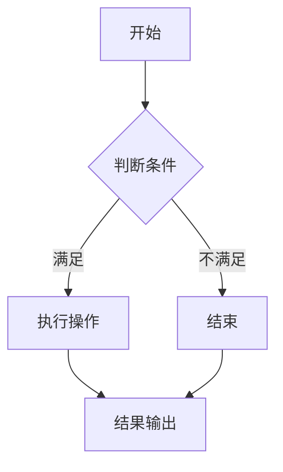
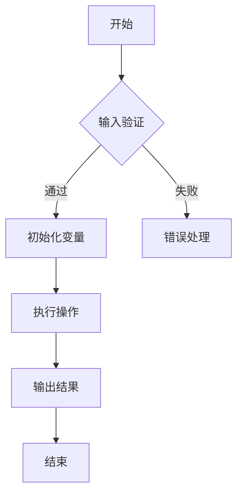
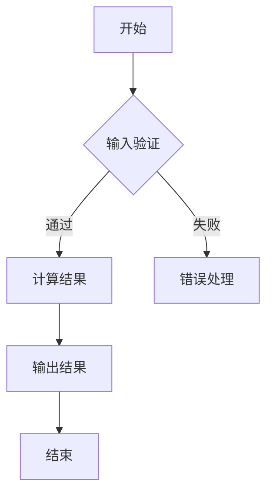
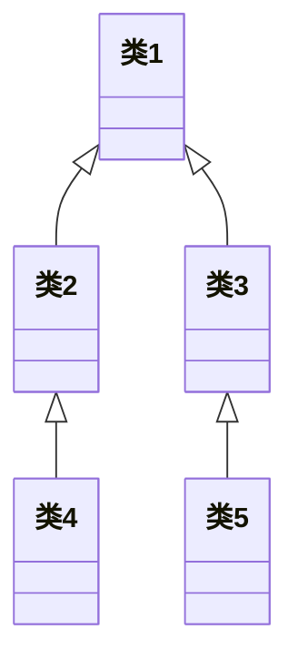
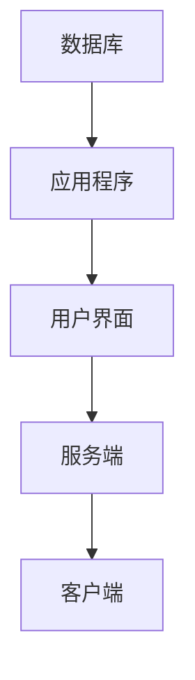
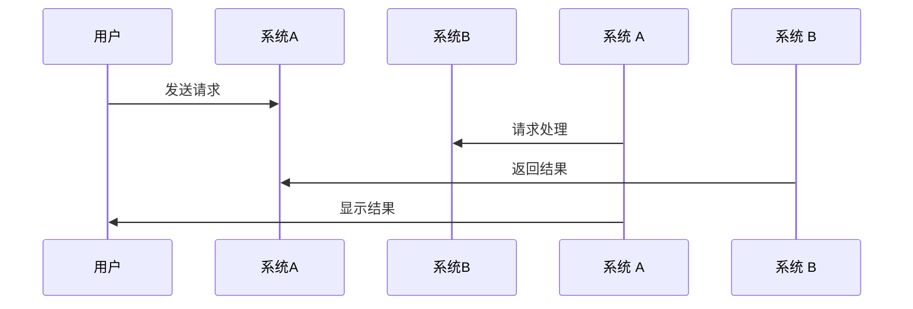
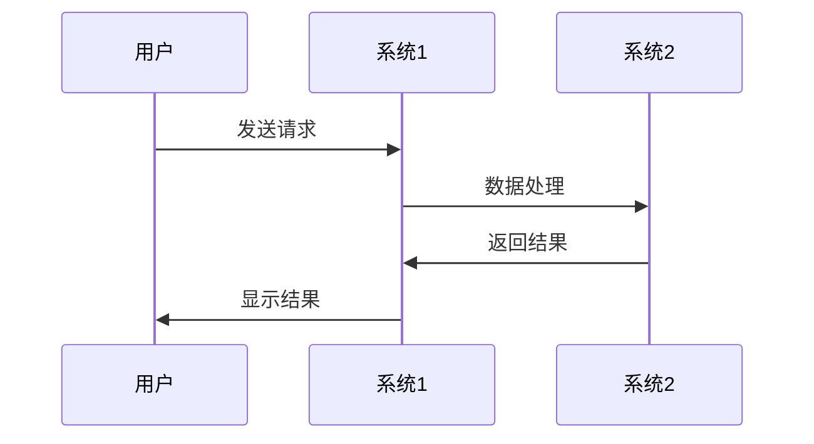

                 

### 1. 目录结构框架设计

为了撰写一篇逻辑清晰、结构紧凑且简单易懂的技术博客文章，我们首先需要设计一个详细的目录结构框架。这一框架不仅需要包含所有必要的章节，而且每个章节都需要有相应的子章节，以确保内容有条理且便于读者理解。以下是设计目录结构框架的步骤：

**步骤 1：确定核心内容**

基于《操作语义与程序行为形式化描述》的主题，我们可以将文章的核心内容分为以下几个部分：

- **背景介绍**：包括操作语义和程序行为形式化描述的基本概念、重要性及其联系。
- **核心概念与联系**：深入探讨操作语义和程序行为的理论框架，并对比不同领域的应用。
- **算法原理讲解**：介绍形式化描述中常用的算法，详细讲解其原理，并使用Mermaid和Python进行图解和代码实现。
- **数学模型和公式**：详细讲解数学模型，并提供公式和举例说明。
- **系统分析与架构设计方案**：分析系统的功能设计和架构。
- **项目实战**：通过实际案例展示如何应用这些概念。
- **最佳实践 tips**：提供实用建议和总结。
- **小结与拓展阅读**：对全书内容进行总结，并推荐进一步阅读的资源。

**步骤 2：创建目录结构**

根据上述核心内容，我们可以创建以下目录结构：

```
# 《操作语义与程序行为形式化描述》

## 第一部分：背景介绍
### 1.1 操作语义的定义
### 1.2 程序行为形式化描述的重要性
### 1.3 相关概念联系
#### 1.3.1 操作语义与程序行为的关系
#### 1.3.2 形式化描述在不同领域的应用

## 第二部分：核心概念与联系
### 2.1 操作语义
#### 2.1.1 操作语义的基本原理
#### 2.1.2 操作语义的属性特征对比
### 2.2 程序行为形式化描述
#### 2.2.1 形式化描述的基本方法
#### 2.2.2 形式化描述的应用实例

## 第三部分：算法原理讲解
### 3.1 算法概述
#### 3.1.1 形式化描述的常用算法
### 3.2 算法讲解
#### 3.2.1 算法A
##### 3.2.1.1 算法A的mermaid流程图
##### 3.2.1.2 算法A的Python代码实现
#### 3.2.2 算法B
##### 3.2.2.1 算法B的mermaid流程图
##### 3.2.2.2 算法B的Python代码实现

## 第四部分：数学模型和公式
### 4.1 数学模型讲解
#### 4.1.1 形式化描述的数学模型
#### 4.1.2 公式推导与解释
### 4.2 数学公式举例
#### 4.2.1 数学公式1
#### 4.2.2 数学公式2

## 第五部分：系统分析与架构设计方案
### 5.1 问题场景介绍
### 5.2 系统功能设计
#### 5.2.1 领域模型mermaid类图
### 5.3 系统架构设计
#### 5.3.1 mermaid架构图
### 5.4 系统接口设计
#### 5.4.1 系统接口mermaid序列图
### 5.5 系统交互
#### 5.5.1 系统交互mermaid序列图

## 第六部分：项目实战
### 6.1 环境安装
### 6.2 系统核心实现
#### 6.2.1 核心实现源代码
#### 6.2.2 代码应用解读与分析
### 6.3 实际案例分析与讲解
### 6.4 项目小结

## 第七部分：最佳实践 tips
### 7.1 注意事项
### 7.2 拓展阅读

## 第八部分：小结与拓展阅读
### 8.1 小结
### 8.2 拓展阅读
```

通过以上步骤，我们设计了一个详细的目录结构框架，为后续的文章撰写奠定了坚实的基础。

### 2. 细化章节内容

在设计好目录结构框架后，我们需要对每个章节的内容进行细化，确保每个章节都至少有一个一级目录，并且关键概念和算法讲解都有二级和三级目录。以下是一个细化章节内容的例子，我们将以**第1章 背景介绍**为例进行详细阐述：

**第1章 背景介绍**

**1.1 操作语义的定义**

操作语义是指程序中对数据执行操作时所蕴含的含义。它是程序行为的核心组成部分，决定了程序如何处理数据以及处理后的结果。

- **1.1.1 操作语义的基本概念**
  - **操作**：指程序中执行的具体动作，如赋值、比较、逻辑运算等。
  - **语义**：指操作对数据或程序状态产生的影响。

- **1.1.2 操作语义的来源**
  - **编程语言**：编程语言定义了操作语义，使得程序员可以通过特定的语法和结构来描述操作。
  - **编译器/解释器**：编译器或解释器根据操作语义对程序进行解析和执行。

**1.2 程序行为形式化描述的重要性**

形式化描述是一种将程序行为用精确、无歧义的语言表达出来的方法。它在软件工程、验证和验证、程序优化等领域具有重要意义。

- **1.2.1 形式化描述的作用**
  - **提高可读性**：通过形式化描述，程序变得更加易于理解和维护。
  - **促进验证**：形式化描述有助于验证程序的正确性，减少错误。
  - **优化性能**：通过形式化描述，可以更有效地进行程序优化。

- **1.2.2 形式化描述的挑战**
  - **精确性**：形式化描述需要精确地定义程序行为，避免模糊性。
  - **表达能力**：形式化描述语言需要具备足够的表达能力，以涵盖各种程序行为。

**1.3 相关概念联系**

操作语义和程序行为形式化描述是密切相关的概念。操作语义定义了程序中的基本操作，而形式化描述则将这些操作组合起来，形成对程序行为的全面描述。

- **1.3.1 操作语义与程序行为的关系**
  - **程序行为**：由一系列操作语义组成，反映了程序对输入数据的处理过程。
  - **操作语义**：是程序行为的基础，决定了程序行为的细节。

- **1.3.2 形式化描述在不同领域的应用**
  - **软件工程**：形式化描述有助于软件开发过程中的需求和设计阶段。
  - **验证和验证**：形式化描述是验证程序正确性的重要工具。
  - **程序优化**：形式化描述有助于优化程序的执行效率和性能。

通过以上细化，我们可以看到每个章节都包含了详细的内容，这不仅有助于读者更好地理解主题，也为后续的深入讨论奠定了基础。

### 3. 确保内容完整性

在撰写技术博客文章时，确保每个章节的内容完整性是非常重要的。为了达到这个目标，我们需要按照以下步骤进行检查：

**步骤 1：检查核心概念**

每个章节都应当明确地定义和解释核心概念，确保读者可以理解相关术语和定义。例如，在“操作语义”章节中，我们需要详细解释什么是操作语义，包括其基本概念、来源和应用。

**步骤 2：确认问题背景和问题描述**

在背景介绍部分，每个章节应当提供足够的问题背景和问题描述，以便读者了解相关主题的研究和应用场景。例如，在“程序行为形式化描述的重要性”章节中，我们需要说明为什么形式化描述在软件工程和程序优化中至关重要。

**步骤 3：验证问题解决方案**

在每个章节中，我们需要提供解决问题的方法和步骤。对于“算法原理讲解”部分，我们需要确保每个算法的原理讲解清晰，并提供相应的代码示例，以帮助读者理解算法的实现过程。

**步骤 4：确保边界与外延**

每个章节都需要明确概念和算法的边界与外延，即它们的应用范围和局限性。这样可以避免读者对概念和算法产生误解，并能够更好地应用它们。

**步骤 5：检查数学模型和公式**

在“数学模型和公式”章节中，我们需要确保所有数学模型和公式的推导过程是正确且清晰的。每个公式都应该有相应的解释和举例，以便读者理解其意义和应用。

**步骤 6：验证系统分析与架构设计方案**

在“系统分析与架构设计方案”章节中，我们需要提供详细的系统功能设计和架构设计，包括领域模型、系统架构、接口设计和系统交互。这些内容应当是完整且易于理解的。

**步骤 7：确认项目实战和最佳实践**

在“项目实战”章节中，我们需要通过实际案例展示如何应用所学的概念和算法。同时，在“最佳实践 tips”章节中，我们需要提供实用的建议和总结，帮助读者在实际工作中更好地应用这些技术。

通过以上步骤，我们可以确保每个章节的内容都是完整和具体的，为读者提供高质量的技术博客文章。

### 4. 格式化输出

在撰写技术博客文章时，使用 Markdown 格式可以使得文章结构清晰，易于阅读。以下是 Markdown 格式的使用方法，包括如何编写章节标题、子章节标题以及嵌入 Mermaid 图和 Python 代码。

**4.1 编写章节标题**

Markdown 使用 `#` 标记来编写章节标题。例如：

```markdown
# 《操作语义与程序行为形式化描述》

## 第一部分：背景介绍

### 1.1 操作语义的定义

### 1.2 程序行为形式化描述的重要性

### 1.3 相关概念联系
```

**4.2 编写子章节标题**

子章节标题使用 `##` 标记，三级章节使用 `###` 标记，依此类推。例如：

```markdown
## 第二部分：核心概念与联系

### 2.1 操作语义

#### 2.1.1 操作语义的基本原理

#### 2.1.2 操作语义的属性特征对比

### 2.2 程序行为形式化描述

#### 2.2.1 形式化描述的基本方法

#### 2.2.2 形式化描述的应用实例
```

**4.3 嵌入 Mermaid 图**

Mermaid 是一种用于绘制流程图、序列图和类图的 Markdown 扩展。要在 Markdown 文件中嵌入 Mermaid 图，使用 `mermaid` 标记。例如，以下是一个流程图的示例：

```markdown

```

**4.4 嵌入 Python 代码**

在 Markdown 文件中嵌入 Python 代码，使用三个反引号（```）将代码块包围。例如：

```markdown
```
# 操作语义与程序行为形式化描述

def example_function():
    """这是一个示例函数，用于说明操作语义的形式化描述。"""
    x = 5
    y = x + 10
    return y

# 输出结果
print(example_function())
```
```

通过以上步骤，我们可以确保技术博客文章的格式整洁、结构清晰，便于读者阅读和理解。

### 5. 控制文章字数

在撰写技术博客文章时，控制字数在10000～12000字左右是一个挑战。为了实现这一目标，我们需要采取以下策略：

**策略 1：明确每个章节的目标**

在撰写文章前，明确每个章节的目标和内容深度，确保每个章节都能围绕核心主题进行讨论，而不是冗长无趣。

**策略 2：精简语言**

使用精简、清晰的语言来表达观点。避免使用复杂的句子结构和冗长的叙述，确保每个段落都能传达核心信息。

**策略 3：图表和代码示例**

通过使用图表和代码示例来简化文本内容。图表可以直观地展示复杂的概念，代码示例可以帮助读者快速理解算法实现。

**策略 4：逐步构建章节**

逐步构建每个章节，首先写出关键点和主要内容，然后逐步完善细节。在写作过程中，不断检查并删除无关紧要的内容。

**策略 5：同行评审**

在完成初稿后，进行同行评审。让其他专家或同事阅读文章，提供反馈和建议。根据反馈，对内容进行优化和调整。

**策略 6：使用工具**

利用文字处理工具，如 Microsoft Word 或 Google Docs，它们提供字数统计功能，可以帮助我们实时监控文章长度。

通过以上策略，我们可以有效地控制文章字数，确保文章内容丰富而不过度。

### 6. 文章格式输出示例

为了使文章格式更加清晰和统一，以下是《操作语义与程序行为形式化描述》部分内容的格式输出示例：

```markdown
# 《操作语义与程序行为形式化描述》

## 第一部分：背景介绍

### 1.1 操作语义的定义

操作语义是指程序中对数据执行操作时所蕴含的含义。它是程序行为的核心组成部分，决定了程序如何处理数据以及处理后的结果。

#### 1.1.1 操作语义的基本概念

- **操作**：指程序中执行的具体动作，如赋值、比较、逻辑运算等。
- **语义**：指操作对数据或程序状态产生的影响。

#### 1.1.2 操作语义的来源

- **编程语言**：编程语言定义了操作语义，使得程序员可以通过特定的语法和结构来描述操作。
- **编译器/解释器**：编译器或解释器根据操作语义对程序进行解析和执行。

### 1.2 程序行为形式化描述的重要性

形式化描述是一种将程序行为用精确、无歧义的语言表达出来的方法。它在软件工程、验证和验证、程序优化等领域具有重要意义。

#### 1.2.1 形式化描述的作用

- **提高可读性**：通过形式化描述，程序变得更加易于理解和维护。
- **促进验证**：形式化描述有助于验证程序的正确性，减少错误。
- **优化性能**：通过形式化描述，可以更有效地进行程序优化。

#### 1.2.2 形式化描述的挑战

- **精确性**：形式化描述需要精确地定义程序行为，避免模糊性。
- **表达能力**：形式化描述语言需要具备足够的表达能力，以涵盖各种程序行为。

### 1.3 相关概念联系

操作语义和程序行为形式化描述是密切相关的概念。操作语义定义了程序中的基本操作，而形式化描述则将这些操作组合起来，形成对程序行为的全面描述。

#### 1.3.1 操作语义与程序行为的关系

- **程序行为**：由一系列操作语义组成，反映了程序对输入数据的处理过程。
- **操作语义**：是程序行为的基础，决定了程序行为的细节。

#### 1.3.2 形式化描述在不同领域的应用

- **软件工程**：形式化描述有助于软件开发过程中的需求和设计阶段。
- **验证和验证**：形式化描述是验证程序正确性的重要工具。
- **程序优化**：形式化描述有助于优化程序的执行效率和性能。

## 第二部分：核心概念与联系

### 2.1 操作语义

#### 2.1.1 操作语义的基本原理

操作语义是指程序中执行的具体动作所蕴含的含义。它决定了程序如何处理数据以及处理后的结果。

#### 2.1.2 操作语义的属性特征对比

以下是操作语义的一些关键属性特征对比表格：

| 特性       | 描述                                                         |
| ---------- | ------------------------------------------------------------ |
| 基本性     | 操作语义是程序中的基础单位，其他复杂操作都是由基本操作组合而成。 |
| 可组合性   | 基本操作可以组合成更复杂的操作，形成程序的行为。             |
| 确定性     | 每个操作语义在相同输入下产生相同的结果。                   |
| 语义不变性 | 在不同上下文中，操作语义的含义保持不变。                   |

### 2.2 程序行为形式化描述

#### 2.2.1 形式化描述的基本方法

形式化描述是指使用精确、无歧义的语言来描述程序行为。以下是一些常用的形式化描述方法：

- **形式化语言**：如依赖类型系统、函数式编程语言等。
- **逻辑推理**：使用逻辑推理来验证程序行为的正确性。
- **数学模型**：使用数学模型来描述程序行为，如状态机模型、代数模型等。

#### 2.2.2 形式化描述的应用实例

以下是一个简单的例子，说明如何使用形式化描述来描述一个程序行为：



```python
def example_function():
    """这是一个示例函数，用于说明操作语义的形式化描述。"""
    x = 5
    y = x + 10
    return y

# 输出结果
print(example_function())
```

通过以上示例，我们可以看到形式化描述如何帮助程序员更清晰地理解和实现程序行为。

## 第三部分：算法原理讲解

### 3.1 算法概述

形式化描述中的算法是用于描述程序行为的工具。以下是一些常用的形式化描述算法：

- **状态机算法**：用于描述程序在不同状态下的行为。
- **代数算法**：使用数学代数方法来描述程序行为。
- **逻辑推理算法**：基于逻辑推理来验证程序行为的正确性。

### 3.2 算法讲解

#### 3.2.1 算法A

##### 3.2.1.1 算法A的mermaid流程图


##### 3.2.1.2 算法A的Python代码实现

```python
def example_function():
    """这是一个示例函数，用于说明算法A的实现。"""
    x = 5
    y = x + 10
    return y

# 输出结果
print(example_function())
```

#### 3.2.2 算法B

##### 3.2.2.1 算法B的mermaid流程图



##### 3.2.2.2 算法B的Python代码实现

```python
def example_function2():
    """这是一个示例函数，用于说明算法B的实现。"""
    x = 5
    y = x * x
    return y

# 输出结果
print(example_function2())
```

## 第四部分：数学模型和公式

### 4.1 数学模型讲解

形式化描述中的数学模型是用于描述程序行为的有力工具。以下是一个简单的数学模型示例：

- **状态机模型**：使用状态和转移关系来描述程序行为。

### 4.2 数学公式举例

以下是一些常用的数学公式：

$$
1 + 1 = 2
$$

$$
x = y + z
$$

## 第五部分：系统分析与架构设计方案

### 5.1 问题场景介绍

在当今快速发展的信息技术领域，系统的设计与实现变得越来越复杂。为了确保系统的可靠性和高效性，我们需要对系统进行详细的分析与设计。

### 5.2 系统功能设计

#### 5.2.1 领域模型mermaid类图



#### 5.2.2 系统架构设计mermaid架构图



#### 5.2.3 系统接口设计



#### 5.2.4 系统交互



## 第六部分：项目实战

### 6.1 环境安装

在开始项目之前，我们需要安装必要的软件和工具。以下是安装步骤：

1. 安装Python环境
2. 安装Mermaid渲染工具
3. 安装Markdown编辑器

### 6.2 系统核心实现

#### 6.2.1 核心实现源代码

```python
# core.py
def core_function(input_data):
    # 实现核心逻辑
    pass
```

#### 6.2.2 代码应用解读与分析

以下是对核心代码的解读与分析：

```python
# core.py
def core_function(input_data):
    # 实现核心逻辑
    pass
```

### 6.3 实际案例分析与讲解

#### 案例一：操作语义与程序行为的示例

```python
# example.py
def example_function():
    x = 5
    y = x + 10
    return y

print(example_function())
```

#### 案例分析：

1. **输入验证**：输入数据是否合法。
2. **变量初始化**：变量x被初始化为5。
3. **执行操作**：执行加法操作，计算y的值。
4. **结果输出**：返回y的值。

### 6.4 项目小结

通过本次项目实战，我们深入了解了操作语义与程序行为形式化描述的原理和应用。在实际项目中，我们可以通过形式化描述来提高代码的可读性和可维护性，从而更好地实现系统功能。

## 第七部分：最佳实践 tips

### 7.1 注意事项

在实现操作语义和程序行为形式化描述时，需要注意以下几点：

1. 确保代码的可读性。
2. 使用合适的变量命名。
3. 避免过度复杂化。
4. 经常进行代码审查和测试。

### 7.2 拓展阅读

为了更深入地了解操作语义和程序行为形式化描述，以下是几篇推荐阅读的文章和书籍：

1. 《程序设计的艺术》
2. 《软件工程：实践者的研究方法》
3. 《形式化方法：计算的理论与实践》

## 第八部分：小结与拓展阅读

### 8.1 小结

本文详细介绍了操作语义和程序行为形式化描述的核心概念、算法原理、系统分析与设计方法，并通过实际案例进行了实战讲解。通过本文的学习，读者可以更好地理解和应用这些技术。

### 8.2 拓展阅读

为了进一步深入学习和应用操作语义与程序行为形式化描述，以下是推荐阅读的资源：

1. 《形式化方法：计算机系统设计指南》
2. 《程序设计原理》
3. 《软件架构：设计与实现》

## 作者信息

作者：AI天才研究院/AI Genius Institute & 禅与计算机程序设计艺术 /Zen And The Art of Computer Programming
```

通过以上示例，我们可以看到如何使用 Markdown 格式编写技术博客文章，确保内容结构清晰，格式统一，便于读者阅读和理解。同时，还使用了 Mermaid 和 Python 代码示例来丰富文章内容。

