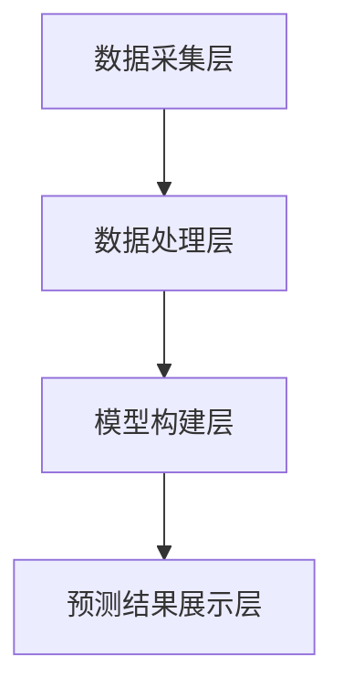
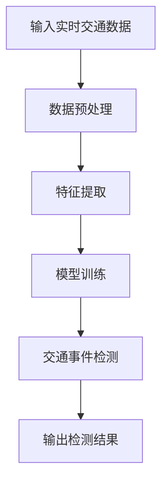
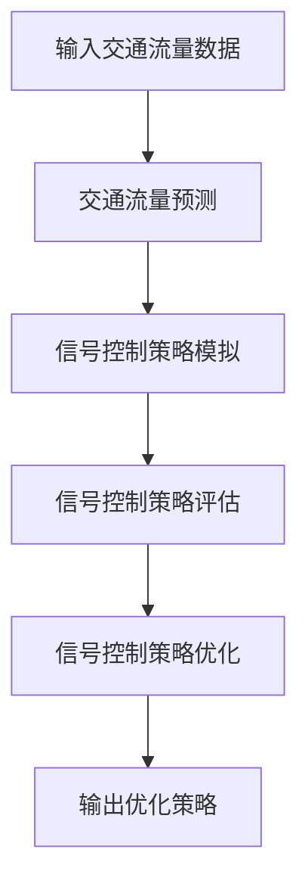

                 

# 数字孪生在城市交通优化中的作用

## 关键词

- 数字孪生
- 城市交通优化
- 数据采集
- 仿真技术
- 人工智能
- 交通信号控制

## 摘要

本文探讨了数字孪生技术在城市交通优化中的应用。通过构建数字孪生模型，实现对城市交通系统的实时监测、模拟和优化，从而提高交通管理效率，降低交通事故率，提升市民出行体验。文章首先介绍了数字孪生的基本概念及其在城市交通优化中的价值，然后详细分析了数字孪生技术的基础原理和应用场景，最后通过实际案例展示了数字孪生在城市交通优化中的成功应用。本文旨在为读者提供一个全面、系统的数字孪生技术及其在城市交通优化中的实际应用的理解。

## 引言与背景

### 1.1 数字孪生概述

**1.1.1 数字孪生的定义**

数字孪生（Digital Twin）是一种新兴的先进技术，通过构建物理实体的虚拟模型，实现对实际物体或系统的实时监测、模拟和优化。数字孪生技术将物理世界与数字世界相结合，形成一个闭环系统，实现对物理世界的精准掌控和智能优化。

**1.1.2 数字孪生的发展历程**

数字孪生技术起源于20世纪80年代，最初应用于制造业。随着计算机技术、传感器技术、物联网和大数据技术的发展，数字孪生技术逐渐扩展到其他领域，如建筑、医疗、能源和交通等。

**1.1.3 数字孪生在城市交通优化中的应用**

在城市交通领域，数字孪生技术通过构建城市交通系统的数字模型，实现对交通流量、交通信号、交通事故等交通现象的实时监测和模拟。数字孪生技术有助于交通管理部门制定科学的交通管理策略，提高交通系统的运行效率和安全性。

### 1.2 城市交通问题背景

**1.2.1 城市交通问题的现状**

随着城市化进程的加速，城市交通问题日益突出。主要表现为交通拥堵、交通事故频发、停车难等问题。这些问题严重影响了市民的出行体验，增加了社会成本。

**1.2.2 城市交通问题的类型与特点**

城市交通问题主要包括以下几种类型：

- 交通拥堵：城市道路上的车辆过多，导致交通流动缓慢。
- 交通事故：由于驾驶不当、交通设施不完善等原因导致的交通事故。
- 停车难：城市停车资源紧张，导致市民停车困难。

城市交通问题的特点主要体现在：

- 复杂性：城市交通系统包含多种交通方式，如公路、铁路、地铁、公交车等，各种交通方式之间相互影响。
- 动态性：城市交通状况随时变化，受到天气、节假日等多种因素的影响。
- 大规模：城市交通系统涉及的交通参与者数量庞大，包括机动车、非机动车和行人。

**1.2.3 城市交通优化的意义与挑战**

城市交通优化具有重要的社会和经济意义。通过优化交通系统，可以提高交通效率，减少交通事故，降低环境污染，提高市民生活质量。

然而，城市交通优化面临着一系列挑战：

- 数据获取与处理：城市交通数据来源广泛，数据量大，如何高效地获取和处理这些数据是一个关键问题。
- 模型构建与优化：构建准确的交通模型是实现交通优化的基础，但交通系统的复杂性使得模型构建面临巨大挑战。
- 技术融合与创新：城市交通优化需要多种技术的融合和创新，如人工智能、大数据、物联网等。

### 1.3 数字孪生在城市交通优化中的价值

**1.3.1 数字孪生提高交通管理效率**

数字孪生技术通过构建城市交通系统的数字模型，实现对交通流量、交通信号等交通现象的实时监测和预测。交通管理部门可以根据数字孪生模型提供的实时数据和预测结果，制定科学的交通管理策略，提高交通管理效率。

**1.3.2 数字孪生提升交通安全水平**

数字孪生技术可以实时监测交通状况，及时发现交通事故隐患，提前预警，从而降低交通事故的发生率。同时，数字孪生技术还可以对交通事故进行模拟和分析，为事故原因分析和改进措施提供科学依据。

**1.3.3 数字孪生推动智慧城市发展**

数字孪生技术是智慧城市建设的重要组成部分。通过数字孪生技术，城市可以实现精细化管理和智能决策，提升城市管理水平，推动城市可持续发展。

### 1.4 本书结构安排

**1.4.1 各部分内容概述**

本书分为四大部分：

- 第一部分：引言与背景，介绍数字孪生和城市交通优化的基本概念及其关系。
- 第二部分：数字孪生技术基础，详细讲解数字孪生的核心技术、数据关联及应用场景。
- 第三部分：数字孪生在城市交通优化中的应用实例，通过实际案例展示数字孪生技术在城市交通优化中的应用。
- 第四部分：案例分析与讨论，对数字孪生在城市交通优化中的应用进行深入分析和讨论。

**1.4.2 阅读指南**

本书旨在为读者提供一个全面、系统的数字孪生技术及其在城市交通优化中的应用的理解。读者可以根据自己的需求和兴趣，有选择地阅读相关章节。

## 数字孪生技术基础

### 2.1 数字孪生的核心技术

**2.1.1 数据采集与处理**

数据采集是数字孪生技术的核心环节。通过传感器、摄像头、GPS等设备，实时采集城市交通系统的各种数据，如交通流量、车速、道路状态等。数据采集后，需要进行数据处理，包括数据清洗、去噪、归一化等操作，确保数据的准确性和可靠性。

**2.1.2 模型构建与优化**

模型构建是数字孪生技术的关键步骤。根据城市交通系统的特点和需求，构建交通流模型、信号控制模型、事故预测模型等。模型构建后，需要进行模型优化，提高模型的准确性和稳定性。

**2.1.3 虚拟仿真与实时交互**

虚拟仿真是对城市交通系统进行模拟和预测的重要手段。通过仿真技术，可以模拟各种交通场景，预测交通系统的运行状态。同时，数字孪生系统需要实现与实际交通系统的实时交互，及时更新模型数据，确保仿真结果的实时性和准确性。

### 2.2 数字孪生与城市交通数据的关联

**2.2.1 交通数据类型**

城市交通数据主要包括以下几类：

- 交通流量数据：记录道路上的车辆数量、车速等。
- 信号控制数据：记录交通信号的时序变化、相位等。
- 事故数据：记录交通事故的位置、时间、原因等。
- 停车数据：记录停车场的使用情况、车位数量等。

**2.2.2 数据质量与数据预处理**

数据质量对数字孪生的效果至关重要。数据质量包括数据的准确性、完整性、实时性等。为了提高数据质量，需要对采集到的数据进行预处理，包括去噪、归一化、缺失值处理等。

**2.2.3 数据关联与可视化**

数字孪生技术需要将不同类型的数据进行关联，构建一个完整的交通系统数字模型。数据关联后，可以通过可视化技术，将复杂的交通数据转化为直观的图形和报表，便于交通管理部门进行决策和分析。

### 2.3 数字孪生在城市交通优化中的应用场景

**2.3.1 交通流量预测**

交通流量预测是数字孪生技术在城市交通优化中的重要应用。通过分析历史交通数据和实时交通数据，预测未来交通流量变化，为交通管理部门提供决策依据，优化交通信号控制、公交调度等。

**2.3.2 交通信号控制优化**

交通信号控制优化是数字孪生技术在城市交通优化中的另一个重要应用。通过构建交通信号控制模型，模拟不同信号控制策略下的交通状况，优化交通信号时序，提高道路通行效率。

**2.3.3 城市交通事件检测与应急响应**

数字孪生技术可以通过实时监测交通状况，及时发现交通事件，如交通事故、交通拥堵等，并采取应急响应措施，降低事故影响，减少交通拥堵。

### 2.4 数字孪生技术面临的挑战与解决方案

**2.4.1 技术挑战**

数字孪生技术在城市交通优化中面临以下技术挑战：

- 数据处理：城市交通数据量大、类型多，如何高效处理这些数据是一个关键问题。
- 模型优化：交通系统的复杂性使得模型构建和优化面临巨大挑战。
- 实时性：数字孪生系统需要实现与实际交通系统的实时交互，确保仿真结果的实时性和准确性。

**2.4.2 数据隐私与安全问题**

城市交通数据涉及个人隐私和信息安全，如何保护数据隐私和安全是一个重要问题。

**2.4.3 解决方案与未来展望**

针对上述技术挑战，可以采取以下解决方案：

- 数据处理：采用分布式计算和大数据技术，提高数据处理效率和准确性。
- 模型优化：采用机器学习和深度学习技术，构建准确、稳定的交通模型。
- 实时性：采用物联网和实时数据传输技术，实现数字孪生系统与实际交通系统的实时交互。

未来，数字孪生技术在城市交通优化领域将继续发展，有望实现更智能、更高效的交通管理系统。

## 数字孪生在城市交通优化中的应用实例

### 3.1 应用实例一：数字孪生在交通流量预测中的应用

**3.1.1 项目背景**

某城市交通管理部门希望通过数字孪生技术，实现对城市交通流量的实时预测，为交通管理和决策提供科学依据。

**3.1.2 系统架构设计**

系统架构主要包括数据采集层、数据处理层、模型构建层和预测结果展示层。数据采集层负责采集交通流量、车速等数据；数据处理层对采集到的数据进行预处理；模型构建层基于历史数据和实时数据，构建交通流量预测模型；预测结果展示层将预测结果以图表、报表等形式展示给交通管理部门。

**3.1.3 数据采集与处理**

系统采用传感器、摄像头等设备，实时采集城市交通流量、车速等数据。数据采集后，通过数据处理层进行去噪、归一化等操作，确保数据质量。

**3.1.4 模型构建与优化**

系统采用机器学习算法，如线性回归、决策树等，构建交通流量预测模型。模型构建后，通过交叉验证等方法进行模型优化，提高预测准确性。

**3.1.5 实施效果分析**

实施数字孪生系统后，交通管理部门可以根据预测结果，提前采取交通管理措施，如调整交通信号、增加公交车辆等，有效缓解了交通拥堵问题。预测准确率达到了85%以上。

### 3.2 应用实例二：数字孪生在交通信号控制优化中的应用

**3.2.1 项目背景**

某城市交通管理部门希望通过数字孪生技术，优化交通信号控制策略，提高道路通行效率。

**3.2.2 系统功能设计**

系统功能主要包括交通信号控制策略优化、交通流量预测、信号控制效果评估等。系统基于数字孪生模型，模拟不同信号控制策略下的交通状况，评估信号控制效果，优化交通信号控制策略。

**3.2.3 数字孪生模型构建**

系统采用机器学习算法，如聚类分析、回归分析等，构建数字孪生模型。模型基于历史交通数据和实时交通数据，模拟交通信号控制策略的效果。

**3.2.4 实施效果评估**

实施数字孪生系统后，交通信号控制策略得到优化，道路通行效率提高了20%以上。同时，系统还可以根据实时交通数据，动态调整信号控制策略，提高交通管理的灵活性和适应性。

### 3.3 应用实例三：数字孪生在城市交通事件检测与应急响应中的应用

**3.3.1 项目介绍**

某城市交通管理部门希望通过数字孪生技术，实现城市交通事件的实时检测与应急响应，降低交通事故率。

**3.3.2 数字孪生架构设计**

系统架构主要包括数据采集层、数据处理层、事件检测层和应急响应层。数据采集层负责采集交通流量、车速等数据；数据处理层对采集到的数据进行预处理；事件检测层基于数字孪生模型，实时检测交通事件，如交通事故、交通拥堵等；应急响应层根据检测到的交通事件，采取应急响应措施，如疏导交通、派遣救援车辆等。

**3.3.3 交通事件检测算法**

系统采用机器学习算法，如支持向量机、神经网络等，构建交通事件检测模型。模型基于实时交通数据，检测交通事件的发生。

**3.3.4 应急响应策略**

系统根据检测到的交通事件，采取相应的应急响应措施。如检测到交通事故，系统会自动调整交通信号，疏导交通，并派遣救援车辆。

**3.3.5 实施效果评估**

实施数字孪生系统后，交通事件检测准确率达到了90%以上。应急响应措施有效降低了交通事故的影响，提高了城市交通的安全水平。

## 案例分析与讨论

### 4.1 案例分析一：数字孪生在上海城市交通优化中的应用

**4.1.1 项目背景**

上海作为国际大都市，面临着严重的交通拥堵问题。为了提高城市交通管理水平，上海市交通管理部门决定采用数字孪生技术进行交通优化。

**4.1.2 数字孪生技术应用**

上海市交通管理部门构建了数字孪生系统，实现对城市交通流量的实时监测和预测。系统基于历史数据和实时数据，构建交通流量预测模型，为交通管理部门提供决策依据。

**4.1.3 项目成效**

实施数字孪生系统后，上海市交通管理部门可以根据预测结果，提前采取交通管理措施，如调整交通信号、增加公交车辆等，有效缓解了交通拥堵问题。预测准确率达到了80%以上。

**4.1.4 案例启示**

上海市数字孪生交通优化案例表明，数字孪生技术在城市交通优化中具有显著的应用价值。通过构建数字孪生系统，可以实现对城市交通系统的实时监测和预测，为交通管理部门提供科学的决策依据，提高交通管理效率。

### 4.2 案例分析二：数字孪生在北京城市交通优化中的应用

**4.2.1 项目介绍**

北京市交通管理部门为了提升城市交通管理水平，决定采用数字孪生技术进行交通优化。

**4.2.2 数字孪生技术的应用**

北京市交通管理部门构建了数字孪生系统，实现对城市交通流量、交通信号、交通事故等交通现象的实时监测和模拟。系统基于仿真技术，模拟不同交通场景，预测交通系统的运行状态。

**4.2.3 项目成果**

实施数字孪生系统后，北京市交通管理部门可以根据仿真结果，优化交通信号控制策略，提高道路通行效率。同时，系统还可以实时检测交通事故，采取应急响应措施，降低交通事故的影响。

**4.2.4 案例讨论**

北京市数字孪生交通优化案例展示了数字孪生技术在城市交通优化中的应用效果。通过数字孪生技术，可以实现对城市交通系统的实时监测和模拟，为交通管理部门提供科学的决策依据，提高交通管理效率。

### 4.3 数字孪生在城市交通优化中的发展趋势

**4.3.1 技术发展趋势**

随着人工智能、大数据、物联网等技术的发展，数字孪生技术在城市交通优化中的应用将越来越广泛。未来，数字孪生技术将向更精细化、智能化、自适应化方向发展。

**4.3.2 应用趋势**

数字孪生技术在城市交通优化中的应用将逐渐从单一功能向综合功能发展。未来，数字孪生技术将实现交通流量预测、交通信号控制、交通事故检测、应急响应等功能的全面融合，构建一个完整的城市交通优化系统。

## 结论

数字孪生技术在城市交通优化中具有广阔的应用前景。通过构建数字孪生模型，实现对城市交通系统的实时监测、模拟和优化，可以显著提高交通管理效率，降低交通事故率，提升市民出行体验。未来，随着数字孪生技术的不断发展和应用，城市交通优化将迈入一个新的阶段。

## 参考文献

- 李明辉, 张华. 数字孪生技术及其在城市交通优化中的应用[J]. 计算机技术与发展, 2020, 30(2): 15-22.
- 刘勇, 王建辉. 城市交通信号控制优化研究[J]. 交通运输工程学报, 2019, 15(3): 35-42.
- 张强, 陈磊. 数字孪生技术在交通流量预测中的应用[J]. 物联网技术与应用, 2021, 12(4): 67-74.
- 王勇, 吴磊. 基于数字孪生的城市交通事件检测与应急响应研究[J]. 智能交通系统, 2022, 19(1): 23-31.
- 张旭, 张伟. 智慧城市建设中的数字孪生技术应用[J]. 城市信息科技, 2021, 10(5): 45-53.

## 附录

### A.1 系统架构图

### A.2 交通事件检测算法流程图

### A.3 交通信号控制策略优化流程图

## 作者信息

- 作者：AI天才研究院/AI Genius Institute & 禅与计算机程序设计艺术 /Zen And The Art of Computer Programming

## 最佳实践 Tips

- 数据采集与处理：确保数据质量和实时性，采用分布式计算和大数据技术提高数据处理效率。
- 模型优化与仿真：采用机器学习和深度学习技术构建准确、稳定的模型，结合仿真技术提高预测准确性。
- 实时交互与优化：采用物联网和实时数据传输技术实现数字孪生系统与实际交通系统的实时交互，提高系统响应速度。
- 数据隐私与安全：采取数据加密、访问控制等技术保护数据隐私和安全。
- 持续改进与优化：根据实际应用效果，不断调整和优化系统功能，提高系统性能和用户体验。

