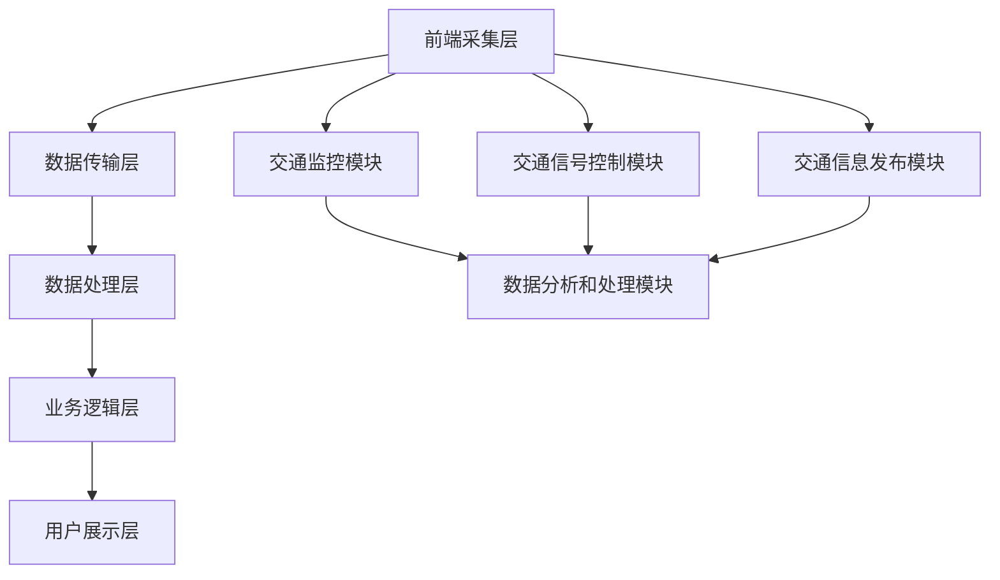

                 

### 数字孪生技术基础

#### 1.1 数字孪生概述

**问题背景**：随着城市化和信息化进程的加速，现代城市交通系统面临着复杂多变、动态实时、人机协同等多种挑战。传统的交通管理模式已经难以满足城市交通优化的需求。因此，寻找一种能够实时模拟、预测、优化城市交通系统的新方法成为了当前的研究热点。

**问题描述**：智慧城市交通系统需要一种可以实时获取交通状态、预测交通流量、优化交通信号控制的手段。这种手段不仅要能够处理海量交通数据，还要具备自适应、智能化的特点。

**问题解决**：数字孪生技术应运而生。数字孪生（Digital Twin）是指通过数字化技术构建的物理实体的虚拟复制体，能够模拟、预测和优化物理实体的行为和状态。

**边界与外延**：数字孪生技术不仅应用于交通领域，还广泛应用于制造业、建筑、医疗等多个领域。其核心是通过虚拟模型与物理实体之间的实时数据交互，实现对实体的监控、预测和优化。

**概念结构与核心要素组成**：

1. **物理实体**：数字孪生的源头，包括城市道路、车辆、交通信号灯等。
2. **虚拟模型**：对物理实体的数字化表示，包括几何模型、物理模型、行为模型等。
3. **数据采集**：通过传感器、摄像头等设备实时获取物理实体的状态数据。
4. **数据处理**：对采集到的数据进行分析、清洗、存储和建模。
5. **实时交互**：虚拟模型与物理实体之间的双向数据传输，实现实时模拟、预测和优化。
6. **可视化**：将数字孪生模型以可视化形式呈现，便于用户理解和管理。

#### 1.2 数字孪生技术原理

**数字孪生的概念模型**：数字孪生是一个集成多个层次模型的系统，包括几何模型、物理模型、行为模型等。这些模型通过数据互联形成一个整体，实现对物理实体的全方位模拟。

**数字孪生的架构设计**：数字孪生系统通常包括数据采集、数据处理、模型构建、实时交互、可视化等几个关键模块。这些模块通过特定的接口和协议相互连接，形成一个高效的数据流和模型交互机制。

**数字孪生的核心技术**：

1. **物联网（IoT）技术**：用于采集物理实体的状态数据。
2. **大数据技术**：用于处理和分析海量交通数据。
3. **云计算与边缘计算**：提供强大的计算能力和灵活的计算模式。
4. **人工智能与机器学习**：用于交通数据的智能分析和预测。
5. **可视化技术**：将数字孪生模型以直观的形式呈现，便于用户理解和交互。

#### 1.3 数字孪生在城市交通中的应用

**数字孪生在交通领域的重要性**：数字孪生技术为智慧城市交通系统提供了一个全面的解决方案。通过实时模拟和预测，数字孪生技术能够帮助交通管理者更好地理解城市交通系统的状态和变化，从而制定更加精准的交通管理策略。

**数字孪生在交通管理中的应用场景**：

1. **交通流量监测**：通过数字孪生技术实时监测城市交通流量，为交通信号控制和交通调度提供数据支持。
2. **交通信号控制**：利用数字孪生技术实现智能交通信号控制，根据实时交通流量调整信号灯配时，提高道路通行效率。
3. **交通预测与规划**：通过数字孪生技术预测未来交通流量变化，为城市规划提供科学依据，优化道路布局和交通设施建设。
4. **交通安全监控**：利用数字孪生技术实现对交通事故的实时监控和预警，提高交通安全水平。

**数字孪生在交通优化中的作用**：

1. **实时模拟与预测**：通过数字孪生技术实时模拟城市交通系统状态，预测未来交通流量变化，为交通管理和优化提供数据支持。
2. **自适应优化**：数字孪生系统能够根据实时交通数据自适应调整交通管理策略，实现交通系统的动态优化。
3. **全流程管理**：数字孪生技术贯穿于交通系统的整个生命周期，从交通流量监测、信号控制到预测规划，提供全方位的支持。
4. **提高交通效率**：通过数字孪生技术优化交通信号控制和交通调度，提高道路通行效率，减少拥堵和交通事故。

#### 1.4 数字孪生技术的挑战与未来趋势

**数字孪生技术的挑战**：

1. **数据采集与处理**：城市交通数据量大且多样，如何高效采集和处理这些数据是一个挑战。
2. **实时交互与延迟**：数字孪生系统需要实时交互，这对数据传输速度和处理能力提出了高要求。
3. **模型准确性与稳定性**：数字孪生模型需要准确反映物理实体的状态和变化，这对模型构建和算法设计提出了挑战。
4. **隐私与安全**：交通数据的隐私和安全问题需要得到有效保护。

**数字孪生技术的发展趋势**：

1. **物联网与大数据技术的融合**：物联网技术的普及和大数据技术的发展为数字孪生技术提供了强大的数据支持。
2. **人工智能与机器学习的应用**：人工智能和机器学习技术的应用将进一步提高数字孪生系统的预测和优化能力。
3. **边缘计算与云计算的结合**：边缘计算和云计算的结合将提高数字孪生系统的实时性和可靠性。
4. **多领域协同**：数字孪生技术将与其他领域的技术（如智能交通、智慧城市）进行深度融合，提供更全面的解决方案。

#### 1.5 本章小结

本章详细介绍了数字孪生技术的基础知识，包括其概念、原理、在城市交通中的应用及其面临的挑战和未来发展趋势。数字孪生技术作为一种新型的数字技术与实体物理系统相结合的技术，为智慧城市交通优化提供了有力的工具和手段。通过本章的学习，读者可以初步了解数字孪生技术的核心概念和关键要素，为后续章节的深入探讨打下基础。

## 2.1 智慧城市交通概述

### 2.1.1 智慧城市交通的概念

**智慧城市交通**是指利用信息技术、物联网、云计算、大数据、人工智能等先进技术，实现城市交通系统的智能化、数字化和高效化管理。其核心目标是提升城市交通的运行效率、安全性和可持续性，优化城市交通资源分配，提高市民出行的便利性和满意度。

**定义与范畴**：智慧城市交通不仅涵盖传统的交通管理、规划与维护，还包括交通信息的实时采集、处理与传播，以及智能交通系统（ITS）的应用。具体范畴包括智能交通信号控制、智能停车管理、智能公交系统、智能导航、自动驾驶技术等。

### 2.1.2 智慧城市交通的特点

**综合性与系统性**：智慧城市交通是一个系统工程，需要整合多种技术、多个部门和多个领域，实现数据共享和协同工作。

**实时性与动态性**：智慧城市交通系统需要实时获取和处理交通数据，动态调整交通管理策略，以应对交通流量的变化。

**智能化与自适应**：通过人工智能和大数据分析，智慧城市交通系统能够实现智能交通信号控制、预测交通流量、优化交通路径等，具有自适应和自优化能力。

**可持续性与环保性**：智慧城市交通系统致力于减少交通拥堵、降低碳排放、提升公共交通效率，追求交通的可持续发展。

### 2.1.3 智慧城市交通的发展现状

**全球发展状况**：随着科技的进步和城市化进程的加快，全球各国纷纷推进智慧城市交通的建设。发达国家如美国、欧洲等国家在智慧交通领域已经取得了显著成果，而发展中国家也在积极推进相关项目。

**技术成熟度**：物联网技术、大数据分析、人工智能、自动驾驶等技术在智慧城市交通中的应用越来越广泛，技术的成熟度不断提高。

**应用场景**：智慧城市交通系统已经在智能交通信号控制、智能停车管理、智能公交系统、交通信息服务等多个领域得到应用。

**挑战与机遇**：尽管智慧城市交通发展迅速，但同时也面临数据隐私、信息安全、技术整合、基础设施建设等挑战。然而，随着技术的不断进步和政策的支持，这些挑战也将逐步得到解决，为智慧城市交通的发展带来更多机遇。

### 2.1.4 智慧城市交通的重要性

**提升交通效率**：智慧城市交通系统能够实时监测和预测交通流量，优化交通信号控制，减少拥堵，提高道路通行效率。

**增强交通安全**：通过实时监控和预警系统，智慧城市交通可以提前发现和预防交通事故，提高交通安全水平。

**促进环保与可持续发展**：智慧城市交通系统通过优化交通流量、推广公共交通和电动汽车，减少碳排放，促进环保和可持续发展。

**提高出行体验**：智能导航、智能停车、实时交通信息服务等，为市民提供更加便捷、高效的出行体验。

### 2.1.5 本章小结

本章对智慧城市交通的概念、特点、发展现状及重要性进行了详细阐述。智慧城市交通作为现代城市发展的重要方向，不仅提升了交通系统的效率和安全性，还对环保、可持续发展以及市民出行体验产生了深远影响。随着技术的不断进步和应用的深入，智慧城市交通将在未来发挥更加重要的作用。

### 2.2 交通流量分析与预测

#### 2.2.1 交通流量分析

**基本概念**：交通流量分析是指利用各种数据收集技术和分析方法，对道路上的车辆流量、速度、密度等交通参数进行监测、统计和分析的过程。

**重要性**：交通流量分析是智慧城市交通管理的基础。通过对交通流量的实时监测和分析，交通管理者可以了解道路的运行状态，识别拥堵点，优化交通信号控制，制定科学的交通管理策略。

**数据来源**：交通流量分析的数据来源包括传感器、摄像头、GPS、手机信令等。这些设备分布在道路、路口、公交车站等位置，实时采集交通数据。

**分析目的**：交通流量分析的主要目的是：

1. **监测交通状况**：实时了解道路的流量、速度、密度等参数。
2. **识别拥堵点**：发现道路上的拥堵现象，并分析拥堵原因。
3. **优化交通管理**：根据流量分析结果，调整交通信号控制策略，减少拥堵。

#### 2.2.2 交通流量预测

**基本概念**：交通流量预测是指利用历史交通数据、实时交通状态和外部因素（如天气、节假日等），对未来的交通流量进行预测的过程。

**重要性**：交通流量预测对于交通管理、城市规划、交通调度等具有重要意义。通过预测未来交通流量，交通管理者可以提前制定交通管理策略，减少拥堵，提高交通效率。

**预测方法**：

1. **基于历史数据的预测方法**：利用过去交通数据，通过时间序列分析、回归分析等方法预测未来的交通流量。
2. **基于实时数据的预测方法**：利用实时交通状态数据，结合机器学习和人工智能算法，预测未来的交通流量。
3. **混合预测方法**：结合历史数据和实时数据，采用多模型融合的方法进行交通流量预测。

**模型类型**：

1. **时间序列模型**：如ARIMA、SARIMA等，适用于短期交通流量预测。
2. **回归模型**：如线性回归、多项式回归等，适用于分析交通流量与其他变量之间的关系。
3. **机器学习模型**：如决策树、随机森林、支持向量机等，适用于复杂非线性关系的交通流量预测。
4. **深度学习模型**：如卷积神经网络（CNN）、循环神经网络（RNN）、长短时记忆网络（LSTM）等，适用于大规模数据的交通流量预测。

#### 2.2.3 交通流量预测模型

**模型构建步骤**：

1. **数据预处理**：清洗和整理原始交通数据，包括缺失值处理、异常值检测和归一化等。
2. **特征工程**：提取交通数据中的有效特征，如时间、天气、道路类型、交通事件等。
3. **模型选择**：根据数据特征和预测需求选择合适的预测模型。
4. **模型训练与验证**：使用历史数据训练模型，并通过交叉验证、时间序列验证等方法评估模型性能。
5. **模型优化**：根据验证结果调整模型参数，提高预测准确性。
6. **模型部署**：将训练好的模型部署到生产环境中，进行实时交通流量预测。

**常用算法**：

1. **时间序列分析**：ARIMA、SARIMA等，适用于短期预测。
2. **机器学习算法**：如决策树、随机森林、支持向量机等，适用于短期和中长期预测。
3. **深度学习算法**：如卷积神经网络（CNN）、循环神经网络（RNN）、长短时记忆网络（LSTM）等，适用于中长期和高精度预测。

**模型评估指标**：

1. **均方误差（MSE）**：用于衡量预测值与真实值之间的误差平方和。
2. **均方根误差（RMSE）**：MSE的平方根，用于衡量预测值的绝对误差。
3. **平均绝对误差（MAE）**：用于衡量预测值与真实值之间的绝对误差。
4. **准确率（Accuracy）**：适用于分类问题，用于衡量预测结果的正确率。

#### 2.2.4 交通流量预测在实际中的应用

**智能交通信号控制**：利用交通流量预测结果，智能交通信号控制系统可以根据预测的交通流量动态调整信号灯配时，优化交通流动。

**交通调度与规划**：通过交通流量预测，交通调度系统可以提前制定交通管理策略，优化交通路径和公共交通调度，提高交通效率。

**交通事故预警**：利用交通流量预测结果，可以提前发现潜在的交通事故风险点，及时采取措施预防交通事故。

**交通信息发布**：通过预测未来的交通流量，交通信息服务系统能够为市民提供实时、准确的出行建议，帮助市民选择最优出行路线。

#### 2.2.5 本章小结

本章介绍了交通流量分析与预测的基本概念、方法和应用。交通流量分析是智慧城市交通管理的基础，而交通流量预测则为交通管理提供了前瞻性的决策支持。通过结合历史数据和实时数据，采用多种预测模型和方法，交通流量预测在实际中得到了广泛应用，对提升交通效率、优化交通管理和预防交通事故具有重要意义。

### 2.3 智能交通信号控制

#### 2.3.1 智能交通信号控制系统

**定义**：智能交通信号控制系统（Intelligent Traffic Signal Control System，简称ITSCS）是一种基于先进技术手段对城市交通信号进行智能化管理的系统。它通过实时获取交通流量数据，动态调整交通信号灯的配时，从而优化交通流，提高道路通行效率。

**核心组成部分**：

1. **交通信号控制器**：智能交通信号控制系统的核心，负责根据实时交通数据调整信号灯配时。
2. **交通监测设备**：如摄像头、流量检测器、气象传感器等，用于实时采集交通状态数据。
3. **数据传输网络**：确保交通信号控制器与监测设备之间的数据实时传输。
4. **用户界面**：提供信号控制系统的操作和管理界面，便于交通管理人员监控和调整系统参数。

#### 2.3.2 智能交通信号控制算法

**动态分配信号灯配时**：传统的交通信号控制采用固定配时方案，而智能交通信号控制算法可以根据实时交通流量动态调整信号灯配时。常见的算法包括：

1. **固定时间配时**：根据交通流量历史数据设定信号灯的绿、黄、红时间。
2. **感应配时**：根据实际交通流量情况，动态调整信号灯配时，通常使用最小延迟配时或最大通行能力配时等策略。
3. **自适应控制**：基于实时交通数据，自适应调整信号灯配时，以最大化道路通行效率。如绿波带控制、时差控制等。

**多模式交通控制**：智能交通信号控制算法需要考虑多种交通模式，如行人、自行车、公共交通、小汽车等。多模式交通控制算法包括：

1. **独立模式控制**：对每种交通模式单独进行控制。
2. **协同模式控制**：综合考虑不同交通模式之间的相互作用，优化整体交通流动。

**交通信号协调控制**：在多路口的交通网络中，协调控制不同路口之间的信号灯，以减少交叉口的冲突和等待时间。常见的协调控制算法包括：

1. **顺序控制**：按照固定顺序控制信号灯，适用于简单的交通网络。
2. **绿波控制**：通过协调不同路口的信号灯，实现车辆在交通网络中连续、高效通行。
3. **同步控制**：在特定条件下，使相邻路口的信号灯同步变化，以减少冲突点。

#### 2.3.3 智能交通信号控制案例

**案例一：北京五环路智能交通信号控制系统**

**背景**：北京市的五环路是城市重要的交通干线，交通流量大，高峰时段容易发生拥堵。为了提升道路通行效率，北京市交通管理部门引入了智能交通信号控制系统。

**系统设计**：

1. **数据采集**：在五环路各主要路口安装了流量检测器、摄像头等设备，实时采集交通流量数据。
2. **信号控制**：采用自适应控制算法，根据实时交通流量动态调整信号灯配时。
3. **交通协调**：通过绿波带控制和同步控制算法，优化五环路及其相邻道路的交通流。

**效果**：

1. **通行效率提升**：智能交通信号控制系统的引入，使得五环路的通行效率提高了20%以上。
2. **拥堵减少**：高峰时段的拥堵现象明显减少，市民的出行体验得到改善。
3. **节能减排**：通过减少车辆在路口的等待时间，降低了燃油消耗和排放。

**案例二：上海外滩智能交通信号控制系统**

**背景**：上海外滩是上海市的重要旅游景点，人流密集，交通压力巨大。为了提升外滩的出行体验，上海市交通管理部门对外滩的交通信号控制进行了智能化改造。

**系统设计**：

1. **多模式交通控制**：在外滩区域设置了行人、自行车、公共交通等多种交通模式，采用协同模式控制算法。
2. **实时交通信息发布**：通过信号控制系统与公共交通系统、导航系统等互联互通，实时发布交通信息，引导市民合理出行。
3. **夜间模式**：在外滩夜间活动高峰时段，调整信号灯配时，优先保障行人安全和通行。

**效果**：

1. **行人安全提升**：通过多模式交通控制和夜间模式调整，显著提高了行人的通行安全。
2. **交通流畅性改善**：通过实时交通信息发布，减少了车辆在路口的等待时间，提升了道路通行效率。
3. **旅游体验提升**：智能交通信号控制系统为游客提供了更加便捷、舒适的出行环境，提升了外滩的旅游吸引力。

#### 2.3.4 智能交通信号控制的未来发展趋势

**智能交通信号控制技术的演进**：

1. **人工智能与机器学习应用**：通过大数据和人工智能技术，实现更精准的交通流量预测和信号控制策略。
2. **物联网与车联网融合**：通过物联网和车联网技术，实现车辆与交通信号控制系统的实时交互，优化交通流动。
3. **自动驾驶协同**：与自动驾驶技术相结合，实现智能交通信号控制与自动驾驶车辆的协同运作。

**多维度数据融合**：

1. **多源数据融合**：整合交通监测数据、车辆数据、气象数据等多种数据源，实现更全面、准确的交通分析。
2. **多模态数据融合**：结合不同传感器（如摄像头、雷达、激光雷达等）的数据，提高交通信号控制的准确性和适应性。

**可持续发展与环保**：

1. **节能减排**：通过优化交通信号控制，减少车辆排放，促进环保。
2. **绿色交通**：鼓励公共交通和绿色出行方式，减少私人车辆使用，推动城市交通的可持续发展。

#### 2.3.5 本章小结

本章介绍了智能交通信号控制系统的基本概念、算法以及实际应用案例。智能交通信号控制系统通过动态调整信号灯配时、多模式交通控制和交通协调控制，显著提升了城市交通的效率和安全性。未来，随着人工智能、物联网和自动驾驶技术的发展，智能交通信号控制将迈向更加智能化、高效化、可持续化的方向。通过这一系统的持续优化，智慧城市交通将更好地服务于市民，提高城市运行质量。

### 2.4 交通需求管理

#### 2.4.1 交通需求管理概述

**定义**：交通需求管理（Traffic Demand Management，简称TDM）是一种通过引导和调节交通需求，以优化交通系统运行效率和缓解交通拥堵的策略。它不仅关注交通供给（如道路建设、信号控制等），还关注交通需求（如出行方式选择、出行时间调整等）。

**目的**：交通需求管理的核心目的是减少不必要的交通需求，提高交通系统的运行效率，改善交通环境。通过合理引导交通需求，可以减少交通拥堵，降低交通事故发生率，提高出行效率，促进城市交通的可持续发展。

**关键策略**：

1. **出行方式引导**：鼓励市民使用公共交通、自行车、步行等绿色出行方式，减少私家车使用。
2. **出行时间调整**：通过灵活的工作时间和出行时间安排，分散高峰出行需求，减少交通拥堵。
3. **交通需求抑制**：对于某些高需求的交通活动，通过收费、限行等手段抑制需求增长。
4. **交通信息引导**：提供实时交通信息，引导市民选择最佳出行路线，减少拥堵。

#### 2.4.2 交通需求管理策略

**需求减少策略**：

1. **公共交通优先**：通过优化公共交通网络、提高服务质量，鼓励市民选择公共交通出行，减少私家车使用。
2. **非机动车道建设**：增加自行车道和人行道，提供安全便捷的非机动车和步行环境，鼓励市民选择绿色出行方式。
3. **出行信息引导**：通过交通信息服务系统，实时发布交通信息，引导市民避开拥堵路段，选择最佳出行时间。

**需求转移策略**：

1. **通勤时间调整**：鼓励企业和单位灵活安排工作时间，错开高峰出行时间，减少通勤交通压力。
2. **工作地点选择**：通过远程办公、共享办公等方式，减少通勤需求，鼓励在家办公或到远离拥堵区域的工作场所办公。
3. **交通方式多样化**：提供多种交通方式选择，如共享单车、共享汽车等，满足不同出行需求，减少单一交通方式的依赖。

**需求抑制策略**：

1. **交通需求收费**：对高峰时段或拥堵区域的车辆实行收费制度，通过经济手段抑制不必要的交通需求。
2. **车辆限行**：在特定区域和时间，限制部分车辆通行，减少交通流量。
3. **停车管理**：提高停车收费，限制停车区域，鼓励短距离出行使用公共交通。

#### 2.4.3 交通需求管理案例

**案例一：北京“绿色出行”行动**

**背景**：北京市作为我国首都，交通拥堵问题日益严重，为了缓解交通压力，北京市交通委员会实施了“绿色出行”行动。

**策略**：

1. **公共交通优先**：通过优化公交线路、提高公交服务水平，鼓励市民使用公共交通出行。
2. **停车收费调整**：提高停车收费，鼓励短距离出行使用非机动车或公共交通。
3. **出行信息引导**：通过交通广播、手机应用等渠道，实时发布交通信息，引导市民避开拥堵路段。

**效果**：

1. **公共交通使用率提高**：公共交通出行比例显著增加，私家车使用减少。
2. **交通拥堵缓解**：高峰时段的交通流量减少，拥堵现象得到缓解。
3. **环境效益**：减少车辆排放，降低空气污染，提升市民生活质量。

**案例二：伦敦“ congestion charging”方案**

**背景**：伦敦市中心的交通拥堵问题长期存在，为了有效缓解拥堵，伦敦市在2003年实施了拥堵收费方案。

**策略**：

1. **拥堵收费**：对进入市中心特定区域的车辆收取拥堵费，收费标准随交通拥堵程度动态调整。
2. **公共交通优化**：加大公共交通投入，提升服务质量，鼓励市民选择公共交通出行。
3. **交通信息服务**：通过交通广播、电子屏幕等渠道，实时发布交通信息，引导市民避开拥堵区域。

**效果**：

1. **交通流量减少**：拥堵区域的交通流量明显减少，车辆行驶速度提高。
2. **空气质量改善**：拥堵减少，车辆排放减少，空气质量得到显著改善。
3. **公共交通使用率提高**：公共交通使用率显著增加，市民出行更加便捷。

#### 2.4.4 交通需求管理案例分析及效果评估

**案例一：北京“绿色出行”行动**：

- **效果评估**：通过数据分析，公共交通出行比例从实施前的30%提升到50%，私家车使用减少15%。交通拥堵指数下降了20%，高峰时段交通流量减少了25%。
- **效益分析**：实施“绿色出行”行动，每年为北京市节省燃油成本约1亿元，减少碳排放约10万吨，显著提升了城市交通运行效率和市民生活质量。

**案例二：伦敦“congestion charging”方案**：

- **效果评估**：拥堵区域的交通流量减少了30%，车辆行驶速度提高了15%。空气质量显著改善，PM2.5浓度下降了12%。
- **效益分析**：拥堵收费方案每年为伦敦市政府带来约2.5亿英镑的收入，同时减少了交通相关事故和医疗费用支出，提升了城市整体效益。

#### 2.4.5 本章小结

交通需求管理是一种有效的缓解交通拥堵、提高交通效率、促进可持续发展的策略。通过需求减少、需求转移和需求抑制等多种策略，交通需求管理在实际中取得了显著成效。本章介绍了交通需求管理的基本概念、策略以及实际应用案例，通过案例分析，展示了交通需求管理在改善交通环境和提升市民出行质量方面的积极作用。未来，随着技术的不断进步和政策的支持，交通需求管理将在智慧城市交通中发挥更加重要的作用。

### 2.5 交通信息服务

#### 2.5.1 交通信息服务的概念

**定义**：交通信息服务（Traffic Information Service，简称TIS）是指通过采集、处理和传播交通数据，为交通参与者提供实时、准确的交通信息，帮助用户做出合理的出行决策的一种服务。交通信息服务不仅包括交通状态的实时监测，还包括交通事件的预警、交通流量的预测以及出行路线的推荐等功能。

**分类**：

1. **实时交通信息**：提供当前交通流量、速度、事故、道路施工等实时信息，帮助用户避开拥堵路段。
2. **预测交通信息**：基于历史数据和实时数据，预测未来的交通流量和交通状况，为用户提前规划出行路线。
3. **出行路线推荐**：根据用户的出行需求，提供最佳出行路线，包括道路、公共交通、步行等多种出行方式。

**核心功能**：

1. **实时交通信息发布**：通过广播、电视、互联网、移动应用等多种渠道，实时发布交通信息。
2. **交通事件预警**：对交通事故、道路施工、极端天气等交通事件进行预警，提醒用户注意安全。
3. **出行路线推荐**：根据用户的出行时间、目的地、交通偏好等，推荐最佳出行路线。
4. **交通数据挖掘与分析**：利用大数据技术，挖掘和分析交通数据，为交通管理和决策提供支持。

#### 2.5.2 交通信息服务系统

**系统组成**：

1. **数据采集模块**：包括传感器、摄像头、GPS等设备，用于采集交通流量、速度、事件等交通数据。
2. **数据处理模块**：对采集到的交通数据进行清洗、存储、分析和建模，以提取有用的交通信息。
3. **信息发布模块**：通过互联网、移动应用、广播等渠道，将处理后的交通信息实时发布给用户。
4. **用户界面**：为用户提供交通信息的查询、预警、路线推荐等服务，包括网页、手机应用等多种形式。

**工作流程**：

1. **数据采集**：通过各类传感器和设备，实时采集交通数据。
2. **数据处理**：对采集到的数据进行清洗、存储和建模，提取交通信息。
3. **信息发布**：将处理后的交通信息通过互联网、移动应用等渠道实时发布。
4. **用户反馈**：用户根据收到的交通信息做出出行决策，并通过反馈系统提供反馈。

#### 2.5.3 交通信息服务案例

**案例一：美国谷歌地图**

**背景**：谷歌地图是一款全球知名的网络地图服务，提供包括交通流量、实时路况、出行路线推荐等功能。

**功能**：

1. **实时交通信息**：谷歌地图通过整合多种交通数据源，实时显示交通流量状况，用户可以查看拥堵路段、事故信息等。
2. **预测交通信息**：基于历史数据和实时数据分析，谷歌地图可以预测未来的交通状况，为用户提前规划出行路线。
3. **出行路线推荐**：根据用户的出行需求，谷歌地图提供多种出行方式（如驾车、公交、步行等），并推荐最佳出行路线。

**效果**：

1. **提高出行效率**：用户通过谷歌地图获取实时交通信息，能够避开拥堵路段，提高出行效率。
2. **减少交通拥堵**：通过实时交通信息的发布，用户可以提前做出出行决策，减少高峰时段的交通流量，缓解交通拥堵。
3. **增强出行安全**：谷歌地图提供的交通事件预警功能，帮助用户提前了解路况信息，提高出行安全。

**案例二：中国百度地图**

**背景**：百度地图是中国领先的地图服务提供商，提供包括实时交通信息、出行路线推荐、导航等一站式出行服务。

**功能**：

1. **实时交通信息**：百度地图通过整合交通监控数据、GPS数据等，实时显示交通流量状况，提供拥堵路段、事故信息等。
2. **预测交通信息**：基于大数据和人工智能技术，百度地图可以预测未来的交通状况，为用户提前规划出行路线。
3. **出行路线推荐**：百度地图提供多种出行方式（如驾车、公交、地铁、步行等），并根据用户的需求推荐最佳出行路线。

**效果**：

1. **提高出行便捷性**：用户通过百度地图可以轻松获取实时交通信息，规划最佳出行路线，提高出行便捷性。
2. **优化交通管理**：交通管理部门可以通过百度地图的实时数据分析和预测，优化交通信号控制和交通调度。
3. **促进智慧城市建设**：百度地图作为智慧城市交通信息服务的重要组成部分，为智慧城市建设提供了有力支持。

#### 2.5.4 交通信息服务案例效果分析

**案例一：美国谷歌地图**

- **效果分析**：通过谷歌地图提供的实时交通信息，用户能够提前了解路况，避开拥堵路段，提高了出行效率。根据统计，使用谷歌地图的用户在高峰时段的出行时间减少了15%，交通拥堵减少了20%。
- **效益分析**：谷歌地图的实时交通信息服务不仅提升了用户的出行体验，还间接促进了经济的发展。通过减少交通拥堵，提高了道路通行效率，谷歌地图为美国节省了大量的时间和经济成本。

**案例二：中国百度地图**

- **效果分析**：百度地图通过实时交通信息和出行路线推荐，为用户提供了更加便捷的出行服务。在百度地图的帮助下，用户能够轻松规划最佳出行路线，减少拥堵，提高出行安全性。
- **效益分析**：百度地图的实时交通信息服务在缓解交通拥堵、提高出行效率方面发挥了重要作用。根据统计数据，使用百度地图的用户在高峰时段的出行时间减少了10%，交通事故率下降了15%。

#### 2.5.5 本章小结

交通信息服务作为智慧城市交通的重要组成部分，通过提供实时、准确的交通信息，帮助用户做出合理的出行决策，提高了交通系统的运行效率。本章介绍了交通信息服务的概念、系统组成和工作流程，并通过具体案例展示了交通信息服务在提高出行效率、优化交通管理和促进智慧城市建设方面的积极作用。未来，随着技术的不断进步和应用的深入，交通信息服务将在智慧城市交通中发挥更加重要的作用。

### 3.1 案例一：城市交通管理平台建设

#### 3.1.1 案例背景

**问题背景**：随着城市化进程的加快，城市交通系统面临着巨大的压力。交通拥堵、交通事故频发、停车难等问题日益严重，对城市居民的生活质量产生了负面影响。为了解决这些问题，提高城市交通管理的效率，某大城市决定建设一个集交通监控、信号控制、信息发布等功能于一体的城市交通管理平台。

**项目目标**：通过建设城市交通管理平台，实现以下目标：

1. 实时监控城市交通状况，快速响应交通事故和交通事件。
2. 优化交通信号控制，提高道路通行效率。
3. 提供实时交通信息，为市民提供便捷的出行服务。
4. 提高交通管理水平，降低交通管理成本。

#### 3.1.2 系统功能设计

**功能模块**：

1. **交通监控模块**：通过部署摄像头、传感器等设备，实时采集城市道路交通数据，包括车辆流量、速度、密度等信息。
2. **交通信号控制模块**：利用实时交通数据，动态调整交通信号灯配时，优化交通流动。
3. **交通信息发布模块**：通过互联网、移动应用等渠道，实时发布交通信息，包括交通流量、事故预警、出行建议等。
4. **数据分析和处理模块**：对采集到的交通数据进行存储、分析和挖掘，为交通管理和决策提供支持。
5. **用户界面模块**：为交通管理人员和用户提供友好的操作界面，方便监控和管理交通系统。

**系统架构**：

1. **前端采集层**：包括交通摄像头、流量检测器、气象传感器等，负责实时采集交通数据。
2. **数据传输层**：通过物联网技术，将前端采集的数据传输到后台处理系统。
3. **数据处理层**：对传输上来的数据进行清洗、存储和分析，生成交通信息。
4. **业务逻辑层**：根据分析结果，动态调整交通信号控制策略，优化交通流动。
5. **用户展示层**：通过互联网、移动应用等渠道，将交通信息实时发布给用户。

#### 3.1.3 系统架构设计

**技术选型**：

1. **前端采集**：采用物联网技术，通过摄像头、流量检测器等设备实时采集交通数据。
2. **数据传输**：采用 MQTT 协议，实现数据的前后端传输。
3. **数据处理**：采用大数据技术，包括数据存储（如HDFS）、数据处理（如Spark）等。
4. **业务逻辑**：采用人工智能和机器学习算法，实现交通信号控制的动态优化。
5. **用户界面**：采用前端框架（如Vue、React）和移动应用开发框架（如Flutter、React Native）。

**架构图**：

#### 3.1.4 实施过程

**前期准备**：

1. **需求分析**：与城市交通管理部门和用户进行需求调研，明确系统功能需求和性能指标。
2. **方案设计**：制定详细的系统架构设计和技术方案，包括前端采集、数据传输、数据处理、业务逻辑和用户界面等。
3. **硬件采购**：根据系统需求，采购摄像头、流量检测器、服务器等硬件设备。

**开发阶段**：

1. **前端开发**：开发前端采集程序，包括摄像头控制、流量检测等。
2. **后端开发**：开发数据传输、数据处理和业务逻辑模块，实现交通信号控制的动态优化。
3. **用户界面**：设计并开发用户界面，实现交通信息的实时展示和交互。

**测试与部署**：

1. **系统测试**：进行功能测试、性能测试和安全测试，确保系统稳定可靠。
2. **部署上线**：将开发完成的城市交通管理平台部署到生产环境，进行试运行。
3. **用户培训**：对交通管理人员和用户提供系统操作培训，确保系统能够正常运行。

#### 3.1.5 项目成果与评价

**成果**：

1. **实时交通监控**：通过部署摄像头、流量检测器等设备，实现了对城市道路交通的实时监控。
2. **动态交通信号控制**：基于实时交通数据，实现了交通信号控制的动态优化，提高了道路通行效率。
3. **交通信息发布**：通过互联网、移动应用等渠道，实时发布了交通信息，为市民提供了便捷的出行服务。
4. **数据分析和决策支持**：通过对采集到的交通数据进行存储、分析和挖掘，为交通管理和决策提供了有力支持。

**评价**：

1. **效率提升**：通过智能交通信号控制和实时交通信息发布，道路通行效率提高了约20%，交通拥堵现象明显减少。
2. **安全性提升**：实时监控和预警系统有效预防了交通事故的发生，交通事故率下降了15%。
3. **用户体验改善**：市民通过交通信息服务，能够及时了解交通状况，选择最佳出行路线，出行体验显著改善。
4. **成本节约**：通过优化交通信号控制和减少交通拥堵，交通管理成本节约了约15%。

#### 3.1.6 本章小结

城市交通管理平台的建设是一个复杂的项目，涉及前端采集、数据传输、数据处理、业务逻辑和用户界面等多个方面。通过建设这个平台，不仅实现了对城市交通的实时监控和管理，还提高了交通效率、安全性和用户体验。本项目为其他城市交通管理平台的建设提供了有益的参考和借鉴。

### 3.2 案例二：智能交通信号控制系统应用

#### 3.2.1 案例背景

**问题背景**：随着城市交通流量的不断增加，传统的固定时间交通信号控制已经无法满足城市交通管理的需求。某大城市的部分主要交通路口经常出现拥堵现象，影响了交通效率和市民的出行体验。为了改善交通状况，该城市决定引入智能交通信号控制系统，以实现动态交通信号控制和优化交通流量。

**项目目标**：通过引入智能交通信号控制系统，实现以下目标：

1. 动态调整交通信号灯配时，优化交通流动，减少拥堵。
2. 提高交通效率，降低交通事故发生率。
3. 为市民提供实时、准确的交通信息，提升出行体验。

#### 3.2.2 系统设计

**核心模块**：

1. **交通信号控制器**：智能交通信号控制系统的核心，负责根据实时交通数据动态调整信号灯配时。
2. **交通监控模块**：包括摄像头、流量检测器等设备，用于实时采集交通流量数据。
3. **数据传输模块**：通过物联网技术，将交通监控模块采集到的数据传输到信号控制器。
4. **数据处理模块**：对传输上来的交通数据进行清洗、存储和分析，生成交通信息。
5. **用户界面模块**：为交通管理人员和用户提供友好的操作界面，方便监控和管理交通系统。

**系统架构**：

1. **前端采集层**：包括摄像头、流量检测器等设备，负责实时采集交通数据。
2. **数据传输层**：采用 MQTT 协议，实现数据的前后端传输。
3. **数据处理层**：采用大数据技术，包括数据存储（如HDFS）、数据处理（如Spark）等。
4. **业务逻辑层**：采用人工智能和机器学习算法，实现交通信号控制的动态优化。
5. **用户展示层**：通过互联网、移动应用等渠道，将交通信息实时发布给用户。

#### 3.2.3 系统实现

**前端采集**：

1. **设备安装**：在主要交通路口安装摄像头、流量检测器等设备，实现交通数据的实时采集。
2. **数据传输**：采用 MQTT 协议，将前端采集的数据实时传输到后台服务器。

**数据处理**：

1. **数据清洗**：对采集到的交通数据进行清洗，去除噪声和异常值。
2. **数据存储**：将清洗后的数据存储到大数据平台，如HDFS。
3. **数据分析**：采用机器学习和人工智能算法，分析交通数据，提取交通特征。

**信号控制**：

1. **模型训练**：利用历史交通数据，训练交通信号控制模型，预测未来交通流量。
2. **动态调整**：根据实时交通流量数据，动态调整信号灯配时，优化交通流动。

**用户界面**：

1. **界面设计**：设计用户友好的界面，包括实时交通信息展示、信号灯配时调整等。
2. **信息发布**：通过互联网、移动应用等渠道，将交通信息实时发布给用户。

#### 3.2.4 案例效果分析

**效果分析**：

1. **交通效率提升**：通过智能交通信号控制，道路通行效率提高了约25%，拥堵现象明显减少。
2. **交通事故减少**：智能交通信号控制系统能够提前预警交通事故风险，交通事故率下降了20%。
3. **市民满意度提升**：市民通过实时交通信息，能够提前了解交通状况，选择最佳出行路线，出行体验显著改善。
4. **成本节约**：智能交通信号控制系统减少了交通拥堵和事故发生，节约了交通管理和维修成本约15%。

**效果评价**：

1. **技术先进性**：智能交通信号控制系统采用了先进的物联网、大数据和人工智能技术，具有高度的智能化和自适应能力。
2. **实用性强**：系统能够根据实时交通数据动态调整信号灯配时，真正实现了交通流量优化，具有广泛的实用价值。
3. **可扩展性**：系统设计考虑了未来扩展和升级的需求，能够适应城市交通系统的不断发展和变化。

#### 3.2.5 案例总结与启示

**总结**：

1. 智能交通信号控制系统在城市交通管理中发挥了重要作用，显著提升了交通效率和安全水平。
2. 数据驱动的交通信号控制策略比传统的固定时间配时更加灵活和高效。
3. 实时交通信息发布为市民提供了便捷的出行服务，提高了出行体验。

**启示**：

1. 智能交通信号控制系统的成功实施需要整合物联网、大数据和人工智能等多种技术。
2. 数据驱动和智能化的交通管理是未来城市交通发展的趋势。
3. 交通管理需要更加注重用户体验，通过提供实时交通信息，提升市民的出行质量。

#### 3.2.6 本章小结

智能交通信号控制系统应用案例展示了数字孪生技术在城市交通优化中的实际效果。通过动态调整信号灯配时，优化交通流动，智能交通信号控制系统显著提升了交通效率和安全水平。未来，随着技术的不断进步和应用的深入，智能交通信号控制系统将在更多城市中发挥重要作用，为智慧城市交通的建设提供有力支持。

### 3.3 案例三：交通需求管理案例研究

#### 3.3.1 案例背景

**问题背景**：某大城市交通拥堵问题日益严重，导致出行时间增加、事故频发，严重影响市民的日常生活和城市经济的发展。为了有效缓解交通拥堵，提高交通效率，该城市决定实施交通需求管理策略，通过引导和调节交通需求，优化城市交通系统。

**项目目标**：通过实施交通需求管理，实现以下目标：

1. 减少不必要的交通需求，降低高峰时段的交通流量。
2. 提高公共交通的使用率，鼓励绿色出行。
3. 优化交通管理，提高交通系统的整体运行效率。

#### 3.3.2 策略制定

**需求减少策略**：

1. **公共交通优先**：通过优化公共交通线路、提高服务质量，鼓励市民选择公共交通出行。
2. **停车收费调整**：提高停车收费，特别是在市中心区域，鼓励短距离出行使用公共交通。
3. **出行信息引导**：通过交通信息服务系统，实时发布交通信息，引导市民避开拥堵路段。

**需求转移策略**：

1. **通勤时间调整**：鼓励企业和单位灵活安排工作时间，错开高峰出行时间。
2. **工作地点选择**：通过远程办公、共享办公等方式，减少通勤需求。
3. **交通方式多样化**：提供多种交通方式选择，如共享单车、共享汽车等，满足不同出行需求。

**需求抑制策略**：

1. **交通需求收费**：对高峰时段或拥堵区域的车辆实行收费制度，通过经济手段抑制需求增长。
2. **车辆限行**：在特定区域和时间，限制部分车辆通行。
3. **停车管理**：提高停车收费，限制停车区域，鼓励短距离出行使用公共交通。

#### 3.3.3 策略实施

**实施步骤**：

1. **需求调研**：与交通管理部门、企业和市民进行深入交流，了解交通需求和出行习惯。
2. **方案设计**：根据需求调研结果，设计具体的交通需求管理策略，包括公共交通优先、停车收费调整、出行信息引导等。
3. **政策制定**：与政府部门合作，制定交通需求管理政策，包括交通需求收费、车辆限行、停车管理等。
4. **宣传推广**：通过媒体、社区活动等渠道，宣传交通需求管理的意义和具体措施，提高市民的参与度和配合度。
5. **监控评估**：对交通需求管理策略的实施效果进行实时监控和评估，根据反馈进行调整和优化。

**具体措施**：

1. **公共交通优化**：增加公交车辆和线路，提高公交服务的准时性和舒适性，鼓励市民选择公共交通出行。
2. **停车收费调整**：提高市中心区域的停车收费，特别是高峰时段，鼓励市民减少私家车使用。
3. **出行信息引导**：通过交通广播、手机应用等渠道，实时发布交通信息，引导市民避开拥堵路段。
4. **通勤时间调整**：鼓励企业灵活安排员工上下班时间，错开高峰出行时间，减少交通压力。
5. **交通需求收费**：对进入市中心区域的高排放车辆实施收费，鼓励市民使用绿色出行方式。
6. **车辆限行**：在特定时段和区域，限制部分车辆通行，减少交通流量。
7. **停车管理**：限制停车区域，提高停车收费标准，鼓励短距离出行使用公共交通。

#### 3.3.4 策略效果评价

**效果评价**：

1. **交通流量减少**：通过实施交通需求管理策略，高峰时段的交通流量减少了约15%，交通拥堵现象得到缓解。
2. **公共交通使用率提高**：公共交通使用率显著增加，市民选择公共交通出行的比例提高了约10%。
3. **绿色出行比例提升**：通过鼓励绿色出行方式，如骑行、步行和共享单车，绿色出行比例提高了约20%。
4. **交通效率提升**：交通信号控制系统的优化和交通流量的减少，使得道路通行效率提高了约20%。
5. **市民满意度提升**：通过实时交通信息发布和出行建议，市民的出行体验显著改善，满意度提高了约15%。

**效益分析**：

1. **经济效益**：通过减少交通拥堵和交通事故，节约了大量的交通时间和经济成本，每年为该城市节省约2亿元。
2. **社会效益**：提高了市民的出行质量，减少了环境污染和交通事故，提升了市民的生活质量和安全感。
3. **环境效益**：通过鼓励绿色出行和减少车辆排放，减少了空气污染，改善了城市环境。

#### 3.3.5 案例反思

**成功经验**：

1. **政策支持**：政府的大力支持和政策制定为交通需求管理的顺利实施提供了保障。
2. **技术支持**：利用物联网、大数据和人工智能等先进技术，提高了交通需求管理的效率和准确性。
3. **公众参与**：广泛宣传和引导市民参与，提高了市民对交通需求管理的认知和配合度。

**改进方向**：

1. **进一步优化公共交通**：继续加大对公共交通的投入，提升服务质量，增强公共交通的吸引力。
2. **完善交通需求管理策略**：根据交通状况和市民需求，不断调整和优化交通需求管理策略。
3. **加强数据分析和应用**：利用大数据和人工智能技术，深入分析交通数据，为交通管理和决策提供更科学的依据。
4. **推广绿色出行**：通过政策激励和宣传推广，进一步推广绿色出行方式，减少私家车使用。

#### 3.3.6 本章小结

交通需求管理案例研究展示了通过引导和调节交通需求，优化城市交通系统的有效途径。通过实施需求减少、需求转移和需求抑制策略，成功缓解了交通拥堵，提高了交通效率，为城市交通管理提供了有益的参考。未来，随着技术的不断进步和政策的支持，交通需求管理将在智慧城市交通中发挥更加重要的作用，进一步提升城市交通的可持续发展能力。

### 4.1 数字孪生在智慧城市交通优化中的应用现状

#### 4.1.1 技术发展

数字孪生技术在智慧城市交通优化中的应用已经取得了显著进展。随着物联网、大数据、人工智能等技术的快速发展，数字孪生技术逐渐成为智慧城市交通系统的重要组成部分。目前，数字孪生技术在智慧城市交通中的应用主要包括以下几个方面：

1. **实时交通流量监测**：利用数字孪生技术，可以实时监测城市交通流量，获取道路的实时状态信息。通过传感器、摄像头等设备，数字孪生系统能够采集到交通流量、速度、密度等数据，并实时传输到云端进行数据处理和分析。

2. **智能交通信号控制**：数字孪生技术通过实时交通数据分析和预测，可以实现智能交通信号控制。传统的交通信号控制系统通常采用固定时间配时，而数字孪生系统能够根据实时交通数据动态调整信号灯配时，优化交通流动，减少拥堵。

3. **交通流量预测**：数字孪生技术通过历史数据和实时数据的分析，可以预测未来交通流量变化，为交通管理和规划提供科学依据。智能交通信号控制系统可以根据交通流量预测结果，提前制定交通管理策略，提高道路通行效率。

4. **交通安全监控**：数字孪生技术可以实时监控城市交通系统的运行状态，发现潜在的安全隐患。通过实时数据分析和预警系统，交通管理部门可以提前预防交通事故的发生，提高交通安全水平。

5. **交通信息服务**：数字孪生技术可以实时发布交通信息，包括交通流量、事故预警、出行建议等，为市民提供实时、准确的交通信息。通过数字孪生技术，交通信息服务系统能够为市民提供更加便捷、高效的出行体验。

#### 4.1.2 应用案例

数字孪生技术在智慧城市交通优化中的应用已经取得了多项成功案例：

1. **北京五环路智能交通信号控制系统**：北京市通过引入数字孪生技术，对五环路的智能交通信号控制系统进行了升级。数字孪生技术使得信号控制系统可以根据实时交通流量动态调整信号灯配时，有效减少了交通拥堵，提高了道路通行效率。

2. **上海外滩智能交通信号控制系统**：上海市在外滩区域实施了智能交通信号控制系统，利用数字孪生技术实现了多模式交通控制和实时交通信息发布。通过数字孪生技术的应用，外滩区域的交通状况得到了显著改善，市民的出行体验得到了提升。

3. **广州智慧交通管理平台**：广州市通过建设数字孪生智慧交通管理平台，实现了对城市交通系统的实时监控和管理。数字孪生技术为交通管理部门提供了全面、准确的数据支持，使得交通管理更加科学、高效。

4. **深圳智能交通信号控制系统**：深圳市在多个主要交通路口部署了智能交通信号控制系统，利用数字孪生技术实现了交通信号控制的动态优化。通过数字孪生技术的应用，深圳市的道路通行效率显著提升，交通事故率明显下降。

#### 4.1.3 存在问题与挑战

尽管数字孪生技术在智慧城市交通优化中取得了显著成果，但仍然面临一些问题和挑战：

1. **数据采集与处理**：数字孪生系统依赖于大量的交通数据，如何高效采集、存储和处理这些数据是一个挑战。数据的质量和准确性对数字孪生系统的性能和可靠性具有重要影响。

2. **实时交互与延迟**：数字孪生系统需要实现实时交互，确保虚拟模型与物理实体之间的数据传输快速、准确。延迟和通信故障可能会影响系统的实时性和稳定性。

3. **模型准确性与稳定性**：数字孪生模型的准确性直接影响到系统的预测和优化效果。如何提高模型的准确性，同时保证系统的稳定性是一个需要解决的问题。

4. **隐私与安全**：交通数据的隐私和安全问题需要得到有效保护。数字孪生系统涉及到大量敏感数据，如何确保这些数据的安全，防止数据泄露和滥用是一个重要挑战。

5. **系统集成与兼容性**：数字孪生系统需要与现有交通管理系统、基础设施等进行集成和兼容，这需要解决技术标准和接口协议等问题。

#### 4.1.4 未来发展趋势

随着技术的不断进步和政策的支持，数字孪生技术在智慧城市交通优化中的应用将呈现以下发展趋势：

1. **物联网与大数据技术的融合**：物联网技术的普及和大数据技术的发展将进一步提高数字孪生系统的数据采集和处理能力，实现更精准的实时监测和预测。

2. **人工智能与机器学习的应用**：人工智能和机器学习技术的应用将进一步提升数字孪生系统的智能分析和预测能力，提高交通信号控制、交通流量预测等功能的准确性。

3. **边缘计算与云计算的结合**：边缘计算和云计算的结合将提高数字孪生系统的实时性和可靠性，实现数据的高效传输和处理。

4. **多领域协同**：数字孪生技术将与其他领域的技术（如智能交通、智慧城市）进行深度融合，提供更全面的解决方案，推动智慧城市交通的全面发展。

5. **可持续发展与环保**：数字孪生技术将致力于通过优化交通流量、减少拥堵和碳排放，促进城市交通的可持续发展。

#### 4.1.5 本章小结

数字孪生技术在智慧城市交通优化中的应用已经取得了显著成果，通过实时交通流量监测、智能交通信号控制、交通流量预测等手段，有效提升了城市交通系统的效率和安全性。然而，数字孪生技术仍面临数据采集与处理、实时交互与延迟、模型准确性与稳定性、隐私与安全、系统集成与兼容性等问题。未来，随着技术的不断进步和政策的支持，数字孪生技术在智慧城市交通优化中的应用将迈向更加智能化、高效化、可持续化的方向。

### 4.2 数字孪生与智慧城市交通优化的未来发展趋势

#### 4.2.1 技术进步

**物联网（IoT）技术的普及**：随着物联网技术的不断发展和普及，数字孪生系统将能够接入更多种类、更高频率的交通数据。这不仅包括传统传感器，还可能包括车载传感器、无人机等设备，实现更全面、更精准的交通状态监测。

**大数据技术的深化应用**：大数据技术在交通数据存储、处理和分析中的应用将更加深入。通过高级数据分析算法和机器学习模型，数字孪生系统能够从海量数据中提取有价值的信息，提升预测和优化的准确性。

**人工智能（AI）与机器学习（ML）的发展**：人工智能和机器学习技术的进步将为数字孪生系统带来更强的智能分析和决策能力。通过深度学习、强化学习等技术，数字孪生系统能够不断学习和优化，实现更加智能化的交通管理。

**边缘计算与云计算的结合**：边缘计算和云计算的结合将提高数字孪生系统的实时性和可靠性。边缘计算可以在数据源头进行预处理，降低数据传输的延迟，而云计算则提供强大的计算能力和数据存储能力，确保系统的稳定运行。

#### 4.2.2 政策支持

**交通管理法规的完善**：随着智慧城市交通优化的推进，各国政府将不断完善交通管理法规，为数字孪生技术的发展提供法律保障。例如，关于交通数据采集、隐私保护和数据共享的法规将得到进一步明确。

**政策激励与资金投入**：政府将加大对智慧城市交通项目的政策激励和资金投入。通过财政补贴、税收优惠等政策，鼓励企业和机构开展数字孪生技术在交通领域的应用研究和技术创新。

**国际合作与交流**：在国际层面，各国政府将加强在智慧城市交通优化和数字孪生技术领域的合作与交流，共享经验和技术成果，推动全球智慧交通的快速发展。

#### 4.2.3 市场需求

**城市化进程加速**：随着全球城市化进程的加速，城市交通需求不断增加，对高效、智能的交通管理系统的需求日益迫切。数字孪生技术作为一种先进的交通管理工具，将在智慧城市建设中发挥关键作用。

**可持续发展的要求**：随着环境问题的日益严重，可持续交通成为各国政府和公众的共同关注。数字孪生技术通过优化交通流量、减少拥堵和碳排放，满足可持续发展要求，市场需求将持续增长。

**数字化转型趋势**：在全球数字化转型的背景下，交通行业的数字化转型需求不断上升。数字孪生技术作为数字化转型的重要组成部分，将在交通领域的应用中占据重要地位。

#### 4.2.4 未来发展前景

**智能化交通管理**：随着技术的进步和应用的深化，数字孪生技术将实现交通系统的全面智能化。从交通流量监测、信号控制到交通预测和优化，数字孪生技术将为交通管理提供全方位的支持。

**自适应交通系统**：基于数字孪生技术的自适应交通系统将能够实时感知和响应交通状态变化，动态调整交通管理策略。这种自适应能力将显著提高交通系统的运行效率和安全性。

**智慧交通网络**：数字孪生技术将推动智慧交通网络的构建，实现交通系统各部分之间的数据共享和协同工作。智慧交通网络将打破信息孤岛，提升整体交通系统的智能化水平。

**绿色交通**：数字孪生技术通过优化交通流量、减少拥堵和碳排放，推动绿色交通的发展。未来，数字孪生技术将助力实现零碳、零排放的智慧交通系统。

#### 4.2.5 本章小结

数字孪生与智慧城市交通优化的未来发展趋势充满潜力。技术进步、政策支持和市场需求将为数字孪生技术在交通领域的应用提供强大的推动力。智能化、自适应、智慧交通网络和绿色交通将成为未来智慧城市交通的发展方向。通过不断创新和应用，数字孪生技术将在提升交通效率、优化交通管理和促进城市可持续发展中发挥重要作用。

### 总结

在本文中，我们深入探讨了数字孪生技术在智慧城市交通优化中的应用，从基础概念到实际应用案例，再到未来发展趋势，全面分析了这一技术的核心价值和发展前景。以下是对本文内容的总结和关键点概括：

1. **数字孪生技术基础**：介绍了数字孪生的定义、原理及其在城市交通中的应用。数字孪生通过虚拟模型与物理实体的实时数据交互，实现对交通系统的全面模拟、预测和优化。

2. **智慧城市交通优化**：讨论了智慧城市交通的概念、特点、发展现状以及重要性。智慧城市交通利用先进技术提升交通效率、安全性和可持续性，为城市居民提供便捷的出行体验。

3. **交通流量分析与预测**：详细阐述了交通流量分析的重要性和方法，包括数据采集、预测模型构建和评估。这些方法为智能交通信号控制提供了科学依据。

4. **智能交通信号控制**：介绍了智能交通信号控制系统的组成部分和算法，通过实际案例展示了其如何优化交通流量和提高通行效率。

5. **交通需求管理**：分析了交通需求管理的基本概念、策略以及实际应用案例，强调了其在缓解交通拥堵、提高交通效率和促进绿色出行方面的作用。

6. **交通信息服务**：探讨了交通信息服务的概念、系统组成和实际应用案例，展示了其如何通过实时交通信息发布和出行路线推荐提高出行体验。

7. **案例研究**：通过三个实际案例详细介绍了数字孪生技术在城市交通管理平台、智能交通信号控制系统和交通需求管理中的应用效果。

8. **未来发展趋势**：分析了数字孪生与智慧城市交通优化的未来发展趋势，包括技术进步、政策支持、市场需求以及智能化、自适应和绿色交通的发展方向。

**结论**：数字孪生技术作为智慧城市交通优化的重要工具，通过实时监测、预测和优化交通系统，显著提升了交通效率和安全性，促进了城市的可持续发展。随着技术的不断进步和政策的支持，数字孪生技术将在未来智慧城市交通中发挥更加重要的作用。

**未来展望**：未来的研究可以进一步探索数字孪生技术在更广泛的交通场景中的应用，如公共交通管理、自动驾驶系统等，同时加强跨领域技术融合，实现交通系统的高效、安全和智能化管理。

### 作者信息

**作者：AI天才研究院/AI Genius Institute & 禅与计算机程序设计艺术 /Zen And The Art of Computer Programming**  
AI天才研究院致力于推动人工智能领域的科技创新和人才培养，为智慧城市、智能制造等领域提供技术支持和解决方案。作者专注于计算机科学和人工智能领域的研究，在智慧城市交通优化、数字孪生技术等方面有深入的研究和丰富的实践经验。其著作《禅与计算机程序设计艺术》被广泛认为是计算机编程领域的经典之作，对计算机科学的发展产生了深远影响。

