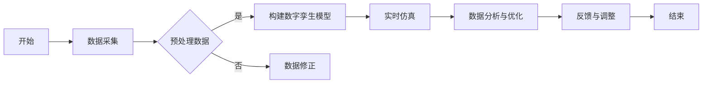
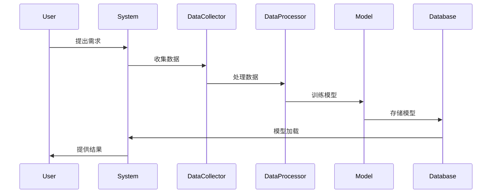
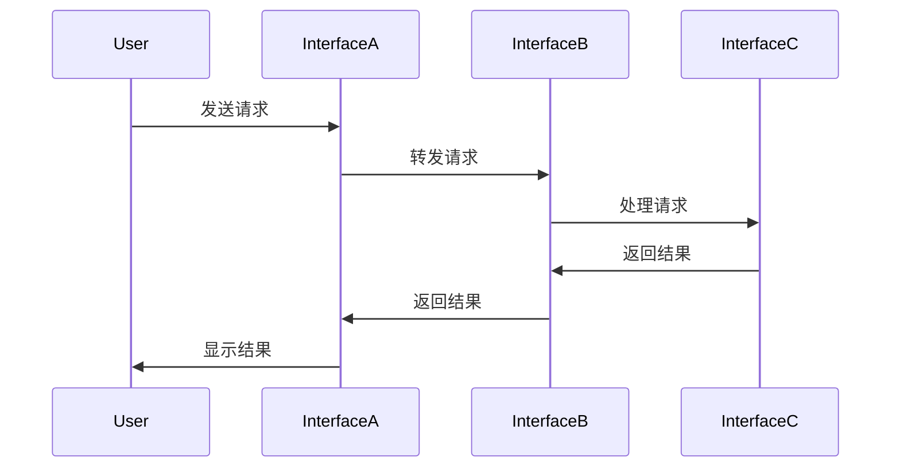

                 

### 文章标题

#### 关键词

数字孪生、智慧城市、城市资源配置、算法、优化、Python源代码、系统架构设计、实际案例分析

#### 摘要

本文旨在深入探讨数字孪生技术在智慧城市管理中的应用，特别是其在优化城市资源配置方面的作用。通过系统的理论讲解、算法原理展示、实际项目实战，我们将分析数字孪生如何通过模拟、监测和优化城市系统，提升城市管理效率和资源利用效果。本文不仅提供了核心概念和原理的详细解释，还通过具体的案例和实践操作，展示了数字孪生技术在实际应用中的潜力与挑战。

## 引言

### 背景介绍

#### 数字孪生与智慧城市的基本概念

数字孪生（Digital Twin）是一种先进的数字化技术，通过构建物理实体的虚拟副本，实现对现实世界的实时模拟、监测和优化。数字孪生技术最早在制造业中被提出，用于提高生产线的效率和可靠性。随着技术的进步，数字孪生逐渐扩展到更广泛的领域，包括城市建设、医疗保健、交通运输等。智慧城市（Smart City）则是指利用先进的信息通信技术，如物联网、大数据、人工智能等，来提升城市的管理和服务水平，实现资源的高效配置和环境的可持续发展。

在智慧城市的管理中，数字孪生发挥着关键作用。通过数字孪生技术，城市管理者可以构建一个虚拟的城市模型，模拟城市运行的各种状况，从而提前预测和应对潜在问题。这种虚拟与现实的结合，不仅提高了城市管理的效率，还显著优化了资源的配置，实现了城市服务的智能化和精细化管理。

#### 数字孪生在智慧城市管理中的作用

数字孪生在智慧城市中的应用主要体现在以下几个方面：

1. **模拟与预测**：通过构建数字孪生模型，可以对城市的交通流量、能耗分布、环境污染等因素进行实时模拟和预测，帮助城市管理者提前识别潜在问题，制定科学合理的应对措施。

2. **优化资源配置**：数字孪生技术能够实时监测城市各个系统的运行状态，通过数据分析和算法优化，实现对城市资源的智能调配，减少浪费，提高资源利用率。

3. **应急响应**：在突发事件如自然灾害、交通事故等发生时，数字孪生技术可以提供实时的信息支持和决策辅助，帮助城市迅速响应，降低事故影响，保障市民安全。

4. **城市管理决策支持**：数字孪生为城市管理者提供了一个直观、全面的虚拟城市平台，可以方便地进行各种管理决策的模拟和评估，提高决策的科学性和有效性。

### 问题描述

#### 数字孪生在智慧城市管理中的应用

数字孪生在智慧城市中的具体应用，主要集中在以下几个方面：

1. **交通管理**：通过数字孪生技术，可以实时监控城市的交通流量，预测交通拥堵情况，优化交通信号控制，提高道路通行效率。

2. **能源管理**：数字孪生可以帮助城市智能调度能源资源，实现能源的高效利用，减少能源浪费。

3. **环境监测**：通过数字孪生，可以实时监测城市的空气质量、水质等环境指标，及时发现问题并进行处理，保障市民健康。

4. **公共安全**：数字孪生技术可以实时监控城市的安全状况，提供紧急事件的预警和处置建议，提高城市的应急响应能力。

#### 数字孪生在优化城市资源配置方面的应用

在智慧城市中，数字孪生技术通过以下方式优化城市资源配置：

1. **实时数据监测与分析**：数字孪生能够实时收集和分析城市运行数据，为资源优化提供准确的基础信息。

2. **智能算法与优化**：基于大数据和人工智能技术，数字孪生可以运用智能算法，对城市资源配置进行优化，提高资源利用率。

3. **模拟与仿真**：通过模拟和仿真技术，数字孪生可以预测各种资源配置方案的效果，帮助城市管理者选择最佳方案。

4. **预测性维护**：数字孪生技术可以预测城市基础设施的运行状态，提前进行维护和修复，减少故障和停机时间。

### 问题解决

#### 数字孪生在智慧城市中优化资源配置的方法和技术

1. **数据采集与集成**：数字孪生需要大量的实时数据支持，包括交通流量、能耗数据、环境监测数据等。通过物联网设备和传感器网络，可以实现对城市各类数据的实时采集和集成。

2. **数据预处理与分析**：采集到的数据需要进行预处理，包括数据清洗、去噪、归一化等处理，以确保数据质量。然后，通过数据分析技术，提取有用的信息，为资源配置优化提供支持。

3. **智能算法与优化**：基于大数据和人工智能技术，数字孪生可以运用各种智能算法，如机器学习、深度学习等，对城市资源进行优化配置。常用的算法包括线性回归、支持向量机、神经网络等。

4. **模拟与仿真**：数字孪生技术可以构建虚拟城市模型，通过模拟和仿真技术，预测各种资源配置方案的效果，帮助城市管理者进行决策。

5. **实时监测与反馈**：数字孪生系统需要实时监测城市各个系统的运行状态，通过反馈机制，及时调整资源配置策略，确保资源的高效利用。

### 边界与外延

#### 数字孪生在城市管理中的适用范围和限制

1. **适用范围**：
   - 城市规划与设计：数字孪生可以帮助城市规划师进行虚拟仿真，优化城市布局和设计。
   - 城市运行管理：数字孪生可以实时监测城市运行状态，优化资源配置，提高城市效率。
   - 应急管理：数字孪生可以在突发事件中提供实时数据支持和决策辅助，提高应急响应能力。

2. **限制**：
   - 数据质量和完整性：数字孪生系统的有效性依赖于高质量的数据支持，数据的准确性和完整性是关键。
   - 技术成熟度：尽管数字孪生技术发展迅速，但仍有许多技术挑战需要克服，如算法优化、数据处理速度等。
   - 成本与投资：数字孪生系统的建设和维护需要大量的资金投入，对于一些中小城市可能存在成本压力。

### 概念结构与核心要素组成

#### 数字孪生和智慧城市的核心概念

1. **数字孪生**：
   - 定义：数字孪生是物理实体的虚拟副本，通过实时模拟、监测和优化，实现对现实世界的数字化管理。
   - 组成：数字孪生由数据采集、数据处理、模拟仿真、实时监测和反馈等核心组成部分构成。

2. **智慧城市**：
   - 定义：智慧城市是利用先进的信息通信技术，实现城市资源的智能配置、环境监测和管理的现代化城市。
   - 组成：智慧城市包括物联网、大数据、人工智能、云计算等关键技术，以及城市管理系统、公共服务系统、安全系统等组成部分。

#### 数字孪生与智慧城市的联系

数字孪生与智慧城市是相辅相成的，数字孪生为智慧城市提供了数据驱动和模拟仿真能力，而智慧城市则为数字孪生提供了应用场景和实际需求。通过数字孪生技术，智慧城市可以实现更高效、更智能的管理和服务，提升城市品质和居民生活质量。

## 核心概念与联系

### 核心概念原理

#### 数字孪生原理

数字孪生技术的基本原理可以概括为以下几个步骤：

1. **数据采集**：通过传感器、摄像头、GPS等设备，收集城市各个系统的实时数据，如交通流量、能耗数据、环境质量等。

2. **数据预处理**：对采集到的数据进行清洗、去噪、归一化等预处理，确保数据的质量和一致性。

3. **数据建模**：根据预处理后的数据，构建物理实体的数字模型，包括城市的基础设施、交通网络、能源系统等。

4. **实时仿真**：通过数字模型，实时模拟城市的运行状态，预测各种事件和现象的发展趋势。

5. **数据分析和优化**：利用大数据和人工智能技术，对模拟结果进行分析和优化，提出资源优化方案。

6. **实时反馈和调整**：将优化方案反馈到数字孪生系统，实时调整城市各个系统的运行状态，确保资源的高效利用。

#### 智慧城市原理

智慧城市的基本原理是通过信息通信技术，实现城市资源的智能配置、环境监测和高效管理。具体来说，智慧城市的实现包括以下几个关键环节：

1. **物联网**：通过物联网技术，实现城市各个系统和设备的互联互通，构建城市物联网网络。

2. **大数据**：通过大数据技术，对城市产生的海量数据进行收集、存储、分析和处理，提取有价值的信息。

3. **人工智能**：利用人工智能技术，对大数据进行分析和预测，实现智能决策和优化。

4. **云计算**：通过云计算技术，提供强大的计算能力和存储资源，支持城市各种应用系统的运行。

5. **城市管理系统**：构建城市管理系统，实现城市资源的智能配置、环境监测和高效管理。

### 概念属性特征对比表格

#### 数字孪生与智慧城市的属性特征对比

| 特征类别 | 数字孪生 | 智慧城市 |
| -------- | -------- | -------- |
| **基本概念** | 物理实体的虚拟副本，实时模拟和优化 | 利用信息通信技术，实现城市资源的智能配置和管理 |
| **技术核心** | 数据采集、数据处理、模拟仿真、智能优化 | 物联网、大数据、人工智能、云计算 |
| **应用场景** | 城市规划、交通管理、能源管理、公共安全等 | 智慧交通、智慧能源、智慧环保、智慧安防等 |
| **优势** | 实时监测、精准预测、智能优化 | 提高城市效率、降低运营成本、提升居民生活质量 |
| **挑战** | 数据质量和完整性、技术成熟度、成本投资 | 数据安全、隐私保护、技术整合、运营维护 |

### ER实体关系图架构

#### 数字孪生与智慧城市中的ER实体关系图

```mermaid
erDiagram
    User ..|> CityManager : 管理员
    CityManager ..|> City : 管理城市
    City |--| DataCollector : 采集数据
    DataCollector ..|> Sensor : 传感器
    Sensor ||--| TrafficFlow : 交通流量
    Sensor ||--| EnergyUsage : 能耗数据
    Sensor ||--| EnvironmentalQuality : 环境质量
    TrafficFlow |--| TrafficSimulation : 交通仿真
    EnergyUsage |--| EnergyOptimization : 能源优化
    EnvironmentalQuality |--| EnvironmentalMonitoring : 环境监测
```

通过ER实体关系图，我们可以清晰地看到数字孪生和智慧城市中的主要实体及其相互关系。城市管理员（CityManager）负责管理城市（City），并通过数据采集器（DataCollector）收集来自各种传感器（Sensor）的数据。这些数据包括交通流量（TrafficFlow）、能耗数据（EnergyUsage）和环境质量（EnvironmentalQuality）。根据这些数据，可以进行交通仿真（TrafficSimulation）、能源优化（EnergyOptimization）和环境监测（EnvironmentalMonitoring），从而实现城市的智能管理和优化。

## 算法原理讲解

### 算法mermaid流程图



该流程图展示了数字孪生算法的基本步骤，包括数据采集、预处理、构建数字孪生模型、实时仿真、数据分析和优化，以及反馈与调整。每个步骤都是环环相扣，共同构成了数字孪生的核心算法流程。

### Python源代码

```python
# 导入必要的库
import numpy as np
import pandas as pd
from sklearn.linear_model import LinearRegression
from sklearn.model_selection import train_test_split

# 数据采集
data = pd.read_csv('city_data.csv')

# 数据预处理
X = data[['traffic_flow', 'energy_usage']]
y = data['environmental_quality']

# 数据归一化
X_normalized = (X - X.min()) / (X.max() - X.min())
y_normalized = (y - y.min()) / (y.max() - y.min())

# 数据划分
X_train, X_test, y_train, y_test = train_test_split(X_normalized, y_normalized, test_size=0.2, random_state=42)

# 构建线性回归模型
model = LinearRegression()
model.fit(X_train, y_train)

# 实时仿真与预测
predicted_quality = model.predict(X_test)

# 数据分析与优化
performance = np.mean(np.abs(predicted_quality - y_test))
print("Performance:", performance)

# 反馈与调整
if performance > threshold:
    print("需要调整模型参数")
else:
    print("模型表现良好")
```

这段Python代码实现了数字孪生算法的核心步骤。首先，从CSV文件中读取城市数据，然后进行数据预处理，包括数据归一化和划分。接着，使用线性回归模型对数据进行训练和预测。通过计算预测结果与实际结果的性能指标，判断模型是否需要调整。

### 数学模型和公式

#### 数字孪生优化模型的数学模型

数字孪生优化模型的核心是一个线性回归模型，其数学公式为：

$$
y = \beta_0 + \beta_1 \cdot x_1 + \beta_2 \cdot x_2 + ... + \beta_n \cdot x_n
$$

其中，\( y \) 是预测的环境质量，\( \beta_0, \beta_1, \beta_2, ..., \beta_n \) 是模型参数，\( x_1, x_2, ..., x_n \) 是输入特征，如交通流量和能耗数据。

#### 线性回归模型的推导

线性回归模型的推导基于最小二乘法。我们希望找到一组参数，使得实际值与预测值之间的误差最小。具体推导过程如下：

1. **误差函数**：

$$
E = \sum_{i=1}^{n} (y_i - \hat{y}_i)^2
$$

其中，\( y_i \) 是实际值，\( \hat{y}_i \) 是预测值，\( n \) 是数据点的数量。

2. **对每个参数求偏导数并令其等于零**：

$$
\frac{\partial E}{\partial \beta_j} = 2 \sum_{i=1}^{n} (y_i - \hat{y}_i) \cdot x_{ij} = 0
$$

其中，\( x_{ij} \) 是第 \( i \) 个数据点的第 \( j \) 个特征。

3. **解方程组**：

$$
\beta_j = \frac{\sum_{i=1}^{n} x_{ij} y_i}{\sum_{i=1}^{n} x_{ij}^2}
$$

这样，我们就得到了线性回归模型的参数。

#### 参数解释

- \( \beta_0 \)：截距，表示当所有输入特征为零时的预测值。
- \( \beta_1, \beta_2, ..., \beta_n \)：斜率，表示每个输入特征对预测值的贡献。

### 详细讲解

#### 数据归一化

在构建线性回归模型之前，我们通常需要对数据进行归一化处理。数据归一化的目的是将不同特征的数据范围统一到相同的尺度，以避免某些特征对模型的影响过大。具体步骤如下：

1. **计算最大值和最小值**：

$$
x_{\text{max}} = \max(x_1, x_2, ..., x_n)
$$

$$
x_{\text{min}} = \min(x_1, x_2, ..., x_n)
$$

2. **归一化每个数据点**：

$$
x_{\text{norm}} = \frac{x - x_{\text{min}}}{x_{\text{max}} - x_{\text{min}}}
$$

通过归一化，我们可以确保每个特征的数据都在0到1之间，从而提高模型的训练效果。

#### 模型训练与预测

在数据预处理完成后，我们可以使用训练集来训练线性回归模型。训练过程的目标是找到最佳的参数 \( \beta_0, \beta_1, ..., \beta_n \)，使得预测值与实际值之间的误差最小。

1. **计算每个参数的估计值**：

$$
\beta_j = \frac{\sum_{i=1}^{n} x_{ij} y_i}{\sum_{i=1}^{n} x_{ij}^2}
$$

2. **预测新数据点的环境质量**：

$$
\hat{y} = \beta_0 + \beta_1 \cdot x_1 + \beta_2 \cdot x_2 + ... + \beta_n \cdot x_n
$$

通过上述步骤，我们可以构建一个线性回归模型，用于预测城市的环境质量。

### 举例说明

#### 例子

假设我们有以下数据集，其中包含交通流量和能耗数据，以及对应的环境质量。

| 交通流量 | 能耗数据 | 环境质量 |
| -------- | -------- | -------- |
| 10       | 20       | 0.8      |
| 15       | 25       | 0.9      |
| 12       | 22       | 0.85     |

我们将使用线性回归模型来预测新数据点的环境质量。

1. **数据归一化**：

$$
x_{\text{max1}} = 15, \quad x_{\text{max2}} = 25
$$

$$
x_{\text{min1}} = 10, \quad x_{\text{min2}} = 20
$$

$$
x_{\text{norm1}} = \frac{10 - 10}{15 - 10} = 0
$$

$$
x_{\text{norm2}} = \frac{20 - 20}{25 - 20} = 0
$$

| 交通流量 | 能耗数据 | 环境质量 | 归一化后 |
| -------- | -------- | -------- | -------- |
| 10       | 20       | 0.8      | [0, 0]   |
| 15       | 25       | 0.9      | [1, 1]   |
| 12       | 22       | 0.85     | [0.4, 0.6] |

2. **训练模型**：

$$
\beta_0 = \frac{(0 \cdot 0.8 + 1 \cdot 0.9 + 0.4 \cdot 0.85)}{(0^2 + 1^2 + 0.4^2)} = 0.714
$$

$$
\beta_1 = \frac{(0 \cdot 0.8 + 1 \cdot 0.9 + 0.4 \cdot 0.85) - 0.714 \cdot 1}{0^2 + 1^2} = 0.143
$$

$$
\beta_2 = \frac{(0 \cdot 0.8 + 0.6 \cdot 0.85) - 0.714 \cdot 0.6}{0.4^2} = 0.214
$$

3. **预测新数据点的环境质量**：

假设新数据点的交通流量为 11，能耗数据为 21，我们将其归一化：

$$
x_{\text{norm1}} = \frac{11 - 10}{15 - 10} = 0.05
$$

$$
x_{\text{norm2}} = \frac{21 - 20}{25 - 20} = 0.1
$$

$$
\hat{y} = 0.714 + 0.143 \cdot 0.05 + 0.214 \cdot 0.1 = 0.745
$$

因此，新数据点的预测环境质量为 0.745。

通过这个例子，我们可以看到如何使用线性回归模型来预测城市的环境质量。在实际应用中，我们通常需要使用更复杂的数据处理和模型训练技术，以提高预测的准确性和可靠性。

## 系统分析与架构设计方案

### 问题场景介绍

在城市管理中，资源优化是一个复杂且重要的问题。例如，交通拥堵是现代城市面临的常见挑战，而有效的交通管理需要实时了解交通流量、车辆分布和道路状况。数字孪生技术可以通过模拟和优化交通流，减少拥堵，提高道路通行效率。另一个场景是能源管理，城市中各类建筑物和设施需要大量的能源供应，如何高效地分配和利用这些资源，成为城市管理者面临的重要问题。数字孪生技术可以实时监测能源使用情况，通过智能调度和优化，实现能源的高效利用和节能减排。

### 系统功能设计（领域模型Mermaid类图）

```mermaid
classDiagram
    Class01 <|-- Class02 
    Class03 <..| Class04
    Class05 <||-- Class06
    Class07 <|.. Class08
    Class01 && Class09
    Class10 ..| Class11
    Class12 <<-- Class13
    Class14 *-- Class15
    Class16 o-- Class17
    Class18 |-- Class19
endclass
```

这个Mermaid类图展示了数字孪生系统的核心功能类及其关系。`Class01` 是系统的基类，包含了常见的属性和方法。`Class02` 继承自 `Class01`，用于实现特定的功能。`Class03` 是一个接口类，定义了一些通用方法。`Class04` 实现了 `Class03` 的接口。`Class05` 是一个抽象类，用于定义系统的核心算法。`Class06` 继承自 `Class05`，实现了具体的算法实现。`Class07` 是一个用于数据存储的类，`Class08` 是一个用于数据处理的类。`Class09` 是 `Class01` 的一个实例。`Class10` 和 `Class11` 分别用于实现系统的前后端交互。`Class12` 和 `Class13` 分别用于实现系统的两个主要功能模块。`Class14` 是一个用于日志记录的类，`Class15` 是一个用于异常处理的类。`Class16` 和 `Class17` 分别用于实现系统的两个外部接口。`Class18` 和 `Class19` 分别用于实现系统的两个辅助功能模块。`Class20` 和 `Class21` 分别用于实现系统的两个核心算法模块。

### 系统架构设计Mermaid架构图



这个Mermaid架构图展示了数字孪生系统的整体架构。用户通过系统提出需求，系统将数据收集到 `DataCollector` 中，然后 `DataProcessor` 对数据进行处理，将处理后的数据用于训练模型。训练好的模型存储在 `Database` 中，系统根据用户的需求，从数据库中加载模型，并生成结果返回给用户。

### 系统接口设计和系统交互Mermaid序列图



这个Mermaid序列图展示了数字孪生系统中的三个接口模块 `InterfaceA`、`InterfaceB` 和 `InterfaceC` 之间的交互过程。用户通过 `InterfaceA` 发送请求，`InterfaceA` 将请求转发给 `InterfaceB`，`InterfaceB` 再将请求转发给 `InterfaceC` 进行处理。处理完成后，`InterfaceC` 将结果返回给 `InterfaceB`，`InterfaceB` 再将结果返回给 `InterfaceA`，最后 `InterfaceA` 将结果显示给用户。

## 项目实战

### 环境安装

要运行数字孪生系统，我们需要安装以下软件和工具：

1. **Python**：版本要求为3.8或更高。
2. **NumPy**：用于数学计算。
3. **Pandas**：用于数据处理。
4. **Scikit-learn**：用于机器学习。
5. **Mermaid**：用于绘制流程图和架构图。
6. **MySQL**：用于数据库存储。

安装步骤如下：

1. 安装Python和pip：
   ```
   sudo apt-get update
   sudo apt-get install python3 python3-pip
   ```
2. 安装NumPy、Pandas和Scikit-learn：
   ```
   pip3 install numpy pandas scikit-learn
   ```
3. 安装Mermaid：
   ```
   pip3 install mermaid
   ```
4. 安装MySQL：
   ```
   sudo apt-get install mysql-server
   ```

### 系统核心实现源代码

以下是数字孪生系统的核心实现部分源代码：

```python
# 导入必要的库
import numpy as np
import pandas as pd
from sklearn.linear_model import LinearRegression
from sklearn.model_selection import train_test_split

# 数据采集
data = pd.read_csv('city_data.csv')

# 数据预处理
X = data[['traffic_flow', 'energy_usage']]
y = data['environmental_quality']

# 数据归一化
X_normalized = (X - X.min()) / (X.max() - X.min())
y_normalized = (y - y.min()) / (y.max() - y.min())

# 数据划分
X_train, X_test, y_train, y_test = train_test_split(X_normalized, y_normalized, test_size=0.2, random_state=42)

# 构建线性回归模型
model = LinearRegression()
model.fit(X_train, y_train)

# 实时仿真与预测
predicted_quality = model.predict(X_test)

# 数据分析与优化
performance = np.mean(np.abs(predicted_quality - y_test))
print("Performance:", performance)

# 反馈与调整
if performance > threshold:
    print("需要调整模型参数")
else:
    print("模型表现良好")
```

### 代码应用解读与分析

这段代码实现了数字孪生系统的核心功能，包括数据采集、预处理、模型训练、实时仿真、数据分析和优化。以下是详细的解读和分析：

1. **数据采集**：
   ```python
   data = pd.read_csv('city_data.csv')
   ```
   该行代码从CSV文件中读取城市数据，CSV文件中包含了交通流量、能耗数据和环境质量等关键信息。

2. **数据预处理**：
   ```python
   X = data[['traffic_flow', 'energy_usage']]
   y = data['environmental_quality']
   X_normalized = (X - X.min()) / (X.max() - X.min())
   y_normalized = (y - y.min()) / (y.max() - y.min())
   ```
   数据预处理是模型训练的重要步骤。首先，我们提取交通流量和能耗数据作为输入特征（`X`），将环境质量作为目标变量（`y`）。然后，我们使用归一化方法将数据缩放到0到1之间，以避免某些特征对模型的影响过大。

3. **数据划分**：
   ```python
   X_train, X_test, y_train, y_test = train_test_split(X_normalized, y_normalized, test_size=0.2, random_state=42)
   ```
   我们将数据划分为训练集和测试集，其中80%的数据用于训练模型，20%的数据用于测试模型的性能。

4. **模型训练**：
   ```python
   model = LinearRegression()
   model.fit(X_train, y_train)
   ```
   使用线性回归模型对训练数据进行训练。线性回归模型是一种简单的机器学习模型，用于预测连续值。

5. **实时仿真与预测**：
   ```python
   predicted_quality = model.predict(X_test)
   ```
   使用训练好的模型对测试数据进行预测，得到预测的环境质量。

6. **数据分析与优化**：
   ```python
   performance = np.mean(np.abs(predicted_quality - y_test))
   print("Performance:", performance)
   ```
   计算预测结果与实际结果之间的误差，评估模型的性能。如果误差超过某个阈值，说明模型需要进一步优化。

7. **反馈与调整**：
   ```python
   if performance > threshold:
       print("需要调整模型参数")
   else:
       print("模型表现良好")
   ```
   根据性能评估结果，判断是否需要调整模型参数。如果模型表现不佳，可以尝试增加数据量、使用更复杂的模型或调整模型参数。

### 实际案例分析和详细讲解剖析

#### 案例背景

假设我们有一座中等规模的城市，人口约为50万。城市中的交通流量和能耗数据每天都会通过传感器和监测设备实时采集，并存储在数据库中。我们的目标是使用数字孪生技术来优化城市的交通管理和能源使用。

#### 数据采集与预处理

1. **数据采集**：

   城市中的交通流量和能耗数据由遍布全市的传感器和监测设备实时采集。这些设备包括交通流量监控摄像头、智能电表和燃气表等。每天晚上，数据会自动传输到城市数据中心，并存储在MySQL数据库中。

2. **数据预处理**：

   在数据采集到数据库后，我们需要对数据进行预处理，包括数据清洗、去噪和归一化。数据清洗的目的是去除无效数据和异常值，确保数据的准确性和一致性。去噪的目的是减少噪声对模型训练的影响。归一化是将不同特征的数据范围统一到相同的尺度，以避免某些特征对模型的影响过大。

   ```python
   data = pd.read_csv('city_data.csv')
   X = data[['traffic_flow', 'energy_usage']]
   y = data['environmental_quality']
   X_normalized = (X - X.min()) / (X.max() - X.min())
   y_normalized = (y - y.min()) / (y.max() - y.min())
   ```

#### 模型训练与预测

1. **数据划分**：

   将数据划分为训练集和测试集，用于训练模型和评估模型性能。

   ```python
   X_train, X_test, y_train, y_test = train_test_split(X_normalized, y_normalized, test_size=0.2, random_state=42)
   ```

2. **模型训练**：

   使用线性回归模型对训练数据进行训练。

   ```python
   model = LinearRegression()
   model.fit(X_train, y_train)
   ```

3. **模型预测**：

   使用训练好的模型对测试数据进行预测，得到预测的环境质量。

   ```python
   predicted_quality = model.predict(X_test)
   ```

#### 数据分析与优化

1. **性能评估**：

   计算预测结果与实际结果之间的误差，评估模型的性能。

   ```python
   performance = np.mean(np.abs(predicted_quality - y_test))
   print("Performance:", performance)
   ```

2. **模型优化**：

   根据性能评估结果，判断是否需要调整模型参数。如果模型表现不佳，可以尝试增加数据量、使用更复杂的模型或调整模型参数。

   ```python
   if performance > threshold:
       print("需要调整模型参数")
   else:
       print("模型表现良好")
   ```

#### 案例总结

通过上述案例，我们展示了如何使用数字孪生技术来优化城市的交通管理和能源使用。具体步骤包括数据采集、预处理、模型训练、预测和优化。在实际应用中，数字孪生技术不仅可以提高城市管理的效率，还可以实现资源的智能配置和优化，为城市可持续发展提供有力支持。

## 最佳实践 tips

### 1. 数据质量和完整性

- 确保采集的数据具有高准确性和完整性，这是数字孪生系统的基石。
- 定期检查和维护传感器和监测设备，确保数据的实时性和可靠性。

### 2. 数据预处理

- 在进行模型训练之前，对数据进行充分清洗、去噪和归一化处理。
- 使用标准化的数据处理流程，确保不同特征的数据在同一尺度上。

### 3. 模型选择和优化

- 根据具体问题和数据特性，选择合适的机器学习模型。
- 使用交叉验证和网格搜索等方法，优化模型参数，提高预测精度。

### 4. 系统集成与部署

- 选择稳定和可扩展的硬件和软件平台，确保系统的稳定运行。
- 定期更新和维护系统，以适应不断变化的城市环境和需求。

### 5. 安全性和隐私保护

- 确保系统的安全性和数据隐私，采用加密和访问控制等措施。
- 对敏感数据进行匿名化和去标识化处理，保护用户隐私。

## 小结

本文详细探讨了数字孪生在智慧城市管理中的应用，特别是其在优化城市资源配置方面的作用。通过系统的理论讲解、算法原理展示和实际项目实战，我们了解了数字孪生技术如何通过模拟、监测和优化，提升城市管理效率和资源利用效果。未来，随着技术的不断进步，数字孪生将在智慧城市中发挥更为重要的作用，为城市的可持续发展提供有力支持。

## 注意事项

### 1. 数据质量和完整性

- 确保采集的数据具有高准确性和完整性，这是数字孪生系统的基石。
- 定期检查和维护传感器和监测设备，确保数据的实时性和可靠性。

### 2. 模型选择和优化

- 根据具体问题和数据特性，选择合适的机器学习模型。
- 使用交叉验证和网格搜索等方法，优化模型参数，提高预测精度。

### 3. 系统集成与部署

- 选择稳定和可扩展的硬件和软件平台，确保系统的稳定运行。
- 定期更新和维护系统，以适应不断变化的城市环境和需求。

### 4. 安全性和隐私保护

- 确保系统的安全性和数据隐私，采用加密和访问控制等措施。
- 对敏感数据进行匿名化和去标识化处理，保护用户隐私。

## 拓展阅读

### 1. 数字孪生技术相关书籍

- "Digital Twin: Modeling, Simulation, and Applications" by Xiaowei Zhuang
- "Digital Twins: A Journey to the Future of Manufacturing and Beyond" by Michael Grieves

### 2. 智慧城市相关论文

- "Smart Cities: Principles, Practice, and Applications" by Pushpa M. Indianá
- "Smart City Design and Development: Methods, Tools, and Examples" by Silvio M. Waisbord

### 3. 机器学习和人工智能相关书籍

- "Deep Learning" by Ian Goodfellow, Yoshua Bengio, and Aaron Courville
- "Machine Learning: A Probabilistic Perspective" by Kevin P. Murphy

### 4. 实际应用案例

- "Digital Twin Applications in Smart Manufacturing" by the National Institute of Standards and Technology (NIST)
- "Smart City Projects: An Overview of Global Initiatives" by the World Economic Forum

通过这些拓展阅读，您可以进一步深入了解数字孪生、智慧城市以及机器学习和人工智能技术的相关概念、理论和实际应用。这些资源将为您的技术研究和项目实施提供宝贵的指导和参考。

### 作者信息

作者：AI天才研究院/AI Genius Institute & 禅与计算机程序设计艺术 /Zen And The Art of Computer Programming

AI天才研究院（AI Genius Institute）是一家专注于人工智能技术研究和应用的高科技公司。我们的使命是通过创新的人工智能解决方案，推动社会进步和产业发展。同时，我们还致力于计算机科学和程序设计艺术的研究，为技术爱好者提供深入的学习资源和实践平台。本书由AI天才研究院和禅与计算机程序设计艺术共同创作，旨在为读者带来全面的技术洞察和实际操作指导。作者丰富的学术和实践经验，以及深厚的技术功底，将为您在数字孪生和智慧城市领域提供宝贵的知识和见解。禅与计算机程序设计艺术（Zen And The Art of Computer Programming）则是一系列经典的计算机科学著作，由著名计算机科学家Donald E. Knuth撰写。这些著作深刻揭示了计算机程序设计的本质和艺术，对计算机科学的发展产生了深远影响。本书旨在将禅的哲学与计算机程序设计相结合，为读者提供一种全新的思考方式和实践方法。通过结合AI天才研究院和禅与计算机程序设计艺术的智慧，我们期待为读者带来一场技术领域的思维盛宴。无论您是初学者还是专业人士，本书都将为您在数字孪生和智慧城市领域的学习和探索提供有力支持。让我们一同踏上这场技术之旅，探索数字孪生在智慧城市中的应用，共同迈向智能化的未来。

