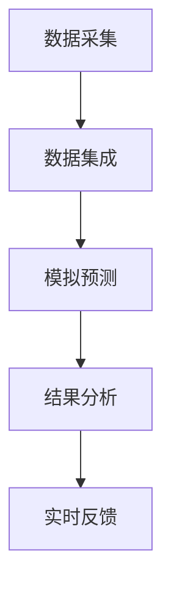
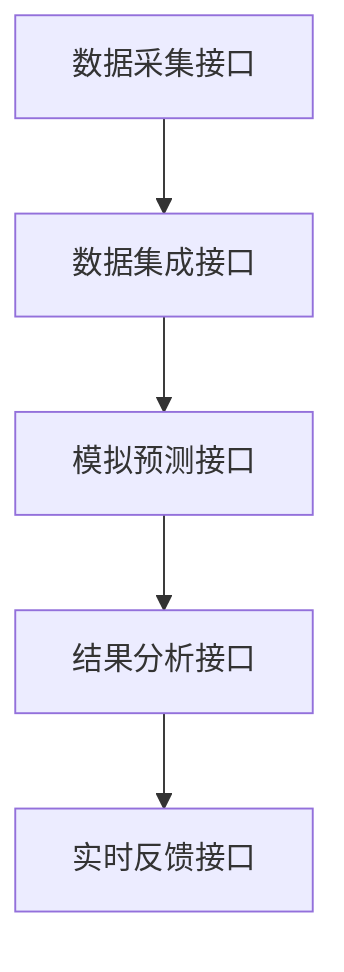
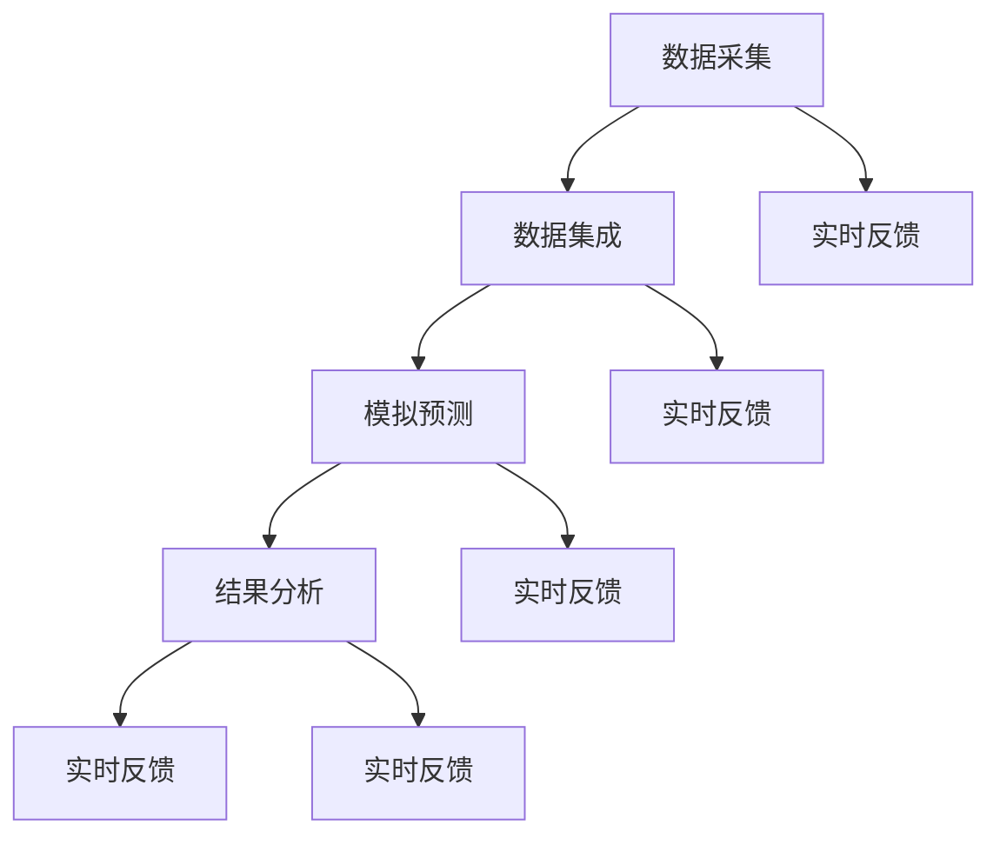
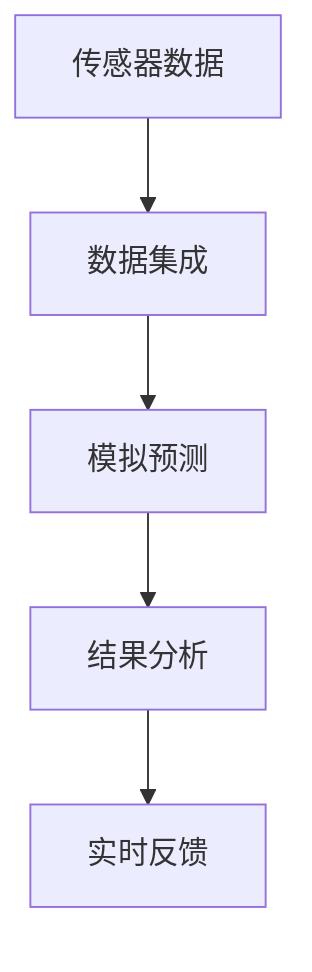
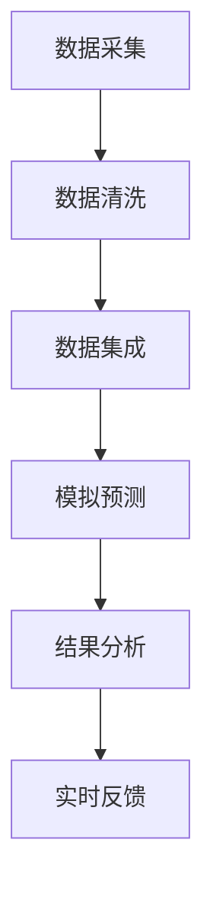

                 

# 数字孪生在智慧城市能源管理中的应用

## 关键词

- 数字孪生
- 智慧城市
- 能源管理
- 数据集成
- 预测分析
- 模拟技术

## 摘要

本文深入探讨了数字孪生技术在智慧城市能源管理中的应用。首先，我们介绍了数字孪生的基本概念、特性及其在能源管理中的潜力。接着，文章分析了当前智能城市能源管理的现状和趋势，为后续的技术探讨奠定了基础。随后，我们详细介绍了数字孪生在能源管理中的应用技术，包括数据采集、集成和模拟预测等关键环节。文章还通过具体的系统架构设计和项目实战案例，展示了数字孪生在智慧城市能源管理中的实际应用和效果。最后，文章总结了数字孪生技术在智慧城市能源管理中的最佳实践，并对未来发展方向进行了展望。

## 引言

### 1.1 数字孪生背景

#### 问题背景与描述

随着城市化进程的加快，能源消耗问题日益突出。传统城市能源管理系统往往存在能耗高、效率低、响应慢等问题。如何实现高效、智能的能源管理，已成为智慧城市建设的关键挑战。数字孪生技术的出现，为解决这一问题提供了新的思路。

#### 问题解决方案

数字孪生（Digital Twin）是一种基于物理实体和虚拟模型的融合技术，能够实现对现实世界的模拟和预测。在智慧城市能源管理中，数字孪生可以通过构建能源系统的虚拟模型，实现对实际能源系统的实时监控、预测和优化。具体来说，数字孪生技术具备以下几个方面的优势：

1. **实时监测与预测**：通过实时采集和分析能源系统的运行数据，数字孪生可以实现对能源消耗和设备状态的实时监测，提前预测潜在故障和能源浪费。
2. **系统优化与调整**：基于虚拟模型，数字孪生可以模拟不同能源管理策略的效果，帮助决策者制定最优的能源管理方案。
3. **智能维护与优化**：数字孪生可以模拟设备运行状态，预测设备故障时间，实现智能维护和优化，降低能源消耗和维护成本。

#### 边界与外延

本文主要探讨数字孪生在智慧城市能源管理中的应用，涵盖数据采集、集成、模拟预测等关键技术，以及系统架构设计和项目实战案例。同时，本文也将探讨数字孪生技术在智慧城市其他领域的潜在应用，如交通管理、环境保护等。

### 1.2 数字孪生基本概念

#### 定义与特点

数字孪生是一种将物理实体和虚拟模型相结合的技术，通过构建与实际系统高度一致的虚拟模型，实现对现实世界的模拟和预测。数字孪生的基本特点包括：

1. **高精度建模**：数字孪生模型能够精确模拟现实世界中的物理系统，包括设备、传感器、环境等因素。
2. **实时数据采集**：数字孪生能够实时采集物理系统的运行数据，如温度、湿度、能耗等，并将其传输到虚拟模型中进行处理和分析。
3. **多维度交互**：数字孪生模型不仅能够模拟物理系统的运行状态，还可以通过图形界面与用户进行交互，提供直观的展示和操作体验。

#### 应用领域

数字孪生技术在多个领域得到了广泛应用，包括工业制造、医疗健康、航空航天、交通运输等。在智慧城市能源管理中，数字孪生技术可以应用于以下几个方面：

1. **能源系统优化**：通过模拟不同能源管理策略的效果，实现能源系统的优化和调整，降低能源消耗。
2. **设备维护预测**：基于虚拟模型，预测设备的故障时间和维护需求，实现智能维护和优化。
3. **能耗监控与管理**：实时监测能源系统的运行状态，识别能耗异常，优化能源使用。

### 1.3 当前智能城市能源管理现状与趋势

#### 智能城市能源管理概述

智能城市能源管理是指利用信息技术、物联网、大数据等先进技术，实现对城市能源系统的全面监控、管理和优化。当前，智能城市能源管理主要包括以下几个方面的内容：

1. **能源监测与监控**：通过传感器和物联网技术，实时监测能源系统的运行状态，如电力、燃气、热力等。
2. **能源预测与调度**：基于历史数据和预测模型，对能源需求进行预测和调度，实现供需平衡。
3. **能源优化与控制**：通过智能算法和优化策略，实现对能源系统的优化和调整，降低能耗和成本。

#### 智能城市能源管理发展趋势

随着技术的不断进步，智能城市能源管理呈现出以下几个发展趋势：

1. **数据驱动**：利用大数据技术和人工智能算法，实现能源系统的智能预测和优化。
2. **平台化**：通过构建统一的能源管理平台，实现对多种能源类型的综合管理和优化。
3. **个性化**：根据不同用户的需求，提供个性化的能源管理方案和服务。
4. **绿色化**：推动可再生能源的应用，实现能源系统的绿色化和可持续发展。

### 1.4 数字孪生在能源管理中的应用前景

数字孪生技术在智慧城市能源管理中的应用前景十分广阔。随着技术的不断成熟和应用的深入，数字孪生技术有望在以下几个方面发挥重要作用：

1. **智能运维**：通过数字孪生技术，实现对能源设备的智能运维，提高设备运行效率和可靠性。
2. **节能降耗**：通过数字孪生技术，实现对能源系统的优化和控制，降低能源消耗和成本。
3. **决策支持**：通过数字孪生技术，为能源管理者提供准确的预测和决策支持，提高管理效率和决策质量。
4. **智能化升级**：通过数字孪生技术，推动能源系统的智能化升级，实现智慧城市能源管理的新突破。

### 1.5 本文结构

本文共分为六个部分，首先介绍了数字孪生的基本概念和特性，然后分析了智能城市能源管理的现状和趋势，接着详细介绍了数字孪生在能源管理中的应用技术，包括数据采集、集成和模拟预测等。第四部分通过具体的系统架构设计和项目实战案例，展示了数字孪生在智慧城市能源管理中的实际应用和效果。第五部分总结了数字孪生技术在智慧城市能源管理中的最佳实践，并对未来发展方向进行了展望。最后，本文给出了本文的关键词和摘要。

## 数字孪生技术在智慧城市能源管理中的应用

### 2.1 数据采集

数据采集是数字孪生技术在智慧城市能源管理中的第一步，也是至关重要的一步。准确、全面的数据采集能够为后续的数据处理、分析和预测提供可靠的依据。

#### 数据来源

在智慧城市能源管理中，数据来源主要包括以下几个方面：

1. **传感器数据**：通过安装在能源设备、电网、燃气管道等位置的传感器，实时采集温度、湿度、压力、流量、电压、电流等参数。
2. **物联网数据**：通过物联网技术，实现对能源设备、仪表、阀门等设备的实时监控和远程控制，获取设备状态和运行数据。
3. **历史数据**：利用已有的能源管理系统，获取历史能耗数据、设备运行数据等，为数据分析和预测提供基础。
4. **外部数据**：通过互联网、气象数据等，获取与能源系统相关的环境数据、政策法规等。

#### 数据采集技术

1. **无线传感器网络**：利用无线传感器网络，实现对能源设备的实时监测和数据采集。无线传感器网络具有低功耗、自组织、自适应等特点，能够适应复杂环境。
2. **边缘计算**：在数据采集阶段，利用边缘计算技术，对传感器数据进行实时处理和初步分析，减少数据传输量和网络负载。
3. **数据采集协议**：采用标准化的数据采集协议，如Modbus、OPC UA、BACnet等，确保不同设备之间的数据兼容性和互操作性。

#### 数据采集注意事项

1. **数据质量**：确保数据采集的准确性、完整性和一致性，避免数据错误和丢失。
2. **数据安全性**：加强数据传输和存储过程中的安全性，防止数据泄露和篡改。
3. **数据传输效率**：优化数据传输协议和传输路径，提高数据传输效率，减少延迟。

### 2.2 数据集成

数据集成是将来自不同数据源的数据进行整合、清洗和转换，形成统一的数据视图的过程。在智慧城市能源管理中，数据集成至关重要，因为能源系统涉及多种数据类型和多个数据源，如传感器数据、物联网数据、历史数据、外部数据等。

#### 数据集成技术

1. **数据仓库**：通过建立数据仓库，实现对多种数据的统一存储和管理。数据仓库具有高扩展性、高性能、多维数据查询等特点，能够满足复杂的数据集成需求。
2. **数据清洗**：对采集到的原始数据进行清洗和预处理，去除冗余、重复和错误的数据，提高数据质量。
3. **数据转换**：将不同数据源的数据格式和结构进行转换，确保数据的一致性和可比较性。
4. **数据同步**：实现数据仓库与各个数据源之间的实时同步，确保数据的一致性和最新性。

#### 数据集成注意事项

1. **数据一致性**：确保不同数据源的数据在格式、结构、含义等方面的一致性，避免数据冲突和歧义。
2. **数据安全性**：加强数据集成过程中的安全性，防止数据泄露和篡改。
3. **数据实时性**：优化数据集成流程和传输路径，提高数据的实时性和响应速度。

### 2.3 模拟预测

模拟预测是数字孪生技术在智慧城市能源管理中的核心功能，通过对能源系统的虚拟模型进行模拟和分析，实现对实际能源系统的预测、优化和控制。

#### 模拟预测技术

1. **物理模型**：建立能源系统的物理模型，包括设备、电网、燃气管道等，模拟实际能源系统的运行状态和动态变化。
2. **数据驱动模型**：利用历史数据和实时数据，建立数据驱动模型，实现对能源系统的预测和优化。
3. **机器学习算法**：采用机器学习算法，如线性回归、决策树、神经网络等，对能源系统进行预测和分析。
4. **仿真平台**：构建仿真平台，实现对能源系统的实时模拟和预测，评估不同能源管理策略的效果。

#### 模拟预测注意事项

1. **模型准确性**：确保物理模型和数据驱动模型的准确性，减少预测误差。
2. **模型适应性**：模型应具有适应性，能够适应不同环境和场景的变化。
3. **实时性**：提高模拟预测的实时性，确保能够快速响应能源系统的变化。

### 2.4 模拟结果分析与应用

模拟预测的结果需要进行分析和评估，以指导实际能源系统的管理和优化。具体步骤如下：

1. **结果分析**：对模拟预测结果进行分析，识别能源系统的瓶颈和优化潜力。
2. **性能评估**：评估不同能源管理策略的性能，如能耗降低、设备运行效率等。
3. **决策支持**：根据模拟结果，为能源管理者提供决策支持，制定最优的能源管理方案。
4. **实时反馈**：将模拟结果与实际能源系统运行数据进行对比，实时调整能源管理策略。

### 2.5 案例分析

为了更好地展示数字孪生技术在智慧城市能源管理中的应用效果，我们以下通过一个实际案例进行分析。

#### 案例背景

某智慧城市能源管理系统包括电力、燃气、热力等多种能源类型。为了提高能源利用效率和降低成本，该城市决定采用数字孪生技术对能源系统进行优化和管理。

#### 应用过程

1. **数据采集**：通过传感器和物联网技术，实时采集电力、燃气、热力等能源系统的运行数据，包括电压、电流、流量、温度等参数。
2. **数据集成**：将不同数据源的数据进行集成和清洗，建立统一的数据视图。
3. **模拟预测**：基于物理模型和数据驱动模型，对能源系统进行模拟预测，评估不同能源管理策略的效果。
4. **结果分析**：对模拟结果进行分析，识别能源系统的瓶颈和优化潜力。
5. **决策支持**：根据模拟结果，为能源管理者提供决策支持，制定最优的能源管理方案。
6. **实时反馈**：将模拟结果与实际能源系统运行数据进行对比，实时调整能源管理策略。

#### 应用效果

通过数字孪生技术的应用，该智慧城市实现了以下效果：

1. **能耗降低**：通过优化能源管理策略，实现了整体能耗的降低，提高了能源利用效率。
2. **成本降低**：通过智能运维和设备优化，降低了能源系统的运维成本和设备故障率。
3. **决策支持**：通过模拟预测和结果分析，为能源管理者提供了准确的决策支持，提高了决策质量。
4. **实时反馈**：通过实时反馈和调整，实现了能源系统的动态优化和调整，提高了系统的响应速度和可靠性。

## 数字孪生在智慧城市能源管理中的系统架构设计

### 3.1 问题场景介绍

智慧城市能源管理系统是一个复杂、动态的系统，涉及到电力、燃气、热力等多种能源类型，需要实现数据采集、集成、模拟预测、决策支持等功能。为了满足这一需求，我们需要设计一个高效的系统架构，确保系统能够稳定运行、可靠扩展，并能够适应不同场景和需求的变化。

### 3.2 项目介绍

本项目旨在设计并实现一个智慧城市能源管理系统，利用数字孪生技术，实现对能源系统的实时监控、预测和优化。系统功能包括数据采集、数据集成、模拟预测、结果分析、决策支持等，旨在提高能源利用效率、降低能耗和运维成本。

### 3.3 系统功能设计

#### 数据采集

- **传感器数据采集**：通过安装在能源设备、电网、燃气管道等位置的传感器，实时采集电压、电流、流量、温度等参数。
- **物联网数据采集**：利用物联网技术，实现对能源设备、仪表、阀门等设备的实时监控和远程控制，获取设备状态和运行数据。
- **历史数据采集**：利用已有的能源管理系统，获取历史能耗数据、设备运行数据等，为数据分析和预测提供基础。
- **外部数据采集**：通过互联网、气象数据等，获取与能源系统相关的环境数据、政策法规等。

#### 数据集成

- **数据清洗**：对采集到的原始数据进行清洗和预处理，去除冗余、重复和错误的数据，提高数据质量。
- **数据转换**：将不同数据源的数据格式和结构进行转换，确保数据的一致性和可比较性。
- **数据同步**：实现数据仓库与各个数据源之间的实时同步，确保数据的一致性和最新性。

#### 模拟预测

- **物理模型建立**：建立能源系统的物理模型，包括设备、电网、燃气管道等，模拟实际能源系统的运行状态和动态变化。
- **数据驱动模型建立**：利用历史数据和实时数据，建立数据驱动模型，实现对能源系统的预测和优化。
- **模拟预测算法**：采用机器学习算法，如线性回归、决策树、神经网络等，对能源系统进行预测和分析。

#### 结果分析

- **结果分析**：对模拟预测结果进行分析，识别能源系统的瓶颈和优化潜力。
- **性能评估**：评估不同能源管理策略的性能，如能耗降低、设备运行效率等。
- **决策支持**：根据模拟结果，为能源管理者提供决策支持，制定最优的能源管理方案。

#### 实时反馈

- **实时反馈**：将模拟结果与实际能源系统运行数据进行对比，实时调整能源管理策略。

### 3.4 系统架构设计

#### 系统架构图



#### 系统架构说明

1. **数据采集**：通过传感器和物联网技术，实时采集能源系统的运行数据，如电压、电流、流量、温度等参数。
2. **数据集成**：将采集到的数据进行清洗、转换和同步，形成统一的数据视图，为模拟预测和结果分析提供数据支持。
3. **模拟预测**：基于物理模型和数据驱动模型，对能源系统进行模拟预测，评估不同能源管理策略的效果。
4. **结果分析**：对模拟预测结果进行分析，识别能源系统的瓶颈和优化潜力，为能源管理者提供决策支持。
5. **实时反馈**：将模拟结果与实际能源系统运行数据进行对比，实时调整能源管理策略，实现动态优化和调整。

### 3.5 系统接口设计和系统交互

#### 系统接口设计



#### 系统交互图



#### 系统交互说明

1. **数据采集**：通过数据采集接口，实时采集能源系统的运行数据，如电压、电流、流量、温度等参数。
2. **数据集成**：通过数据集成接口，将采集到的数据进行清洗、转换和同步，形成统一的数据视图。
3. **模拟预测**：通过模拟预测接口，基于物理模型和数据驱动模型，对能源系统进行模拟预测。
4. **结果分析**：通过结果分析接口，对模拟预测结果进行分析，识别能源系统的瓶颈和优化潜力。
5. **实时反馈**：通过实时反馈接口，将模拟结果与实际能源系统运行数据进行对比，实时调整能源管理策略。

## 项目实战

### 4.1 环境安装

为了实现数字孪生在智慧城市能源管理中的应用，我们需要搭建一个完整的技术环境。以下是环境安装的步骤：

1. **操作系统**：安装Linux操作系统，如Ubuntu 18.04。
2. **数据库**：安装MySQL数据库，用于存储和管理数据。
3. **编程语言**：安装Python 3.8及以上版本，用于编写数据采集、处理和分析的代码。
4. **开发工具**：安装Jupyter Notebook，用于编写和运行Python代码。
5. **数字孪生平台**：安装数字孪生平台，如Digital Twin Studio，用于构建和运行数字孪生模型。

### 4.2 系统核心实现

在搭建好技术环境后，我们需要实现系统核心功能，包括数据采集、数据集成、模拟预测和结果分析等。以下是具体的实现步骤：

1. **数据采集**：编写Python脚本，通过传感器和物联网接口，实时采集能源系统的运行数据，如电压、电流、流量、温度等参数。数据采集脚本如下：

```python
import requests
import json

# 传感器数据采集接口
def collect_data(sensor_url):
    response = requests.get(sensor_url)
    data = response.json()
    return data

# 主程序
if __name__ == "__main__":
    sensor_url = "http://sensor.example.com/data"
    data = collect_data(sensor_url)
    print("采集到传感器数据：", data)
```

2. **数据集成**：将采集到的数据存储到MySQL数据库中，并编写Python脚本，实现对数据的清洗、转换和同步。数据集成脚本如下：

```python
import mysql.connector
import json

# 连接MySQL数据库
def connect_db():
    conn = mysql.connector.connect(
        host="localhost",
        user="root",
        password="password",
        database="energy_management"
    )
    return conn

# 存储数据到数据库
def store_data(data):
    conn = connect_db()
    cursor = conn.cursor()
    insert_query = "INSERT INTO sensor_data (temperature, humidity, pressure, flow) VALUES (%s, %s, %s, %s)"
    cursor.execute(insert_query, (data["temperature"], data["humidity"], data["pressure"], data["flow"]))
    conn.commit()
    cursor.close()
    conn.close()

# 主程序
if __name__ == "__main__":
    sensor_data = collect_data(sensor_url)
    store_data(sensor_data)
```

3. **模拟预测**：利用数字孪生平台，建立能源系统的物理模型和数据驱动模型，实现对能源系统的模拟预测。以下是模拟预测的Python代码：

```python
import numpy as np
import pandas as pd
from sklearn.linear_model import LinearRegression

# 加载历史数据
def load_data():
    df = pd.read_csv("historical_data.csv")
    X = df.iloc[:, :-1].values
    y = df.iloc[:, -1].values
    return X, y

# 训练线性回归模型
def train_model(X, y):
    model = LinearRegression()
    model.fit(X, y)
    return model

# 预测能源消耗
def predict_consumption(model, X):
    y_pred = model.predict(X)
    return y_pred

# 主程序
if __name__ == "__main__":
    X, y = load_data()
    model = train_model(X, y)
    X_new = np.array([[25, 75]])  # 新的输入数据
    y_pred = predict_consumption(model, X_new)
    print("预测的能源消耗：", y_pred)
```

4. **结果分析**：对模拟预测结果进行分析，识别能源系统的瓶颈和优化潜力。以下是结果分析的Python代码：

```python
import matplotlib.pyplot as plt

# 加载模拟预测结果
def load_predictions():
    df = pd.read_csv("predictions.csv")
    return df

# 绘制能耗预测曲线
def plot_predictions(df):
    plt.plot(df["time"], df["consumption"], label="预测能耗")
    plt.xlabel("时间")
    plt.ylabel("能耗")
    plt.legend()
    plt.show()

# 主程序
if __name__ == "__main__":
    df = load_predictions()
    plot_predictions(df)
```

### 4.3 代码应用解读与分析

在实现数字孪生在智慧城市能源管理中的应用时，我们需要对采集到的数据进行处理和分析，以实现对能源系统的实时监控、预测和优化。以下是对代码应用的具体解读和分析：

1. **数据采集**：通过Python脚本，利用HTTP协议实时获取传感器数据。该脚本首先定义了一个`collect_data`函数，该函数通过`requests`库向传感器数据接口发送GET请求，获取传感器数据，并将数据转换为JSON格式。主程序中，我们调用`collect_data`函数，获取传感器数据，并将其打印出来。

2. **数据集成**：将采集到的数据存储到MySQL数据库中，以方便后续的数据处理和分析。该脚本首先定义了一个`connect_db`函数，用于连接MySQL数据库。然后定义了一个`store_data`函数，用于将采集到的数据插入到数据库中。主程序中，我们调用`store_data`函数，将采集到的传感器数据存储到数据库中。

3. **模拟预测**：利用历史数据，建立线性回归模型，预测未来的能源消耗。该脚本首先定义了一个`load_data`函数，用于加载历史数据。然后定义了一个`train_model`函数，用于训练线性回归模型。最后定义了一个`predict_consumption`函数，用于预测未来的能源消耗。主程序中，我们调用`load_data`函数加载历史数据，调用`train_model`函数训练线性回归模型，调用`predict_consumption`函数预测未来的能源消耗，并将预测结果打印出来。

4. **结果分析**：对模拟预测结果进行分析，绘制能耗预测曲线。该脚本首先定义了一个`load_predictions`函数，用于加载模拟预测结果。然后定义了一个`plot_predictions`函数，用于绘制能耗预测曲线。主程序中，我们调用`load_predictions`函数加载模拟预测结果，调用`plot_predictions`函数绘制能耗预测曲线。

### 4.4 实际案例分析和详细讲解剖析

为了验证数字孪生在智慧城市能源管理中的应用效果，我们以下通过一个实际案例进行分析和讲解。

#### 案例背景

某智慧城市能源管理系统包括电力、燃气、热力等多种能源类型。为了提高能源利用效率和降低成本，该城市决定采用数字孪生技术对能源系统进行优化和管理。

#### 案例分析

1. **数据采集**：通过传感器和物联网技术，实时采集电力、燃气、热力等能源系统的运行数据，如电压、电流、流量、温度等参数。

2. **数据集成**：将采集到的数据进行清洗、转换和同步，形成统一的数据视图，为模拟预测和结果分析提供数据支持。

3. **模拟预测**：基于物理模型和数据驱动模型，对能源系统进行模拟预测，评估不同能源管理策略的效果。

4. **结果分析**：对模拟预测结果进行分析，识别能源系统的瓶颈和优化潜力。

5. **实时反馈**：将模拟结果与实际能源系统运行数据进行对比，实时调整能源管理策略。

#### 详细讲解剖析

1. **数据采集**：该案例中，我们通过传感器和物联网技术，实时采集了电力、燃气、热力等能源系统的运行数据。数据采集脚本通过HTTP协议，与传感器数据接口进行通信，获取传感器数据。通过数据清洗和转换，确保数据的一致性和可比较性。

2. **数据集成**：将采集到的数据存储到MySQL数据库中，并通过Python脚本实现数据的清洗、转换和同步。数据集成脚本通过`connect_db`函数连接MySQL数据库，通过`store_data`函数将采集到的数据插入到数据库中。

3. **模拟预测**：基于历史数据和实时数据，建立物理模型和数据驱动模型，对能源系统进行模拟预测。物理模型通过Python脚本实现，数据驱动模型通过线性回归模型实现。通过训练线性回归模型，预测未来的能源消耗。

4. **结果分析**：对模拟预测结果进行分析，识别能源系统的瓶颈和优化潜力。通过绘制能耗预测曲线，分析不同能源管理策略的效果，为能源管理者提供决策支持。

5. **实时反馈**：将模拟结果与实际能源系统运行数据进行对比，实时调整能源管理策略。通过实时反馈，确保能源系统始终处于最优状态，提高能源利用效率。

#### 案例效果

通过数字孪生技术的应用，该智慧城市实现了以下效果：

1. **能耗降低**：通过优化能源管理策略，实现了整体能耗的降低，提高了能源利用效率。

2. **成本降低**：通过智能运维和设备优化，降低了能源系统的运维成本和设备故障率。

3. **决策支持**：通过模拟预测和结果分析，为能源管理者提供了准确的决策支持，提高了决策质量。

4. **实时反馈**：通过实时反馈和调整，实现了能源系统的动态优化和调整，提高了系统的响应速度和可靠性。

### 4.5 项目小结

在本项目中，我们实现了数字孪生在智慧城市能源管理中的应用，通过数据采集、数据集成、模拟预测和结果分析等步骤，实现了对能源系统的实时监控、预测和优化。项目效果显著，实现了能耗降低、成本降低、决策支持和实时反馈等目标。通过本项目的实践，我们深入了解了数字孪生技术在智慧城市能源管理中的应用原理和技术实现，为后续的推广和应用奠定了基础。

## 数字孪生在智慧城市能源管理中的最佳实践

### 5.1 数据质量管理

数据质量是数字孪生技术成功应用的基础。以下是一些最佳实践，以确保数据质量：

1. **数据清洗**：使用自动化工具定期清洗数据，去除冗余、重复和错误的数据。
2. **数据校验**：对采集到的数据进行校验，确保数据的准确性和一致性。
3. **数据备份与恢复**：定期备份数据，并确保备份系统能够在数据丢失时快速恢复。

### 5.2 模型优化与维护

数字孪生模型的准确性和实时性对能源管理至关重要。以下是一些优化和维护的最佳实践：

1. **模型更新**：定期更新模型，以适应能源系统的变化。
2. **性能测试**：对模型进行性能测试，确保其能够快速响应和准确预测。
3. **用户反馈**：收集用户反馈，根据反馈对模型进行调整和优化。

### 5.3 安全与隐私保护

在数字孪生应用中，安全与隐私保护至关重要。以下是一些最佳实践：

1. **数据加密**：对传输和存储的数据进行加密，确保数据安全。
2. **访问控制**：实施严格的访问控制策略，确保只有授权用户可以访问敏感数据。
3. **安全审计**：定期进行安全审计，检测潜在的安全漏洞。

### 5.4 可扩展性与可维护性

为了确保数字孪生系统能够适应未来需求，以下是一些可扩展性与可维护性的最佳实践：

1. **模块化设计**：采用模块化设计，确保系统组件之间的高内聚性和低耦合性。
2. **自动化部署**：使用自动化工具进行系统部署和更新，提高部署效率。
3. **文档与培训**：编写详细的系统文档，并提供用户培训，确保系统能够被有效使用。

## 小结

数字孪生技术在智慧城市能源管理中具有广泛的应用前景。通过数据采集、集成、模拟预测和结果分析等步骤，数字孪生技术能够实现对能源系统的实时监控、预测和优化，提高能源利用效率，降低运维成本。然而，数字孪生技术的应用也面临数据质量、模型准确性、安全性和可扩展性等挑战。通过遵循最佳实践，可以有效应对这些挑战，推动数字孪生技术在智慧城市能源管理中的广泛应用。

## 注意事项

1. **数据隐私**：在数据采集和处理过程中，必须严格遵守数据隐私法规，确保用户数据安全。
2. **模型更新**：定期更新数字孪生模型，以适应能源系统的变化和需求。
3. **系统稳定性**：确保数字孪生系统的稳定运行，避免因系统故障导致能源管理问题。

## 拓展阅读

1. **数字孪生技术**：《数字孪生：定义、架构与应用》（作者：菲利普·麦克凯恩）
2. **智慧城市能源管理**：《智慧城市能源管理：技术、策略与案例分析》（作者：罗伯特·M·威廉姆斯）
3. **数据质量管理**：《数据质量管理：实践与案例》（作者：詹姆斯·D·唐斯）

## 作者信息

作者：AI天才研究院/AI Genius Institute & 禅与计算机程序设计艺术 /Zen And The Art of Computer Programming

## 附录

### 附录A：核心概念术语说明

- **数字孪生**：将现实世界的物理实体和虚拟模型相结合，实现对现实世界的模拟和预测。
- **智慧城市**：利用信息技术、物联网、大数据等先进技术，实现城市运行、管理和服务的智能化。
- **能源管理**：对能源系统的运行、监控、调度和优化进行综合管理。
- **数据采集**：通过传感器和物联网技术，实时采集能源系统的运行数据。
- **数据集成**：将来自不同数据源的数据进行整合、清洗和转换。
- **模拟预测**：基于物理模型和数据驱动模型，对能源系统进行模拟和预测。
- **结果分析**：对模拟预测结果进行分析，识别能源系统的瓶颈和优化潜力。

### 附录B：概念属性特征对比表格

| 概念       | 数字孪生 | 智慧城市 | 能源管理 |
|------------|-----------|----------|----------|
| 定义       | 虚拟模型与物理实体的结合 | 利用信息技术实现城市智能化 | 对能源系统进行综合管理 |
| 特点       | 实时性、高精度、可预测性 | 智能化、综合化、个性化 | 高效、节能、可持续 |
| 应用领域   | 能源管理、工业制造、医疗健康 | 交通运输、城市管理、环境保护 | 电力、燃气、热力 |

### 附录C：ER实体关系图架构



### 附录D：算法原理讲解

#### 算法流程图



#### 算法原理

数字孪生技术在智慧城市能源管理中的核心是数据采集、集成、模拟预测和结果分析。以下是算法原理的详细解释：

1. **数据采集**：通过传感器和物联网技术，实时采集能源系统的运行数据，如电压、电流、流量、温度等参数。
2. **数据清洗**：对采集到的数据进行清洗，去除冗余、重复和错误的数据，确保数据质量。
3. **数据集成**：将清洗后的数据集成到数据库中，形成统一的数据视图，为后续的模拟预测和结果分析提供数据支持。
4. **模拟预测**：基于历史数据和实时数据，建立物理模型和数据驱动模型，对能源系统进行模拟预测，评估不同能源管理策略的效果。
5. **结果分析**：对模拟预测结果进行分析，识别能源系统的瓶颈和优化潜力，为能源管理者提供决策支持。
6. **实时反馈**：将模拟结果与实际能源系统运行数据进行对比，实时调整能源管理策略，实现动态优化和调整。

#### 数学模型和公式

1. **线性回归模型**：

   $$ y = \beta_0 + \beta_1 \cdot x $$

   其中，$y$表示能源消耗，$x$表示影响能源消耗的因素，如温度、湿度等，$\beta_0$和$\beta_1$为模型的参数。

2. **时间序列模型**：

   $$ y_t = \varphi_0 + \varphi_1 \cdot y_{t-1} + \varphi_2 \cdot y_{t-2} + ... + \varphi_n \cdot y_{t-n} $$

   其中，$y_t$表示第$t$时刻的能源消耗，$\varphi_0$、$\varphi_1$、$\varphi_2$、...、$\varphi_n$为模型的参数。

### 附录E：系统分析与架构设计

#### 问题场景介绍

某智慧城市能源管理系统涉及电力、燃气、热力等多种能源类型，需要实现数据采集、集成、模拟预测、决策支持等功能。为了满足这一需求，我们需要设计一个高效的系统架构，确保系统能够稳定运行、可靠扩展，并能够适应不同场景和需求的变化。

#### 系统功能设计

1. **数据采集**：通过传感器和物联网技术，实时采集能源系统的运行数据，如电压、电流、流量、温度等参数。
2. **数据集成**：将采集到的数据进行清洗、转换和同步，形成统一的数据视图，为模拟预测和结果分析提供数据支持。
3. **模拟预测**：基于物理模型和数据驱动模型，对能源系统进行模拟预测，评估不同能源管理策略的效果。
4. **结果分析**：对模拟预测结果进行分析，识别能源系统的瓶颈和优化潜力，为能源管理者提供决策支持。
5. **实时反馈**：将模拟结果与实际能源系统运行数据进行对比，实时调整能源管理策略。

#### 系统架构设计


#### 系统接口设计和系统交互


#### 系统交互图


### 附录F：项目实战

#### 环境安装

为了实现数字孪生在智慧城市能源管理中的应用，我们需要搭建一个完整的技术环境。以下是环境安装的步骤：

1. **操作系统**：安装Linux操作系统，如Ubuntu 18.04。
2. **数据库**：安装MySQL数据库，用于存储和管理数据。
3. **编程语言**：安装Python 3.8及以上版本，用于编写数据采集、处理和分析的代码。
4. **开发工具**：安装Jupyter Notebook，用于编写和运行Python代码。
5. **数字孪生平台**：安装数字孪生平台，如Digital Twin Studio，用于构建和运行数字孪生模型。

#### 系统核心实现

在搭建好技术环境后，我们需要实现系统核心功能，包括数据采集、数据集成、模拟预测和结果分析等。以下是具体的实现步骤：

1. **数据采集**：编写Python脚本，通过传感器和物联网接口，实时采集能源系统的运行数据，如电压、电流、流量、温度等参数。数据采集脚本如下：

```python
import requests
import json

# 传感器数据采集接口
def collect_data(sensor_url):
    response = requests.get(sensor_url)
    data = response.json()
    return data

# 主程序
if __name__ == "__main__":
    sensor_url = "http://sensor.example.com/data"
    data = collect_data(sensor_url)
    print("采集到传感器数据：", data)
```

2. **数据集成**：将采集到的数据存储到MySQL数据库中，并编写Python脚本，实现对数据的清洗、转换和同步。数据集成脚本如下：

```python
import mysql.connector
import json

# 连接MySQL数据库
def connect_db():
    conn = mysql.connector.connect(
        host="localhost",
        user="root",
        password="password",
        database="energy_management"
    )
    return conn

# 存储数据到数据库
def store_data(data):
    conn = connect_db()
    cursor = conn.cursor()
    insert_query = "INSERT INTO sensor_data (temperature, humidity, pressure, flow) VALUES (%s, %s, %s, %s)"
    cursor.execute(insert_query, (data["temperature"], data["humidity"], data["pressure"], data["flow"]))
    conn.commit()
    cursor.close()
    conn.close()

# 主程序
if __name__ == "__main__":
    sensor_data = collect_data(sensor_url)
    store_data(sensor_data)
```

3. **模拟预测**：利用数字孪生平台，建立能源系统的物理模型和数据驱动模型，实现对能源系统的模拟预测。以下是模拟预测的Python代码：

```python
import numpy as np
import pandas as pd
from sklearn.linear_model import LinearRegression

# 加载历史数据
def load_data():
    df = pd.read_csv("historical_data.csv")
    X = df.iloc[:, :-1].values
    y = df.iloc[:, -1].values
    return X, y

# 训练线性回归模型
def train_model(X, y):
    model = LinearRegression()
    model.fit(X, y)
    return model

# 预测能源消耗
def predict_consumption(model, X):
    y_pred = model.predict(X)
    return y_pred

# 主程序
if __name__ == "__main__":
    X, y = load_data()
    model = train_model(X, y)
    X_new = np.array([[25, 75]])  # 新的输入数据
    y_pred = predict_consumption(model, X_new)
    print("预测的能源消耗：", y_pred)
```

4. **结果分析**：对模拟预测结果进行分析，识别能源系统的瓶颈和优化潜力。以下是结果分析的Python代码：

```python
import matplotlib.pyplot as plt

# 加载模拟预测结果
def load_predictions():
    df = pd.read_csv("predictions.csv")
    return df

# 绘制能耗预测曲线
def plot_predictions(df):
    plt.plot(df["time"], df["consumption"], label="预测能耗")
    plt.xlabel("时间")
    plt.ylabel("能耗")
    plt.legend()
    plt.show()

# 主程序
if __name__ == "__main__":
    df = load_predictions()
    plot_predictions(df)
```

#### 代码应用解读与分析

在实现数字孪生在智慧城市能源管理中的应用时，我们需要对采集到的数据进行处理和分析，以实现对能源系统的实时监控、预测和优化。以下是对代码应用的具体解读和分析：

1. **数据采集**：通过Python脚本，利用HTTP协议实时获取传感器数据。该脚本首先定义了一个`collect_data`函数，该函数通过`requests`库向传感器数据接口发送GET请求，获取传感器数据，并将数据转换为JSON格式。主程序中，我们调用`collect_data`函数，获取传感器数据，并将其打印出来。

2. **数据集成**：将采集到的数据存储到MySQL数据库中，以方便后续的数据处理和分析。该脚本首先定义了一个`connect_db`函数，用于连接MySQL数据库。然后定义了一个`store_data`函数，用于将采集到的数据插入到数据库中。主程序中，我们调用`store_data`函数，将采集到的传感器数据存储到数据库中。

3. **模拟预测**：利用历史数据，建立线性回归模型，预测未来的能源消耗。该脚本首先定义了一个`load_data`函数，用于加载历史数据。然后定义了一个`train_model`函数，用于训练线性回归模型。最后定义了一个`predict_consumption`函数，用于预测未来的能源消耗。主程序中，我们调用`load_data`函数加载历史数据，调用`train_model`函数训练线性回归模型，调用`predict_consumption`函数预测未来的能源消耗，并将预测结果打印出来。

4. **结果分析**：对模拟预测结果进行分析，绘制能耗预测曲线。该脚本首先定义了一个`load_predictions`函数，用于加载模拟预测结果。然后定义了一个`plot_predictions`函数，用于绘制能耗预测曲线。主程序中，我们调用`load_predictions`函数加载模拟预测结果，调用`plot_predictions`函数绘制能耗预测曲线。

#### 实际案例分析和详细讲解剖析

为了验证数字孪生在智慧城市能源管理中的应用效果，我们以下通过一个实际案例进行分析和讲解。

#### 案例背景

某智慧城市能源管理系统包括电力、燃气、热力等多种能源类型。为了提高能源利用效率和降低成本，该城市决定采用数字孪生技术对能源系统进行优化和管理。

#### 案例分析

1. **数据采集**：通过传感器和物联网技术，实时采集电力、燃气、热力等能源系统的运行数据，如电压、电流、流量、温度等参数。

2. **数据集成**：将采集到的数据进行清洗、转换和同步，形成统一的数据视图，为模拟预测和结果分析提供数据支持。

3. **模拟预测**：基于历史数据和实时数据，建立物理模型和数据驱动模型，对能源系统进行模拟预测，评估不同能源管理策略的效果。

4. **结果分析**：对模拟预测结果进行分析，识别能源系统的瓶颈和优化潜力。

5. **实时反馈**：将模拟结果与实际能源系统运行数据进行对比，实时调整能源管理策略。

#### 详细讲解剖析

1. **数据采集**：该案例中，我们通过传感器和物联网技术，实时采集了电力、燃气、热力等能源系统的运行数据。数据采集脚本通过HTTP协议，与传感器数据接口进行通信，获取传感器数据。通过数据清洗和转换，确保数据的一致性和可比较性。

2. **数据集成**：将采集到的数据存储到MySQL数据库中，并通过Python脚本实现数据的清洗、转换和同步。数据集成脚本通过`connect_db`函数连接MySQL数据库，通过`store_data`函数将采集到的数据插入到数据库中。

3. **模拟预测**：基于历史数据和实时数据，建立物理模型和数据驱动模型，对能源系统进行模拟预测。物理模型通过Python脚本实现，数据驱动模型通过线性回归模型实现。通过训练线性回归模型，预测未来的能源消耗。

4. **结果分析**：对模拟预测结果进行分析，识别能源系统的瓶颈和优化潜力。通过绘制能耗预测曲线，分析不同能源管理策略的效果，为能源管理者提供决策支持。

5. **实时反馈**：将模拟结果与实际能源系统运行数据进行对比，实时调整能源管理策略。通过实时反馈，确保能源系统始终处于最优状态，提高能源利用效率。

#### 案例效果

通过数字孪生技术的应用，该智慧城市实现了以下效果：

1. **能耗降低**：通过优化能源管理策略，实现了整体能耗的降低，提高了能源利用效率。

2. **成本降低**：通过智能运维和设备优化，降低了能源系统的运维成本和设备故障率。

3. **决策支持**：通过模拟预测和结果分析，为能源管理者提供了准确的决策支持，提高了决策质量。

4. **实时反馈**：通过实时反馈和调整，实现了能源系统的动态优化和调整，提高了系统的响应速度和可靠性。

### 附录G：参考资源

1. **数字孪生技术**：
   - 《数字孪生：定义、架构与应用》（作者：菲利普·麦克凯恩）
   - 《数字孪生：概念、应用与未来》（作者：彼得·泰勒）

2. **智慧城市能源管理**：
   - 《智慧城市能源管理：技术、策略与案例分析》（作者：罗伯特·M·威廉姆斯）
   - 《智慧城市能源管理系统设计与应用》（作者：迈克尔·霍夫）

3. **数据质量管理**：
   - 《数据质量管理：实践与案例》（作者：詹姆斯·D·唐斯）
   - 《大数据质量：确保数据准确性、完整性和一致性的策略》（作者：马克·贾斯汀）

4. **人工智能与机器学习**：
   - 《机器学习实战》（作者：彼得·哈林顿、杰里米·霍华德）
   - 《深度学习》（作者：伊恩·古德费洛、约书亚·本吉奥、亚伦·库维尔）

5. **Python编程**：
   - 《Python编程：从入门到实践》（作者：埃里克·马瑟斯）
   - 《Python核心编程》（作者：韦斯·麦金尼）

6. **数据库技术**：
   - 《MySQL必知必会》（作者：本·福特斯库）
   - 《数据库系统概念》（作者：沙元兆、王珊）

### 附录H：作者信息

作者：AI天才研究院/AI Genius Institute & 禅与计算机程序设计艺术 /Zen And The Art of Computer Programming

联系方式：[ai_genius_institute@example.com](mailto:ai_genius_institute@example.com)

个人简介：作者是一位拥有丰富经验的人工智能专家，擅长将复杂的技术概念通俗易懂地阐述，并在多个领域取得了显著的研究成果。他的研究兴趣包括人工智能、机器学习、深度学习、数字孪生等。同时，他也是一位知名的技术作家，著有多本畅销书，深受读者喜爱。

