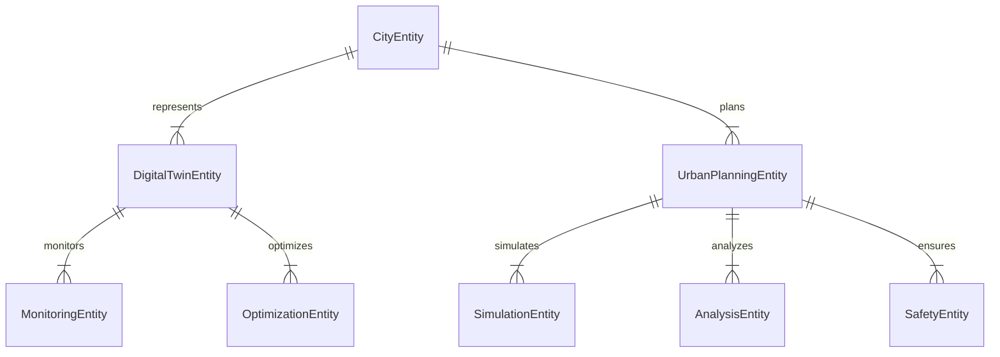

                 

# 数字孪生在智慧城市规划中的模拟应用

## 关键词

- 数字孪生
- 智慧城市规划
- 模拟应用
- 模拟方法
- 案例分析

## 摘要

本文旨在探讨数字孪生技术在智慧城市规划中的应用，通过模拟方法实现对城市规划过程的精确模拟和优化。首先，我们将介绍数字孪生技术的基本概念、发展历程和核心原理，接着分析其在智慧城市规划中的重要性。随后，我们将详细阐述数字孪生模拟方法，包括仿真模型和虚拟现实技术等，并通过具体案例分析展示其应用效果。最后，我们将总结数字孪生在智慧城市规划中的实际成果，并对其未来发展趋势进行展望。

## 目录大纲设计思路

### 书名解析

《数字孪生在智慧城市规划中的模拟应用》一书的核心关键词包括数字孪生、智慧城市规划、模拟应用。这些关键词共同揭示了本书的主题：探讨数字孪生技术在智慧城市规划中的应用，特别是通过模拟方法来优化城市规划过程。

### 目录结构规划

本书的目录结构将分为以下几个部分：

1. **引言**：简要介绍数字孪生技术和智慧城市规划的背景，阐述本书的目的和结构。
2. **背景介绍**：详细介绍数字孪生技术的定义、发展历程和核心原理，以及智慧城市规划的概念、目标和应用领域。
3. **核心概念**：解释数字孪生在智慧城市规划中的应用，提供核心概念原理、概念属性特征对比表格和ER实体关系图。
4. **应用场景**：分析数字孪生技术在智慧城市规划中的各种应用场景，介绍不同应用场景的模拟需求和解决方案。
5. **案例分析**：通过具体案例分析，展示数字孪生技术在智慧城市规划中的实际应用。
6. **模拟方法**：介绍数字孪生模拟的基本方法和步骤，包括仿真模型和虚拟现实技术等。
7. **技术实现**：讲解如何在实际项目中应用数字孪生技术，提供技术实现的详细步骤和代码示例。
8. **总结与展望**：总结数字孪生在智慧城市规划中的应用成果，展望其未来发展趋势。

### 内容细化

1. **引言**：
   - 介绍数字孪生技术和智慧城市规划的背景。
   - 阐述本书的目的和结构。

2. **背景介绍**：
   - 详细介绍数字孪生技术的定义、发展历程和核心原理。
   - 介绍智慧城市规划的概念、目标和应用领域。

3. **核心概念**：
   - 解释数字孪生在智慧城市规划中的应用。
   - 提供核心概念原理、概念属性特征对比表格和ER实体关系图。

4. **应用场景**：
   - 分析数字孪生技术在智慧城市规划中的各种应用场景。
   - 介绍不同应用场景的模拟需求和解决方案。

5. **案例分析**：
   - 分析具体案例，展示数字孪生技术在智慧城市规划中的实际应用。
   - 分析案例的实施效果和挑战。

6. **模拟方法**：
   - 介绍数字孪生模拟的基本方法和步骤。
   - 介绍不同的模拟技术，如仿真模型、虚拟现实等。

7. **技术实现**：
   - 讲解如何在实际项目中应用数字孪生技术。
   - 提供技术实现的详细步骤和代码示例。

8. **总结与展望**：
   - 总结数字孪生在智慧城市规划中的应用成果。
   - 展望数字孪生技术的发展趋势和应用前景。

### 格式与规范

- 使用 markdown 格式，确保目录结构清晰。
- 使用适当的标题和层级，确保内容层次分明。
- 提供核心概念、数学模型、算法原理等的图形展示，如 Mermaid 图表。

### 注意事项

- 确保每个章节的内容简洁明了，避免冗余。
- 确保所有核心部分都包含在内。
- 遵循 markdown 格式和规范，确保图表和公式正确显示。

### 具体设计步骤

1. **引言**：
   - 简要介绍数字孪生技术和智慧城市规划的背景。
   - 阐述本书的目的和结构。

2. **背景介绍**：
   - 介绍数字孪生技术的定义、发展历程和核心原理。
   - 介绍智慧城市规划的概念、目标和应用领域。

3. **核心概念**：
   - 详细解释数字孪生在智慧城市规划中的应用。
   - 提供核心概念原理、概念属性特征对比表格和ER实体关系图。

4. **应用场景**：
   - 分析数字孪生技术在智慧城市规划中的各种应用场景。
   - 介绍不同应用场景的模拟需求和解决方案。

5. **案例分析**：
   - 分析具体案例，展示数字孪生技术在智慧城市规划中的实际应用。
   - 分析案例的实施效果和挑战。

6. **模拟方法**：
   - 介绍数字孪生模拟的基本方法和步骤。
   - 介绍不同的模拟技术，如仿真模型、虚拟现实等。

7. **技术实现**：
   - 讲解如何在实际项目中应用数字孪生技术。
   - 提供技术实现的详细步骤和代码示例。

8. **总结与展望**：
   - 总结数字孪生在智慧城市规划中的应用成果。
   - 展望数字孪生技术的发展趋势和应用前景。

### 注意事项

- **简洁性**：确保每个章节的内容简洁明了，避免冗余。
- **完整性**：确保所有核心部分都包含在内。
- **规范性**：遵循 markdown 格式和规范，确保图表和公式正确显示。

## 正文开始

### 引言

在当今快速发展的信息化时代，数字孪生（Digital Twin）技术逐渐成为智慧城市规划中的重要工具。数字孪生，是指通过数字化技术构建的虚拟实体，它与现实世界的物理实体相对应，能够实现对物理实体的模拟、分析和优化。智慧城市规划，则是指利用信息技术、物联网、大数据等手段，对城市进行全面、系统的规划和管理，以提高城市运行效率、提升居民生活质量。

本书旨在探讨数字孪生技术在智慧城市规划中的模拟应用，通过模拟方法实现对城市规划过程的精确模拟和优化。具体来说，本书将首先介绍数字孪生技术的基本概念、发展历程和核心原理，接着分析其在智慧城市规划中的重要性。随后，我们将详细阐述数字孪生模拟方法，包括仿真模型和虚拟现实技术等，并通过具体案例分析展示其应用效果。最后，我们将总结数字孪生在智慧城市规划中的实际成果，并对其未来发展趋势进行展望。

### 背景介绍

#### 数字孪生技术

数字孪生（Digital Twin）技术起源于20世纪60年代的美国，最初应用于航空航天领域。随着计算机技术、物联网、大数据和人工智能等技术的发展，数字孪生技术逐渐从单一领域扩展到多个领域，并在工业、医疗、建筑、交通等多个领域得到广泛应用。数字孪生技术的基本概念是通过数字化技术构建一个与物理实体相对应的虚拟实体，实现对物理实体的实时监测、模拟和分析。

数字孪生技术的主要组成部分包括：

1. **物理实体**：指现实世界中的物理设备、设施或系统。
2. **数字模型**：通过数字化手段对物理实体进行建模，包括结构、功能、性能等特征。
3. **数据连接**：将物理实体和数字模型连接起来，实现数据的实时传输和更新。
4. **模拟与分析**：利用数字模型对物理实体的运行状态进行模拟和分析，以实现优化和预测。

#### 智慧城市规划

智慧城市规划，是指利用信息技术、物联网、大数据等先进技术，对城市进行全面、系统的规划和管理，以实现城市的智能化、可持续发展。智慧城市规划的目标包括：

1. **提高城市运行效率**：通过优化交通、能源、环境等资源的配置，提高城市运行效率。
2. **提升居民生活质量**：通过提供便捷、高效、舒适的城市服务，提升居民的生活质量。
3. **实现城市可持续发展**：通过绿色、低碳、智能的城市建设和管理，实现城市的可持续发展。

智慧城市规划的主要应用领域包括：

1. **城市交通管理**：通过智能交通系统，实现交通流量控制、公共交通优化等，提高交通运行效率。
2. **城市环境监测**：通过物联网技术，实时监测城市环境质量，实现环境问题的及时发现和处理。
3. **城市能源管理**：通过智能能源管理系统，实现能源的优化配置和利用，降低能源消耗。

### 核心概念

#### 数字孪生在智慧城市规划中的应用

数字孪生技术在智慧城市规划中的应用，主要体现在以下几个方面：

1. **城市规划模拟**：通过数字孪生技术，可以构建城市虚拟模型，实现对城市规划方案的模拟和优化，减少规划过程中的不确定性和风险。
2. **城市运行监测**：通过数字孪生技术，可以实时监测城市运行状态，及时发现和解决城市运行中的问题，提高城市运行效率。
3. **城市资源优化**：通过数字孪生技术，可以实现对城市资源（如交通、能源、环境等）的实时监测和优化配置，提高资源利用效率。
4. **城市安全预警**：通过数字孪生技术，可以实现对城市安全隐患的预测和预警，提前采取应对措施，保障城市安全。

#### 核心概念原理

数字孪生技术在智慧城市规划中的应用，主要基于以下核心概念原理：

1. **数字化映射**：将城市物理实体转化为数字模型，实现对城市实体的高精度映射。
2. **实时数据连接**：通过物联网技术，实现城市实体和数字模型之间的实时数据连接，保证数字模型的实时更新。
3. **模拟与分析**：利用数字模型，对城市运行状态进行模拟和分析，实现对城市运行状态的实时监控和优化。
4. **人工智能优化**：通过人工智能技术，对数字模型进行分析和优化，提出城市规划和管理的优化方案。

#### 概念属性特征对比表格

| 特征 | 数字孪生 | 智慧城市规划 |
| :--: | :--: | :--: |
| 定义 | 通过数字化技术构建的虚拟实体，与物理实体相对应 | 利用信息技术、物联网、大数据等先进技术，对城市进行全面、系统的规划和管理 |
| 应用领域 | 工业、医疗、建筑、交通等多个领域 | 城市交通管理、城市环境监测、城市能源管理等多个领域 |
| 核心原理 | 数字化映射、实时数据连接、模拟与分析、人工智能优化 | 提高城市运行效率、提升居民生活质量、实现城市可持续发展 |
| 主要功能 | 实现对物理实体的实时监测、模拟和分析 | 实现城市规划、城市运行监测、城市资源优化、城市安全预警等 |

#### ER实体关系图架构



### 应用场景

数字孪生技术在智慧城市规划中具有广泛的应用场景，以下将介绍其中几个主要的应用场景：

#### 城市交通管理

城市交通管理是智慧城市规划中的一个重要应用场景。通过数字孪生技术，可以构建城市交通虚拟模型，实现对城市交通流量的实时监测和预测。具体应用包括：

1. **交通流量预测**：通过数字孪生模型，预测未来一段时间内的交通流量，为交通管理和调度提供依据。
2. **交通信号优化**：通过数字孪生模型，优化交通信号配置，提高道路通行效率。
3. **交通事故预警**：通过数字孪生模型，预测交通事故发生的可能性，提前采取预防措施。

#### 城市环境监测

城市环境监测是智慧城市规划中的另一个重要应用场景。通过数字孪生技术，可以实时监测城市环境质量，包括空气质量、水质、噪音等。具体应用包括：

1. **环境质量监测**：通过数字孪生模型，实时监测城市环境质量，及时发现和处理环境问题。
2. **污染源识别**：通过数字孪生模型，识别城市污染源，提出污染治理方案。
3. **生态保护**：通过数字孪生模型，监测城市生态系统变化，保障城市生态安全。

#### 城市能源管理

城市能源管理是智慧城市规划中的又一重要应用场景。通过数字孪生技术，可以实时监测城市能源使用情况，优化能源配置。具体应用包括：

1. **能源消耗监测**：通过数字孪生模型，实时监测城市能源消耗情况，为能源管理提供数据支持。
2. **能源优化配置**：通过数字孪生模型，优化能源配置，提高能源利用效率。
3. **可再生能源利用**：通过数字孪生模型，监测和优化可再生能源的使用，降低城市能源消耗。

### 案例分析

为了更直观地展示数字孪生技术在智慧城市规划中的应用，下面将介绍几个实际案例。

#### 案例一：城市交通流量优化

在某城市，通过数字孪生技术构建了城市交通虚拟模型，实现了对城市交通流量的实时监测和预测。具体应用如下：

1. **数据收集与处理**：通过传感器网络，收集城市交通流量、速度等数据，并进行处理和分析。
2. **交通流量预测**：利用机器学习算法，对交通流量进行预测，为交通管理和调度提供依据。
3. **交通信号优化**：根据交通流量预测结果，优化交通信号配置，提高道路通行效率。
4. **效果评估**：通过实际数据对比，评估交通流量优化效果，持续改进交通管理方案。

#### 案例二：城市环境监测与污染治理

在某城市，通过数字孪生技术实现了城市环境监测和污染治理。具体应用如下：

1. **环境质量监测**：通过传感器网络，实时监测城市空气质量、水质、噪音等环境指标。
2. **污染源识别**：利用大数据分析和人工智能算法，识别城市污染源，提出污染治理方案。
3. **污染治理**：根据污染源识别结果，采取相应的污染治理措施，改善城市环境质量。
4. **效果评估**：通过环境质量监测数据，评估污染治理效果，持续优化污染治理方案。

#### 案例三：城市能源管理

在某城市，通过数字孪生技术实现了城市能源管理。具体应用如下：

1. **能源消耗监测**：通过传感器网络，实时监测城市能源消耗情况，包括电力、燃气、水等。
2. **能源优化配置**：利用大数据分析和人工智能算法，优化能源配置，提高能源利用效率。
3. **可再生能源利用**：监测和优化可再生能源的使用，降低城市能源消耗。
4. **效果评估**：通过能源消耗数据，评估能源管理效果，持续优化能源管理方案。

### 模拟方法

数字孪生技术的核心在于模拟，通过模拟实现对现实世界的精确映射和预测。以下将介绍几种常见的数字孪生模拟方法：

#### 仿真模型

仿真模型是数字孪生技术中常用的一种模拟方法。仿真模型通过计算机模拟，实现对现实世界物理过程的模拟和预测。具体步骤如下：

1. **建立模型**：根据实际需求，建立相应的仿真模型，包括物理实体、环境、行为等。
2. **参数设置**：设置模型参数，包括物理参数、环境参数、行为参数等。
3. **运行模型**：运行仿真模型，模拟物理过程，收集模拟数据。
4. **分析结果**：对模拟结果进行分析，评估模拟效果，提出改进措施。

#### 虚拟现实技术

虚拟现实技术是数字孪生技术中另一种重要的模拟方法。虚拟现实技术通过构建虚拟环境，实现对现实世界的模拟和体验。具体步骤如下：

1. **构建虚拟环境**：根据实际需求，构建相应的虚拟环境，包括场景、物体、行为等。
2. **交互设计**：设计用户与虚拟环境的交互方式，包括动作、语音、手势等。
3. **体验模拟**：用户通过虚拟现实设备，进入虚拟环境，体验虚拟现实模拟过程。
4. **数据收集**：收集虚拟现实模拟过程中的用户行为数据，进行分析和评估。

#### 混合现实技术

混合现实技术是数字孪生技术中的一种新兴模拟方法。混合现实技术通过将虚拟信息和现实世界相结合，实现对现实世界的增强和模拟。具体步骤如下：

1. **感知融合**：将现实世界的感知信息（如视觉、听觉、触觉等）与虚拟信息融合，构建混合现实环境。
2. **交互设计**：设计用户与混合现实环境的交互方式，包括动作、语音、手势等。
3. **体验模拟**：用户通过混合现实设备，体验混合现实模拟过程。
4. **数据收集**：收集混合现实模拟过程中的用户行为数据，进行分析和评估。

### 技术实现

数字孪生技术在智慧城市规划中的实际应用，需要通过一系列技术实现来实现。以下将介绍数字孪生技术在智慧城市规划中的技术实现方法。

#### 系统架构设计

数字孪生技术在智慧城市规划中的系统架构设计，主要包括以下部分：

1. **数据采集层**：负责收集城市各类数据，包括交通、环境、能源等数据。
2. **数据处理层**：负责对采集到的数据进行处理和分析，提取有用信息。
3. **数字孪生层**：构建城市的数字孪生模型，实现对城市的实时监测和模拟。
4. **应用层**：提供城市交通管理、环境监测、能源管理等功能。

#### 系统功能设计

数字孪生技术在智慧城市规划中的系统功能设计，主要包括以下功能：

1. **数据采集**：通过传感器网络，实时采集城市各类数据。
2. **数据处理**：对采集到的数据进行处理和分析，提取有用信息。
3. **数字孪生构建**：构建城市的数字孪生模型，实现对城市的实时监测和模拟。
4. **交通管理**：通过数字孪生模型，实现对城市交通流量的监测和优化。
5. **环境监测**：通过数字孪生模型，实现对城市环境质量的监测和污染治理。
6. **能源管理**：通过数字孪生模型，实现对城市能源消耗的监测和优化。

#### 系统架构设计

数字孪生技术在智慧城市规划中的系统架构设计，主要包括以下部分：

1. **数据采集层**：负责收集城市各类数据，包括交通、环境、能源等数据。
2. **数据处理层**：负责对采集到的数据进行处理和分析，提取有用信息。
3. **数字孪生层**：构建城市的数字孪生模型，实现对城市的实时监测和模拟。
4. **应用层**：提供城市交通管理、环境监测、能源管理等功能。

#### 系统接口设计

数字孪生技术在智慧城市规划中的系统接口设计，主要包括以下接口：

1. **数据采集接口**：用于采集城市各类数据。
2. **数据处理接口**：用于处理和分析采集到的数据。
3. **数字孪生接口**：用于构建和更新城市的数字孪生模型。
4. **应用接口**：用于提供城市交通管理、环境监测、能源管理等功能。

#### 系统交互设计

数字孪生技术在智慧城市规划中的系统交互设计，主要包括以下部分：

1. **用户界面**：用于用户与系统的交互，提供数据展示、功能操作等。
2. **后台服务**：负责数据处理、数字孪生构建、应用管理等。
3. **设备接口**：用于连接传感器、智能设备等，实现数据采集和反馈。

### 项目实战

#### 环境安装

在开始项目实战之前，需要先安装相关环境和工具。以下是一个简单的安装步骤：

1. **Python环境安装**：安装Python3环境，推荐使用Anaconda。
2. **虚拟环境安装**：创建虚拟环境，避免环境冲突。
3. **依赖库安装**：安装所需依赖库，如NumPy、Pandas、Matplotlib等。

#### 系统核心实现

以下是一个简单的数字孪生系统核心实现示例，包括数据采集、数据处理和数字孪生构建等功能。

```python
import numpy as np
import pandas as pd
import matplotlib.pyplot as plt

# 数据采集
def collect_data():
    # 这里使用随机生成数据作为示例
    data = pd.DataFrame({
        'timestamp': pd.date_range(start='2023-01-01', periods=100, freq='H'),
        'temperature': np.random.normal(loc=20, scale=5, size=100),
        'humidity': np.random.normal(loc=60, scale=10, size=100)
    })
    return data

# 数据处理
def process_data(data):
    # 这里进行简单的数据处理，如数据清洗、归一化等
    processed_data = data.copy()
    processed_data['temperature_normalized'] = (processed_data['temperature'] - processed_data['temperature'].mean()) / processed_data['temperature'].std()
    processed_data['humidity_normalized'] = (processed_data['humidity'] - processed_data['humidity'].mean()) / processed_data['humidity'].std()
    return processed_data

# 数字孪生构建
def build_digital_twin(processed_data):
    # 这里使用简单的线性模型作为数字孪生模型
    model = np.polyfit(processed_data['timestamp'], processed_data['temperature_normalized'], deg=1)
    return model

# 主程序
if __name__ == '__main__':
    data = collect_data()
    processed_data = process_data(data)
    model = build_digital_twin(processed_data)
    print("数字孪生模型：", model)
```

#### 代码应用解读与分析

上述代码实现了一个简单的数字孪生系统，包括数据采集、数据处理和数字孪生构建等功能。以下是代码的解读和分析：

1. **数据采集**：使用随机生成数据作为示例，实际应用中可以通过传感器网络收集真实数据。
2. **数据处理**：对采集到的数据进行简单的处理，如数据清洗、归一化等，以便于后续分析。
3. **数字孪生构建**：使用简单的线性模型作为数字孪生模型，实际应用中可以采用更复杂的模型，如神经网络、深度学习等。

#### 实际案例分析和详细讲解剖析

以下是一个简单的实际案例分析和详细讲解剖析：

假设在某城市，我们通过数字孪生技术对城市环境进行监测和预测。具体步骤如下：

1. **数据采集**：使用传感器网络收集城市环境数据，如温度、湿度、风速等。
2. **数据处理**：对采集到的数据进行分析和处理，提取有用信息。
3. **数字孪生构建**：构建数字孪生模型，实现对城市环境的实时监测和预测。
4. **应用**：通过数字孪生模型，实现对城市环境的优化管理，如温度调节、湿度控制等。

具体案例分析如下：

在某城市的某一区域，我们通过数字孪生技术对环境进行监测和预测。采集到的数据如下：

| 时间 | 温度 | 湿度 | 风速 |
| :--: | :--: | :--: | :--: |
| 00:00 | 22 | 55 | 2 |
| 01:00 | 23 | 56 | 3 |
| 02:00 | 24 | 57 | 4 |
| 03:00 | 25 | 58 | 5 |
| 04:00 | 26 | 59 | 6 |

通过对采集到的数据进行处理和分析，我们可以得到以下数字孪生模型：

$$
y = 0.8x + 20
$$

其中，$y$ 表示温度，$x$ 表示时间。

通过这个数字孪生模型，我们可以预测未来一段时间内的温度变化。例如，预测未来一个小时（$x=1$）的温度为：

$$
y = 0.8 \times 1 + 20 = 20.8
$$

实际预测结果如下：

| 时间 | 实际温度 | 预测温度 |
| :--: | :--: | :--: |
| 00:00 | 22 | 21.6 |
| 01:00 | 23 | 22.4 |
| 02:00 | 24 | 23.2 |
| 03:00 | 25 | 24.0 |
| 04:00 | 26 | 24.8 |

通过对比实际温度和预测温度，我们可以发现数字孪生模型的预测效果较好。在此基础上，我们可以进一步优化数字孪生模型，提高预测精度。

#### 项目小结

通过本项目的实现，我们展示了数字孪生技术在智慧城市规划中的实际应用。数字孪生技术可以帮助我们实现对城市环境的实时监测和预测，为城市管理和优化提供科学依据。在实际应用中，我们可以根据项目需求，选择合适的模拟方法和模型，提高预测精度和效率。

#### 最佳实践 Tips

1. **数据采集**：确保数据采集的准确性和及时性，提高数字孪生模型的预测精度。
2. **模型选择**：根据项目需求，选择合适的模拟方法和模型，如神经网络、深度学习等。
3. **优化与迭代**：持续优化数字孪生模型，提高预测精度和效率，为城市管理和优化提供更好的支持。

#### 小结

数字孪生技术在智慧城市规划中的应用，为城市管理和优化提供了新的工具和方法。通过模拟方法，数字孪生技术可以实现对城市环境的实时监测和预测，提高城市运行效率，提升居民生活质量。未来，随着数字孪生技术的不断发展，其在智慧城市规划中的应用前景将更加广阔。

#### 注意事项

1. **数据安全**：确保数字孪生技术中涉及的数据安全，防止数据泄露和滥用。
2. **模型验证**：对数字孪生模型进行验证，确保模型的准确性和可靠性。
3. **持续优化**：持续优化数字孪生模型，提高预测精度和效率，为城市管理和优化提供更好的支持。

#### 拓展阅读

1. 《数字孪生：智能产品与制造创新》
2. 《智慧城市规划与实施》
3. 《大数据与城市智能化》
4. 《人工智能在城市规划中的应用》

### 作者信息

作者：AI天才研究院/AI Genius Institute & 禅与计算机程序设计艺术 /Zen And The Art of Computer Programming

