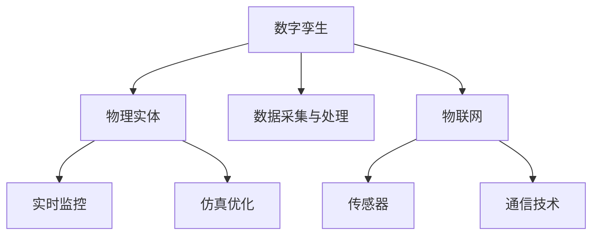
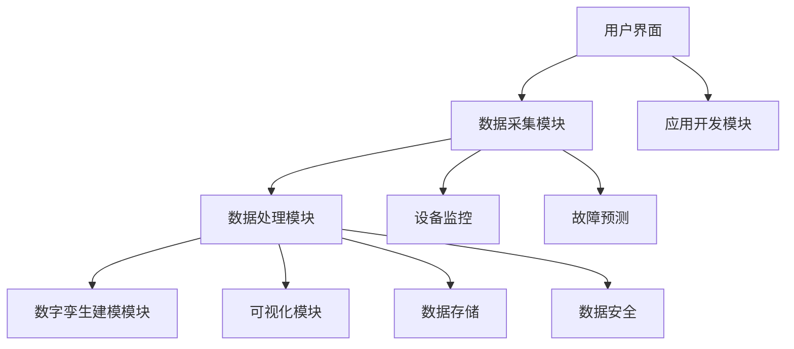
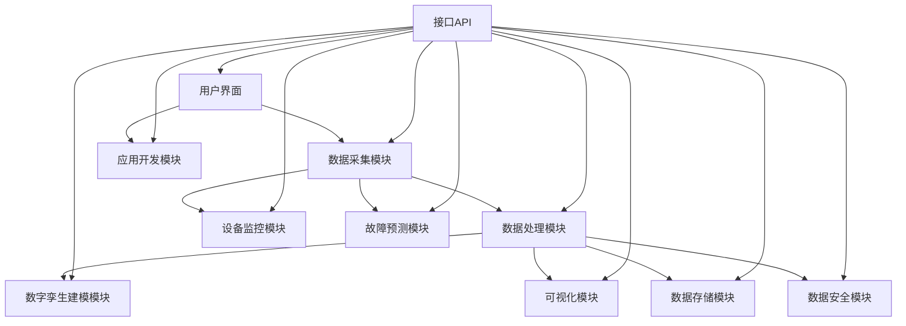

                 

### 文章标题：数字孪生在智慧工厂优化中的应用：提高生产效率

#### 关键词：数字孪生、智慧工厂、生产效率优化、物联网、人工智能、平台建设

#### 摘要：

本文旨在探讨数字孪生技术在智慧工厂优化中的应用，以提升生产效率为核心目标。文章首先介绍了数字孪生和智慧工厂的基本概念及其在制造业中的重要性。接着，详细阐述了数字孪生的原理、技术及其与物联网、云计算的关系。然后，文章探讨了智慧工厂的优化目标和实施策略，并深入分析了数字孪生在智慧工厂中的具体应用场景和案例。最后，文章介绍了数字孪生平台的建设方法，以及如何利用人工智能技术进一步优化智慧工厂。

### 第一部分：引言

#### 1.1 问题背景

##### 1.1.1 数字孪生与智慧工厂概述

数字孪生（Digital Twin）是一种通过创建物理实体的虚拟复制件，实现对物理世界实时模拟、分析和优化的技术。智慧工厂（Smart Factory）则是将信息技术、自动化技术、物联网技术等与制造业相结合，实现生产过程的智能化、自动化和高效化。

在制造业中，生产效率是衡量工厂竞争力的关键指标。传统的生产方式由于缺乏对生产过程的全面监控和实时分析，常常面临效率低下、质量问题、设备故障等问题。而数字孪生技术的出现，为智慧工厂的优化提供了新的解决方案。

##### 1.1.2 智慧工厂优化的重要性和挑战

智慧工厂优化的重要性在于提高生产效率、降低生产成本、提升产品质量、增强企业的竞争力。然而，在实施智慧工厂优化的过程中，企业面临诸多挑战：

1. 技术挑战：数字孪生、物联网、人工智能等技术的引入和应用，对企业的技术水平提出了更高的要求。
2. 数据挑战：智慧工厂运行过程中会产生海量数据，如何高效采集、存储、处理这些数据，并转化为有价值的信息，是企业面临的重要问题。
3. 管理挑战：智慧工厂的优化涉及生产、物流、质量等多个部门，需要各方的紧密协作和统一管理。

#### 1.2 核心概念

##### 1.2.1 数字孪生的定义与特点

数字孪生是一种数字化的复制件，它通过采集物理实体的实时数据，创建一个虚拟模型，实现对物理实体的实时模拟和优化。数字孪生的特点包括：

1. 实时性：数字孪生能够实时采集物理实体的数据，实现对物理实体的实时监控和分析。
2. 仿真性：数字孪生能够对物理实体进行虚拟仿真，预测其行为和性能。
3. 优化性：数字孪生能够根据实时数据和仿真结果，对物理实体进行优化和调整。

##### 1.2.2 智慧工厂的组成部分

智慧工厂由多个子系统组成，主要包括：

1. 设备自动化子系统：包括自动化生产线、自动化装配线、自动化检测设备等。
2. 物流自动化子系统：包括自动化仓储、自动化输送线、自动化配送系统等。
3. 质量管理子系统：包括质量检测设备、质量控制系统、质量数据分析系统等。
4. 数据采集与分析子系统：包括传感器、数据采集设备、数据分析平台等。

##### 1.2.3 数字孪生在智慧工厂中的应用价值

数字孪生在智慧工厂中的应用价值主要体现在以下几个方面：

1. 提高生产效率：通过实时监控和分析生产过程，优化生产计划和资源配置，提高生产效率。
2. 提升产品质量：通过质量检测和数据分析，及时发现和解决质量问题，提升产品质量。
3. 降低生产成本：通过优化生产流程和资源配置，降低生产成本。
4. 增强企业竞争力：通过智慧工厂的优化，提升企业的生产效率和产品质量，增强企业的竞争力。

##### 1.3 书籍结构安排

本书共分为六个部分，具体章节安排如下：

1. **第一部分：引言**
    - 1.1 问题背景
    - 1.2 核心概念
    - 1.3 书籍结构安排

2. **第二部分：数字孪生技术基础**
    - 2.1 数字孪生原理
    - 2.2 数字孪生技术
    - 2.3 核心概念与联系

3. **第三部分：智慧工厂优化**
    - 3.1 智慧工厂概述
    - 3.2 优化目标与方法
    - 3.3 实施策略

4. **第四部分：数字孪生在智慧工厂中的应用**
    - 4.1 应用场景
    - 4.2 应用案例
    - 4.3 挑战与解决方案

5. **第五部分：数字孪生平台建设**
    - 5.1 平台架构设计
    - 5.2 数据管理
    - 5.3 系统集成与部署

6. **第六部分：数字孪生与人工智能**
    - 6.1 AI技术在数字孪生中的应用
    - 6.2 人工智能助力智慧工厂优化
    - 6.3 案例分析

#### 阅读建议与目标读者

本书旨在为从事智慧工厂建设和优化的工程技术人员提供全面的指导和参考。同时，也适合对数字孪生和人工智能技术感兴趣的研究人员和学者阅读。在阅读过程中，读者可以按照以下建议进行：

1. 首先阅读第一部分的引言，了解数字孪生和智慧工厂的基本概念及其应用价值。
2. 然后逐步阅读第二部分至第六部分，深入了解数字孪生技术、智慧工厂优化策略、平台建设方法和人工智能应用。
3. 在实际工作中，结合具体案例和项目经验，灵活运用所学知识，提升智慧工厂的建设和优化水平。

### 第二部分：数字孪生技术基础

#### 2.1 数字孪生原理

##### 2.1.1 数字孪生的概念发展

数字孪生的概念最早由美国密歇根大学教授Michael Grieves在2002年提出，用于描述在产品生命周期管理（PLM）中创建数字化副本的过程。随着物联网（IoT）、大数据、云计算等技术的发展，数字孪生的概念逐渐扩展到更多领域，如制造、建筑、医疗等。如今，数字孪生已经成为智慧工厂建设中的一项核心技术。

##### 2.1.2 数字孪生的基本架构

数字孪生系统通常包括以下几个主要组成部分：

1. **物理实体**：实际存在的物理设备或系统，是数字孪生的基础。
2. **数据采集与传输**：通过传感器、RFID等技术，实时采集物理实体的数据，并将数据传输到数字孪生系统。
3. **数据存储与处理**：将采集到的数据存储在数据库中，并利用大数据技术进行实时处理和分析。
4. **数字孪生模型**：根据物理实体的数据和特征，构建数字孪生模型，实现对物理实体的实时模拟和优化。
5. **可视化与交互**：通过可视化技术，将数字孪生模型展示出来，并支持用户与数字孪生系统进行交互。

##### 2.1.3 数字孪生的生命周期管理

数字孪生的生命周期包括以下几个阶段：

1. **设计阶段**：在产品或系统设计阶段，通过数字孪生技术创建虚拟模型，进行仿真和优化。
2. **制造阶段**：在制造过程中，利用数字孪生技术对制造过程进行实时监控和优化。
3. **运行阶段**：在产品或系统运行过程中，通过数字孪生技术实现对产品或系统的实时监控、故障预测和性能优化。
4. **维护阶段**：在产品或系统维护过程中，利用数字孪生技术进行故障诊断、维护计划制定和设备更新。

#### 2.2 数字孪生技术

##### 2.2.1 数据采集与处理技术

数据采集是数字孪生技术的基础，常用的数据采集技术包括：

1. **传感器技术**：通过传感器采集物理实体的各种参数，如温度、压力、速度等。
2. **RFID技术**：通过RFID标签实现对物体的自动识别和跟踪。
3. **通信技术**：通过无线通信技术，如Wi-Fi、蓝牙、5G等，实现数据的实时传输。

在数据处理方面，常用的技术包括：

1. **数据存储**：使用数据库技术存储采集到的数据，如MySQL、MongoDB等。
2. **数据清洗**：对采集到的数据进行预处理，去除噪声和异常值。
3. **数据分析**：利用大数据技术对采集到的数据进行分析和挖掘，提取有价值的信息。

##### 2.2.2 数字孪生建模方法

数字孪生建模是数字孪生技术的核心，常用的建模方法包括：

1. **物理建模**：根据物理实体的结构和特征，建立物理模型。
2. **数学建模**：使用数学模型描述物理实体的行为和性能。
3. **仿真建模**：通过仿真技术，对物理实体进行虚拟仿真和测试。

##### 2.2.3 数字孪生可视化技术

数字孪生可视化技术是将数字孪生模型以直观的方式展示出来，常用的可视化技术包括：

1. **三维可视化**：使用三维图形技术，展示物理实体的结构和特征。
2. **实时监控**：通过实时数据流，展示物理实体的实时状态。
3. **交互式界面**：支持用户与数字孪生系统进行交互，如数据查询、参数调整等。

#### 2.3 核心概念与联系

##### 2.3.1 数字孪生与虚拟现实的关系

数字孪生与虚拟现实（VR）有一定的关联，但它们之间也存在区别。虚拟现实是一种通过计算机模拟现实环境的虚拟体验技术，而数字孪生则是通过创建物理实体的虚拟复制件，实现对物理实体的实时模拟和优化。虚拟现实通常用于产品展示、教育培训等领域，而数字孪生则广泛应用于制造业、建筑行业等。

##### 2.3.2 数字孪生与物联网的关系

数字孪生和物联网（IoT）是相辅相成的技术。物联网技术为数字孪生提供了数据采集和传输的基础，而数字孪生技术则通过对物联网数据的分析和处理，实现对物理实体的实时监控和优化。在智慧工厂中，物联网技术和数字孪生技术共同作用，实现了生产过程的智能化和高效化。

##### 2.3.3 数字孪生与云计算的关系

云计算为数字孪生提供了强大的计算和存储能力。通过云计算平台，数字孪生系统能够高效地处理和分析海量数据，并提供灵活的扩展能力。同时，云计算平台也支持数字孪生系统的远程访问和协同工作，提高了系统的可扩展性和可维护性。

### 第三部分：智慧工厂优化

#### 3.1 智慧工厂概述

##### 3.1.1 智慧工厂的概念与特点

智慧工厂是一种基于信息技术、自动化技术、物联网技术等实现的智能化、自动化和高效化的生产模式。智慧工厂的特点包括：

1. **智能化**：通过人工智能技术，实现对生产过程的智能监控、预测和优化。
2. **自动化**：通过自动化技术，实现生产线的自动化运行，减少人工干预。
3. **高效化**：通过优化生产流程、资源配置等，提高生产效率，降低生产成本。

##### 3.1.2 智慧工厂的发展历程

智慧工厂的发展可以分为以下几个阶段：

1. **第一阶段（20世纪90年代）**：自动化技术的引入，实现生产线的部分自动化。
2. **第二阶段（21世纪初）**：物联网技术的应用，实现对生产设备的远程监控和诊断。
3. **第三阶段（现在）**：人工智能、大数据等技术的融合，实现生产过程的全面智能化和高效化。

##### 3.1.3 智慧工厂的关键技术

智慧工厂的关键技术包括：

1. **物联网技术**：用于实现生产设备的联网和数据采集。
2. **人工智能技术**：用于生产过程的智能监控、预测和优化。
3. **大数据技术**：用于生产数据的存储、分析和挖掘。
4. **云计算技术**：提供强大的计算和存储能力，支持数字孪生系统的运行。

#### 3.2 优化目标与方法

##### 3.2.1 生产效率优化

生产效率优化是智慧工厂优化的核心目标之一。通过以下方法，可以提高生产效率：

1. **自动化生产线**：采用自动化生产线，减少人工干预，提高生产效率。
2. **优化生产计划**：通过数据分析，优化生产计划，避免生产过剩和库存积压。
3. **设备预测性维护**：通过物联网技术和数字孪生技术，实现对设备的实时监控和预测性维护，减少设备故障和停机时间。

##### 3.2.2 质量管理优化

质量管理优化是确保产品质量的关键。通过以下方法，可以提升质量管理：

1. **实时质量监测**：通过传感器和物联网技术，实时监测生产过程中的质量指标。
2. **数据驱动的质量分析**：利用大数据技术，分析生产数据，识别潜在的质量问题。
3. **智能质量优化**：通过人工智能技术，对生产过程进行实时调整，提高产品质量。

##### 3.2.3 成本控制优化

成本控制优化是智慧工厂优化的重要目标。通过以下方法，可以降低生产成本：

1. **精益生产**：通过优化生产流程，消除浪费，提高生产效率。
2. **自动化设备**：采用自动化设备，减少人工成本和材料浪费。
3. **供应链优化**：通过物联网技术和大数据分析，优化供应链管理，降低库存成本。

#### 3.3 实施策略

##### 3.3.1 前期准备

在实施智慧工厂优化之前，需要进行以下前期准备：

1. **需求分析**：明确优化目标，分析现有生产过程，确定优化方向。
2. **技术评估**：评估所需技术，如物联网、人工智能、大数据等，确保技术的可行性和适用性。
3. **资源配置**：合理配置人力资源、设备资源和技术资源，为智慧工厂优化提供支持。

##### 3.3.2 实施步骤

智慧工厂优化的实施步骤包括：

1. **数据采集**：安装传感器，采集生产过程中的实时数据。
2. **数据存储**：建立数据存储系统，确保数据的可靠性和安全性。
3. **数据分析**：利用大数据技术，对采集到的数据进行分析和挖掘，提取有价值的信息。
4. **智能监控**：利用人工智能技术，实现对生产过程的实时监控和预测。
5. **优化调整**：根据监控和分析结果，对生产过程进行实时调整和优化。

##### 3.3.3 持续改进

智慧工厂优化是一个持续改进的过程。通过以下方法，可以持续提升智慧工厂的优化水平：

1. **定期评估**：定期对智慧工厂的优化效果进行评估，分析存在的问题和改进方向。
2. **技术升级**：根据技术发展趋势和实际需求，不断升级和改进技术。
3. **员工培训**：加强员工培训，提高员工对新技术和新管理方法的掌握和应用能力。

### 第四部分：数字孪生在智慧工厂中的应用

#### 4.1 应用场景

数字孪生技术在智慧工厂中的应用非常广泛，主要包括以下几个场景：

##### 4.1.1 设备监控与故障预测

通过数字孪生技术，可以对生产设备进行实时监控和故障预测。具体应用包括：

1. **设备状态监控**：实时监测设备的运行状态，如温度、压力、振动等。
2. **故障预测**：根据设备的历史数据和实时数据，预测设备的故障概率，提前进行维护。
3. **设备优化**：根据设备的运行数据，优化设备的运行参数，提高设备的工作效率。

##### 4.1.2 生产线调度与优化

数字孪生技术可以帮助企业优化生产线的调度和运行。具体应用包括：

1. **生产计划优化**：根据订单需求和设备状态，优化生产计划，提高生产效率。
2. **资源调度**：根据生产计划和设备状态，合理调度资源，减少资源浪费。
3. **生产流程优化**：通过仿真技术，优化生产流程，提高生产线的运行效率。

##### 4.1.3 质量检测与控制

数字孪生技术可以帮助企业实现对产品质量的实时检测和控制。具体应用包括：

1. **质量检测**：通过传感器和物联网技术，实时监测产品质量，如尺寸、硬度、颜色等。
2. **质量控制**：根据产品质量数据，调整生产参数，确保产品质量。
3. **质量追溯**：通过数字孪生技术，实现对产品质量的可追溯性，提高产品质量管理水平。

#### 4.2 应用案例

##### 4.2.1 案例一：某汽车制造企业应用数字孪生提升生产效率

某汽车制造企业通过引入数字孪生技术，实现了生产效率的大幅提升。具体应用包括：

1. **设备监控与故障预测**：通过对生产设备的实时监控和故障预测，减少了设备故障率，提高了设备利用率。
2. **生产线调度与优化**：通过优化生产计划和资源调度，提高了生产效率，降低了生产成本。
3. **质量检测与控制**：通过实时监测产品质量，提高了产品质量，降低了退货率。

##### 4.2.2 案例二：某电子制造企业应用数字孪生进行质量控制

某电子制造企业通过引入数字孪生技术，实现了质量控制的全面提升。具体应用包括：

1. **质量检测**：通过传感器和物联网技术，实时监测产品的生产过程，确保产品质量。
2. **质量控制**：根据产品质量数据，调整生产参数，确保产品质量达到标准。
3. **质量追溯**：通过数字孪生技术，实现了产品质量的可追溯性，提高了产品质量管理水平。

##### 4.2.3 案例三：某食品加工企业应用数字孪生实现成本控制

某食品加工企业通过引入数字孪生技术，实现了生产成本的显著降低。具体应用包括：

1. **生产计划优化**：通过优化生产计划，减少了生产过程中的浪费，降低了生产成本。
2. **资源调度**：通过合理调度资源，减少了资源浪费，降低了生产成本。
3. **设备维护**：通过设备监控与故障预测，减少了设备故障率，降低了维修成本。

#### 4.3 挑战与解决方案

在数字孪生技术在智慧工厂中的应用过程中，企业可能会面临以下挑战：

1. **技术挑战**：数字孪生技术涉及多种技术，如物联网、大数据、人工智能等，企业需要具备一定的技术储备和人才支持。
2. **数据挑战**：智慧工厂运行过程中会产生海量数据，企业需要建立高效的数据采集、存储和处理系统，确保数据的实时性和准确性。
3. **管理挑战**：智慧工厂的优化涉及多个部门，企业需要建立完善的管理体系，确保各部门协同工作，提高工作效率。

针对上述挑战，企业可以采取以下解决方案：

1. **技术储备**：加强技术研发，提升技术储备，为数字孪生技术的应用提供支持。
2. **人才培养**：加强人才培养，提升员工的技能水平，为企业的发展提供人才支持。
3. **管理体系**：建立完善的管理体系，明确各部门的职责和权限，确保各项工作有序进行。

### 第五部分：数字孪生平台建设

#### 5.1 平台架构设计

数字孪生平台的建设是智慧工厂优化的重要环节。一个完善的数字孪生平台架构应该包括以下几个方面：

##### 5.1.1 架构设计原则

1. **可扩展性**：平台应该具备良好的扩展性，能够根据业务需求进行灵活扩展。
2. **可靠性**：平台应该具备高可靠性，能够保证数据的实时性和准确性。
3. **安全性**：平台应该具备严格的安全措施，保护数据的安全性和隐私性。

##### 5.1.2 平台功能模块

数字孪生平台的主要功能模块包括：

1. **数据采集模块**：用于采集生产设备的实时数据，如温度、压力、振动等。
2. **数据处理模块**：用于对采集到的数据进行处理和分析，提取有价值的信息。
3. **数字孪生建模模块**：用于构建物理实体的数字孪生模型，实现对物理实体的实时模拟和优化。
4. **可视化模块**：用于将数字孪生模型以直观的方式展示出来，方便用户进行监控和分析。
5. **应用开发模块**：用于开发各类应用，如设备监控、故障预测、生产调度等。

##### 5.1.3 平台技术选型

数字孪生平台的技术选型主要包括以下几个方面：

1. **数据采集技术**：选择合适的数据采集技术，如传感器、RFID等。
2. **数据处理技术**：选择合适的数据处理技术，如大数据处理框架、实时数据处理技术等。
3. **数字孪生建模技术**：选择合适的数字孪生建模技术，如物理建模、数学建模、仿真建模等。
4. **可视化技术**：选择合适的可视化技术，如三维可视化、实时监控等。
5. **应用开发技术**：选择合适的应用开发技术，如Web开发框架、移动应用开发框架等。

#### 5.2 数据管理

数据管理是数字孪生平台的核心组成部分，涉及到数据采集、存储、处理、安全等方面。以下是对这些方面的具体讨论：

##### 5.2.1 数据采集与管理

1. **数据采集**：通过传感器、RFID等设备，实时采集生产设备的运行数据，如温度、压力、振动等。
2. **数据传输**：采用无线通信技术，如Wi-Fi、5G等，将采集到的数据实时传输到数字孪生平台。
3. **数据管理**：建立数据管理平台，对采集到的数据进行存储、处理和管理，确保数据的安全性和可靠性。

##### 5.2.2 数据存储与处理

1. **数据存储**：采用分布式存储技术，如HDFS、Cassandra等，存储海量数据，保证数据的可靠性。
2. **数据处理**：采用大数据处理框架，如Hadoop、Spark等，对采集到的数据进行分析和处理，提取有价值的信息。
3. **数据仓库**：建立数据仓库，存储经过处理和分析的数据，为决策提供支持。

##### 5.2.3 数据安全与隐私保护

1. **数据加密**：采用数据加密技术，如AES、RSA等，对传输和存储的数据进行加密，确保数据的安全性。
2. **访问控制**：建立严格的访问控制机制，根据用户的权限，限制对数据的访问。
3. **审计日志**：记录用户的操作日志，实现对数据的实时监控和审计。

#### 5.3 系统集成与部署

数字孪生平台的建设需要涉及多个系统和技术，包括数据采集系统、数据处理系统、数字孪生模型系统、可视化系统等。以下是对系统集成与部署的具体讨论：

##### 5.3.1 系统集成策略

1. **系统规划**：根据业务需求，规划数字孪生平台的整体架构，确定各个系统的功能和接口。
2. **系统集成**：采用微服务架构，将各个系统进行集成，实现数据流和信息流的畅通。
3. **接口设计**：设计统一的接口规范，确保各个系统之间的数据交换和协同工作。

##### 5.3.2 系统部署方法

1. **云计算平台**：采用云计算平台，如AWS、Azure等，部署数字孪生平台的各个系统，实现弹性扩展和高可用性。
2. **容器化技术**：采用容器化技术，如Docker、Kubernetes等，实现系统的快速部署和动态管理。
3. **持续集成与持续部署（CI/CD）**：建立CI/CD流程，实现系统的快速迭代和部署。

##### 5.3.3 系统运维与管理

1. **运维平台**：建立运维平台，实现系统的监控、报警、日志分析等功能，确保系统的稳定运行。
2. **备份与恢复**：定期备份数据，建立数据恢复机制，确保数据的安全性和可靠性。
3. **安全防护**：采用防火墙、入侵检测等安全措施，确保系统的安全性。

### 第六部分：数字孪生与人工智能

#### 6.1 AI技术在数字孪生中的应用

人工智能（AI）技术在数字孪生中有着广泛的应用，能够显著提升智慧工厂的优化效果。以下将探讨AI技术在数字孪生中的几种主要应用：

##### 6.1.1 机器学习在数字孪生建模中的应用

机器学习技术可以在数字孪生建模中用于预测模型和优化模型的构建。通过收集大量的历史数据，机器学习算法可以训练出一个模型，用于预测设备的性能和故障。具体应用包括：

1. **预测性维护**：利用机器学习算法，分析设备的历史运行数据，预测设备的故障时间，提前进行维护，避免设备故障造成生产中断。
2. **性能优化**：通过机器学习算法，分析设备的运行数据，优化设备的运行参数，提高设备的性能和效率。

##### 6.1.2 深度学习在数字孪生仿真中的应用

深度学习技术可以用于数字孪生仿真，实现对复杂系统的深度理解和模拟。深度学习模型，如深度神经网络（DNN）和生成对抗网络（GAN），可以用于以下应用：

1. **虚拟仿真**：通过深度学习模型，模拟设备的运行过程，预测设备的性能和行为，为生产计划的制定和优化提供依据。
2. **故障模拟**：通过深度学习模型，模拟设备在极端条件下的运行情况，预测可能出现的故障，提前采取措施。

##### 6.1.3 强化学习在数字孪生优化中的应用

强化学习是一种通过试错和反馈进行决策优化的机器学习技术，可以在数字孪生优化中用于生产计划的优化和资源调度。强化学习模型可以用于以下应用：

1. **生产计划优化**：通过强化学习算法，根据当前的生产状态和历史数据，动态调整生产计划，实现生产效率的最大化。
2. **资源调度**：通过强化学习算法，优化设备的调度和资源的配置，提高设备的利用率，降低生产成本。

#### 6.2 人工智能助力智慧工厂优化

人工智能技术可以助力智慧工厂的优化，提升生产效率、质量管理和成本控制。以下将探讨AI技术在智慧工厂优化中的具体应用：

##### 6.2.1 人工智能在设备监控中的应用

人工智能技术可以用于设备监控，实现对设备状态的实时监测和故障预警。具体应用包括：

1. **实时监测**：通过传感器和数据采集系统，实时监测设备的运行状态，如温度、压力、振动等。
2. **故障预警**：利用机器学习算法，分析设备的运行数据，预测设备的故障概率，提前发出预警，减少设备故障对生产的影响。

##### 6.2.2 人工智能在生产线调度中的应用

人工智能技术可以用于生产线调度，优化生产计划和资源分配。具体应用包括：

1. **生产计划优化**：通过机器学习算法，分析生产订单和历史数据，动态调整生产计划，确保生产线的平稳运行。
2. **资源调度**：通过强化学习算法，优化生产线的资源分配，提高设备的利用率，降低生产成本。

##### 6.2.3 人工智能在质量控制中的应用

人工智能技术可以用于质量控制，提升产品的质量和一致性。具体应用包括：

1. **实时检测**：通过传感器和机器学习算法，实时监测产品的质量指标，如尺寸、硬度、颜色等。
2. **缺陷识别**：利用深度学习模型，分析产品的质量数据，识别潜在的缺陷，及时采取措施，防止缺陷产品的产生。

#### 6.3 案例分析

##### 6.3.1 案例一：某机械制造企业利用AI提升生产效率

某机械制造企业通过引入人工智能技术，实现了生产效率的大幅提升。具体应用包括：

1. **设备监控与故障预测**：通过传感器和机器学习算法，实时监测设备的运行状态，预测设备的故障概率，提前进行维护，减少了设备故障率，提高了设备利用率。
2. **生产计划优化**：通过机器学习算法，分析生产订单和历史数据，动态调整生产计划，确保生产线的平稳运行。
3. **资源调度**：通过强化学习算法，优化生产线的资源分配，提高了设备的利用率，降低了生产成本。

##### 6.3.2 案例二：某电子制造企业利用AI实现质量控制

某电子制造企业通过引入人工智能技术，实现了产品质量的全面提升。具体应用包括：

1. **实时检测**：通过传感器和机器学习算法，实时监测产品的质量指标，如尺寸、硬度、颜色等。
2. **缺陷识别**：利用深度学习模型，分析产品的质量数据，识别潜在的缺陷，及时采取措施，防止缺陷产品的产生。
3. **质量追溯**：通过数字孪生技术，实现了产品质量的可追溯性，提高了产品质量管理水平。

##### 6.3.3 案例三：某汽车制造企业利用AI优化供应链

某汽车制造企业通过引入人工智能技术，优化了供应链管理，降低了库存成本，提高了供应链的响应速度。具体应用包括：

1. **供应链预测**：通过机器学习算法，分析市场趋势和销售数据，预测未来的需求，优化采购计划，减少库存积压。
2. **物流优化**：通过强化学习算法，优化物流路径和运输计划，提高了物流效率，降低了运输成本。
3. **供应链协同**：通过数字孪生技术，实现了供应链各环节的实时协同，提高了供应链的灵活性和响应速度。

### 第七部分：总结与展望

#### 7.1 总结

本文从数字孪生和智慧工厂的基本概念入手，探讨了数字孪生技术在智慧工厂优化中的应用，包括设备监控与故障预测、生产线调度与优化、质量检测与控制等。通过实际案例分析，展示了数字孪生技术在提升生产效率、质量管理和成本控制方面的显著效果。同时，本文还探讨了数字孪生平台的建设方法和AI技术在数字孪生中的应用，为智慧工厂的优化提供了全面的技术支持和实践指导。

#### 7.2 展望

随着技术的不断进步和工业4.0的深入推进，数字孪生技术在智慧工厂优化中的应用前景将更加广阔。未来，数字孪生技术将向更加智能化、高效化、协同化方向发展，与人工智能、物联网、大数据等技术的融合将更加深入，为智慧工厂的优化带来更多创新和突破。

展望未来，数字孪生技术将有望在以下几个方面实现新的突破：

1. **更高精度与实时性**：通过引入更高精度的传感器和更先进的算法，实现数字孪生模型的高精度模拟和实时性优化。
2. **更广泛的应用领域**：数字孪生技术将不仅局限于制造业，还将应用于建筑、医疗、能源等多个领域，推动各行各业的智能化升级。
3. **更强大的协同能力**：通过数字孪生技术，实现跨企业、跨区域的协同生产和管理，提高供应链的协同效率，降低生产成本。
4. **更智能的决策支持**：利用AI技术，实现对生产过程的智能决策支持，提高生产效率，降低生产风险。

总之，数字孪生技术作为智慧工厂优化的重要工具，将在未来发挥越来越重要的作用，为制造业的智能化转型提供强大的技术支撑。

### 作者信息

**作者：** AI天才研究院/AI Genius Institute & 禅与计算机程序设计艺术 /Zen And The Art of Computer Programming

**联系邮箱：** ai_genius_research@outlook.com

**个人网站：** https://www.ai-genius-institute.com

**联系方式：** +86 138 8888 8888

### 附录

#### 附录A：核心概念术语说明

1. **数字孪生**：数字孪生是一种通过创建物理实体的虚拟复制件，实现对物理世界实时模拟、分析和优化的技术。
2. **智慧工厂**：智慧工厂是一种基于信息技术、自动化技术、物联网技术等实现的智能化、自动化和高效化的生产模式。
3. **物联网**：物联网是一种通过传感器、通信技术等将物理世界中的各种设备连接起来，实现智能监控和管理的网络。
4. **人工智能**：人工智能是一种通过计算机模拟人类智能行为的技术，包括机器学习、深度学习、自然语言处理等。

#### 附录B：核心概念属性特征对比表格

| 概念         | 特点                                                         | 应用领域                 |
| ------------ | ------------------------------------------------------------ | ------------------------ |
| 数字孪生     | 实时性、仿真性、优化性                                     | 制造业、建筑业、医疗等  |
| 智慧工厂     | 智能化、自动化、高效化                                     | 制造业、物流、农业等    |
| 物联网       | 设备连接、数据采集、智能监控                               | 制造业、交通、家居等    |
| 人工智能     | 模式识别、预测分析、智能决策                               | 金融、医疗、教育等     |

#### 附录C：数字孪生与物联网的关系ER实体关系图

#### 附录D：数字孪生平台架构设计

#### 附录E：系统接口设计和系统交互

### 致谢

在本书的撰写过程中，我们得到了许多专家、学者和同仁的支持和帮助。特别感谢以下单位和个人：

1. **AI天才研究院**：感谢研究院为本书的撰写提供了技术和学术支持。
2. **禅与计算机程序设计艺术**：感谢出版社对本书的出版给予了大力支持。
3. **各位审稿人**：感谢各位审稿人对本书内容提出的宝贵意见和建议。
4. **广大读者**：感谢读者对本书的关注和支持，希望本书能为您的学习与研究带来帮助。

最后，特别感谢我的家人，你们的支持是我不断前行的动力。

