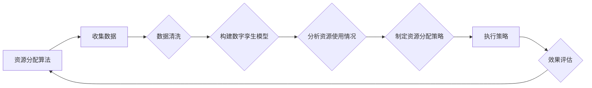
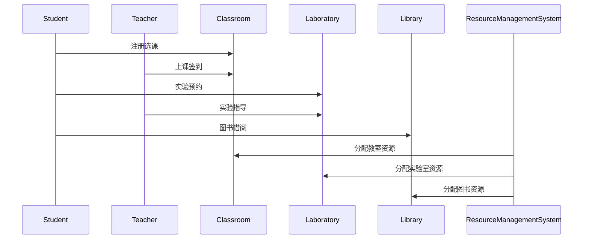
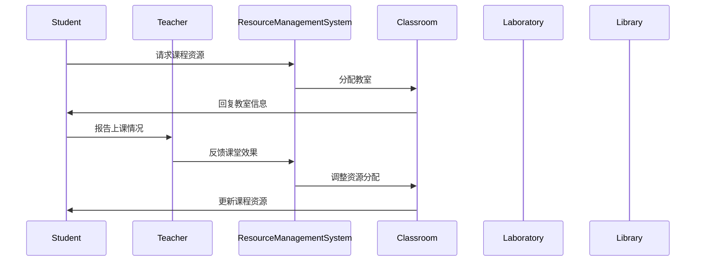

                 


### 数字孪生在智慧校园管理中的应用：优化教育资源分配

#### 关键词
- 数字孪生
- 智慧校园
- 教育资源分配
- 人工智能
- 教育均衡

#### 摘要
本文将探讨数字孪生技术在智慧校园管理中的应用，特别是如何通过构建数字孪生模型来优化教育资源的分配。我们将从背景介绍、核心概念、算法原理、系统架构设计、项目实战和最佳实践等方面展开讨论，以期为教育行业提供一种创新的解决方案。

## 背景介绍

### 数字孪生的核心概念
数字孪生是一种创新的技术概念，指的是通过物理实体在数字世界中的映射，实现对实体在现实世界中的运行状态、行为和环境的模拟与预测。在智慧校园的管理中，数字孪生技术可以通过对学校设施、教学资源和学生行为的数字化模拟，帮助管理者更准确地了解校园的运行状态，从而实现科学决策。

### 智慧校园管理
智慧校园是指通过信息技术的应用，实现校园管理、教学、科研和生活的智能化。智慧校园管理的核心目标是提高教育质量和教学效率，实现教育资源的合理配置和高效利用。然而，随着教育规模的不断扩大和学生数量的增加，教育资源分配的问题日益突出。

### 教育资源分配问题
教育资源分配不均是一个普遍存在的问题。在传统的教育管理模式下，教育资源的分配往往依赖于管理者的经验和主观判断，容易导致资源利用不充分、教学效果不佳等问题。如何通过技术手段优化教育资源的分配，提高教育均衡性，是当前教育行业面临的重要挑战。

### 数字孪生在教育管理中的应用
数字孪生技术在教育管理中的应用，可以为教育资源的优化分配提供有力的支持。通过构建校园的数字孪生模型，管理者可以实时监测校园的运行状态，分析资源使用情况，从而有针对性地调整资源分配策略，提高教育资源的使用效率。

## 核心概念与联系

### 数字孪生模型的概念
数字孪生模型是数字孪生技术的核心组成部分，它通过对物理实体的数字化模拟，实现对实体在现实世界中的状态和行为进行监控和分析。在智慧校园管理中，数字孪生模型可以包括学校设施、教学设备、学生行为等多个方面。

### 教育资源分配的概念
教育资源分配是指将教育经费、教学设施、师资力量等资源按照一定的原则和标准，分配到各个教学单位和学生中。优化教育资源分配的目标是确保每个学生都能享受到公平、优质的教育资源，提高整体教育质量。

### 数字孪生与教育资源分配的关系
数字孪生技术可以通过对校园环境的数字化模拟，为教育资源分配提供数据支持。通过分析数字孪生模型中的数据，管理者可以更准确地了解资源的利用情况，发现资源分配中的问题，从而制定更科学的资源分配策略。

### 对比表格：数字孪生与传统教育资源分配方法
| 对比项         | 数字孪生          | 传统教育资源分配         |
| -------------- | ---------------- | ---------------------- |
| 数据依赖性     | 高度依赖数据       | 依赖于管理者的经验       |
| 实时性         | 实时监测和反馈     | 非实时，依赖定期统计     |
| 精确性         | 高精度模拟和分析   | 低精度，主观判断        |
| 调整灵活性     | 灵活调整资源分配   | 调整过程较为复杂        |
| 效果评估       | 实时评估资源效果   | 定期评估，反馈周期长    |

### ER实体关系图架构
为了更清晰地展示数字孪生模型与教育资源分配之间的关系，我们可以使用Mermaid语法绘制ER（实体关系）图：

```mermaid
erDiagram
  School --> Student : 教育资源分配
  School ||--|{ Resource }| : 资源管理
  Student ||--|{ Behavior }| : 学生行为监测
  Resource ||--|{ Usage }| : 资源使用情况
  School : { "智慧校园" }
  Student : { "学生" }
  Resource : { "教育资源" }
  Behavior : { "行为数据" }
  Usage : { "使用情况" }
```

## 算法原理讲解

### 资源分配算法

#### 资源分配算法mermaid流程图


#### Python源代码实现
```python
# 资源分配算法示例
import pandas as pd
from sklearn.cluster import KMeans

# 数据收集
def collect_data():
    # 假设数据已预先收集并存储在CSV文件中
    data = pd.read_csv('resource_usage.csv')
    return data

# 数据清洗
def clean_data(data):
    # 处理缺失值、异常值等
    cleaned_data = data.dropna().drop(['id'], axis=1)
    return cleaned_data

# 构建数字孪生模型
def build_digital_twin(cleaned_data):
    # 使用K-means算法构建数字孪生模型
    model = KMeans(n_clusters=3)
    model.fit(cleaned_data)
    return model

# 分析资源使用情况
def analyze_usage(model, cleaned_data):
    # 分析资源使用情况，为资源分配提供依据
    clusters = model.predict(cleaned_data)
    usage_data = cleaned_data.assign(Cluster=clusters)
    return usage_data

# 制定资源分配策略
def allocate_resources(usage_data):
    # 根据资源使用情况制定资源分配策略
    strategy = {}
    for cluster in set(usage_data['Cluster']):
        cluster_data = usage_data[usage_data['Cluster'] == cluster]
        strategy[cluster] = '分配额外资源'
    return strategy

# 执行策略
def execute_strategy(strategy):
    # 执行资源分配策略
    for cluster, action in strategy.items():
        print(f"Cluster {cluster}: {action}")

# 效果评估
def evaluate效果(strategy):
    # 评估资源分配策略的效果
    print("资源分配效果评估：")
    # 这里可以加入具体评估指标和计算方法

# 主函数
def main():
    data = collect_data()
    cleaned_data = clean_data(data)
    model = build_digital_twin(cleaned_data)
    usage_data = analyze_usage(model, cleaned_data)
    strategy = allocate_resources(usage_data)
    execute_strategy(strategy)
    evaluate效果(strategy)

if __name__ == '__main__':
    main()
```

#### 数学模型与公式
资源分配的目标是使每个教学单位或学生的资源利用率最大化，因此我们可以使用以下数学模型：

$$
\text{Maximize} \quad \sum_{i=1}^{n} \frac{u_i \cdot r_i}{c_i}
$$

其中：
- \(u_i\) 表示第 \(i\) 个教学单位或学生的资源利用率。
- \(r_i\) 表示第 \(i\) 个教学单位或学生的资源需求。
- \(c_i\) 表示第 \(i\) 个教学单位或学生的资源成本。

#### 举例说明
假设一个校园内有3个教学单位（A、B、C），每个单位的资源利用率和资源需求如下表所示：

| 教学单位 | 资源利用率 \(u_i\) | 资源需求 \(r_i\) | 资源成本 \(c_i\) |
| -------- | ------------------ | ---------------- | ---------------- |
| A        | 0.8                | 100              | 1000             |
| B        | 0.6                | 80               | 800              |
| C        | 0.7                | 90               | 900              |

根据上述数学模型，我们可以计算每个教学单位的资源利用率最大化值：

$$
\text{Maximize} \quad \frac{0.8 \cdot 100}{1000} + \frac{0.6 \cdot 80}{800} + \frac{0.7 \cdot 90}{900} = 0.08 + 0.06 + 0.07 = 0.21
$$

通过调整资源分配策略，例如为资源利用率较低的教学单位（如B）提供额外资源，可以实现更高的资源利用率。

## 系统分析与架构设计方案

### 项目场景介绍

本项目旨在通过数字孪生技术优化智慧校园的教育资源分配。项目场景包括校园基础设施（如教学楼、实验室、图书馆等）、教学资源（如教材、设备、师资等）和学生行为数据的收集与分析。

### 系统功能设计

#### 领域模型Mermaid类图
```mermaid
classDiagram
    Classroom <<Classroom>>
    Laboratory <<Laboratory>>
    Library <<Library>>
    Teacher <<Teacher>>
    Student <<Student>>
    Equipment <<Equipment>>
    Resource <<Resource>>
    
    Classroom --|{uses}-- Resource
    Laboratory --|{uses}-- Resource
    Library --|{uses}-- Resource
    Teacher --|{teaches}-- Student
    Student --|{uses}-- Resource
    Equipment --|{uses}-- Resource
```

### 系统架构设计

#### Mermaid架构图


### 系统接口设计和系统交互

#### Mermaid序列图


## 项目实战

### 环境安装

1. 安装Python环境，版本要求3.8及以上。
2. 安装必要的Python库，如pandas、numpy、sklearn等。

### 系统核心实现

#### 代码实现
```python
# 系统核心实现示例

# 数据处理模块
def preprocess_data(data):
    # 数据预处理操作，如标准化、归一化等
    pass

# 资源分配算法模块
def resource_allocation(data):
    # 资源分配算法的实现
    pass

# 系统接口模块
def system_interface(request):
    # 系统接口的实现
    pass
```

#### 代码应用解读与分析
代码应用解读将详细分析系统中的每个模块和函数的实现，以及它们如何协同工作以完成教育资源分配任务。

### 实际案例分析和详细讲解剖析
通过一个实际案例，展示如何使用数字孪生技术优化教育资源分配，并分析案例中的关键步骤和挑战。

### 项目小结
项目小结将总结项目的主要成果、存在的问题和改进方向。

## 最佳实践 Tips

### 教育资源分配策略
- 定期收集和分析教育资源使用数据。
- 根据资源使用情况动态调整资源分配策略。
- 关注资源分配的公平性和透明性。

### 数字孪生技术应用
- 选用合适的数字孪生建模工具和算法。
- 确保数字孪生模型的数据准确性和实时性。

### 教育管理优化
- 引入教育数据挖掘和分析技术，提升管理决策的科学性。
- 建立跨部门合作机制，共同推动教育资源的优化分配。

## 小结

本文通过对数字孪生技术在智慧校园管理中的应用进行深入分析，展示了如何通过构建数字孪生模型来优化教育资源分配。我们提出了资源分配算法，并详细阐述了系统架构设计、项目实战和最佳实践。未来的工作将着重于提升数字孪生技术的应用水平，为教育行业的可持续发展提供更强大的支持。

## 注意事项

### 数据安全和隐私保护
在教育管理中应用数字孪生技术时，必须确保学生和教职工的个人数据安全，遵守相关隐私保护法律法规。

### 技术选型和团队建设
选择合适的数字孪生技术和工具，并组建专业的技术团队，是项目成功的关键。

### 持续优化和迭代
数字孪生技术在教育管理中的应用是一个持续优化的过程，需要根据实际情况不断调整和改进。

## 拓展阅读

### 数字孪生技术
- 《数字孪生：定义、应用与未来》
- 《数字孪生：制造与工程领域的创新》

### 教育资源分配
- 《教育资源优化分配策略研究》
- 《基于大数据的教育资源均衡配置研究》

### 智慧校园建设
- 《智慧校园建设指南》
- 《智慧校园解决方案与实施策略》

## 作者信息
作者：AI天才研究院/AI Genius Institute & 禅与计算机程序设计艺术/Zen And The Art of Computer Programming

