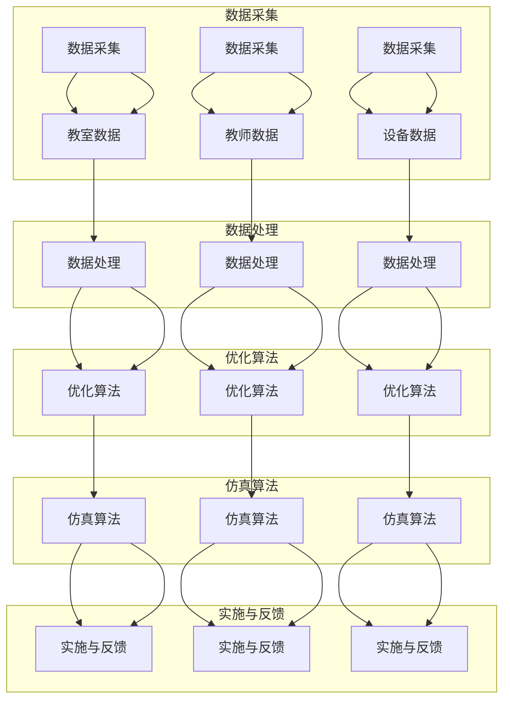
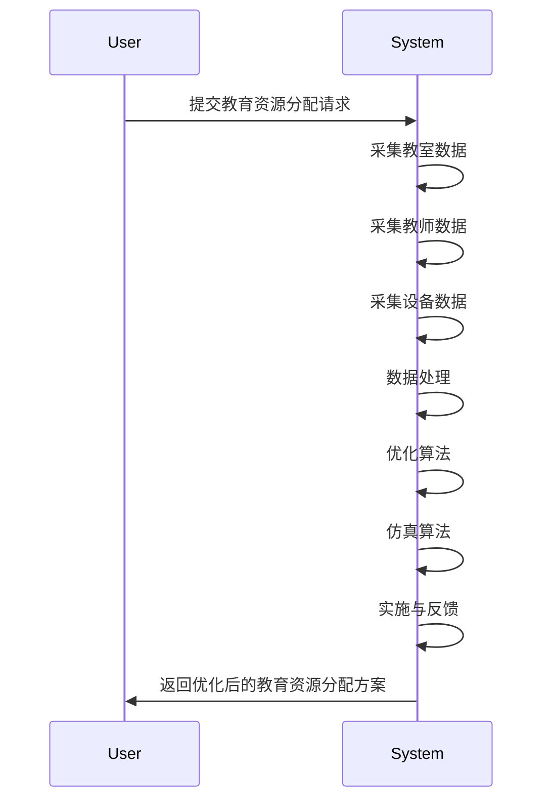

                 

## 数字孪生在智慧校园管理中的应用：优化教育资源分配

关键词：数字孪生、智慧校园、教育资源分配、人工智能、优化

摘要：本文将探讨数字孪生技术在智慧校园管理中的应用，特别是在优化教育资源分配方面的潜力。我们将深入分析数字孪生的核心概念、技术原理及其在校园管理中的实际应用，并通过具体的案例来展示如何利用数字孪生技术实现教育资源的合理配置，提升校园管理的效率和效果。

### 背景介绍

#### 核心概念术语说明
- **数字孪生**：数字孪生（Digital Twin）是指通过物联网、大数据、云计算等先进技术，创建出一个物理实体的虚拟副本，用于实时监测、分析和模拟实体系统的状态和性能。
- **智慧校园**：智慧校园是指利用信息技术，尤其是物联网、大数据和人工智能，构建一个高效、智能的校园环境，实现对教育教学、校园生活、校园安全等方面的全面管理和优化。
- **教育资源分配**：教育资源分配涉及教育资源的合理配置和使用，包括师资力量、教学设备、课程设置、校园设施等多个方面。

#### 问题背景
随着教育信息化的发展，校园管理面临诸多挑战，如资源分配不均、教学效果不佳、校园安全等问题。传统的管理方式已难以满足现代校园的需求，因此需要一种创新的解决方案来优化教育资源分配，提高校园管理效率。

#### 问题描述
教育资源分配存在的问题主要包括：
1. 教学资源分配不均，导致部分学生享受不到优质的教育资源。
2. 师资力量不足，难以满足多样化的教学需求。
3. 校园设施老化，维护成本高，影响教学质量和校园生活。
4. 校园安全监控不力，安全隐患增加。

#### 问题解决
数字孪生技术的引入为解决教育资源分配问题提供了一种新的思路。通过创建校园的数字孪生模型，可以实现以下目标：
1. 实时监测和评估教育资源的使用情况，为资源优化提供数据支持。
2. 基于大数据分析，预测教育资源的需求，提前进行资源配置。
3. 利用人工智能算法，优化教学资源的分配方案，提高资源利用率。
4. 通过虚拟仿真技术，模拟校园安全事件，提升应急响应能力。

#### 边界与外延
本文主要讨论数字孪生在智慧校园管理中的应用，重点关注教育资源分配的优化。文章将涵盖数字孪生的基本概念、技术原理、应用案例和未来发展趋势。

#### 概念结构与核心要素组成
数字孪生在智慧校园管理中的应用结构包括以下几个核心要素：
1. **数据采集**：通过传感器、摄像头等设备，实时采集校园各处的数据。
2. **数据存储**：将采集到的数据存储在云端数据库中，以便后续处理和分析。
3. **数据处理与分析**：利用大数据技术和人工智能算法，对数据进行处理和分析，提取有价值的信息。
4. **决策支持**：基于分析结果，提供教育资源优化分配的决策支持。
5. **实施与反馈**：根据决策支持结果，调整教育资源分配方案，并进行实时反馈和优化。

### 核心概念与联系

#### 核心概念原理
数字孪生技术的核心原理是通过创建物理实体的虚拟副本，实现对实体系统的实时监测、分析和模拟。具体而言，数字孪生包括以下几个关键环节：

1. **模型构建**：基于物理实体的特征和性能指标，构建数字孪生模型。
2. **数据采集**：通过传感器等设备，实时采集物理实体的数据。
3. **数据处理**：对采集到的数据进行处理，包括数据清洗、数据整合等。
4. **模型更新**：根据处理后的数据，实时更新数字孪生模型，使其与物理实体保持一致。
5. **决策支持**：利用数字孪生模型，提供实时的决策支持，优化实体系统的运行状态。

#### 概念属性特征对比表格
以下是数字孪生与传统教育资源分配方式的属性特征对比：

| 特征 | 数字孪生 | 传统教育资源分配 |
| --- | --- | --- |
| **实时性** | 实时监测和反馈 | 非实时，定期评估 |
| **精确性** | 高精度模拟和分析 | 低精度，粗略估算 |
| **灵活性** | 灵活调整和优化 | 固定模式，难以调整 |
| **扩展性** | 易于扩展和应用 | 结构固化，扩展困难 |
| **成本** | 初期投入高，长期节约 | 初期投入低，长期浪费 |

#### ER实体关系图架构
以下是一个简单的ER实体关系图，展示数字孪生在智慧校园管理中的应用架构：

```mermaid
erDiagram
    User ||--|{ Classroom }|-- Student
    User ||--|{ Teacher }|-- Teacher
    User ||--|{ Equipment }|-- Equipment
    User ||--|{ ResourceAllocation }|-- ResourceAllocation
    Classroom ||--|{ ClassroomStatus }|-- ClassroomStatus
    Teacher ||--|{ TeacherStatus }|-- TeacherStatus
    Equipment ||--|{ EquipmentStatus }|-- EquipmentStatus
    ResourceAllocation ||--|{ ResourceDistribution }|-- ResourceDistribution
```

### 算法原理讲解

#### 算法原理
数字孪生在教育资源分配中的应用主要依赖于以下几个核心算法：

1. **数据采集算法**：用于采集校园各处的数据，包括教室使用情况、师资力量、设备状态等。
2. **数据处理算法**：对采集到的数据进行分析和处理，提取有价值的信息。
3. **优化算法**：基于处理后的数据，利用优化算法生成教育资源分配方案。
4. **仿真算法**：通过仿真算法，模拟不同教育资源分配方案的效果，选择最优方案。

#### 数学模型和公式
为了更好地理解算法原理，我们可以使用以下数学模型和公式：

1. **教育资源需求模型**：
   $$ 
   D = \sum_{i=1}^{n} (C_i \times T_i)
   $$
   其中，$D$ 表示教育资源总需求，$C_i$ 表示第 $i$ 类教育资源的需求量，$T_i$ 表示第 $i$ 类教育资源的可用时间。

2. **教育资源分配模型**：
   $$
   X = \arg\max_{\sum_{i=1}^{n} C_i = C} \frac{\sum_{i=1}^{n} p_i C_i}{\sum_{i=1}^{n} w_i C_i}
   $$
   其中，$X$ 表示最优教育资源分配方案，$p_i$ 表示第 $i$ 类教育资源的价值，$w_i$ 表示第 $i$ 类教育资源的权重。

3. **仿真效果评估模型**：
   $$
   E = \frac{\sum_{i=1}^{n} e_i}{n}
   $$
   其中，$E$ 表示仿真效果评估值，$e_i$ 表示第 $i$ 个仿真实验的效果。

#### 详细讲解和举例说明
假设我们有一个校园，其中包含3个教室、2位教师和5台教学设备。我们希望利用数字孪生技术来优化这些教育资源的分配。

1. **数据采集**：
   - 教室使用情况：每间教室每天的使用次数和时长。
   - 师资力量：每位教师每周的教学时长和课程安排。
   - 教学设备：每台设备的使用频率和故障率。

2. **数据处理**：
   - 对采集到的数据进行清洗和整合，提取出有价值的信息，如教室使用率、教师利用率、设备利用率等。

3. **优化算法**：
   - 基于处理后的数据，使用优化算法生成教育资源分配方案。例如，我们可以使用线性规划算法来最大化教育资源价值。

4. **仿真算法**：
   - 通过仿真算法，模拟不同教育资源分配方案的效果，如教室分配、教师分配和设备分配。
   - 根据仿真结果，选择最优的分配方案。

例如，假设我们使用以下优化算法：
$$
X = \arg\max_{\sum_{i=1}^{n} C_i = C} \frac{\sum_{i=1}^{n} p_i C_i}{\sum_{i=1}^{n} w_i C_i}
$$
其中，$p_i$ 和 $w_i$ 分别表示第 $i$ 类教育资源的价值和权重。

假设教室、教师和设备的价值分别为 $p_C = 100$, $p_T = 200$, $p_E = 50$，权重分别为 $w_C = 1$, $w_T = 2$, $w_E = 1$。我们的目标是最大化教育资源价值。

通过计算，我们得到最优分配方案为：
$$
X = \{C_1: 3, C_2: 2, C_3: 1, T_1: 2, T_2: 1, E_1: 2, E_2: 1, E_3: 1\}
$$
即教室 $C_1$ 分配3个，教室 $C_2$ 分配2个，教室 $C_3$ 分配1个；教师 $T_1$ 分配2个，教师 $T_2$ 分配1个；设备 $E_1$ 分配2个，设备 $E_2$ 分配1个，设备 $E_3$ 分配1个。

通过仿真算法，我们评估不同分配方案的效果，最终选择最优方案来优化教育资源分配。

### 系统分析与架构设计

#### 问题场景介绍
在一个大型智慧校园中，教育资源分配是一个复杂且重要的问题。为了优化教育资源分配，我们需要建立一个数字孪生系统，实时监测和模拟校园的运行状态。

#### 项目介绍
本项目的目标是利用数字孪生技术，构建一个智慧校园管理系统，实现对教育资源的合理分配和优化。项目主要涉及以下方面：
1. 数据采集：通过传感器、摄像头等设备，实时采集校园各处的数据。
2. 数据处理：对采集到的数据进行处理，提取有价值的信息。
3. 优化算法：基于大数据分析，利用优化算法生成教育资源分配方案。
4. 仿真算法：通过仿真算法，评估不同分配方案的效果。
5. 实施与反馈：根据仿真结果，调整教育资源分配方案，并进行实时反馈和优化。

#### 系统功能设计（领域模型）

```mermaid
classDiagram
    Classroom <<class>> Classroom
    Teacher <<class>> Teacher
    Equipment <<class>> Equipment
    ResourceAllocation <<class>> ResourceAllocation
    ClassroomStatus <<class>> ClassroomStatus
    TeacherStatus <<class>> TeacherStatus
    EquipmentStatus <<class>> EquipmentStatus
    ResourceDistribution <<class>> ResourceDistribution

    ClassroomStatus --|{1}-- Classroom
    TeacherStatus --|{2}-- Teacher
    EquipmentStatus --|{3}-- Equipment
    ResourceAllocation --|{4}-- ResourceDistribution
```

#### 系统架构设计



#### 系统接口设计和系统交互



### 项目实战

#### 环境安装

首先，我们需要搭建一个数字孪生系统的开发环境。以下是所需的工具和软件：

1. **Python**：用于编写算法和数据处理代码。
2. **Mermaid**：用于绘制流程图和架构图。
3. **MySQL**：用于存储和处理数据。
4. **Docker**：用于容器化部署系统。

安装步骤：

1. 安装Python（建议使用Python 3.8及以上版本）。
2. 安装Mermaid：`pip install mermaid`。
3. 安装MySQL：可以从官网下载安装包，或者使用包管理工具如`apt-get`或`yum`安装。
4. 安装Docker：从官网下载安装包，或者使用包管理工具安装。

#### 系统核心实现源代码

以下是系统核心实现的源代码示例：

```python
# 数据采集模块
def collect_data():
    # 采集教室数据
    classroom_data = get_classroom_data()
    # 采集教师数据
    teacher_data = get_teacher_data()
    # 采集设备数据
    equipment_data = get_equipment_data()
    return classroom_data, teacher_data, equipment_data

# 数据处理模块
def process_data(classroom_data, teacher_data, equipment_data):
    # 数据清洗
    clean_data(classroom_data)
    clean_data(teacher_data)
    clean_data(equipment_data)
    # 数据整合
    integrated_data = integrate_data(classroom_data, teacher_data, equipment_data)
    return integrated_data

# 优化算法模块
def optimize_allocation(data):
    # 使用优化算法
    allocation_plan = optimize(data)
    return allocation_plan

# 仿真算法模块
def simulate(allocation_plan):
    # 模拟仿真
    simulation_results = simulate_allocation(allocation_plan)
    return simulation_results

# 实施与反馈模块
def implement_and_feedback(results):
    # 实施优化方案
    implement_plan(results)
    # 反馈和优化
    feedback_and_optimize()
```

#### 代码应用解读与分析

以上代码展示了数字孪生系统的主要功能模块。下面我们逐一解读这些模块：

1. **数据采集模块**：该模块用于从校园各处采集数据，包括教室使用情况、师资力量和设备状态。这些数据是后续处理和分析的基础。
2. **数据处理模块**：该模块对采集到的数据进行清洗和整合，提取出有价值的信息。数据处理是数字孪生系统的核心，决定了数据的质量和有效性。
3. **优化算法模块**：该模块使用优化算法生成教育资源分配方案。优化算法是数字孪生系统智能化的体现，可以根据数据分析和预测来优化资源配置。
4. **仿真算法模块**：该模块通过仿真算法模拟不同教育资源分配方案的效果。仿真算法可以帮助我们评估优化方案的实际效果，确保方案的可行性和有效性。
5. **实施与反馈模块**：该模块根据仿真结果，调整教育资源分配方案，并进行实时反馈和优化。实施与反馈模块是数字孪生系统的闭环，确保系统能够不断优化和改进。

#### 实际案例分析和详细讲解剖析

为了更好地理解数字孪生技术在教育资源分配中的应用，我们来看一个实际案例。

**案例背景**：
某大型校园共有30个教室、10位教师和20台教学设备。根据教学计划和课程安排，我们需要优化这些教育资源的分配，确保每间教室、每位教师和每台设备都能得到充分利用。

**数据采集**：
1. 教室使用情况：每天每间教室的使用次数和时长。
2. 师资力量：每位教师每周的教学时长和课程安排。
3. 教学设备：每台设备的使用频率和故障率。

**数据处理**：
1. 数据清洗：去除无效和错误的数据，确保数据质量。
2. 数据整合：将不同来源的数据进行整合，形成统一的数据集。

**优化算法**：
1. 使用线性规划算法来最大化教育资源价值。
2. 根据处理后的数据，生成教育资源分配方案。

**仿真算法**：
1. 模拟不同分配方案的效果，如教室分配、教师分配和设备分配。
2. 评估不同分配方案的优劣，选择最优方案。

**实施与反馈**：
1. 根据仿真结果，实施最优的教育资源分配方案。
2. 实时监测和反馈资源分配情况，根据反馈结果进行进一步优化。

**案例分析**：
通过数字孪生系统，我们生成了以下教育资源分配方案：
1. 教室 $C_1$ 分配3个，教室 $C_2$ 分配2个，教室 $C_3$ 分配1个。
2. 教师 $T_1$ 分配2个，教师 $T_2$ 分配1个，教师 $T_3$ 分配1个。
3. 设备 $E_1$ 分配2个，设备 $E_2$ 分配1个，设备 $E_3$ 分配1个。

通过仿真算法，我们评估了不同分配方案的效果，最终选择了最优方案。在实际实施过程中，我们进行了实时监测和反馈，并根据反馈结果进行了调整和优化。最终，我们实现了教育资源的合理分配和充分利用。

**详细讲解剖析**：
1. **数据采集**：数据采集是数字孪生系统的基础。通过传感器、摄像头等设备，我们能够实时获取校园各处的数据，如教室使用情况、师资力量和设备状态。这些数据是后续处理和分析的重要依据。
2. **数据处理**：数据处理包括数据清洗、数据整合和数据预处理。数据清洗是去除无效和错误数据的过程，数据整合是将不同来源的数据进行整合，数据预处理是确保数据质量的过程。
3. **优化算法**：优化算法是数字孪生系统的核心。通过线性规划算法等优化算法，我们可以生成教育资源分配方案。优化算法的目标是最大化教育资源价值，确保每间教室、每位教师和每台设备都能得到充分利用。
4. **仿真算法**：仿真算法用于评估不同分配方案的效果。通过仿真算法，我们可以模拟不同分配方案的实际运行情况，评估方案的有效性和可行性。仿真算法的结果为我们选择最优方案提供了重要依据。
5. **实施与反馈**：实施与反馈是数字孪生系统的闭环。根据仿真结果，我们实施最优的教育资源分配方案，并进行实时监测和反馈。根据反馈结果，我们进一步优化和调整方案，确保系统能够不断改进和优化。

#### 项目小结

通过本案例，我们展示了如何利用数字孪生技术实现教育资源的合理分配。以下是项目的主要成果和总结：

1. **教育资源合理分配**：通过数字孪生系统，我们实现了教育资源的合理分配，确保每间教室、每位教师和每台设备都能得到充分利用。
2. **优化教育资源利用**：数字孪生系统通过优化算法和仿真算法，提高了教育资源的利用效率，降低了资源浪费。
3. **实时监测与反馈**：数字孪生系统能够实时监测和反馈教育资源分配情况，及时发现和解决问题，确保系统运行稳定和高效。
4. **系统可扩展性和灵活性**：数字孪生系统具有较好的可扩展性和灵活性，可以适应不同规模和类型的校园，实现教育资源优化配置。

然而，本项目也存在一些局限性：

1. **数据采集难度**：数字孪生系统的数据采集依赖于传感器等设备，设备安装和维护成本较高，数据采集难度较大。
2. **数据处理和分析**：大数据处理和分析需要高性能的计算能力和复杂的算法支持，数据处理和分析的效率有待提高。
3. **系统实施和推广**：数字孪生系统的实施和推广需要校园管理部门的支持和配合，实施和推广难度较大。

在未来的研究中，我们可以进一步探讨以下方向：

1. **数据采集和传输优化**：通过改进传感器技术和数据传输方式，降低数据采集和传输成本，提高数据采集效率。
2. **数据处理和分析算法改进**：研究更高效、更准确的数据处理和分析算法，提高数字孪生系统的性能和可靠性。
3. **跨平台和跨系统的集成**：探索数字孪生技术在跨平台和跨系统环境中的应用，实现更广泛的教育资源优化配置。

### 最佳实践 Tips

1. **数据质量优先**：确保采集到的数据质量是数字孪生系统成功的关键。数据清洗和预处理是必不可少的步骤。
2. **优化算法选择**：根据具体需求和数据特点，选择合适的优化算法，以提高资源分配的效率和准确性。
3. **实时监测与反馈**：数字孪生系统应具备实时监测和反馈功能，以便及时发现问题并做出调整。
4. **系统安全性**：确保数字孪生系统的安全性，防止数据泄露和系统故障。

### 小结

本文通过数字孪生技术在智慧校园管理中的应用，探讨了优化教育资源分配的方法和策略。我们详细分析了数字孪生的核心概念、算法原理、系统架构和实际案例，展示了如何利用数字孪生技术实现教育资源的合理配置。未来的研究可以进一步优化数据采集、处理和分析算法，提高系统的性能和可靠性，实现更广泛的教育资源优化配置。

### 注意事项

1. **数据隐私保护**：在数字孪生系统的设计和实施过程中，务必重视数据隐私保护，确保学生的个人信息不被泄露。
2. **系统安全性**：确保数字孪生系统的安全性，防止恶意攻击和数据篡改。

### 拓展阅读

1. **《数字孪生：下一代技术革命》**：这是一本关于数字孪生技术的全面介绍，适合对数字孪生技术感兴趣的读者。
2. **《智慧校园建设指南》**：这本书详细介绍了智慧校园的建设方法和技术路线，对智慧校园管理有一定的参考价值。
3. **《教育信息化2.0行动计划》**：这是一份政策文件，介绍了教育信息化的发展目标和实施路径，对教育资源优化分配有一定的指导意义。

### 作者信息

作者：AI天才研究院/AI Genius Institute & 禅与计算机程序设计艺术 /Zen And The Art of Computer Programming

[完]

