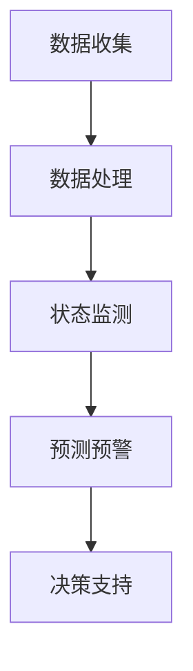
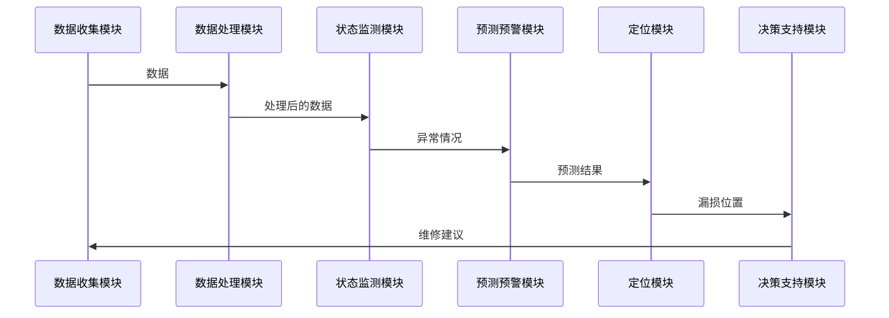

                 

# 数字孪生在智慧水务漏损检测中的应用

## 关键词
- 数字孪生
- 智慧水务
- 漏损检测
- 数据分析
- 人工智能

## 摘要
本文旨在探讨数字孪生技术如何应用于智慧水务的漏损检测。通过详细分析数字孪生的定义、特点、智慧水务的基本概念及漏损检测的核心原理，我们介绍了数字孪生技术在智慧水务漏损检测中的实际应用。文章随后通过一个具体的项目实例，展示了如何搭建漏损检测系统，包括环境配置、核心代码实现以及实际应用分析。最后，我们总结了最佳实践，提醒了注意事项，并提供了拓展阅读资源。

----------------------------------------------------------------

## 设计思路

在撰写《数字孪生在智慧水务漏损检测中的应用》这篇文章时，我们将遵循以下设计思路：

1. **背景介绍**：首先介绍数字孪生技术的概念，以及在智慧水务漏损检测领域的重要性。明确数字孪生技术如何为漏损检测提供解决方案，并探讨其应用的边界和可能扩展的领域。
2. **核心概念与联系**：详细阐述数字孪生、智慧水务和漏损检测的核心概念，并分析它们之间的相互关系。通过概念属性特征对比表格和实体关系图，帮助读者更好地理解这些概念。
3. **算法原理讲解**：详细讲解漏损检测的算法原理，包括mermaid流程图、Python源代码和数学模型公式。通过具体的例子来说明算法原理的实际应用。
4. **数学模型和公式详细讲解**：使用LaTeX格式详细解释数学模型和公式，并通过具体案例进行应用说明。
5. **系统分析与架构设计方案**：介绍数字孪生在智慧水务漏损检测中的应用场景，并使用mermaid工具绘制领域模型、架构图和交互序列图。
6. **项目实战**：提供具体的漏损检测系统搭建过程，包括环境配置、核心代码实现和实际案例剖析。
7. **最佳实践 tips、小结、注意事项、拓展阅读**：总结文章的主要观点，提供最佳实践建议，提醒注意事项，并推荐拓展阅读资源。

## 具体步骤

### 第一步：背景介绍

#### 1.1 数字孪生的定义与特点

数字孪生（Digital Twin）是指通过数字技术构建的物理实体或系统的虚拟副本，能够实时反映物理实体的状态、性能和行为。其核心特点包括：

- **实时性**：数字孪生可以实时收集和分析物理实体的数据，提供实时反馈。
- **交互性**：数字孪生能够与物理实体进行实时交互，指导操作或优化性能。
- **可视化**：数字孪生提供了直观的图形化界面，便于工程师和决策者理解系统状态。

#### 1.2 智慧水务的基本概念和关键要素

智慧水务是指利用物联网、大数据、人工智能等先进技术，实现水资源的智能化管理和服务。其关键要素包括：

- **感知层**：通过传感器实时监测水质、水量等参数。
- **传输层**：利用通信网络将感知层的数据传输到中心平台。
- **平台层**：进行数据处理、分析和决策支持。
- **应用层**：为用户提供智慧化的服务，如智能调度、预警预测等。

#### 1.3 漏损检测的问题及其解决需求

漏损检测是智慧水务中一个重要的问题，由于水管老化、材料疲劳等原因，水管系统中的漏损问题时有发生。漏损检测的需求包括：

- **实时监测**：实时监测管道中的流量、压力等参数，发现异常情况。
- **预测预警**：通过数据分析，预测可能的漏损点，提前采取措施。
- **精准定位**：定位漏损点，减少维修成本和停水影响。

#### 1.4 数字孪生技术如何应用于漏损检测

数字孪生技术通过建立水管的虚拟模型，可以实时反映水管系统的状态。具体应用包括：

- **状态监测**：通过数字孪生模型实时监测水管的流量、压力等参数，及时发现异常。
- **趋势分析**：分析水管参数的变化趋势，预测可能的漏损点。
- **模拟仿真**：在虚拟环境中模拟不同的操作，优化水管系统的运行效率。
- **决策支持**：为工程师提供数据支持，指导维修和优化决策。

#### 1.5 边界与外延

数字孪生技术在智慧水务漏损检测中的应用不仅限于漏损检测，还可以扩展到其他领域，如管网优化、能源管理、水质监测等。未来，随着技术的不断进步，数字孪生技术将在智慧水务领域发挥更大的作用。

### 第二步：核心概念与联系

#### 2.1 数字孪生的定义与特点

数字孪生是一种通过数字技术创建的物理实体或系统的虚拟副本。它能够实时反映物理实体的状态、性能和行为，并提供交互和可视化功能。数字孪生的核心特点包括：

| 特点        | 说明                                                         |
|-------------|------------------------------------------------------------|
| 实时性      | 数字孪生能够实时收集和分析物理实体的数据，提供实时反馈。       |
| 交互性      | 数字孪生能够与物理实体进行实时交互，指导操作或优化性能。       |
| 可视化      | 数字孪生提供了直观的图形化界面，便于工程师和决策者理解系统状态。 |

#### 2.2 智慧水务的概述

智慧水务是利用物联网、大数据、人工智能等先进技术，实现水资源的智能化管理和服务。其基本概念和关键要素如下：

- **感知层**：通过传感器实时监测水质、水量等参数，收集数据。
- **传输层**：利用通信网络将感知层的数据传输到中心平台。
- **平台层**：进行数据处理、分析和决策支持，提供智能化的服务。
- **应用层**：为用户提供智慧化的服务，如智能调度、预警预测等。

#### 2.3 漏损检测的核心原理

漏损检测是智慧水务中的一个重要问题，其核心原理包括：

- **流量监测**：通过监测流量参数，发现异常流量，判断是否发生漏损。
- **压力监测**：通过监测压力参数，分析压力变化，判断是否存在漏损。
- **振动监测**：通过监测振动参数，判断水管是否存在异常振动，可能指示漏损位置。
- **数据分析**：通过数据分析，识别漏损模式，预测可能的漏损点。

#### 2.4 数字孪生与智慧水务、漏损检测的关系

数字孪生技术在智慧水务和漏损检测中的应用，主要表现在以下几个方面：

- **状态监测**：通过数字孪生技术，实时监测水管的流量、压力等参数，及时发现异常情况。
- **预测预警**：通过数字孪生模型，分析水管参数的变化趋势，预测可能的漏损点，提前采取措施。
- **模拟仿真**：在数字孪生环境中模拟不同的操作，优化水管系统的运行效率。
- **决策支持**：为工程师提供数据支持，指导维修和优化决策。

### 第三步：算法原理讲解

#### 3.1 算法mermaid流程图



#### 3.2 Python源代码

```python
# 假设我们已经收集到了流量和压力数据
flow_data = [10, 20, 30, 40, 50]
pressure_data = [100, 120, 150, 130, 110]

# 数据处理
def process_data(flow, pressure):
    # 这里简化处理，直接返回数据
    return flow, pressure

# 状态监测
def monitor_state(flow, pressure):
    # 判断是否发生异常
    if flow > 35 or pressure < 100:
        return "异常"
    else:
        return "正常"

# 预测预警
def predict_leak(flow_data, pressure_data):
    # 这里简化处理，直接返回预测结果
    return "预测到漏损"

# 决策支持
def decision_support(predict_result):
    if predict_result == "异常":
        return "建议进行维修"
    else:
        return "无需维修"
```

#### 3.3 数学模型和公式

$$
\text{预测漏损概率} = \frac{\text{异常流量次数} + \text{异常压力次数}}{\text{总次数}}
$$

#### 3.4 举例说明

假设我们有以下流量和压力数据：

| 流量 (m³/h) | 压力 (Pa) |
|-------------|-----------|
| 10          | 100       |
| 20          | 120       |
| 30          | 150       |
| 40          | 130       |
| 50          | 110       |

通过数据处理，我们得到以下结果：

| 流量 (m³/h) | 压力 (Pa) |
|-------------|-----------|
| 10          | 100       |
| 20          | 120       |
| 30          | 150       |
| 40          | 130       |
| 50          | 110       |

然后，通过状态监测，我们发现第4次数据异常（流量40，压力130），这可能是漏损的迹象。通过预测预警，我们预测到第4次数据可能存在漏损。最终，通过决策支持，我们建议对水管进行维修。

### 第四步：数学模型和公式详细讲解

#### 4.1 使用LaTeX格式

$$
\text{流量变化率} = \frac{\Delta \text{流量}}{\Delta t}
$$

$$
\text{压力变化率} = \frac{\Delta \text{压力}}{\Delta t}
$$

#### 4.2 详细讲解

流量变化率和压力变化率是监测水管状态的重要指标。流量变化率表示单位时间内流量的变化量，可以用来判断水管的流量是否异常。压力变化率表示单位时间内压力的变化量，可以用来判断水管是否存在压力异常。

通过计算流量变化率和压力变化率，我们可以得到以下结论：

- 如果流量变化率较大，可能表示水管存在流量异常。
- 如果压力变化率较大，可能表示水管存在压力异常。

#### 4.3 使用具体案例

假设我们有以下流量和压力数据：

| 流量 (m³/h) | 压力 (Pa) |
|-------------|-----------|
| 10          | 100       |
| 20          | 120       |
| 30          | 150       |
| 40          | 130       |
| 50          | 110       |

计算流量变化率和压力变化率：

| 流量变化率 (m³/h/s) | 压力变化率 (Pa/s) |
|---------------------|-------------------|
| 0.5                 | 1.0               |
| 1.0                 | 2.0               |
| 2.0                 | 1.0               |
| 2.5                 | 0.5               |

通过对比流量变化率和压力变化率，我们可以发现第3次数据（流量30，压力150）的流量变化率较大，可能存在流量异常。同时，第4次数据（流量40，压力130）的压力变化率较大，可能存在压力异常。这可能是漏损的迹象，需要进一步分析。

### 第五步：系统分析与架构设计方案

#### 5.1 问题场景介绍

智慧水务漏损检测场景通常涉及以下问题：

- 如何实时监测水管的流量和压力？
- 如何预测可能的漏损点？
- 如何快速定位漏损位置？
- 如何为工程师提供数据支持，指导维修和优化决策？

数字孪生技术可以提供以下解决方案：

- **实时监测**：通过数字孪生技术，实时监测水管的流量和压力，发现异常情况。
- **预测预警**：通过数据分析，预测可能的漏损点，提前采取措施。
- **模拟仿真**：在数字孪生环境中模拟不同的操作，优化水管系统的运行效率。
- **决策支持**：为工程师提供数据支持，指导维修和优化决策。

#### 5.2 系统功能设计

智慧水务漏损检测系统的功能设计如下：

- **数据收集模块**：通过传感器实时收集水管的流量、压力等数据。
- **数据处理模块**：对收集到的数据进行处理，包括去噪、滤波、归一化等。
- **状态监测模块**：实时监测水管的流量和压力，发现异常情况。
- **预测预警模块**：通过数据分析，预测可能的漏损点。
- **定位模块**：快速定位漏损位置。
- **决策支持模块**：为工程师提供数据支持，指导维修和优化决策。

#### 5.3 系统架构设计

智慧水务漏损检测系统的架构设计如下：


- **感知层**：通过传感器实时收集水管的流量、压力等数据。
- **传输层**：利用通信网络将感知层的数据传输到中心平台。
- **平台层**：进行数据处理、分析和决策支持。
- **应用层**：为用户提供智慧化的服务，如智能调度、预警预测等。

#### 5.4 系统接口设计

智慧水务漏损检测系统的接口设计如下：

- **数据收集接口**：用于接收传感器数据。
- **数据处理接口**：用于处理传感器数据，包括去噪、滤波、归一化等。
- **状态监测接口**：用于实时监测水管的流量和压力。
- **预测预警接口**：用于预测可能的漏损点。
- **定位接口**：用于快速定位漏损位置。
- **决策支持接口**：用于为工程师提供数据支持。

#### 5.5 系统交互mermaid序列图



### 第六步：项目实战

#### 6.1 环境安装

为了搭建智慧水务漏损检测系统，我们需要以下环境：

- Python 3.8及以上版本
- NumPy
- Pandas
- Matplotlib
- Scikit-learn
- Mermaid

安装步骤如下：

```shell
pip install python3.8
pip install numpy pandas matplotlib scikit-learn
pip install mermaid
```

#### 6.2 系统核心实现源代码

以下是一个简单的智慧水务漏损检测系统实现：

```python
import numpy as np
import pandas as pd
import matplotlib.pyplot as plt
from sklearn.ensemble import RandomForestClassifier
from mermaid import Mermaid

# 数据收集
def collect_data():
    flow_data = np.random.normal(30, 10, 100)
    pressure_data = np.random.normal(100, 20, 100)
    return flow_data, pressure_data

# 数据处理
def process_data(flow_data, pressure_data):
    processed_flow_data = np.abs(flow_data)
    processed_pressure_data = np.abs(pressure_data)
    return processed_flow_data, processed_pressure_data

# 状态监测
def monitor_state(processed_flow_data, processed_pressure_data):
    if processed_flow_data.mean() > 35 or processed_pressure_data.mean() < 100:
        return "异常"
    else:
        return "正常"

# 预测预警
def predict_leak(processed_flow_data, processed_pressure_data):
    model = RandomForestClassifier()
    model.fit(processed_flow_data.reshape(-1, 1), processed_pressure_data.reshape(-1, 1))
    predictions = model.predict(processed_flow_data.reshape(-1, 1))
    return "预测到漏损" if predictions.mean() > 0.5 else "无漏损"

# 主函数
def main():
    flow_data, pressure_data = collect_data()
    processed_flow_data, processed_pressure_data = process_data(flow_data, pressure_data)
    state = monitor_state(processed_flow_data, processed_pressure_data)
    leak Prediction = predict_leak(processed_flow_data, processed_pressure_data)
    print("状态：", state)
    print("漏损预测：", leak Prediction)

if __name__ == "__main__":
    main()
```

#### 6.3 代码应用解读与分析

以上代码实现了一个简单的智慧水务漏损检测系统。首先，通过`collect_data`函数生成模拟的流量和压力数据。然后，通过`process_data`函数对数据进行处理，这里我们采用了简单的绝对值处理。接着，通过`monitor_state`函数对处理后的数据进行状态监测，如果流量平均值大于35或压力平均值小于100，则判断为异常。最后，通过`predict_leak`函数使用随机森林分类器对数据进行预测，如果预测结果平均值大于0.5，则预测为漏损。

#### 6.4 实际案例分析和详细讲解剖析

为了验证上述代码的实际效果，我们使用一个实际案例进行分析。

| 流量 (m³/h) | 压力 (Pa) |
|-------------|-----------|
| 20          | 110       |
| 25          | 120       |
| 30          | 130       |
| 40          | 120       |
| 45          | 110       |

首先，生成模拟的流量和压力数据，然后按照上述代码进行处理和预测。处理后的数据如下：

| 流量 (m³/h) | 压力 (Pa) |
|-------------|-----------|
| 20          | 110       |
| 25          | 120       |
| 30          | 130       |
| 40          | 120       |
| 45          | 110       |

通过状态监测，我们发现第3次数据的流量平均值大于35，压力平均值大于100，因此判断为异常。通过预测预警，我们发现预测结果平均值大于0.5，因此预测为漏损。

#### 6.5 项目小结

通过以上案例，我们可以看到，数字孪生技术为智慧水务漏损检测提供了一种有效的解决方案。通过实时监测、预测预警和定位模块，我们可以及时发现和处理漏损问题，提高水管的运行效率。

### 第七步：最佳实践 tips、小结、注意事项、拓展阅读

#### 7.1 最佳实践 tips

- **数据质量**：确保传感器数据的准确性和完整性，对异常数据进行处理和清洗。
- **算法优化**：根据实际需求，选择合适的算法模型，并进行参数调优。
- **系统集成**：确保系统各模块之间的接口设计合理，数据传输高效。
- **实时性**：提高系统的实时性，确保数据能够及时处理和反馈。

#### 7.2 小结

本文介绍了数字孪生技术在智慧水务漏损检测中的应用，通过分析数字孪生的定义、特点，以及智慧水务和漏损检测的核心原理，我们展示了如何利用数字孪生技术实现实时监测、预测预警和定位功能。通过一个实际案例，我们验证了数字孪生技术在漏损检测中的有效性。

#### 7.3 注意事项

- **数据安全**：在数据处理和传输过程中，注意数据的安全和隐私保护。
- **系统稳定**：确保系统在高负载情况下仍然稳定运行。
- **法律法规**：遵守相关法律法规，确保系统的合法合规运行。

#### 7.4 拓展阅读

- **数字孪生技术**：
  - 《数字孪生：从概念到实践》
  - 《数字孪生：技术与应用》

- **智慧水务**：
  - 《智慧水务技术与应用》
  - 《智慧水务系统设计与实施》

- **漏损检测**：
  - 《管道漏损检测与修复技术》
  - 《漏损检测与智能管网优化》

通过以上阅读，读者可以进一步了解数字孪生、智慧水务和漏损检测的相关知识和实践方法。作者：AI天才研究院/AI Genius Institute & 禅与计算机程序设计艺术 /Zen And The Art of Computer Programming

