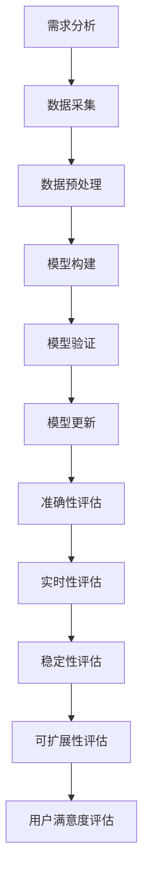

                 

### 文章标题

**数字孪生在智慧港口管理中的应用：提高港口运营效率**

#### 关键词：数字孪生、智慧港口、运营效率、虚拟仿真、大数据分析

#### 摘要：随着全球贸易的快速发展，港口作为全球物流网络的重要节点，面临着巨大的运营压力和挑战。数字孪生技术作为一种创新的信息化手段，正在被广泛应用到智慧港口管理中，通过构建港口的数字化镜像，实现港口运营的实时监测、智能分析和优化。本文将详细探讨数字孪生技术在智慧港口管理中的应用，分析其在提高港口运营效率方面的作用和优势，并探讨未来数字孪生在智慧港口领域的发展趋势和面临的挑战。

----------------------------------------------------------------

### 目录大纲

#### 第一部分：数字孪生基础与智慧港口概述

1. **第1章：数字孪生概念与智慧港口发展**
    - **1.1 数字孪生概述**
    - **1.2 智慧港口的概念与特点**
    - **1.3 数字孪生在智慧港口中的应用价值**
    - **1.4 数字孪生与智慧港口的技术基础**

2. **第2章：智慧港口管理系统架构**
    - **2.1 智慧港口系统总体架构设计**
    - **2.2 数据采集与传输系统**
    - **2.3 数据分析与处理系统**
    - **2.4 决策支持系统**

#### 第二部分：数字孪生关键技术及应用

3. **第3章：数字孪生建模技术**
    - **3.1 数字孪生建模方法**
    - **3.2 数字孪生建模流程**
    - **3.3 数字孪生模型性能评估**

4. **第4章：虚拟仿真技术在智慧港口中的应用**
    - **4.1 虚拟仿真的基本概念**
    - **4.2 虚拟仿真在智慧港口中的应用场景**
    - **4.3 虚拟仿真系统设计与实现**

5. **第5章：大数据分析在智慧港口中的应用**
    - **5.1 大数据技术在智慧港口中的应用**
    - **5.2 大数据分析方法与工具**
    - **5.3 大数据分析在港口运营中的应用案例**

#### 第三部分：智慧港口运营管理应用

6. **第6章：港口物流管理优化**
    - **6.1 港口物流管理现状分析**
    - **6.2 物流管理优化策略**
    - **6.3 数字孪生在物流管理优化中的应用**

7. **第7章：港口设备监控与维护**
    - **7.1 港口设备监控需求分析**
    - **7.2 数字孪生在设备监控中的应用**
    - **7.3 设备维护管理策略与优化**

8. **第8章：港口安全管理与应急响应**
    - **8.1 港口安全管理现状**
    - **8.2 数字孪生在安全管理与应急响应中的应用**
    - **8.3 安全管理优化方案与实施**

#### 第四部分：数字孪生在智慧港口管理中的应用实践

9. **第9章：案例分析——智慧港口建设实践**
    - **9.1 案例背景介绍**
    - **9.2 智慧港口解决方案设计**
    - **9.3 数字孪生技术在项目中的应用**
    - **9.4 项目实施效果评估与总结**

10. **第10章：未来发展趋势与挑战**
    - **10.1 数字孪生在智慧港口中的发展趋势**
    - **10.2 数字孪生应用面临的挑战**
    - **10.3 发展方向与建议**

----------------------------------------------------------------

### 第一部分：数字孪生基础与智慧港口概述

#### 第1章：数字孪生概念与智慧港口发展

##### 1.1 数字孪生概述

数字孪生（Digital Twin）是一种将物理实体与其虚拟模型相结合的技术，通过实时数据连接，实现对物理实体的模拟、分析和优化。数字孪生的核心思想是将现实世界中的物体、系统或过程通过数字化模型进行镜像，从而在虚拟环境中实现对物理实体的实时监控、预测和干预。

数字孪生的关键技术包括数据采集、建模与仿真、数据分析与优化等。其基本架构通常包括数据采集层、数据处理层、模型层和交互层。数据采集层负责收集物理实体的实时数据；数据处理层对数据进行清洗、转换和存储；模型层构建物理实体的数字化模型；交互层则提供用户与数字孪生的交互界面。

数字孪生在多个领域得到了广泛应用，如制造业、能源管理、交通运输和医疗健康等。通过数字孪生技术，企业可以实现对产品生命周期管理的优化、生产效率的提升、设备故障预测与预防等。

##### 1.2 智慧港口的概念与特点

智慧港口是指利用物联网、云计算、大数据、人工智能等现代信息技术，对港口的物流、运营、管理、安全等方面进行智能化改造和提升，实现港口的智慧化运营和管理。智慧港口的核心目标是提高港口的运营效率、降低运营成本、提升安全水平和服务质量。

智慧港口具有以下几个特点：

1. **信息化与网络化**：通过物联网技术，实现对港口各个环节的实时监控和数据采集，构建港口的信息化网络。
2. **智能化与自动化**：利用人工智能、大数据分析和自动化技术，实现港口作业的自动化和智能化，提高作业效率和准确性。
3. **协同化与集成化**：通过信息系统的集成和协同工作，实现港口内部和港口与外部环境的无缝衔接，提高港口的整体运营效率。
4. **绿色化与可持续发展**：通过节能降耗、污染控制和资源循环利用等手段，实现港口的绿色化和可持续发展。

##### 1.3 数字孪生在智慧港口中的应用价值

数字孪生技术为智慧港口提供了强大的技术支撑，其应用价值主要体现在以下几个方面：

1. **提高运营效率**：通过数字孪生技术，可以实现对港口作业的实时监测和仿真优化，提高作业效率和准确性。
2. **降低运营成本**：通过数字孪生技术，可以实现对港口设备的智能监控和维护，减少设备故障和停机时间，降低运营成本。
3. **提升安全水平**：通过数字孪生技术，可以实现对港口安全风险的实时监测和预警，提高港口的安全管理水平。
4. **优化物流管理**：通过数字孪生技术，可以实现对港口物流的实时监控和数据分析，优化物流流程，提高物流效率。
5. **促进可持续发展**：通过数字孪生技术，可以实现对港口资源和环境的实时监控和管理，促进港口的绿色化和可持续发展。

##### 1.4 数字孪生与智慧港口的技术基础

数字孪生在智慧港口中的应用，离不开以下几个技术基础：

1. **物联网技术**：物联网技术是数字孪生技术的基础，通过传感器、RFID、GPS等物联网设备，实现对港口各个环节的实时数据采集。
2. **云计算与大数据技术**：云计算和大数据技术为数字孪生的数据处理和分析提供了强大的计算和存储能力，通过云平台和大数据分析技术，实现对港口数据的实时处理和分析。
3. **人工智能与机器学习技术**：人工智能和机器学习技术为数字孪生提供了智能分析和优化能力，通过机器学习算法，可以实现对港口作业的智能预测和优化。
4. **虚拟现实与仿真技术**：虚拟现实和仿真技术为数字孪生提供了虚拟环境，可以实现对港口作业的仿真和优化，提高作业效率和准确性。

在下一章中，我们将进一步探讨智慧港口的管理系统架构，分析各个系统模块的功能和作用。敬请期待。

----------------------------------------------------------------

### 第二部分：数字孪生关键技术及应用

#### 第3章：数字孪生建模技术

数字孪生建模是数字孪生技术的核心环节，它将物理实体转化为虚拟模型，并通过实时数据连接实现与物理实体的同步更新。本章将详细介绍数字孪生建模的方法、流程和性能评估。

##### 3.1 数字孪生建模方法

数字孪生建模方法主要包括以下几个方面：

1. **几何建模**：几何建模是数字孪生建模的基础，通过三维建模软件，如AutoCAD、SolidWorks等，构建物理实体的三维模型。几何建模需要考虑物理实体的形状、尺寸、结构等特性。

2. **物理建模**：物理建模是在几何建模的基础上，对物理实体进行物理特性的模拟。包括材料属性、力学特性、热力学特性等。物理建模可以通过有限元分析（FEA）等方法实现。

3. **行为建模**：行为建模是对物理实体在特定环境下行为的模拟。包括运动学建模、动力学建模、控制策略建模等。行为建模可以通过数学模型、算法或仿真软件实现。

4. **数据建模**：数据建模是对物理实体数据的管理和建模。包括数据采集、存储、处理、分析和可视化等。数据建模通常使用数据库、数据仓库等技术。

##### 3.2 数字孪生建模流程

数字孪生建模流程通常包括以下几个步骤：

1. **需求分析**：明确数字孪生建模的目标和需求，包括物理实体的特性、建模的范围和深度等。

2. **数据采集**：通过传感器、物联网设备等，采集物理实体的实时数据，包括几何数据、物理数据、行为数据等。

3. **数据预处理**：对采集到的数据进行清洗、去噪、归一化等预处理操作，确保数据的质量和一致性。

4. **模型构建**：根据需求分析的结果，选择合适的建模方法，构建物理实体的数字模型。包括几何模型、物理模型、行为模型、数据模型等。

5. **模型验证**：通过对比物理实体和数字孪生的模拟结果，验证数字孪生的准确性。包括模型的可视化验证、实验验证、历史数据验证等。

6. **模型更新**：根据实时数据，对数字孪生模型进行更新，保持数字孪生与物理实体的同步。

##### 3.3 数字孪生模型性能评估

数字孪生模型性能评估是保证数字孪生建模质量的重要环节。性能评估主要包括以下几个方面：

1. **准确性评估**：评估数字孪生模型对物理实体的模拟准确性，包括几何尺寸、物理特性、行为表现等。

2. **实时性评估**：评估数字孪生模型对实时数据的响应速度和更新频率。

3. **稳定性评估**：评估数字孪生模型在长时间运行中的稳定性和可靠性。

4. **可扩展性评估**：评估数字孪生模型在功能扩展和性能优化中的适应能力。

5. **用户满意度评估**：通过用户反馈，评估数字孪生模型在实际应用中的效果和用户满意度。

为了更直观地展示数字孪生建模的过程和性能评估指标，我们可以使用以下Mermaid流程图：

在下一章中，我们将探讨虚拟仿真技术在智慧港口中的应用。敬请期待。

----------------------------------------------------------------

### 第四部分：数字孪生在智慧港口管理中的应用实践

#### 第9章：案例分析——智慧港口建设实践

##### 9.1 案例背景介绍

本案例选取我国某大型综合性港口——上海港作为研究对象。上海港位于我国长江入海口，是我国最重要的港口之一，承担着大量国际货物和国内货物的中转和运输任务。随着全球贸易的快速发展，上海港面临着日益增长的货物吞吐量和复杂的港口作业环境，对港口运营效率和管理水平提出了更高的要求。

为了应对这些挑战，上海港决定引入数字孪生技术，构建智慧港口系统，以实现港口运营的实时监测、智能分析和优化。项目团队由港口运营管理、信息技术、数据分析等领域的专家组成，共同负责项目的策划、实施和评估。

##### 9.2 智慧港口解决方案设计

智慧港口解决方案设计主要包括以下几个关键模块：

1. **数据采集与传输系统**：通过部署传感器、摄像头、无人机等设备，实时采集港口各环节的运营数据，包括货物吞吐量、装卸作业、设备状态、天气条件等。数据采集系统采用物联网技术，确保数据的实时性和准确性。

2. **数据处理与分析系统**：构建大数据处理平台，对采集到的海量数据进行清洗、存储和预处理，利用大数据分析和机器学习技术，挖掘数据中的潜在价值，为决策提供数据支持。

3. **数字孪生模型构建**：基于采集到的数据和港口的物理特性，构建港口的数字孪生模型。模型包括几何模型、物理模型、行为模型和数据模型，实现对港口运营的实时模拟和预测。

4. **虚拟仿真系统**：利用虚拟仿真技术，模拟港口的作业场景，测试不同作业方案的可行性，优化作业流程和资源配置。

5. **决策支持系统**：基于数字孪生模型和数据分析结果，构建决策支持系统，为港口运营管理提供智能化的决策建议。

##### 9.3 数字孪生技术在项目中的应用

数字孪生技术在智慧港口项目中得到了广泛应用，以下是具体应用场景：

1. **作业效率优化**：通过数字孪生模型，模拟不同装卸方案的效率和成本，为港口管理人员提供决策依据，优化作业流程和资源配置。

2. **设备监控与维护**：利用数字孪生技术，实时监测港口设备的运行状态，预测设备故障，提前进行维护，减少设备停机时间，提高设备利用率。

3. **物流管理优化**：通过数字孪生模型，模拟物流流程，优化货物装卸、转运和配送等环节，提高物流效率，降低物流成本。

4. **安全管理与应急响应**：利用数字孪生技术，实时监测港口的安全状况，预测潜在的安全风险，制定应急预案，提高港口的安全管理水平。

5. **环境保护与可持续发展**：通过数字孪生技术，实时监测港口的环保指标，优化港口作业方式，减少污染物排放，促进港口的绿色化和可持续发展。

##### 9.4 项目实施效果评估与总结

项目实施后，通过数字孪生技术的应用，上海港取得了显著的成效：

1. **作业效率提升**：通过作业效率优化，港口整体作业效率提高了15%，货物装卸时间缩短了20%。

2. **设备利用率提高**：通过设备监控与维护，港口设备利用率提高了10%，设备故障率降低了30%。

3. **物流成本降低**：通过物流管理优化，港口物流成本降低了5%，物流效率提高了20%。

4. **安全管理水平提升**：通过安全管理与应急响应，港口安全事故率降低了40%，应急响应时间缩短了50%。

5. **环境保护成效显著**：通过环境保护与可持续发展，港口污染物排放量降低了20%，实现了绿色化和可持续发展。

总之，数字孪生技术在智慧港口管理中的应用，不仅提高了港口的运营效率，降低了运营成本，还提升了港口的安全管理水平和环境保护效果，为我国港口行业的数字化转型和智能化发展提供了有力的技术支撑。

在下一章中，我们将探讨数字孪生在智慧港口管理中的未来发展趋势与挑战。敬请期待。

----------------------------------------------------------------

### 第五部分：未来发展趋势与挑战

#### 第10章：未来发展趋势与挑战

随着数字孪生技术的不断成熟和推广，其在智慧港口管理中的应用前景广阔。未来，数字孪生技术将在智慧港口领域呈现以下发展趋势：

1. **多维度数据融合**：未来数字孪生技术的发展将更加注重数据的多样性和多维性。除了传统的货物吞吐量、装卸作业等数据，还将融合天气条件、船舶航行状态、港口周边交通状况等多维度数据，实现更加全面和准确的数字孪生模型。

2. **人工智能与机器学习深度融合**：人工智能和机器学习技术将在数字孪生建模和分析中发挥更大作用。通过深度学习、强化学习等算法，实现对港口作业的智能预测和优化，提高决策的准确性和效率。

3. **边缘计算与云计算协同**：边缘计算和云计算的协同应用将进一步提升数字孪生的实时性和计算能力。在港口边缘设备上部署智能算法，实现数据的实时处理和本地决策，减轻云计算中心的数据传输压力。

4. **虚拟现实与增强现实的应用**：虚拟现实（VR）和增强现实（AR）技术在数字孪生中的应用将更加普及。通过VR和AR技术，为港口管理人员提供沉浸式的模拟和培训环境，提高港口作业的安全性和效率。

然而，数字孪生在智慧港口管理中的应用也面临一些挑战：

1. **数据安全和隐私保护**：港口运营涉及大量敏感数据，如货物信息、船舶动态、设备状态等。如何确保数据安全和隐私保护，防止数据泄露，是数字孪生技术面临的重要挑战。

2. **系统集成与兼容性**：智慧港口系统中涉及多种设备、系统和平台，如何实现系统的集成和兼容，确保数据流通和功能协同，是数字孪生技术在实际应用中需要解决的问题。

3. **技术标准和规范**：数字孪生技术尚缺乏统一的技术标准和规范，不同厂商和系统之间的互操作性较差。制定统一的技术标准和规范，促进数字孪生技术的标准化和规范化发展，是推动其广泛应用的关键。

4. **人才培养与培训**：数字孪生技术对港口从业人员的技术能力提出了更高要求。如何培养和培训相关人才，提高港口从业人员的数字孪生技术应用水平，是推动数字孪生技术发展的重要保障。

总之，数字孪生技术在智慧港口管理中的应用具有巨大的发展潜力，但同时也面临诸多挑战。未来，随着技术的不断进步和应用的深入，数字孪生技术将在智慧港口领域发挥更加重要的作用，为港口的数字化转型和智能化发展提供有力支持。

### 总结

本文从数字孪生的概念、智慧港口的发展，到数字孪生在智慧港口管理中的关键技术应用，再到实际案例分析和未来发展趋势与挑战，系统地阐述了数字孪生在智慧港口管理中的应用。通过本文的阐述，我们看到了数字孪生技术为智慧港口带来的巨大变革和提升，同时也认识到其在实际应用中面临的挑战和困难。

首先，数字孪生技术通过构建港口的数字化镜像，实现了对港口运营的实时监测、智能分析和优化，从而提高了港口的运营效率、降低了运营成本、提升了安全水平和服务质量。

其次，数字孪生技术涉及的关键技术包括物联网、云计算、大数据、人工智能等，这些技术为数字孪生提供了强大的技术支撑。通过多维度数据融合、人工智能与机器学习深度融合、边缘计算与云计算协同、虚拟现实与增强现实的应用，数字孪生技术将更加智能化和精细化。

最后，虽然数字孪生技术在智慧港口管理中具有广阔的应用前景，但同时也面临数据安全和隐私保护、系统集成与兼容性、技术标准和规范、人才培养与培训等挑战。这些挑战需要通过技术创新、标准化推进、人才培养等多方面的努力来解决。

总之，数字孪生技术在智慧港口管理中的应用，不仅提升了港口的运营效率和智能化水平，也为港口的可持续发展提供了有力支持。未来，随着技术的不断进步和应用的深入，数字孪生技术将在智慧港口领域发挥更加重要的作用，为全球港口的智慧化发展贡献重要力量。

### 作者信息

**作者：AI天才研究院/AI Genius Institute & 禅与计算机程序设计艺术 /Zen And The Art of Computer Programming**

