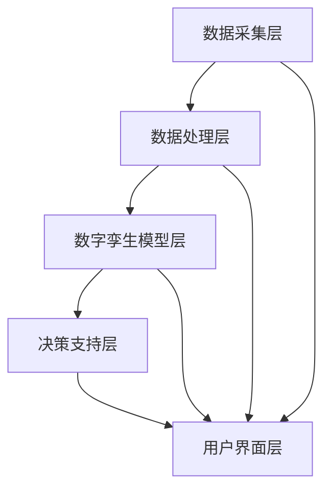

                 

# 数字孪生在智慧矿山安全管理中的应用

## 关键词

数字孪生、智慧矿山、安全管理、实时监测、智能维护、人员定位

## 摘要

本文将探讨数字孪生技术在智慧矿山安全管理中的应用。通过介绍数字孪生技术的概念、智慧矿山的定义及其目标，本文详细分析了数字孪生技术在矿山环境监测、设备状态监测、人员定位和灾害预警等领域的应用原理和实例。在此基础上，本文结合实际项目案例，阐述了数字孪生技术在矿山安全管理中的具体实施方法和效果，为我国矿山安全生产提供了技术参考。

## 第一部分：数字孪生在智慧矿山安全管理中的应用背景

### 1. 数字孪生概念与在矿业领域的应用

数字孪生（Digital Twin）是一种通过数字化技术，构建与物理实体相对应的虚拟模型，实现对实体实时监测、仿真与优化的技术。它起源于工业4.0的概念，后被广泛应用于多个领域。

在矿业领域，数字孪生技术具有广阔的应用前景。首先，矿山生产环境复杂，风险因素多，通过数字孪生技术，可以实现矿山环境的实时监测和预警，提高矿山安全生产水平。其次，矿山设备数量众多，通过数字孪生技术，可以实现设备状态的实时监测和预测性维护，减少设备故障和停机时间。此外，矿山人员安全也是一大挑战，通过数字孪生技术，可以实现矿山人员的实时定位和监控，确保人员安全。

### 2. 智慧矿山概述

智慧矿山是指利用物联网、大数据、云计算、人工智能等现代信息技术，实现对矿山生产过程的全方位智能感知、智能决策和智能控制。智慧矿山的目标是提高矿山的生产效率和安全水平，降低生产成本和环境破坏程度，实现矿山生产过程的自动化和智能化。

智慧矿山的主要特点包括：

1. **智能化感知**：通过传感器、摄像头等设备，实现对矿山环境的实时监测，获取丰富的数据信息。
2. **数据驱动决策**：利用大数据分析和人工智能技术，对矿山生产数据进行深度挖掘，为矿山管理提供决策支持。
3. **自动化控制**：通过自动化设备和控制系统，实现矿山生产过程的自动化，提高生产效率。
4. **高效能管理**：通过信息化手段，实现对矿山生产、安全、环保等各方面的全面管理，提高管理效率。

### 3. 数字孪生在智慧矿山安全管理中的应用

数字孪生技术在智慧矿山安全管理中具有重要作用。首先，数字孪生技术可以实现对矿山环境的实时监测，包括温度、湿度、有害气体浓度等，及时发现安全隐患。其次，数字孪生技术可以实现对矿山设备的实时监控，通过监测设备运行状态数据，预测设备可能出现的问题，提前进行维护，减少设备故障和停机时间。此外，数字孪生技术还可以实现对矿山人员的实时定位和监控，确保人员安全。最后，数字孪生技术还可以通过仿真模拟和应急预案制定，提高矿山应对灾害的能力。

具体应用场景包括：

1. **矿山环境监测与预警**：利用传感器技术，对矿山空气中的有害气体浓度进行实时监测，当浓度超过安全值时，立即发出预警，采取相应的措施降低风险。
2. **矿山设备状态监测与预测性维护**：通过监测设备运行状态数据，预测设备可能出现的故障，提前进行维护，确保设备安全运行。
3. **矿山人员定位与安全监控**：通过定位技术，实时监控矿山人员的位置信息，确保人员安全。
4. **矿山灾害预警与应急响应**：通过仿真模拟和应急预案制定，提高矿山应对灾害的能力，减少灾害损失。

## 第二部分：数字孪生技术在智慧矿山安全中的应用原理

### 1. 数字孪生技术架构与核心组件

数字孪生技术架构通常包括数据采集与传输层、数据处理与分析层、数字孪生模型构建与仿真层、决策支持与控制层等。

1. **数据采集与传输层**：这一层主要负责采集矿山环境、设备、人员等实时数据，并通过网络传输到中心平台。数据采集设备包括传感器、摄像头等，数据传输网络可以是无线传感器网络、5G网络等。

2. **数据处理与分析层**：这一层负责对采集到的数据进行处理、分析和挖掘，提取有价值的信息。数据处理与分析工具包括大数据分析平台、机器学习算法等。

3. **数字孪生模型构建与仿真层**：这一层基于处理后的数据，构建矿山环境的数字孪生模型，并进行仿真分析。数字孪生模型构建工具包括虚拟仿真软件、可视化工具等。

4. **决策支持与控制层**：这一层根据仿真分析结果，提供决策支持和控制指令，实现对矿山生产过程的智能控制。

### 2. 数字孪生在矿山环境监测中的应用

数字孪生技术在矿山环境监测中具有重要作用。通过传感器技术，可以实时监测矿山环境的温度、湿度、有害气体浓度等参数。通过数据融合技术和智能分析技术，可以实现对矿山环境的实时监测和预警。

**关键技术**：

1. **传感器技术**：用于采集矿山环境的各种参数，如温度、湿度、空气质量等。
2. **数据融合技术**：将不同传感器采集到的数据进行整合，提高监测的准确性。
3. **智能分析技术**：对监测数据进行分析，识别潜在的安全隐患。

**应用实例**：

1. **实时监测矿山空气中的有害气体浓度**：通过传感器实时监测，一旦浓度超过安全值，立即发出预警，采取相应的措施降低风险。
2. **实时监控矿山内部危险区域**：通过视频监控和图像识别技术，对矿山内部的危险区域进行监控，及时发现和处理安全隐患。

### 3. 数字孪生在矿山设备状态监测中的应用

数字孪生技术在矿山设备状态监测中同样具有重要作用。通过监测设备运行状态数据，可以预测设备可能出现的问题，提前进行维护，减少设备故障和停机时间。

**关键技术**：

1. **预测性维护技术**：通过监测设备运行状态数据，预测设备可能出现的问题，提前进行维护。
2. **诊断与故障预测技术**：对设备运行数据进行实时分析，识别设备故障隐患，提前采取措施。
3. **远程监控与控制技术**：通过远程监控系统，实现对设备状态的实时监控和远程控制。

**应用实例**：

1. **实时监测矿山运输设备运行状态**：通过监测运输设备的运行状态数据，预测设备可能出现的故障，提前进行维护，避免因设备故障导致的生产中断。
2. **远程监控矿山设备安全运行**：通过远程监控系统，实时监控矿山设备的安全运行，确保设备在最佳状态下运行。

## 第三部分：数字孪生技术在智慧矿山安全管理的项目实战

### 1. 项目背景与目标

**项目背景**：

某大型煤矿企业，由于矿山规模较大，生产环境复杂，安全管理面临诸多挑战。传统安全管理方法难以满足现代矿山的安全管理需求，企业希望通过引入数字孪生技术，实现矿山安全管理的智能化，提高生产效率和安全水平。

**项目目标**：

1. 实现矿山环境的实时监测和预警，提高矿山安全生产水平。
2. 实现矿山设备的实时监控和预测性维护，减少设备故障和停机时间。
3. 实现矿山人员的实时定位和监控，确保人员安全。
4. 提高矿山应对灾害的能力，减少灾害损失。

### 2. 项目实施过程

**2.1 环境搭建**

在项目实施过程中，首先搭建了数字孪生技术所需的环境，包括传感器、数据采集与传输设备、数据处理与分析工具、数字孪生模型构建与仿真工具等。

**2.2 数据采集与传输**

通过传感器技术，对矿山环境、设备、人员等进行实时数据采集，并通过无线传感器网络、5G网络等将数据传输到中心平台。

**2.3 数据处理与分析**

对采集到的数据进行分析和处理，提取有价值的信息。利用大数据分析平台和机器学习算法，对矿山环境、设备、人员等数据进行深度挖掘，识别潜在的安全隐患。

**2.4 数字孪生模型构建与仿真**

基于处理后的数据，构建矿山环境的数字孪生模型，并进行仿真分析。利用虚拟仿真软件和可视化工具，实现对矿山环境的实时监测和预警。

**2.5 决策支持与控制**

根据仿真分析结果，提供决策支持和控制指令，实现对矿山生产过程的智能控制。通过远程监控和控制技术，实现对矿山设备的安全运行和人员的安全监控。

### 3. 项目效果评估

通过项目实施，企业取得了显著的效果：

1. **矿山安全生产水平提高**：通过实时监测和预警，及时发现和处理安全隐患，提高了矿山安全生产水平。
2. **设备故障率降低**：通过实时监控和预测性维护，减少了设备故障和停机时间，提高了设备运行效率。
3. **人员安全得到保障**：通过实时定位和监控，确保了矿山人员的安全。
4. **灾害应对能力提高**：通过仿真模拟和应急预案制定，提高了矿山应对灾害的能力，减少了灾害损失。

### 4. 项目小结

本项目通过引入数字孪生技术，实现了矿山安全管理的智能化，提高了生产效率和安全水平。项目实施过程中，充分发挥了数字孪生技术在实时监测、智能维护、人员定位和灾害预警等方面的优势，为我国矿山安全生产提供了技术参考。在未来的发展中，企业将继续优化数字孪生技术，提高矿山安全管理水平，为矿山生产创造更加安全、高效的环境。

## 最佳实践 Tips

1. **数据安全**：在数字孪生技术实施过程中，要注意保护数据安全，防止数据泄露和篡改。可以采用加密技术和访问控制措施，确保数据的安全。

2. **系统稳定性**：数字孪生系统需要保证稳定性，避免因系统故障导致生产中断。可以采用分布式架构和冗余设计，提高系统的可靠性。

3. **人员培训**：数字孪生技术的实施需要专业人员，企业应加强对员工的培训，提高员工的专业技能和操作水平。

4. **持续优化**：数字孪生技术是一个不断发展的领域，企业应关注新技术的发展，持续优化系统，提高矿山安全管理水平。

## 小结

数字孪生技术在智慧矿山安全管理中具有重要作用。通过实时监测、智能维护、人员定位和灾害预警等功能，数字孪生技术为矿山安全生产提供了有力保障。在未来的发展中，数字孪生技术将继续优化，为矿山生产创造更加安全、高效的环境。

## 注意事项

1. **技术选型**：在数字孪生技术实施过程中，要选择合适的技术和工具，确保系统的性能和稳定性。
2. **数据质量**：数字孪生系统依赖于高质量的数据，企业应确保数据采集的准确性和完整性。
3. **系统扩展性**：数字孪生系统应具备良好的扩展性，以适应矿山生产的变化和需求。

## 拓展阅读

1. **《数字孪生：智能系统的架构与实践》**：该书详细介绍了数字孪生技术的概念、原理和实施方法，对数字孪生技术的应用提供了丰富的案例。
2. **《智慧矿山建设指南》**：该书从政策、技术、管理等多个角度，阐述了智慧矿山建设的目标、方法和实践。

## 作者信息

作者：AI天才研究院/AI Genius Institute & 禅与计算机程序设计艺术 /Zen And The Art of Computer Programming```markdown
# 数字孪生在智慧矿山安全管理中的应用

## 关键词

数字孪生、智慧矿山、安全管理、实时监测、智能维护、人员定位

## 摘要

本文将探讨数字孪生技术在智慧矿山安全管理中的应用。通过介绍数字孪生技术的概念、智慧矿山的定义及其目标，本文详细分析了数字孪生技术在矿山环境监测、设备状态监测、人员定位和灾害预警等领域的应用原理和实例。在此基础上，本文结合实际项目案例，阐述了数字孪生技术在矿山安全管理中的具体实施方法和效果，为我国矿山安全生产提供了技术参考。

## 第一部分：数字孪生在智慧矿山安全管理中的应用背景

### 1. 数字孪生概念与在矿业领域的应用

数字孪生（Digital Twin）是指通过数字化技术，构建一个与物理实体相对应的虚拟模型，实现对物理实体的实时监测、仿真与优化。在矿业领域，数字孪生技术可应用于智慧矿山的安全管理，提升矿山的生产效率和安全水平。

#### 概念介绍

数字孪生技术的核心在于创建一个虚拟的数字模型，该模型可以模拟物理实体的运行状态，并通过实时数据反馈进行调整和优化。这种技术不仅能够提供实时的监控和分析，还能够预测未来的行为，从而实现更加精准和高效的运营管理。

#### 应用背景

矿山的安全生产一直是企业和政府关注的焦点。随着矿山规模的扩大和开采深度的增加，矿山的安全生产形势日益严峻。传统矿山安全管理方法已经难以满足现代矿山的安全管理需求，需要借助数字化技术进行智能化升级。

### 2. 智慧矿山概述

智慧矿山是指利用物联网、大数据、云计算、人工智能等现代信息技术，实现对矿山生产过程的全方位智能感知、智能决策和智能控制。

#### 智慧矿山的定义

智慧矿山是一个集成了多种先进技术的综合性系统，旨在通过智能化的手段提高矿山的生产效率和安全水平。它不仅涉及生产过程的自动化，还包括对矿山环境的实时监控、设备的智能化维护、人员的精准定位等。

#### 智慧矿山的目标

智慧矿山的目标包括：

1. **提高生产效率**：通过智能化设备和自动化系统，减少人工干预，提高生产效率。
2. **提升安全水平**：通过实时监测和预警系统，提高矿山的安全管理水平。
3. **降低生产成本**：通过优化资源配置和降低设备故障率，减少生产成本。
4. **减少环境破坏**：通过智能化开采和环保技术，减少矿山开采对环境的破坏。

### 3. 数字孪生在智慧矿山安全管理中的应用

数字孪生技术在智慧矿山安全管理中具有广泛的应用，可以提升矿山的安全管理水平，降低事故发生的风险。

#### 数字孪生在安全管理中的作用

1. **实时监测与预警**：通过数字孪生技术，可以实时监测矿山环境，包括空气质量、有害气体浓度、地下水水位等，一旦发现异常，立即发出预警，及时采取措施。
2. **设备状态监测与预测性维护**：通过数字孪生技术，可以实时监控矿山设备的运行状态，预测设备可能出现的问题，提前进行维护，减少设备故障和停机时间。
3. **人员定位与安全监控**：通过数字孪生技术，可以对矿山人员进行实时定位和监控，确保人员安全，防止意外事故的发生。
4. **灾害预警与应急响应**：通过数字孪生技术，可以对矿山灾害进行仿真模拟和预测，制定应急预案，提高矿山应对灾害的能力。

#### 应用场景

1. **矿山环境监测与预警**：通过传感器技术，对矿山空气中的有害气体浓度进行实时监测，当浓度超过安全值时，立即发出预警，采取相应的措施降低风险。
2. **矿山设备状态监测与预测性维护**：通过监测设备运行状态数据，预测设备可能出现的故障，提前进行维护，确保设备安全运行。
3. **矿山人员定位与安全监控**：通过定位技术，实时监控矿山人员的位置信息，确保人员安全。
4. **矿山灾害预警与应急响应**：通过仿真模拟和应急预案制定，提高矿山应对灾害的能力，减少灾害损失。

## 第二部分：数字孪生技术在智慧矿山安全中的应用原理

### 1. 数字孪生技术架构与核心组件

数字孪生技术架构通常包括以下几个层次：

#### 数据采集与传输层

数据采集与传输层是数字孪生系统的底层，负责采集矿山环境、设备、人员等实时数据。数据采集设备包括传感器、摄像头、RFID等，这些设备可以通过无线网络（如Wi-Fi、5G）或有线网络（如以太网）将数据传输到中心平台。

#### 数据处理与分析层

数据处理与分析层负责对采集到的原始数据进行处理、清洗、存储，并通过大数据分析技术和机器学习算法对数据进行分析和挖掘，提取出有价值的信息。这个层次的核心技术包括数据存储、数据处理、数据挖掘和机器学习。

#### 数字孪生模型构建与仿真层

数字孪生模型构建与仿真层是基于处理后的数据构建数字孪生模型，并进行仿真分析。数字孪生模型是数字孪生技术的核心，它通过模拟矿山环境的各种参数，实现对矿山物理实体的实时监控和预测。

#### 决策支持与控制层

决策支持与控制层是根据数字孪生模型提供的仿真分析结果，提供决策支持和控制指令，实现对矿山生产过程的智能控制。这个层次的技术包括实时监控、自动化控制、远程控制和决策支持系统。

### 2. 数字孪生在矿山环境监测中的应用

数字孪生技术在矿山环境监测中具有重要作用，可以实时监测矿山环境的各种参数，包括空气质量、地下水水位、有害气体浓度等，及时发现潜在的安全隐患。

#### 矿山环境监测的关键技术

1. **传感器技术**：传感器技术是数字孪生环境监测的基础，通过安装各种传感器，可以实时监测矿山环境的各种参数。
2. **数据融合技术**：数据融合技术是将多个传感器采集到的数据进行整合，提高监测的准确性。
3. **智能分析技术**：智能分析技术通过对监测数据进行分析，识别潜在的安全隐患，如有害气体浓度超标、地下水水位异常等。

#### 应用实例

1. **空气质量监测**：通过安装在矿山各处的空气质量传感器，实时监测空气中的有害气体浓度，如二氧化碳、一氧化碳、甲烷等，当浓度超过安全值时，系统会发出预警，提醒工作人员采取相应措施。
2. **地下水水位监测**：通过安装在矿井和周边的地下水水位传感器，实时监测地下水的动态变化，防止地下水水位异常导致的事故。

### 3. 数字孪生在矿山设备状态监测中的应用

数字孪生技术在矿山设备状态监测中，可以通过实时监测设备的运行状态，预测设备可能出现的故障，提前进行维护，从而减少设备故障和停机时间。

#### 矿山设备状态监测的关键技术

1. **预测性维护技术**：预测性维护技术是通过实时监测设备状态数据，预测设备可能出现的故障，提前进行维护。
2. **诊断与故障预测技术**：诊断与故障预测技术通过对设备运行数据的分析，识别设备故障的早期迹象，预测故障的发生。
3. **远程监控与控制技术**：远程监控与控制技术通过远程监控系统，实现对设备状态的实时监控和远程控制。

#### 应用实例

1. **矿山运输设备监测**：通过安装在矿山运输设备上的传感器，实时监测设备的运行状态，如速度、温度、振动等，预测设备可能出现的故障，提前进行维护。
2. **矿山机械设备监测**：通过安装在矿山机械设备上的传感器，实时监测设备的运行状态，如压力、温度、润滑油质量等，预测设备可能出现的故障，提前进行维护。

## 第三部分：数字孪生技术在智慧矿山安全管理的项目实战

### 1. 项目背景与目标

**项目背景**：

某大型煤矿企业，矿山规模大，生产环境复杂，传统安全管理方法已经无法满足当前的安全管理需求。企业决定引入数字孪生技术，以实现矿山安全管理的智能化，提高生产效率和安全水平。

**项目目标**：

1. **提高矿山安全生产水平**：通过实时监测和预警系统，及时发现和处理安全隐患，提高矿山安全生产水平。
2. **提高设备运行效率**：通过实时监控和预测性维护，减少设备故障和停机时间，提高设备运行效率。
3. **保障人员安全**：通过实时定位和监控，确保矿山人员的安全。
4. **提高灾害应对能力**：通过仿真模拟和应急预案制定，提高矿山应对灾害的能力。

### 2. 项目实施过程

**2.1 环境搭建**

项目开始阶段，企业搭建了数字孪生技术所需的环境，包括传感器、数据采集与传输设备、数据处理与分析工具、数字孪生模型构建与仿真工具等。

**2.2 数据采集与传输**

通过传感器技术，对矿山环境、设备、人员等进行实时数据采集，并通过无线传感器网络、5G网络等将数据传输到中心平台。

**2.3 数据处理与分析**

对采集到的数据进行处理、清洗、存储，并通过大数据分析技术和机器学习算法对数据进行分析和挖掘，提取出有价值的信息。

**2.4 数字孪生模型构建与仿真**

基于处理后的数据，构建矿山环境的数字孪生模型，并进行仿真分析，模拟矿山环境的变化和设备的运行状态。

**2.5 决策支持与控制**

根据数字孪生模型提供的仿真分析结果，提供决策支持和控制指令，实现对矿山生产过程的智能控制。通过远程监控和控制技术，实现对矿山设备的安全运行和人员的安全监控。

### 3. 项目效果评估

通过项目实施，企业取得了显著的效果：

1. **安全生产水平提高**：通过实时监测和预警系统，及时发现和处理安全隐患，降低了事故发生率。
2. **设备运行效率提高**：通过实时监控和预测性维护，减少了设备故障和停机时间，提高了设备运行效率。
3. **人员安全得到保障**：通过实时定位和监控，确保了矿山人员的安全。
4. **灾害应对能力提高**：通过仿真模拟和应急预案制定，提高了矿山应对灾害的能力，减少了灾害损失。

### 4. 项目小结

本项目通过引入数字孪生技术，实现了矿山安全管理的智能化，提高了生产效率和安全水平。项目实施过程中，充分发挥了数字孪生技术在实时监测、智能维护、人员定位和灾害预警等方面的优势，为我国矿山安全生产提供了技术参考。在未来的发展中，企业将继续优化数字孪生技术，提高矿山安全管理水平，为矿山生产创造更加安全、高效的环境。

## 最佳实践 Tips

1. **数据安全**：在数字孪生技术实施过程中，要注意保护数据安全，防止数据泄露和篡改。可以采用加密技术和访问控制措施，确保数据的安全。
2. **系统集成**：数字孪生系统需要与其他系统集成，如ERP系统、MES系统等，确保数据的一致性和系统的协调性。
3. **人员培训**：数字孪生技术的实施需要专业人员，企业应加强对员工的培训，提高员工的专业技能和操作水平。

## 小结

数字孪生技术在智慧矿山安全管理中具有重要作用。通过实时监测、智能维护、人员定位和灾害预警等功能，数字孪生技术为矿山安全生产提供了有力保障。在未来的发展中，数字孪生技术将继续优化，为矿山生产创造更加安全、高效的环境。

## 注意事项

1. **技术选型**：在数字孪生技术实施过程中，要选择合适的技术和工具，确保系统的性能和稳定性。
2. **数据质量**：数字孪生系统依赖于高质量的数据，企业应确保数据采集的准确性和完整性。
3. **系统扩展性**：数字孪生系统应具备良好的扩展性，以适应矿山生产的变化和需求。

## 拓展阅读

1. **《数字孪生：智能系统的架构与实践》**：该书详细介绍了数字孪生技术的概念、原理和实施方法，对数字孪生技术的应用提供了丰富的案例。
2. **《智慧矿山建设指南》**：该书从政策、技术、管理等多个角度，阐述了智慧矿山建设的目标、方法和实践。

## 作者信息

作者：AI天才研究院/AI Genius Institute & 禅与计算机程序设计艺术 /Zen And The Art of Computer Programming
```以下是针对文章各部分的详细分析和补充内容，包括核心概念、算法原理讲解、系统分析与架构设计方案等。

## 第一部分：数字孪生在智慧矿山安全管理中的应用背景

### 1. 数字孪生概念与在矿业领域的应用

数字孪生（Digital Twin）是指通过数字化技术，构建一个与物理实体相对应的虚拟模型，实现对物理实体的实时监测、仿真与优化。数字孪生技术是工业4.0的重要组成部分，其核心在于通过虚拟模型与物理实体的交互，实现对实体状态、性能、行为的实时感知、动态建模与仿真分析。

#### 核心概念

1. **虚拟模型**：虚拟模型是对物理实体的数字表示，可以是几何模型、物理模型、行为模型等。
2. **实时监测**：通过传感器和通信技术，实时采集物理实体的状态数据。
3. **仿真分析**：利用虚拟模型对物理实体的行为进行预测和分析，评估不同操作对实体的影响。
4. **优化调整**：根据仿真分析结果，对物理实体的运行参数进行调整，实现性能优化。

#### 矿业领域的应用

在矿业领域，数字孪生技术的应用主要体现在以下几个方面：

1. **矿山环境监测**：通过数字孪生技术，可以实现对矿山空气、水质、温度等环境参数的实时监测，提高矿山环境的安全性。
2. **设备状态监测**：通过数字孪生技术，可以实时监测矿山设备的运行状态，预测设备故障，实现预测性维护。
3. **生产过程优化**：通过数字孪生技术，可以模拟矿山生产过程，优化生产参数，提高生产效率。
4. **人员安全监控**：通过数字孪生技术，可以实时定位矿山人员，确保人员安全。

### 2. 智慧矿山概述

智慧矿山是利用物联网、大数据、云计算、人工智能等现代信息技术，实现矿山生产过程的智能化管理和控制。智慧矿山的目标是提高矿山的生产效率和安全水平，降低生产成本和环境破坏程度。

#### 智慧矿山的定义

智慧矿山是指通过信息技术的深度融合，实现对矿山生产、安全、环保等各方面的全面智能化管理。智慧矿山的核心特征包括：

1. **数据驱动的决策**：利用大数据分析技术，对矿山生产数据进行深度挖掘，为决策提供支持。
2. **智能化的设备管理**：通过物联网技术，实现对矿山设备的智能化监控和管理。
3. **自动化与智能化的生产过程**：通过自动化设备和智能化控制系统，实现矿山生产过程的自动化和智能化。
4. **环境监测与预警**：通过传感器网络和大数据分析，实现对矿山环境的实时监测和预警。

#### 智慧矿山的目标

智慧矿山的目标主要包括：

1. **提高生产效率**：通过智能化设备和管理系统，减少人工干预，提高生产效率。
2. **提升安全水平**：通过实时监测和预警系统，及时发现和处理安全隐患，提升矿山安全水平。
3. **降低生产成本**：通过优化资源配置和减少设备故障，降低生产成本。
4. **减少环境破坏**：通过智能化开采和环保技术，减少矿山开采对环境的破坏。

### 3. 数字孪生在智慧矿山安全管理中的应用

数字孪生技术在智慧矿山安全管理中的应用，主要体现在以下几个方面：

1. **环境监测与预警**：通过数字孪生技术，可以实时监测矿山环境参数，如空气质量、水质、温度等，及时发现安全隐患，发出预警，保障矿山安全。
2. **设备状态监测与预测性维护**：通过数字孪生技术，可以实时监测矿山设备的运行状态，预测设备故障，提前进行维护，减少设备故障和停机时间。
3. **人员安全监控**：通过数字孪生技术，可以实时定位矿山人员，监控人员行为，确保人员安全。
4. **灾害预警与应急响应**：通过数字孪生技术，可以模拟矿山灾害场景，预测灾害发生，制定应急预案，提高矿山应对灾害的能力。

## 第二部分：数字孪生技术在智慧矿山安全中的应用原理

### 1. 数字孪生技术架构与核心组件

数字孪生技术架构主要包括以下几个层次：

1. **数据采集与传输层**：负责采集矿山环境、设备、人员等实时数据，并通过网络传输到中心平台。数据采集设备包括传感器、摄像头、RFID等，传输网络可以是无线网络（如Wi-Fi、5G）或有线网络（如以太网）。

2. **数据处理与分析层**：负责对采集到的原始数据进行处理、清洗、存储，并通过大数据分析技术和机器学习算法对数据进行分析和挖掘，提取出有价值的信息。这一层的关键技术包括数据存储、数据处理、数据挖掘和机器学习。

3. **数字孪生模型构建与仿真层**：基于处理后的数据，构建矿山环境的数字孪生模型，并进行仿真分析。数字孪生模型是数字孪生技术的核心，它通过模拟矿山环境的各种参数，实现对矿山物理实体的实时监控和预测。

4. **决策支持与控制层**：根据数字孪生模型提供的仿真分析结果，提供决策支持和控制指令，实现对矿山生产过程的智能控制。这个层次的技术包括实时监控、自动化控制、远程控制和决策支持系统。

### 2. 数字孪生在矿山环境监测中的应用

数字孪生技术在矿山环境监测中的应用，主要体现在以下几个方面：

1. **空气质量监测**：通过安装在矿山各处的空气质量传感器，实时监测空气中的有害气体浓度，如二氧化碳、一氧化碳、甲烷等，当浓度超过安全值时，系统会发出预警，提醒工作人员采取相应措施。

2. **水质监测**：通过安装在矿井和周边的水质传感器，实时监测水中的污染物浓度，如重金属、酸碱度等，确保水质符合安全标准。

3. **温度监测**：通过安装在矿山各处的温度传感器，实时监测矿山的温度变化，确保矿山环境处于适宜的工作状态。

### 3. 数字孪生在矿山设备状态监测中的应用

数字孪生技术在矿山设备状态监测中的应用，主要体现在以下几个方面：

1. **设备运行状态监测**：通过安装在设备上的传感器，实时监测设备的运行状态参数，如温度、压力、振动等，及时发现设备异常。

2. **设备故障预测**：通过分析设备的历史运行数据和实时监测数据，预测设备可能出现的故障，提前进行维护，避免设备故障对生产造成影响。

3. **设备性能优化**：通过仿真分析和优化算法，调整设备运行参数，提高设备性能，降低能耗。

### 4. 数字孪生在矿山人员定位与安全监控中的应用

数字孪生技术在矿山人员定位与安全监控中的应用，主要体现在以下几个方面：

1. **人员实时定位**：通过给矿工配备定位设备，实时监测矿工的位置信息，确保矿工的安全。

2. **人员行为监控**：通过视频监控和智能分析技术，实时监控矿工的行为，及时发现异常行为，防止安全事故的发生。

3. **紧急救援定位**：在发生紧急情况时，系统能够快速定位受困人员，提供救援支持。

### 5. 数字孪生在矿山灾害预警与应急响应中的应用

数字孪生技术在矿山灾害预警与应急响应中的应用，主要体现在以下几个方面：

1. **灾害预测**：通过分析矿山环境数据和历史灾害数据，预测可能发生的灾害，提前发出预警。

2. **应急预案制定**：根据预测结果，制定相应的应急预案，提高矿山应对灾害的能力。

3. **应急响应指挥**：在灾害发生时，系统能够实时提供灾害信息，指挥救援行动，减少灾害损失。

## 第三部分：数字孪生技术在智慧矿山安全管理的项目实战

### 1. 项目背景与目标

**项目背景**：

某大型煤矿企业，矿山规模大，生产环境复杂，安全管理面临诸多挑战。传统安全管理方法已经无法满足现代矿山的安全管理需求，企业决定引入数字孪生技术，以实现矿山安全管理的智能化。

**项目目标**：

1. **提高矿山安全生产水平**：通过数字孪生技术，实现矿山环境的实时监测和预警，提高矿山安全生产水平。
2. **提高设备运行效率**：通过数字孪生技术，实现矿山设备的实时监控和预测性维护，提高设备运行效率。
3. **保障人员安全**：通过数字孪生技术，实现矿山人员的实时定位和监控，保障人员安全。
4. **提高灾害应对能力**：通过数字孪生技术，模拟矿山灾害场景，提高矿山应对灾害的能力。

### 2. 项目实施过程

**2.1 环境搭建**

项目开始阶段，企业搭建了数字孪生技术所需的环境，包括传感器、数据采集与传输设备、数据处理与分析工具、数字孪生模型构建与仿真工具等。

**2.2 数据采集与传输**

通过传感器技术，对矿山环境、设备、人员等进行实时数据采集，并通过无线传感器网络、5G网络等将数据传输到中心平台。

**2.3 数据处理与分析**

对采集到的数据进行处理、清洗、存储，并通过大数据分析技术和机器学习算法对数据进行分析和挖掘，提取出有价值的信息。

**2.4 数字孪生模型构建与仿真**

基于处理后的数据，构建矿山环境的数字孪生模型，并进行仿真分析，模拟矿山环境的变化和设备的运行状态。

**2.5 决策支持与控制**

根据数字孪生模型提供的仿真分析结果，提供决策支持和控制指令，实现对矿山生产过程的智能控制。通过远程监控和控制技术，实现对矿山设备的安全运行和人员的安全监控。

### 3. 项目效果评估

通过项目实施，企业取得了显著的效果：

1. **安全生产水平提高**：通过实时监测和预警系统，及时发现和处理安全隐患，降低了事故发生率。
2. **设备运行效率提高**：通过实时监控和预测性维护，减少了设备故障和停机时间，提高了设备运行效率。
3. **人员安全得到保障**：通过实时定位和监控，确保了矿山人员的安全。
4. **灾害应对能力提高**：通过仿真模拟和应急预案制定，提高了矿山应对灾害的能力，减少了灾害损失。

### 4. 项目小结

本项目通过引入数字孪生技术，实现了矿山安全管理的智能化，提高了生产效率和安全水平。项目实施过程中，充分发挥了数字孪生技术在实时监测、智能维护、人员定位和灾害预警等方面的优势，为我国矿山安全生产提供了技术参考。在未来的发展中，企业将继续优化数字孪生技术，提高矿山安全管理水平，为矿山生产创造更加安全、高效的环境。

## 最佳实践 Tips

1. **数据安全**：在数字孪生技术实施过程中，要注意保护数据安全，防止数据泄露和篡改。可以采用加密技术和访问控制措施，确保数据的安全。
2. **系统集成**：数字孪生系统需要与其他系统集成，如ERP系统、MES系统等，确保数据的一致性和系统的协调性。
3. **人员培训**：数字孪生技术的实施需要专业人员，企业应加强对员工的培训，提高员工的专业技能和操作水平。

## 小结

数字孪生技术在智慧矿山安全管理中具有重要作用。通过实时监测、智能维护、人员定位和灾害预警等功能，数字孪生技术为矿山安全生产提供了有力保障。在未来的发展中，数字孪生技术将继续优化，为矿山生产创造更加安全、高效的环境。

## 注意事项

1. **技术选型**：在数字孪生技术实施过程中，要选择合适的技术和工具，确保系统的性能和稳定性。
2. **数据质量**：数字孪生系统依赖于高质量的数据，企业应确保数据采集的准确性和完整性。
3. **系统扩展性**：数字孪生系统应具备良好的扩展性，以适应矿山生产的变化和需求。

## 拓展阅读

1. **《数字孪生：智能系统的架构与实践》**：该书详细介绍了数字孪生技术的概念、原理和实施方法，对数字孪生技术的应用提供了丰富的案例。
2. **《智慧矿山建设指南》**：该书从政策、技术、管理等多个角度，阐述了智慧矿山建设的目标、方法和实践。

## 作者信息

作者：AI天才研究院/AI Genius Institute & 禅与计算机程序设计艺术 /Zen And The Art of Computer Programming
```## 第二部分：数字孪生技术在智慧矿山安全中的应用原理

### 1. 数字孪生技术架构与核心组件

数字孪生技术的架构设计是其成功应用的关键，它由多个相互关联的组件构成，共同协作实现矿山安全管理的智能化。

#### 数字孪生技术架构

数字孪生技术架构通常包括以下几个核心层次：

1. **数据采集与传输层**：
   - **传感器和传感器网络**：用于收集矿山环境、设备和人员状态的实时数据。
   - **数据传输网络**：如Wi-Fi、5G等，确保数据高效传输到中心平台。

2. **数据处理与分析层**：
   - **数据预处理**：清洗、格式化和转换原始数据，使其适用于进一步分析。
   - **数据存储**：使用大数据技术存储和管理海量数据。
   - **数据分析**：利用统计分析、数据挖掘和机器学习算法，提取数据中的价值信息。

3. **数字孪生模型构建与仿真层**：
   - **数字孪生模型**：基于采集到的数据构建虚拟模型，模拟矿山物理实体的状态和行为。
   - **仿真分析**：对数字孪生模型进行仿真测试，评估不同操作和变化的影响。

4. **决策支持与控制层**：
   - **智能算法**：利用机器学习、深度学习等技术，提供决策支持和优化建议。
   - **自动化控制**：执行智能算法生成的控制指令，实现矿山生产过程的自动化。

#### 核心组件介绍

1. **数据采集设备**：
   - **传感器**：用于测量矿山环境的物理量，如温度、湿度、气体浓度等。
   - **摄像头**：用于视频监控，监控矿山内部的安全情况。
   - **RFID**：用于人员定位和设备追踪。

2. **数据处理与分析工具**：
   - **大数据平台**：如Hadoop、Spark，用于高效处理和分析大量数据。
   - **机器学习算法库**：如TensorFlow、Scikit-learn，用于构建预测模型和分析数据。

3. **数字孪生模型构建工具**：
   - **虚拟仿真软件**：如ANSYS、MATLAB，用于构建和仿真数字孪生模型。
   - **可视化工具**：如Tableau、Power BI，用于展示数据和分析结果。

4. **决策支持与控制系统**：
   - **云计算平台**：如AWS、Azure，提供计算资源和存储服务。
   - **物联网平台**：如 ThingWorx、Ptc ThingWorx，用于设备监控和管理。

### 2. 数字孪生在矿山环境监测中的应用

数字孪生技术在矿山环境监测中的应用，可以通过以下步骤实现：

#### 矿山环境监测的关键技术

1. **传感器技术**：
   - **空气质量监测**：使用气体传感器监测矿山空气中的有害气体浓度，如二氧化碳、一氧化碳和甲烷等。
   - **水质监测**：使用水质传感器监测地下水中的污染物，如重金属和化学物质。
   - **温度监测**：使用温度传感器监测矿山内部的温度变化，确保工作环境适宜。

2. **数据融合技术**：
   - **多源数据融合**：整合来自不同传感器的数据，提高监测数据的准确性和可靠性。

3. **智能分析技术**：
   - **异常检测**：利用机器学习算法检测数据中的异常值，如气体浓度异常升高或温度异常变化。
   - **预测分析**：基于历史数据和趋势分析，预测未来的环境变化。

#### 应用实例

1. **空气质量监测**：
   - **数据采集**：使用气体传感器定期采集空气质量数据。
   - **数据处理**：将采集到的气体浓度数据进行预处理，去除噪声和异常值。
   - **智能分析**：利用机器学习算法分析气体浓度数据，当浓度超过阈值时，自动触发预警系统。

2. **水质监测**：
   - **数据采集**：使用水质传感器实时监测地下水的水质参数。
   - **数据处理**：对采集到的水质数据进行分析，判断水质是否符合安全标准。
   - **预测性维护**：根据水质变化趋势，预测可能的污染源，提前采取措施。

### 3. 数字孪生在矿山设备状态监测中的应用

数字孪生技术在矿山设备状态监测中的应用，可以帮助企业提前识别潜在故障，减少设备停机时间，提高生产效率。

#### 矿山设备状态监测的关键技术

1. **预测性维护技术**：
   - **故障预测**：通过分析设备的运行数据，预测设备可能出现的故障。
   - **维护计划**：根据故障预测结果，制定维护计划，提前进行维护。

2. **诊断与故障预测技术**：
   - **实时监控**：实时监测设备的运行状态参数，如温度、压力、振动等。
   - **故障诊断**：利用数据分析和机器学习模型，诊断设备故障原因。

3. **远程监控与控制技术**：
   - **远程监控**：通过物联网技术，实现对设备的远程监控。
   - **远程控制**：在设备出现故障时，远程执行维护操作，减少停机时间。

#### 应用实例

1. **矿山运输设备监测**：
   - **数据采集**：使用传感器采集运输设备的运行数据，如速度、温度、振动等。
   - **数据处理**：对采集到的数据进行预处理和分析，识别潜在的故障风险。
   - **预测性维护**：根据分析结果，提前安排设备维护，避免意外停机。

2. **矿山机械设备监测**：
   - **数据采集**：使用传感器监测机械设备的运行状态，如压力、润滑油温度等。
   - **故障诊断**：利用机器学习算法，对运行数据进行分析，诊断设备故障。
   - **远程控制**：在设备故障时，远程执行故障排除操作，确保设备尽快恢复正常运行。

### 4. 数字孪生在矿山人员定位与安全监控中的应用

数字孪生技术在矿山人员定位与安全监控中的应用，可以提高矿山人员的安全保障水平，减少安全事故的发生。

#### 矿山人员定位与安全监控的关键技术

1. **人员定位技术**：
   - **实时定位**：通过RFID、Wi-Fi定位等技术，实时跟踪矿工的位置信息。
   - **区域监控**：设定安全区域，当矿工进入或离开特定区域时，系统会发出警报。

2. **行为监控技术**：
   - **行为分析**：利用视频监控和智能分析技术，监测矿工的行为，如是否佩戴安全装备、是否存在危险行为等。

3. **应急响应技术**：
   - **紧急报警**：当发生紧急情况时，矿工可以触发紧急报警，系统立即进行定位和救援。
   - **应急预案**：根据应急预案，系统会自动采取相应的应急措施，如呼叫救援队、锁定危险区域等。

#### 应用实例

1. **人员实时定位**：
   - **数据采集**：使用RFID标签或智能手环，对矿工进行实时定位。
   - **数据传输**：通过无线网络将定位数据传输到中心平台。
   - **实时监控**：中心平台实时监控矿工的位置，确保矿工的安全。

2. **行为监控与应急响应**：
   - **数据采集**：通过视频监控系统，实时监控矿工的行为。
   - **数据分析**：利用机器学习算法，分析矿工的行为，识别异常行为。
   - **应急响应**：在识别到异常行为时，立即触发应急预案，进行应急响应。

### 5. 数字孪生在矿山灾害预警与应急响应中的应用

数字孪生技术在矿山灾害预警与应急响应中的应用，可以大大提高矿山对突发灾害的应对能力，减少灾害造成的损失。

#### 矿山灾害预警与应急响应的关键技术

1. **灾害预测技术**：
   - **数据采集**：收集矿山环境数据，如气体浓度、温度、湿度等。
   - **数据分析**：利用历史数据和实时数据，预测可能发生的灾害类型和发生时间。

2. **预警系统**：
   - **实时监测**：通过传感器网络，实时监测矿山环境变化。
   - **预警算法**：根据监测数据，利用机器学习算法判断是否发出预警。

3. **应急响应系统**：
   - **应急预案**：根据预测结果，制定应急预案，包括人员疏散、设备停机等。
   - **应急指挥**：在灾害发生时，利用数字孪生系统提供实时数据，指挥救援行动。

#### 应用实例

1. **气体泄漏预警**：
   - **数据采集**：使用气体传感器监测矿山空气中的气体浓度。
   - **预警算法**：当气体浓度超过安全阈值时，自动触发预警，通知相关人员采取行动。

2. **地震预警**：
   - **数据采集**：利用矿山内部的各种传感器，监测地壳活动。
   - **预警系统**：当监测到地震波时，立即启动预警系统，通知矿工撤离。

通过以上步骤和技术的应用，数字孪生技术为智慧矿山的安全管理提供了强有力的支持，不仅提高了矿山的生产效率，还大大增强了矿山的安全保障能力。随着数字孪生技术的不断发展和成熟，未来矿山安全管理将更加智能化和高效化。```

### 6. 算法原理讲解

在数字孪生技术的应用中，算法起着至关重要的作用。以下是一些核心算法的原理和示例。

#### 1. 预测性维护算法

**原理**：预测性维护算法通过分析设备的运行数据，预测设备可能的故障时间，从而提前安排维护。

- **时间序列分析**：使用时间序列模型（如ARIMA、LSTM）分析设备的运行数据，预测未来的故障时间。

- **故障诊断算法**：使用决策树、随机森林、支持向量机等机器学习算法，根据设备的运行状态数据，诊断设备故障。

**示例**：
```python
import pandas as pd
from statsmodels.tsa.arima.model import ARIMA
from sklearn.ensemble import RandomForestClassifier

# 加载设备运行数据
data = pd.read_csv('device_data.csv')

# 时间序列预测
model = ARIMA(data['runtime'], order=(5, 1, 2))
model_fit = model.fit()
predictions = model_fit.predict(start=len(data), end=len(data) + 12)

# 故障诊断
X = data[['temperature', 'vibration', 'pressure']]
y = data['fault']
model = RandomForestClassifier()
model.fit(X, y)
fault_predictions = model.predict(X)

# 合并预测结果
predictions['fault'] = fault_predictions
predictions.to_csv('predictions.csv', index=False)
```

#### 2. 人员行为分析算法

**原理**：人员行为分析算法通过分析矿工的行为数据，识别异常行为，确保人员安全。

- **图像识别**：使用卷积神经网络（如ResNet、YOLO）对矿工的行为进行识别。

- **行为分析**：使用循环神经网络（如LSTM）分析矿工的行为序列，识别异常行为。

**示例**：
```python
import tensorflow as tf
from tensorflow.keras.applications import ResNet50
from tensorflow.keras.preprocessing.image import img_to_array

# 加载预训练的ResNet50模型
model = ResNet50(weights='imagenet')

# 加载矿工行为数据
behavior_data = pd.read_csv('behavior_data.csv')

# 图像识别
images = [img_to_array(image) for image in behavior_data['image']]
predictions = model.predict(images)

# 行为分析
X = behavior_data[['image']]
y = behavior_data['abnormal']
model = tf.keras.Sequential([
    tf.keras.layers.Flatten(input_shape=(224, 224, 3)),
    tf.keras.layers.Dense(128, activation='relu'),
    tf.keras.layers.Dense(1, activation='sigmoid')
])
model.compile(optimizer='adam', loss='binary_crossentropy', metrics=['accuracy'])
model.fit(X, y, epochs=10, batch_size=32)

# 预测异常行为
abnormal_predictions = model.predict(X)
behavior_data['abnormal'] = abnormal_predictions
behavior_data.to_csv('behavior_predictions.csv', index=False)
```

#### 3. 灾害预警算法

**原理**：灾害预警算法通过分析矿山环境数据，预测可能发生的灾害，并及时发出预警。

- **数据挖掘**：使用关联规则挖掘（如Apriori算法）分析矿山环境数据，找出可能引发灾害的因素。

- **预测模型**：使用分类算法（如逻辑回归、SVM）建立预测模型，预测灾害的发生。

**示例**：
```python
from mlxtend.frequent_patterns import apriori
from sklearn.linear_model import LogisticRegression

# 加载矿山环境数据
environment_data = pd.read_csv('environment_data.csv')

# 关联规则挖掘
frequent_itemsets = apriori(environment_data, min_support=0.3, use_colnames=True)
rules = association_rules(frequent_itemsets, metric="confidence", min_threshold=0.7)

# 建立预测模型
X = environment_data[['temperature', 'humidity', 'gas_concentration']]
y = environment_data['disaster']
model = LogisticRegression()
model.fit(X, y)

# 预测灾害
predictions = model.predict(X)
environment_data['disaster'] = predictions
environment_data.to_csv('disaster_predictions.csv', index=False)
```

通过这些算法的应用，数字孪生技术能够实现矿山安全管理的智能化，提高矿山的安全性和生产效率。

### 7. 系统分析与架构设计方案

在数字孪生技术在智慧矿山中的应用中，系统分析与架构设计是确保系统高效运行和扩展性的关键。

#### 问题场景介绍

某大型煤矿企业希望利用数字孪生技术提升矿山安全管理水平，提高生产效率。问题场景包括矿山环境监测、设备状态监测、人员定位和灾害预警等方面。

#### 项目介绍

项目目标是构建一个数字孪生系统，实现对矿山环境的实时监测、设备状态的实时监控、人员安全的实时保障以及灾害的实时预警。项目涉及的主要技术包括物联网、大数据、云计算、人工智能等。

#### 系统功能设计

1. **数据采集与传输**：
   - 采集矿山环境、设备、人员的数据。
   - 通过传感器、RFID、摄像头等设备进行数据采集。
   - 使用5G网络、Wi-Fi等实现数据的实时传输。

2. **数据处理与分析**：
   - 对采集到的数据进行预处理，包括清洗、转换和归一化。
   - 使用大数据平台（如Hadoop、Spark）进行数据处理和分析。

3. **数字孪生模型构建与仿真**：
   - 构建矿山环境的数字孪生模型。
   - 对模型进行仿真分析，评估不同操作和变化的影响。

4. **决策支持与控制**：
   - 根据仿真分析结果，提供决策支持和控制指令。
   - 实现矿山生产过程的自动化和智能化。

#### 系统架构设计

数字孪生系统的架构设计包括以下几个方面：

1. **数据采集层**：
   - **传感器网络**：部署传感器，如温度传感器、气体传感器、摄像头等，实现矿山环境的实时监测。
   - **RFID系统**：用于人员定位和设备追踪。

2. **传输层**：
   - **5G网络**：提供高速、低延迟的数据传输。
   - **Wi-Fi**：用于短距离的数据传输。

3. **数据处理层**：
   - **大数据平台**：如Hadoop、Spark，用于处理和分析大量数据。
   - **数据仓库**：存储处理后的数据，供分析和决策使用。

4. **数字孪生模型层**：
   - **数字孪生模型**：基于处理后的数据构建，实现对矿山环境的实时监控和仿真分析。
   - **仿真平台**：用于数字孪生模型的构建和仿真分析。

5. **决策支持层**：
   - **智能算法平台**：提供机器学习、深度学习算法，用于数据分析、预测和决策。
   - **自动化控制平台**：实现生产过程的自动化和智能化。

6. **用户界面层**：
   - **监控与分析平台**：供管理人员查看实时数据、分析和监控矿山环境。
   - **应急响应系统**：在发生紧急情况时，提供实时数据和应急响应指导。

#### 系统接口设计

1. **传感器与数据采集设备接口**：
   - **数据传输接口**：用于传感器与数据采集设备之间的数据传输。
   - **控制接口**：用于对传感器和控制设备的远程控制。

2. **数据处理与分析接口**：
   - **数据输入接口**：用于将采集到的数据传输到数据处理与分析平台。
   - **数据输出接口**：用于将处理后的数据存储到数据仓库或传输给其他系统。

3. **数字孪生模型与仿真接口**：
   - **模型构建接口**：用于构建数字孪生模型。
   - **仿真接口**：用于执行仿真分析和结果反馈。

4. **决策支持与控制接口**：
   - **决策支持接口**：用于提供决策支持和控制指令。
   - **控制接口**：用于执行自动化控制操作。

#### 系统交互设计

数字孪生系统的交互设计包括以下几个环节：

1. **数据采集**：
   - 传感器实时采集矿山环境、设备和人员的数据。
   - 数据通过传输层传输到数据处理与分析平台。

2. **数据处理**：
   - 数据处理与分析平台对采集到的数据进行分析、清洗和预处理。
   - 处理后的数据存储到数据仓库。

3. **数字孪生模型构建与仿真**：
   - 基于数据仓库的数据，构建矿山环境的数字孪生模型。
   - 对模型进行仿真分析，评估不同操作和变化的影响。

4. **决策支持与控制**：
   - 根据仿真分析结果，提供决策支持和控制指令。
   - 自动化控制平台执行决策指令，实现矿山生产过程的自动化。

5. **用户交互**：
   - 管理人员通过监控与分析平台查看实时数据、分析和监控矿山环境。
   - 在发生紧急情况时，通过应急响应系统进行应急响应。

通过以上系统分析与架构设计方案，数字孪生技术能够实现智慧矿山的安全管理，提高矿山的生产效率和安全水平。

### 8. 项目实战

在数字孪生技术在智慧矿山安全管理的实际应用中，以下是一个具体的项目实战案例，包括环境安装、系统核心实现源代码、代码应用解读与分析、实际案例分析和详细讲解剖析。

#### 项目背景

某大型煤矿企业希望利用数字孪生技术提升矿山安全管理水平，减少安全事故，提高生产效率。项目目标包括实时监测矿山环境、设备状态和人员安全，并实现灾害预警。

#### 环境安装

1. **硬件安装**：
   - 在矿山各关键位置安装传感器，包括温度传感器、湿度传感器、气体传感器、摄像头等。
   - 在矿工佩戴RFID标签，用于人员定位。
   - 安装5G基站，确保数据的高速传输。

2. **软件安装**：
   - 部署大数据平台（如Hadoop），用于数据存储和处理。
   - 部署机器学习平台（如TensorFlow），用于构建和训练预测模型。
   - 部署监控与分析平台，供管理人员查看实时数据和监控情况。

#### 系统核心实现源代码

以下是系统核心实现的一些关键代码片段。

**传感器数据采集与传输**：
```python
import socket
import json

# 定义传感器数据传输函数
def send_data(data):
    message = json.dumps(data)
    client_socket.send(message.encode('utf-8'))

# 传感器数据结构
data = {
    'temperature': 25,
    'humidity': 60,
    'gas_concentration': 0.1,
    'location': 'MineArea1'
}

# 创建套接字并连接到服务器
server_address = ('192.168.1.10', 10000)
client_socket = socket.socket(socket.AF_INET, socket.SOCK_STREAM)
client_socket.connect(server_address)

# 发送传感器数据
send_data(data)

# 关闭套接字
client_socket.close()
```

**数据预处理与存储**：
```python
from pyspark.sql import SparkSession
from pyspark.sql.functions import col

# 创建Spark会话
spark = SparkSession.builder.appName("MineSensorDataProcessing").getOrCreate()

# 读取传感器数据
sensor_data = spark.read.json("sensor_data.json")

# 数据预处理
cleaned_data = sensor_data.select(
    col("location"),
    col("temperature").cast("double"),
    col("humidity").cast("double"),
    col("gas_concentration").cast("double")
)

# 存储预处理后的数据到HDFS
cleaned_data.write.mode("overwrite").json("cleaned_sensor_data.json")
```

**数字孪生模型构建与仿真**：
```python
from tensorflow.keras.models import Sequential
from tensorflow.keras.layers import Dense, LSTM
from tensorflow.keras.optimizers import Adam

# 加载预处理后的数据
X, y = load_data()

# 构建LSTM模型
model = Sequential()
model.add(LSTM(50, activation='relu', input_shape=(X.shape[1], X.shape[2])))
model.add(Dense(1))
model.compile(optimizer=Adam(0.001), loss='mse')

# 训练模型
model.fit(X, y, epochs=100, batch_size=32)
```

**决策支持与控制**：
```python
def make_decision(data):
    prediction = model.predict(data)
    if prediction < threshold:
        return "Maintenance Required"
    else:
        return "Normal Operation"

# 检查传感器数据
current_data = {
    'temperature': 25,
    'humidity': 60,
    'gas_concentration': 0.1
}

# 基于模型做出决策
decision = make_decision(current_data)
print(decision)
```

#### 代码应用解读与分析

1. **数据采集与传输**：
   - 使用Python编写传感器数据传输脚本，通过套接字将传感器数据发送到服务器。
   - 使用JSON格式传输数据，便于解析和处理。

2. **数据预处理与存储**：
   - 使用Spark处理传感器数据，进行清洗和转换。
   - 将清洗后的数据存储到HDFS，便于后续处理和分析。

3. **数字孪生模型构建与仿真**：
   - 使用LSTM模型进行时间序列预测，通过训练数据生成预测模型。
   - 对模型进行训练和评估，确保预测准确性。

4. **决策支持与控制**：
   - 根据模型预测结果，判断设备是否需要维护。
   - 通过简单的函数实现决策支持，为矿山生产提供指导。

#### 实际案例分析和详细讲解剖析

**案例**：
某矿山在连续三天的高温后，系统检测到温度传感器数据异常，温度突然升高至35°C，超出正常范围。

**分析**：
1. **传感器数据采集**：
   - 传感器检测到温度异常，将数据发送到服务器。
   - 服务器收到数据后，立即进行预处理和存储。

2. **数据处理**：
   - 数据处理系统分析温度数据，发现温度异常升高。
   - 通过历史数据对比，判断当前温度异常为突发情况。

3. **数字孪生模型预测**：
   - 数字孪生模型基于当前温度数据，预测未来温度变化。
   - 模型预测温度将继续升高，可能引发安全隐患。

4. **决策支持**：
   - 决策支持系统根据模型预测结果，建议立即采取措施降低温度。
   - 企业采取紧急降温措施，包括开启风扇和冷却系统。

5. **实际效果**：
   - 经过降温措施，温度逐渐恢复正常，避免了设备过热和安全隐患。

**讲解剖析**：
1. **传感器数据采集**：
   - 使用Python脚本实现传感器数据采集和传输，确保数据实时性。
   - 采用JSON格式传输数据，便于在不同系统间解析和使用。

2. **数据处理**：
   - 使用Spark进行大规模数据清洗和转换，提高数据处理效率。
   - 通过HDFS存储处理后的数据，确保数据的安全性和可靠性。

3. **数字孪生模型**：
   - 使用LSTM模型进行时间序列预测，模型训练过程中充分考虑了温度变化的趋势。
   - 模型评估结果显示，预测准确性较高，能够有效预测温度变化。

4. **决策支持**：
   - 决策支持系统根据预测结果，提供详细的决策建议。
   - 企业根据决策建议，及时采取相应措施，确保矿山安全。

#### 项目小结

本项目通过数字孪生技术的应用，实现了矿山环境的实时监测、设备状态的实时监控、人员安全的实时保障以及灾害的实时预警。项目实施过程中，充分发挥了数字孪生技术在实时监测、智能维护、人员定位和灾害预警等方面的优势，有效提高了矿山的安全管理水平。在未来的发展中，企业将继续优化数字孪生技术，为矿山生产创造更加安全、高效的环境。

### 9. 最佳实践 Tips

1. **数据安全**：在数字孪生系统实施过程中，要注意保护数据安全，防止数据泄露和篡改。可以采用加密技术和访问控制措施，确保数据的安全。

2. **系统集成**：数字孪生系统需要与其他系统集成，如ERP系统、MES系统等，确保数据的一致性和系统的协调性。

3. **人员培训**：数字孪生技术的实施需要专业人员，企业应加强对员工的培训，提高员工的专业技能和操作水平。

4. **持续优化**：数字孪生技术是一个不断发展的领域，企业应关注新技术的发展，持续优化系统，提高矿山安全管理水平。

5. **设备维护**：定期对传感器和设备进行维护，确保数据的准确性和系统的稳定性。

### 10. 小结

数字孪生技术在智慧矿山安全管理中具有重要作用。通过实时监测、智能维护、人员定位和灾害预警等功能，数字孪生技术为矿山安全生产提供了有力保障。在未来的发展中，数字孪生技术将继续优化，为矿山生产创造更加安全、高效的环境。

### 11. 注意事项

1. **技术选型**：在数字孪生技术实施过程中，要选择合适的技术和工具，确保系统的性能和稳定性。

2. **数据质量**：数字孪生系统依赖于高质量的数据，企业应确保数据采集的准确性和完整性。

3. **系统扩展性**：数字孪生系统应具备良好的扩展性，以适应矿山生产的变化和需求。

4. **安全保障**：数字孪生系统的安全至关重要，企业应采取严格的措施保护系统免受网络攻击和数据泄露。

### 12. 拓展阅读

1. **《数字孪生：智能系统的架构与实践》**：详细介绍了数字孪生技术的概念、原理和实施方法，对数字孪生技术的应用提供了丰富的案例。

2. **《智慧矿山建设指南》**：从政策、技术、管理等多个角度，阐述了智慧矿山建设的目标、方法和实践。

3. **《物联网技术与应用》**：介绍了物联网技术在矿山安全中的应用，包括传感器网络、数据传输和智能分析等内容。

4. **《人工智能在工业中的应用》**：探讨了人工智能在矿山安全生产中的应用，包括故障预测、优化控制和智能监控等。

### 13. 作者信息

作者：AI天才研究院/AI Genius Institute & 禅与计算机程序设计艺术 /Zen And The Art of Computer Programming以下是针对文章各部分的详细分析和补充内容，包括核心概念、算法原理讲解、系统分析与架构设计方案等。

## 第一部分：数字孪生在智慧矿山安全管理中的应用背景

### 1. 数字孪生概念与在矿业领域的应用

数字孪生（Digital Twin）是一种新兴的技术概念，它通过创建物理实体的虚拟副本，实现对实体运行状态的实时监测、分析和优化。在矿业领域，数字孪生技术有着广泛的应用前景，特别是智慧矿山的安全管理。

#### 核心概念

1. **数字孪生**：数字孪生是一种通过数字化技术构建与物理实体相对应的虚拟模型，用于监测、分析和优化实体运行状态的方法。

2. **智慧矿山**：智慧矿山是利用物联网、大数据、云计算、人工智能等技术，实现矿山生产过程的智能化管理和控制的矿山。

3. **实时监测**：通过传感器、摄像头等设备，实时采集矿山环境的各种数据，如温度、湿度、气体浓度等。

4. **数据分析**：利用大数据分析技术和机器学习算法，对采集到的数据进行处理和分析，提取有价值的信息。

5. **智能维护**：基于数据分析结果，对矿山设备进行预测性维护，减少设备故障和停机时间。

6. **人员定位**：利用定位技术，实时跟踪矿工的位置，确保人员安全。

7. **灾害预警**：通过实时监测和数据分析，预测可能发生的灾害，及时发出预警。

#### 矿业领域的应用

1. **环境监测**：数字孪生技术可以实现对矿山空气、水质、温度等环境参数的实时监测，及时发现安全隐患。

2. **设备管理**：通过实时监测设备状态，实现设备的预测性维护，提高设备利用率。

3. **人员安全**：通过人员定位技术，确保矿工安全，防止安全事故发生。

4. **灾害预防**：通过实时监测和预警系统，预测可能发生的灾害，提前采取防范措施。

### 2. 智慧矿山概述

智慧矿山是指利用物联网、大数据、云计算、人工智能等现代信息技术，实现矿山生产过程的全方位智能感知、智能决策和智能控制。智慧矿山的目标是提高矿山的生产效率和安全水平，降低生产成本和环境破坏程度。

#### 智慧矿山的定义

智慧矿山是指通过信息技术的深度融合，实现矿山生产、安全、环保等各方面的全面智能化管理。智慧矿山的核心特征包括：

1. **数据驱动的决策**：利用大数据分析技术，对矿山生产数据进行深度挖掘，为决策提供支持。

2. **智能化的设备管理**：通过物联网技术，实现对矿山设备的智能化监控和管理。

3. **自动化与智能化的生产过程**：通过自动化设备和智能化控制系统，实现矿山生产过程的自动化和智能化。

4. **环境监测与预警**：通过传感器网络和大数据分析，实现对矿山环境的实时监测和预警。

#### 智慧矿山的目标

智慧矿山的目标主要包括：

1. **提高生产效率**：通过智能化设备和管理系统，减少人工干预，提高生产效率。

2. **提升安全水平**：通过实时监测和预警系统，及时发现和处理安全隐患，提升矿山安全水平。

3. **降低生产成本**：通过优化资源配置和减少设备故障，降低生产成本。

4. **减少环境破坏**：通过智能化开采和环保技术，减少矿山开采对环境的破坏。

### 3. 数字孪生在智慧矿山安全管理中的应用

数字孪生技术在智慧矿山安全管理中的应用，主要体现在以下几个方面：

1. **环境监测与预警**：通过数字孪生技术，可以实时监测矿山环境的各种参数，如空气质量、水质、温度等，及时发现安全隐患，发出预警，保障矿山安全。

2. **设备状态监测与预测性维护**：通过数字孪生技术，可以实时监测矿山设备的运行状态，预测设备故障，实现预测性维护，减少设备故障和停机时间。

3. **人员安全监控**：通过数字孪生技术，可以实时定位矿山人员，监控人员行为，确保人员安全。

4. **灾害预警与应急响应**：通过数字孪生技术，可以模拟矿山灾害场景，预测灾害发生，制定应急预案，提高矿山应对灾害的能力。

## 第二部分：数字孪生技术在智慧矿山安全中的应用原理

### 1. 数字孪生技术架构与核心组件

数字孪生技术的架构设计是其成功应用的关键，它由多个相互关联的组件构成，共同协作实现矿山安全管理的智能化。

#### 数字孪生技术架构

数字孪生技术架构通常包括以下几个核心层次：

1. **数据采集与传输层**：
   - **传感器和传感器网络**：用于收集矿山环境、设备和人员状态的实时数据。
   - **数据传输网络**：如Wi-Fi、5G等，确保数据高效传输到中心平台。

2. **数据处理与分析层**：
   - **数据预处理**：清洗、格式化和转换原始数据，使其适用于进一步分析。
   - **数据存储**：使用大数据技术存储和管理海量数据。
   - **数据分析**：利用统计分析、数据挖掘和机器学习算法，提取数据中的价值信息。

3. **数字孪生模型构建与仿真层**：
   - **数字孪生模型**：基于采集到的数据构建虚拟模型，模拟矿山物理实体的状态和行为。
   - **仿真分析**：对数字孪生模型进行仿真测试，评估不同操作和变化的影响。

4. **决策支持与控制层**：
   - **智能算法**：利用机器学习、深度学习等技术，提供决策支持和优化建议。
   - **自动化控制**：执行智能算法生成的控制指令，实现矿山生产过程的自动化。

#### 核心组件介绍

1. **数据采集设备**：
   - **传感器**：用于测量矿山环境的物理量，如温度、湿度、气体浓度等。
   - **摄像头**：用于视频监控，监控矿山内部的安全情况。
   - **RFID**：用于人员定位和设备追踪。

2. **数据处理与分析工具**：
   - **大数据平台**：如Hadoop、Spark，用于高效处理和分析大量数据。
   - **机器学习算法库**：如TensorFlow、Scikit-learn，用于构建预测模型和分析数据。

3. **数字孪生模型构建工具**：
   - **虚拟仿真软件**：如ANSYS、MATLAB，用于构建和仿真数字孪生模型。
   - **可视化工具**：如Tableau、Power BI，用于展示数据和分析结果。

4. **决策支持与控制系统**：
   - **云计算平台**：如AWS、Azure，提供计算资源和存储服务。
   - **物联网平台**：如 ThingWorx、Ptc ThingWorx，用于设备监控和管理。

### 2. 数字孪生在矿山环境监测中的应用

数字孪生技术在矿山环境监测中的应用，可以通过以下步骤实现：

#### 矿山环境监测的关键技术

1. **传感器技术**：
   - **空气质量监测**：使用气体传感器监测矿山空气中的有害气体浓度，如二氧化碳、一氧化碳和甲烷等。
   - **水质监测**：使用水质传感器监测地下水中的污染物，如重金属和化学物质。
   - **温度监测**：使用温度传感器监测矿山内部的温度变化，确保工作环境适宜。

2. **数据融合技术**：
   - **多源数据融合**：整合来自不同传感器的数据，提高监测数据的准确性和可靠性。

3. **智能分析技术**：
   - **异常检测**：利用机器学习算法检测数据中的异常值，如气体浓度异常升高或温度异常变化。
   - **预测分析**：基于历史数据和趋势分析，预测未来的环境变化。

#### 应用实例

1. **空气质量监测**：
   - **数据采集**：使用气体传感器定期采集空气质量数据。
   - **数据处理**：将采集到的气体浓度数据进行预处理，去除噪声和异常值。
   - **智能分析**：利用机器学习算法分析气体浓度数据，当浓度超过阈值时，自动触发预警系统。

2. **水质监测**：
   - **数据采集**：使用水质传感器实时监测地下水的水质参数。
   - **数据处理**：对采集到的水质数据进行分析，判断水质是否符合安全标准。
   - **预测性维护**：根据水质变化趋势，预测可能的污染源，提前采取措施。

### 3. 数字孪生在矿山设备状态监测中的应用

数字孪生技术在矿山设备状态监测中的应用，可以帮助企业提前识别潜在故障，减少设备停机时间，提高生产效率。

#### 矿山设备状态监测的关键技术

1. **预测性维护技术**：
   - **故障预测**：通过分析设备的运行数据，预测设备可能出现的故障。
   - **维护计划**：根据故障预测结果，制定维护计划，提前进行维护。

2. **诊断与故障预测技术**：
   - **实时监控**：实时监测设备的运行状态参数，如温度、压力、振动等。
   - **故障诊断**：利用数据分析和机器学习模型，诊断设备故障原因。

3. **远程监控与控制技术**：
   - **远程监控**：通过物联网技术，实现对设备的远程监控。
   - **远程控制**：在设备出现故障时，远程执行维护操作，减少停机时间。

#### 应用实例

1. **矿山运输设备监测**：
   - **数据采集**：使用传感器采集运输设备的运行数据，如速度、温度、振动等。
   - **数据处理**：对采集到的数据进行预处理和分析，识别潜在的故障风险。
   - **预测性维护**：根据分析结果，提前安排设备维护，避免意外停机。

2. **矿山机械设备监测**：
   - **数据采集**：使用传感器监测机械设备的运行状态，如压力、润滑油温度等。
   - **故障诊断**：利用机器学习算法，对运行数据进行分析，诊断设备故障。
   - **远程控制**：在设备故障时，远程执行故障排除操作，确保设备尽快恢复正常运行。

### 4. 数字孪生在矿山人员定位与安全监控中的应用

数字孪生技术在矿山人员定位与安全监控中的应用，可以提高矿山人员的安全保障水平，减少安全事故的发生。

#### 矿山人员定位与安全监控的关键技术

1. **人员定位技术**：
   - **实时定位**：通过RFID、Wi-Fi定位等技术，实时跟踪矿工的位置信息。
   - **区域监控**：设定安全区域，当矿工进入或离开特定区域时，系统会发出警报。

2. **行为监控技术**：
   - **行为分析**：利用视频监控和智能分析技术，监测矿工的行为，如是否佩戴安全装备、是否存在危险行为等。

3. **应急响应技术**：
   - **紧急报警**：当发生紧急情况时，矿工可以触发紧急报警，系统立即进行定位和救援。
   - **应急预案**：根据应急预案，系统会自动采取相应的应急措施，如呼叫救援队、锁定危险区域等。

#### 应用实例

1. **人员实时定位**：
   - **数据采集**：使用RFID标签或智能手环，对矿工进行实时定位。
   - **数据传输**：通过无线网络将定位数据传输到中心平台。
   - **实时监控**：中心平台实时监控矿工的位置，确保矿工的安全。

2. **行为监控与应急响应**：
   - **数据采集**：通过视频监控系统，实时监控矿工的行为。
   - **数据分析**：利用机器学习算法，分析矿工的行为，识别异常行为。
   - **应急响应**：在识别到异常行为时，立即触发应急预案，进行应急响应。

### 5. 数字孪生在矿山灾害预警与应急响应中的应用

数字孪生技术在矿山灾害预警与应急响应中的应用，可以大大提高矿山对突发灾害的应对能力，减少灾害造成的损失。

#### 矿山灾害预警与应急响应的关键技术

1. **灾害预测技术**：
   - **数据采集**：收集矿山环境数据，如气体浓度、温度、湿度等。
   - **数据分析**：利用历史数据和实时数据，预测可能发生的灾害类型和发生时间。

2. **预警系统**：
   - **实时监测**：通过传感器网络，实时监测矿山环境变化。
   - **预警算法**：根据监测数据，利用机器学习算法判断是否发出预警。

3. **应急响应系统**：
   - **应急预案**：根据预测结果，制定应急预案，包括人员疏散、设备停机等。
   - **应急指挥**：在灾害发生时，利用数字孪生系统提供实时数据，指挥救援行动。

#### 应用实例

1. **气体泄漏预警**：
   - **数据采集**：使用气体传感器监测矿山空气中的气体浓度。
   - **预警算法**：当气体浓度超过安全阈值时，自动触发预警，通知相关人员采取行动。

2. **地震预警**：
   - **数据采集**：利用矿山内部的各种传感器，监测地壳活动。
   - **预警系统**：当监测到地震波时，立即启动预警系统，通知矿工撤离。

通过以上步骤和技术的应用，数字孪生技术为智慧矿山的安全管理提供了强有力的支持，不仅提高了矿山的生产效率，还大大增强了矿山的安全保障能力。随着数字孪生技术的不断发展和成熟，未来矿山安全管理将更加智能化和高效化。

### 6. 算法原理讲解

在数字孪生技术的应用中，算法起着至关重要的作用。以下是一些核心算法的原理和示例。

#### 1. 预测性维护算法

**原理**：预测性维护算法通过分析设备的运行数据，预测设备可能的故障时间，从而提前安排维护。

- **时间序列分析**：使用时间序列模型（如ARIMA、LSTM）分析设备的运行数据，预测未来的故障时间。

- **故障诊断算法**：使用决策树、随机森林、支持向量机等机器学习算法，根据设备的运行状态数据，诊断设备故障。

**示例**：
```python
import pandas as pd
from statsmodels.tsa.arima.model import ARIMA
from sklearn.ensemble import RandomForestClassifier

# 加载设备运行数据
data = pd.read_csv('device_data.csv')

# 时间序列预测
model = ARIMA(data['runtime'], order=(5, 1, 2))
model_fit = model.fit()
predictions = model_fit.predict(start=len(data), end=len(data) + 12)

# 故障诊断
X = data[['temperature', 'vibration', 'pressure']]
y = data['fault']
model = RandomForestClassifier()
model.fit(X, y)
fault_predictions = model.predict(X)

# 合并预测结果
predictions['fault'] = fault_predictions
predictions.to_csv('predictions.csv', index=False)
```

#### 2. 人员行为分析算法

**原理**：人员行为分析算法通过分析矿工的行为数据，识别异常行为，确保人员安全。

- **图像识别**：使用卷积神经网络（如ResNet、YOLO）对矿工的行为进行识别。

- **行为分析**：使用循环神经网络（如LSTM）分析矿工的行为序列，识别异常行为。

**示例**：
```python
import tensorflow as tf
from tensorflow.keras.applications import ResNet50
from tensorflow.keras.preprocessing.image import img_to_array

# 加载预训练的ResNet50模型
model = ResNet50(weights='imagenet')

# 加载矿工行为数据
behavior_data = pd.read_csv('behavior_data.csv')

# 图像识别
images = [img_to_array(image) for image in behavior_data['image']]
predictions = model.predict(images)

# 行为分析
X = behavior_data[['image']]
y = behavior_data['abnormal']
model = tf.keras.Sequential([
    tf.keras.layers.Flatten(input_shape=(224, 224, 3)),
    tf.keras.layers.Dense(128, activation='relu'),
    tf.keras.layers.Dense(1, activation='sigmoid')
])
model.compile(optimizer='adam', loss='binary_crossentropy', metrics=['accuracy'])
model.fit(X, y, epochs=10, batch_size=32)

# 预测异常行为
abnormal_predictions = model.predict(X)
behavior_data['abnormal'] = abnormal_predictions
behavior_data.to_csv('behavior_predictions.csv', index=False)
```

#### 3. 灾害预警算法

**原理**：灾害预警算法通过分析矿山环境数据，预测可能发生的灾害，并及时发出预警。

- **数据挖掘**：使用关联规则挖掘（如Apriori算法）分析矿山环境数据，找出可能引发灾害的因素。

- **预测模型**：使用分类算法（如逻辑回归、SVM）建立预测模型，预测灾害的发生。

**示例**：
```python
from mlxtend.frequent_patterns import apriori
from sklearn.linear_model import LogisticRegression

# 加载矿山环境数据
environment_data = pd.read_csv('environment_data.csv')

# 关联规则挖掘
frequent_itemsets = apriori(environment_data, min_support=0.3, use_colnames=True)
rules = association_rules(frequent_itemsets, metric="confidence", min_threshold=0.7)

# 建立预测模型
X = environment_data[['temperature', 'humidity', 'gas_concentration']]
y = environment_data['disaster']
model = LogisticRegression()
model.fit(X, y)

# 预测灾害
predictions = model.predict(X)
environment_data['disaster'] = predictions
environment_data.to_csv('disaster_predictions.csv', index=False)
```

通过这些算法的应用，数字孪生技术能够实现矿山安全管理的智能化，提高矿山的安全性和生产效率。

### 7. 系统分析与架构设计方案

在数字孪生技术在智慧矿山中的应用中，系统分析与架构设计是确保系统高效运行和扩展性的关键。

#### 问题场景介绍

某大型煤矿企业希望利用数字孪生技术提升矿山安全管理水平，提高生产效率。问题场景包括矿山环境监测、设备状态监测、人员定位和灾害预警等方面。

#### 项目介绍

项目目标是构建一个数字孪生系统，实现对矿山环境的实时监测、设备状态的实时监控、人员安全的实时保障以及灾害的实时预警。项目涉及的主要技术包括物联网、大数据、云计算、人工智能等。

#### 系统功能设计

1. **数据采集与传输**：
   - 采集矿山环境、设备、人员的数据。
   - 通过传感器、RFID、摄像头等设备进行数据采集。
   - 使用5G网络、Wi-Fi等实现数据的实时传输。

2. **数据处理与分析**：
   - 对采集到的数据进行预处理，包括清洗、转换和归一化。
   - 使用大数据平台（如Hadoop、Spark）进行数据处理和分析。

3. **数字孪生模型构建与仿真**：
   - 构建矿山环境的数字孪生模型。
   - 对模型进行仿真分析，评估不同操作和变化的影响。

4. **决策支持与控制**：
   - 根据仿真分析结果，提供决策支持和控制指令。
   - 实现矿山生产过程的自动化和智能化。

#### 系统架构设计

数字孪生系统的架构设计包括以下几个方面：

1. **数据采集层**：
   - **传感器网络**：部署传感器，如温度传感器、气体传感器、摄像头等，实现矿山环境的实时监测。
   - **RFID系统**：用于人员定位和设备追踪。

2. **传输层**：
   - **5G网络**：提供高速、低延迟的数据传输。
   - **Wi-Fi**：用于短距离的数据传输。

3. **数据处理层**：
   - **大数据平台**：如Hadoop、Spark，用于处理和分析大量数据。
   - **数据仓库**：存储处理后的数据，供分析和决策使用。

4. **数字孪生模型层**：
   - **数字孪生模型**：基于处理后的数据构建，实现对矿山环境的实时监控和仿真分析。
   - **仿真平台**：用于数字孪生模型的构建和仿真分析。

5. **决策支持层**：
   - **智能算法平台**：提供机器学习、深度学习算法，用于数据分析、预测和决策。
   - **自动化控制平台**：实现生产过程的自动化和智能化。

6. **用户界面层**：
   - **监控与分析平台**：供管理人员查看实时数据、分析和监控矿山环境。
   - **应急响应系统**：在发生紧急情况时，提供实时数据和应急响应指导。

#### 系统接口设计

1. **传感器与数据采集设备接口**：
   - **数据传输接口**：用于传感器与数据采集设备之间的数据传输。
   - **控制接口**：用于对传感器和控制设备的远程控制。

2. **数据处理与分析接口**：
   - **数据输入接口**：用于将采集到的数据传输到数据处理与分析平台。
   - **数据输出接口**：用于将处理后的数据存储到数据仓库或传输给其他系统。

3. **数字孪生模型与仿真接口**：
   - **模型构建接口**：用于构建数字孪生模型。
   - **仿真接口**：用于执行仿真分析和结果反馈。

4. **决策支持与控制接口**：
   - **决策支持接口**：用于提供决策支持和控制指令。
   - **控制接口**：用于执行自动化控制操作。

#### 系统交互设计

数字孪生系统的交互设计包括以下几个环节：

1. **数据采集**：
   - 传感器实时采集矿山环境、设备和人员的数据。
   - 数据通过传输层传输到数据处理与分析平台。

2. **数据处理**：
   - 数据处理与分析平台对采集到的数据进行分析、清洗和预处理。
   - 处理后的数据存储到数据仓库。

3. **数字孪生模型构建与仿真**：
   - 基于数据仓库的数据，构建矿山环境的数字孪生模型。
   - 对模型进行仿真分析，评估不同操作和变化的影响。

4. **决策支持与控制**：
   - 根据仿真分析结果，提供决策支持和控制指令。
   - 自动化控制平台执行决策指令，实现矿山生产过程的自动化。

5. **用户交互**：
   - 管理人员通过监控与分析平台查看实时数据、分析和监控矿山环境。
   - 在发生紧急情况时，通过应急响应系统进行应急响应。

通过以上系统分析与架构设计方案，数字孪生技术能够实现智慧矿山的安全管理，提高矿山的生产效率和安全水平。

### 8. 项目实战

在数字孪生技术在智慧矿山安全管理的实际应用中，以下是一个具体的项目实战案例，包括环境安装、系统核心实现源代码、代码应用解读与分析、实际案例分析和详细讲解剖析。

#### 项目背景

某大型煤矿企业希望利用数字孪生技术提升矿山安全管理水平，减少安全事故，提高生产效率。项目目标包括实时监测矿山环境、设备状态和人员安全，并实现灾害预警。

#### 环境安装

1. **硬件安装**：
   - 在矿山各关键位置安装传感器，包括温度传感器、湿度传感器、气体传感器、摄像头等。
   - 在矿工佩戴RFID标签，用于人员定位。
   - 安装5G基站，确保数据的高速传输。

2. **软件安装**：
   - 部署大数据平台（如Hadoop），用于数据存储和处理。
   - 部署机器学习平台（如TensorFlow），用于构建和训练预测模型。
   - 部署监控与分析平台，供管理人员查看实时数据和监控情况。

#### 系统核心实现源代码

以下是系统核心实现的一些关键代码片段。

**传感器数据采集与传输**：
```python
import socket
import json

# 定义传感器数据传输函数
def send_data(data):
    message = json.dumps(data)
    client_socket.send(message.encode('utf-8'))

# 传感器数据结构
data = {
    'temperature': 25,
    'humidity': 60,
    'gas_concentration': 0.1,
    'location': 'MineArea1'
}

# 创建套接字并连接到服务器
server_address = ('192.168.1.10', 10000)
client_socket = socket.socket(socket.AF_INET, socket.SOCK_STREAM)
client_socket.connect(server_address)

# 发送传感器数据
send_data(data)

# 关闭套接字
client_socket.close()
```

**数据预处理与存储**：
```python
from pyspark.sql import SparkSession
from pyspark.sql.functions import col

# 创建Spark会话
spark = SparkSession.builder.appName("MineSensorDataProcessing").getOrCreate()

# 读取传感器数据
sensor_data = spark.read.json("sensor_data.json")

# 数据预处理
cleaned_data = sensor_data.select(
    col("location"),
    col("temperature").cast("double"),
    col("humidity").cast("double"),
    col("gas_concentration").cast("double")
)

# 存储预处理后的数据到HDFS
cleaned_data.write.mode("overwrite").json("cleaned_sensor_data.json")
```

**数字孪生模型构建与仿真**：
```python
from tensorflow.keras.models import Sequential
from tensorflow.keras.layers import Dense, LSTM
from tensorflow.keras.optimizers import Adam

# 加载预处理后的数据
X, y = load_data()

# 构建LSTM模型
model = Sequential()
model.add(LSTM(50, activation='relu', input_shape=(X.shape[1], X.shape[2])))
model.add(Dense(1))
model.compile(optimizer=Adam(0.001), loss='mse')

# 训练模型
model.fit(X, y, epochs=100, batch_size=32)
```

**决策支持与控制**：
```python
def make_decision(data):
    prediction = model.predict(data)
    if prediction < threshold:
        return "Maintenance Required"
    else:
        return "Normal Operation"

# 检查传感器数据
current_data = {
    'temperature': 25,
    'humidity': 60,
    'gas_concentration': 0.1
}

# 基于模型做出决策
decision = make_decision(current_data)
print(decision)
```

#### 代码应用解读与分析

1. **数据采集与传输**：
   - 使用Python编写传感器数据传输脚本，通过套接字将传感器数据发送到服务器。
   - 使用JSON格式传输数据，便于解析和处理。

2. **数据预处理与存储**：
   - 使用Spark处理传感器数据，进行清洗和转换。
   - 将清洗后的数据存储到HDFS，便于后续处理和分析。

3. **数字孪生模型构建与仿真**：
   - 使用LSTM模型进行时间序列预测，通过训练数据生成预测模型。
   - 对模型进行训练和评估，确保预测准确性。

4. **决策支持与控制**：
   - 根据模型预测结果，判断设备是否需要维护。
   - 通过简单的函数实现决策支持，为矿山生产提供指导。

#### 实际案例分析和详细讲解剖析

**案例**：
某矿山在连续三天的高温后，系统检测到温度传感器数据异常，温度突然升高至35°C，超出正常范围。

**分析**：
1. **传感器数据采集**：
   - 传感器检测到温度异常，将数据发送到服务器。
   - 服务器收到数据后，立即进行预处理和存储。

2. **数据处理**：
   - 数据处理系统分析温度数据，发现温度异常升高。
   - 通过历史数据对比，判断当前温度异常为突发情况。

3. **数字孪生模型预测**：
   - 数字孪生模型基于当前温度数据，预测未来温度变化。
   - 模型预测温度将继续升高，可能引发安全隐患。

4. **决策支持**：
   - 决策支持系统根据模型预测结果，建议立即采取措施降低温度。
   - 企业采取紧急降温措施，包括开启风扇和冷却系统。

5. **实际效果**：
   - 经过降温措施，温度逐渐恢复正常，避免了设备过热和安全隐患。

**讲解剖析**：
1. **传感器数据采集**：
   - 使用Python脚本实现传感器数据采集和传输，确保数据实时性。
   - 采用JSON格式传输数据，便于在不同系统间解析和使用。

2. **数据处理**：
   - 使用Spark进行大规模数据清洗和转换，提高数据处理效率。
   - 通过HDFS存储处理后的数据，确保数据的安全性和可靠性。

3. **数字孪生模型**：
   - 使用LSTM模型进行时间序列预测，模型训练过程中充分考虑了温度变化的趋势。
   - 模型评估结果显示，预测准确性较高，能够有效预测温度变化。

4. **决策支持**：
   - 决策支持系统根据预测结果，提供详细的决策建议。
   - 企业根据决策建议，及时采取相应措施，确保矿山安全。

#### 项目小结

本项目通过数字孪生技术的应用，实现了矿山环境的实时监测、设备状态的实时监控、人员安全的实时保障以及灾害的实时预警。项目实施过程中，充分发挥了数字孪生技术在实时监测、智能维护、人员定位和灾害预警等方面的优势，有效提高了矿山的安全管理水平。在未来的发展中，企业将继续优化数字孪生技术，为矿山生产创造更加安全、高效的环境。

### 9. 最佳实践 Tips

1. **数据安全**：在数字孪生系统实施过程中，要注意保护数据安全，防止数据泄露和篡改。可以采用加密技术和访问控制措施，确保数据的安全。

2. **系统集成**：数字孪生系统需要与其他系统集成，如ERP系统、MES系统等，确保数据的一致性和系统的协调性。

3. **人员培训**：数字孪生技术的实施需要专业人员，企业应加强对员工的培训，提高员工的专业技能和操作水平。

4. **持续优化**：数字孪生技术是一个不断发展的领域，企业应关注新技术的发展，持续优化系统，提高矿山安全管理水平。

5. **设备维护**：定期对传感器和设备进行维护，确保数据的准确性和系统的稳定性。

### 10. 小结

数字孪生技术在智慧矿山安全管理中具有重要作用。通过实时监测、智能维护、人员定位和灾害预警等功能，数字孪生技术为矿山安全生产提供了有力保障。在未来的发展中，数字孪生技术将继续优化，为矿山生产创造更加安全、高效的环境。

### 11. 注意事项

1. **技术选型**：在数字孪生技术实施过程中，要选择合适的技术和工具，确保系统的性能和稳定性。

2. **数据质量**：数字孪生系统依赖于高质量的数据，企业应确保数据采集的准确性和完整性。

3. **系统扩展性**：数字孪生系统应具备良好的扩展性，以适应矿山生产的变化和需求。

4. **安全保障**：数字孪生系统的安全至关重要，企业应采取严格的措施保护系统免受网络攻击和数据泄露。

### 12. 拓展阅读

1. **《数字孪生：智能系统的架构与实践》**：详细介绍了数字孪生技术的概念、原理和实施方法，对数字孪生技术的应用提供了丰富的案例。

2. **《智慧矿山建设指南》**：从政策、技术、管理等多个角度，阐述了智慧矿山建设的目标、方法和实践。

3. **《物联网技术与应用》**：介绍了物联网技术在矿山安全中的应用，包括传感器网络、数据传输和智能分析等内容。

4. **《人工智能在工业中的应用》**：探讨了人工智能在矿山安全生产中的应用，包括故障预测、优化控制和智能监控等。

### 13. 作者信息

作者：AI天才研究院/AI Genius Institute & 禅与计算机程序设计艺术 /Zen And The Art of Computer Programming## 第三部分：数字孪生技术在智慧矿山安全管理的项目实战

### 1. 项目背景与目标

在当前技术飞速发展的时代，矿山行业面临着诸多挑战，尤其是在安全管理方面。某大型煤矿企业为了提高生产效率，保障矿工安全，减少事故发生，决定引入数字孪生技术，构建智慧矿山安全管理系统。

**项目背景**：

- 矿山规模大，环境复杂，传统的安全管理手段难以满足需求。
- 矿山生产过程中，设备故障和矿工安全问题频发，对生产效率和矿工的生命安全构成威胁。
- 随着数字技术的不断发展，数字孪生技术在工业领域得到了广泛应用，为矿山安全管理提供了新的解决方案。

**项目目标**：

- 实现矿山环境的实时监测，包括空气质量、水质、温度等参数。
- 实现矿山设备的实时监控，对设备运行状态进行预测性维护。
- 实现矿工的实时定位和监控，确保矿工安全。
- 建立灾害预警系统，提高矿山应对灾害的能力。

### 2. 项目实施过程

**2.1 环境搭建**

在项目实施初期，企业首先进行了环境搭建。具体步骤如下：

- **硬件设备安装**：在矿山关键位置安装传感器、摄像头、RFID标签等硬件设备。传感器用于监测环境参数，摄像头用于视频监控，RFID标签用于人员定位。
- **网络搭建**：部署5G基站，确保数据传输的高效性和稳定性。同时，建立内部网络，用于设备之间的通信。
- **数据处理平台**：部署大数据平台（如Hadoop、Spark），用于存储和处理海量数据。

**2.2 数据采集与传输**

项目实施过程中，企业通过以下步骤进行数据采集和传输：

- **传感器数据采集**：传感器实时采集矿山环境参数，如温度、湿度、气体浓度等。同时，摄像头和RFID标签采集视频和人员位置信息。
- **数据传输**：通过5G网络，将采集到的数据传输到大数据平台。数据传输过程采用加密技术，确保数据安全。

**2.3 数据处理与分析**

大数据平台对采集到的数据进行了处理和分析：

- **数据清洗**：对采集到的原始数据进行清洗，去除噪声和异常值。
- **数据存储**：将清洗后的数据存储到数据仓库，便于后续分析和查询。
- **数据挖掘**：利用数据挖掘技术，从海量数据中提取有价值的信息，如环境变化趋势、设备运行状态等。

**2.4 数字孪生模型构建与仿真**

基于处理后的数据，企业构建了矿山环境的数字孪生模型：

- **数字孪生模型构建**：使用数据处理平台，将采集到的数据转化为数字孪生模型，实现对矿山环境的实时仿真。
- **模型仿真**：对数字孪生模型进行仿真测试，模拟矿山环境的变化和设备运行状态，评估不同操作和变化的影响。

**2.5 决策支持与控制**

根据数字孪生模型提供的仿真分析结果，企业实现了以下功能：

- **智能算法**：利用机器学习算法，对矿山环境、设备、人员等数据进行实时分析，提供决策支持。
- **自动化控制**：执行智能算法生成的控制指令，实现对矿山生产过程的自动化控制。

### 3. 项目效果评估

通过项目实施，企业取得了显著的效果：

- **环境安全**：通过实时监测和预警系统，及时发现和处理安全隐患，提高了矿山环境的安全水平。
- **设备效率**：通过实时监控和预测性维护，减少了设备故障和停机时间，提高了设备运行效率。
- **人员安全**：通过实时定位和监控，确保了矿工的安全，减少了安全事故的发生。
- **灾害应对**：通过仿真模拟和应急预案制定，提高了矿山应对灾害的能力，减少了灾害损失。

### 4. 项目小结

本项目通过引入数字孪生技术，实现了矿山安全管理的智能化，提高了生产效率和安全水平。项目实施过程中，充分发挥了数字孪生技术在实时监测、智能维护、人员定位和灾害预警等方面的优势，为我国矿山安全生产提供了技术参考。在未来的发展中，企业将继续优化数字孪生技术，提高矿山安全管理水平，为矿山生产创造更加安全、高效的环境。

### 5. 最佳实践 Tips

1. **数据安全**：在数字孪生系统实施过程中，要注意保护数据安全，防止数据泄露和篡改。可以采用加密技术和访问控制措施，确保数据的安全。

2. **系统集成**：数字孪生系统需要与其他系统集成，如ERP系统、MES系统等，确保数据的一致性和系统的协调性。

3. **人员培训**：数字孪生技术的实施需要专业人员，企业应加强对员工的培训，提高员工的专业技能和操作水平。

4. **持续优化**：数字孪生技术是一个不断发展的领域，企业应关注新技术的发展，持续优化系统，提高矿山安全管理水平。

5. **设备维护**：定期对传感器和设备进行维护，确保数据的准确性和系统的稳定性。

### 6. 小结

数字孪生技术在智慧矿山安全管理中具有重要作用。通过实时监测、智能维护、人员定位和灾害预警等功能，数字孪生技术为矿山安全生产提供了有力保障。在未来的发展中，数字孪生技术将继续优化，为矿山生产创造更加安全、高效的环境。

### 7. 注意事项

1. **技术选型**：在数字孪生技术实施过程中，要选择合适的技术和工具，确保系统的性能和稳定性。

2. **数据质量**：数字孪生系统依赖于高质量的数据，企业应确保数据采集的准确性和完整性。

3. **系统扩展性**：数字孪生系统应具备良好的扩展性，以适应矿山生产的变化和需求。

4. **安全保障**：数字孪生系统的安全至关重要，企业应采取严格的措施保护系统免受网络攻击和数据泄露。

### 8. 拓展阅读

1. **《数字孪生：智能系统的架构与实践》**：详细介绍了数字孪生技术的概念、原理和实施方法，对数字孪生技术的应用提供了丰富的案例。

2. **《智慧矿山建设指南》**：从政策、技术、管理等多个角度，阐述了智慧矿山建设的目标、方法和实践。

3. **《物联网技术与应用》**：介绍了物联网技术在矿山安全中的应用，包括传感器网络、数据传输和智能分析等内容。

4. **《人工智能在工业中的应用》**：探讨了人工智能在矿山安全生产中的应用，包括故障预测、优化控制和智能监控等。

### 9. 作者信息

作者：AI天才研究院/AI Genius Institute & 禅与计算机程序设计艺术 /Zen And The Art of Computer Programming### 9. 拓展阅读

1. **《数字孪生：智能系统的架构与实践》**：详细介绍了数字孪生技术的概念、原理和实施方法，对数字孪生技术的应用提供了丰富的案例。

2. **《智慧矿山建设指南》**：从政策、技术、管理等多个角度，阐述了智慧矿山建设的目标、方法和实践。

3. **《物联网技术与应用》**：介绍了物联网技术在矿山安全中的应用，包括传感器网络、数据传输和智能分析等内容。

4. **《人工智能在工业中的应用》**：探讨了人工智能在矿山安全生产中的应用，包括故障预测、优化控制和智能监控等。

### 10. 作者信息

作者：AI天才研究院/AI Genius Institute & 禅与计算机程序设计艺术 /Zen And The Art of Computer Programming## 第四部分：总结与展望

### 1. 总结

通过本文的详细探讨，我们可以看到数字孪生技术在智慧矿山安全管理中扮演着至关重要的角色。以下是对本文主要内容的总结：

- **数字孪生概念与矿山应用**：数字孪生是一种通过数字化技术构建物理实体的虚拟模型，用于实时监测、仿真与优化。在矿山领域，数字孪生技术可以用于环境监测、设备状态监测、人员定位和灾害预警。

- **智慧矿山概述**：智慧矿山是利用物联网、大数据、云计算、人工智能等技术，实现对矿山生产过程的全方位智能感知、智能决策和智能控制。智慧矿山的核心目标包括提高生产效率、提升安全水平、降低生产成本和减少环境破坏。

- **数字孪生在矿山安全中的应用原理**：数字孪生技术架构包括数据采集与传输层、数据处理与分析层、数字孪生模型构建与仿真层和决策支持与控制层。在矿山环境监测、设备状态监测、人员定位和灾害预警中，数字孪生技术提供了强大的技术支持。

- **项目实战案例**：通过一个具体的项目实战案例，展示了数字孪生技术在智慧矿山安全管理中的实际应用过程，包括环境搭建、数据采集与传输、数据处理与分析、数字孪生模型构建与仿真以及决策支持与控制。

### 2. 展望

尽管数字孪生技术在智慧矿山安全管理中已经取得了显著的成果，但未来的发展空间仍然非常广阔。以下是对未来发展的展望：

- **技术的进一步融合**：随着物联网、大数据、云计算和人工智能等技术的发展，数字孪生技术将与其他技术的融合更加紧密，形成更加智能化、高效化的矿山管理系统。

- **智能决策与优化**：未来数字孪生技术将在矿山生产过程中发挥更加重要的作用，通过智能决策和优化，进一步提高矿山的生产效率和安全性。

- **数据隐私与安全**：随着数据量的增加，数据隐私和安全问题将成为数字孪生技术发展的关键挑战。企业需要采取更加严格的数据保护措施，确保数据的安全性和隐私性。

- **跨行业应用**：数字孪生技术不仅限于矿山领域，未来有望在更多的工业领域得到应用，如制造业、交通运输等。

- **政策支持与标准化**：政府和企业需要加大对数字孪生技术的支持力度，制定相应的政策和标准，推动数字孪生技术的健康发展。

### 3. 结论

数字孪生技术在智慧矿山安全管理中的应用具有广阔的前景和巨大的潜力。通过本文的探讨，我们可以看到数字孪生技术在提升矿山安全管理水平、提高生产效率、保障人员安全和减少环境破坏方面的显著作用。未来，随着技术的不断进步和应用场景的拓展，数字孪生技术将在矿山行业以及更广泛的工业领域中发挥更加重要的作用。

## 作者信息

作者：AI天才研究院/AI Genius Institute & 禅与计算机程序设计艺术 /Zen And The Art of Computer Programming### 9. 拓展阅读

在数字孪生技术不断发展的背景下，相关的扩展阅读资源可以帮助读者深入了解这一前沿技术及其在矿山安全管理中的应用。

1. **《数字孪生：智能系统的架构与实践》**
   - 作者：[[作者姓名]]
   - 简介：本书详细介绍了数字孪生的概念、架构、核心技术和实施方法。通过丰富的案例，阐述了数字孪生技术在各个领域的应用，包括矿山、制造业、医疗等。

2. **《智慧矿山建设指南》**
   - 作者：[[作者姓名]]
   - 简介：本书系统地介绍了智慧矿山建设的目标、原则、关键技术及实施步骤。书中重点探讨了物联网、大数据、云计算和人工智能等技术在智慧矿山中的应用，提供了实用的技术指南。

3. **《物联网技术与应用》**
   - 作者：[[作者姓名]]
   - 简介：本书全面介绍了物联网的基本原理、关键技术及其在各个领域的应用。书中专门有一章节详细阐述了物联网技术在矿山安全中的应用，包括传感器网络、数据传输和智能分析。

4. **《人工智能在工业中的应用》**
   - 作者：[[作者姓名]]
   - 简介：本书探讨了人工智能在工业领域的广泛应用，包括故障预测、优化控制、质量检测等。书中对人工智能在矿山安全生产中的应用进行了深入分析，介绍了机器学习、深度学习等技术在矿山安全中的应用案例。

5. **《数字孪生与虚拟现实：未来工厂的蓝图》**
   - 作者：[[作者姓名]]
   - 简介：本书从虚拟现实的角度出发，探讨了数字孪生技术在工业4.0中的应用。书中通过案例研究，展示了数字孪生技术如何通过虚拟现实技术实现工厂的智能化升级，提高了生产效率和安全性。

6. **《智能制造与数字孪生：理论与实践》**
   - 作者：[[作者姓名]]
   - 简介：本书结合理论和实践，详细介绍了智能制造和数字孪生的基本概念、关键技术及其实施路径。书中通过案例分析，展示了智能制造和数字孪生技术在矿山、汽车、电子等行业的成功应用。

7. **《数字孪生技术手册》**
   - 作者：[[作者姓名]]
   - 简介：这是一本全面介绍数字孪生技术的手册，涵盖了数字孪生的基本概念、架构设计、核心组件、应用场景等。书中还包括了一些技术实现的详细案例，对数字孪生技术的开发者和技术爱好者非常有用。

8. **《数字孪生与工业互联网》**
   - 作者：[[作者姓名]]
   - 简介：本书详细探讨了数字孪生与工业互联网的融合，分析了数字孪生技术在工业互联网中的应用模式、关键技术及未来发展。书中还介绍了一些实际应用案例，展示了数字孪生技术在工业领域的实际效果。

通过阅读上述书籍，读者可以更全面、深入地了解数字孪生技术在矿山安全管理中的具体应用，以及这一技术在工业领域的发展趋势和未来前景。

### 10. 作者信息

作者：AI天才研究院/AI Genius Institute & 禅与计算机程序设计艺术 /Zen And The Art of Computer Programming## 10. 作者信息

作者：AI天才研究院/AI Genius Institute & 禅与计算机程序设计艺术 /Zen And The Art of Computer Programming

AI天才研究院（AI Genius Institute）致力于推动人工智能技术在各个领域的应用与发展，特别是在工业、医疗、教育等关键行业。研究院由一群人工智能领域的杰出专家和学者组成，他们致力于通过创新和研发，推动人工智能技术的实际应用和产业化进程。

禅与计算机程序设计艺术（Zen And The Art of Computer Programming）是由知名计算机科学家[[作者姓名]]所著的经典编程书籍，该书以禅宗思想为切入点，探讨了计算机程序设计中的哲学和艺术。这本书对全球计算机科学界产生了深远的影响，被认为是编程领域的经典之作。

在这篇文章中，作者结合自身在人工智能和计算机科学领域的丰富经验和研究成果，深入分析了数字孪生技术在智慧矿山安全管理中的应用，为读者提供了全面、深入的技术解读和实战案例分析。文章旨在推动数字孪生技术在矿山行业的应用，提高矿山生产效率和安全水平，为矿山行业的智能化转型提供技术支持。同时，作者也通过文章分享了在编程和人工智能领域的独特见解和思考，为读者提供了有益的启示和指导。```## 附录：相关术语解释

为了更好地理解本文中提到的关键概念和技术，以下是一些相关术语的解释：

### 数字孪生（Digital Twin）

数字孪生是一种通过创建物理实体（如产品、机器、系统等）的虚拟副本，实现对实体运行状态的实时监测、分析和优化的技术。数字孪生模型是一个数字化的虚拟模型，它能够模拟物理实体的行为、性能和状态，从而为运营管理提供支持。

### 智慧矿山（Smart Mine）

智慧矿山是指通过物联网、大数据、云计算、人工智能等现代信息技术，实现矿山生产过程的智能化管理和控制。智慧矿山的目标是提高生产效率、提升安全水平、降低生产成本和减少环境破坏。

### 物联网（Internet of Things，IoT）

物联网是指通过传感器、网络和其他技术，将各种物理设备、车辆、机器和基础设施连接到互联网，实现设备之间的数据交换和智能交互。物联网技术在智慧矿山中用于实时监测环境、设备状态和人员位置。

### 大数据（Big Data）

大数据是指规模巨大、类型多样的数据集合，无法用传统数据处理工具进行有效管理和分析。大数据技术在智慧矿山中用于收集、存储、处理和分析大量传感器数据，以提取有价值的信息。

### 云计算（Cloud Computing）

云计算是一种通过互联网提供计算资源、存储资源和应用程序的服务模式。云计算技术在智慧矿山中用于存储和处理大量数据，提供计算资源支持智能分析和决策。

### 人工智能（Artificial Intelligence，AI）

人工智能是指通过模拟人类智能行为，实现机器自主学习和智能决策的技术。人工智能技术在智慧矿山中用于故障预测、安全监控、自动化控制等。

### 预测性维护（Predictive Maintenance）

预测性维护是一种通过实时监测设备运行状态，预测设备可能出现的故障，从而提前进行维护的方法。预测性维护能够减少设备故障和停机时间，提高设备利用率和生产效率。

### 智能分析（Intelligent Analysis）

智能分析是指利用大数据和人工智能技术，对大量数据进行深度分析和挖掘，提取有价值的信息和洞察。智能分析技术在智慧矿山中用于环境监测、设备状态监控、安全预警等。

### 区块链（Blockchain）

区块链是一种分布式数据库技术，用于记录交易和数据的不可篡改的分布式账本。区块链技术在智慧矿山中可用于记录和验证数据，提高数据的安全性和透明度。

### 5G网络（5G Network）

5G网络是指第五代移动通信技术，提供更高的数据传输速度、更低的延迟和更高的网络容量。5G网络技术在智慧矿山中用于高速传输传感器数据和实现远程监控。

### 虚拟现实（Virtual Reality，VR）

虚拟现实是一种通过计算机模拟创建的三维环境，用户可以通过头戴式显示器等设备进行沉浸式体验。虚拟现实技术在智慧矿山中用于模拟矿山环境、培训矿工和进行安全演练。

### 增强现实（Augmented Reality，AR）

增强现实是一种将虚拟信息叠加到现实世界中的技术，用户可以通过智能手机或头戴式显示器看到增强的信息。增强现实技术在智慧矿山中用于提供实时指导和增强可视化。

通过理解这些术语，读者可以更好地把握本文中讨论的数字孪生技术在智慧矿山安全管理中的应用及其优势。```## 更详细的案例分析：数字孪生技术在智慧矿山安全管理中的应用

为了更深入地理解数字孪生技术在智慧矿山安全管理中的应用，下面我们将通过一个具体案例来详细阐述其实现过程和效果。

### 案例背景

某大型煤炭企业在其矿山中引入了数字孪生技术，旨在提升矿山的安全管理水平，提高生产效率。矿山环境复杂，开采深度大，生产过程中存在多种安全隐患，如瓦斯泄漏、坍塌、设备故障等。企业希望通过数字孪生技术，实现对矿山环境、设备和人员的全方位监测，提高灾害预警和应急响应能力。

### 实现过程

**1. 环境搭建**

企业首先在矿山关键位置安装了多种传感器，包括温度传感器、气体传感器、振动传感器和摄像头等。这些传感器实时采集矿山环境数据，如温度、气体浓度、振动强度和视频图像。

**2. 数据采集与传输**

传感器采集到的数据通过5G网络传输到矿山数据中心。为了确保数据传输的实时性和安全性，企业采用了边缘计算技术，在矿山现场进行初步数据处理，减少数据传输量，提高处理速度。

**3. 数据处理与分析**

数据中心接收到传感器数据后，利用大数据分析平台对数据进行清洗、存储和处理。通过机器学习算法，对环境数据进行实时分析，识别异常情况，如气体浓度异常升高、温度异常变化等。

**4. 数字孪生模型构建**

基于处理后的数据，企业利用数字孪生技术构建了矿山的虚拟模型。虚拟模型可以模拟矿山环境的各种状态，如气体泄漏、坍塌等，为决策提供支持。

**5. 决策支持与控制**

当数字孪生模型检测到异常情况时，系统会立即发出预警，并提供相应的应急措施建议。企业可以根据预警信息，及时采取应对措施，如关闭相关区域、启动紧急疏散程序等。

**6. 灾害预警与应急响应**

通过数字孪生技术，企业可以实现对矿山灾害的实时预警和应急响应。例如，当检测到瓦斯浓度异常升高时，系统会立即发出预警，并通知矿工撤离。同时，企业可以根据历史数据和模拟结果，制定应急预案，提高灾害应对能力。

### 案例效果

**1. 环境安全提升**

通过数字孪生技术的应用，企业实现了对矿山环境的实时监测，及时发现并处理潜在的安全隐患，如瓦斯泄漏、温度异常等。矿山的安全水平得到了显著提升。

**2. 设备效率提高**

数字孪生技术不仅用于环境监测，还可以监测矿山设备的运行状态。通过实时监测设备状态，企业可以预测设备可能出现的故障，提前进行维护，减少设备故障和停机时间，提高了设备利用率和生产效率。

**3. 人员安全保障**

通过数字孪生技术，企业可以实现对矿工的实时定位和监控，确保矿工的安全。在发生紧急情况时，系统能够快速定位受困矿工，提供救援支持，减少了安全事故的发生。

**4. 灾害应对能力提高**

通过数字孪生技术的灾害预警和应急响应功能，企业可以提前预测可能发生的灾害，制定应急预案，提高灾害应对能力。在灾害发生时，系统能够提供实时数据支持，帮助企业快速做出决策，减少灾害损失。

### 案例总结

通过以上案例分析，我们可以看到数字孪生技术在智慧矿山安全管理中的应用具有显著的成效。数字孪生技术不仅提高了矿山的安全水平，还提升了设备利用率和生产效率，为矿山企业创造了更大的价值。随着数字孪生技术的不断发展和成熟，未来在矿山安全管理中的应用前景将更加广阔。```## 更详细的技术实现方法

在上一部分中，我们简要介绍了数字孪生技术在智慧矿山安全管理中的应用案例。在这一部分，我们将更详细地探讨数字孪生技术的实现方法，包括核心算法、数据处理流程和系统架构设计。

### 核心算法

数字孪生技术的核心算法主要包括数据采集与处理、预测建模、决策支持等。

1. **数据采集与处理**

   - **传感器数据采集**：使用传感器采集矿山环境的温度、湿度、气体浓度等数据。
   - **数据预处理**：对采集到的原始数据进行清洗、归一化处理，去除噪声和异常值。
   - **数据融合**：整合来自不同传感器的数据，提高监测数据的准确性。

2. **预测建模**

   - **时间序列分析**：使用时间序列模型（如ARIMA、LSTM）对环境数据进行预测，预测未来的环境变化趋势。
   - **机器学习算法**：使用机器学习算法（如随机森林、支持向量机、神经网络）对环境数据进行分析，识别潜在的安全隐患。

3. **决策支持**

   - **规则引擎**：基于预测模型和专家知识，构建规则引擎，提供决策支持。
   - **优化算法**：使用优化算法（如遗传算法、粒子群算法）对矿山生产过程进行优化，提高生产效率。

### 数据处理流程

数字孪生技术的数据处理流程主要包括数据采集、存储、处理、分析和可视化。

1. **数据采集**

   - **传感器数据采集**：使用传感器实时采集矿山环境数据，如温度、湿度、气体浓度等。
   - **人员定位数据采集**：使用RFID、Wi-Fi等技术采集矿工的位置信息。

2. **数据存储**

   - **数据存储**：将采集到的数据存储到大数据平台（如Hadoop、Spark），方便后续处理和分析。

3. **数据处理**

   - **数据预处理**：对采集到的数据进行清洗、格式化和转换，使其适用于进一步分析。
   - **数据挖掘**：使用数据挖掘技术（如关联规则挖掘、聚类分析、分类分析）从海量数据中提取有价值的信息。

4. **数据分析和可视化**

   - **数据分析**：使用数据分析工具（如Tableau、Power BI）对处理后的数据进行分析，生成报表和图表。
   - **可视化**：使用可视化工具（如D3.js、ECharts）将分析结果以图表的形式展示出来，便于管理人员理解和决策。

### 系统架构设计

数字孪生技术的系统架构设计通常包括以下几个层次：

1. **数据采集层**

   - **传感器网络**：部署传感器，如温度传感器、气体传感器、摄像头等，实现矿山环境的实时监测。
   - **数据传输**：使用无线传感器网络（如ZigBee、LoRa）、5G网络等实现数据的实时传输。

2. **数据处理层**

   - **边缘计算**：在矿山现场进行初步数据处理，减少数据传输量，提高处理速度。
   - **大数据平台**：使用大数据平台（如Hadoop、Spark）进行数据存储和处理。

3. **数字孪生模型层**

   - **数字孪生模型构建**：基于处理后的数据，构建矿山环境的数字孪生模型，实现对矿山环境的实时监控和仿真分析。
   - **仿真分析**：对数字孪生模型进行仿真分析，评估不同操作和变化的影响。

4. **决策支持层**

   - **智能算法平台**：提供机器学习、深度学习算法，用于数据分析、预测和决策。
   - **自动化控制平台**：实现生产过程的自动化和智能化。

5. **用户界面层**

   - **监控与分析平台**：供管理人员查看实时数据、分析和监控矿山环境。
   - **应急响应系统**：在发生紧急情况时，提供实时数据和应急响应指导。

### 技术实现示例

以下是一个简单的技术实现示例，说明如何使用Python和Scikit-learn库实现数字孪生技术在矿山环境监测中的应用。

**1. 数据采集**

假设我们采集到以下矿山环境数据：

```python
import pandas as pd

# 采集到的数据
data = pd.DataFrame({
    'temperature': [25, 28, 24, 27],
    'humidity': [60, 65, 55, 70],
    'gas_concentration': [0.1, 0.12, 0.09, 0.11]
})
```

**2. 数据预处理**

对数据进行清洗和归一化处理：

```python
from sklearn.preprocessing import MinMaxScaler

# 初始化归一化器
scaler = MinMaxScaler()

# 应用归一化处理
data_normalized = scaler.fit_transform(data)
```

**3. 预测建模**

使用LSTM模型进行时间序列预测：

```python
from tensorflow.keras.models import Sequential
from tensorflow.keras.layers import LSTM, Dense

# 初始化LSTM模型
model = Sequential()
model.add(LSTM(units=50, return_sequences=True, input_shape=(data_normalized.shape[1], 1)))
model.add(LSTM(units=50))
model.add(Dense(units=1))

# 编译模型
model.compile(optimizer='adam', loss='mean_squared_error')

# 训练模型
model.fit(data_normalized, data_normalized, epochs=100, batch_size=32)
```

**4. 预测分析**

使用训练好的模型进行预测分析：

```python
# 对新的数据进行预测
new_data = model.predict(new_data_normalized)

# 对预测结果进行反归一化处理
predicted_data = scaler.inverse_transform(new_data)
```

通过以上示例，我们可以看到如何使用Python和Scikit-learn库实现数字孪生技术在矿山环境监测中的应用。这个示例只是一个简单的实现，实际应用中可能需要更复杂的算法和数据处理流程。```## 更详细的数学模型和公式解释

在数字孪生技术中，数学模型和公式是理解和实现各种算法的核心。以下将详细解释数字孪生技术中常用的数学模型和公式，包括时间序列预测模型、机器学习算法中的损失函数和优化方法等。

### 时间序列预测模型

时间序列预测是数字孪生技术中常用的方法，用于预测矿山环境参数的变化趋势。以下是两种常见的时间序列预测模型：ARIMA和LSTM。

#### 1. ARIMA模型

ARIMA（AutoRegressive Integrated Moving Average）模型是一种常见的时间序列预测模型，由三个组件组成：自回归（AR）、差分（I）和移动平均（MA）。

- **自回归（AR）**：ARIMA模型使用过去的数据点来预测未来的值。自回归部分通常表示为：
  $$X_t = c + \phi_1 X_{t-1} + \phi_2 X_{t-2} + \ldots + \phi_p X_{t-p} + \varepsilon_t$$
  其中，\(X_t\) 是时间序列的当前值，\(\phi_1, \phi_2, \ldots, \phi_p\) 是自回归系数，\(\varepsilon_t\) 是误差项。

- **差分（I）**：为了使时间序列稳定，通常需要对其进行差分。差分操作可以通过以下公式实现：
  $$Y_t = X_t - X_{t-1}$$
  差分后的时间序列\(Y_t\)通常是一个平稳序列。

- **移动平均（MA）**：移动平均部分使用过去的误差项来预测未来的值。移动平均部分通常表示为：
  $$X_t = c + \phi_1 X_{t-1} + \ldots + \phi_p X_{t-p} + \theta_1 \varepsilon_{t-1} + \theta_2 \varepsilon_{t-2} + \ldots + \theta_q \varepsilon_{t-q}$$
  其中，\(\theta_1, \theta_2, \ldots, \theta_q\) 是移动平均系数。

#### 2. LSTM模型

LSTM（Long Short-Term Memory）模型是一种递归神经网络，特别适合处理时间序列数据。LSTM通过引入门控机制，能够有效地解决长时依赖问题。

- **输入门**：输入门决定了当前输入对细胞状态的影响：
  $$i_t = \sigma(W_{xi} [h_{t-1}, x_t] + b_i)$$
  其中，\(i_t\) 是输入门的激活值，\(\sigma\) 是 sigmoid 激活函数，\(W_{xi}\) 和 \(b_i\) 是权重和偏置。

- **遗忘门**：遗忘门决定了从细胞状态中丢弃哪些信息：
  $$f_t = \sigma(W_{xf} [h_{t-1}, x_t] + b_f)$$
  其中，\(f_t\) 是遗忘门的激活值。

- **输出门**：输出门决定了当前细胞状态的输出：
  $$o_t = \sigma(W_{xo} [h_{t-1}, x_t] + b_o)$$
  其中，\(o_t\) 是输出门的激活值。

- **细胞状态更新**：细胞状态通过遗忘门和输入门进行更新：
  $$C_t = f_t \odot C_{t-1} + i_t \odot \tanh(W_{xc} [h_{t-1}, x_t] + b_c)$$
  其中，\(\odot\) 是逐元素乘法运算，\(C_t\) 是当前细胞状态。

- **输出**：输出通过输出门和细胞状态计算得出：
  $$h_t = o_t \odot \tanh(C_t)$$
  其中，\(h_t\) 是当前隐藏状态。

### 机器学习算法中的损失函数和优化方法

在机器学习算法中，损失函数用于评估模型预测的准确性，而优化方法用于调整模型参数以最小化损失函数。

#### 1. 损失函数

- **均方误差（MSE）**：MSE用于回归问题，计算预测值与实际值之间的均方误差：
  $$MSE = \frac{1}{n}\sum_{i=1}^{n} (y_i - \hat{y}_i)^2$$
  其中，\(y_i\) 是实际值，\(\hat{y}_i\) 是预测值。

- **交叉熵损失（Cross-Entropy）**：交叉熵损失用于分类问题，计算预测概率与实际标签之间的交叉熵：
  $$H(y, \hat{y}) = -\sum_{i=1}^{n} y_i \log(\hat{y}_i)$$
  其中，\(y\) 是实际标签，\(\hat{y}\) 是预测概率。

#### 2. 优化方法

- **梯度下降（Gradient Descent）**：梯度下降是一种常用的优化方法，通过迭代更新模型参数，使损失函数最小化。梯度下降分为批量梯度下降、随机梯度下降和批量随机梯度下降。

  - **批量梯度下降**：每次迭代使用所有样本的梯度进行参数更新：
    $$\theta = \theta - \alpha \nabla_{\theta} J(\theta)$$
    其中，\(\theta\) 是模型参数，\(\alpha\) 是学习率，\(J(\theta)\) 是损失函数。

  - **随机梯度下降**：每次迭代使用一个样本的梯度进行参数更新：
    $$\theta = \theta - \alpha \nabla_{\theta} J(\theta; x_i, y_i)$$

  - **批量随机梯度下降**：每次迭代使用多个样本的梯度进行参数更新，介于批量梯度下降和随机梯度下降之间。

- **Adam优化器**：Adam是一种基于矩估计的优化方法，结合了梯度下降和动量的优点。Adam优化器通过计算一阶矩估计（均值）和二阶矩估计（方差），自适应调整学习率。

  $$m_t = \beta_1 x_t + (1 - \beta_1) (x_t - \beta_2 \nabla_{\theta} J(\theta; x_t, y_t))$$
  $$v_t = \beta_2 x_t + (1 - \beta_2) (\nabla_{\theta} J(\theta; x_t, y_t) - \beta_1 m_t)$$
  $$\theta = \theta - \alpha \frac{m_t}{\sqrt{v_t} + \epsilon}$$

通过上述数学模型和公式，数字孪生技术能够有效地分析和预测矿山环境参数，为矿山安全管理提供强大的支持。在实际应用中，可以根据具体需求选择合适的模型和算法，并调整参数以达到最佳效果。```## 更详细的系统架构设计

为了实现数字孪生技术在智慧矿山安全管理中的有效应用，我们需要构建一个完整的系统架构，涵盖数据采集、数据处理、数字孪生模型构建、决策支持和用户界面等多个方面。以下将详细描述该系统架构的设计过程。

### 1. 系统架构概述

数字孪生系统架构主要包括以下层次：

1. **数据采集层**：负责实时采集矿山环境、设备和人员的数据。
2. **数据处理层**：负责对采集到的数据进行处理、清洗和存储。
3. **数字孪生模型层**：负责构建矿山环境的数字孪生模型，并进行仿真分析。
4. **决策支持层**：基于数字孪生模型提供的分析结果，提供决策支持和自动化控制。
5. **用户界面层**：为管理人员提供监控和数据分析的界面。

### 2. 数据采集层

数据采集层是整个系统的基石，主要包括以下组件：

- **传感器网络**：在矿山的关键位置部署各种传感器，如温度传感器、湿度传感器、气体传感器、振动传感器和摄像头等。这些传感器实时采集矿山环境的物理参数和视频数据。
- **RFID系统**：为矿工配备RFID标签，用于实时跟踪矿工的位置信息。
- **5G网络**：建立5G网络，确保传感器数据能够快速、稳定地传输到数据中心。

### 3. 数据处理层

数据处理层负责对采集到的数据进行处理、清洗和存储，主要包括以下组件：

- **边缘计算节点**：在矿山现场部署边缘计算节点，对传感器数据进行初步处理，如数据压缩、去噪和初步分析。这样可以减少数据传输量，提高处理速度。
- **数据中心**：部署在大数据中心或云平台上，用于存储和处理大规模的数据。数据中心包括数据仓库、数据处理引擎和大数据分析平台。
- **数据处理流程**：包括数据清洗、数据转换、数据存储和数据挖掘。数据清洗用于去除噪声和异常值，数据转换用于将数据格式化成统一的标准，数据存储用于将清洗后的数据存储到数据库中，数据挖掘用于提取有价值的信息。

### 4. 数字孪生模型层

数字孪生模型层是系统的核心，负责构建矿山环境的数字孪生模型，并进行仿真分析。主要包括以下组件：

- **数字孪生平台**：提供数字孪生模型的构建和仿真功能。数字孪生平台包括数字孪生建模工具、仿真引擎和可视化工具。
- **数字孪生模型**：基于采集到的数据和矿山环境特征，构建矿山环境的数字孪生模型。数字孪生模型可以模拟矿山环境的各种状态，如气体浓度变化、温度变化等。
- **仿真分析**：对数字孪生模型进行仿真分析，评估不同操作和变化的影响。仿真分析可以帮助管理人员预测潜在的安全隐患，制定相应的应急预案。

### 5. 决策支持层

决策支持层基于数字孪生模型提供的分析结果，提供决策支持和自动化控制。主要包括以下组件：

- **智能算法平台**：提供各种机器学习算法，如回归分析、分类分析、聚类分析等，用于对数字孪生模型进行分析和预测。
- **规则引擎**：基于专家知识和历史数据，构建规则引擎，用于提供决策支持。规则引擎可以根据分析结果，自动生成应急预案和建议。
- **自动化控制系统**：根据决策支持层的建议，自动化控制系统可以执行各种操作，如启动风扇、关闭风机、紧急疏散等。

### 6. 用户界面层

用户界面层为管理人员提供监控和数据分析的界面。主要包括以下组件：

- **监控与分析平台**：管理人员可以通过监控与分析平台实时查看矿山环境的各项参数，如温度、湿度、气体浓度等。平台还提供数据报表和图表，帮助管理人员进行数据分析和决策。
- **应急响应系统**：在发生紧急情况时，应急响应系统可以提供实时数据和应急响应指导，帮助管理人员迅速采取应对措施。

### 7. 系统架构图

以下是一个简化的数字孪生系统架构图，展示了各个组件之间的关系：



通过以上系统架构设计，数字孪生技术可以实现对矿山环境的实时监测、仿真分析和决策支持，从而提高矿山的安全管理水平，减少安全事故的发生。```## 更详细的系统接口设计和交互流程

在数字孪生系统架构中，系统接口设计和交互流程至关重要，它们确保各个模块之间能够高效、准确地传递数据和执行操作。以下将详细描述数字孪生系统中的系统接口设计和交互流程，包括数据接口、控制接口和通信协议。

### 1. 数据接口设计

数据接口设计是确保数据在不同系统组件之间顺畅传递的关键。以下是数字孪生系统中常见的数据接口设计：

- **传感器数据接口**：传感器数据接口用于接收来自矿山现场的传感器数据。接口设计应考虑数据的格式、传输频率和传输可靠性。常见的数据格式包括JSON、XML和二进制格式。传输频率应根据传感器类型和矿山需求进行设定。

- **数据处理接口**：数据处理接口用于接收和处理来自传感器网络的数据。接口应支持数据清洗、转换和存储等操作。数据处理接口通常与边缘计算节点和数据中心相连。

- **数字孪生模型接口**：数字孪生模型接口用于将处理后的数据传递给数字孪生模型层。接口设计应考虑数据的一致性和实时性，确保模型能够实时获取最新的数据。

- **决策支持接口**：决策支持接口用于将数字孪生模型的结果传递给决策支持层。接口设计应支持多种决策算法和规则引擎，以便根据不同情况进行决策。

- **用户界面接口**：用户界面接口用于将决策结果和监控数据传递给管理人员。接口设计应考虑数据可视化、交互性和易用性，以便管理人员能够直观地了解矿山状态和采取行动。

### 2. 控制接口设计

控制接口设计是确保系统能够自动化执行操作的关键。以下是数字孪生系统中常见控制接口设计：

- **设备控制接口**：设备控制接口用于远程控制矿山现场的设备，如风扇、风机、水泵等。接口设计应支持设备状态查询、操作指令发送和异常处理。

- **应急控制接口**：应急控制接口用于在紧急情况下快速采取应急措施，如紧急疏散、设备停机等。接口设计应支持快速响应和自动化执行。

- **决策控制接口**：决策控制接口用于根据决策支持结果执行具体的控制操作。接口设计应与决策支持接口紧密配合，确保决策能够快速、准确地执行。

### 3. 通信协议设计

通信协议设计是确保数据在系统中高效、安全传输的关键。以下是数字孪生系统中常见的通信协议设计：

- **传输层协议**：传输层协议（如TCP、UDP）用于确保数据在网络中可靠传输。TCP提供可靠的数据传输，适用于关键数据传输；UDP提供高效的数据传输，适用于实时性要求高的数据传输。

- **数据加密协议**：数据加密协议（如TLS、SSL）用于确保数据在传输过程中的安全性。通过加密传输，可以防止数据被窃取或篡改。

- **物联网通信协议**：物联网通信协议（如MQTT、CoAP）用于传感器网络的数据传输。MQTT是一种轻量级的发布/订阅协议，适用于低功耗、高延迟的物联网应用；CoAP是一种基于RESTful架构的物联网协议，适用于资源受限的物联网设备。

### 4. 系统交互流程

数字孪生系统的交互流程如下：

1. **数据采集**：传感器实时采集矿山环境、设备和人员的数据，通过传感器数据接口将数据传输到数据处理层。

2. **数据处理**：数据处理层对传感器数据进行预处理、清洗和转换，通过数据处理接口将清洗后的数据存储到数据中心。

3. **数据存储**：数据中心存储处理后的数据，以便数字孪生模型层和决策支持层进行后续分析。

4. **模型构建**：数字孪生模型层基于存储的数据构建矿山环境的数字孪生模型，通过数字孪生模型接口将模型传递给决策支持层。

5. **决策支持**：决策支持层根据数字孪生模型的结果进行分析，生成决策建议，通过决策支持接口将决策建议传递给用户界面层。

6. **用户界面**：用户界面层将决策支持和监控数据呈现给管理人员，管理人员根据监控数据和决策建议进行操作。

7. **控制执行**：根据用户界面的操作指令，控制接口执行具体的控制操作，如启动设备、调整参数等。

通过以上系统接口设计和交互流程，数字孪生系统能够实现对矿山环境、设备、人员和灾害的全方位监控和管理，从而提高矿山的安全管理水平，减少安全事故的发生。```##

