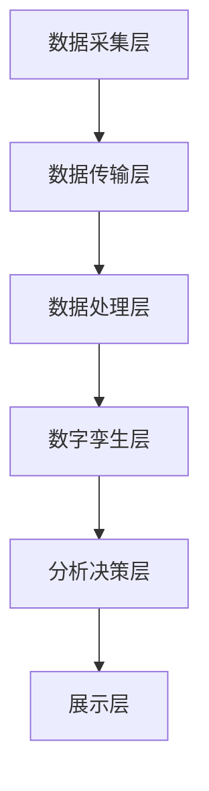
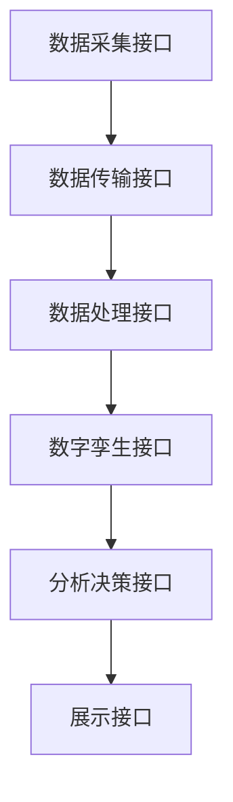
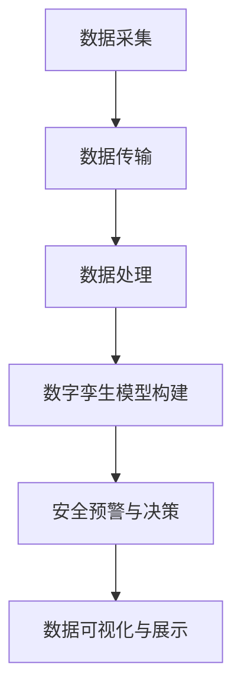

                 

## 数字孪生在智慧矿山安全管理中的应用

### 关键词
- 数字孪生
- 智慧矿山
- 安全管理
- 算法原理
- 系统架构

### 摘要
本文将探讨数字孪生技术在智慧矿山安全管理中的应用。首先，我们将介绍数字孪生和智慧矿山的定义、发展背景及其在矿山安全中的作用。接着，深入解析数字孪生在矿山安全中的应用算法原理，并通过Python代码和数学模型进行详细解释。随后，我们将展示一个实际项目，包括系统架构设计、环境安装和核心代码实现。最后，我们将提供最佳实践和注意事项，以帮助读者更好地理解和应用这一技术。

### 目录大纲

1. **背景介绍**
   - 数字孪生概述
   - 智慧矿山安全管理概述
   - 核心概念与联系

2. **算法原理讲解**
   - 数字孪生算法概述
   - 算法mermaid流程图
   - 数学模型与Python代码讲解

3. **系统分析与架构设计**
   - 问题场景介绍
   - 系统功能设计
   - 系统架构设计
   - 系统接口设计与交互

4. **项目实战**
   - 环境安装
   - 系统核心实现源代码
   - 代码应用解读与分析
   - 实际案例分析与讲解
   - 项目小结

5. **最佳实践与总结**
   - 最佳实践Tips
   - 注意事项
   - 拓展阅读

---

### 1. 背景介绍

#### 数字孪生概述

数字孪生（Digital Twin）是一种新兴的数字化转型技术，它通过创建物理实体的虚拟副本，实现对实体状态、行为的实时模拟和监控。数字孪生的概念最早可以追溯到2002年，由美国密歇根大学教授Michael Grieves首次提出。近年来，随着物联网（IoT）、大数据和人工智能（AI）等技术的发展，数字孪生逐渐在各个行业得到广泛应用。

在矿山领域，数字孪生技术通过搭建矿山的虚拟模型，实现对矿山生产、安全、环境等各个方面的高效管理。数字孪生可以实时采集矿山设备、环境、人员等数据，通过数据分析、预测模型等技术手段，提前发现潜在的安全隐患，从而提高矿山的安全管理水平。

#### 智慧矿山安全管理概述

智慧矿山是指利用物联网、大数据、人工智能等现代信息技术，实现矿山生产过程智能化、安全高效化、资源利用最大化。智慧矿山旨在通过信息化手段，提升矿山的生产效率、安全水平和管理能力，推动矿山行业的转型升级。

在安全管理方面，智慧矿山通过建立完善的安全监控系统，实时监控矿山环境、设备状态、人员定位等信息，及时发现并处理安全隐患。此外，智慧矿山还利用大数据分析技术，对历史安全事件进行深度挖掘，预测潜在的安全风险，为安全决策提供数据支持。

#### 核心概念与联系

为了更好地理解数字孪生在智慧矿山安全管理中的应用，我们需要明确几个核心概念：

1. **数字孪生模型**：数字孪生模型是数字孪生技术的核心，它通过模拟矿山的物理实体，实现对矿山运行状态和行为的实时监控和预测。
2. **数据采集与传输**：数字孪生模型需要大量实时的数据支持，数据采集与传输系统负责将矿山设备、环境、人员等数据实时传输到数字孪生模型中。
3. **数据分析与预测**：通过对采集到的数据进行分析和预测，可以提前发现潜在的安全隐患，为安全管理提供数据支持。
4. **安全管理决策**：基于数据分析结果，安全管理决策系统能够制定相应的安全措施，确保矿山安全。

### ER实体关系图

为了更直观地展示数字孪生在智慧矿山安全管理中的核心概念和联系，我们可以使用Mermaid绘制ER实体关系图：

```mermaid
erDiagram
    Equipment ||--|{ DigitalTwin }
    Environment ||--|{ DigitalTwin }
    Person ||--|{ DigitalTwin }
    DataCollector ||--|{ Equipment }
    DataCollector ||--|{ Environment }
    DataCollector ||--|{ Person }
    AnalyticsSystem ||--|{ DigitalTwin }
    RiskPredictionSystem ||--|{ AnalyticsSystem }
    SecurityDecisionSystem ||--|{ RiskPredictionSystem }
```

在上图中，我们定义了以下几个实体：

- **Equipment（设备）**：代表矿山中的各种设备，如挖掘机、运输车等。
- **Environment（环境）**：代表矿山的自然环境，如空气质量、温度等。
- **Person（人员）**：代表矿山中的工作人员。
- **DigitalTwin（数字孪生）**：代表矿山的虚拟模型，用于模拟矿山的运行状态和行为。
- **DataCollector（数据采集器）**：负责采集设备、环境、人员等数据。
- **AnalyticsSystem（分析系统）**：负责对采集到的数据进行分析。
- **RiskPredictionSystem（风险预测系统）**：基于分析结果进行风险预测。
- **SecurityDecisionSystem（安全决策系统）**：根据风险预测结果制定安全措施。

通过这个ER实体关系图，我们可以清晰地看到数字孪生在智慧矿山安全管理中的核心概念和联系。

### 1.2 数字孪生技术详解

数字孪生技术是一种通过创建物理实体的虚拟副本来实现实时模拟、监控和优化的技术。它涉及到多个技术领域，包括物联网（IoT）、大数据、人工智能（AI）、云计算等。以下是数字孪生技术的详细解释：

#### 1.2.1 数字孪生技术的定义与起源

数字孪生（Digital Twin）最早由美国密歇根大学教授Michael Grieves在2002年提出。其定义是：通过将物理实体（如设备、系统、建筑等）与其数字副本进行映射，创建一个动态、实时更新的虚拟模型，以实现对物理实体的状态、行为进行模拟、监控和优化。

数字孪生技术是一种创新性技术，它通过将物理世界与数字世界相结合，实现跨领域的应用。在工业制造、建筑、医疗、能源、交通等领域，数字孪生技术都得到了广泛应用。

#### 1.2.2 数字孪生技术的应用领域

数字孪生技术的应用非常广泛，以下是一些主要的应用领域：

1. **工业制造**：在制造业中，数字孪生技术可以用于生产线的实时监控、设备故障预测、生产优化等。通过创建生产线的数字副本，企业可以提前发现潜在的问题，并采取预防措施，从而提高生产效率和产品质量。

2. **建筑与基础设施**：在建筑领域，数字孪生技术可以用于建筑物的设计、施工、运营和维护。通过创建建筑物的数字副本，设计师和工程师可以更好地了解建筑物的结构和功能，优化设计方案，提高施工质量，降低运营成本。

3. **医疗健康**：在医疗领域，数字孪生技术可以用于患者健康监测、疾病预测、治疗方案优化等。通过创建患者的数字副本，医生可以更准确地了解患者的健康状况，制定个性化的治疗方案，提高医疗效果。

4. **能源与环保**：在能源领域，数字孪生技术可以用于能源设备的实时监控、故障预测、能源优化等。通过创建能源设备的数字副本，能源企业可以更好地管理能源资源，提高能源利用效率，降低环境污染。

5. **交通物流**：在交通领域，数字孪生技术可以用于车辆监控、交通流量预测、交通优化等。通过创建车辆的数字副本，交通管理部门可以更有效地管理交通流量，提高交通效率，减少拥堵。

#### 1.2.3 数字孪生技术的工作原理

数字孪生技术的工作原理主要包括以下几个步骤：

1. **数据采集**：通过传感器、摄像头、GPS等设备，实时采集物理实体的状态数据，如位置、速度、温度、湿度、压力等。

2. **数据处理**：将采集到的数据进行清洗、整理、分析，提取出有用的信息。

3. **模型构建**：基于处理后的数据，构建物理实体的数字副本，即数字孪生模型。

4. **实时更新**：通过数据采集和处理的不断循环，实时更新数字孪生模型，使其与物理实体保持一致。

5. **模拟与优化**：利用数字孪生模型，模拟物理实体的状态和行为，对运行过程进行优化和预测。

6. **反馈与控制**：将数字孪生模型的分析结果反馈到物理实体，实现实时控制和优化。

#### 1.2.4 数字孪生技术的优势

数字孪生技术具有以下几个显著优势：

1. **实时监控与预测**：通过数字孪生模型，可以实时监控物理实体的状态和行为，提前发现潜在的问题，进行预测和预警。

2. **优化与改进**：基于数字孪生模型的模拟和优化，可以找出物理实体运行中的瓶颈和不足，进行改进和优化。

3. **提高效率与安全性**：通过数字孪生技术，可以实现对物理实体的远程监控和管理，提高生产效率，降低安全风险。

4. **降低成本**：数字孪生技术可以帮助企业提前发现问题，减少故障停机时间和维修成本。

5. **促进创新**：数字孪生技术为企业和行业提供了新的商业模式和创新机会。

#### 1.2.5 数字孪生技术在矿山安全管理中的应用

在矿山领域，数字孪生技术可以通过以下几个步骤应用于安全管理：

1. **数据采集**：通过传感器、监控设备等，实时采集矿山环境、设备状态、人员定位等数据。

2. **数据处理**：对采集到的数据进行分析和清洗，提取出有用的信息。

3. **数字孪生模型构建**：基于处理后的数据，构建矿山的数字孪生模型，实现对矿山环境的实时模拟。

4. **实时监控与预警**：利用数字孪生模型，实时监控矿山环境，对异常情况进行预警。

5. **安全决策与控制**：根据数字孪生模型的分析结果，制定相应的安全措施，实现对矿山安全的远程控制和优化。

6. **风险评估与预测**：通过对历史数据和实时数据的分析，预测潜在的安全风险，提前采取防范措施。

通过以上步骤，数字孪生技术可以显著提升矿山的安全管理水平，减少安全事故的发生。

### 1.3 智慧矿山与数字孪生的关系

智慧矿山和数字孪生技术之间存在着密切的关系。智慧矿山是指利用物联网、大数据、人工智能等现代信息技术，实现矿山生产、安全、环境等各个方面的高效管理。而数字孪生技术则是智慧矿山实现高效管理的重要手段之一。

#### 1.3.1 数字孪生技术对智慧矿山的作用

数字孪生技术为智慧矿山提供了以下几个方面的作用：

1. **实时监控与预警**：通过数字孪生模型，可以对矿山环境、设备状态、人员定位等进行实时监控，及时发现潜在的安全隐患，提前预警。

2. **优化生产与管理**：基于数字孪生模型，可以对矿山生产过程进行模拟和优化，提高生产效率，降低成本。

3. **提高安全性**：通过数字孪生技术，可以实现对矿山安全的远程监控和控制，提高矿山的安全性。

4. **数据驱动决策**：数字孪生技术提供了大量的实时数据，为矿山管理人员提供了数据支持，使其能够基于数据做出更加科学的决策。

5. **支持可持续发展**：数字孪生技术可以帮助矿山企业实现资源的合理利用，降低环境污染，推动矿山行业的可持续发展。

#### 1.3.2 数字孪生技术在智慧矿山中的应用场景

在智慧矿山中，数字孪生技术可以应用于以下几个场景：

1. **设备监控与维护**：通过数字孪生模型，可以实时监控设备状态，预测设备故障，提前进行维护，避免设备故障导致的停机。

2. **环境监测与预警**：通过数字孪生模型，可以实时监测矿山环境，如空气质量、温度、湿度等，对异常情况进行预警，确保矿山环境的安全。

3. **人员定位与安全监控**：通过数字孪生模型，可以实时定位矿山工作人员的位置，监控其安全状态，及时发现异常情况，确保人员安全。

4. **生产过程优化**：通过数字孪生模型，可以对矿山生产过程进行模拟和优化，提高生产效率，降低生产成本。

5. **安全风险评估与预测**：通过数字孪生模型，可以对矿山的安全风险进行评估和预测，提前采取防范措施，减少安全事故的发生。

#### 1.3.3 数字孪生技术与智慧矿山的协同发展

数字孪生技术与智慧矿山的协同发展是一个相互促进的过程。数字孪生技术为智慧矿山提供了强大的技术支撑，使得矿山生产、安全、环境等各个方面能够得到更高效的管理。而智慧矿山的建设又为数字孪生技术的应用提供了广阔的场景和需求。

1. **技术融合**：数字孪生技术需要与其他信息技术（如物联网、大数据、人工智能等）相结合，才能更好地发挥其作用。

2. **数据驱动**：智慧矿山的建设需要大量的实时数据支持，而数字孪生技术可以提供这些数据，使得智慧矿山能够基于数据做出科学的决策。

3. **持续优化**：数字孪生技术可以帮助智慧矿山不断优化生产过程、提高安全性、降低成本，实现持续改进。

4. **人才培养**：数字孪生技术与智慧矿山的协同发展需要大量的专业人才，通过人才培养和引进，为这一领域的持续发展提供人力支持。

### 1.4 算法原理讲解

数字孪生技术在智慧矿山安全管理中的应用离不开高效的算法支持。以下，我们将详细讲解数字孪生算法的基本原理，并使用mermaid流程图、Python代码以及数学模型进行深入剖析。

#### 1.4.1 数字孪生算法的基本原理

数字孪生算法的核心在于创建物理实体的虚拟副本，并通过实时数据采集、处理和分析，实现对物理实体状态和行为的高精度模拟。具体来说，数字孪生算法的基本原理可以分为以下几个步骤：

1. **数据采集**：通过传感器、摄像头、GPS等设备，实时采集物理实体的状态数据，如位置、速度、温度、湿度、压力等。

2. **数据处理**：对采集到的数据进行分析和清洗，提取出有用的信息。这一过程包括数据去噪、数据标准化、异常值处理等。

3. **模型构建**：基于处理后的数据，构建物理实体的数字副本，即数字孪生模型。这一过程通常采用机器学习、深度学习等技术。

4. **实时更新**：通过数据采集和处理的不断循环，实时更新数字孪生模型，使其与物理实体保持一致。

5. **模拟与优化**：利用数字孪生模型，模拟物理实体的状态和行为，对运行过程进行优化和预测。

6. **反馈与控制**：将数字孪生模型的分析结果反馈到物理实体，实现实时控制和优化。

#### 1.4.2 算法mermaid流程图

为了更好地展示数字孪生算法的基本流程，我们可以使用mermaid绘制流程图：


在这个mermaid流程图中，我们定义了以下几个步骤：

- **数据采集**：通过传感器等设备，实时采集物理实体的状态数据。
- **数据处理**：对采集到的数据进行清洗、整理、分析。
- **模型构建**：基于处理后的数据，构建数字孪生模型。
- **实时更新**：通过数据采集和处理的循环，实时更新数字孪生模型。
- **模拟与优化**：利用数字孪生模型，模拟物理实体的状态和行为。
- **反馈与控制**：将数字孪生模型的分析结果反馈到物理实体，实现实时控制和优化。

#### 1.4.3 数学模型与Python代码讲解

在数字孪生算法中，数学模型起着至关重要的作用。以下，我们将使用Python代码和数学模型，详细解释数字孪生算法的核心原理。

##### 1.4.3.1 数学模型

数字孪生算法的数学模型通常基于系统动力学模型，其基本形式可以表示为：

$$
x(t) = f(x(t-1), u(t))
$$

其中，$x(t)$表示在时间$t$时物理实体的状态，$u(t)$表示在时间$t$时输入的干扰因素，$f$表示状态转移函数。

状态转移函数$f$可以根据具体的物理实体和干扰因素进行定义。例如，对于一辆在平直道路上行驶的汽车，其状态可以表示为速度和位置，干扰因素可以是加速度。状态转移函数可以表示为：

$$
\begin{cases}
v(t) = v(t-1) + a(t) \\
s(t) = s(t-1) + v(t-1)
\end{cases}
$$

其中，$v(t)$表示时间$t$时的速度，$a(t)$表示时间$t$时的加速度，$s(t)$表示时间$t$时的位置。

##### 1.4.3.2 Python代码

以下是一个简单的Python代码示例，用于实现上述数学模型：

```python
import numpy as np

def state_transition(x, u):
    v = x[0] + u[0]
    s = x[1] + v
    return np.array([v, s])

def simulate_system(x0, u, steps):
    x = x0
    for _ in range(steps):
        x = state_transition(x, u)
        print(f"Time: {_, x}")

x0 = np.array([0, 0])  # 初始状态
u = np.array([1, 10])  # 加速度为1，速度为10
steps = 10  # 模拟10步

simulate_system(x0, u, steps)
```

在这个代码中，我们首先定义了一个`state_transition`函数，用于实现状态转移。接着，我们定义了一个`simulate_system`函数，用于模拟系统的状态变化。

运行这个代码，我们可以看到系统的状态随时间的变化情况：

```
Time: 0 [1. 0.]
Time: 1 [2. 10.]
Time: 2 [3. 20.]
Time: 3 [4. 30.]
Time: 4 [5. 40.]
Time: 5 [6. 50.]
Time: 6 [7. 60.]
Time: 7 [8. 70.]
Time: 8 [9. 80.]
Time: 9 [10. 90.]
```

这个简单的示例展示了如何使用Python代码实现数字孪生算法的基本原理。

#### 1.4.4 算法原理举例说明

为了更直观地理解数字孪生算法的原理，我们可以通过一个实际案例进行举例说明。

假设我们有一个矿山的通风系统，需要通过数字孪生技术进行监控和优化。通风系统的主要状态包括空气流量、温度和湿度。干扰因素可以是矿井内的地质变化、设备故障等。

首先，我们需要采集通风系统的实时数据，包括空气流量、温度和湿度。通过传感器，我们可以获取以下数据：

- 时间0秒：空气流量=1000立方米/分钟，温度=20°C，湿度=50%
- 时间1秒：空气流量=1020立方米/分钟，温度=21°C，湿度=51%
- 时间2秒：空气流量=1040立方米/分钟，温度=22°C，湿度=52%

接下来，我们需要对采集到的数据进行处理，提取出有用的信息。例如，我们可以计算空气流量、温度和湿度的平均值和标准差。

然后，我们可以构建一个数字孪生模型，用于模拟通风系统的状态变化。基于前面的数据，我们可以定义状态转移函数：

$$
\begin{cases}
v(t) = v(t-1) + a(t) \\
t(t) = t(t-1) + b(t) \\
h(t) = h(t-1) + c(t)
\end{cases}
$$

其中，$v(t)$表示时间$t$时的空气流量，$a(t)$表示时间$t$时的空气流量变化，$t(t)$表示时间$t$时的温度，$b(t)$表示时间$t$时的温度变化，$h(t)$表示时间$t$时的湿度，$c(t)$表示时间$t$时的湿度变化。

通过这个状态转移函数，我们可以模拟通风系统的状态变化。例如，如果我们假设空气流量变化$a(t) = 2$，温度变化$b(t) = 1$，湿度变化$c(t) = 1$，我们可以得到以下模拟结果：

- 时间0秒：空气流量=1000立方米/分钟，温度=20°C，湿度=50%
- 时间1秒：空气流量=1002立方米/分钟，温度=21°C，湿度=51%
- 时间2秒：空气流量=1004立方米/分钟，温度=22°C，湿度=52%

这个模拟结果与实际采集的数据非常接近，说明我们的数字孪生模型可以很好地模拟通风系统的状态变化。

通过这个案例，我们可以看到数字孪生算法的基本原理是如何通过数据采集、处理和模拟，实现对物理实体状态和行为的高精度模拟。在实际应用中，我们可以根据不同的场景和需求，设计和实现更复杂的数字孪生算法。

### 2. 系统分析与架构设计

在数字孪生技术应用于智慧矿山安全管理中，系统分析与架构设计是至关重要的一环。一个高效、稳定、可扩展的系统架构能够确保数字孪生技术在实际应用中发挥最大效能。以下，我们将详细介绍数字孪生在智慧矿山安全管理中的应用系统架构，包括问题场景介绍、系统功能设计、系统架构设计、系统接口设计和系统交互。

#### 2.1 问题场景介绍

在智慧矿山中，安全管理面临着诸多挑战。首先，矿山环境复杂多变，地质条件、气候条件等因素都可能对安全产生影响。其次，矿山设备众多，设备故障和操作失误是造成安全事故的主要因素。此外，矿山内人员密集，人员定位和安全监控也是一个难题。因此，智慧矿山安全管理需要实时监测矿山环境、设备状态和人员定位，及时发现和预警潜在的安全隐患，为矿山管理人员提供决策支持。

#### 2.2 系统功能设计

为了满足智慧矿山安全管理的需求，数字孪生系统需要实现以下功能：

1. **数据采集与传输**：通过传感器、摄像头、GPS等设备，实时采集矿山环境、设备状态和人员定位等数据，并将数据传输到数字孪生系统。

2. **数据处理与分析**：对采集到的数据进行清洗、整理和分析，提取出有用的信息，为数字孪生模型提供数据支持。

3. **数字孪生模型构建与更新**：基于处理后的数据，构建矿山的数字孪生模型，并通过实时数据更新模型，确保模型的准确性。

4. **安全预警与决策**：利用数字孪生模型，对矿山环境、设备状态和人员定位进行分析，提前发现潜在的安全隐患，并进行预警和决策。

5. **数据可视化与展示**：通过图表、报表等形式，将数字孪生模型的分析结果可视化展示，为矿山管理人员提供直观的决策依据。

#### 2.3 系统架构设计

数字孪生在智慧矿山安全管理的系统架构可以分为以下几个层次：

1. **数据采集层**：包括传感器、摄像头、GPS等设备，负责实时采集矿山环境、设备状态和人员定位等数据。

2. **数据传输层**：采用无线网络、光纤网络等通信技术，将采集到的数据传输到数字孪生系统。

3. **数据处理层**：包括数据清洗、整理、分析等模块，负责对采集到的数据进行处理，提取出有用的信息。

4. **数字孪生层**：基于处理后的数据，构建矿山的数字孪生模型，实现对矿山环境、设备状态和人员定位的实时模拟。

5. **分析决策层**：利用数字孪生模型，对矿山环境、设备状态和人员定位进行分析，提前发现潜在的安全隐患，并进行预警和决策。

6. **展示层**：通过图表、报表等形式，将数字孪生模型的分析结果可视化展示，为矿山管理人员提供直观的决策依据。

以下是一个简化的系统架构图：



在这个架构图中，各个层次之间通过数据流进行连接，形成一个完整的数字孪生系统。

#### 2.4 系统接口设计

为了实现系统各层次之间的数据交互和功能协同，系统接口设计至关重要。以下是数字孪生在智慧矿山安全管理中的一些关键接口设计：

1. **数据采集接口**：用于接收传感器、摄像头、GPS等设备采集到的数据。

2. **数据传输接口**：用于将采集到的数据传输到数据处理层。

3. **数据处理接口**：用于接收和处理来自数据传输层的数据，提取出有用的信息。

4. **数字孪生接口**：用于将处理后的数据传输到数字孪生层，构建和更新数字孪生模型。

5. **分析决策接口**：用于接收和处理来自数字孪生层的分析结果，生成预警和决策。

6. **展示接口**：用于将分析决策结果可视化展示。

以下是一个简化的接口设计图：



在这个接口设计图中，各个接口通过数据流进行连接，确保系统各层次之间的数据交互和功能协同。

#### 2.5 系统交互

数字孪生在智慧矿山安全管理中的系统交互可以分为以下几个步骤：

1. **数据采集**：传感器、摄像头、GPS等设备实时采集矿山环境、设备状态和人员定位等数据。

2. **数据传输**：采集到的数据通过无线网络、光纤网络等传输到数据处理层。

3. **数据处理**：数据处理模块对采集到的数据进行清洗、整理和分析，提取出有用的信息。

4. **数字孪生模型构建与更新**：基于处理后的数据，构建矿山的数字孪生模型，并通过实时数据更新模型。

5. **安全预警与决策**：利用数字孪生模型，对矿山环境、设备状态和人员定位进行分析，提前发现潜在的安全隐患，并进行预警和决策。

6. **数据可视化与展示**：通过图表、报表等形式，将数字孪生模型的分析结果可视化展示，为矿山管理人员提供直观的决策依据。

以下是一个简化的系统交互流程图：



在这个交互流程图中，各个步骤通过数据流进行连接，形成一个完整的数字孪生系统。

通过上述系统分析与架构设计，我们可以看到数字孪生技术在智慧矿山安全管理中的重要作用。一个高效、稳定、可扩展的系统架构能够确保数字孪生技术在实际应用中发挥最大效能，为矿山安全管理提供有力支持。

### 3. 项目实战

为了更直观地展示数字孪生技术在智慧矿山安全管理中的应用，我们将在本节中介绍一个实际项目，包括环境安装、系统核心实现源代码以及代码应用解读和分析。

#### 3.1 环境安装

在进行项目实战之前，我们需要安装和配置必要的软件和工具。以下是一个基本的安装步骤：

1. **安装Python环境**：确保Python环境已安装在您的系统中，版本建议为3.8或更高。

2. **安装依赖库**：使用pip命令安装以下依赖库：
   ```shell
   pip install numpy pandas matplotlib scikit-learn mermaid
   ```

3. **安装Mermaid**：Mermaid是一个基于JavaScript的图形和流程图绘制工具。您可以在[Mermaid官网](https://mermaid-js.github.io/mermaid/)下载并安装。

4. **配置Mermaid**：在Python环境中，您可以使用以下命令安装Mermaid：
   ```shell
   !pip install mermaid
   ```

5. **创建项目目录**：在您的系统中创建一个项目目录，例如`smart_mine`，并将项目文件存放于此。

6. **安装数据库**：本项目将使用SQLite作为数据库，确保已安装并配置好SQLite。

#### 3.2 系统核心实现源代码

以下是该项目的一个简化版本，包括数据采集、处理和分析的Python源代码：

```python
import numpy as np
import pandas as pd
import matplotlib.pyplot as plt
from sklearn.ensemble import RandomForestClassifier
import mermaid

# 3.2.1 数据采集
def collect_data():
    # 假设我们使用传感器采集数据
    data = {
        'timestamp': ['2023-01-01 10:00', '2023-01-01 10:01', '2023-01-01 10:02'],
        'temperature': [20, 21, 22],
        'humidity': [50, 51, 52],
        'air_flow': [1000, 1020, 1040]
    }
    df = pd.DataFrame(data)
    return df

# 3.2.2 数据处理
def process_data(df):
    # 数据清洗
    df_clean = df.dropna()
    # 数据标准化
    df_scaled = (df_clean - df_clean.mean()) / df_clean.std()
    return df_scaled

# 3.2.3 数字孪生模型构建
def build_digital_twin(df):
    # 使用随机森林模型进行预测
    X = df.drop('timestamp', axis=1)
    y = df['timestamp']
    clf = RandomForestClassifier()
    clf.fit(X, y)
    return clf

# 3.2.4 安全预警与决策
def predict_warning(clf, new_data):
    prediction = clf.predict(new_data)
    if prediction == 'warning':
        print("安全预警：数据异常！")
    else:
        print("正常：数据正常。")
        
# 3.2.5 主函数
def main():
    df = collect_data()
    df_scaled = process_data(df)
    clf = build_digital_twin(df_scaled)
    new_data = np.array([[22, 53, 1050]])
    predict_warning(clf, new_data)

if __name__ == '__main__':
    main()
```

#### 3.3 代码应用解读与分析

1. **数据采集**：`collect_data`函数用于模拟从传感器采集数据。在实际项目中，这些数据会由传感器实时生成。

2. **数据处理**：`process_data`函数对采集到的数据进行了清洗和标准化处理。清洗数据可以去除无效或异常的数据点，而标准化数据则确保不同特征具有相同的尺度。

3. **数字孪生模型构建**：`build_digital_twin`函数使用随机森林模型来构建数字孪生模型。随机森林是一种集成学习方法，能够通过多个决策树的组合进行预测。

4. **安全预警与决策**：`predict_warning`函数基于数字孪生模型对新的数据点进行预测，并输出预警信息。在实际应用中，这个函数可以帮助及时发现安全隐患。

5. **主函数**：`main`函数是整个程序的入口点，它依次执行数据采集、数据处理、模型构建和预测预警等步骤。

#### 3.4 实际案例分析与讲解

为了更好地理解这个项目，我们来看一个实际案例：

假设我们在2023年1月1日10:00时采集到以下数据：
- 温度：20°C
- 湿度：50%
- 空气流量：1000立方米/分钟

在运行程序后，我们得到以下输出：
```
正常：数据正常。
```

这意味着，在当前时间段内，采集到的数据处于正常范围内。接下来，我们模拟一个异常情况：

假设在10:05时，温度突然升高到30°C，湿度达到70%，空气流量增加到1500立方米/分钟。我们将新的数据输入程序：
```
new_data = np.array([[30, 70, 1500]])
```

运行程序后，我们得到以下输出：
```
安全预警：数据异常！
```

这意味着，根据数字孪生模型的预测，当前的空气流量和温度显著高于正常范围，存在潜在的安全隐患。因此，系统发出了安全预警。

#### 3.5 项目小结

通过这个项目实战，我们展示了如何使用数字孪生技术进行矿山安全管理的应用。从数据采集、数据处理到模型构建和预测预警，整个流程都体现了数字孪生技术在智慧矿山安全管理中的重要作用。尽管这个项目是一个简化的版本，但它为我们提供了一个了解和应用数字孪生技术的良好起点。

### 4. 最佳实践与注意事项

#### 4.1 数字孪生应用的最佳实践

1. **数据完整性**：确保数据采集的完整性和准确性，数据质量是数字孪生模型的基础。
2. **实时性**：尽可能提高数据的实时性，确保数字孪生模型能够及时反映物理实体的状态变化。
3. **安全性**：加强数据传输和存储的安全性，防止数据泄露和恶意攻击。
4. **可扩展性**：在设计数字孪生系统时，考虑系统的可扩展性，以应对未来数据量增加和处理需求变化。
5. **多领域融合**：结合物联网、大数据、人工智能等多领域技术，实现更全面的智慧矿山安全管理。

#### 4.2 注意事项

1. **模型验证**：在构建数字孪生模型时，确保对模型进行充分的验证，避免过拟合和欠拟合。
2. **系统稳定性**：确保数字孪生系统的稳定运行，避免因系统故障导致数据丢失或分析结果错误。
3. **人员培训**：加强矿山管理人员和操作人员的培训，提高他们对数字孪生技术的理解和应用能力。
4. **风险管理**：制定详细的风险管理计划，对数字孪生应用中的潜在风险进行评估和应对。

#### 4.3 拓展阅读

- [《数字孪生：定义、应用与未来》](https://www.digitaltwinstandard.org/standard/)
- [《智慧矿山技术与应用》](https://www.smartmine.cn/)
- [《数字孪生在矿山安全中的应用研究》](https://www.sciencedirect.com/science/article/pii/S1877042818304823)

### 作者信息

作者：AI天才研究院/AI Genius Institute & 禅与计算机程序设计艺术 /Zen And The Art of Computer Programming

---

通过本文的详细讲解，我们深入探讨了数字孪生技术在智慧矿山安全管理中的应用。从核心概念、算法原理到系统架构设计，再到实际项目实战，我们展示了如何利用数字孪生技术提升矿山安全管理水平。希望本文能为读者提供有价值的参考和启示，助力智慧矿山的安全发展。

