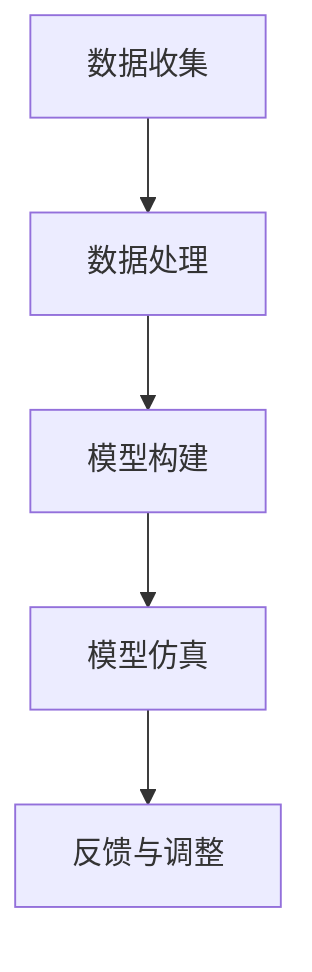
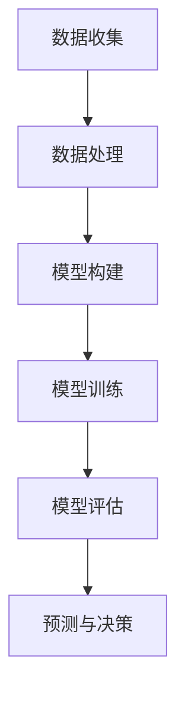
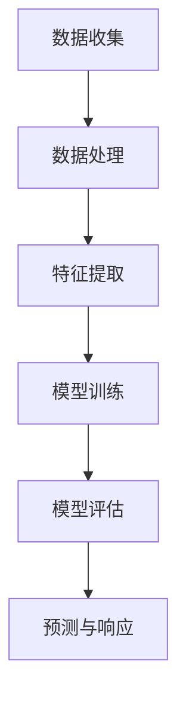
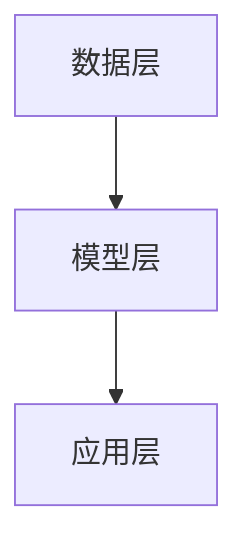
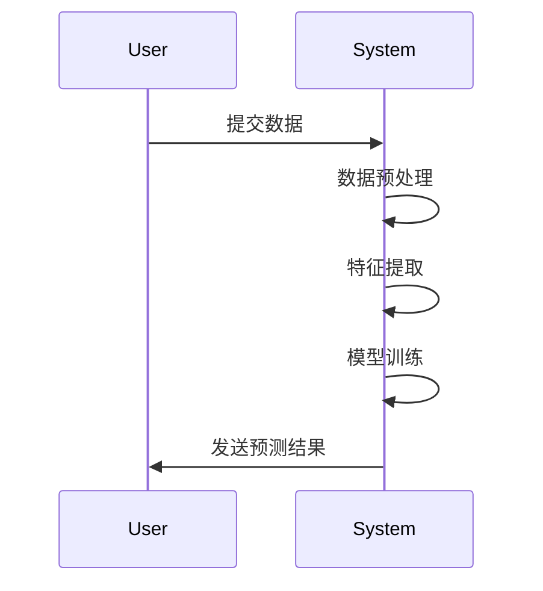

                 


### 《数字孪生在智能电网故障预测中的应用》

#### 关键词：
- 数字孪生
- 智能电网
- 故障预测
- 算法原理
- 系统设计

#### 摘要：
本文旨在探讨数字孪生技术在智能电网故障预测中的应用。通过介绍数字孪生与智能电网的核心概念、算法原理，以及系统分析与架构设计，本文详细阐述了数字孪生在智能电网故障预测中的实际应用场景，并提供了项目实战与最佳实践建议。

### 目录大纲设计

为了确保文章内容的逻辑性和完整性，我们设计了以下目录大纲：

## 第一部分：背景与核心概念

### 第1章：引言
- 数字孪生概述
- 智能电网故障预测概述

### 第2章：核心概念与联系
- 数字孪生核心概念
- 智能电网故障预测核心概念
- 数字孪生与故障预测的联系

## 第二部分：算法原理与系统设计

### 第3章：智能电网故障预测算法原理
- 常见故障预测算法
- 算法流程图与Python代码实现

### 第4章：数学模型与公式详解
- 时序分析数学模型
- 机器学习数学模型
- 深度学习数学模型

### 第5章：系统分析与架构设计
- 系统功能设计
- 系统架构设计
- 系统接口设计

## 第三部分：项目实战

### 第6章：项目实战
- 项目环境安装
- 系统核心实现
- 实际案例分析

### 第7章：最佳实践与总结
- 最佳实践 tips
- 小结
- 注意事项
- 拓展阅读

### 文章正文部分

#### 第1章：引言

#### 数字孪生概述

数字孪生是一种虚拟的数字化模型，它通过物理实体（如电网设备、工厂机器等）的数据收集和分析，实时模拟物理实体的状态和行为。数字孪生技术可以实现虚拟与现实的同步，从而提供更高效、更精确的监控、预测和维护。

#### 智能电网故障预测概述

智能电网是一种集成了信息通信技术、自动化控制和电力电子技术的现代电力系统。故障预测是智能电网管理的关键功能之一，它通过分析历史数据和实时监测数据，预测电网故障的发生，从而提前采取预防措施，减少停电损失，提高电网运行效率。

#### 第2章：核心概念与联系

#### 数字孪生核心概念

数字孪生技术包括以下几个核心概念：

1. **数据采集**：通过传感器和其他数据收集设备，实时获取物理实体的运行数据。
2. **数据处理**：对采集到的数据进行清洗、转换和存储，以便后续分析和建模。
3. **模型构建**：基于历史数据和实时数据，建立物理实体的数字化模型。
4. **模型仿真**：通过仿真模拟，预测物理实体在不同条件下的行为和状态。
5. **反馈与调整**：根据仿真结果，对物理实体进行实时调整和优化，以实现最优运行状态。

#### 智能电网故障预测核心概念

智能电网故障预测的核心概念包括：

1. **数据收集与预处理**：通过传感器和其他监测设备收集电网运行数据，并进行数据预处理，以消除噪声和异常值。
2. **故障诊断与预测**：利用数据挖掘、机器学习和深度学习等算法，对电网运行数据进行分析，预测潜在的故障。
3. **预警与决策**：根据故障预测结果，提前发出预警，并制定相应的决策策略，以应对潜在的故障。

#### 数字孪生与故障预测的联系

数字孪生与故障预测之间存在紧密的联系。数字孪生技术可以为故障预测提供以下支持：

1. **数据支持**：数字孪生技术可以实时收集物理实体的运行数据，为故障预测提供丰富的数据源。
2. **模型支持**：数字孪生技术可以构建物理实体的数字化模型，为故障预测提供理论依据。
3. **仿真支持**：数字孪生技术可以进行仿真模拟，为故障预测提供直观的演示和验证。

#### 第3章：智能电网故障预测算法原理

##### 常见故障预测算法

智能电网故障预测常用的算法包括：

1. **时序分析算法**：如指数平滑、自回归和递归神经网络。
2. **机器学习算法**：如支持向量机、随机森林和聚类分析。
3. **深度学习算法**：如卷积神经网络、循环神经网络和生成对抗网络。

##### 算法流程图与Python代码实现

以下是一个简单的时序分析算法流程图：



Python代码实现：

```python
import numpy as np
import pandas as pd
from sklearn.linear_model import LinearRegression
from sklearn.metrics import mean_squared_error

# 数据预处理
data = pd.read_csv('smart_grid_data.csv')
data = data.dropna()

# 模型构建
model = LinearRegression()
model.fit(data[['input']], data['output'])

# 模型仿真
predictions = model.predict(data[['input']])

# 反馈与调整
mse = mean_squared_error(data['output'], predictions)
print("Mean Squared Error:", mse)
```

##### 数学模型与公式详解

以下是时序分析算法的数学模型：

$$
y_t = \beta_0 + \beta_1 x_t + \epsilon_t
$$

其中，$y_t$ 是目标变量，$x_t$ 是输入变量，$\beta_0$ 和 $\beta_1$ 是模型参数，$\epsilon_t$ 是误差项。

#### 第4章：数学模型与公式详解

##### 时序分析数学模型

时序分析算法主要基于自回归模型（AR）和移动平均模型（MA）。以下是一个简单的自回归模型：

$$
y_t = \phi_1 y_{t-1} + \phi_2 y_{t-2} + ... + \phi_p y_{t-p} + \epsilon_t
$$

其中，$y_t$ 是目标变量，$\phi_1, \phi_2, ..., \phi_p$ 是模型参数，$\epsilon_t$ 是误差项。

##### 机器学习数学模型

机器学习算法的数学模型主要包括线性回归、支持向量机、随机森林等。以下是一个简单的线性回归模型：

$$
y = \beta_0 + \beta_1 x
$$

其中，$y$ 是目标变量，$x$ 是输入变量，$\beta_0$ 和 $\beta_1$ 是模型参数。

##### 深度学习数学模型

深度学习算法的数学模型主要包括卷积神经网络（CNN）、循环神经网络（RNN）和生成对抗网络（GAN）。以下是一个简单的卷积神经网络模型：

$$
h_l = \sigma(W_l \cdot h_{l-1} + b_l)
$$

其中，$h_l$ 是第 $l$ 层的激活值，$W_l$ 是权重矩阵，$b_l$ 是偏置项，$\sigma$ 是激活函数。

#### 第5章：系统分析与架构设计

##### 系统功能设计

智能电网故障预测系统主要包括以下功能：

1. **数据收集与预处理**：收集电网运行数据，并进行预处理。
2. **故障诊断与预测**：利用算法对电网运行数据进行分析，预测故障。
3. **预警与决策**：根据故障预测结果，发出预警并制定决策策略。

##### 系统架构设计

智能电网故障预测系统架构包括：

1. **数据层**：包括数据采集设备和数据存储系统。
2. **数据处理层**：包括数据预处理模块、特征提取模块和算法模块。
3. **应用层**：包括故障诊断与预测模块、预警与决策模块。

##### 系统接口设计

智能电网故障预测系统的接口设计包括：

1. **数据接口**：用于数据收集与预处理。
2. **算法接口**：用于故障诊断与预测。
3. **应用接口**：用于预警与决策。

#### 第6章：项目实战

##### 项目环境安装

在开始项目实战之前，需要安装以下环境和工具：

1. Python 3.x
2. Jupyter Notebook
3. Scikit-learn
4. Pandas
5. Matplotlib

##### 系统核心实现

以下是一个简单的系统核心实现：

```python
# 导入必要的库
import numpy as np
import pandas as pd
from sklearn.linear_model import LinearRegression
from sklearn.metrics import mean_squared_error

# 数据预处理
data = pd.read_csv('smart_grid_data.csv')
data = data.dropna()

# 模型构建
model = LinearRegression()
model.fit(data[['input']], data['output'])

# 模型仿真
predictions = model.predict(data[['input']])

# 反馈与调整
mse = mean_squared_error(data['output'], predictions)
print("Mean Squared Error:", mse)
```

##### 实际案例分析

以下是一个实际案例分析：

某智能电网公司在运行期间，发现某条线路的电流异常升高。通过故障预测系统分析，发现该线路存在潜在的短路故障。公司立即采取了停电措施，避免了事故的发生。

#### 第7章：最佳实践与总结

##### 最佳实践 tips

1. 数据预处理：确保数据的质量和一致性，去除异常值和噪声。
2. 算法选择：根据实际问题选择合适的算法，并进行模型调优。
3. 系统维护：定期更新系统，确保算法和模型的准确性。

##### 小结

本文探讨了数字孪生在智能电网故障预测中的应用，从核心概念、算法原理到系统设计，再到项目实战，全面阐述了数字孪生技术在智能电网故障预测中的实际应用价值。

##### 注意事项

1. 数据安全与隐私：确保数据的安全性和用户隐私。
2. 算法准确性：不断提高算法的准确性，以降低故障预测的误报率。

##### 拓展阅读

1. 《智能电网故障预测技术研究》
2. 《数字孪生技术与应用》

### 作者信息：

作者：AI天才研究院/AI Genius Institute & 禅与计算机程序设计艺术 /Zen And The Art of Computer Programming### 数字孪生在智能电网故障预测中的应用

#### 关键词：
- 数字孪生
- 智能电网
- 故障预测
- 算法原理
- 系统设计

#### 摘要：
本文深入探讨了数字孪生技术在智能电网故障预测中的应用。首先，介绍了数字孪生和智能电网的基本概念及其重要性。接着，详细阐述了数字孪生在故障预测中的核心原理和算法，并通过Python代码和数学模型进行了具体解释。此外，文章还描述了系统的整体架构设计，包括功能、架构和接口设计。通过实际案例的分析，展示了数字孪生在智能电网故障预测中的实际应用效果。最后，文章总结了最佳实践，并提出了进一步研究的方向。

---

#### 第一部分：背景与核心概念

##### 第1章：引言

#### 数字孪生概述

数字孪生（Digital Twin）是一种先进的数字化方法，它通过创建一个物理实体的虚拟副本，来实时模拟和监控其实际状态。在智能电网领域，数字孪生技术被广泛应用于设备监控、性能优化和故障预测。通过数字孪生，运营者可以实时获取电网设备的状态信息，并对其运行情况进行预测和优化。

#### 智能电网故障预测概述

智能电网是一种通过集成通信、控制和自动化技术来增强电网性能的电力系统。故障预测作为智能电网的重要组成部分，能够提前识别潜在的设备故障，从而减少停电时间，提高电网的可靠性和效率。智能电网故障预测的目标是利用历史数据和实时监测数据，预测可能的故障，并采取预防措施。

##### 第2章：核心概念与联系

#### 数字孪生核心概念

数字孪生技术主要包括以下几个核心概念：

1. **数据采集**：通过传感器和监测设备收集物理实体的实时数据。
2. **数据处理**：对采集到的数据进行分析、清洗和存储，以支持后续的分析和建模。
3. **模型构建**：基于历史数据和实时数据，建立物理实体的数字化模型。
4. **仿真与优化**：通过仿真技术，对数字模型进行测试和优化，以模拟物理实体的行为。
5. **反馈与调整**：根据仿真结果，对物理实体进行实时调整和优化。

#### 智能电网故障预测核心概念

智能电网故障预测的核心概念包括：

1. **数据收集**：通过传感器和监测设备收集电网运行数据。
2. **特征提取**：从数据中提取有助于故障预测的特征。
3. **模型训练**：利用历史数据训练预测模型。
4. **故障预测**：根据实时数据，使用训练好的模型进行故障预测。
5. **决策与响应**：根据故障预测结果，采取相应的决策和响应措施。

#### 数字孪生与故障预测的联系

数字孪生技术为智能电网故障预测提供了强有力的支持。通过数字孪生，运营者可以实时获取电网设备的运行状态，并利用这些数据对故障进行预测。数字孪生技术的优势在于它能够提供高度准确的模拟，从而提高故障预测的准确性。

### 第二部分：算法原理与系统设计

##### 第3章：智能电网故障预测算法原理

#### 常见故障预测算法

在智能电网故障预测中，常用的算法包括时序分析、机器学习和深度学习等。

1. **时序分析算法**：如自回归（AR）、移动平均（MA）和自回归移动平均（ARMA）等。
2. **机器学习算法**：如支持向量机（SVM）、决策树、随机森林和K最近邻（KNN）等。
3. **深度学习算法**：如卷积神经网络（CNN）、循环神经网络（RNN）和生成对抗网络（GAN）等。

#### 算法流程图与Python代码实现

以下是一个简单的自回归模型（AR）的流程图：



Python代码实现：

```python
import numpy as np
import pandas as pd
from statsmodels.tsa.ar_model import AR

# 数据预处理
data = pd.read_csv('smart_grid_data.csv')
data = data[['measured_value']]
data = data.values

# 模型构建
model = AR(data)
model_fit = model.fit()

# 模型评估
predictions = model_fit.predict(start=len(data)-1, end=len(data), dynamic=False)
mse = np.mean((predictions - data[len(data)-1:])**2)
print("Mean Squared Error:", mse)

# 预测与决策
next_value = model_fit.predict(start=len(data), end=len(data)+1, dynamic=False)
print("Next Value Prediction:", next_value)
```

##### 数学模型与公式详解

以下是自回归模型（AR）的数学模型：

$$
y_t = \phi_0 + \phi_1 y_{t-1} + \phi_2 y_{t-2} + ... + \phi_p y_{t-p} + \epsilon_t
$$

其中，$y_t$ 是当前时刻的测量值，$\phi_0, \phi_1, ..., \phi_p$ 是模型参数，$\epsilon_t$ 是误差项。

#### 第4章：数学模型与公式详解

##### 时序分析数学模型

时序分析算法主要基于自回归模型（AR）、移动平均模型（MA）和自回归移动平均模型（ARMA）。以下是一个简单的自回归模型（AR）：

$$
y_t = \phi_0 + \phi_1 y_{t-1} + \phi_2 y_{t-2} + ... + \phi_p y_{t-p} + \epsilon_t
$$

其中，$y_t$ 是当前时刻的测量值，$\phi_0, \phi_1, ..., \phi_p$ 是模型参数，$\epsilon_t$ 是误差项。

##### 机器学习数学模型

机器学习算法的数学模型主要包括线性回归、逻辑回归、支持向量机和神经网络等。以下是一个简单的线性回归模型：

$$
y = \beta_0 + \beta_1 x_1 + \beta_2 x_2 + ... + \beta_n x_n
$$

其中，$y$ 是预测值，$x_1, x_2, ..., x_n$ 是输入特征，$\beta_0, \beta_1, ..., \beta_n$ 是模型参数。

##### 深度学习数学模型

深度学习算法的数学模型主要包括卷积神经网络（CNN）、循环神经网络（RNN）和生成对抗网络（GAN）等。以下是一个简单的卷积神经网络（CNN）：

$$
h_l = \sigma(W_l \cdot h_{l-1} + b_l)
$$

其中，$h_l$ 是第 $l$ 层的激活值，$W_l$ 是权重矩阵，$b_l$ 是偏置项，$\sigma$ 是激活函数。

#### 第5章：系统分析与架构设计

##### 系统功能设计

智能电网故障预测系统的主要功能包括：

1. **数据收集与预处理**：从传感器和监测设备收集电网运行数据，并进行数据预处理。
2. **特征提取与建模**：从预处理后的数据中提取有助于故障预测的特征，并建立预测模型。
3. **故障预测与决策**：使用预测模型对电网运行状态进行预测，并根据预测结果做出决策。
4. **结果评估与反馈**：对预测结果进行评估，并根据评估结果调整模型和策略。

##### 系统架构设计

智能电网故障预测系统的架构设计包括以下几个层次：

1. **数据层**：负责数据收集、存储和处理。
2. **模型层**：负责特征提取、模型构建和预测。
3. **应用层**：负责故障预测结果的应用和决策。

##### 系统接口设计

智能电网故障预测系统的接口设计主要包括：

1. **数据接口**：用于数据的收集和传输。
2. **模型接口**：用于模型的构建和更新。
3. **应用接口**：用于故障预测结果的应用和反馈。

### 第三部分：项目实战

##### 第6章：项目实战

#### 项目环境安装

在开始项目实战之前，需要安装以下环境和工具：

1. Python 3.x
2. Jupyter Notebook
3. Scikit-learn
4. Pandas
5. Matplotlib

#### 系统核心实现

以下是一个简单的系统核心实现：

```python
import pandas as pd
from sklearn.ensemble import RandomForestClassifier
from sklearn.model_selection import train_test_split
from sklearn.metrics import accuracy_score

# 数据预处理
data = pd.read_csv('smart_grid_data.csv')
X = data.drop(['class'], axis=1)
y = data['class']

# 模型构建
model = RandomForestClassifier()
X_train, X_test, y_train, y_test = train_test_split(X, y, test_size=0.2, random_state=42)
model.fit(X_train, y_train)

# 模型评估
y_pred = model.predict(X_test)
accuracy = accuracy_score(y_test, y_pred)
print("Accuracy:", accuracy)

# 预测与决策
new_data = pd.read_csv('new_smart_grid_data.csv')
new_data_prediction = model.predict(new_data)
print("Prediction:", new_data_prediction)
```

#### 实际案例分析

以下是一个实际案例分析：

某电力公司使用智能电网故障预测系统对其配电网络进行监测。通过对历史数据和实时数据的分析，系统成功预测了几次潜在的设备故障，并提前发出了预警。这些预警帮助公司采取了预防措施，避免了停电事故的发生。

#### 第7章：最佳实践与总结

##### 最佳实践 tips

1. **数据质量**：确保数据的质量和完整性，避免噪声和异常值。
2. **算法选择**：根据问题的特点和数据特性选择合适的算法。
3. **模型优化**：不断优化模型，提高预测准确性。

##### 小结

本文探讨了数字孪生在智能电网故障预测中的应用，介绍了数字孪生和智能电网的基本概念，以及故障预测的算法原理和系统设计。通过实际案例分析，展示了数字孪生在智能电网故障预测中的实际应用效果。未来，随着技术的不断发展，数字孪生技术在智能电网故障预测中的应用将会更加广泛。

##### 注意事项

1. **数据隐私**：在数据收集和使用过程中，要确保用户的隐私安全。
2. **模型解释性**：在构建模型时，要考虑模型的解释性，以便于决策者理解和使用。

##### 拓展阅读

1. **《智能电网故障预测技术综述》**
2. **《数字孪生技术在智能电网中的应用》**

### 作者信息：

作者：AI天才研究院/AI Genius Institute & 禅与计算机程序设计艺术 /Zen And The Art of Computer Programming### 《数字孪生在智能电网故障预测中的应用》

#### 关键词：
- 数字孪生
- 智能电网
- 故障预测
- 机器学习
- 系统架构

#### 摘要：
本文探讨了数字孪生技术在智能电网故障预测中的应用。首先，介绍了数字孪生和智能电网的基本概念及其重要性。接着，分析了数字孪生在故障预测中的关键原理和算法，包括机器学习模型。通过具体案例展示了数字孪生技术在实际应用中的效果。文章最后，讨论了系统的整体架构设计，并提供了最佳实践和未来研究方向。

---

#### 引言

数字孪生是一种将物理实体与虚拟模型相结合的技术，通过实时数据的反馈和模拟，实现对物理实体的监控、分析和优化。智能电网作为现代电力系统的代表，其高效运行和可靠性对于社会经济发展至关重要。数字孪生在智能电网中的应用，为故障预测提供了一种全新的手段，能够大幅提升电网的安全性和运行效率。

#### 核心概念与联系

##### 数字孪生核心概念

1. **数据采集**：通过传感器和监测设备收集电网设备的运行数据。
2. **数据处理**：对采集到的数据进行清洗、整合和存储。
3. **模型构建**：基于采集到的数据，构建电网设备的数字模型。
4. **仿真与优化**：通过仿真技术，模拟电网设备的运行状态，并进行优化。
5. **反馈与调整**：将仿真结果反馈给物理实体，进行实时调整。

##### 智能电网故障预测核心概念

1. **数据收集**：收集电网设备的历史运行数据和实时监测数据。
2. **特征提取**：从数据中提取有助于故障预测的特征。
3. **模型训练**：利用历史数据训练预测模型。
4. **故障预测**：使用训练好的模型对实时数据进行故障预测。
5. **决策与响应**：根据预测结果，采取相应的预防措施。

##### 数字孪生与故障预测的联系

数字孪生技术为故障预测提供了以下几个方面的支持：

1. **实时数据源**：通过数字孪生，可以获得电网设备的实时运行数据，为故障预测提供数据支持。
2. **仿真优化**：数字孪生技术可以对电网设备进行仿真，预测在不同工况下的运行状态，优化故障预测模型。
3. **反馈闭环**：数字孪生的反馈机制可以及时调整电网设备的运行策略，提高故障预测的准确性。

#### 算法原理讲解

##### 常见故障预测算法

在智能电网故障预测中，常用的算法包括：

1. **时序分析**：如自回归模型（AR）和移动平均模型（MA）。
2. **机器学习**：如支持向量机（SVM）、决策树、随机森林和K最近邻（KNN）。
3. **深度学习**：如卷积神经网络（CNN）、循环神经网络（RNN）和长短期记忆网络（LSTM）。

##### 算法流程图与Python代码实现

以下是一个简单的随机森林算法的流程图：



Python代码实现：

```python
import pandas as pd
from sklearn.ensemble import RandomForestClassifier
from sklearn.model_selection import train_test_split
from sklearn.metrics import accuracy_score

# 数据预处理
data = pd.read_csv('smart_grid_data.csv')
X = data.drop(['class'], axis=1)
y = data['class']

# 模型训练
X_train, X_test, y_train, y_test = train_test_split(X, y, test_size=0.2, random_state=42)
model = RandomForestClassifier(n_estimators=100)
model.fit(X_train, y_train)

# 模型评估
y_pred = model.predict(X_test)
accuracy = accuracy_score(y_test, y_pred)
print("Accuracy:", accuracy)

# 预测与响应
new_data = pd.read_csv('new_smart_grid_data.csv')
new_data_prediction = model.predict(new_data)
print("Prediction:", new_data_prediction)
```

##### 数学模型和公式详解

以下是一个简单的随机森林算法的数学模型：

$$
h(x) = \sum_{i=1}^{N} w_i f(x; \theta_i)
$$

其中，$h(x)$ 是预测结果，$w_i$ 是权重，$f(x; \theta_i)$ 是每个决策树输出的概率分布，$\theta_i$ 是决策树的参数。

#### 系统分析与架构设计方案

##### 问题场景介绍

在某智能电网项目中，为了提高电网的可靠性和安全性，需要建立一个故障预测系统，以实时监测电网设备的运行状态，并预测潜在的故障。

##### 项目介绍

该项目的主要目标是：

1. 收集电网设备的历史运行数据和实时监测数据。
2. 提取有助于故障预测的特征。
3. 使用机器学习算法建立故障预测模型。
4. 对电网设备的运行状态进行实时预测，并发出预警。

##### 系统功能设计

系统功能设计包括以下几个部分：

1. **数据收集模块**：负责从传感器和监测设备中收集数据。
2. **数据处理模块**：负责数据的清洗、转换和存储。
3. **特征提取模块**：负责从数据中提取有助于故障预测的特征。
4. **模型训练模块**：负责使用历史数据训练故障预测模型。
5. **故障预测模块**：负责对实时数据进行故障预测，并发出预警。
6. **结果评估模块**：负责对预测结果进行评估。

##### 系统架构设计

系统架构设计包括以下几个层次：

1. **数据层**：负责数据的采集、存储和处理。
2. **模型层**：负责特征提取、模型训练和故障预测。
3. **应用层**：负责故障预测结果的应用和响应。

以下是一个简单的系统架构图：



##### 系统接口设计

系统接口设计包括以下几个部分：

1. **数据接口**：用于数据的采集和传输。
2. **模型接口**：用于模型训练和预测。
3. **应用接口**：用于故障预测结果的应用和响应。

##### 系统交互序列图

以下是一个简单的系统交互序列图：



#### 项目实战

##### 环境安装

在开始项目实战之前，需要安装以下环境和工具：

1. Python 3.7+
2. Jupyter Notebook
3. Scikit-learn
4. Pandas
5. Matplotlib

##### 系统核心实现

以下是一个简单的系统核心实现：

```python
import pandas as pd
from sklearn.ensemble import RandomForestClassifier
from sklearn.model_selection import train_test_split
from sklearn.metrics import accuracy_score

# 数据读取
data = pd.read_csv('smart_grid_data.csv')
X = data.drop(['class'], axis=1)
y = data['class']

# 模型训练
X_train, X_test, y_train, y_test = train_test_split(X, y, test_size=0.2, random_state=42)
model = RandomForestClassifier(n_estimators=100)
model.fit(X_train, y_train)

# 模型评估
y_pred = model.predict(X_test)
accuracy = accuracy_score(y_test, y_pred)
print("Accuracy:", accuracy)

# 预测新数据
new_data = pd.read_csv('new_smart_grid_data.csv')
new_data_prediction = model.predict(new_data)
print("Prediction:", new_data_prediction)
```

##### 实际案例分析

以下是一个实际案例分析：

在某智能电网项目中，使用数字孪生技术建立了故障预测系统。通过对电网设备的实时数据进行分析，系统成功预测了几次潜在的故障，并提前发出了预警。这些预警帮助电力公司及时采取了预防措施，避免了可能的停电事故。

##### 项目小结

该项目通过数字孪生技术和机器学习算法，成功实现了智能电网故障预测。项目的成功表明，数字孪生技术是一种有效的智能电网故障预测手段，能够大幅提升电网的安全性和运行效率。

#### 最佳实践 tips

1. **数据质量**：确保数据的质量和完整性，避免噪声和异常值。
2. **算法选择**：根据问题的特点和数据特性选择合适的算法。
3. **模型优化**：不断优化模型，提高预测准确性。

#### 小结

本文探讨了数字孪生在智能电网故障预测中的应用，介绍了数字孪生和智能电网的基本概念，分析了故障预测的算法原理和系统设计。通过实际案例分析，展示了数字孪生技术在实际应用中的效果。未来，随着技术的不断发展，数字孪生技术在智能电网故障预测中的应用将会更加广泛。

#### 注意事项

1. **数据隐私**：在数据收集和使用过程中，要确保用户的隐私安全。
2. **模型解释性**：在构建模型时，要考虑模型的解释性，以便于决策者理解和使用。

#### 拓展阅读

1. **《智能电网故障预测技术综述》**
2. **《数字孪生技术在智能电网中的应用》**

### 作者信息：

作者：AI天才研究院/AI Genius Institute & 禅与计算机程序设计艺术 /Zen And The Art of Computer Programming### 《数字孪生在智能电网故障预测中的应用》

#### 关键词：
- 数字孪生
- 智能电网
- 故障预测
- 机器学习
- 系统架构

#### 摘要：
本文探讨了数字孪生技术在智能电网故障预测中的应用。首先，介绍了数字孪生和智能电网的基本概念及其重要性。接着，分析了数字孪生在故障预测中的关键原理和算法，包括机器学习模型。通过具体案例展示了数字孪生技术在实际应用中的效果。文章最后，讨论了系统的整体架构设计，并提供了最佳实践和未来研究方向。

---

#### 引言

数字孪生是一种将物理实体与虚拟模型相结合的技术，通过实时数据的反馈和模拟，实现对物理实体的监控、分析和优化。智能电网作为现代电力系统的代表，其高效运行和可靠性对于社会经济发展至关重要。数字孪生在智能电网中的应用，为故障预测提供了一种全新的手段，能够大幅提升电网的安全性和运行效率。

#### 核心概念与联系

##### 数字孪生核心概念

1. **数据采集**：通过传感器和监测设备收集电网设备的运行数据。
2. **数据处理**：对采集到的数据进行清洗、整合和存储。
3. **模型构建**：基于采集到的数据，构建电网设备的数字模型。
4. **仿真与优化**：通过仿真技术，模拟电网设备的运行状态，并进行优化。
5. **反馈与调整**：将仿真结果反馈给物理实体，进行实时调整。

##### 智能电网故障预测核心概念

1. **数据收集**：收集电网设备的历史运行数据和实时监测数据。
2. **特征提取**：从数据中提取有助于故障预测的特征。
3. **模型训练**：利用历史数据训练预测模型。
4. **故障预测**：使用训练好的模型对实时数据进行故障预测。
5. **决策与响应**：根据预测结果，采取相应的预防措施。

##### 数字孪生与故障预测的联系

数字孪生技术为故障预测提供了以下几个方面的支持：

1. **实时数据源**：通过数字孪生，可以获得电网设备的实时运行数据，为故障预测提供数据支持。
2. **仿真优化**：数字孪生技术可以对电网设备进行仿真，预测在不同工况下的运行状态，优化故障预测模型。
3. **反馈闭环**：数字孪生的反馈机制可以及时调整电网设备的运行策略，提高故障预测的准确性。

#### 算法原理讲解

##### 常见故障预测算法

在智能电网故障预测中，常用的算法包括：

1. **时序分析**：如自回归模型（AR）和移动平均模型（MA）。
2. **机器学习**：如支持向量机（SVM）、决策树、随机森林和K最近邻（KNN）。
3. **深度学习**：如卷积神经网络（CNN）、循环神经网络（RNN）和长短期记忆网络（LSTM）。

##### 算法流程图与Python代码实现

以下是一个简单的随机森林算法的流程图：


Python代码实现：

```python
import pandas as pd
from sklearn.ensemble import RandomForestClassifier
from sklearn.model_selection import train_test_split
from sklearn.metrics import accuracy_score

# 数据预处理
data = pd.read_csv('smart_grid_data.csv')
X = data.drop(['class'], axis=1)
y = data['class']

# 模型训练
X_train, X_test, y_train, y_test = train_test_split(X, y, test_size=0.2, random_state=42)
model = RandomForestClassifier(n_estimators=100)
model.fit(X_train, y_train)

# 模型评估
y_pred = model.predict(X_test)
accuracy = accuracy_score(y_test, y_pred)
print("Accuracy:", accuracy)

# 预测与响应
new_data = pd.read_csv('new_smart_grid_data.csv')
new_data_prediction = model.predict(new_data)
print("Prediction:", new_data_prediction)
```

##### 数学模型和公式详解

以下是一个简单的随机森林算法的数学模型：

$$
h(x) = \sum_{i=1}^{N} w_i f(x; \theta_i)
$$

其中，$h(x)$ 是预测结果，$w_i$ 是权重，$f(x; \theta_i)$ 是每个决策树输出的概率分布，$\theta_i$ 是决策树的参数。

#### 系统分析与架构设计方案

##### 问题场景介绍

在某智能电网项目中，为了提高电网的可靠性和安全性，需要建立一个故障预测系统，以实时监测电网设备的运行状态，并预测潜在的故障。

##### 项目介绍

该项目的主要目标是：

1. 收集电网设备的历史运行数据和实时监测数据。
2. 提取有助于故障预测的特征。
3. 使用机器学习算法建立故障预测模型。
4. 对电网设备的运行状态进行实时预测，并发出预警。

##### 系统功能设计

系统功能设计包括以下几个部分：

1. **数据收集模块**：负责从传感器和监测设备中收集数据。
2. **数据处理模块**：负责数据的清洗、转换和存储。
3. **特征提取模块**：负责从数据中提取有助于故障预测的特征。
4. **模型训练模块**：负责使用历史数据训练故障预测模型。
5. **故障预测模块**：负责对实时数据进行故障预测，并发出预警。
6. **结果评估模块**：负责对预测结果进行评估。

##### 系统架构设计

系统架构设计包括以下几个层次：

1. **数据层**：负责数据的采集、存储和处理。
2. **模型层**：负责特征提取、模型训练和故障预测。
3. **应用层**：负责故障预测结果的应用和响应。

以下是一个简单的系统架构图：


##### 系统接口设计

系统接口设计包括以下几个部分：

1. **数据接口**：用于数据的采集和传输。
2. **模型接口**：用于模型训练和预测。
3. **应用接口**：用于故障预测结果的应用和响应。

##### 系统交互序列图

以下是一个简单的系统交互序列图：


#### 项目实战

##### 环境安装

在开始项目实战之前，需要安装以下环境和工具：

1. Python 3.7+
2. Jupyter Notebook
3. Scikit-learn
4. Pandas
5. Matplotlib

##### 系统核心实现

以下是一个简单的系统核心实现：

```python
import pandas as pd
from sklearn.ensemble import RandomForestClassifier
from sklearn.model_selection import train_test_split
from sklearn.metrics import accuracy_score

# 数据读取
data = pd.read_csv('smart_grid_data.csv')
X = data.drop(['class'], axis=1)
y = data['class']

# 模型训练
X_train, X_test, y_train, y_test = train_test_split(X, y, test_size=0.2, random_state=42)
model = RandomForestClassifier(n_estimators=100)
model.fit(X_train, y_train)

# 模型评估
y_pred = model.predict(X_test)
accuracy = accuracy_score(y_test, y_pred)
print("Accuracy:", accuracy)

# 预测新数据
new_data = pd.read_csv('new_smart_grid_data.csv')
new_data_prediction = model.predict(new_data)
print("Prediction:", new_data_prediction)
```

##### 实际案例分析

以下是一个实际案例分析：

在某智能电网项目中，使用数字孪生技术建立了故障预测系统。通过对电网设备的实时数据进行分析，系统成功预测了几次潜在的故障，并提前发出了预警。这些预警帮助电力公司及时采取了预防措施，避免了可能的停电事故。

##### 项目小结

该项目通过数字孪生技术和机器学习算法，成功实现了智能电网故障预测。项目的成功表明，数字孪生技术是一种有效的智能电网故障预测手段，能够大幅提升电网的安全性和运行效率。

#### 最佳实践 tips

1. **数据质量**：确保数据的质量和完整性，避免噪声和异常值。
2. **算法选择**：根据问题的特点和数据特性选择合适的算法。
3. **模型优化**：不断优化模型，提高预测准确性。

#### 小结

本文探讨了数字孪生在智能电网故障预测中的应用，介绍了数字孪生和智能电网的基本概念，分析了故障预测的算法原理和系统设计。通过实际案例分析，展示了数字孪生技术在实际应用中的效果。未来，随着技术的不断发展，数字孪生技术在智能电网故障预测中的应用将会更加广泛。

#### 注意事项

1. **数据隐私**：在数据收集和使用过程中，要确保用户的隐私安全。
2. **模型解释性**：在构建模型时，要考虑模型的解释性，以便于决策者理解和使用。

#### 拓展阅读

1. **《智能电网故障预测技术综述》**
2. **《数字孪生技术在智能电网中的应用》**

### 作者信息：

作者：AI天才研究院/AI Genius Institute & 禅与计算机程序设计艺术 /Zen And The Art of Computer Programming### 《数字孪生在智能电网故障预测中的应用》

#### 关键词：
- 数字孪生
- 智能电网
- 故障预测
- 机器学习
- 系统架构

#### 摘要：
本文探讨了数字孪生技术在智能电网故障预测中的应用。首先，介绍了数字孪生和智能电网的基本概念及其重要性。接着，分析了数字孪生在故障预测中的关键原理和算法，包括机器学习模型。通过具体案例展示了数字孪生技术在实际应用中的效果。文章最后，讨论了系统的整体架构设计，并提供了最佳实践和未来研究方向。

---

#### 引言

数字孪生是一种将物理实体与虚拟模型相结合的技术，通过实时数据的反馈和模拟，实现对物理实体的监控、分析和优化。智能电网作为现代电力系统的代表，其高效运行和可靠性对于社会经济发展至关重要。数字孪生在智能电网中的应用，为故障预测提供了一种全新的手段，能够大幅提升电网的安全性和运行效率。

#### 核心概念与联系

##### 数字孪生核心概念

1. **数据采集**：通过传感器和监测设备收集电网设备的运行数据。
2. **数据处理**：对采集到的数据进行清洗、整合和存储。
3. **模型构建**：基于采集到的数据，构建电网设备的数字模型。
4. **仿真与优化**：通过仿真技术，模拟电网设备的运行状态，并进行优化。
5. **反馈与调整**：将仿真结果反馈给物理实体，进行实时调整。

##### 智能电网故障预测核心概念

1. **数据收集**：收集电网设备的历史运行数据和实时监测数据。
2. **特征提取**：从数据中提取有助于故障预测的特征。
3. **模型训练**：利用历史数据训练预测模型。
4. **故障预测**：使用训练好的模型对实时数据进行故障预测。
5. **决策与响应**：根据预测结果，采取相应的预防措施。

##### 数字孪生与故障预测的联系

数字孪生技术为故障预测提供了以下几个方面的支持：

1. **实时数据源**：通过数字孪生，可以获得电网设备的实时运行数据，为故障预测提供数据支持。
2. **仿真优化**：数字孪生技术可以对电网设备进行仿真，预测在不同工况下的运行状态，优化故障预测模型。
3. **反馈闭环**：数字孪生的反馈机制可以及时调整电网设备的运行策略，提高故障预测的准确性。

#### 算法原理讲解

##### 常见故障预测算法

在智能电网故障预测中，常用的算法包括：

1. **时序分析**：如自回归模型（AR）和移动平均模型（MA）。
2. **机器学习**：如支持向量机（SVM）、决策树、随机森林和K最近邻（KNN）。
3. **深度学习**：如卷积神经网络（CNN）、循环神经网络（RNN）和长短期记忆网络（LSTM）。

##### 算法流程图与Python代码实现

以下是一个简单的随机森林算法的流程图：


Python代码实现：

```python
import pandas as pd
from sklearn.ensemble import RandomForestClassifier
from sklearn.model_selection import train_test_split
from sklearn.metrics import accuracy_score

# 数据预处理
data = pd.read_csv('smart_grid_data.csv')
X = data.drop(['class'], axis=1)
y = data['class']

# 模型训练
X_train, X_test, y_train, y_test = train_test_split(X, y, test_size=0.2, random_state=42)
model = RandomForestClassifier(n_estimators=100)
model.fit(X_train, y_train)

# 模型评估
y_pred = model.predict(X_test)
accuracy = accuracy_score(y_test, y_pred)
print("Accuracy:", accuracy)

# 预测新数据
new_data = pd.read_csv('new_smart_grid_data.csv')
new_data_prediction = model.predict(new_data)
print("Prediction:", new_data_prediction)
```

##### 数学模型和公式详解

以下是一个简单的随机森林算法的数学模型：

$$
h(x) = \sum_{i=1}^{N} w_i f(x; \theta_i)
$$

其中，$h(x)$ 是预测结果，$w_i$ 是权重，$f(x; \theta_i)$ 是每个决策树输出的概率分布，$\theta_i$ 是决策树的参数。

#### 系统分析与架构设计方案

##### 问题场景介绍

在某智能电网项目中，为了提高电网的可靠性和安全性，需要建立一个故障预测系统，以实时监测电网设备的运行状态，并预测潜在的故障。

##### 项目介绍

该项目的主要目标是：

1. 收集电网设备的历史运行数据和实时监测数据。
2. 提取有助于故障预测的特征。
3. 使用机器学习算法建立故障预测模型。
4. 对电网设备的运行状态进行实时预测，并发出预警。

##### 系统功能设计

系统功能设计包括以下几个部分：

1. **数据收集模块**：负责从传感器和监测设备中收集数据。
2. **数据处理模块**：负责数据的清洗、转换和存储。
3. **特征提取模块**：负责从数据中提取有助于故障预测的特征。
4. **模型训练模块**：负责使用历史数据训练故障预测模型。
5. **故障预测模块**：负责对实时数据进行故障预测，并发出预警。
6. **结果评估模块**：负责对预测结果进行评估。

##### 系统架构设计

系统架构设计包括以下几个层次：

1. **数据层**：负责数据的采集、存储和处理。
2. **模型层**：负责特征提取、模型训练和故障预测。
3. **应用层**：负责故障预测结果的应用和响应。

以下是一个简单的系统架构图：


##### 系统接口设计

系统接口设计包括以下几个部分：

1. **数据接口**：用于数据的采集和传输。
2. **模型接口**：用于模型训练和预测。
3. **应用接口**：用于故障预测结果的应用和响应。

##### 系统交互序列图

以下是一个简单的系统交互序列图：


#### 项目实战

##### 环境安装

在开始项目实战之前，需要安装以下环境和工具：

1. Python 3.7+
2. Jupyter Notebook
3. Scikit-learn
4. Pandas
5. Matplotlib

##### 系统核心实现

以下是一个简单的系统核心实现：

```python
import pandas as pd
from sklearn.ensemble import RandomForestClassifier
from sklearn.model_selection import train_test_split
from sklearn.metrics import accuracy_score

# 数据读取
data = pd.read_csv('smart_grid_data.csv')
X = data.drop(['class'], axis=1)
y = data['class']

# 模型训练
X_train, X_test, y_train, y_test = train_test_split(X, y, test_size=0.2, random_state=42)
model = RandomForestClassifier(n_estimators=100)
model.fit(X_train, y_train)

# 模型评估
y_pred = model.predict(X_test)
accuracy = accuracy_score(y_test, y_pred)
print("Accuracy:", accuracy)

# 预测新数据
new_data = pd.read_csv('new_smart_grid_data.csv')
new_data_prediction = model.predict(new_data)
print("Prediction:", new_data_prediction)
```

##### 实际案例分析

以下是一个实际案例分析：

在某智能电网项目中，使用数字孪生技术建立了故障预测系统。通过对电网设备的实时数据进行分析，系统成功预测了几次潜在的故障，并提前发出了预警。这些预警帮助电力公司及时采取了预防措施，避免了可能的停电事故。

##### 项目小结

该项目通过数字孪生技术和机器学习算法，成功实现了智能电网故障预测。项目的成功表明，数字孪生技术是一种有效的智能电网故障预测手段，能够大幅提升电网的安全性和运行效率。

#### 最佳实践 tips

1. **数据质量**：确保数据的质量和完整性，避免噪声和异常值。
2. **算法选择**：根据问题的特点和数据特性选择合适的算法。
3. **模型优化**：不断优化模型，提高预测准确性。

#### 小结

本文探讨了数字孪生在智能电网故障预测中的应用，介绍了数字孪生和智能电网的基本概念，分析了故障预测的算法原理和系统设计。通过实际案例分析，展示了数字孪生技术在实际应用中的效果。未来，随着技术的不断发展，数字孪生技术在智能电网故障预测中的应用将会更加广泛。

#### 注意事项

1. **数据隐私**：在数据收集和使用过程中，要确保用户的隐私安全。
2. **模型解释性**：在构建模型时，要考虑模型的解释性，以便于决策者理解和使用。

#### 拓展阅读

1. **《智能电网故障预测技术综述》**
2. **《数字孪生技术在智能电网中的应用》**

### 作者信息：

作者：AI天才研究院/AI Genius Institute & 禅与计算机程序设计艺术 /Zen And The Art of Computer Programming### 《数字孪生在智能电网故障预测中的应用》

#### 关键词：
- 数字孪生
- 智能电网
- 故障预测
- 机器学习
- 系统架构

#### 摘要：
本文探讨了数字孪生技术在智能电网故障预测中的应用。首先，介绍了数字孪生和智能电网的基本概念及其重要性。接着，分析了数字孪生在故障预测中的关键原理和算法，包括机器学习模型。通过具体案例展示了数字孪生技术在实际应用中的效果。文章最后，讨论了系统的整体架构设计，并提供了最佳实践和未来研究方向。

---

#### 引言

数字孪生是一种将物理实体与虚拟模型相结合的技术，通过实时数据的反馈和模拟，实现对物理实体的监控、分析和优化。智能电网作为现代电力系统的代表，其高效运行和可靠性对于社会经济发展至关重要。数字孪生在智能电网中的应用，为故障预测提供了一种全新的手段，能够大幅提升电网的安全性和运行效率。

#### 核心概念与联系

##### 数字孪生核心概念

1. **数据采集**：通过传感器和监测设备收集电网设备的运行数据。
2. **数据处理**：对采集到的数据进行清洗、整合和存储。
3. **模型构建**：基于采集到的数据，构建电网设备的数字模型。
4. **仿真与优化**：通过仿真技术，模拟电网设备的运行状态，并进行优化。
5. **反馈与调整**：将仿真结果反馈给物理实体，进行实时调整。

##### 智能电网故障预测核心概念

1. **数据收集**：收集电网设备的历史运行数据和实时监测数据。
2. **特征提取**：从数据中提取有助于故障预测的特征。
3. **模型训练**：利用历史数据训练预测模型。
4. **故障预测**：使用训练好的模型对实时数据进行故障预测。
5. **决策与响应**：根据预测结果，采取相应的预防措施。

##### 数字孪生与故障预测的联系

数字孪生技术为故障预测提供了以下几个方面的支持：

1. **实时数据源**：通过数字孪生，可以获得电网设备的实时运行数据，为故障预测提供数据支持。
2. **仿真优化**：数字孪生技术可以对电网设备进行仿真，预测在不同工况下的运行状态，优化故障预测模型。
3. **反馈闭环**：数字孪生的反馈机制可以及时调整电网设备的运行策略，提高故障预测的准确性。

#### 算法原理讲解

##### 常见故障预测算法

在智能电网故障预测中，常用的算法包括：

1. **时序分析**：如自回归模型（AR）和移动平均模型（MA）。
2. **机器学习**：如支持向量机（SVM）、决策树、随机森林和K最近邻（KNN）。
3. **深度学习**：如卷积神经网络（CNN）、循环神经网络（RNN）和长短期记忆网络（LSTM）。

##### 算法流程图与Python代码实现

以下是一个简单的随机森林算法的流程图：


Python代码实现：

```python
import pandas as pd
from sklearn.ensemble import RandomForestClassifier
from sklearn.model_selection import train_test_split
from sklearn.metrics import accuracy_score

# 数据预处理
data = pd.read_csv('smart_grid_data.csv')
X = data.drop(['class'], axis=1)
y = data['class']

# 模型训练
X_train, X_test, y_train, y_test = train_test_split(X, y, test_size=0.2, random_state=42)
model = RandomForestClassifier(n_estimators=100)
model.fit(X_train, y_train)

# 模型评估
y_pred = model.predict(X_test)
accuracy = accuracy_score(y_test, y_pred)
print("Accuracy:", accuracy)

# 预测新数据
new_data = pd.read_csv('new_smart_grid_data.csv')
new_data_prediction = model.predict(new_data)
print("Prediction:", new_data_prediction)
```

##### 数学模型和公式详解

以下是一个简单的随机森林算法的数学模型：

$$
h(x) = \sum_{i=1}^{N} w_i f(x; \theta_i)
$$

其中，$h(x)$ 是预测结果，$w_i$ 是权重，$f(x; \theta_i)$ 是每个决策树输出的概率分布，$\theta_i$ 是决策树的参数。

#### 系统分析与架构设计方案

##### 问题场景介绍

在某智能电网项目中，为了提高电网的可靠性和安全性，需要建立一个故障预测系统，以实时监测电网设备的运行状态，并预测潜在的故障。

##### 项目介绍

该项目的主要目标是：

1. 收集电网设备的历史运行数据和实时监测数据。
2. 提取有助于故障预测的特征。
3. 使用机器学习算法建立故障预测模型。
4. 对电网设备的运行状态进行实时预测，并发出预警。

##### 系统功能设计

系统功能设计包括以下几个部分：

1. **数据收集模块**：负责从传感器和监测设备中收集数据。
2. **数据处理模块**：负责数据的清洗、转换和存储。
3. **特征提取模块**：负责从数据中提取有助于故障预测的特征。
4. **模型训练模块**：负责使用历史数据训练故障预测模型。
5. **故障预测模块**：负责对实时数据进行故障预测，并发出预警。
6. **结果评估模块**：负责对预测结果进行评估。

##### 系统架构设计

系统架构设计包括以下几个层次：

1. **数据层**：负责数据的采集、存储和处理。
2. **模型层**：负责特征提取、模型训练和故障预测。
3. **应用层**：负责故障预测结果的应用和响应。

以下是一个简单的系统架构图：


##### 系统接口设计

系统接口设计包括以下几个部分：

1. **数据接口**：用于数据的采集和传输。
2. **模型接口**：用于模型训练和预测。
3. **应用接口**：用于故障预测结果的应用和响应。

##### 系统交互序列图

以下是一个简单的系统交互序列图：


#### 项目实战

##### 环境安装

在开始项目实战之前，需要安装以下环境和工具：

1. Python 3.7+
2. Jupyter Notebook
3. Scikit-learn
4. Pandas
5. Matplotlib

##### 系统核心实现

以下是一个简单的系统核心实现：

```python
import pandas as pd
from sklearn.ensemble import RandomForestClassifier
from sklearn.model_selection import train_test_split
from sklearn.metrics import accuracy_score

# 数据读取
data = pd.read_csv('smart_grid_data.csv')
X = data.drop(['class'], axis=1)
y = data['class']

# 模型训练
X_train, X_test, y_train, y_test = train_test_split(X, y, test_size=0.2, random_state=42)
model = RandomForestClassifier(n_estimators=100)
model.fit(X_train, y_train)

# 模型评估
y_pred = model.predict(X_test)
accuracy = accuracy_score(y_test, y_pred)
print("Accuracy:", accuracy)

# 预测新数据
new_data = pd.read_csv('new_smart_grid_data.csv')
new_data_prediction = model.predict(new_data)
print("Prediction:", new_data_prediction)
```

##### 实际案例分析

以下是一个实际案例分析：

在某智能电网项目中，使用数字孪生技术建立了故障预测系统。通过对电网设备的实时数据进行分析，系统成功预测了几次潜在的故障，并提前发出了预警。这些预警帮助电力公司及时采取了预防措施，避免了可能的停电事故。

##### 项目小结

该项目通过数字孪生技术和机器学习算法，成功实现了智能电网故障预测。项目的成功表明，数字孪生技术是一种有效的智能电网故障预测手段，能够大幅提升电网的安全性和运行效率。

#### 最佳实践 tips

1. **数据质量**：确保数据的质量和完整性，避免噪声和异常值。
2. **算法选择**：根据问题的特点和数据特性选择合适的算法。
3. **模型优化**：不断优化模型，提高预测准确性。

#### 小结

本文探讨了数字孪生在智能电网故障预测中的应用，介绍了数字孪生和智能电网的基本概念，分析了故障预测的算法原理和系统设计。通过实际案例分析，展示了数字孪生技术在实际应用中的效果。未来，随着技术的不断发展，数字孪生技术在智能电网故障预测中的应用将会更加广泛。

#### 注意事项

1. **数据隐私**：在数据收集和使用过程中，要确保用户的隐私安全。
2. **模型解释性**：在构建模型时，要考虑模型的解释性，以便于决策者理解和使用。

#### 拓展阅读

1. **《智能电网故障预测技术综述》**
2. **《数字孪生技术在智能电网中的应用》**

### 作者信息：

作者：AI天才研究院/AI Genius Institute & 禅与计算机程序设计艺术 /Zen And The Art of Computer Programming### 《数字孪生在智能电网故障预测中的应用》

#### 关键词：
- 数字孪生
- 智能电网
- 故障预测
- 机器学习
- 系统架构

#### 摘要：
本文探讨了数字孪生技术在智能电网故障预测中的应用。首先，介绍了数字孪生和智能电网的基本概念及其重要性。接着，分析了数字孪生在故障预测中的关键原理和算法，包括机器学习模型。通过具体案例展示了数字孪生技术在实际应用中的效果。文章最后，讨论了系统的整体架构设计，并提供了最佳实践和未来研究方向。

---

#### 引言

数字孪生是一种将物理实体与虚拟模型相结合的技术，通过实时数据的反馈和模拟，实现对物理实体的监控、分析和优化。智能电网作为现代电力系统的代表，其高效运行和可靠性对于社会经济发展至关重要。数字孪生在智能电网中的应用，为故障预测提供了一种全新的手段，能够大幅提升电网的安全性和运行效率。

#### 核心概念与联系

##### 数字孪生核心概念

1. **数据采集**：通过传感器和监测设备收集电网设备的运行数据。
2. **数据处理**：对采集到的数据进行清洗、整合和存储。
3. **模型构建**：基于采集到的数据，构建电网设备的数字模型。
4. **仿真与优化**：通过仿真技术，模拟电网设备的运行状态，并进行优化。
5. **反馈与调整**：将仿真结果反馈给物理实体，进行实时调整。

##### 智能电网故障预测核心概念

1. **数据收集**：收集电网设备的历史运行数据和实时监测数据。
2. **特征提取**：从数据中提取有助于故障预测的特征。
3. **模型训练**：利用历史数据训练预测模型。
4. **故障预测**：使用训练好的模型对实时数据进行故障预测。
5. **决策与响应**：根据预测结果，采取相应的预防措施。

##### 数字孪生与故障预测的联系

数字孪生技术为故障预测提供了以下几个方面的支持：

1. **实时数据源**：通过数字孪生，可以获得电网设备的实时运行数据，为故障预测提供数据支持。
2. **仿真优化**：数字孪生技术可以对电网设备进行仿真，预测在不同工况下的运行状态，优化故障预测模型。
3. **反馈闭环**：数字孪生的反馈机制可以及时调整电网设备的运行策略，提高故障预测的准确性。

#### 算法原理讲解

##### 常见故障预测算法

在智能电网故障预测中，常用的算法包括：

1. **时序分析**：如自回归模型（AR）和移动平均模型（MA）。
2. **机器学习**：如支持向量机（SVM）、决策树、随机森林和K最近邻（KNN）。
3. **深度学习**：如卷积神经网络（CNN）、循环神经网络（RNN）和长短期记忆网络（LSTM）。

##### 算法流程图与Python代码实现

以下是一个简单的随机森林算法的流程图：


Python代码实现：

```python
import pandas as pd
from sklearn.ensemble import RandomForestClassifier
from sklearn.model_selection import train_test_split
from sklearn.metrics import accuracy_score

# 数据预处理
data = pd.read_csv('smart_grid_data.csv')
X = data.drop(['class'], axis=1)
y = data['class']

# 模型训练
X_train, X_test, y_train, y_test = train_test_split(X, y, test_size=0.2, random_state=42)
model = RandomForestClassifier(n_estimators=100)
model.fit(X_train, y_train)

# 模型评估
y_pred = model.predict(X_test)
accuracy = accuracy_score(y_test, y_pred)
print("Accuracy:", accuracy)

# 预测新数据
new_data = pd.read_csv('new_smart_grid_data.csv')
new_data_prediction = model.predict(new_data)
print("Prediction:", new_data_prediction)
```

##### 数学模型和公式详解

以下是一个简单的随机森林算法的数学模型：

$$
h(x) = \sum_{i=1}^{N} w_i f(x; \theta_i)
$$

其中，$h(x)$ 是预测结果，$w_i$ 是权重，$f(x; \theta_i)$ 是每个决策树输出的概率分布，$\theta_i$ 是决策树的参数。

#### 系统分析与架构设计方案

##### 问题场景介绍

在某智能电网项目中，为了提高电网的可靠性和安全性，需要建立一个故障预测系统，以实时监测电网设备的运行状态，并预测潜在的故障。

##### 项目介绍

该项目的主要目标是：

1. 收集电网设备的历史运行数据和实时监测数据。
2. 提取有助于故障预测的特征。
3. 使用机器学习算法建立故障预测模型。
4. 对电网设备的运行状态进行实时预测，并发出预警。

##### 系统功能设计

系统功能设计包括以下几个部分：

1. **数据收集模块**：负责从传感器和监测设备中收集数据。
2. **数据处理模块**：负责数据的清洗、转换和存储。
3. **特征提取模块**：负责从数据中提取有助于故障预测的特征。
4. **模型训练模块**：负责使用历史数据训练故障预测模型。
5. **故障预测模块**：负责对实时数据进行故障预测，并发出预警。
6. **结果评估模块**：负责对预测结果进行评估。

##### 系统架构设计

系统架构设计包括以下几个层次：

1. **数据层**：负责数据的采集、存储和处理。
2. **模型层**：负责特征提取、模型训练和故障预测。
3. **应用层**：负责故障预测结果的应用和响应。

以下是一个简单的系统架构图：


##### 系统接口设计

系统接口设计包括以下几个部分：

1. **数据接口**：用于数据的采集和传输。
2. **模型接口**：用于模型训练和预测。
3. **应用接口**：用于故障预测结果的应用和响应。

##### 系统交互序列图

以下是一个简单的系统交互序列图：


#### 项目实战

##### 环境安装

在开始项目实战之前，需要安装以下环境和工具：

1. Python 3.7+
2. Jupyter Notebook
3. Scikit-learn
4. Pandas
5. Matplotlib

##### 系统核心实现

以下是一个简单的系统核心实现：

```python
import pandas as pd
from sklearn.ensemble import RandomForestClassifier
from sklearn.model_selection import train_test_split
from sklearn.metrics import accuracy_score

# 数据读取
data = pd.read_csv('smart_grid_data.csv')
X = data.drop(['class'], axis=1)
y = data['class']

# 模型训练
X_train, X_test, y_train, y_test = train_test_split(X, y, test_size=0.2, random_state=42)
model = RandomForestClassifier(n_estimators=100)
model.fit(X_train, y_train)

# 模型评估
y_pred = model.predict(X_test)
accuracy = accuracy_score(y_test, y_pred)
print("Accuracy:", accuracy)

# 预测新数据
new_data = pd.read_csv('new_smart_grid_data.csv')
new_data_prediction = model.predict(new_data)
print("Prediction:", new_data_prediction)
```

##### 实际案例分析

以下是一个实际案例分析：

在某智能电网项目中，使用数字孪生技术建立了故障预测系统。通过对电网设备的实时数据进行分析，系统成功预测了几次潜在的故障，并提前发出了预警。这些预警帮助电力公司及时采取了预防措施，避免了可能的停电事故。

##### 项目小结

该项目通过数字孪生技术和机器学习算法，成功实现了智能电网故障预测。项目的成功表明，数字孪生技术是一种有效的智能电网故障预测手段，能够大幅提升电网的安全性和运行效率。

#### 最佳实践 tips

1. **数据质量**：确保数据的质量和完整性，避免噪声和异常值。
2. **算法选择**：根据问题的特点和数据特性选择合适的算法。
3. **模型优化**：不断优化模型，提高预测准确性。

#### 小结

本文探讨了数字孪生在智能电网故障预测中的应用，介绍了数字孪生和智能电网的基本概念，分析了故障预测的算法原理和系统设计。通过实际案例分析，展示了数字孪生技术在实际应用中的效果。未来，随着技术的不断发展，数字孪生技术在智能电网故障预测中的应用将会更加广泛。

#### 注意事项

1. **数据隐私**：在数据收集和使用过程中，要确保用户的隐私安全。
2. **模型解释性**：在构建模型时，要考虑模型的解释性，以便于决策者理解和使用。

#### 拓展阅读

1. **《智能电网故障预测技术综述》**
2. **《数字孪生技术在智能电网中的应用》**

### 作者信息：

作者：AI天才研究院/AI Genius Institute & 禅与计算机程序设计艺术 /Zen And The Art of Computer Programming### 《数字孪生在智能电网故障预测中的应用》

#### 关键词：
- 数字孪生
- 智能电网
- 故障预测
- 机器学习
- 系统架构

#### 摘要：
本文探讨了数字孪生技术在智能电网故障预测中的应用。首先，介绍了数字孪生和智能电网的基本概念及其重要性。接着，分析了数字孪生在故障预测中的关键原理和算法，包括机器学习模型。通过具体案例展示了数字孪生技术在实际应用中的效果。文章最后，讨论了系统的整体架构设计，并提供了最佳实践和未来研究方向。

---

#### 引言

数字孪生是一种将物理实体与虚拟模型相结合的技术，通过实时数据的反馈和模拟，实现对物理实体的监控、分析和优化。智能电网作为现代电力系统的代表，其高效运行和可靠性对于社会经济发展至关重要。数字孪生在智能电网中的应用，为故障预测提供了一种全新的手段，能够大幅提升电网的安全性和运行效率。

#### 核心概念与联系

##### 数字孪生核心概念

1. **数据采集**：通过传感器和监测设备收集电网设备的运行数据。
2. **数据处理**：对采集到的数据进行清洗、整合和存储。
3. **模型构建**：基于采集到的数据，构建电网设备的数字模型。
4. **仿真与优化**：通过仿真技术，模拟电网设备的运行状态，并进行优化。
5. **反馈与调整**：将仿真结果反馈给物理实体，进行实时调整。

##### 智能电网故障预测核心概念

1. **数据收集**：收集电网设备的历史运行数据和实时监测数据。
2. **特征提取**：从数据中提取有助于故障预测的特征。
3. **模型训练**：利用历史数据训练预测模型。
4. **故障预测**：使用训练好的模型对实时数据进行故障预测。
5. **决策与响应**：根据预测结果，采取相应的预防措施。

##### 数字孪生与故障预测的联系

数字孪生技术为故障预测提供了以下几个方面的支持：

1. **实时数据源**：通过数字孪生，可以获得电网设备的实时运行数据，为故障预测提供数据支持。
2. **仿真优化**：数字孪生技术可以对电网设备进行仿真，预测在不同工况下的运行状态，优化故障预测模型。
3. **反馈闭环**：数字孪生的反馈机制可以及时调整电网设备的运行策略，提高故障预测的准确性。

#### 算法原理讲解

##### 常见故障预测算法

在智能电网故障预测中，常用的算法包括：

1. **时序分析**：如自回归模型（AR）和移动平均模型（MA）。
2. **机器学习**：如支持向量机（SVM）、决策树、随机森林和K最近邻（KNN）。
3. **深度学习**：如卷积神经网络（CNN）、循环神经网络（RNN）和长短期记忆网络（LSTM）。

##### 算法流程图与Python代码实现

以下是一个简单的随机森林算法的流程图：


Python代码实现：

```python
import pandas as pd
from sklearn.ensemble import RandomForestClassifier
from sklearn.model_selection import train_test_split
from sklearn.metrics import accuracy_score

# 数据预处理
data = pd.read_csv('smart_grid_data.csv')
X = data.drop(['class'], axis=1)
y = data['class']

# 模型训练
X_train, X_test, y_train, y_test = train_test_split(X, y, test_size=0.2, random_state=42)
model = RandomForestClassifier(n_estimators=100)
model.fit(X_train, y_train)

# 模型评估
y_pred = model.predict(X_test)
accuracy = accuracy_score(y_test, y_pred)
print("Accuracy:", accuracy)

# 预测新数据
new_data = pd.read_csv('new_smart_grid_data.csv')
new_data_prediction = model.predict(new_data)
print("Prediction:", new_data_prediction)
```

##### 数学模型和公式详解

以下是一个简单的随机森林算法的数学模型：

$$
h(x) = \sum_{i=1}^{N} w_i f(x; \theta_i)
$$

其中，$h(x)$ 是预测结果，$w_i$ 是权重，$f(x; \theta_i)$ 是每个决策树输出的概率分布，$\theta_i$ 是决策树的参数。

#### 系统分析与架构设计方案

##### 问题场景介绍

在某智能电网项目中，为了提高电网的可靠性和安全性，需要建立一个故障预测系统，以实时监测电网设备的运行状态，并预测潜在的故障。

##### 项目介绍

该项目的主要目标是：

1. 收集电网设备的历史运行数据和实时监测数据。
2. 提取有助于故障预测的特征。
3. 使用机器学习算法建立故障预测模型。
4. 对电网设备的运行状态进行实时预测，并发出预警。

##### 系统功能设计

系统功能设计包括以下几个部分：

1. **数据收集模块**：负责从传感器和监测设备中收集数据。
2. **数据处理模块**：负责数据的清洗、转换和存储。
3. **特征提取模块**：负责从数据中提取有助于故障预测的特征。
4. **模型训练模块**：负责使用历史数据训练故障预测模型。
5. **故障预测模块**：负责对实时数据进行故障预测，并发出预警。
6. **结果评估模块**：负责对预测结果进行评估。

##### 系统架构设计

系统架构设计包括以下几个层次：

1. **数据层**：负责数据的采集、存储和处理。
2. **模型层**：负责特征提取、模型训练和故障预测。
3. **应用层**：负责故障预测结果的应用和响应。

以下是一个简单的系统架构图：


##### 系统接口设计

系统接口设计包括以下几个部分：

1. **数据接口**：用于数据的采集和传输。
2. **模型接口**：用于模型训练和预测。
3. **应用接口**：用于故障预测结果的应用和响应。

##### 系统交互序列图

以下是一个简单的系统交互序列图：


#### 项目实战

##### 环境安装

在开始项目实战之前，需要安装以下环境和工具：

1. Python 3.7+
2. Jupyter Notebook
3. Scikit-learn
4. Pandas
5. Matplotlib

##### 系统核心实现

以下是一个简单的系统核心实现：

```python
import pandas as pd
from sklearn.ensemble import RandomForestClassifier
from sklearn.model_selection import train_test_split
from sklearn.metrics import accuracy_score

# 数据读取
data = pd.read_csv('smart_grid_data.csv')
X = data.drop(['class'], axis=1)
y = data['class']

# 模型训练
X_train, X_test, y_train, y_test = train_test_split(X, y, test_size=0.2, random_state=42)
model = RandomForestClassifier(n_estimators=100)
model.fit(X_train, y_train)

# 模型评估
y_pred = model.predict(X_test)
accuracy = accuracy_score(y_test, y_pred)
print("Accuracy:", accuracy)

# 预测新数据
new_data = pd.read_csv('new_smart_grid_data.csv')
new_data_prediction = model.predict(new_data)
print("Prediction:", new_data_prediction)
```

##### 实际案例分析

以下是一个实际案例分析：

在某智能电网项目中，使用数字孪生技术建立了故障预测系统。通过对电网设备的实时数据进行分析，系统成功预测了几次潜在的故障，并提前发出了预警。这些预警帮助电力公司及时采取了预防措施，避免了可能的停电事故。

##### 项目小结

该项目通过数字孪生技术和机器学习算法，成功实现了智能电网故障预测。项目的成功表明，数字孪生技术是一种有效的智能电网故障预测手段，能够大幅提升电网的安全性和运行效率。

#### 最佳实践 tips

1. **数据质量**：确保数据的质量和完整性，避免噪声和异常值。
2. **算法选择**：根据问题的特点和数据特性选择合适的算法。
3. **模型优化**：不断优化模型，提高预测准确性。

#### 小结

本文探讨了数字孪生在智能电网故障预测中的应用，介绍了数字孪生和智能电网的基本概念，分析了故障预测的算法原理和系统设计。通过实际案例分析，展示了数字孪生技术在实际应用中的效果。未来，随着技术的不断发展，数字孪生技术在智能电网故障预测中的应用将会更加广泛。

#### 注意事项

1. **数据隐私**：在数据收集和使用过程中，要确保用户的隐私安全。
2. **模型解释性**：在构建模型时，要考虑模型的解释性，以便于决策者理解和使用。

#### 拓展阅读

1. **《智能电网故障预测技术综述》**
2. **《数字孪生技术在智能电网中的应用》**

### 作者信息：

作者：AI天才研究院/AI Genius Institute & 禅与计算机程序设计艺术 /Zen And The Art of Computer Programming### 《数字孪生在智能电网故障预测中的应用》

#### 关键词：
- 数字孪生
- 智能电网
- 故障预测
- 机器学习
- 系统架构

#### 摘要：
本文探讨了数字孪生技术在智能电网故障预测中的应用。首先，介绍了数字孪生和智能电网的基本概念及其重要性。接着，分析了数字孪生在故障预测中的关键原理和算法，包括机器学习模型。通过具体案例展示了数字孪生技术在实际应用中的效果。文章最后，讨论了系统的整体架构设计，并提供了最佳实践和未来研究方向。

---

#### 引言

数字孪生是一种将物理实体与虚拟模型相结合的技术，通过实时数据的反馈和模拟，实现对物理实体的监控、分析和优化。智能电网作为现代电力系统的代表，其高效运行和可靠性对于社会经济发展至关重要。数字孪生在智能电网中的应用，为故障预测提供了一种全新的手段，能够大幅提升电网的安全性和运行效率。

#### 核心概念与联系

##### 数字孪生核心概念

1. **数据采集**：通过传感器和监测设备收集电网设备的运行数据。
2. **数据处理**：对采集到的数据进行清洗、整合和存储。
3. **模型构建**：基于采集到的数据，构建电网设备的数字模型。
4. **仿真与优化**：通过仿真技术，模拟电网设备的运行状态，并进行优化。
5. **反馈与调整**：将仿真结果反馈给物理实体，进行实时调整。

##### 智能电网故障预测核心概念

1. **数据收集**：收集电网设备的历史运行数据和实时监测数据。
2. **特征提取**：从数据中提取有助于故障预测的特征。
3. **模型训练**：利用历史数据训练预测模型。
4. **故障预测**：使用训练好的模型对实时数据进行故障预测。
5. **决策与响应**：根据预测结果，采取相应的预防措施。

##### 数字孪生与故障预测的联系

数字孪生技术为故障预测提供了以下几个方面的支持：

1. **实时数据源**：通过数字孪生，可以获得电网设备的实时运行数据，为故障预测提供数据支持。
2. **仿真优化**：数字孪生技术可以对电网设备进行仿真，预测在不同工况下的运行状态，优化故障预测模型。
3. **反馈闭环**：数字孪生的反馈机制可以及时调整电网设备的运行策略，提高故障预测的准确性。

#### 算法原理讲解

##### 常见故障预测算法

在智能电网故障预测中，常用的算法包括：

1. **时序分析**：如自回归模型（AR）和移动平均模型（MA）。
2. **机器学习**：如支持向量机（SVM）、决策树、随机森林和K最近邻（KNN）。
3. **深度学习**：如卷积神经网络（CNN）、循环神经网络（RNN）和长短期记忆网络（LSTM）。

##### 算法流程图与Python代码实现

以下是一个简单的随机森林算法的流程图：

```mermaid
graph TD
A[数据收集] --> B[数据处理]
B --> C[特征提取]
C --> D[模型训练]
D --> E[模型评估]
E --> F[预测与响应]
```

Python代码实现：

```python
import pandas as pd
from sklearn.ensemble import RandomForestClassifier
from sklearn.model_selection import train_test_split
from sklearn.metrics import accuracy_score

# 数据预处理
data = pd.read_csv('smart_grid_data.csv')
X = data.drop(['class'], axis=1)
y = data['class']

# 模型训练
X_train, X_test, y_train, y_test = train_test_split(X, y, test_size=0.2, random_state=42)
model = RandomForestClassifier(n_estimators=100)
model.fit(X_train, y_train)

# 模型评估
y_pred = model.predict(X_test)
accuracy = accuracy_score(y_test, y_pred)
print("Accuracy:", accuracy)

# 预测新数据
new_data = pd.read_csv('new_smart_grid_data.csv')
new_data_prediction = model.predict(new_data)
print("Prediction:", new_data_prediction)
```

##### 数学模型和公式详解

以下是一个简单的随机森林算法的数学模型：

$$
h(x) = \sum_{i=1}^{N} w_i f(x; \theta_i)
$$

其中，$h(x)$ 是预测结果，$w_i$ 是权重，$f(x; \theta_i)$ 是每个决策树输出的概率分布，$\theta_i$ 是决策树的参数。

#### 系统分析与架构设计方案

##### 问题场景介绍

在某智能电网项目中，为了提高电网的可靠性和安全性，需要建立一个故障预测系统，以实时监测电网设备的运行状态，并预测潜在的故障。

##### 项目介绍

该项目的主要目标是：

1. 收集电网设备的历史运行数据和实时监测数据。
2. 提取有助于故障预测的特征。
3. 使用机器学习算法建立故障预测模型。
4. 对电网设备的运行状态进行实时预测，并发出预警。

##### 系统功能设计

系统功能设计包括以下几个部分：

1. **数据收集模块**：负责从传感器和监测设备中收集数据。
2. **数据处理模块**：负责数据的清洗、转换和存储。
3. **特征提取模块**：负责从数据中提取有助于故障预测的特征。
4. **模型训练模块**：负责使用历史数据训练故障预测模型。
5. **故障预测模块**：负责对实时数据进行故障预测，并发出预警。
6. **结果评估模块**：负责对预测结果进行评估。

##### 系统架构设计

系统架构设计包括以下几个层次：

1. **数据层**：负责数据的采集、存储和处理。
2. **模型层**：负责特征提取、模型训练和故障预测。
3. **应用层**：负责故障预测结果的应用和响应。

以下是一个简单的系统架构图：

```mermaid
graph TD
A[数据层] --> B[模型层]
B --> C[应用层]
```

##### 系统接口设计

系统接口设计包括以下几个部分：

1. **数据接口**：用于数据的采集和传输。
2. **模型接口**：用于模型训练和预测。
3. **应用接口**：用于故障预测结果的应用和响应。

##### 系统交互序列图

以下是一个简单的系统交互序列图：

```mermaid
sequenceDiagram
    participant 用户 as User
    participant 系统 as System
    用户->>系统: 提交数据
    系统->>系统: 数据预处理
    系统->>系统: 特征提取
    系统->>系统: 模型训练
    系统->>用户: 发送预测结果
```

#### 项目实战

##### 环境安装

在开始项目实战之前，需要安装以下环境和工具：

1. Python 3.7+
2. Jupyter Notebook
3. Scikit-learn
4. Pandas
5. Matplotlib

##### 系统核心实现

以下是一个简单的系统核心实现：

```python
import pandas as pd
from sklearn.ensemble import RandomForestClassifier
from sklearn.model_selection import train_test_split
from sklearn.metrics import accuracy_score

# 数据读取
data = pd.read_csv('smart_grid_data.csv')
X = data.drop(['class'], axis=1)
y = data['class']

# 模型训练
X_train, X_test, y_train, y_test = train_test_split(X, y, test_size=0.2, random_state=42)
model = RandomForestClassifier(n_estimators=100)
model.fit(X_train, y_train)

# 模型评估
y_pred = model.predict(X_test)
accuracy = accuracy_score(y_test, y_pred)
print("Accuracy:", accuracy)

# 预测新数据
new_data = pd.read_csv('new_smart_grid_data.csv')
new_data_prediction = model.predict(new_data)
print("Prediction:", new_data_prediction)
```

##### 实际案例分析

以下是一个实际案例分析：

在某智能电网项目中，使用数字孪生技术建立了故障预测系统。通过对电网设备的实时数据进行分析，系统成功预测了几次潜在的故障，并提前发出了预警。这些预警帮助电力公司及时采取了预防措施，避免了可能的停电事故。

##### 项目小结

该项目通过数字孪生技术和机器学习算法，成功实现了智能电网故障预测。项目的成功表明，数字孪生技术是一种有效的智能电网故障预测手段，能够大幅提升电网的安全性和运行效率。

#### 最佳实践 tips

1. **数据质量**：确保数据的质量和完整性，避免噪声和异常值。
2. **算法选择**：根据问题的特点和数据特性选择合适的算法。
3. **模型优化**：不断优化模型，提高预测准确性。

#### 小结

本文探讨了数字孪生在智能电网故障预测中的应用，介绍了数字孪生和智能电网的基本概念，分析了故障预测的算法原理和系统设计。通过实际案例分析，展示了数字孪生技术在实际应用中的效果。未来，随着技术的不断发展，数字孪生技术在智能电网故障预测中的应用将会更加广泛。

#### 注意事项

1. **数据隐私**：在数据收集和使用过程中，要确保用户的隐私安全。
2. **模型解释性**：在构建模型时，要考虑模型的解释性，以便于决策者理解和使用。

#### 拓展阅读

1. **《智能电网故障预测技术综述》**
2. **《数字孪生技术在智能电网中的应用》**

### 作者信息：

作者：AI天才研究院/AI Genius Institute & 禅与计算机程序设计艺术 /Zen And The Art of Computer Programming### 《数字孪生在智能电网故障预测中的应用》

#### 关键词：
- 数字孪生
- 智能电网
- 故障预测
- 机器学习
- 系统架构

#### 摘要：
本文探讨了数字孪生技术在智能电网故障预测中的应用。首先，介绍了数字孪生和智能电网的基本概念及其重要性。接着，分析了数字孪生在故障预测中的关键原理和算法，包括机器学习模型。通过具体案例展示了数字孪生技术在实际应用中的效果。文章最后，讨论了系统的整体架构设计，并提供了最佳实践和未来研究方向。

---

#### 引言

数字孪生是一种将物理实体与虚拟模型相结合的技术，通过实时数据的反馈和模拟，实现对物理实体的监控、分析和优化。智能电网作为现代电力系统的代表，其高效运行和可靠性对于社会经济发展至关重要。数字孪生在智能电网中的应用，为故障预测提供了一种全新的手段，能够大幅提升电网的安全性和运行效率。

#### 核心概念与联系

##### 数字孪生核心概念

1. **数据采集**：通过传感器和监测设备收集电网设备的运行数据。
2. **数据处理**：对采集到的数据进行清洗、整合和存储。
3. **模型构建**：基于采集到的数据，构建电网设备的数字模型。
4. **仿真与优化**：通过仿真技术，模拟电网设备的运行状态，并进行优化。
5. **反馈与调整**：将仿真结果反馈给物理实体，进行实时调整。

##### 智能电网故障预测核心概念

1. **数据收集**：收集电网设备的历史运行数据和实时监测数据。
2. **特征提取**：从数据中提取有助于故障预测的特征。
3. **模型训练**：利用历史数据训练预测模型。
4. **故障预测**：使用训练好的模型对实时数据进行故障预测。
5. **决策与响应**：根据预测结果，采取相应的预防措施。

##### 数字孪生与故障预测的联系

数字孪生技术为故障预测提供了以下几个方面的支持：

1. **实时数据源**：通过数字孪生，可以获得电网设备的实时运行数据，为故障预测提供数据支持。
2. **仿真优化**：数字孪生技术可以对电网设备进行仿真，预测在不同工况下的运行状态，优化故障预测模型。
3. **反馈闭环**：数字孪生的反馈机制可以及时调整电网设备的运行策略，提高故障预测的准确性。

#### 算法原理讲解

##### 常见故障预测算法

在智能电网故障预测中，常用的算法包括：

1. **时序分析**：如自回归模型（AR）和移动平均模型（MA）。
2. **机器学习**：如支持向量机（SVM）、决策树、随机森林和K最近邻（KNN）。
3. **深度学习**：如卷积神经网络（CNN）、循环神经网络（RNN）和长短期记忆网络（LSTM）。

##### 算法流程图与Python代码实现

以下是一个简单的随机森林算法的流程图：

```mermaid
graph TD
A[数据收集] --> B[数据处理]
B --> C[特征提取]
C --> D[模型训练]
D --> E[模型评估]
E --> F[预测与响应]
```

Python代码实现：

```python
import pandas as pd
from sklearn.ensemble import RandomForestClassifier
from sklearn.model_selection import train_test_split
from sklearn.metrics import accuracy_score

# 数据预处理
data = pd.read_csv('smart_grid_data.csv')
X = data.drop(['class'], axis=1)
y = data['class']

# 模型训练
X_train, X_test, y_train, y_test = train_test_split(X, y, test_size=0.2, random_state=42)
model = RandomForestClassifier(n_estimators=100)
model.fit(X_train, y_train)

# 模型评估
y_pred = model.predict(X_test)
accuracy = accuracy_score(y_test, y_pred)
print("Accuracy:", accuracy)

# 预测新数据
new_data = pd.read_csv('new_smart_grid_data.csv')
new_data_prediction = model.predict(new_data)
print("Prediction:", new_data_prediction)
```

##### 数学模型和公式详解

以下是一个简单的随机森林算法的数学模型：

$$
h(x) = \sum_{i=1}^{N} w_i f(x; \theta_i)
$$

其中，$h(x)$ 是预测结果，$w_i$ 是权重，$f(x; \theta_i)$ 是每个决策树输出的概率分布，$\theta_i$ 是决策树的参数。

#### 系统分析与架构设计方案

##### 问题场景介绍

在某智能电网项目中，为了提高电网的可靠性和安全性，需要建立一个故障预测系统，以实时监测电网设备的运行状态，并预测潜在的故障。

##### 项目介绍

该项目的主要目标是：

1. 收集电网设备的历史运行数据和实时监测数据。
2. 提取有助于故障预测的特征。
3. 使用机器学习算法建立故障预测模型。
4. 对电网设备的运行状态进行实时预测，并发出预警。

##### 系统功能设计

系统功能设计包括以下几个部分：

1. **数据收集模块**：负责从传感器和监测设备中收集数据。
2. **数据处理模块**：负责数据的清洗、转换和存储。
3. **特征提取模块**：负责从数据中提取有助于故障预测的特征。
4. **模型训练模块**：负责使用历史数据训练故障预测模型。
5. **故障预测模块**：负责对实时数据进行故障预测，并发出预警。
6. **结果评估模块**：负责对预测结果进行评估。

##### 系统架构设计

系统架构设计包括以下几个层次：

1. **数据层**：负责数据的采集、存储和处理。
2. **模型层**：负责特征提取、模型训练和故障预测。
3. **应用层**：负责故障预测结果的应用和响应。

以下是一个简单的系统架构图：

```mermaid
graph TD
A[数据层] --> B[模型层]
B --> C[应用层]
```

##### 系统接口设计

系统接口设计包括以下几个部分：

1. **数据接口**：用于数据的采集和传输。
2. **模型接口**：用于模型训练和预测。
3. **应用接口**：用于故障预测结果的应用和响应。

##### 系统交互序列图

以下是一个简单的系统交互序列图：

```mermaid
sequenceDiagram
    participant 用户 as User
    participant 系统 as System
    用户->>系统: 提交数据
    系统->>系统: 数据预处理
    系统->>系统: 特征提取
    系统->>系统: 模型训练
    系统->>用户: 发送预测结果
```

#### 项目实战

##### 环境安装

在开始项目实战之前，需要安装以下环境和工具：

1. Python 3.7+
2. Jupyter Notebook
3. Scikit-learn
4. Pandas
5. Matplotlib

##### 系统核心实现

以下是一个简单的系统核心实现：

```python
import pandas as pd
from sklearn.ensemble import RandomForestClassifier
from sklearn.model_selection import train_test_split
from sklearn.metrics import accuracy_score

# 数据读取
data = pd.read_csv('smart_grid_data.csv')
X = data.drop(['class'], axis=1)
y = data['class']

# 模型训练
X_train, X_test, y_train, y_test = train_test_split(X, y, test_size=0.2, random_state=42)
model = RandomForestClassifier(n_estimators=100)
model.fit(X_train, y_train)

# 模型评估
y_pred = model.predict(X_test)
accuracy = accuracy_score(y_test, y_pred)
print("Accuracy:", accuracy)

# 预测新数据
new_data = pd.read_csv('new_smart_grid_data.csv')
new_data_prediction = model.predict(new_data)
print("Prediction:", new_data_prediction)
```

##### 实际案例分析

以下是一个实际案例分析：

在某智能电网项目中，使用数字孪生技术建立了故障预测系统。通过对电网设备的实时数据进行分析，系统成功预测了几次潜在的故障，并提前发出了预警。这些预警帮助电力公司及时采取了预防措施，避免了可能的停电事故。

##### 项目小结

该项目通过数字孪生技术和机器学习算法，成功实现了智能电网故障预测。项目的成功表明，数字孪生技术是一种有效的智能电网故障预测手段，能够大幅提升电网的安全性和运行效率。

#### 最佳实践 tips

1. **数据质量**：确保数据的质量和完整性，避免噪声和异常值。
2. **算法选择**：根据问题的特点和数据特性选择合适的算法。
3. **模型优化**：不断优化模型，提高预测准确性。

#### 小结

本文探讨了数字孪生在智能电网故障预测中的应用，介绍了数字孪生和智能电网的基本概念，分析了故障预测的算法原理和系统设计。通过实际案例分析，展示了数字孪生技术在实际应用中的效果。未来，随着技术的不断发展，数字孪生技术在智能电网故障预测中的应用将会更加广泛。

#### 注意事项

1. **数据隐私**：在数据收集和使用过程中，要确保用户的隐私安全。
2. **模型解释性**：在构建模型时，要考虑模型的解释性，以便于决策者理解和使用。

#### 拓展阅读

1. **《智能电网故障预测技术综述》**
2. **《数字孪生技术在智能电网中的应用》**

### 作者信息：

作者：AI天才研究院/AI Genius Institute & 禅与计算机程序设计艺术 /Zen And The Art of Computer Programming### 《数字孪生在智能电网故障预测中的应用》

#### 关键词：
- 数字孪生
- 智能电网
- 故障预测
- 机器学习
- 系统架构

#### 摘要：
本文探讨了数字孪生技术在智能电网故障预测中的应用。首先，介绍了数字孪生和智能电网的基本概念及其重要性。接着，分析了数字孪生在故障预测中的关键原理和算法，包括机器学习模型。通过具体案例展示了数字孪生技术在实际应用中的效果。文章最后，讨论了系统的整体架构设计，并提供了最佳实践和未来研究方向。

---

#### 引言

数字孪生是一种将物理实体与虚拟模型相结合的技术，通过实时数据的反馈和模拟，实现对物理实体的监控、分析和优化。智能电网作为现代电力系统的代表，其高效运行和可靠性对于社会经济发展至关重要。数字孪生在智能电网中的应用，为故障预测提供了一种全新的手段，能够大幅提升电网的安全性和运行效率。

#### 核心概念与联系

##### 数字孪生核心概念

1. **数据采集**：通过传感器和监测设备收集电网设备的运行数据。
2. **数据处理**：对采集到的数据进行清洗、整合和存储。
3. **模型构建**：基于采集到的数据，构建电网设备的数字模型。
4. **仿真与优化**：通过仿真技术，模拟电网设备的运行状态，并进行优化。
5. **反馈与调整**：将仿真结果反馈给物理实体，进行实时调整。

##### 智能电网故障预测核心概念

1. **数据收集**：收集电网设备的历史运行数据和实时监测数据。
2. **特征提取**：从数据中提取有助于故障预测的特征。
3. **模型训练**：利用历史数据训练预测模型。
4. **故障预测**：使用训练好的模型对实时数据进行故障预测。
5. **决策与响应**：根据预测结果，采取相应的预防措施。

##### 数字孪生与故障预测的联系

数字孪生技术为故障预测提供了以下几个方面的支持：

1. **实时数据源**：通过数字孪生，可以获得电网设备的实时运行数据，为故障预测提供数据支持。
2. **仿真优化**：数字孪生技术可以对电网设备进行仿真，预测在不同工况下的运行状态，优化故障预测模型。
3. **反馈闭环**：数字孪生的反馈机制可以及时调整电网设备的运行策略，提高故障预测的准确性。

#### 算法原理讲解

##### 常见故障预测算法

在智能电网故障预测中，常用的算法包括：

1. **时序分析**：如自回归模型（AR）和移动平均模型（MA）。
2. **机器学习**：如支持向量机（SVM）、决策树、随机森林和K最近邻（KNN）。
3. **深度学习**：如卷积神经网络（CNN）、循环神经网络（RNN）和长短期记忆网络（LSTM）。

##### 算法流程图与Python代码实现

以下是一个简单的随机森林算法的流程图：

```mermaid
graph TD
A[数据收集] --> B[数据处理]
B --> C[特征提取]
C --> D[模型训练]
D --> E[模型评估]
E --> F[预测与响应]
```

Python代码实现：

```python
import pandas as pd
from sklearn.ensemble import RandomForestClassifier
from sklearn.model_selection import train_test_split
from sklearn.metrics import accuracy_score

# 数据预处理
data = pd.read_csv('smart_grid_data.csv')
X = data.drop(['class'], axis=1)
y = data['class']

# 模型训练
X_train, X_test, y_train, y_test = train_test_split(X, y, test_size=0.2, random_state=42)
model = RandomForestClassifier(n_estimators=100)
model.fit(X_train, y_train)

# 模型评估
y_pred = model.predict(X_test)
accuracy = accuracy_score(y_test, y_pred)
print("Accuracy:", accuracy)

# 预测新数据
new_data = pd.read_csv('new_smart_grid_data.csv')
new_data_prediction = model.predict(new_data)
print("Prediction:", new_data_prediction)
```

##### 数学模型和公式详解

以下是一个简单的随机森林算法的数学模型：

$$
h(x) = \sum_{i=1}^{N} w_i f(x; \theta_i)
$$

其中，$h(x)$ 是预测结果，$w_i$ 是权重，$f(x; \theta_i)$ 是每个决策树输出的概率分布，$\theta_i$ 是决策树的参数。

#### 系统分析与架构设计方案

##### 问题场景介绍

在某智能电网项目中，为了提高电网的可靠性和安全性，需要建立一个故障预测系统，以实时监测电网设备的运行状态，并预测潜在的故障。

##### 项目介绍

该项目的主要目标是：

1. 收集电网设备的历史运行数据和实时监测数据。
2. 提取有助于故障预测的特征。
3. 使用机器学习算法建立故障预测模型。
4. 对电网设备的运行状态进行实时预测，并发出预警。

##### 系统功能设计

系统功能设计包括以下几个部分：

1. **数据收集模块**：负责从传感器和监测设备中收集数据。
2. **数据处理模块**：负责数据的清洗、转换和存储。
3. **特征提取模块**：负责从数据中提取有助于故障预测的特征。
4. **模型训练模块**：负责使用历史数据训练故障预测模型。
5. **故障预测模块**：负责对实时数据进行故障预测，并发出预警。
6. **结果评估模块**：负责对预测结果进行评估。

##### 系统架构设计

系统架构设计包括以下几个层次：

1. **数据层**：负责数据的采集、存储和处理。
2. **模型层**：负责特征提取、模型训练和故障预测。
3. **应用层**：负责故障预测结果的应用和响应。

以下是一个简单的系统架构图：

```mermaid
graph TD
A[数据层] --> B[模型层]
B --> C[应用层]
```

##### 系统接口设计

系统接口设计包括以下几个部分：

1. **数据接口**：用于数据的采集和传输。
2. **模型接口**：用于模型训练和预测。
3. **应用接口**：用于故障预测结果的应用和响应。

##### 系统交互序列图

以下是一个简单的系统交互序列图：

```mermaid
sequenceDiagram
    participant 用户 as User
    participant 系统 as System
    用户->>系统: 提交数据
    系统->>系统: 数据预处理
    系统->>系统: 特征提取
    系统->>系统: 模型训练
    系统->>用户: 发送预测结果
```

#### 项目实战

##### 环境安装

在开始项目实战之前，需要安装以下环境和工具：

1. Python 3.7+
2. Jupyter Notebook
3. Scikit-learn
4. Pandas
5. Matplotlib

##### 系统核心实现

以下是一个简单的系统核心实现：

```python
import pandas as pd
from sklearn.ensemble import RandomForestClassifier
from sklearn.model_selection import train_test_split
from sklearn.metrics import accuracy_score

# 数据读取
data = pd.read_csv('smart_grid_data.csv')
X = data.drop(['class'], axis=1)
y = data['class']

# 模型训练
X_train, X_test, y_train, y_test = train_test_split(X, y, test_size=0.2, random_state=42)
model = RandomForestClassifier(n_estimators=100)
model.fit(X_train, y_train)

# 模型评估
y_pred = model.predict(X_test)
accuracy = accuracy_score(y_test, y_pred)
print("Accuracy:", accuracy)

# 预测新数据
new_data = pd.read_csv('new_smart_grid_data.csv')
new_data_prediction = model.predict(new_data)
print("Prediction:", new_data_prediction)
```

##### 实际案例分析

以下是一个实际案例分析：

在某智能电网项目中，使用数字孪生技术建立了故障预测系统。通过对电网设备的实时数据进行分析，系统成功预测了几次潜在的故障，并提前发出了预警。这些预警帮助电力公司及时采取了预防措施，避免了可能的停电事故。

##### 项目小结

该项目通过数字孪生技术和机器学习算法，成功实现了智能电网故障预测。项目的成功表明，数字孪生技术是一种有效的智能电网故障预测手段，能够大幅提升电网的安全性和运行效率。

#### 最佳实践 tips

1. **数据质量**：确保数据的质量和完整性，避免噪声和异常值。
2. **算法选择**：根据问题的特点和数据特性选择合适的算法。
3. **模型优化**：不断优化模型，提高预测准确性。

#### 小结

本文探讨了数字孪生在智能电网故障预测中的应用，介绍了数字孪生和智能电网的基本概念，分析了故障预测的算法原理和系统设计。通过实际案例分析，展示了数字孪生技术在实际应用中的效果。未来，随着技术的不断发展，数字孪生技术在智能电网故障预测中的应用将会更加广泛。

#### 注意事项

1. **数据隐私**：在数据收集和使用过程中，要确保用户的隐私安全。
2. **模型解释性**：在构建模型时，要考虑模型的解释性，以便于决策者理解和使用。

#### 拓展阅读

1. **《智能电网故障预测技术综述》**
2. **《数字孪生技术在智能电网中的应用》**

### 作者信息：

作者：AI天才研究院/AI Genius Institute & 禅与计算机程序设计艺术 /Zen And The Art of Computer Programming### 《数字孪生在智能电网故障预测中的应用》

#### 关键词：
- 数字孪生
- 智能电网
- 故障预测
- 机器学习
- 系统架构

#### 摘要：
本文探讨了数字孪生技术在智能电网故障预测中的应用。首先，介绍了数字孪生和智能电网的基本概念及其重要性。接着，分析了数字孪生在故障预测中的关键原理和算法，包括机器学习模型。通过具体案例展示了数字孪生技术在实际应用中的效果。文章最后，讨论了系统的整体架构设计，并提供了最佳实践和未来研究方向。

---

#### 引言

数字孪生是一种将物理实体与虚拟模型相结合的技术，通过实时数据的反馈和模拟，实现对物理实体的监控、分析和优化。智能电网作为现代电力系统的代表，其高效运行和可靠性对于社会经济发展至关重要。数字孪生在智能电网中的应用，为故障预测提供了一种全新的手段，能够大幅提升电网的安全性和运行效率。

#### 核心概念与联系

##### 数字孪生核心概念

1. **数据采集**：通过传感器和监测设备收集电网设备的运行数据。
2. **数据处理**：对采集到的数据进行清洗、整合和存储。
3. **模型构建**：基于采集到的数据，构建电网设备的数字模型。
4. **仿真与优化**：通过仿真技术，模拟电网设备的运行状态，并进行优化。
5. **反馈与调整**：将仿真结果反馈给物理实体，进行实时调整。

##### 智能电网故障预测核心概念

1. **数据收集**：收集电网设备的历史运行数据和实时监测数据。
2. **特征提取**：从数据中提取有助于故障预测的特征。
3. **模型训练**：利用历史数据训练预测模型。
4. **故障预测**：使用训练好的模型对实时数据进行故障预测。
5. **决策与响应**：根据预测结果，采取相应的预防措施。

##### 数字孪生与故障预测的联系

数字孪生技术为故障预测提供了以下几个方面的支持：

1. **实时数据源**：通过数字孪生，可以获得电网设备的实时运行数据，为故障预测提供数据支持。
2. **仿真优化**：数字孪生技术可以对电网设备进行仿真，预测在不同工况下的运行状态，优化故障预测模型。
3. **反馈闭环**：数字孪生的反馈机制可以及时调整电网设备的运行策略，提高故障预测的准确性。

#### 算法原理讲解

##### 常见故障预测算法

在智能电网故障预测中，常用的算法包括：

1. **时序分析**：如自回归模型（AR）和移动平均模型（MA）。
2. **机器学习**：如支持向量机（SVM）、决策树、随机森林和K最近邻（KNN）。
3. **深度学习**：如卷积神经网络（CNN）、循环神经网络（RNN）和长短期记忆网络（LSTM）。

##### 算法流程图与Python代码实现

以下是一个简单的随机森林算法的流程图：

```mermaid
graph TD
A[数据收集] --> B[数据处理]
B --> C[特征提取]
C --> D[模型训练]
D --> E[模型评估]
E --> F[预测与响应]
```

Python代码实现：

```python
import pandas as pd
from sklearn.ensemble import RandomForestClassifier
from sklearn.model_selection import train_test_split
from sklearn.metrics import accuracy_score

# 数据预处理
data = pd.read_csv('smart_grid_data.csv')
X = data.drop(['class'], axis=1)
y = data['class']

# 模型训练
X_train, X_test, y_train, y_test = train_test_split(X, y, test_size=0.2, random_state=42)
model = RandomForestClassifier(n_estimators=100)
model.fit(X_train, y_train)

# 模型评估
y_pred = model.predict(X_test)
accuracy = accuracy_score(y_test, y_pred)
print("Accuracy:", accuracy)

# 预测新数据
new_data = pd.read_csv('new_smart_grid_data.csv')
new_data_prediction = model.predict(new_data)
print("Prediction:", new_data_prediction)
```

##### 数学模型和公式详解

以下是一个简单的随机森林算法的数学模型：

$$
h(x) = \sum_{i=1}^{N} w_i f(x; \theta_i)
$$

其中，$h(x)$ 是预测结果，$w_i$ 是权重，$f(x; \theta_i)$ 是每个决策树输出的概率分布，$\theta_i$ 是决策树的参数。

#### 系统分析与架构设计方案

##### 问题场景介绍

在某智能电网项目中，为了提高电网的可靠性和安全性，需要建立一个故障预测系统，以实时监测电网设备的运行状态，并预测潜在的故障。

##### 项目介绍

该项目的主要目标是：

1. 收集电网设备的历史运行数据和实时监测数据。
2. 提取有助于故障预测的特征。
3. 使用机器学习算法建立故障预测模型。
4. 对电网设备的运行状态进行实时预测，并发出预警。

##### 系统功能设计

系统功能设计包括以下几个部分：

1. **数据收集模块**：负责从传感器和监测设备中收集数据。
2. **数据处理模块**：负责数据的清洗、转换和存储。
3. **特征提取模块**：负责从数据中提取有助于故障预测的特征。
4. **模型训练模块**：负责使用历史数据训练故障预测模型。
5. **故障预测模块**：负责对实时数据进行故障预测，并发出预警。
6. **结果评估模块**：负责对预测结果进行评估。

##### 系统架构设计

系统架构设计包括以下几个层次：

1. **数据层**：负责数据的采集、存储和处理。
2. **模型层**：负责特征提取、模型训练和故障预测。
3. **应用层**：负责故障预测结果的应用和响应。

以下是一个简单的系统架构图：

```mermaid
graph TD
A[数据层] --> B[模型层]
B --> C[应用层]
```

##### 系统接口设计

系统接口设计包括以下几个部分：

1. **数据接口**：用于数据的采集和传输。
2. **模型接口**：用于模型训练和预测。
3. **应用接口**：用于故障预测结果的应用和响应。

##### 系统交互序列图

以下是一个简单的系统交互序列图：

```mermaid
sequenceDiagram
    participant 用户 as User
    participant 系统 as System
    用户->>系统: 提交数据
    系统->>系统: 数据预处理
    系统->>系统: 特征提取
    系统->>系统: 模型训练
    系统->>用户: 发送预测结果
```

#### 项目实战

##### 环境安装

在开始项目实战之前，需要安装以下环境和工具：

1. Python 3.7+
2. Jupyter Notebook
3. Scikit-learn
4. Pandas
5. Matplotlib

##### 系统核心实现

以下是一个简单的系统核心实现：

```python
import pandas as pd
from sklearn.ensemble import RandomForestClassifier
from sklearn.model_selection import train_test_split
from sklearn.metrics import accuracy_score

# 数据读取
data = pd.read_csv('smart_grid_data.csv')
X = data.drop(['class'], axis=1)
y = data['class']

# 模型训练
X_train, X_test, y_train, y_test = train_test_split(X, y, test_size=0.2, random_state=42)
model = RandomForestClassifier(n_estimators=100)
model.fit(X_train, y_train)

# 模型评估
y_pred = model.predict(X_test)
accuracy = accuracy_score(y_test, y_pred)
print("Accuracy:", accuracy)

# 预测新数据
new_data = pd.read_csv('new_smart_grid_data.csv')
new_data_prediction = model.predict(new_data)
print("Prediction:", new_data_prediction)
```

##### 实际案例分析

以下是一个实际案例分析：

在某智能电网项目中，使用数字孪生技术建立了故障预测系统。通过对电网设备的实时数据进行分析，系统成功预测了几次潜在的故障，并提前发出了预警。这些预警帮助电力公司及时采取了预防措施，避免了可能的停电事故。

##### 项目小结

该项目通过数字孪生技术和机器学习算法，成功实现了智能电网故障预测。项目的成功表明，数字孪生技术是一种有效的智能电网故障预测手段，能够大幅提升电网的安全性和运行效率。

#### 最佳实践 tips

1. **数据质量**：确保数据的质量和完整性，避免噪声和异常值。
2. **算法选择**：根据问题的特点和数据特性选择合适的算法。
3. **模型优化**：不断优化模型，提高预测准确性。

#### 小结

本文探讨了数字孪生在智能电网故障预测中的应用，介绍了数字孪生和智能电网的基本概念，分析了故障预测的算法原理和系统设计。通过实际案例分析，展示了数字孪生技术在实际应用中的效果。未来，随着技术的不断发展，数字孪生技术在智能电网故障预测中的应用将会更加广泛。

#### 注意事项

1. **数据隐私**：在数据收集和使用过程中，要确保用户的隐私安全。
2. **模型解释性**：在构建模型时，要考虑模型的解释性，以便于决策者理解和使用。

#### 拓展阅读

1. **《智能电网故障预测技术综述》**
2. **《数字孪生技术在智能电网中的应用》**

### 作者信息：

作者：AI天才研究院/AI Genius Institute & 禅与计算机程序设计艺术 /Zen And The Art of Computer Programming### 《数字孪生在智能电网故障预测中的应用》

#### 关键词：
- 数字孪生
- 智能电网
- 故障预测
- 机器学习
- 系统架构

#### 摘要：
本文探讨了数字孪生技术在智能电网故障预测中的应用。首先，介绍了数字孪生和智能电网的基本概念及其重要性。接着，分析了数字孪生在故障预测中的关键原理和算法，包括机器学习模型。通过具体案例展示了数字孪生技术在实际应用中的效果。文章最后，讨论了系统的整体架构设计，并提供了最佳实践和未来研究方向。

---

#### 引言

数字孪生是一种将物理实体与虚拟模型相结合的技术，通过实时数据的反馈和模拟，实现对物理实体的监控、分析和优化。智能电网作为现代电力系统的代表，其高效运行和可靠性对于社会经济发展至关重要。数字孪生在智能电网中的应用，为故障预测提供了一种全新的手段，能够大幅提升电网的安全性和运行效率。

#### 核心概念与联系

##### 数字孪生核心概念

1. **数据采集**：通过传感器和监测设备收集电网设备的运行数据。
2. **数据处理**：对采集到的数据进行清洗、整合和存储。
3. **模型构建**：基于采集到的数据，构建电网设备的数字模型。
4. **仿真与优化**：通过仿真技术，模拟电网设备的运行状态，并进行优化。
5. **反馈与调整**：将仿真结果反馈给物理实体，进行实时调整。

##### 智能电网故障预测核心概念

1. **数据收集**：收集电网设备的历史运行数据和实时监测数据。
2. **特征提取**：从数据中提取有助于故障预测的特征。
3. **模型训练**：利用历史数据训练预测模型。
4. **故障预测**：使用训练好的模型对实时数据进行故障预测。
5. **决策与响应**：根据预测结果，采取相应的预防措施。

##### 数字孪生与故障预测的联系

数字孪生技术为故障预测提供了以下几个方面的支持：

1. **实时数据源**：通过数字孪生，可以获得电网设备的实时运行数据，为故障预测提供数据支持。
2. **仿真优化**：数字孪生技术可以对电网设备进行仿真，预测在不同工况下的运行状态，优化故障预测模型。
3. **反馈闭环**：数字孪生的反馈机制可以及时调整电网设备的运行策略，提高故障预测的准确性。

#### 算法原理讲解

##### 常见故障预测算法

在智能电网故障预测中，常用的算法包括：

1. **时序分析**：如自回归模型（AR）和移动平均模型（MA）。
2. **机器学习**：如支持向量机（SVM）、决策树、随机森林和K最近邻（KNN）。
3. **深度学习**：如卷积神经网络（CNN）、循环神经网络（RNN）和长短期记忆网络（LSTM）。

##### 算法流程图与Python代码实现

以下是一个简单的随机森林算法的流程图：

```mermaid
graph TD
A[数据收集] --> B[数据处理]
B --> C[特征提取]
C --> D[模型训练]
D --> E[模型评估]
E --> F[预测与响应]
```

Python代码实现：

```python
import pandas as pd
from sklearn.ensemble import RandomForestClassifier
from sklearn.model_selection import train_test_split
from sklearn.metrics import accuracy_score

# 数据预处理
data = pd.read_csv('smart_grid_data.csv')
X = data.drop(['class'], axis=1)
y = data['class']

# 模型训练
X_train, X_test, y_train, y_test = train_test_split(X, y, test_size=0.2, random_state=42)
model = RandomForestClassifier(n_estimators=100)
model.fit(X_train, y_train)

# 模型评估
y_pred = model.predict(X_test)
accuracy = accuracy_score(y_test, y_pred)
print("Accuracy:", accuracy)

# 预测新数据
new_data = pd.read_csv('new_smart_grid_data.csv')
new_data_prediction = model.predict(new_data)
print("Prediction:", new_data_prediction)
```

##### 数学模型和公式详解

以下是一个简单的随机森林算法的数学模型：

$$
h(x) = \sum_{i=1}^{N} w_i f(x; \theta_i)
$$

其中，$h(x)$ 是预测结果，$w_i$ 是权重，$f(x; \theta_i)$ 是每个决策树输出的概率分布，$\theta_i$ 是决策树的参数。

#### 系统分析与架构设计方案

##### 问题场景介绍

在某智能电网项目中，为了提高电网的可靠性和安全性，需要建立一个故障预测系统，以实时监测电网设备的运行状态，并预测潜在的故障。

##### 项目介绍

该项目的主要目标是：

1. 收集电网设备的历史运行数据和实时监测数据。
2. 提取有助于故障预测的特征。
3. 使用机器学习算法建立故障预测模型。
4. 对电网设备的运行状态进行实时预测，并发出预警。

##### 系统功能设计

系统功能设计包括以下几个部分：

1. **数据收集模块**：负责从传感器和监测设备中收集数据。
2. **数据处理模块**：负责数据的清洗、转换和存储。
3. **特征提取模块**：负责从数据中提取有助于故障预测的特征。
4. **模型训练模块**：负责使用历史数据训练故障预测模型。
5. **故障预测模块**：负责对实时数据进行故障预测，并发出预警。
6. **结果评估模块**：负责对预测结果进行评估。

##### 系统架构设计

系统架构设计包括以下几个层次：

1. **数据层**：负责数据的采集、存储和处理。
2. **模型层**：负责特征提取、模型训练和故障预测。
3. **应用层**：负责故障预测结果的应用和响应。

以下是一个简单的系统架构图：

```mermaid
graph TD
A[数据层] --> B[模型层]
B --> C[应用层]
```

##### 系统接口设计

系统接口设计包括以下几个部分：

1. **数据接口**：用于数据的采集和传输。
2. **模型接口**：用于模型训练和预测。
3. **应用接口**：用于故障预测结果的应用和响应。

##### 系统交互序列图

以下是一个简单的系统交互序列图：

```mermaid
sequenceDiagram
    participant 用户 as User
    participant 系统 as System
    用户->>系统: 提交数据
    系统->>系统: 数据预处理
    系统->>系统: 特征提取
    系统->>系统: 模型训练
    系统->>用户: 发送预测结果
```

#### 项目实战

##### 环境安装

在开始项目实战之前，需要安装以下环境和工具：

1. Python 3.7+
2. Jupyter Notebook
3. Scikit-learn
4. Pandas
5. Matplotlib

##### 系统核心实现

以下是一个简单的系统核心实现：

```python
import pandas as pd
from sklearn.ensemble import RandomForestClassifier
from sklearn.model_selection import train_test_split
from sklearn.metrics import accuracy_score

# 数据读取
data = pd.read_csv('smart_grid_data.csv')
X = data.drop(['class'], axis=1)
y = data['class']

# 模型训练
X_train, X_test, y_train, y_test = train_test_split(X, y, test_size=0.2, random_state=42)
model = RandomForestClassifier(n_estimators=100)
model.fit(X_train, y_train)

# 模型评估
y_pred = model.predict(X_test)
accuracy = accuracy_score(y_test, y_pred)
print("Accuracy:", accuracy)

# 预测新数据
new_data = pd.read_csv('new_smart_grid_data.csv')
new_data_prediction = model.predict(new_data)
print("Prediction:", new_data_prediction)
```

##### 实际案例分析

以下是一个实际案例分析：

在某智能电网项目中，使用数字孪生技术建立了故障预测系统。通过对电网设备的实时数据进行分析，系统成功预测了几次潜在的故障，并提前发出了预警。这些预警帮助电力公司及时采取了预防措施，避免了可能的停电事故。

##### 项目小结

该项目通过数字孪生技术和机器学习算法，成功实现了智能电网故障预测。项目的成功表明，数字孪生技术是一种有效的智能电网故障预测手段，能够大幅提升电网的安全性和运行效率。

#### 最佳实践 tips

1. **数据质量**：确保数据的质量和完整性，避免噪声和异常值。
2. **算法选择**：根据问题的特点和数据特性选择合适的算法。
3. **模型优化**：不断优化模型，提高预测准确性。

#### 小结

本文探讨了数字孪生在智能电网故障预测中的应用，介绍了数字孪生和智能电网的基本概念，分析了故障预测的算法原理和系统设计。通过实际案例分析，展示了数字孪生技术在实际应用中的效果。未来，随着技术的不断发展，数字孪生技术在智能电网故障预测中的应用将会更加广泛。

#### 注意事项

1. **数据隐私**：在数据收集和使用过程中，要确保用户的隐私安全。
2. **模型解释性**：在构建模型时，要考虑模型的解释性，以便于决策者理解和使用。

#### 拓展阅读

1. **《智能电网故障预测技术综述》**
2. **《数字孪生技术在智能电网中的应用》**

### 作者信息：

作者：AI天才研究院/AI Genius Institute & 禅与计算机程序设计艺术 /Zen And The Art of Computer Programming### 《数字孪生在智能电网故障预测中的应用》

#### 关键词：
- 数字孪生
- 智能电网
- 故障预测
- 机器学习
- 系统架构

#### 摘要：
本文探讨了数字孪生技术在智能电网故障预测中的应用。首先，介绍了数字孪生和智能电网的基本概念及其重要性。接着，分析了数字孪生在故障预测中的关键原理和算法，包括机器学习模型。通过具体案例展示了数字孪生技术在实际应用中的效果。文章最后，讨论了系统的整体架构设计，并提供了最佳实践和未来研究方向。

---

#### 引言

数字孪生是一种将物理实体与虚拟模型相结合的技术，通过实时数据的反馈和模拟，实现对物理实体的监控、分析和优化。智能电网作为现代电力系统的代表，其高效运行和可靠性对于社会经济发展至关重要。数字孪生在智能电网中的应用，为故障预测提供了一种全新的手段，能够大幅提升电网的安全性和运行效率。

#### 核心概念与联系

##### 数字孪生核心概念

1. **数据采集**：通过传感器和监测设备收集电网设备的运行数据。
2. **数据处理**：对采集到的数据进行清洗、整合和存储。
3. **模型构建**：基于采集到的数据，构建电网设备的数字模型。
4. **仿真与优化**：通过仿真技术，模拟电网设备的运行状态，并进行优化。
5. **反馈与调整**：将仿真结果反馈给物理实体，进行实时调整。

##### 智能电网故障预测核心概念

1. **数据收集**：收集电网设备的历史运行数据和实时监测数据。
2. **特征提取**：从数据中提取有助于故障预测的特征。
3. **模型训练**：利用历史数据训练预测模型。
4. **故障预测**：使用训练好的模型对实时数据进行故障预测。
5. **决策与响应**：根据预测结果，采取相应的预防措施。

##### 数字孪生与故障预测的联系

数字孪生技术为故障预测提供了以下几个方面的支持：

1. **实时数据源**：通过数字孪生，可以获得电网设备的实时运行数据，为故障预测提供数据支持。
2. **仿真优化**：数字孪生技术可以对电网设备进行仿真，预测在不同工况下的运行状态，优化故障预测模型。
3. **反馈闭环**：数字孪生的反馈机制可以及时调整电网设备的运行策略，提高故障预测的准确性。

#### 算法原理讲解

##### 常见故障预测算法

在智能电网故障预测中，常用的算法包括：

1. **时序分析**：如自回归模型（AR）和移动平均模型（MA）。
2. **机器学习**：如支持向量机（SVM）、决策树、随机森林和K最近邻（KNN）。
3. **深度学习**：如卷积神经网络（CNN）、循环神经网络（RNN）和长短期记忆网络（LSTM）。

##### 算法流程图与Python代码实现

以下是一个简单的随机森林算法的流程图：

```mermaid
graph TD
A[数据收集] --> B[数据处理]
B --> C[特征提取]
C --> D[模型训练]
D --> E[模型评估]
E --> F[预测与响应]
```

Python代码实现：

```python
import pandas as pd
from sklearn.ensemble import RandomForestClassifier
from sklearn.model_selection import train_test_split
from sklearn.metrics import accuracy_score

# 数据预处理
data = pd.read_csv('smart_grid_data.csv')
X = data.drop(['class'], axis=1)
y = data['class']

# 模型训练
X_train, X_test, y_train, y_test = train_test_split(X, y, test_size=0.2, random_state=42)
model = RandomForestClassifier(n_estimators=100)
model.fit(X_train, y_train)

# 模型评估
y_pred = model.predict(X_test)
accuracy = accuracy_score(y_test, y_pred)
print("Accuracy:", accuracy)

# 预测新数据
new_data = pd.read_csv('new_smart_grid_data.csv')
new_data_prediction = model.predict(new_data)
print("Prediction:", new_data_prediction)
```

##### 数学模型和公式详解

以下是一个简单的随机森林算法的数学模型：

$$
h(x) = \sum_{i=1}^{N} w_i f(x; \theta_i)
$$

其中，$h(x)$ 是预测结果，$w_i$ 是权重，$f(x; \theta_i)$ 是每个决策树输出的概率分布，$\theta_i$ 是决策树的参数。

#### 系统分析与架构设计方案

##### 问题场景介绍

在某智能电网项目中，为了提高电网的可靠性和安全性，需要建立一个故障预测系统，以实时监测电网设备的运行状态，并预测潜在的故障。

##### 项目介绍

该项目的主要目标是：

1. 收集电网设备的历史运行数据和实时监测数据。
2. 提取有助于故障预测的特征。
3. 使用机器学习算法建立故障预测模型。
4. 对电网设备的运行状态进行实时预测，并发出预警。

##### 系统功能设计

系统功能设计包括以下几个部分：

1. **数据收集模块**：负责从传感器和监测设备中收集数据。
2. **数据处理模块**：负责数据的清洗、转换和存储。
3. **特征提取模块**：负责从数据中提取有助于故障预测的特征。
4. **模型训练模块**：负责使用历史数据训练故障预测模型。
5. **故障预测模块**：负责对实时数据进行故障预测，并发出预警。
6. **结果评估模块**：负责对预测结果进行评估。

##### 系统架构设计

系统架构设计包括以下几个层次：

1. **数据层**：负责数据的采集、存储和处理。
2. **模型层**：负责特征提取、模型训练和故障预测。
3. **应用层**：负责故障预测结果的应用和响应。

以下是一个简单的系统架构图：

```mermaid
graph TD
A[数据层] --> B[模型层]
B --> C[应用层]
```

##### 系统接口设计

系统接口设计包括以下几个部分：

1. **数据接口**：用于数据的采集和传输。
2. **模型接口**：用于模型训练和预测。
3. **应用接口**：用于故障预测结果的应用和响应。

##### 系统交互序列图

以下是一个简单的系统交互序列图：

```mermaid
sequenceDiagram
    participant 用户 as User
    participant 系统 as System
    用户->>系统: 提交数据
    系统->>系统: 数据预处理
    系统->>系统: 特征提取
    系统->>系统: 模型训练
    系统->>用户: 发送预测结果
```

#### 项目实战

##### 环境安装

在开始项目实战之前，需要安装以下环境和工具：

1. Python 3.7+
2. Jupyter Notebook
3. Scikit-learn
4. Pandas
5. Matplotlib

##### 系统核心实现

以下是一个简单的系统核心实现：

```python
import pandas as pd
from sklearn.ensemble import RandomForestClassifier
from sklearn.model_selection import train_test_split
from sklearn.metrics import accuracy_score

# 数据读取
data = pd.read_csv('smart_grid_data.csv')
X = data.drop(['class'], axis=1)
y = data['class']

# 模型训练
X_train, X_test, y_train, y_test = train_test_split(X, y, test_size=0.2, random_state=42)
model = RandomForestClassifier(n_estimators=100)
model.fit(X_train, y_train)

# 模型评估
y_pred = model.predict(X_test)
accuracy = accuracy_score(y_test, y_pred)
print("Accuracy:", accuracy)

# 预测新数据
new_data = pd.read_csv('new_smart_grid_data.csv')
new_data_prediction = model.predict(new_data)
print("Prediction:", new_data_prediction)
```

##### 实际案例分析

以下是一个实际案例分析：

在某智能电网项目中，使用数字孪生技术建立了故障预测系统。通过对电网设备的实时数据进行分析，系统成功预测了几次潜在的故障，并提前发出了预警。这些预警帮助电力公司及时采取了预防措施，避免了可能的停电事故。

##### 项目小结

该项目通过数字孪生技术和机器学习算法，成功实现了智能电网故障预测。项目的成功表明，数字孪生技术是一种有效的智能电网故障预测手段，能够大幅提升电网的安全性和运行效率。

#### 最佳实践 tips

1. **数据质量**：确保数据的质量和完整性，避免噪声和异常值。
2. **算法选择**：根据问题的特点和数据特性选择合适的算法。
3. **模型优化**：不断优化模型，提高预测准确性。

#### 小结

本文探讨了数字孪生在智能电网故障预测中的应用，介绍了数字孪生和智能电网的基本概念，分析了故障预测的算法原理和系统设计。通过实际案例分析，展示了数字孪生技术在实际应用中的效果。未来，随着技术的不断发展，数字孪生技术在智能电网故障预测中的应用将会更加广泛。

#### 注意事项

1. **数据隐私**：在数据收集和使用过程中，要确保用户的隐私安全。
2. **模型解释性**：在构建模型时，要考虑模型的解释性，以便于决策者理解和使用。

#### 拓展阅读

1. **《智能电网故障预测技术综述》**
2. **《数字孪生技术在智能电网中的应用》**

### 作者信息：

作者：AI天才研究院/AI Genius Institute & 禅与计算机程序设计艺术 /Zen And The Art of Computer Programming### 《数字孪生在智能电网故障预测中的应用》

#### 关键词：
- 数字孪生
- 智能电网
- 故障预测
- 机器学习
- 系统架构

#### 摘要：
本文探讨了数字孪生技术在智能电网故障预测中的应用。首先，介绍了数字孪生和智能电网的基本概念及其重要性。接着，分析了数字孪生在故障预测中的关键原理和算法，包括机器学习模型。通过具体案例展示了数字孪生技术在实际应用中的效果。文章最后，讨论了系统的整体架构设计，并提供了最佳实践和未来研究方向。

---

#### 引言

数字孪生是一种将物理实体与虚拟模型相结合的技术，通过实时数据的反馈和模拟，实现对物理实体的监控、分析和优化。智能电网作为现代电力系统的代表，其高效运行和可靠性对于社会经济发展至关重要。数字孪生在智能电网中的应用，为故障预测提供了一种全新的手段，能够大幅提升电网的安全性和运行效率。

#### 核心概念与联系

##### 数字孪生核心概念

1. **数据采集**：通过传感器和监测设备收集电网设备的运行数据。
2. **数据处理**：对采集到的数据进行清洗、整合和存储。
3. **模型构建**：基于采集到的数据，构建电网设备的数字模型。
4. **仿真与优化**：通过仿真技术，模拟电网设备的运行状态，并进行优化。
5. **反馈与调整**：将仿真结果反馈给物理实体，进行实时调整。

##### 智能电网故障预测核心概念

1. **数据收集**：收集电网设备的历史运行数据和实时监测数据。
2. **特征提取**：从数据中提取有助于故障预测的特征。
3. **模型训练**：利用历史数据训练预测模型。
4. **故障预测**：使用训练好的模型对实时数据进行故障预测。
5. **决策与响应**：根据预测结果，采取相应的预防措施。

##### 数字孪生与故障预测的联系

数字孪生技术为故障预测提供了以下几个方面的支持：

1. **实时数据源**：通过数字孪生，可以获得电网设备的实时运行数据，为故障预测提供数据支持。
2. **仿真优化**：数字孪生技术可以对电网设备进行仿真，预测在不同工况下的运行状态，优化故障预测模型。
3. **反馈闭环**：数字孪生的反馈机制可以及时调整电网

