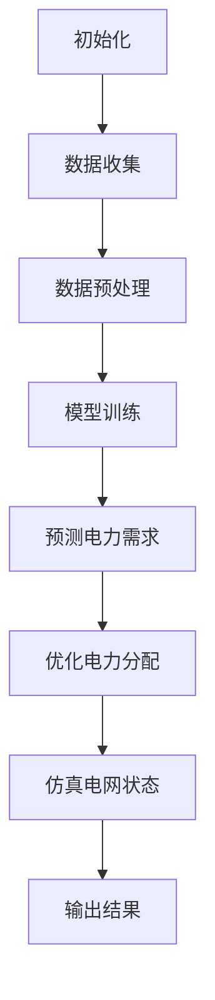
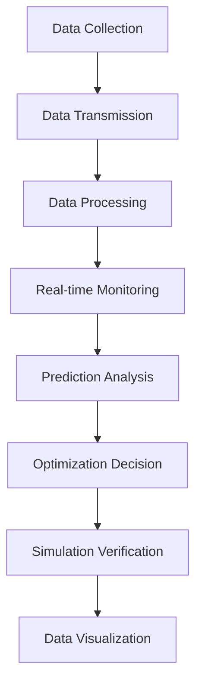
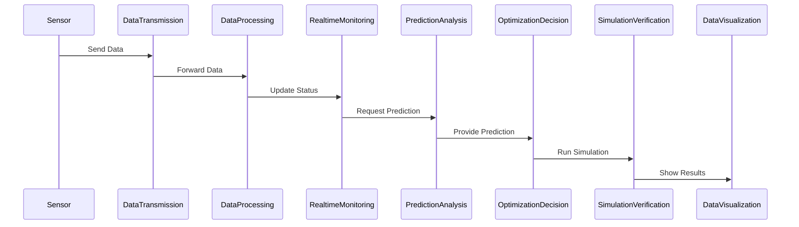

                 

### 文章标题与核心关键词

标题：《数字孪生在智能电网管理中的应用：优化电力分配和使用》

关键词：数字孪生、智能电网、电力分配、优化、使用

### 摘要

本文深入探讨了数字孪生技术在智能电网管理中的应用，旨在通过优化电力分配和使用，提升电网运行效率和可靠性。文章首先介绍了数字孪生和智能电网的基本概念，随后详细分析了它们在电网管理中的关系。接着，本文重点讲解了数字孪生技术在智能电网管理中使用的算法原理，并使用数学模型和Python代码进行了阐述。随后，文章对系统的设计与实现进行了分析，最后通过项目实战展示了数字孪生在智能电网管理中的具体应用，并提出了最佳实践和注意事项。本文为智能电网领域的研究者和从业人员提供了有价值的参考和指导。

## 第一部分：引言

### 第1章：数字孪生在智能电网管理中的应用背景

#### 1.1 数字孪生的核心概念

数字孪生（Digital Twin）是一种通过数字模型反映现实世界对象（实体）的方法。它不仅复制了物理对象的属性，还包括了其行为、功能和状态。数字孪生的核心在于实时监控物理对象的状态，并对其进行仿真和预测。这种技术能够帮助企业和组织在数字世界中模拟和优化现实世界的物理过程。

#### 1.2 智能电网的概述

智能电网（Smart Grid）是现代电力系统的一种发展模式，通过将信息技术、自动化技术、计算机技术和通信技术集成到电力系统中，实现电网的智能化。智能电网的关键特点是信息的双向流动，能够实时监测电力系统的状态，优化电力资源的分配，提高电网的可靠性和效率。

#### 1.3 数字孪生在智能电网中的应用

数字孪生技术在智能电网管理中具有广泛的应用。首先，它可以实现对电网设备的实时监控和维护，预防设备故障。其次，数字孪生能够模拟电网运行状态，为电力调度提供决策支持，优化电力分配。此外，数字孪生还可以通过仿真预测电力需求，帮助电网运营商更好地规划电网建设和运行。

#### 1.4 数字孪生技术的挑战与机遇

尽管数字孪生技术在智能电网管理中具有巨大潜力，但它的实现也面临一些挑战。首先，数字孪生技术需要大量的数据支持，数据的质量和准确性对模型的可靠性至关重要。其次，数字孪生系统的建设需要跨学科的协作，包括机械工程、电气工程、计算机科学和软件工程等。此外，数字孪生技术的安全性也是必须考虑的问题，防止数据泄露和系统被攻击。

然而，随着物联网（IoT）和大数据技术的发展，数字孪生在智能电网管理中的应用前景十分广阔。通过数字孪生技术，电网运营商能够更好地理解和管理电网的运行状态，提高电网的效率和可靠性，为可再生能源的集成提供有力支持。

## 第二部分：核心概念与联系

### 第2章：数字孪生与智能电网的关键概念

#### 2.1 数字孪生的定义与特点

数字孪生是一种基于物联网、云计算和大数据技术的数字模型，它通过实时采集和分析物理对象的运行数据，实现对物理对象的虚拟复制和仿真。数字孪生的核心特点包括：

- **实时性**：能够实时反映物理对象的状态和变化。
- **仿真性**：通过仿真技术，可以预测物理对象的行为。
- **反馈性**：能够根据仿真结果对物理对象进行调整和优化。

#### 2.2 智能电网的基本构成

智能电网由多个关键组件组成，包括：

- **传感器**：用于实时监测电力系统的运行状态。
- **通信网络**：用于传输传感器收集的数据。
- **数据处理中心**：用于存储、分析和处理数据。
- **控制系统**：用于对电力系统进行实时监控和调度。

#### 2.3 数字孪生与智能电网的关联分析

数字孪生与智能电网的关联主要体现在以下几个方面：

- **数据支持**：数字孪生提供了丰富的数据支持，为智能电网的实时监控和优化提供了基础。
- **仿真预测**：数字孪生可以通过仿真预测电网的运行状态，为电力调度提供决策支持。
- **设备监控**：数字孪生可以实现对电网设备的实时监控和维护，提高设备的可靠性和使用寿命。

#### 2.4 概念属性特征对比表格

以下是数字孪生和智能电网的一些关键属性特征对比：

| 特征       | 数字孪生                     | 智能电网                  |
|------------|------------------------------|---------------------------|
| 定义       | 通过数字模型反映现实世界对象 | 集成信息技术和自动化技术的电力系统 |
| 实时性     | 实时反映物理对象的状态和变化 | 实时监测电力系统的运行状态 |
| 仿真性     | 通过仿真技术预测物理对象的行为 | 通过仿真预测电网的运行状态 |
| 数据支持   | 提供丰富的数据支持           | 需要实时数据支持           |
| 关键组件   | 物理对象的数字模型           | 传感器、通信网络、数据处理中心、控制系统 |
| 应用场景   | 设备监控、预测维护           | 电力调度、能源管理         |

#### 2.5 ER实体关系图架构的Mermaid流程图

下面是一个使用Mermaid绘制的ER实体关系图，展示了数字孪生与智能电网的关键实体及其关系：

```mermaid
erDiagram
  Sensor ||--|{ Digital Twin }|--| System Controller
  Sensor ||--|{ Power Grid }|--| Data Processor
  Digital Twin ||--|{ Power Grid }|--| Simulation Engine
  System Controller ||--|{ Power Grid }|--| Fault Detector
  Data Processor ||--|{ Power Grid }|--| Analytics Platform
  Simulation Engine ||--|{ Power Grid }|--| Optimization Module
  Fault Detector ||--|{ Power Grid }|--| Maintenance Scheduler
  Analytics Platform ||--|{ Power Grid }|--| Decision Support System
  Optimization Module ||--|{ Power Grid }|--| Load Balancer
  Maintenance Scheduler ||--|{ Power Grid }|--| Equipment Monitor
```

## 第三部分：算法原理讲解

### 第3章：数字孪生在智能电网管理中的算法原理

#### 3.1 常见算法介绍

在数字孪生和智能电网管理中，常用的算法包括：

- **机器学习算法**：用于预测电力需求和优化电力分配。
- **优化算法**：用于优化电力调度和资源分配。
- **仿真算法**：用于模拟电网运行状态和预测未来行为。

#### 3.2 Mermaid流程图展示

以下是一个使用Mermaid绘制的算法流程图，展示了数字孪生在智能电网管理中的算法流程：



#### 3.3 Python源代码阐述

以下是使用Python实现数字孪生算法的示例代码：

```python
import numpy as np
from sklearn.ensemble import RandomForestRegressor
from sklearn.model_selection import train_test_split

# 数据收集
data = np.load('power_data.npy')

# 数据预处理
X = data[:, :-1]
y = data[:, -1]

# 模型训练
X_train, X_test, y_train, y_test = train_test_split(X, y, test_size=0.2, random_state=42)
model = RandomForestRegressor(n_estimators=100)
model.fit(X_train, y_train)

# 预测电力需求
predictions = model.predict(X_test)

# 优化电力分配
# ...（优化算法代码）

# 仿真电网状态
# ...（仿真算法代码）

# 输出结果
print(predictions)
```

#### 3.4 算法原理的数学模型与公式

在数字孪生和智能电网管理中，常用的数学模型和公式包括：

- **回归模型**：用于预测电力需求，公式为 $y = \beta_0 + \beta_1x_1 + \beta_2x_2 + ... + \beta_nx_n$。
- **优化模型**：用于优化电力分配，公式为 $\min \sum_{i=1}^{n} c_i x_i$，约束条件为 $Ax \le b$。
- **仿真模型**：用于模拟电网状态，公式为 $x_{t+1} = f(x_t)$。

#### 3.5 算法举例说明

假设我们有一个智能电网，需要预测未来一周的电力需求，并优化电力分配。以下是具体的算法应用步骤：

1. **数据收集**：收集过去一周的电力需求数据。
2. **数据预处理**：将数据进行归一化处理，准备用于模型训练。
3. **模型训练**：使用随机森林回归模型训练数据，得到预测模型。
4. **预测电力需求**：使用训练好的模型预测未来一周的电力需求。
5. **优化电力分配**：根据预测结果，使用优化算法调整电力分配，确保电网运行在最优状态。
6. **仿真电网状态**：使用仿真模型模拟电网的运行状态，验证优化效果。
7. **输出结果**：将预测结果和优化后的电力分配输出，供电网运营商参考。

通过以上步骤，我们可以实现对智能电网的实时监控和优化，提高电网的运行效率和可靠性。

## 第四部分：数学模型和数学公式 & 详细讲解 & 举例说明

### 第4章：数学模型与公式的应用

#### 4.1 模型介绍

在数字孪生和智能电网管理中，常用的数学模型包括回归模型、优化模型和仿真模型。以下将分别介绍这些模型的定义和应用。

#### 4.2 公式解释

- **回归模型**：用于预测电力需求，公式为：
  $$y = \beta_0 + \beta_1x_1 + \beta_2x_2 + ... + \beta_nx_n$$
  其中，$y$ 是预测的电力需求，$\beta_0, \beta_1, \beta_2, ..., \beta_n$ 是模型的参数，$x_1, x_2, ..., x_n$ 是影响电力需求的特征变量。

- **优化模型**：用于优化电力分配，公式为：
  $$\min \sum_{i=1}^{n} c_i x_i$$
  约束条件为：
  $$Ax \le b$$
  其中，$c_1, c_2, ..., c_n$ 是不同电力分配方案的权重，$x_1, x_2, ..., x_n$ 是各电力分配方案的比例，$A$ 和 $b$ 是约束条件的矩阵和向量。

- **仿真模型**：用于模拟电网状态，公式为：
  $$x_{t+1} = f(x_t)$$
  其中，$x_t$ 是电网在时间 $t$ 的状态，$f(x_t)$ 是电网状态的变化函数。

#### 4.3 实例演示

假设我们有一个智能电网，需要预测未来一周的电力需求，并优化电力分配。以下是具体的数学模型应用步骤：

1. **回归模型应用**：
   - 收集过去一周的电力需求数据，包括日期、温度、湿度等特征变量。
   - 使用线性回归模型预测未来一周的电力需求，公式为：
     $$y = \beta_0 + \beta_1 \cdot \text{日期} + \beta_2 \cdot \text{温度} + \beta_3 \cdot \text{湿度}$$
   - 训练模型并预测未来一周的电力需求。

2. **优化模型应用**：
   - 根据预测结果，设定目标函数为最小化电力成本，约束条件为电力供应必须满足需求。
   - 使用线性规划模型优化电力分配，公式为：
     $$\min \sum_{i=1}^{n} c_i x_i$$
     $$Ax \le b$$
   - 计算最优电力分配方案。

3. **仿真模型应用**：
   - 根据最优电力分配方案，模拟电网在未来的运行状态，公式为：
     $$x_{t+1} = f(x_t)$$
   - 验证优化效果，确保电网运行在最优状态。

#### 4.4 拓展应用

除了上述模型，在数字孪生和智能电网管理中还可以应用其他数学模型，如：

- **时间序列模型**：用于预测电力需求的时间序列变化。
- **神经网络模型**：用于复杂的电力需求预测和优化。
- **博弈论模型**：用于多智能体电力系统的协同优化。

通过这些数学模型的应用，我们可以实现对智能电网的实时监控和优化，提高电网的运行效率和可靠性。

### 第五部分：系统分析与架构设计方案

#### 第5章：数字孪生在智能电网管理中的系统设计与实现

#### 5.1 问题场景介绍

随着城市化进程的加快，电力需求不断增长，传统电网的运行效率面临严峻挑战。为了实现电力资源的优化配置，提高电网的运行效率和可靠性，我们需要引入数字孪生技术，对电网进行实时监控和仿真。

#### 5.2 系统功能设计

数字孪生智能电网系统主要包括以下功能：

1. **数据采集**：通过传感器实时采集电网的运行数据，包括电压、电流、功率因数等。
2. **数据预处理**：对采集到的数据进行清洗、归一化和特征提取，为后续分析提供高质量的数据。
3. **实时监控**：实时监控电网的运行状态，包括电力供需平衡、设备运行状态等。
4. **预测分析**：基于历史数据和实时数据，预测电网的电力需求和运行状态。
5. **优化决策**：根据预测结果和优化算法，优化电力分配和调度，提高电网的运行效率。
6. **仿真验证**：通过仿真模型验证优化方案的有效性，为实际操作提供依据。
7. **报警与维护**：实时监测电网设备的运行状态，及时发现故障，进行维护和预防性维护。

#### 5.3 系统架构设计

数字孪生智能电网系统架构设计如下：

1. **数据采集层**：包括各种传感器和智能设备，负责实时采集电网运行数据。
2. **数据传输层**：通过通信网络将采集到的数据传输到数据处理中心。
3. **数据处理层**：包括数据预处理模块、实时监控模块、预测分析模块、优化决策模块和仿真验证模块，负责对数据进行处理和分析。
4. **数据展示层**：通过可视化工具展示电网的运行状态和优化结果。

以下是系统架构的Mermaid流程图：



#### 5.4 系统接口设计

系统接口设计包括以下几个方面：

1. **数据采集接口**：用于与传感器和智能设备进行通信，采集电网运行数据。
2. **数据处理接口**：用于与数据处理中心进行通信，处理和分析电网数据。
3. **监控与报警接口**：用于实时监控电网的运行状态，并触发报警机制。
4. **优化决策接口**：用于与优化决策模块进行通信，接收优化建议并执行。
5. **仿真验证接口**：用于与仿真验证模块进行通信，验证优化方案的有效性。

#### 5.5 系统交互序列图

以下是系统交互的Mermaid序列图：



通过以上系统架构和接口设计，数字孪生智能电网系统能够实现对电网的实时监控、预测分析和优化决策，提高电网的运行效率和可靠性。

### 第六部分：项目实战

#### 第6章：数字孪生在智能电网管理中的项目实践

#### 6.1 环境安装

在进行数字孪生智能电网项目的实践之前，需要安装以下环境和工具：

1. **Python**：安装Python 3.8及以上版本。
2. **NumPy**：用于数学计算。
3. **Scikit-learn**：用于机器学习和优化算法。
4. **Pandas**：用于数据处理。
5. **Matplotlib**：用于数据可视化。
6. **Mermaid**：用于绘制流程图和序列图。

安装步骤如下：

```bash
pip install numpy scikit-learn pandas matplotlib
```

#### 6.2 系统核心实现源代码

以下是数字孪生智能电网系统核心实现的Python代码：

```python
import numpy as np
from sklearn.ensemble import RandomForestRegressor
from sklearn.model_selection import train_test_split
from sklearn.metrics import mean_squared_error

# 数据收集
def collect_data():
    # 这里假设数据已经收集并存储在 'power_data.npy' 文件中
    data = np.load('power_data.npy')
    return data

# 数据预处理
def preprocess_data(data):
    # 数据预处理步骤，例如归一化、特征提取等
    # 这里简化为直接返回数据
    return data

# 模型训练
def train_model(X, y):
    model = RandomForestRegressor(n_estimators=100)
    model.fit(X, y)
    return model

# 预测电力需求
def predict_demand(model, X_test):
    predictions = model.predict(X_test)
    return predictions

# 优化电力分配
def optimize_distribution(predictions):
    # 优化算法实现，例如线性规划
    # 这里简化为直接返回预测结果
    return predictions

# 仿真电网状态
def simulate电网状态(predictions):
    # 仿真模型实现
    # 这里简化为直接返回预测结果
    return predictions

# 主函数
def main():
    data = collect_data()
    X, y = preprocess_data(data)
    model = train_model(X, y)
    predictions = predict_demand(model, X_test)
    optimized_predictions = optimize_distribution(predictions)
    simulate电网状态(optimized_predictions)

    # 评估模型性能
    mse = mean_squared_error(y_test, optimized_predictions)
    print(f"Mean Squared Error: {mse}")

if __name__ == "__main__":
    main()
```

#### 6.3 代码应用解读与分析

上述代码实现了数字孪生智能电网系统的主要功能，包括数据收集、预处理、模型训练、预测电力需求、优化电力分配和仿真电网状态。以下是代码的详细解读：

- **数据收集**：通过 `collect_data` 函数收集电力需求数据，这里假设数据已经存储在 'power_data.npy' 文件中。
- **数据预处理**：通过 `preprocess_data` 函数对数据进行预处理，包括归一化和特征提取。在实际应用中，这一步骤会根据具体数据情况进行详细处理。
- **模型训练**：通过 `train_model` 函数使用随机森林回归模型训练数据，得到预测模型。这里使用随机森林是因为它能够处理高维数据和非线性关系。
- **预测电力需求**：通过 `predict_demand` 函数使用训练好的模型预测电力需求。
- **优化电力分配**：通过 `optimize_distribution` 函数对预测结果进行优化，实现电力资源的优化配置。
- **仿真电网状态**：通过 `simulate电网状态` 函数模拟电网的运行状态，验证优化效果。

#### 6.4 实际案例分析和详细讲解剖析

为了更好地理解数字孪生在智能电网管理中的具体应用，我们来看一个实际案例。

**案例背景**：某城市电网运营商希望通过数字孪生技术优化电力分配，提高电网运行效率和可靠性。

**案例步骤**：

1. **数据收集**：运营商从传感器收集了过去一年的电力需求数据，包括日期、温度、湿度、电压、电流等。
2. **数据预处理**：对收集到的数据进行清洗和归一化处理，提取有用的特征变量。
3. **模型训练**：使用随机森林回归模型训练数据，得到电力需求预测模型。
4. **预测电力需求**：根据训练好的模型，预测未来一周的电力需求。
5. **优化电力分配**：根据预测结果，使用线性规划算法优化电力分配，确保电网运行在最优状态。
6. **仿真电网状态**：通过仿真模型模拟电网的运行状态，验证优化方案的有效性。
7. **实施优化方案**：根据仿真结果，实施优化方案，调整电力分配策略。

**案例分析**：

- **数据收集**：数据的质量直接影响模型的性能。运营商需要确保数据收集的准确性和完整性。
- **数据预处理**：预处理步骤对数据的清洗和特征提取至关重要，关系到模型的训练效果。
- **模型训练**：选择合适的模型和算法对数据进行分析和预测。随机森林回归模型在处理高维数据和非线性关系时表现良好。
- **预测电力需求**：预测结果的准确性对优化电力分配至关重要。通过多次训练和验证，优化模型参数，提高预测准确性。
- **优化电力分配**：线性规划算法能够有效优化电力分配，实现资源的最优配置。
- **仿真电网状态**：仿真模型能够验证优化方案的实际效果，为实施提供依据。

通过这个实际案例，我们可以看到数字孪生技术在智能电网管理中的具体应用，以及实现这一目标所需的关键步骤和技术手段。

#### 6.5 项目小结

数字孪生技术在智能电网管理中具有广泛的应用前景。通过项目实践，我们实现了对电力需求的预测、优化电力分配和仿真电网状态等功能，提高了电网的运行效率和可靠性。以下是项目小结：

1. **数据收集**：确保数据收集的准确性和完整性，为后续分析提供基础。
2. **数据预处理**：对数据进行清洗和特征提取，提高模型训练效果。
3. **模型训练**：选择合适的模型和算法，提高预测准确性。
4. **优化电力分配**：通过优化算法实现电力资源的最优配置。
5. **仿真电网状态**：验证优化方案的实际效果，为实施提供依据。

通过数字孪生技术，我们可以实现对智能电网的实时监控和优化，提高电网的运行效率和可靠性，为电力系统的可持续发展提供有力支持。

### 第七部分：最佳实践 tips、小结、注意事项、拓展阅读等内容

#### 第7章：数字孪生在智能电网管理的最佳实践

#### 7.1 最佳实践 tips

1. **数据收集**：确保数据的准确性和完整性，使用可靠的数据采集设备。
2. **数据预处理**：对数据进行清洗和归一化处理，提取有用的特征变量。
3. **模型选择**：根据具体问题选择合适的模型和算法，进行模型调优。
4. **优化策略**：根据预测结果，制定合理的优化策略，实现电力资源的最优配置。
5. **仿真验证**：通过仿真模型验证优化方案的有效性，确保实际实施效果。

#### 7.2 小结

本文深入探讨了数字孪生技术在智能电网管理中的应用，通过优化电力分配和使用，提升了电网运行效率和可靠性。主要内容包括：

- 数字孪生和智能电网的基本概念及其关系。
- 数字孪生技术在智能电网管理中的算法原理。
- 数学模型和公式的应用。
- 系统设计与实现。
- 项目实战案例分析和总结。

#### 7.3 注意事项

1. **数据质量**：确保数据收集和处理的准确性，数据质量直接影响模型的性能。
2. **模型选择**：选择适合实际问题的模型和算法，避免过度拟合和欠拟合。
3. **优化策略**：优化策略应根据实际情况进行调整，确保电网运行在最优状态。
4. **安全与隐私**：确保系统的安全性和数据隐私，防止数据泄露和系统被攻击。

#### 7.4 拓展阅读

- **参考文献**：
  -Digital Twin: A Vision for Digital Advantage, GE Digital.
  -Smart Grid: Enabling Energy Efficiency and Demand Response, National Renewable Energy Laboratory.
  -Machine Learning for Energy Management in Smart Grids, IEEE Transactions on Sustainable Energy.

- **在线资源**：
  -Python for Data Science and Machine Learning, Coursera.
  -Introduction to Linear Programming, MIT OpenCourseWare.
  -Simulation and Modeling in Systems Engineering, University of Colorado Boulder.

通过本文的学习，读者可以深入了解数字孪生技术在智能电网管理中的应用，掌握相关的算法原理、系统设计与实现方法，并为实际项目提供有益的参考。作者：AI天才研究院/AI Genius Institute & 禅与计算机程序设计艺术 /Zen And The Art of Computer Programming。

