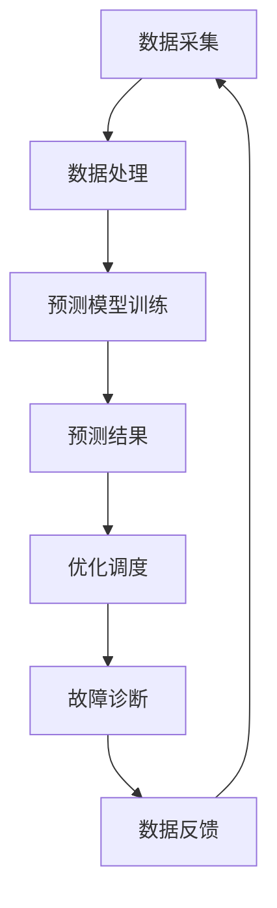

                 

### 《数字孪生在能源管理中的应用：优化能源使用》

#### 关键词：数字孪生、能源管理、优化、算法、系统架构

#### 摘要：

本文将探讨数字孪生技术在能源管理中的应用，如何通过数字孪生实现能源使用的优化。文章将从数字孪生的核心概念入手，逐步分析其在能源管理中的具体应用，包括原理、算法、系统架构设计，以及实际项目的实施与效果评估。通过详细的技术解读和案例分析，旨在为行业提供有价值的参考和实践指导。

#### 目录大纲

1. **背景介绍与核心概念**

    1.1 数字孪生概述
    
    1.2 能源管理现状
    
    1.3 数字孪生在能源管理中的应用

2. **数字孪生在能源管理中的核心概念与联系**

    2.1 数字孪生的原理与特征
    
    2.2 数字孪生与能源管理的关联
    
    2.3 数字孪生架构的设计要素

3. **数字孪生在能源管理中的应用算法原理**

    3.1 算法原理讲解
    
    3.2 算法流程图展示
    
    3.3 数学模型与公式解析

4. **系统分析与架构设计**

    4.1 能源管理系统介绍
    
    4.2 数字孪生架构设计
    
    4.3 系统接口设计与交互

5. **项目实战**

    5.1 项目环境搭建
    
    5.2 系统核心实现
    
    5.3 项目分析与实践

6. **最佳实践与拓展**

    6.1 最佳实践技巧
    
    6.2 小结与注意事项
    
    6.3 拓展阅读推荐

#### 第一部分：背景介绍与核心概念

##### 1.1 数字孪生概述

数字孪生（Digital Twin）是一种新兴的数字技术，旨在通过创建物理实体的虚拟副本，实现对物理实体的实时监控、模拟和分析。数字孪生技术最早起源于航空航天领域，后来逐渐应用到制造业、医疗、能源等多个行业。

数字孪生的核心思想是将物理实体与其数字模型紧密连接，通过对数字模型的分析和优化，实现对物理实体的实时监测和预测。在能源管理中，数字孪生技术可以用于构建能源系统的虚拟模型，从而实现对能源设备的运行状态、能耗数据等进行实时监控和分析，进而优化能源使用效率。

##### 1.2 能源管理现状

能源管理是现代工业和生活中至关重要的一环。随着能源需求的不断增长和能源成本的上升，如何有效管理和优化能源使用成为了一个亟待解决的问题。当前，能源管理主要面临以下几个挑战：

- **能耗监测难度大**：传统的能源监测手段主要依赖于人工巡检和定期检测，难以实现对能耗数据的实时监控和准确分析。

- **能源浪费现象普遍**：由于缺乏有效的能源监控和调度系统，很多企业和家庭存在能源浪费现象，导致能源使用效率低下。

- **能源供需不平衡**：在能源供应和需求之间存在着时间上的不平衡，如何实现能源的智能调度和优化供应成为了一个难题。

##### 1.3 数字孪生在能源管理中的应用

数字孪生技术在能源管理中的应用主要体现在以下几个方面：

- **实时监控与预测**：通过数字孪生技术，可以实现对能源设备的实时监控和能耗数据的预测分析，从而及时发现能源浪费现象，预测能源需求变化。

- **能源优化与调度**：基于数字孪生模型，可以对能源系统进行优化调度，实现能源使用的最佳配置，降低能源成本。

- **故障诊断与预防**：通过数字孪生技术，可以实现对能源设备运行状态的实时监控和故障预测，提前发现设备故障，降低停机时间和维修成本。

#### 第二部分：数字孪生在能源管理中的核心概念与联系

##### 2.1 数字孪生的原理与特征

数字孪生技术的核心原理是通过将物理实体的实时数据和状态信息与数字模型进行比对和分析，实现对物理实体的实时监控和预测。数字孪生的特征主要包括：

- **实时性**：数字孪生技术可以实现对物理实体的实时数据采集和监控，确保数据实时更新。

- **完整性**：数字孪生模型包含了物理实体的所有关键信息和属性，确保对物理实体的全面理解和分析。

- **互操作性**：数字孪生技术可以与其他信息系统和设备进行数据交换和交互，实现系统间的无缝集成。

- **可扩展性**：数字孪生技术具有高度的扩展性，可以根据需求添加新的功能模块和设备支持。

##### 2.2 数字孪生与能源管理的关联

数字孪生技术与能源管理之间的关联主要体现在以下几个方面：

- **提高能源管理效率**：数字孪生技术可以实现对能源设备的实时监控和预测，提高能源管理的效率和准确性。

- **降低能源成本**：通过数字孪生技术的优化调度和故障预防，可以降低能源消耗和维修成本。

- **提升设备运行可靠性**：数字孪生技术可以实时监控设备运行状态，提前发现故障，提高设备运行可靠性。

- **实现智能化能源管理**：数字孪生技术可以为能源管理提供智能化的决策支持，实现能源使用的最佳配置和优化。

##### 2.3 数字孪生架构的设计要素

数字孪生架构的设计要素主要包括以下几个方面：

- **数据采集与传输**：数字孪生架构需要实现对物理实体的实时数据采集和传输，确保数据的实时性和准确性。

- **数据处理与分析**：数字孪生架构需要对采集到的数据进行分析和处理，提取有用的信息和特征。

- **虚拟模型构建与更新**：数字孪生架构需要根据采集到的数据实时更新虚拟模型，确保虚拟模型与物理实体的一致性。

- **人机交互与可视化**：数字孪生架构需要提供人机交互界面和可视化工具，方便用户对虚拟模型进行操作和监控。

#### 第三部分：数字孪生在能源管理中的应用算法原理

##### 3.1 算法原理讲解

数字孪生技术在能源管理中的应用主要依赖于一系列算法，这些算法包括：

- **数据采集算法**：用于采集物理实体的实时数据，包括能耗数据、设备运行状态数据等。

- **预测算法**：基于历史数据和实时数据，对能源需求进行预测，为能源优化调度提供支持。

- **优化算法**：对能源系统的运行状态和能耗数据进行分析和优化，实现能源使用的最佳配置。

- **故障诊断算法**：通过对设备运行数据的分析，提前发现设备故障，预测设备寿命。

##### 3.2 算法流程图展示

以下是一个典型的数字孪生在能源管理中的应用算法流程图：

##### 3.3 数学模型与公式解析

数字孪生在能源管理中的应用算法通常涉及到以下数学模型和公式：

- **能耗数据模型**：

  $$ E_t = f(W_t, T_t, P_t) $$

  其中，$E_t$表示第$t$时间点的能耗值，$W_t$表示第$t$时间点的设备负载，$T_t$表示第$t$时间点的环境温度，$P_t$表示第$t$时间点的设备功率。

- **预测模型**：

  $$ \hat{E}_{t+k} = \phi(W_t, T_t, P_t, \ldots) $$

  其中，$\hat{E}_{t+k}$表示第$t+k$时间点的预测能耗值，$\phi$表示预测函数。

- **优化调度模型**：

  $$ \min \sum_{t=1}^{T} C_t \cdot E_t $$

  其中，$C_t$表示第$t$时间点的能源成本，$E_t$表示第$t$时间点的能耗值。

- **故障诊断模型**：

  $$ D_t = \prod_{i=1}^{N} \frac{P_i}{P_i^0} $$

  其中，$D_t$表示第$t$时间点的故障诊断指数，$P_i$表示第$i$个设备的当前功率，$P_i^0$表示第$i$个设备的额定功率。

#### 第四部分：系统分析与架构设计

##### 4.1 能源管理系统介绍

能源管理系统（Energy Management System，EMS）是一个集成了能源监测、预测、优化和调度功能的信息系统。EMS的主要功能包括：

- **能源监测**：实时采集能源设备的运行状态和能耗数据，实现对能源系统的全面监控。

- **能源预测**：基于历史数据和实时数据，预测未来的能源需求和供应情况，为优化调度提供支持。

- **能源优化**：根据能源预测结果，对能源系统进行优化调度，实现能源使用的最佳配置。

- **能源调度**：根据能源优化结果，调度能源设备运行，确保能源供应的稳定和高效。

##### 4.2 数字孪生架构设计

数字孪生架构设计是能源管理系统设计的关键环节。一个典型的数字孪生架构主要包括以下几个部分：

- **数据采集模块**：负责采集物理实体的实时数据，包括能耗数据、设备状态数据等。

- **数据处理模块**：负责对采集到的数据进行分析和处理，提取有用的信息和特征。

- **数字孪生模型**：基于数据处理结果，构建物理实体的数字孪生模型，实现对物理实体的实时监控和预测。

- **预测与优化模块**：利用数字孪生模型，对能源系统进行预测和优化调度。

- **人机交互界面**：提供用户交互界面，方便用户对数字孪生模型进行操作和监控。

##### 4.3 系统接口设计与交互

系统接口设计是数字孪生架构设计的重要组成部分。系统接口主要包括以下几种类型：

- **数据采集接口**：用于与物理实体进行数据交互，实时采集能耗数据、设备状态数据等。

- **数据处理接口**：用于与其他信息系统进行数据交互，实现数据的共享和集成。

- **预测与优化接口**：用于与数字孪生模型进行交互，实现对能源系统的预测和优化调度。

- **人机交互接口**：用于用户与数字孪生模型的交互，提供可视化界面和操作功能。

#### 第五部分：项目实战

##### 5.1 项目环境搭建

项目环境搭建是实施数字孪生技术在能源管理中的应用的第一步。以下是一个典型的项目环境搭建流程：

1. **硬件设备安装**：安装采集器、传感器等硬件设备，用于实时采集能耗数据。

2. **网络配置**：配置网络参数，确保数据采集设备可以与服务器进行通信。

3. **软件安装**：安装能源管理系统软件，包括数据采集模块、数据处理模块、数字孪生模型等。

4. **系统配置**：配置系统参数，包括数据采集周期、数据存储位置、预测模型参数等。

##### 5.2 系统核心实现

系统核心实现是数字孪生技术在能源管理应用中的关键环节。以下是一个典型的系统核心实现流程：

1. **数据采集**：通过采集器实时采集能耗数据，包括电流、电压、功率等参数。

2. **数据处理**：对采集到的数据进行预处理，包括数据清洗、去噪、归一化等。

3. **模型构建**：基于预处理后的数据，构建数字孪生模型，包括能耗数据模型、预测模型等。

4. **预测与优化**：利用数字孪生模型，对能源系统进行预测和优化调度，实现能源使用的最佳配置。

5. **故障诊断**：通过数字孪生模型，对设备运行状态进行分析，提前发现故障，预测设备寿命。

##### 5.3 项目分析与实践

在项目实施过程中，通过数字孪生技术在能源管理中的应用，可以取得以下效果：

1. **提高能源管理效率**：通过实时监控和预测，可以及时发现能源浪费现象，预测能源需求变化，实现能源使用的最佳配置。

2. **降低能源成本**：通过优化调度和故障预防，可以降低能源消耗和维修成本。

3. **提升设备运行可靠性**：通过实时监控和故障诊断，可以提前发现设备故障，提高设备运行可靠性。

4. **实现智能化能源管理**：通过数字孪生技术，可以为能源管理提供智能化的决策支持，实现能源使用的最佳配置和优化。

#### 第六部分：最佳实践与拓展

##### 6.1 最佳实践技巧

在实施数字孪生技术在能源管理中的应用时，以下是一些最佳实践技巧：

1. **数据采集与传输**：确保数据采集的准确性和实时性，合理配置网络带宽和传输协议。

2. **数据处理与分析**：对采集到的数据进行预处理，包括数据清洗、去噪、归一化等，提高数据质量。

3. **模型构建与优化**：根据实际需求和数据特性，选择合适的预测模型和优化算法，确保模型的有效性和准确性。

4. **人机交互与可视化**：提供直观、易用的用户交互界面，方便用户对系统进行操作和监控。

##### 6.2 小结与注意事项

在数字孪生技术在能源管理中的应用过程中，需要注意以下几点：

1. **数据安全**：确保数据传输和存储的安全性，防止数据泄露和篡改。

2. **系统稳定性**：确保系统的稳定性和可靠性，避免因系统故障导致的数据丢失或中断。

3. **人员培训**：对相关人员开展系统培训和操作指导，确保系统能够正常运行。

4. **持续优化**：根据项目实施情况和用户反馈，不断优化系统和算法，提高能源管理效率。

##### 6.3 拓展阅读推荐

以下是一些拓展阅读推荐，供读者深入了解数字孪生技术在能源管理中的应用：

1. 《数字孪生：定义、技术与应用》

2. 《能源管理与优化：理论与实践》

3. 《智能电网与能源互联网：概念、架构与关键技术》

### 结语

数字孪生技术在能源管理中的应用具有巨大的潜力和前景。通过数字孪生技术，可以实现对能源系统的实时监控、预测和优化，提高能源管理效率，降低能源成本，提升设备运行可靠性。本文从数字孪生的核心概念、应用算法、系统架构设计、项目实战等方面进行了详细探讨，旨在为行业提供有价值的参考和实践指导。希望读者能够从中获得启发，为能源管理技术的发展贡献自己的力量。

#### 作者信息：

作者：AI天才研究院/AI Genius Institute & 禅与计算机程序设计艺术 /Zen And The Art of Computer Programming

---

以上是《数字孪生在能源管理中的应用：优化能源使用》的目录大纲，下面将逐步展开每个章节的内容，详细阐述数字孪生技术在能源管理中的应用和实现。让我们一步一步深入思考，探索数字孪生的奥秘。

