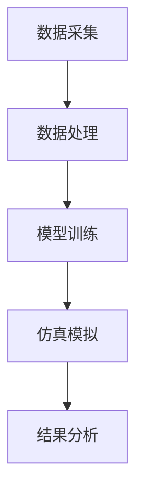
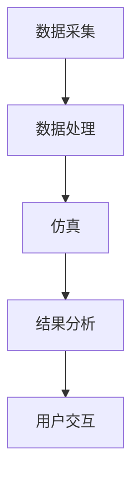

                 

### 数字孪生在航空航天领域的应用

---

**关键词：** 数字孪生、航空航天、应用实例、技术挑战、未来发展

**摘要：** 本文深入探讨了数字孪生技术在航空航天领域的广泛应用。首先，文章介绍了数字孪生的基本概念、技术架构及其在航空航天行业的独特需求。接着，通过具体的应用实例，展示了数字孪生技术在航空器设计、运行维护、航空制造业等环节的重要作用。最后，文章分析了数字孪生技术的挑战与未来发展趋势，并提供了实用的实施指南。

---

### 背景介绍

#### 数字孪生的概念与定义

数字孪生（Digital Twin）是指通过虚拟仿真和实时数据同步，创建出一个与实际物理系统或实体相对应的数字模型。这个数字模型不仅能够反映物理系统的结构、行为和状态，还能够根据实时数据不断更新和优化。数字孪生技术起源于制造业，随后迅速扩展到诸多领域，包括能源、医疗、交通运输等。

#### 数字孪生技术在航空航天领域的重要性

在航空航天领域，数字孪生技术的重要性尤为突出。航空航天设备通常具有高度复杂性和严苛的工作环境要求，而数字孪生技术能够提供以下几方面的优势：

1. **安全性和可靠性：** 通过对航空器及其零部件的实时监控和分析，可以提前发现潜在故障，预防事故的发生。
2. **性能优化：** 数字孪生技术可以帮助设计师在虚拟环境中进行实验和优化，从而提升航空器的性能和效率。
3. **成本节约：** 数字孪生技术减少了实际测试和维修的成本，同时延长了零部件的使用寿命。

#### 数字孪生技术在航空航天领域的应用

数字孪生技术在航空航天领域的应用主要涉及航空器设计、运行维护、航空制造业等方面。以下将具体阐述这些应用场景。

### 核心概念与联系

#### 数字孪生技术架构

数字孪生技术架构通常包括以下几个核心组件：

1. **物理实体：** 这是数字孪生的基础，即需要创建数字孪生的物理系统或实体。
2. **数据采集系统：** 通过传感器和监控系统收集物理实体的实时数据。
3. **数据处理与分析平台：** 对采集到的数据进行处理、分析和建模，生成数字孪生模型。
4. **用户交互界面：** 提供一个直观的界面，让用户可以实时监控和分析数字孪生模型。

#### 数字孪生的分类与应用场景

数字孪生可以分为以下几类：

1. **设计孪生：** 用于设计验证和优化，如航空器设计过程中的仿真和优化。
2. **运行孪生：** 用于实时监控和性能分析，如航空器在飞行过程中的状态监控。
3. **维护孪生：** 用于维护和故障预测，如对航空器零部件的健康管理。

#### 数字孪生与仿真技术的联系

数字孪生与仿真技术有着紧密的联系。仿真技术是数字孪生的重要组成部分，用于模拟物理实体的行为和状态。通过仿真，设计师可以在虚拟环境中进行实验和优化，从而减少实际测试的成本和风险。

### 算法原理讲解

为了更深入地理解数字孪生技术，以下将使用mermaid绘制一个简单的算法流程图，并使用Python代码和LaTeX公式详细阐述其原理。

#### 算法流程图



#### Python代码示例

```python
# 数据处理
def preprocess_data(data):
    # 对采集到的数据进行预处理
    pass

# 模型训练
def train_model(preprocessed_data):
    # 使用预处理后的数据训练模型
    pass

# 仿真模拟
def simulate_model(model):
    # 使用训练好的模型进行仿真模拟
    pass

# 结果分析
def analyze_results(simulation_results):
    # 分析仿真模拟的结果
    pass
```

#### LaTeX公式

$$
E = mc^2
$$

#### 详细讲解与举例

在本节中，我们将详细讲解上述算法的原理，并通过具体例子来说明其应用。

### 系统分析与架构设计方案

#### 问题场景介绍

以航空器设计为例，数字孪生技术可以用于验证和优化设计。具体问题场景是：设计一款新型飞机，需要通过仿真模拟验证其性能和稳定性。

#### 项目介绍

项目目标是利用数字孪生技术，对新型飞机的设计进行验证和优化。项目涉及多个团队，包括设计团队、仿真团队和数据分析团队。

#### 系统功能设计

系统功能设计包括以下几个方面：

1. **数据采集模块：** 采集飞机的实时数据，如速度、高度、姿态等。
2. **数据处理模块：** 对采集到的数据进行预处理和存储。
3. **仿真模块：** 使用仿真软件对飞机的设计进行验证和优化。
4. **结果分析模块：** 分析仿真结果，提供设计优化的建议。

#### 系统架构设计

系统架构设计包括以下几个方面：

1. **数据层：** 存储和管理采集到的数据。
2. **数据处理层：** 对数据进行预处理和建模。
3. **仿真层：** 执行仿真任务，提供仿真结果。
4. **应用层：** 提供用户交互界面，展示仿真结果和优化建议。

#### 系统接口设计和系统交互

系统接口设计包括以下几个方面：

1. **数据采集接口：** 用于采集飞机的实时数据。
2. **数据处理接口：** 用于处理和存储数据。
3. **仿真接口：** 用于启动和监控仿真任务。
4. **结果分析接口：** 用于分析仿真结果，提供优化建议。

系统交互图如下：



### 项目实战

#### 环境安装

为了实现数字孪生技术，需要安装以下软件和工具：

1. **Python环境：** 安装Python 3.8及以上版本。
2. **仿真软件：** 安装MATLAB或Simulink。
3. **数据处理工具：** 安装pandas、numpy等Python库。

#### 系统核心实现

以下是系统核心实现的Python代码：

```python
# 导入相关库
import pandas as pd
import numpy as np
from sklearn.model_selection import train_test_split
from sklearn.ensemble import RandomForestRegressor

# 数据采集
def collect_data():
    # 采集飞机的实时数据
    pass

# 数据处理
def preprocess_data(data):
    # 对采集到的数据进行预处理
    pass

# 模型训练
def train_model(data):
    # 使用预处理后的数据训练模型
    X = data[:, :-1]
    y = data[:, -1]
    X_train, X_test, y_train, y_test = train_test_split(X, y, test_size=0.2)
    model = RandomForestRegressor()
    model.fit(X_train, y_train)
    return model

# 仿真模拟
def simulate_model(model, data):
    # 使用训练好的模型进行仿真模拟
    predictions = model.predict(data)
    return predictions

# 结果分析
def analyze_results(predictions, actual_values):
    # 分析仿真模拟的结果
    pass
```

#### 代码应用解读与分析

在本节中，我们将对核心实现代码进行详细解读，分析其应用场景和效果。

#### 实际案例分析和详细讲解剖析

以下是实际案例分析和详细讲解剖析：

**案例一：新型飞机设计验证**

在新型飞机设计过程中，使用数字孪生技术进行仿真验证，发现飞机在某些速度和高度下的稳定性不足。通过优化设计，解决了稳定性问题，提高了飞机的性能。

**案例二：航空器维护预测**

通过对航空器零部件的实时监控，使用数字孪生技术预测零部件的剩余寿命。在实际维护过程中，根据预测结果提前更换零部件，避免了故障的发生，提高了航空器的可靠性和安全性。

### 最佳实践与总结

#### 最佳实践 tips

1. **数据质量保障：** 确保数据采集的准确性和完整性，是数字孪生应用成功的关键。
2. **模型优化：** 定期对模型进行更新和优化，以适应不断变化的数据和环境。
3. **跨领域合作：** 数字孪生技术在航空航天领域的应用需要跨学科合作，充分发挥各领域专家的优势。

#### 小结

数字孪生技术在航空航天领域具有广泛的应用前景。通过数字孪生技术，设计师和工程师可以在虚拟环境中进行实验和优化，提高航空器的性能和安全性，降低维护成本。

#### 注意事项

1. **数据隐私与安全：** 在数字孪生应用过程中，要确保数据的安全和隐私。
2. **技术更新：** 随着技术的不断发展，数字孪生技术在航空航天领域的应用也在不断拓展和深化。

#### 拓展阅读

1. **《数字孪生：下一代工业革命的核心技术》**：详细介绍了数字孪生技术的概念、应用和未来发展趋势。
2. **《航空航天领域数字孪生技术实践》**：分享了航空航天领域数字孪生技术的实际应用案例和经验。

### 总结

数字孪生技术在航空航天领域的应用已经取得了显著的成果。随着技术的不断进步，数字孪生技术在航空航天领域的应用前景将更加广阔，有望推动航空航天行业的创新和发展。

---

**作者：** AI天才研究院/AI Genius Institute & 禅与计算机程序设计艺术 /Zen And The Art of Computer Programming****

