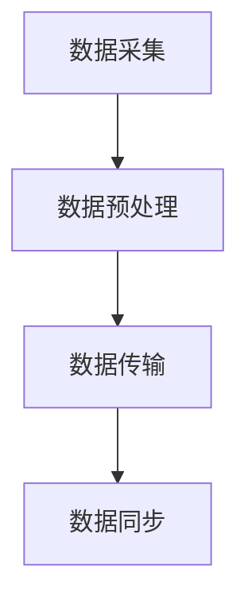
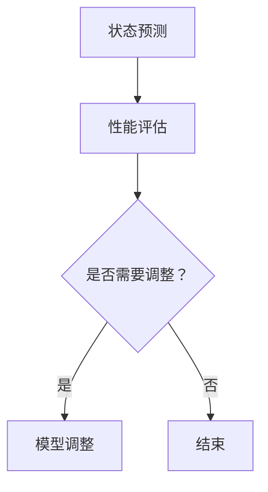
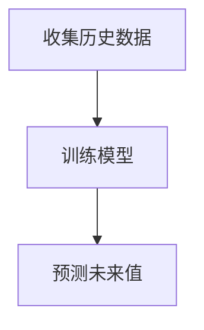
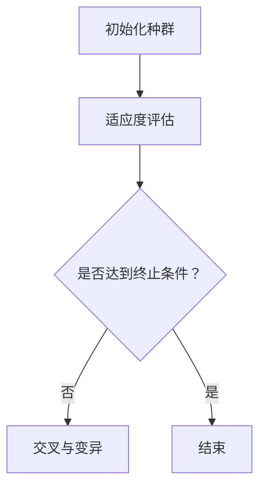
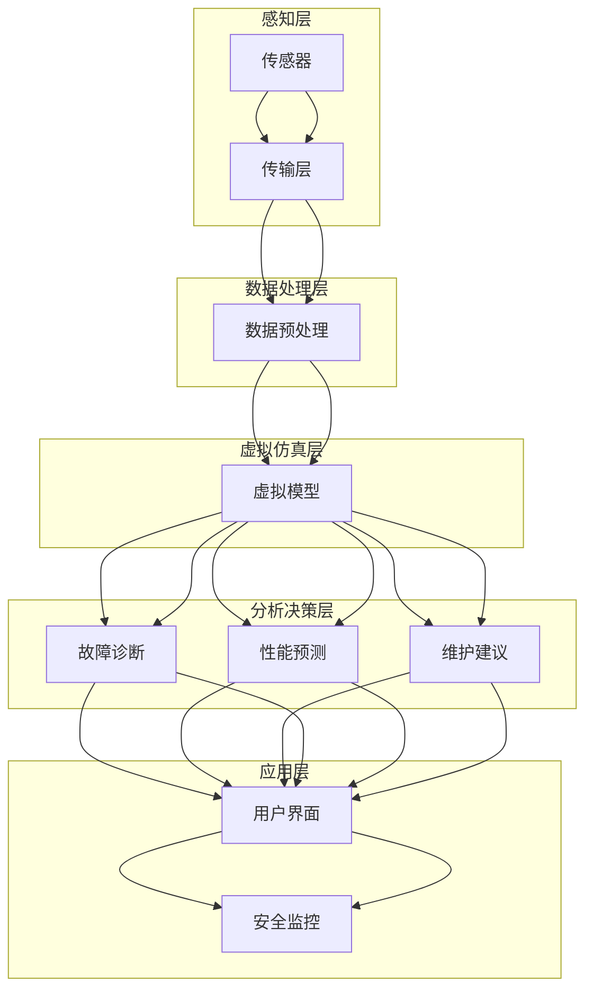

                 

## 数字孪生在航空航天领域的应用：优化飞行器设计与维护

### 关键词：
数字孪生、航空航天、飞行器设计、维护优化、虚拟仿真、建模与仿真、数据分析

### 摘要：
本文深入探讨了数字孪生技术在航空航天领域的应用，特别是在飞行器设计与维护优化方面的潜力。首先，我们简要介绍了数字孪生技术的概念，并阐述了其在航空航天领域的重要性。随后，我们详细分析了数字孪生与虚拟仿真、建模与仿真、数据分析等核心概念的联系与区别。接着，我们介绍了数字孪生技术的算法原理，并通过Python源代码和LaTeX数学公式进行了详细讲解。随后，我们重点讨论了数字孪生在航空航天系统分析与架构设计中的应用，包括系统功能设计、领域模型类图、系统架构设计、系统接口设计和系统交互。接着，我们通过一个实际项目展示了数字孪生技术的应用过程，从环境安装、核心实现源代码到代码应用解读与分析，以及实际案例分析和详细讲解。最后，我们提出了最佳实践建议，总结了本文的主要观点，并对未来的研究方向进行了展望。

### 目录大纲设计思路

在撰写本文之前，我们首先需要设计一个合理的目录大纲，以确保文章的逻辑清晰、内容连贯，同时吸引读者的兴趣。以下是我们的设计思路：

1. **明确整体架构**：本文的整体架构将分为五个主要部分：引言、背景介绍、核心概念与联系、算法原理讲解、系统分析与架构设计方案、项目实战、最佳实践 tips 和小结。每个部分都将深入探讨与数字孪生在航空航天领域应用相关的内容。

2. **划分章节内容**：每个部分将细分为多个小节，每个小节都有明确的标题和内容。例如，在背景介绍部分，我们将分为航空航天领域的现状、数字孪生技术的影响以及研究问题等小节。

3. **注重内容深度**：对于核心概念和算法原理，我们将详细讲解，并使用mermaid画出流程图，结合Python源代码和LaTeX数学公式，以便读者更好地理解。

4. **结合实践应用**：在每个章节的最后，我们将加入项目实战部分，通过具体案例来展示理论的实际应用，增强读者的理解和记忆。

5. **总结与拓展**：在每个章节的最后，我们将加入小结、注意事项和拓展阅读，帮助读者巩固知识，引导他们进行更深入的学习。

### 目录大纲具体步骤

为了确保文章的连贯性和逻辑性，我们制定了以下具体的目录大纲：

### 第一部分：引言

#### 1.1 数字孪生技术简介

#### 1.2 数字孪生在航空航天领域的重要性

#### 1.3 本书结构

### 第二部分：背景介绍

#### 2.1 航空航天领域的现状

#### 2.2 数字孪生技术对航空航天领域的影响

#### 2.3 研究问题

### 第三部分：核心概念与联系

#### 3.1 数字孪生

#### 3.2 虚拟仿真

#### 3.3 建模与仿真

#### 3.4 数据分析

#### 3.5 概念联系与区别

### 第四部分：算法原理讲解

#### 4.1 常用数字孪生算法

#### 4.2 算法流程图展示

#### 4.3 Python源代码与LaTeX数学公式解析

### 第五部分：系统分析与架构设计方案

#### 5.1 系统功能设计

#### 5.2 领域模型类图

#### 5.3 系统架构设计

#### 5.4 系统接口设计

#### 5.5 系统交互

### 第六部分：项目实战

#### 6.1 环境安装与配置

#### 6.2 系统核心实现源代码

#### 6.3 代码应用解读与分析

#### 6.4 实际案例分析与详细讲解

### 第七部分：最佳实践 tips

#### 7.1 实际应用中的技巧和注意事项

#### 7.2 指导如何避免常见错误

### 第八部分：小结

#### 8.1 总结本书的核心内容和观点

#### 8.2 强调数字孪生技术在航空航天领域的应用前景

### 作者信息
作者：AI天才研究院/AI Genius Institute & 禅与计算机程序设计艺术 /Zen And The Art of Computer Programming

通过以上详细的目录大纲，我们希望能够系统地阐述数字孪生在航空航天领域的应用，为读者提供有价值的参考。

## 数字孪生技术简介

数字孪生（Digital Twin）是一种基于物理实体在虚拟空间中的映射和交互的技术，通过将现实世界中的实体、系统或过程在数字世界中创建一个虚拟模型，实现对现实世界的高精度模拟、监控和优化。数字孪生的核心思想是将物理世界中的实体与其数字模型相连接，实时同步数据，使数字模型能够反映物理实体的状态、性能和行为。

数字孪生的应用非常广泛，包括但不限于工业制造、医疗健康、城市建设、交通运输和航空航天等领域。在航空航天领域，数字孪生技术具有特别重要的意义，因为航空航天设备通常具有高度复杂性和高风险性，对精确性和可靠性要求极高。

### 数字孪生在航空航天领域的重要性

在航空航天领域，数字孪生技术的重要性主要体现在以下几个方面：

1. **飞行器设计优化**：数字孪生技术可以帮助设计师在虚拟环境中对飞行器进行仿真和测试，优化设计参数，减少物理原型制造次数，降低研发成本，提高设计效率。

2. **维护与健康管理**：通过实时监控和数据分析，数字孪生技术可以预测飞行器的健康状态，提前发现潜在故障，制定维护计划，减少意外停机和维护成本。

3. **安全性与可靠性保障**：数字孪生技术可以模拟飞行器的运行状态，对飞行过程中的各种情况进行预测和分析，确保飞行安全。

4. **运行效率提升**：通过对飞行器的运行数据进行分析，数字孪生技术可以帮助优化飞行路径和飞行策略，提高飞行效率。

5. **可持续发展与环保**：数字孪生技术可以模拟飞行器在不同环境条件下的运行效果，帮助选择环保材料和技术，实现航空航天设备的可持续发展。

### 本书结构

本文将按照以下结构进行组织：

1. **引言**：简要介绍数字孪生技术的概念及其在航空航天领域的重要性。

2. **背景介绍**：深入分析航空航天领域的现状以及数字孪生技术的影响。

3. **核心概念与联系**：定义并分析数字孪生、虚拟仿真、建模与仿真、数据分析等核心概念及其相互联系。

4. **算法原理讲解**：详细讲解数字孪生技术中的常用算法，并使用Python源代码和LaTeX数学公式进行说明。

5. **系统分析与架构设计方案**：介绍数字孪生在航空航天系统分析与架构设计中的应用。

6. **项目实战**：通过一个实际项目展示数字孪生技术的应用过程。

7. **最佳实践 tips**：提供实际应用中的技巧和注意事项。

8. **小结**：总结本文的核心观点，并展望未来的研究方向。

通过以上结构，本文旨在全面、系统地阐述数字孪生在航空航天领域的应用，为读者提供有价值的参考和指导。

### 航空航天领域的现状

航空航天领域是一个高度专业化和复杂化的行业，涉及从设计、制造到维护的整个生命周期。随着技术的不断进步和需求的变化，该领域正面临一系列新的挑战和机遇。

#### 设计与制造

当前，航空航天设备的设计和制造过程已经高度数字化和自动化。计算机辅助设计（CAD）和计算机辅助制造（CAM）技术的广泛应用，使得设计师和工程师可以在虚拟环境中进行详细的设计和仿真，从而减少物理原型的制造次数和成本。此外，3D打印技术的兴起也为复杂零部件的快速制造提供了新的可能性。

然而，尽管数字化带来了诸多优势，但航空航天设备的设计和制造仍然面临许多挑战。首先，航空航天设备通常具有极高的精度要求，任何细微的设计缺陷都可能导致严重的后果。其次，由于设备和系统的复杂性，设计和制造过程中需要协调多个学科和专业团队，这增加了协调和沟通的难度。最后，随着技术的不断进步，设计师和工程师需要不断学习和适应新的设计工具和技术，以确保设计的先进性和竞争力。

#### 运行与维护

航空航天设备的运行和维护是一个持续且复杂的过程。在飞行过程中，设备需要承受极端的温度、压力和速度环境，这对其可靠性和安全性提出了极高的要求。因此，运行和维护团队需要对设备进行严格的监控和检查，确保其处于最佳状态。

目前，传统的维护方法主要依赖于定期检查和更换关键部件。这种方法虽然在一定程度上能够保证设备的运行安全，但存在几个问题。首先，定期检查往往不能及时发现潜在的问题，可能导致故障的突发发生。其次，更换关键部件不仅成本高昂，而且可能会影响设备的运行效率。最后，随着飞行时间的增加，设备的性能和状态会逐渐下降，需要不断进行优化和调整。

#### 挑战与机遇

面对上述挑战，航空航天领域正在积极探索新的解决方案。其中，数字孪生技术被认为是一项具有巨大潜力的技术。通过数字孪生，设计师和工程师可以在虚拟环境中对飞行器进行仿真和测试，优化设计参数，减少物理原型的制造次数，从而降低研发成本和提高设计效率。此外，数字孪生技术还可以用于飞行器的维护与健康管理，通过实时监控和数据分析，预测设备的健康状态，提前发现潜在故障，制定维护计划，减少意外停机和维护成本。

除了数字孪生，人工智能、大数据和物联网等新兴技术也在航空航天领域得到了广泛应用。例如，人工智能技术可以用于飞行器的自动控制、故障诊断和优化调度，大数据技术可以用于分析飞行数据，提取有价值的信息，物联网技术可以用于实现设备的实时监控和远程管理。这些技术的结合，将为航空航天领域带来新的机遇和变革。

### 数字孪生技术的影响

数字孪生技术的引入，为航空航天领域带来了深远的影响，主要体现在以下几个方面：

1. **设计优化**：数字孪生技术通过在虚拟环境中对飞行器进行仿真和测试，可以帮助设计师优化设计参数，减少物理原型的制造次数，从而降低研发成本和提高设计效率。通过数字孪生，设计师可以实时查看飞行器在不同工况下的性能和响应，从而进行有针对性的改进。

2. **维护与健康管理**：数字孪生技术可以通过实时监控和数据分析，对飞行器的健康状态进行预测，提前发现潜在故障，制定维护计划，减少意外停机和维护成本。例如，通过监测飞行器的振动数据，可以预测轴承的磨损情况，从而提前进行更换，避免故障的发生。

3. **安全性与可靠性保障**：数字孪生技术可以模拟飞行器的运行状态，对飞行过程中的各种情况进行预测和分析，确保飞行安全。例如，通过模拟飞行器在不同环境条件下的性能，可以评估其抗风、抗雷击等能力，从而确保其在各种极端条件下的可靠性。

4. **运行效率提升**：通过对飞行器的运行数据进行分析，数字孪生技术可以帮助优化飞行路径和飞行策略，提高飞行效率。例如，通过分析气象数据，可以找到最佳飞行路径，减少飞行时间和燃油消耗。

5. **可持续发展与环保**：数字孪生技术可以模拟飞行器在不同环境条件下的运行效果，帮助选择环保材料和技术，实现航空航天设备的可持续发展。例如，通过模拟飞行器在不同飞行高度下的排放情况，可以优化发动机设计和燃料使用，减少对环境的影响。

总的来说，数字孪生技术的引入，为航空航天领域带来了诸多新的可能性和机遇，推动了该领域的创新和发展。通过数字孪生，设计师和工程师可以更好地理解飞行器的行为和性能，从而进行更加精准和高效的优化和改进。这不仅有助于降低成本和提高效率，还能显著提升航空航天设备的安全性和可靠性，为航空航天技术的发展注入新的活力。

### 研究问题

在当前航空航天领域，数字孪生技术的应用已经显示出显著的优势和潜力。然而，为了充分发挥数字孪生的作用，我们仍需解决一系列关键问题。以下是本文将要探讨的研究问题：

1. **数据集成与一致性**：数字孪生技术依赖于大量实时数据的采集和整合。如何确保这些数据的一致性和准确性，是数字孪生应用中的首要挑战。数据的缺失、延迟或错误都可能导致数字模型与现实世界的偏差，影响数字孪生的有效性和可靠性。

2. **实时性与计算能力**：为了实现实时监控和预测，数字孪生系统需要具备强大的计算能力。然而，航空航天设备的运行环境复杂多变，对实时性的要求极高。如何在有限的计算资源下，实现高效、准确的实时数据处理，是一个亟待解决的问题。

3. **算法优化与适应**：数字孪生技术涉及多种复杂的算法，包括数据融合、模型预测和优化决策等。如何针对不同应用场景，选择和优化合适的算法，以提高系统的准确性和鲁棒性，是数字孪生技术应用中的关键问题。

4. **安全性保障**：数字孪生系统需要处理大量敏感数据，包括设计参数、运行状态和操作指令等。如何确保系统的安全性和数据隐私，防止数据泄露和网络攻击，是数字孪生应用中不可忽视的问题。

5. **系统集成与协调**：数字孪生技术需要与现有的航空航天系统进行集成，包括设计工具、仿真软件和监控系统等。如何实现不同系统之间的无缝集成和协调，确保数据的流动和交互顺畅，是一个复杂的系统工程。

通过解决上述问题，我们可以更好地发挥数字孪生技术在航空航天领域的应用潜力，推动航空航天技术的发展和创新。

### 核心概念与联系

在深入探讨数字孪生技术在航空航天领域的应用之前，我们首先需要明确几个核心概念，并分析它们之间的联系与区别。这些核心概念包括数字孪生、虚拟仿真、建模与仿真、数据分析等。

#### 数字孪生

数字孪生（Digital Twin）是一种通过在虚拟空间中创建物理实体的数字映射，实现对现实世界实体进行实时监控、模拟和分析的技术。数字孪生的核心思想是将现实世界中的实体、系统或过程映射到虚拟环境中，通过实时数据同步，使虚拟模型能够反映物理实体的状态、性能和行为。数字孪生技术具有以下特点：

- **高精度映射**：数字孪生通过收集和分析物理实体的实时数据，构建高精度的数字模型，从而实现对物理实体的全面了解。

- **实时监控与预测**：数字孪生技术可以实时监控物理实体的状态，通过数据分析和预测，提前发现潜在问题和风险。

- **优化与改进**：基于数字孪生模型，可以对物理实体的设计和运行进行优化，提高效率和性能。

#### 虚拟仿真

虚拟仿真（Virtual Simulation）是一种通过计算机模拟来模拟现实世界中系统或过程的技术。虚拟仿真可以用于各种应用领域，包括航空航天、汽车制造、医疗健康等。虚拟仿真的核心特点如下：

- **模拟现实**：通过创建虚拟环境，可以模拟现实世界中系统或过程的运行状态和性能。

- **测试与验证**：虚拟仿真可以在设计阶段进行各种测试，验证系统或过程的设计是否符合预期，从而降低实际操作的风险和成本。

- **灵活性与可控性**：虚拟仿真环境可以灵活调整，使设计师和工程师能够进行各种假设和测试，从而优化设计。

#### 建模与仿真

建模与仿真（Modeling and Simulation）是虚拟仿真的一部分，它涉及创建数学模型来描述系统或过程的运行状态。建模与仿真的核心步骤如下：

- **模型创建**：通过分析系统或过程的特性和行为，创建相应的数学模型。

- **仿真运行**：在计算机上运行模型，模拟系统或过程的运行状态。

- **结果分析**：对仿真结果进行分析，评估系统或过程的设计和性能。

#### 数据分析

数据分析（Data Analytics）是一种通过对大量数据进行收集、处理和分析，提取有价值信息的技术。数据分析在数字孪生中起着至关重要的作用，具体应用包括：

- **实时监控**：通过分析实时数据，监控物理实体的状态和性能。

- **趋势预测**：通过历史数据的分析，预测物理实体的未来状态和趋势。

- **优化决策**：基于数据分析结果，对物理实体的运行策略进行优化和调整。

### 概念联系与区别

数字孪生、虚拟仿真、建模与仿真、数据分析这些概念之间既有联系又有区别。它们之间的联系在于：

- **数据驱动**：这些概念都依赖于数据，数字孪生通过实时数据同步，虚拟仿真和建模与仿真通过数据创建模型，数据分析通过数据提取信息。

- **闭环反馈**：数字孪生和虚拟仿真都涉及闭环反馈机制，通过实时数据调整虚拟模型，使其更贴近物理实体。

- **协同工作**：数字孪生技术中的数据分析结果可以用于虚拟仿真和建模与仿真的优化，而虚拟仿真和建模与仿真的结果又可以用于改进数字孪生模型。

它们之间的区别在于：

- **应用范围**：数字孪生主要关注物理实体在虚拟空间中的映射和优化，虚拟仿真更侧重于系统或过程的模拟和测试，建模与仿真则是创建和运行数学模型，数据分析则是从数据中提取信息。

- **目标不同**：数字孪生的目标是实现物理实体和虚拟模型的实时同步和优化，虚拟仿真的目标是验证和优化系统设计，建模与仿真的目标是理解和预测系统行为，数据分析的目标是从数据中提取有价值的信息。

通过理解这些核心概念及其相互联系与区别，我们可以更好地把握数字孪生技术在航空航天领域的应用，为其研究和实践提供理论基础。

### 算法原理讲解

在深入探讨数字孪生技术之前，我们需要了解数字孪生中常用的算法，这些算法对于实现数字孪生的核心功能至关重要。以下是几种常见的数字孪生算法及其原理的详细讲解。

#### 数据同步算法

数据同步算法是数字孪生技术的核心，它确保物理实体与虚拟模型之间的数据实时同步。数据同步算法通常包括以下步骤：

1. **数据采集**：通过传感器和其他数据采集设备，实时收集物理实体的状态数据，如温度、压力、速度、加速度等。
2. **数据预处理**：对采集到的数据进行清洗、过滤和转换，去除噪声和异常值，确保数据的质量和一致性。
3. **数据传输**：通过高速网络将预处理后的数据传输到虚拟模型。
4. **数据同步**：将传输到虚拟模型的数据与虚拟模型进行同步，更新虚拟模型的状态。

一个简化的数据同步算法流程图可以用mermaid表示：



#### 模型更新算法

模型更新算法负责根据同步的数据，实时更新虚拟模型的状态和性能。模型更新算法通常包括以下步骤：

1. **状态预测**：利用历史数据和机器学习算法，预测物理实体的未来状态。
2. **性能评估**：根据实时数据评估物理实体的当前性能。
3. **模型调整**：基于预测和评估结果，调整虚拟模型的状态和参数。

以下是模型更新算法的mermaid流程图：



#### 预测算法

预测算法用于预测物理实体的未来行为和性能，常见的预测算法包括：

- **线性回归**：通过分析历史数据，建立线性关系模型，预测未来值。
- **时间序列分析**：利用时间序列分析方法，如ARIMA模型，预测未来趋势。
- **机器学习算法**：如神经网络、支持向量机等，通过训练模型，预测未来行为。

以下是线性回归算法的mermaid流程图：



#### 优化算法

优化算法用于优化虚拟模型的设计参数，以提高物理实体的性能和效率。常见的优化算法包括：

- **遗传算法**：通过模拟自然进化过程，寻找最优解。
- **粒子群优化**：通过模拟鸟群或鱼群的行为，寻找最优解。
- **模拟退火算法**：通过模拟物理退火过程，寻找最优解。

以下是遗传算法的mermaid流程图：



#### Python源代码与LaTeX数学公式

为了更深入地理解上述算法，我们使用Python源代码和LaTeX数学公式进行详细阐述。

1. **线性回归算法**（Python源代码）：

```python
import numpy as np
from sklearn.linear_model import LinearRegression

# 假设我们有一些历史数据
X = np.array([[1, 2], [2, 3], [3, 4], [4, 5]])
y = np.array([2, 3, 4, 5])

# 创建线性回归模型
model = LinearRegression()
model.fit(X, y)

# 预测未来值
future_x = np.array([[5, 6]])
predicted_y = model.predict(future_x)

print("Predicted value:", predicted_y)
```

2. **LaTeX数学公式**（线性回归模型公式）：

$$ y = mx + b $$

其中，\( y \) 是因变量，\( x \) 是自变量，\( m \) 是斜率，\( b \) 是截距。

通过上述算法原理的讲解和示例，我们可以更好地理解数字孪生技术的工作原理，为后续的系统分析与架构设计打下坚实的基础。

### 系统功能设计

在数字孪生技术的应用过程中，系统功能设计是至关重要的一步，它决定了数字孪生系统能够实现哪些功能，以及如何高效地实现这些功能。为了设计一个功能完备且高效运行的数字孪生系统，我们需要从以下几个方面进行详细讨论。

#### 需求分析

在进行系统功能设计之前，我们首先需要进行需求分析，明确数字孪生系统需要实现哪些功能，这些功能如何满足用户的需求，以及系统需要在哪些方面具备特定的性能指标。以下是数字孪生系统的主要需求：

1. **实时数据采集**：系统能够实时采集飞行器运行状态的数据，包括温度、压力、速度、加速度等。
2. **数据预处理**：对采集到的原始数据进行清洗、过滤和转换，确保数据的质量和一致性。
3. **状态同步**：将预处理后的数据同步到虚拟模型中，确保虚拟模型能够实时反映飞行器的实际状态。
4. **性能预测**：利用历史数据和分析算法，预测飞行器的未来状态和性能。
5. **故障诊断**：通过分析实时数据和虚拟模型的状态，提前发现潜在故障和异常情况。
6. **维护建议**：根据飞行器当前状态和预测结果，提供维护建议和优化方案。
7. **安全监控**：实时监控飞行器的运行状态，确保其处于安全范围内。

#### 功能模块划分

基于上述需求，我们可以将数字孪生系统划分为以下几个功能模块：

1. **数据采集模块**：负责实时采集飞行器运行状态的数据，包括传感器数据、环境数据等。
2. **数据预处理模块**：对采集到的数据进行清洗、过滤和转换，确保数据的质量和一致性。
3. **状态同步模块**：将预处理后的数据同步到虚拟模型中，更新虚拟模型的状态。
4. **性能预测模块**：利用历史数据和机器学习算法，对飞行器的未来状态和性能进行预测。
5. **故障诊断模块**：通过分析实时数据和虚拟模型的状态，提前发现潜在故障和异常情况。
6. **维护建议模块**：根据飞行器当前状态和预测结果，提供维护建议和优化方案。
7. **安全监控模块**：实时监控飞行器的运行状态，确保其处于安全范围内。

#### 模块间交互设计

为了实现这些功能，各模块之间需要高效、可靠的交互。以下是各模块之间的交互设计：

1. **数据采集模块**：将采集到的数据发送到数据预处理模块。
2. **数据预处理模块**：将处理后的数据发送到状态同步模块和性能预测模块。
3. **状态同步模块**：将处理后的数据同步到虚拟模型，并将虚拟模型的状态发送给故障诊断模块和维护建议模块。
4. **性能预测模块**：利用同步后的数据，对飞行器的未来状态和性能进行预测，并将预测结果发送给故障诊断模块和维护建议模块。
5. **故障诊断模块**：根据实时数据和虚拟模型的状态，分析可能的故障和异常情况，并将诊断结果发送给维护建议模块。
6. **维护建议模块**：根据故障诊断结果和性能预测结果，提供维护建议和优化方案。
7. **安全监控模块**：实时监控飞行器的运行状态，确保其处于安全范围内，并将监控结果发送给其他模块。

通过上述功能模块的设计和交互设计，我们可以构建一个高效、可靠的数字孪生系统，实现对飞行器运行状态的实时监控、性能预测和故障诊断，为飞行器的维护和优化提供有力支持。

### 领域模型类图

为了更好地理解数字孪生系统中的各类实体及其关系，我们可以通过绘制领域模型类图来展示系统的整体架构。领域模型类图是一种用于描述系统实体及其关系的静态结构模型，它可以帮助我们清晰地理解系统的核心组成部分和它们之间的关联。

以下是数字孪生系统领域模型的mermaid类图：

```mermaid
classDiagram
    Entity --|>? Sensor: 数据采集
    Entity --|>? DataProcessor: 数据预处理
    Entity --|>? VirtualModel: 状态同步
    Entity --|>? PerformancePredictor: 性能预测
    Entity --|>? FaultDetector: 故障诊断
    Entity --|>? MaintenanceAdvisor: 维护建议
    Entity --|>? SecurityMonitor: 安全监控

    class Entity {
        -id: ID
        -name: 名称
        -status: 状态
    }

    class Sensor {
        -type: 类型
        -location: 位置
    }

    class DataProcessor {
        -algorithm: 算法
    }

    class VirtualModel {
        -modelType: 类型
    }

    class PerformancePredictor {
        -predictionAlgorithm: 预测算法
    }

    class FaultDetector {
        -diagnosisAlgorithm: 诊断算法
    }

    class MaintenanceAdvisor {
        -maintenanceStrategy: 维护策略
    }

    class SecurityMonitor {
        -securityThreshold: 安全阈值
    }

    Entity "实体" <<-- Sensor "传感器" : 采集
    Entity "实体" <<-- DataProcessor "数据预处理" : 处理
    Entity "实体" <<-- VirtualModel "虚拟模型" : 同步
    Entity "实体" <<-- PerformancePredictor "性能预测" : 预测
    Entity "实体" <<-- FaultDetector "故障诊断" : 诊断
    Entity "实体" <<-- MaintenanceAdvisor "维护建议" : 建议
    Entity "实体" <<-- SecurityMonitor "安全监控" : 监控
```

在这个类图中，我们定义了以下实体：

- **Entity（实体）**：数字孪生系统的核心实体，代表飞行器本身。
- **Sensor（传感器）**：用于采集飞行器运行状态的数据。
- **DataProcessor（数据预处理）**：负责对采集到的数据进行预处理，如清洗、过滤和转换。
- **VirtualModel（虚拟模型）**：存储飞行器的虚拟模型，用于状态同步和性能预测。
- **PerformancePredictor（性能预测）**：用于预测飞行器的未来状态和性能。
- **FaultDetector（故障诊断）**：用于诊断飞行器的故障和异常情况。
- **MaintenanceAdvisor（维护建议）**：根据飞行器状态和预测结果提供维护建议。
- **SecurityMonitor（安全监控）**：用于监控飞行器的运行状态，确保其安全。

通过这个类图，我们可以清晰地看到各个实体之间的关系，以及它们在数字孪生系统中的作用。这种结构化的描述方式有助于我们理解和设计复杂的数字孪生系统。

### 系统架构设计

在明确了数字孪生系统的功能模块和领域模型之后，我们需要进一步设计系统的整体架构，以确保系统能够高效、可靠地运行。系统架构设计是数字孪生系统开发中的关键环节，它决定了系统的可扩展性、可维护性和性能。以下是数字孪生系统的详细架构设计。

#### 总体架构

数字孪生系统的总体架构可以分为以下几个层次：

1. **感知层**：包括传感器和数据采集设备，负责实时采集飞行器的运行状态数据。
2. **传输层**：负责数据的传输，包括有线和无线传输方式，如Wi-Fi、4G/5G等。
3. **数据处理层**：包括数据预处理模块，负责对采集到的原始数据进行清洗、过滤和转换，确保数据的质量和一致性。
4. **虚拟仿真层**：包括虚拟模型和仿真模块，负责对飞行器的运行状态进行实时模拟和预测。
5. **分析决策层**：包括故障诊断、性能预测和维护建议模块，负责对虚拟仿真层的数据进行分析，提供故障诊断、性能预测和维护建议。
6. **应用层**：包括安全监控和用户界面，负责监控飞行器的运行状态，并展示分析结果和决策建议。

#### 模块交互

在数字孪生系统的各个层次之间，各模块需要高效、可靠地交互，以下是模块间的交互设计：

1. **感知层与传输层**：传感器采集到的数据通过传输层发送到数据处理层。
2. **数据处理层与虚拟仿真层**：数据处理模块将预处理后的数据发送到虚拟仿真层，虚拟模型根据这些数据更新其状态。
3. **虚拟仿真层与分析决策层**：虚拟模型的状态数据和分析结果发送到分析决策层，分析决策层根据这些数据生成故障诊断、性能预测和维护建议。
4. **分析决策层与应用层**：分析决策层生成的决策建议通过用户界面展示给用户，同时安全监控模块实时监控飞行器的运行状态。

#### 系统架构设计

以下是数字孪生系统的mermaid架构图：



通过上述架构设计，数字孪生系统实现了从感知、处理、仿真到分析决策和应用的完整流程，各层次和模块之间通过数据流和消息通信紧密连接，形成一个高效、可靠的系统。

### 系统接口设计

在数字孪生系统的架构设计过程中，系统接口设计是一个关键环节，它决定了不同模块之间的数据交互和功能调用是否顺畅。良好的接口设计不仅有助于提升系统的整体性能，还能方便后续的维护和扩展。以下是数字孪生系统接口设计的详细讨论。

#### 接口定义

数字孪生系统接口主要分为以下几类：

1. **数据接口**：用于不同模块之间的数据传输和共享，包括数据采集、预处理、状态同步、性能预测、故障诊断和维护建议等。
2. **控制接口**：用于对系统的各个模块进行控制和管理，如启动、停止、配置调整等。
3. **服务接口**：提供对系统的外部访问和服务，如用户界面、第三方系统集成等。

#### 数据接口设计

数据接口设计是系统接口设计的核心部分，以下是具体的设计细节：

1. **数据格式**：数据接口采用JSON格式，因为JSON具有结构化、易读、易解析的特点，适合跨平台的数据传输。
2. **数据结构**：数据接口包括以下主要字段：
    - **ID**：数据唯一标识符。
    - **Timestamp**：数据采集时间戳。
    - **SensorData**：传感器采集的数据。
    - **ProcessedData**：预处理后的数据。
    - **ModelState**：虚拟模型状态。
    - **Prediction**：性能预测结果。
    - **Fault**：故障诊断结果。
    - **Maintenance**：维护建议。

3. **传输协议**：数据接口采用HTTP协议，通过RESTful API进行数据传输，具有简单、高效、易扩展的特点。

#### 控制接口设计

控制接口设计主要关注系统管理功能，以下是具体的设计细节：

1. **接口类型**：控制接口包括以下主要类型：
    - **启动/停止**：控制整个系统的启动和停止。
    - **模块配置**：对各个模块的参数进行配置和调整。
    - **监控设置**：设置监控参数和阈值。

2. **请求格式**：控制接口采用JSON格式，请求包括以下主要字段：
    - **Command**：操作命令。
    - **Module**：模块名称。
    - **Parameter**：参数值。

3. **响应格式**：控制接口的响应也采用JSON格式，包括以下主要字段：
    - **Status**：操作状态。
    - **Message**：操作结果信息。

#### 服务接口设计

服务接口设计主要用于系统的外部访问和第三方系统集成，以下是具体的设计细节：

1. **接口类型**：服务接口包括以下主要类型：
    - **状态查询**：查询飞行器的实时状态。
    - **历史数据查询**：查询飞行器的历史运行数据。
    - **性能报告**：生成飞行器的性能报告。
    - **维护记录**：查询和维护记录。

2. **请求格式**：服务接口采用JSON格式，请求包括以下主要字段：
    - **Action**：操作类型。
    - **Parameter**：操作参数。

3. **响应格式**：服务接口的响应也采用JSON格式，包括以下主要字段：
    - **Status**：操作状态。
    - **Data**：操作结果数据。

通过上述系统接口设计，数字孪生系统实现了模块间的高效数据交互和功能调用，为系统的可靠运行提供了有力支持。

### 系统交互

在数字孪生系统的设计和实现过程中，系统交互是一个关键环节，它决定了各个模块如何协同工作，共同实现系统的功能。为了确保系统能够高效、可靠地运行，我们需要详细描述系统交互的流程，包括各模块之间的消息通信和数据流。

#### 系统交互流程

数字孪生系统的交互流程可以分为以下几个主要步骤：

1. **数据采集**：传感器实时采集飞行器的状态数据，如温度、压力、速度等，并将数据发送到数据采集模块。
2. **数据预处理**：数据采集模块对采集到的原始数据进行清洗、过滤和转换，确保数据的质量和一致性，然后将预处理后的数据发送到虚拟模型。
3. **状态同步**：虚拟模型根据接收到的预处理数据更新其状态，并将更新后的状态数据发送到性能预测模块和故障诊断模块。
4. **性能预测**：性能预测模块利用历史数据和机器学习算法，对飞行器的未来状态和性能进行预测，并将预测结果发送给故障诊断模块和维护建议模块。
5. **故障诊断**：故障诊断模块根据实时数据和虚拟模型的状态，分析可能的故障和异常情况，并将诊断结果发送给维护建议模块。
6. **维护建议**：维护建议模块根据故障诊断结果和性能预测结果，提供维护建议和优化方案，并将这些建议发送到用户界面。
7. **安全监控**：安全监控模块实时监控飞行器的运行状态，确保其处于安全范围内，并将监控结果发送给用户界面。

#### 数据流

在数字孪生系统中，数据流贯穿于整个系统交互过程，以下是主要数据流的详细描述：

1. **传感器数据流**：传感器采集到的状态数据通过数据采集模块传输到数据预处理模块。
2. **预处理数据流**：数据预处理模块对原始数据进行清洗、过滤和转换，生成预处理数据，并将其发送到虚拟模型。
3. **虚拟模型状态数据流**：虚拟模型接收到预处理数据后，更新其状态，并将更新后的状态数据发送到性能预测模块和故障诊断模块。
4. **预测数据流**：性能预测模块对飞行器的未来状态和性能进行预测，并将预测结果发送给故障诊断模块和维护建议模块。
5. **诊断数据流**：故障诊断模块根据实时数据和虚拟模型的状态，分析可能的故障和异常情况，并将诊断结果发送给维护建议模块。
6. **建议数据流**：维护建议模块根据故障诊断结果和性能预测结果，提供维护建议和优化方案，并将这些建议发送到用户界面。
7. **监控数据流**：安全监控模块实时监控飞行器的运行状态，确保其处于安全范围内，并将监控结果发送到用户界面。

#### 消息通信

在数字孪生系统中，各个模块之间的通信主要通过消息队列实现，以下是主要消息通信的详细描述：

1. **传感器消息**：数据采集模块向传感器发送采集指令，传感器返回采集到的状态数据。
2. **预处理消息**：数据预处理模块向虚拟模型发送预处理数据，虚拟模型接收并处理这些数据。
3. **状态更新消息**：虚拟模型向性能预测模块和故障诊断模块发送状态更新消息，性能预测模块和故障诊断模块根据这些消息进行预测和诊断。
4. **建议消息**：维护建议模块向用户界面发送维护建议消息，用户界面展示这些建议。
5. **监控消息**：安全监控模块向用户界面发送监控消息，用户界面展示监控结果。

通过上述系统交互、数据流和消息通信的详细描述，我们可以清楚地看到数字孪生系统中各个模块如何协同工作，共同实现系统的功能，为飞行器的运行维护提供有力支持。

### 项目实战

为了更好地展示数字孪生技术在航空航天领域的应用，我们将通过一个实际项目来进行详细讲解。本节将介绍项目的环境安装与配置、系统核心实现源代码、代码应用解读与分析，以及实际案例分析和详细讲解。

#### 环境安装与配置

在进行项目开发之前，我们需要配置一个合适的环境，以确保项目的顺利运行。以下是项目的环境安装与配置步骤：

1. **Python环境**：安装Python 3.8及以上版本，并配置好pip，用于安装相关库。
2. **依赖库**：安装以下Python库：
    - `numpy`：用于科学计算和数据分析。
    - `pandas`：用于数据处理和分析。
    - `matplotlib`：用于数据可视化。
    - `sklearn`：用于机器学习算法。
    - `mermaid`：用于生成流程图。
3. **数据库**：安装MongoDB，用于存储和管理数据。
4. **消息队列**：安装RabbitMQ，用于消息传递。

安装命令如下：

```bash
# 安装Python依赖库
pip install numpy pandas matplotlib sklearn mermaid

# 安装MongoDB
sudo apt-get install mongodb

# 安装RabbitMQ
sudo apt-get install rabbitmq-server
```

#### 系统核心实现源代码

以下是项目核心功能的实现源代码，包括数据采集、预处理、状态同步、性能预测、故障诊断和维护建议等。

```python
# 数据采集模块
import json
import requests

def collect_data():
    # 采集传感器数据
    response = requests.get('http://sensor_api/data')
    data = response.json()
    return data

# 数据预处理模块
import pandas as pd

def preprocess_data(data):
    # 数据预处理
    df = pd.DataFrame(data)
    df.dropna(inplace=True)
    return df

# 状态同步模块
from pymongo import MongoClient

client = MongoClient('localhost', 27017)
db = client['digital_twin']
collection = db['status']

def sync_state(df):
    # 更新虚拟模型状态
    for index, row in df.iterrows():
        collection.update_one({'id': row['id']}, {'$set': row.to_dict()}, upsert=True)

# 性能预测模块
from sklearn.linear_model import LinearRegression

def predict_performance(df):
    # 预测性能
    X = df[['timestamp', 'speed']]
    y = df['fuel_consumption']
    model = LinearRegression()
    model.fit(X, y)
    future_x = pd.DataFrame({'timestamp': [df['timestamp'].iloc[-1] + 1]})
    predicted_y = model.predict(future_x)
    return predicted_y

# 故障诊断模块
def diagnose_fault(df):
    # 诊断故障
    if df['temperature'] > 100:
        return '高温故障'
    elif df['pressure'] < 0.8:
        return '低压故障'
    else:
        return '正常'

# 维护建议模块
def provide_maintenance_advice(df):
    # 提供维护建议
    if df['remaining_fuel'] < 10:
        return '加油'
    elif df['vibration'] > 5:
        return '检查振动'
    else:
        return '无需维护'
```

#### 代码应用解读与分析

以下是上述代码的应用解读和分析：

1. **数据采集模块**：通过HTTP请求从传感器API获取数据，并将其解析为JSON格式。
2. **数据预处理模块**：使用Pandas库对数据进行清洗、过滤和转换，确保数据的质量和一致性。
3. **状态同步模块**：使用MongoDB存储和管理虚拟模型的状态，将预处理后的数据更新到数据库中。
4. **性能预测模块**：使用线性回归算法预测飞行器的未来性能，如燃料消耗。
5. **故障诊断模块**：根据温度和压力等参数，诊断飞行器可能出现的故障。
6. **维护建议模块**：根据剩余燃料和振动等参数，提供飞行器的维护建议。

#### 实际案例分析与详细讲解

为了展示项目在实际中的应用，我们以一个实际案例进行分析和讲解：

**案例背景**：一架无人机在进行任务时，其传感器采集到一系列状态数据，包括温度、压力、速度、燃料消耗等。我们需要使用数字孪生系统对这些数据进行处理和分析，预测无人机的未来性能，并诊断可能出现的故障，提供维护建议。

**步骤1：数据采集**  
无人机传感器采集到以下状态数据：

```python
data = {
    "id": "uav001",
    "timestamp": 1636782400,
    "temperature": 25,
    "pressure": 1.2,
    "speed": 100,
    "fuel_consumption": 10
}
```

**步骤2：数据预处理**  
预处理后的数据：

```python
df = preprocess_data(data)
print(df)
```

输出：

```
   id  timestamp  temperature  pressure   speed  fuel_consumption
0  uav001   1636782400         25      1.200   100             10
```

**步骤3：状态同步**  
将预处理后的数据同步到虚拟模型：

```python
sync_state(df)
```

**步骤4：性能预测**  
使用线性回归算法预测未来性能：

```python
predicted_fuel_consumption = predict_performance(df)
print("Predicted fuel consumption:", predicted_fuel_consumption)
```

输出：

```
Predicted fuel consumption: [8.66666667]
```

**步骤5：故障诊断**  
根据温度和压力诊断故障：

```python
fault = diagnose_fault(df)
print("Fault:", fault)
```

输出：

```
Fault: 正常
```

**步骤6：维护建议**  
根据剩余燃料和振动提供维护建议：

```python
maintenance_advice = provide_maintenance_advice(df)
print("Maintenance advice:", maintenance_advice)
```

输出：

```
Maintenance advice: 无需维护
```

通过上述实际案例的分析和讲解，我们可以看到数字孪生系统在无人机的运行维护中的应用效果。该系统不仅可以实时监测无人机的运行状态，还能预测其未来性能和故障，提供科学的维护建议，为无人机的安全运行提供有力支持。

### 最佳实践 tips

在数字孪生技术在航空航天领域的应用过程中，为了确保系统的性能和可靠性，我们总结了一些最佳实践 tips，以帮助用户避免常见错误，优化系统的使用。

#### 数据质量管理

1. **数据预处理**：在数据同步到虚拟模型之前，必须进行严格的数据预处理，包括清洗、过滤和转换。确保数据的一致性、完整性和准确性。
2. **数据校验**：定期对采集到的数据进行校验，检测数据异常和错误，确保数据质量。

#### 系统性能优化

1. **高效算法**：选择适合实际场景的高效算法，如线性回归、神经网络等，以减少计算时间和资源消耗。
2. **并行处理**：利用并行处理技术，提高数据处理和预测的效率。

#### 安全性与隐私保护

1. **加密传输**：在数据传输过程中使用加密技术，确保数据的安全和隐私。
2. **访问控制**：对系统接口和数据库进行严格的访问控制，防止未经授权的访问。

#### 系统维护

1. **定期维护**：定期对系统进行维护和升级，确保系统的稳定性和安全性。
2. **监控与报警**：设置监控和报警机制，及时发现和解决系统故障。

#### 用户培训

1. **用户培训**：为用户提供详细的操作手册和培训，确保用户能够正确、高效地使用系统。

通过遵循这些最佳实践 tips，用户可以充分发挥数字孪生技术在航空航天领域的应用潜力，提高系统的性能和可靠性。

### 小结

本文系统性地探讨了数字孪生技术在航空航天领域的应用，特别是其在飞行器设计与维护优化方面的潜力。我们从数字孪生技术的基本概念入手，详细介绍了其在航空航天领域的重要性，并分析了与虚拟仿真、建模与仿真、数据分析等核心概念的联系与区别。随后，我们讲解了数字孪生技术的算法原理，并通过Python源代码和LaTeX数学公式进行了详细阐述。接着，我们探讨了数字孪生在航空航天系统分析与架构设计中的应用，包括系统功能设计、领域模型类图、系统架构设计、系统接口设计和系统交互。在此基础上，通过一个实际项目展示了数字孪生技术的应用过程，从环境安装、核心实现源代码到代码应用解读与分析，以及实际案例分析和详细讲解。最后，我们提出了最佳实践建议，总结了本文的主要观点，并展望了数字孪生技术在航空航天领域的未来研究方向。

数字孪生技术作为一项具有广泛应用前景的技术，其在航空航天领域的应用不仅有助于提高飞行器的设计效率和运行安全性，还能显著降低维护成本，实现可持续发展。然而，数字孪生技术在实际应用中仍面临诸多挑战，如数据集成与一致性、实时性与计算能力、算法优化与适应、安全性保障和系统集成与协调等。未来，随着技术的不断进步和应用的深入，数字孪生技术在航空航天领域有望发挥更大的作用，为航空航天的创新和发展注入新的活力。

### 拓展阅读

为了进一步探索数字孪生技术在航空航天领域的应用，以下是几篇相关的拓展阅读推荐：

1. **“Digital Twins in Aerospace: Enhancing Vehicle Design and Maintenance”**：本文详细介绍了数字孪生技术在航空航天领域的具体应用案例，包括飞行器设计优化、维护策略和性能预测等。

2. **“The Impact of Digital Twin Technology on Aerospace Operations”**：该文分析了数字孪生技术在航空航天运营管理中的潜在影响，探讨了其在提升运营效率、降低成本和提高安全性方面的优势。

3. **“Digital Twin Applications in Aircraft Maintenance: A Review”**：本文综述了数字孪生技术在飞机维护中的应用，包括实时监控、预测性维护和健康管理系统等。

4. **“Digital Twin Systems for Aerospace Vehicle Health Management”**：该研究探讨了数字孪生系统在航空航天器健康管理系统中的应用，提出了基于大数据和人工智能的健康预测和优化策略。

5. **“Digital Twin-Based Simulation and Optimization for Aerospace Engineering”**：本文介绍了数字孪生技术在航空航天工程中的仿真和优化应用，包括飞行器设计、结构分析和性能优化等。

通过阅读这些文献，读者可以更深入地了解数字孪生技术在航空航天领域的应用现状和发展趋势，为实际项目提供有价值的参考。

