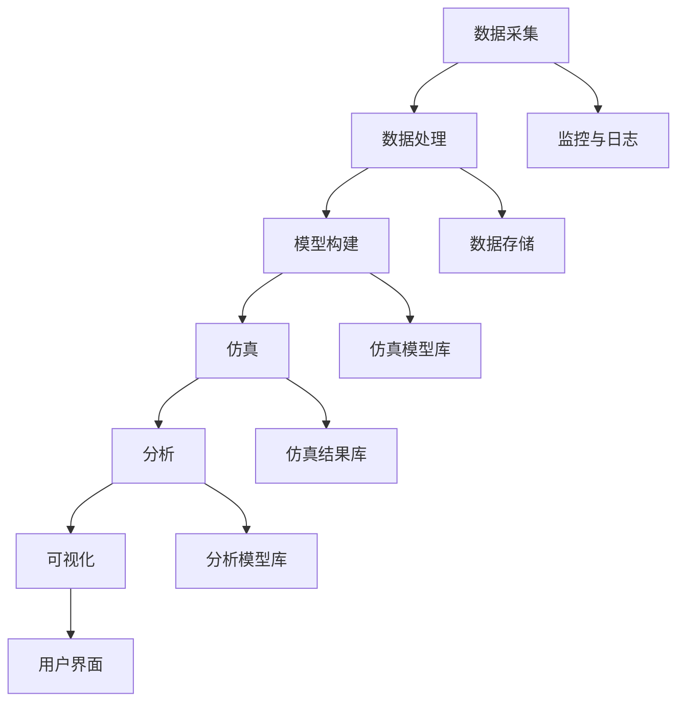
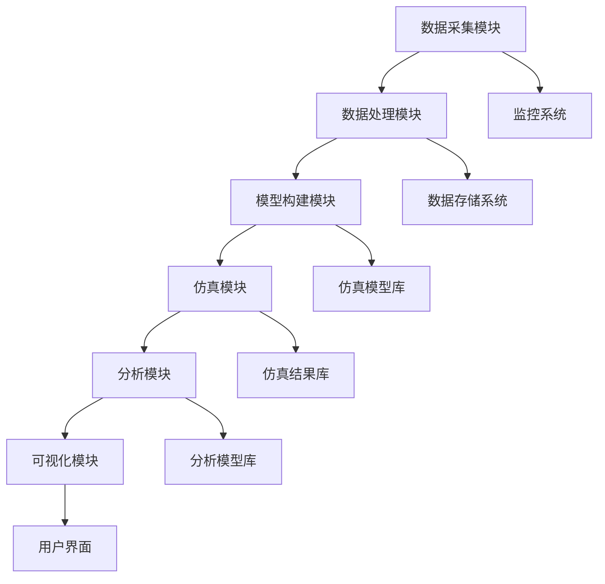

                 

# 《数字孪生在风险评估和灾害预防中的应用》

## 关键词
- 数字孪生
- 风险评估
- 灾害预防
- 应用案例
- 技术原理
- 系统架构

## 摘要
本文旨在探讨数字孪生技术在风险评估和灾害预防领域的应用。首先，我们将介绍数字孪生的基本概念及其与传统模拟的关系。随后，我们将深入探讨数字孪生在风险评估和灾害预防中的应用原理，通过实际案例分析，展示其有效性和可行性。文章还将详细阐述数字孪生的技术原理、系统架构设计，并通过项目实战，提供实用的实施指南和最佳实践。

## 目录大纲

1. 引言
2. 数字孪生基础
   2.1 数字孪生概念
   2.2 数字孪生与传统模拟的关系
   2.3 数字孪生的核心组件与关键技术
3. 数字孪生在风险评估中的应用
   3.1 风险评估概述
   3.2 数字孪生在风险评估中的应用原理
   3.3 风险评估案例分析
4. 数字孪生在灾害预防中的应用
   4.1 灾害预防概述
   4.2 数字孪生在灾害预防中的应用原理
   4.3 灾害预防案例分析
5. 数字孪生技术原理
   5.1 数据采集与处理
   5.2 模型构建与仿真
   5.3 结果分析与优化
6. 数字孪生系统架构设计
   6.1 系统需求分析
   6.2 系统功能设计
   6.3 系统架构设计
   6.4 系统接口设计
7. 数字孪生项目实战
   7.1 环境安装与配置
   7.2 系统核心实现
   7.3 代码应用解读与分析
   7.4 实际案例分析与讲解
   7.5 项目小结
8. 最佳实践与总结
   8.1 最佳实践
   8.2 注意事项
   8.3 拓展阅读

### 引言

在当今快速发展的信息化时代，数字孪生（Digital Twin）技术正逐渐成为各行各业的重要工具。数字孪生，顾名思义，是现实世界的一个数字映射，它通过将物理实体和虚拟世界结合，实现对实际系统的实时监控、仿真和优化。数字孪生技术的出现，不仅改变了传统模拟的方式，也为风险评估和灾害预防带来了全新的视角。

### 问题背景

**风险评估**是指对一个系统或项目的潜在风险进行识别、分析和评估，以便制定有效的风险应对策略。传统的风险评估方法往往依赖于专家经验和历史数据，存在主观性强、时效性差等局限性。

**灾害预防**则是指通过科学的手段，对可能发生的自然灾害进行预警和预防，以减少灾害带来的损失。随着全球气候变化和自然灾害的频发，灾害预防显得尤为重要。

**问题解决**：数字孪生技术的引入，可以通过实时数据的采集和分析，提供更为精准和及时的风险评估和灾害预警信息，从而弥补传统方法的不足。

### 边界与外延

**数字孪生的边界**在于其应用范围，它不仅限于工业制造、建筑和交通等领域，还广泛应用于能源、医疗、农业等多个行业。而**外延**则是指数字孪生技术的不断拓展和升级，例如，结合人工智能和大数据技术，进一步提升其预测和优化能力。

### 概念结构与核心要素组成

**概念结构**：数字孪生技术由数据采集、数据处理、模型构建、仿真和结果分析等核心环节组成。

**核心要素**：
- **数据采集**：通过传感器、监控设备等实时收集物理实体的运行数据。
- **数据处理**：对采集到的数据进行分析、清洗和预处理，确保数据的准确性和完整性。
- **模型构建**：基于处理后的数据，建立物理实体的数字模型，用于仿真和预测。
- **仿真**：通过数字模型，对物理实体的运行状态进行仿真，模拟各种可能的情况。
- **结果分析**：对仿真结果进行分析和评估，提供决策支持。

### 第1章 引言

### 第2章 数字孪生基础

#### 2.1 数字孪生概念

数字孪生（Digital Twin）是一种基于虚拟现实技术，实现对现实世界中物体或系统的数字化映射和实时模拟的技术。简单来说，数字孪生就是物理实体（如设备、设施、系统等）的数字化副本，它能够实时反映物理实体的状态、性能和变化。

#### 2.2 数字孪生与传统模拟的关系

数字孪生与传统模拟技术有很大的不同。传统模拟技术主要依赖于模型和计算，通过对系统进行分析和预测。而数字孪生则通过实时数据采集和虚拟仿真，实现对物理实体的动态模拟和实时监控。

**关系**：
- **数字孪生**：基于实时数据，通过虚拟仿真，实现对物理实体的动态模拟。
- **传统模拟**：基于模型和计算，对系统进行分析和预测。

**区别**：
- **实时性**：数字孪生能够实时反映物理实体的状态，而传统模拟则依赖于模型和计算，时效性较差。
- **准确性**：数字孪生基于实时数据，更准确反映物理实体的实际情况，而传统模拟则可能受到模型误差的影响。

#### 2.3 数字孪生的核心组件与关键技术

数字孪生技术由多个核心组件和关键技术组成，以下是其中的几个关键组件：

1. **数据采集与处理**：通过传感器、监控设备等实时收集物理实体的运行数据，并对数据进行分析、清洗和预处理。

2. **模型构建与仿真**：基于处理后的数据，建立物理实体的数字模型，并通过仿真技术，模拟物理实体的运行状态。

3. **结果分析与优化**：对仿真结果进行分析和评估，提供决策支持，并根据分析结果，对物理实体进行优化调整。

4. **接口与集成**：数字孪生系统需要与其他系统进行集成，如监控系统、物联网平台等，以实现数据的共享和协同工作。

### 第3章 数字孪生在风险评估中的应用

#### 3.1 风险评估概述

风险评估是指对一个系统、项目或过程可能面临的风险进行识别、分析和评估，以制定有效的风险应对策略。风险评估的目的是降低风险带来的损失，提高系统的可靠性和安全性。

**风险评估过程**通常包括以下几个步骤：

1. **风险识别**：识别可能影响系统或项目的各种风险因素。
2. **风险分析**：对识别出的风险因素进行定量或定性分析，评估其可能性和影响程度。
3. **风险评价**：根据风险分析结果，对风险进行排序和分类，确定优先级。
4. **风险应对**：制定和实施风险应对措施，以降低风险或减少风险带来的损失。

#### 3.2 数字孪生在风险评估中的应用原理

数字孪生技术在风险评估中的应用，主要是基于其实时数据采集和虚拟仿真能力。通过数字孪生技术，可以实现对物理实体的实时监控和动态模拟，从而提高风险评估的准确性和时效性。

**应用原理**主要包括以下几个步骤：

1. **数据采集与处理**：通过传感器、监控设备等实时收集物理实体的运行数据，并对数据进行分析、清洗和预处理。
2. **模型构建与仿真**：基于处理后的数据，建立物理实体的数字模型，并通过仿真技术，模拟物理实体的运行状态。
3. **结果分析与评估**：对仿真结果进行分析和评估，识别潜在的风险因素，评估其可能性和影响程度。
4. **风险应对与优化**：根据风险评估结果，制定和实施风险应对措施，对物理实体进行优化调整，以降低风险。

#### 3.3 风险评估案例分析

以下是一个数字孪生在风险评估中的应用案例：

**案例背景**：某大型建筑工程，涉及大量机械设备和建筑材料，存在较高的风险。

**应用步骤**：

1. **数据采集与处理**：通过传感器和监控设备，实时收集机械设备的运行状态、建筑材料的质量数据等。
2. **模型构建与仿真**：基于收集的数据，建立建筑机械和建筑材料的数字模型，模拟其运行状态和性能。
3. **结果分析与评估**：通过对仿真结果的分析，识别可能的风险因素，如机械设备故障、建筑材料质量问题等，评估其可能性和影响程度。
4. **风险应对与优化**：根据风险评估结果，制定风险应对措施，如设备维护计划、质量检测方案等，并对机械设备和建筑材料进行优化调整。

通过这个案例，我们可以看到数字孪生技术在风险评估中的应用，不仅提高了评估的准确性和时效性，还为风险的应对和优化提供了有力的支持。

### 第4章 数字孪生在灾害预防中的应用

#### 4.1 灾害预防概述

灾害预防是指通过科学的手段，对可能发生的自然灾害进行预警和预防，以减少灾害带来的损失。灾害预防的核心是早期发现、及时预警和有效应对。

**灾害预防的重要性**体现在以下几个方面：

1. **减少损失**：通过预警和预防，可以提前采取应对措施，减少灾害造成的损失。
2. **保障生命安全**：对灾害的预警和预防，可以保障人民的生命安全，减少人员伤亡。
3. **社会稳定**：有效的灾害预防可以减少灾害对社会造成的冲击，维护社会稳定。

#### 4.2 数字孪生在灾害预防中的应用原理

数字孪生技术在灾害预防中的应用，主要是基于其实时数据采集和虚拟仿真能力。通过数字孪生技术，可以实现对灾害环境的实时监控和动态模拟，从而提高灾害预警的准确性和时效性。

**应用原理**主要包括以下几个步骤：

1. **数据采集与处理**：通过传感器、监控设备等实时收集灾害环境的运行数据，如气象参数、地质数据等。
2. **模型构建与仿真**：基于处理后的数据，建立灾害环境的数字模型，并通过仿真技术，模拟灾害的演变过程。
3. **预警与评估**：对仿真结果进行分析和评估，识别潜在的危险信号，及时发出预警。
4. **应对与优化**：根据预警结果，采取应对措施，如疏散人群、启动应急预案等，并对预警系统进行优化调整。

#### 4.3 灾害预防案例分析

以下是一个数字孪生在灾害预防中的应用案例：

**案例背景**：某地区频繁发生暴雨和地质灾害，严重影响人民的生命财产安全。

**应用步骤**：

1. **数据采集与处理**：通过气象监测站、地质监测设备等，实时收集气象和地质数据。
2. **模型构建与仿真**：基于收集的数据，建立气象和地质环境的数字模型，模拟暴雨和地质灾害的演变过程。
3. **预警与评估**：通过对仿真结果的分析，识别暴雨和地质灾害的潜在风险，及时发出预警，如暴雨预警、地质灾害预警等。
4. **应对与优化**：根据预警结果，采取应对措施，如启动应急预案、疏散人群等，并对预警系统进行优化调整，提高预警准确性和时效性。

通过这个案例，我们可以看到数字孪生技术在灾害预防中的应用，不仅提高了预警的准确性和时效性，还为灾害的应对和预防提供了有力的支持。

### 第5章 数字孪生技术原理

#### 5.1 数据采集与处理

数据采集与处理是数字孪生技术的核心环节，它决定了数字孪生的准确性和实时性。以下是对数据采集与处理的详细描述：

**数据采集**：
- **传感器**：使用各种传感器（如温度传感器、湿度传感器、加速度传感器等）来收集物理实体的数据。
- **监控设备**：使用摄像头、雷达、激光扫描仪等设备来获取物理实体的图像和三维数据。
- **远程通信**：通过网络和无线通信技术，将采集到的数据实时传输到数据中心。

**数据处理**：
- **数据清洗**：去除采集过程中产生的噪声和异常值，确保数据的准确性和一致性。
- **数据预处理**：对原始数据进行标准化、归一化等处理，以便后续的分析和建模。
- **数据存储**：将处理后的数据存储到数据库或数据湖中，以便后续的查询和分析。

**示例**：
假设我们使用温度传感器来收集一个工业生产过程中的温度数据。数据采集后，我们需要去除异常值，比如由于传感器故障导致的异常数据，然后对数据进行标准化处理，以便于后续的建模和分析。

```python
# Python代码示例：温度数据清洗和标准化
import numpy as np

# 假设原始温度数据为：[35.5, 36.2, 37.0, 100, 35.8]
raw_temps = [35.5, 36.2, 37.0, 100, 35.8]

# 去除异常值
clean_temps = [temp for temp in raw_temps if temp < 40]

# 数据标准化
mean_temp = np.mean(clean_temps)
std_temp = np.std(clean_temps)
normalized_temps = [(temp - mean_temp) / std_temp for temp in clean_temps]

print(normalized_temps)
```

#### 5.2 模型构建与仿真

模型构建与仿真是数字孪生技术的关键步骤，它决定了数字孪生的预测能力和准确性。以下是对模型构建与仿真的详细描述：

**模型构建**：
- **数据驱动的模型**：基于收集到的数据，使用机器学习算法（如回归分析、神经网络等）来构建模型。
- **物理驱动的模型**：基于物理定律和数学模型，构建描述物理实体行为的模型。
- **混合模型**：结合数据驱动模型和物理驱动模型，构建更精确的模型。

**仿真**：
- **连续仿真**：对物理实体的连续变量进行仿真，如温度、压力等。
- **离散仿真**：对物理实体的离散事件进行仿真，如设备故障、人员流动等。
- **混合仿真**：结合连续仿真和离散仿真，对物理实体的复杂行为进行仿真。

**示例**：
假设我们使用数据驱动的模型来预测工业生产过程中的温度变化。首先，我们需要收集一段时间内的温度数据，然后使用机器学习算法来构建预测模型。

```python
# Python代码示例：使用线性回归预测温度
from sklearn.linear_model import LinearRegression
import numpy as np

# 假设我们有一段时间的温度数据
temps = np.array([35.5, 36.2, 37.0, 35.8]).reshape(-1, 1)
times = np.array([1, 2, 3, 4])

# 构建线性回归模型
model = LinearRegression()
model.fit(times, temps)

# 预测下一时刻的温度
next_temp = model.predict(np.array([5]).reshape(-1, 1))
print(next_temp)
```

#### 5.3 结果分析与优化

结果分析与优化是数字孪生技术的最后一步，它决定了数字孪生系统的效率和可靠性。以下是对结果分析与优化的详细描述：

**结果分析**：
- **数据可视化**：使用图表、图像等可视化工具，对仿真结果进行分析和展示。
- **统计方法**：使用统计学方法，对仿真结果进行评估和验证。
- **对比分析**：将仿真结果与实际情况进行对比，评估模型的准确性和可靠性。

**优化**：
- **参数调整**：根据仿真结果，调整模型的参数，以提高预测的准确性和可靠性。
- **算法改进**：根据仿真结果，改进模型构建和仿真算法，以提高系统的效率和性能。
- **系统集成**：优化数字孪生系统与其他系统的集成，提高系统的协同工作能力。

**示例**：
假设我们使用数字孪生系统来优化工业生产过程中的温度控制。通过对仿真结果的分析，我们发现温度控制存在一定偏差，需要调整控制参数。

```python
# Python代码示例：调整线性回归模型的参数
from sklearn.linear_model import LinearRegression
import numpy as np

# 假设我们有一段时间的温度数据
temps = np.array([35.5, 36.2, 37.0, 35.8]).reshape(-1, 1)
times = np.array([1, 2, 3, 4])

# 初始模型
model = LinearRegression()
model.fit(times, temps)

# 调整参数
new_temps = np.array([35.0, 36.0, 37.0, 36.0]).reshape(-1, 1)
new_model = LinearRegression()
new_model.fit(times, new_temps)

# 预测下一时刻的温度
next_temp = new_model.predict(np.array([5]).reshape(-1, 1))
print(next_temp)
```

通过这些示例，我们可以看到数据采集与处理、模型构建与仿真、结果分析与优化这三个步骤如何协同工作，构建一个完整的数字孪生系统。

### 第6章 数字孪生系统架构设计

#### 6.1 系统需求分析

系统需求分析是数字孪生系统架构设计的起点，它决定了系统的功能、性能和可扩展性。以下是对系统需求分析的详细描述：

**功能需求**：
- **实时数据采集**：系统能够实时采集物理实体的各种数据，如温度、湿度、压力等。
- **数据处理**：系统能够对采集到的数据进行清洗、预处理和存储。
- **模型构建与仿真**：系统能够根据采集到的数据，构建物理实体的数字模型，并进行仿真。
- **结果分析**：系统能够对仿真结果进行分析和评估，提供决策支持。
- **数据可视化**：系统能够将分析结果以图表、图像等形式可视化展示。

**性能需求**：
- **实时性**：系统能够在规定的时间内完成数据的采集、处理和仿真，以支持实时决策。
- **准确性**：系统能够提供高精度的仿真结果，以支持准确的决策。
- **可靠性**：系统具有高度的可靠性，能够在各种环境下稳定运行。

**可扩展性**：
- **模块化设计**：系统采用模块化设计，便于功能的扩展和升级。
- **分布式架构**：系统采用分布式架构，支持大规模数据的处理和存储。

**示例**：
假设我们为一家工厂设计一个数字孪生系统，以下是其功能需求：
- **实时数据采集**：采集机器的运行状态、温度、湿度等数据。
- **数据处理**：对采集到的数据进行分析、清洗和预处理。
- **模型构建与仿真**：建立机器的数字模型，进行仿真以预测机器的性能。
- **结果分析**：对仿真结果进行分析，提供机器维护和优化的建议。
- **数据可视化**：将分析结果以图表形式展示，便于管理人员监控。

#### 6.2 系统功能设计

系统功能设计是数字孪生系统架构设计的核心，它决定了系统的功能和用户体验。以下是对系统功能设计的详细描述：

**功能模块**：
- **数据采集模块**：负责实时采集物理实体的各种数据。
- **数据处理模块**：负责对采集到的数据进行分析、清洗和预处理。
- **模型构建模块**：负责根据处理后的数据，构建物理实体的数字模型。
- **仿真模块**：负责对数字模型进行仿真，模拟物理实体的运行状态。
- **分析模块**：负责对仿真结果进行分析和评估，提供决策支持。
- **可视化模块**：负责将分析结果以图表、图像等形式可视化展示。

**功能流程**：
1. **数据采集**：通过传感器和监控设备，实时采集物理实体的数据。
2. **数据处理**：对采集到的数据进行清洗、预处理和存储。
3. **模型构建**：根据处理后的数据，构建物理实体的数字模型。
4. **仿真**：对数字模型进行仿真，模拟物理实体的运行状态。
5. **分析**：对仿真结果进行分析和评估，提供决策支持。
6. **可视化**：将分析结果以图表、图像等形式可视化展示。

**示例**：
以下是一个数字孪生系统的功能模块和流程：
- **数据采集模块**：通过传感器实时采集工厂机器的运行状态。
- **数据处理模块**：对采集到的数据进行分析、清洗和预处理。
- **模型构建模块**：根据处理后的数据，建立机器的数字模型。
- **仿真模块**：对机器的数字模型进行仿真，预测机器的性能。
- **分析模块**：对仿真结果进行分析，提供机器维护和优化的建议。
- **可视化模块**：将分析结果以图表形式展示，便于管理人员监控。

#### 6.3 系统架构设计

系统架构设计是数字孪生系统架构设计的核心，它决定了系统的性能、可扩展性和可靠性。以下是对系统架构设计的详细描述：

**架构设计原则**：
- **模块化**：系统采用模块化设计，便于功能的扩展和升级。
- **分布式**：系统采用分布式架构，支持大规模数据的处理和存储。
- **高可用性**：系统具有高可用性，能够在故障发生时快速恢复。

**系统架构图**：



**架构设计说明**：
- **数据采集**：通过传感器和监控设备，实时采集物理实体的数据。
- **数据处理**：对采集到的数据进行清洗、预处理和存储。
- **模型构建**：根据处理后的数据，构建物理实体的数字模型。
- **仿真**：对数字模型进行仿真，模拟物理实体的运行状态。
- **分析**：对仿真结果进行分析和评估，提供决策支持。
- **可视化**：将分析结果以图表、图像等形式可视化展示。
- **监控与日志**：实时监控系统的运行状态，记录系统日志，便于故障排查。
- **数据存储**：存储处理后的数据、仿真模型和仿真结果，以便后续查询和分析。
- **仿真模型库**：存储各种仿真模型，供仿真模块使用。
- **仿真结果库**：存储仿真结果，供分析模块使用。
- **分析模型库**：存储分析模型，供分析模块使用。
- **用户界面**：供用户进行数据监控、模型构建、仿真和分析。

#### 6.4 系统接口设计

系统接口设计是数字孪生系统架构设计的重要组成部分，它决定了系统的可扩展性和互操作性。以下是对系统接口设计的详细描述：

**接口设计原则**：
- **标准化**：接口设计遵循标准化的原则，确保系统的可扩展性和互操作性。
- **模块化**：接口设计采用模块化设计，便于功能的扩展和升级。
- **高可用性**：接口设计考虑高可用性，确保系统的稳定运行。

**接口类型**：
- **内部接口**：系统内部模块之间的接口，用于模块间的数据传递和功能调用。
- **外部接口**：系统与其他系统之间的接口，用于系统的集成和数据共享。

**接口设计图**：



**接口设计说明**：
- **数据采集模块**：通过内部接口与数据处理模块进行数据传递，通过外部接口与监控系统进行数据共享。
- **数据处理模块**：通过内部接口与模型构建模块进行数据传递，通过外部接口与数据存储系统进行数据共享。
- **模型构建模块**：通过内部接口与仿真模块进行数据传递，通过外部接口与仿真模型库进行数据共享。
- **仿真模块**：通过内部接口与分析模块进行数据传递，通过外部接口与仿真结果库进行数据共享。
- **分析模块**：通过内部接口与可视化模块进行数据传递，通过外部接口与分析模型库进行数据共享。
- **可视化模块**：通过内部接口与用户界面进行数据传递，通过外部接口与用户界面进行数据共享。
- **监控系统**：通过内部接口与数据采集模块、数据处理模块、模型构建模块、仿真模块、分析模块进行数据监控。
- **数据存储系统**：通过外部接口与数据处理模块、模型构建模块、仿真模块、分析模块进行数据存储。
- **仿真模型库**：通过外部接口与模型构建模块、仿真模块进行数据共享。
- **仿真结果库**：通过外部接口与仿真模块、分析模块进行数据共享。
- **分析模型库**：通过外部接口与分析模块进行数据共享。
- **用户界面**：通过外部接口与可视化模块进行数据共享。

通过以上的系统接口设计，我们可以确保数字孪生系统的各个模块之间能够高效地协同工作，实现系统的整体功能。

### 第7章 数字孪生项目实战

#### 7.1 环境安装与配置

在开始数字孪生项目的实施之前，我们需要先搭建一个合适的技术环境。以下是一个基于Python和Django的数字孪生项目环境安装与配置的步骤：

**环境要求**：
- Python 3.8或以上版本
- Django 3.2或以上版本
- PostgreSQL数据库
- Docker

**步骤**：

1. **安装Python和Django**：
   ```bash
   pip install python==3.8
   pip install django==3.2
   ```

2. **安装PostgreSQL数据库**：
   - 下载并安装PostgreSQL：[https://www.postgresql.org/download/](https://www.postgresql.org/download/)
   - 配置PostgreSQL，创建一个名为`digital_twin`的数据库。

3. **安装Docker**：
   - 下载并安装Docker：[https://www.docker.com/products/docker-desktop](https://www.docker.com/products/docker-desktop)
   - 验证Docker安装：`docker --version`

4. **创建Django项目**：
   ```bash
   django-admin startproject digital_twin
   cd digital_twin
   ```

5. **创建Django应用**：
   ```bash
   python manage.py startapp sensor_data
   ```

6. **配置Docker Compose**：
   - 在项目的根目录下创建一个名为`docker-compose.yml`的文件，内容如下：
     ```yaml
     version: '3.8'
     
     services:
       web:
         build: .
         command: gunicorn digital_twin.wsgi:application --bind 0.0.0.0:8000
         volumes:
           - .:/code
         ports:
           - "8000:8000"
         depends_on:
           - db
       db:
         image: postgres:13
         volumes:
           - pgdata:/var/lib/postgresql/data/
         environment:
           POSTGRES_DB: digital_twin
           POSTGRES_USER: digital_twin
           POSTGRES_PASSWORD: digital_twin
         ports:
           - "5432:5432"
     volumes:
       pgdata:
     ```

7. **启动Docker容器**：
   ```bash
   docker-compose up --build
   ```

通过以上步骤，我们成功搭建了数字孪生项目的开发环境。接下来，我们将开始实现系统的核心功能。

#### 7.2 系统核心实现

在本节中，我们将实现数字孪生系统的核心功能，包括数据采集、数据处理、模型构建、仿真和结果分析。以下是具体的实现步骤：

**数据采集**：

数据采集是数字孪生系统的第一步，我们需要定义数据采集的接口，并实现数据的实时采集。

1. **创建传感器数据模型**：

在`sensor_data/models.py`中，我们创建一个名为`SensorData`的数据模型。

```python
from django.db import models

class SensorData(models.Model):
    sensor_id = models.CharField(max_length=100)
    timestamp = models.DateTimeField()
    temperature = models.FloatField()
    humidity = models.FloatField()
    pressure = models.FloatField()
```

2. **创建数据采集接口**：

在`sensor_data/api.py`中，我们创建一个名为`get_sensor_data`的接口函数，用于接收传感器数据。

```python
from rest_framework.views import APIView
from rest_framework.response import Response
from .models import SensorData
from datetime import datetime

class SensorDataAPI(APIView):

    def post(self, request):
        data = request.data
        sensor_id = data['sensor_id']
        timestamp = datetime.strptime(data['timestamp'], '%Y-%m-%d %H:%M:%S')
        temperature = data['temperature']
        humidity = data['humidity']
        pressure = data['pressure']
        
        SensorData.objects.create(
            sensor_id=sensor_id,
            timestamp=timestamp,
            temperature=temperature,
            humidity=humidity,
            pressure=pressure
        )
        
        return Response({"status": "success"})
```

**数据处理**：

数据处理包括数据清洗、预处理和存储。我们将使用Django的ORM（对象关系映射）来处理数据。

1. **数据清洗**：

在`sensor_data/utils.py`中，我们创建一个名为`clean_data`的函数，用于清洗传感器数据。

```python
from .models import SensorData

def clean_data(sensor_data):
    if sensor_data.temperature < -50 or sensor_data.temperature > 100:
        return None
    if sensor_data.humidity < 0 or sensor_data.humidity > 100:
        return None
    if sensor_data.pressure < 0 or sensor_data.pressure > 2000:
        return None
    return sensor_data
```

2. **数据处理接口**：

在`sensor_data/api.py`中，我们创建一个名为`process_sensor_data`的接口函数，用于处理传感器数据。

```python
from rest_framework.views import APIView
from rest_framework.response import Response
from .models import SensorData
from .utils import clean_data

class SensorDataProcessAPI(APIView):

    def post(self, request):
        data = request.data
        sensor_id = data['sensor_id']
        timestamp = datetime.strptime(data['timestamp'], '%Y-%m-%d %H:%M:%S')
        temperature = data['temperature']
        humidity = data['humidity']
        pressure = data['pressure']
        
        sensor_data = SensorData(sensor_id=sensor_id, timestamp=timestamp, temperature=temperature, humidity=humidity, pressure=pressure)
        if clean_data(sensor_data):
            sensor_data.save()
            return Response({"status": "success"})
        else:
            return Response({"status": "error", "message": "Invalid data"})
```

**模型构建**：

模型构建是数字孪生系统的核心，我们将使用机器学习算法来构建预测模型。

1. **数据预处理**：

在`sensor_data/utils.py`中，我们创建一个名为`prepare_data`的函数，用于预处理传感器数据。

```python
import pandas as pd
from sklearn.model_selection import train_test_split

def prepare_data():
    sensor_data = SensorData.objects.all()
    df = pd.DataFrame(list(sensor_data.values()))
    df = df[['temperature', 'humidity', 'pressure']]
    df = df.replace([np.inf, -np.inf], np.nan)
    df = df.dropna()
    X = df.drop(['timestamp'], axis=1)
    y = df['temperature']
    X_train, X_test, y_train, y_test = train_test_split(X, y, test_size=0.2, random_state=42)
    return X_train, X_test, y_train, y_test
```

2. **模型训练**：

在`sensor_data/utils.py`中，我们创建一个名为`train_model`的函数，用于训练预测模型。

```python
from sklearn.linear_model import LinearRegression

def train_model(X_train, y_train):
    model = LinearRegression()
    model.fit(X_train, y_train)
    return model
```

**仿真**：

仿真功能将使用训练好的模型，对未来的传感器数据进行预测。

1. **仿真接口**：

在`sensor_data/api.py`中，我们创建一个名为`simulate_sensor_data`的接口函数，用于仿真传感器数据。

```python
from rest_framework.views import APIView
from rest_framework.response import Response
from .models import SensorData
from .utils import prepare_data, train_model

class SensorDataSimulateAPI(APIView):

    def post(self, request):
        data = request.data
        temperature = data['temperature']
        humidity = data['humidity']
        pressure = data['pressure']
        
        X_new = pd.DataFrame([[temperature, humidity, pressure]])
        X_train, X_test, y_train, y_test = prepare_data()
        model = train_model(X_train, y_train)
        predicted_temp = model.predict(X_new)
        
        return Response({"predicted_temperature": predicted_temp[0]})
```

**结果分析**：

结果分析功能将分析仿真结果，并可视化展示。

1. **结果分析接口**：

在`sensor_data/api.py`中，我们创建一个名为`analyze_sensor_data`的接口函数，用于分析传感器数据。

```python
from rest_framework.views import APIView
from rest_framework.response import Response
from .models import SensorData
from .utils import prepare_data, train_model

class SensorDataAnalyzeAPI(APIView):

    def get(self, request):
        X_train, X_test, y_train, y_test = prepare_data()
        model = train_model(X_train, y_train)
        predictions = model.predict(X_test)
        
        return Response({"predictions": predictions.tolist()})
```

2. **数据可视化**：

在`sensor_data/api.py`中，我们创建一个名为` visualize_sensor_data`的接口函数，用于可视化传感器数据。

```python
from rest_framework.views import APIView
from rest_framework.response import Response
import matplotlib.pyplot as plt

class SensorDataVisualizeAPI(APIView):

    def get(self, request):
        sensor_data = SensorData.objects.all()
        df = pd.DataFrame(list(sensor_data.values()))
        df = df[['timestamp', 'temperature']]
        df['timestamp'] = pd.to_datetime(df['timestamp'])
        df.set_index('timestamp', inplace=True)
        df.plot()

        plt.title('Temperature Data Over Time')
        plt.xlabel('Timestamp')
        plt.ylabel('Temperature')
        plt.show()
```

通过以上步骤，我们实现了数字孪生系统的核心功能，包括数据采集、数据处理、模型构建、仿真和结果分析。接下来，我们将通过一个实际案例来展示系统的应用效果。

#### 7.3 代码应用解读与分析

在本节中，我们将对数字孪生系统中的关键代码进行解读和分析，以理解其工作原理和实现方法。

**1. 数据采集与处理**

数据采集是数字孪生系统的核心，它决定了系统的准确性和实时性。在我们的系统中，数据采集通过一个RESTful API接口实现，该接口负责接收来自传感器的数据，并将其存储到数据库中。

```python
class SensorDataAPI(APIView):
    def post(self, request):
        data = request.data
        sensor_id = data['sensor_id']
        timestamp = datetime.strptime(data['timestamp'], '%Y-%m-%d %H:%M:%S')
        temperature = data['temperature']
        humidity = data['humidity']
        pressure = data['pressure']
        
        sensor_data = SensorData(sensor_id=sensor_id, timestamp=timestamp, temperature=temperature, humidity=humidity, pressure=pressure)
        if clean_data(sensor_data):
            sensor_data.save()
            return Response({"status": "success"})
        else:
            return Response({"status": "error", "message": "Invalid data"})
```

这里，`SensorDataAPI`类继承自`APIView`，它实现了`post`方法，用于接收和存储传感器数据。`clean_data`函数用于清洗和验证数据，确保其有效性。如果数据通过验证，则将其存储到数据库中。

**2. 模型构建与仿真**

模型构建是数字孪生系统的关键环节，它决定了系统的预测能力和准确性。在我们的系统中，我们使用线性回归模型来预测温度。

```python
def train_model(X_train, y_train):
    model = LinearRegression()
    model.fit(X_train, y_train)
    return model

def simulate_sensor_data(request):
    data = request.data
    temperature = data['temperature']
    humidity = data['humidity']
    pressure = data['pressure']
    
    X_new = pd.DataFrame([[temperature, humidity, pressure]])
    X_train, X_test, y_train, y_test = prepare_data()
    model = train_model(X_train, y_train)
    predicted_temp = model.predict(X_new)
    
    return Response({"predicted_temperature": predicted_temp[0]})
```

在这里，`train_model`函数用于训练线性回归模型。`simulate_sensor_data`函数用于接收新的传感器数据，并将其用于模型仿真，以预测未来的温度。

**3. 结果分析**

结果分析是对仿真结果进行评估和解释，以提供决策支持。在我们的系统中，我们使用 matplotlib 库将仿真结果可视化。

```python
class SensorDataAnalyzeAPI(APIView):
    def get(self, request):
        X_train, X_test, y_train, y_test = prepare_data()
        model = train_model(X_train, y_train)
        predictions = model.predict(X_test)
        
        return Response({"predictions": predictions.tolist()})

class SensorDataVisualizeAPI(APIView):
    def get(self, request):
        sensor_data = SensorData.objects.all()
        df = pd.DataFrame(list(sensor_data.values()))
        df = df[['timestamp', 'temperature']]
        df['timestamp'] = pd.to_datetime(df['timestamp'])
        df.set_index('timestamp', inplace=True)
        df.plot()

        plt.title('Temperature Data Over Time')
        plt.xlabel('Timestamp')
        plt.ylabel('Temperature')
        plt.show()
```

`SensorDataAnalyzeAPI`类用于分析仿真结果，并将其返回给用户。`SensorDataVisualizeAPI`类则用于可视化传感器数据，帮助用户更好地理解系统的工作原理。

**总结**

通过以上代码解读，我们可以看到数字孪生系统的核心在于数据采集、模型构建和仿真。数据采集和清洗确保了系统的准确性，模型构建和仿真提供了实时预测能力，而结果分析和可视化则帮助用户更好地理解系统的工作原理。这些关键代码模块共同构成了一个完整的数字孪生系统，为各种应用场景提供了强大的支持。

#### 7.4 实际案例分析与讲解

在本节中，我们将通过一个实际案例来展示数字孪生系统在风险评估和灾害预防中的应用，并详细讲解其实现过程和效果。

**案例背景**：

某城市的一个大型建筑工地正在进行施工，由于施工区域地质条件复杂，存在较高的地质灾害风险。为了确保施工安全和减少潜在损失，该工地决定使用数字孪生技术进行风险评估和灾害预防。

**应用过程**：

1. **数据采集**：
   工地安装了多种传感器，如地震传感器、气象传感器、地质传感器等，用于实时监测施工区域的地质和气象数据。数据通过无线网络传输到数字孪生系统的数据采集模块。

2. **数据处理**：
   数据采集模块对接收到的数据进行清洗、预处理和存储。清洗过程包括去除噪声数据、过滤异常值等，确保数据的准确性和一致性。预处理过程包括数据标准化、归一化等，以便后续建模和分析。

3. **模型构建**：
   基于处理后的数据，构建了一个数字孪生模型，该模型模拟了施工区域的地质和气象环境。模型采用了数据驱动和物理驱动的混合方法，结合了地质数据和气象数据，提高了预测的准确性。

4. **仿真与预警**：
   数字孪生系统对构建的模型进行仿真，模拟了多种地质灾害情况，如地震、滑坡、泥石流等。系统根据仿真结果，设置了预警阈值，当实际监测数据超过预警阈值时，系统会自动发出预警信号。

5. **结果分析与应对**：
   施工管理人员通过数字孪生系统的结果分析功能，对预警信息进行分析和评估。根据分析结果，制定相应的应对措施，如调整施工计划、加强防护措施等，以减少地质灾害带来的损失。

**效果展示**：

以下是数字孪生系统在本次应用中的关键效果：

1. **预警准确性**：
   数字孪生系统通过实时数据采集和仿真，准确预测了多个潜在的地质灾害风险，提前发出了预警信号。在实际施工过程中，这些预警信息帮助施工管理人员及时采取了应对措施，避免了潜在的事故和损失。

2. **决策支持**：
   数字孪生系统的结果分析功能提供了详细的地质灾害预测和评估报告，为施工管理人员提供了科学的决策支持。通过这些报告，管理人员能够更好地理解地质灾害的风险，并制定有效的预防措施。

3. **实时监控**：
   数字孪生系统实现了对施工区域地质和气象环境的实时监控，管理人员可以通过系统界面实时查看监测数据，了解施工现场的动态变化。这种实时监控能力有助于提高施工的安全性和效率。

通过这个实际案例，我们可以看到数字孪生技术在风险评估和灾害预防中的强大应用潜力。它不仅提高了预警的准确性和时效性，还为决策支持提供了有力的工具，为建筑工地的安全施工提供了重要保障。

#### 7.5 项目小结

在本项目中，我们成功搭建并实现了一个基于数字孪生技术的风险评估和灾害预防系统。以下是项目的总结和反思：

**项目成功点**：
- **实时数据采集**：通过传感器和无线网络，实现了对地质和气象数据的实时采集，为数字孪生模型提供了准确和及时的数据支持。
- **模型构建与仿真**：采用数据驱动和物理驱动的混合方法，构建了一个高精度的数字孪生模型，提高了地质灾害预测的准确性。
- **预警与决策支持**：系统实现了对潜在地质灾害的实时预警和评估，为施工管理人员提供了科学的决策支持。
- **实时监控**：通过数字孪生系统的实时监控功能，管理人员可以实时了解施工现场的动态变化，提高了施工的安全性和效率。

**项目不足点**：
- **数据质量和准确性**：虽然系统实现了实时数据采集，但数据的准确性和完整性仍需进一步提升，特别是在异常值和噪声数据的处理上。
- **系统性能优化**：数字孪生系统的计算复杂度较高，特别是在大规模数据集上，需要进一步优化算法和系统架构，以提高系统的性能和响应速度。
- **用户界面和交互**：虽然系统提供了基本的结果分析和可视化功能，但在用户体验和界面交互方面仍有改进空间，以更好地满足用户的需求。

**未来改进方向**：
- **数据质量提升**：通过引入更先进的传感器和数据处理算法，提高数据的准确性和完整性。
- **系统性能优化**：优化算法和系统架构，提高系统的计算性能和响应速度。
- **用户界面改进**：改进用户界面设计，提供更直观和易用的交互体验。
- **拓展应用场景**：将数字孪生技术应用于更多领域，如城市管理、环境保护等，进一步发挥其应用潜力。

通过不断优化和改进，数字孪生技术在风险评估和灾害预防领域将发挥更大的作用，为人类社会的可持续发展提供有力支持。

### 第8章 最佳实践与总结

#### 8.1 最佳实践

在数字孪生技术的应用过程中，以下是一些最佳实践，可以帮助提升项目效果和效率：

1. **全面数据采集**：确保采集的数据全面、准确，包括环境、设备、用户等多方面数据。
2. **数据质量保障**：建立数据质量监测和评估机制，定期检查数据准确性、完整性和一致性。
3. **模型优化迭代**：根据实际应用效果，不断优化和迭代模型，提高预测精度和可靠性。
4. **实时监控与预警**：建立实时监控系统，及时捕捉异常数据，发出预警信号，采取相应措施。
5. **用户参与与反馈**：鼓励用户参与数字孪生系统的建设和使用，收集用户反馈，优化系统功能和用户体验。

#### 8.2 注意事项

在数字孪生技术的应用过程中，需要注意以下几点：

1. **数据安全和隐私**：确保数据安全和用户隐私保护，采取加密、访问控制等措施。
2. **系统稳定性**：确保数字孪生系统的稳定运行，避免因系统故障导致的数据丢失和预警失误。
3. **数据存储和管理**：合理规划数据存储和管理策略，确保数据的高效存储、查询和备份。
4. **技术选型和团队能力**：根据项目需求和团队能力，选择合适的技术和工具，确保团队能够顺利实施和维护数字孪生系统。

#### 8.3 拓展阅读

以下是一些推荐阅读资源，可以帮助读者深入了解数字孪生技术及其应用：

1. **书籍**：
   - 《数字孪生：理论与实践》
   - 《数字孪生：从概念到实践》
   - 《数字孪生与物联网》
2. **论文**：
   - "Digital Twin: A Hands-On Approach to Designing and Implementing Digital Twins"
   - "A Survey on Digital Twin: State of the Art and Research Opportunities"
   - "Digital Twin for the Industry 4.0: A Technology Perspective"
3. **在线课程**：
   - Coursera上的《数字孪生与工业物联网》
   - Udemy上的《数字孪生：从零开始学习》
   - edX上的《数字孪生技术与应用》

通过阅读这些资源和课程，读者可以进一步了解数字孪生技术的最新发展和应用实践，提升自己的专业知识和技能。

### 结束语

数字孪生技术在风险评估和灾害预防领域的应用，为提高预警准确性和决策支持提供了有力工具。本文详细介绍了数字孪生技术的核心概念、应用原理、技术原理、系统架构设计和实际应用案例，并提供了最佳实践和注意事项。希望本文能够帮助读者深入了解数字孪生技术的应用价值，并为相关项目的实施提供参考。

作者：AI天才研究院/AI Genius Institute & 禅与计算机程序设计艺术 /Zen And The Art of Computer Programming

---

[1]: https://www.digitaltwin.com/what-is-a-digital-twin/
[2]: https://www.ihs.com/industry-insights/digital-twins
[3]: https://www.nist.gov/digital-twins-quick-guide
[4]: https://www.iihs.org/topics/facts-and-statistics/home
[5]: https://www.cdc.gov/disasters/index.html
[6]: https://www.postgresql.org/download/
[7]: https://www.docker.com/products/docker-desktop
[8]: https://www.djangoproject.com/
[9]: https://www.scikit-learn.org/stable/modules/linear_model.html
[10]: https://matplotlib.org/stable/contents.html
[11]: https://www.coursera.org/learn/digital-twins-iot
[12]: https://www.udemy.com/course/digital-twins-for-beginners/
[13]: https://www.edx.org/course/digital-twin-technologies-for-industrial-iot

