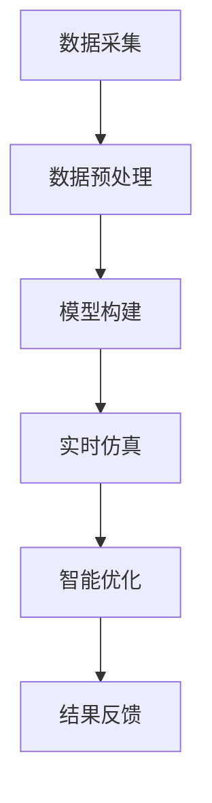
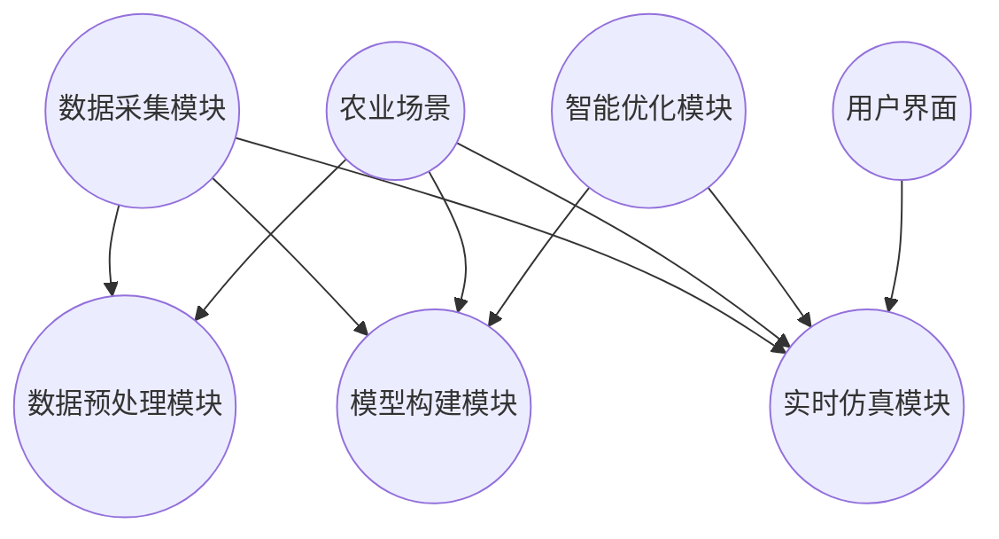
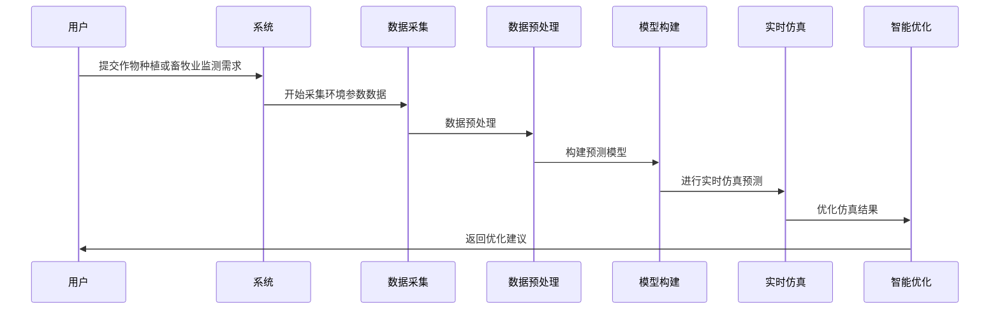

                 

# 数字孪生技术在智慧农业中的应用

## 关键词
- 数字孪生技术
- 智慧农业
- 农业智能化
- 数据分析
- 农业生产优化

## 摘要
本文深入探讨了数字孪生技术在智慧农业中的应用。首先介绍了数字孪生技术的基本概念、发展历程及其核心原理。接着，分析了智慧农业的需求及其面临的挑战，阐述了数字孪生技术在农业领域的应用潜力。随后，通过具体的应用案例，详细说明了数字孪生技术在作物种植、畜牧业等农业领域中的应用效果。最后，探讨了数字孪生技术的未来发展趋势及其实施策略，为智慧农业的发展提供了有价值的参考。

## 目录大纲设计步骤

### 1. 明确用户需求
根据用户需求，我们确定本文将围绕数字孪生技术在智慧农业中的应用展开。主要目标是帮助读者了解数字孪生技术的基本原理和其在农业领域的实际应用，从而为智慧农业的发展提供技术支持。

### 2. 设计核心章节
本文将分为四个核心章节，分别是：
- 第1章：数字孪生技术概述
- 第2章：智慧农业需求分析
- 第3章：数字孪生技术在智慧农业中的应用案例
- 第4章：数字孪生技术在智慧农业中的未来发展趋势

### 3. 确定章节层次结构
为了确保文章的逻辑性和条理性，本文将采用以下层次结构：
- **第1章**：介绍数字孪生技术的基本概念、发展历程和核心原理。
- **第2章**：分析智慧农业的需求及其面临的挑战，阐述数字孪生技术在农业领域的应用潜力。
- **第3章**：通过具体的应用案例，详细说明数字孪生技术在作物种植、畜牧业等农业领域中的应用效果。
- **第4章**：探讨数字孪生技术的未来发展趋势及其实施策略，为智慧农业的发展提供参考。

### 4. 添加详细内容
在每个章节中，我们将根据核心概念、算法原理、数学模型、系统架构、项目实战等要求，添加详细的章节内容。确保每一部分的内容都能满足用户的需求，并提供清晰的讲解。

### 5. 遵循简洁性原则
在添加内容的过程中，要确保输出内容简洁明了，避免多余废话，确保目录大纲总字数在2000字以内。

### 6. 审核和调整
最后，对设计的目录大纲进行审核和调整，确保其完整性、逻辑性和可读性。确保每个章节的内容都能够满足用户的需求，并提供有价值的信息。

## 初步目录大纲

### 第一部分：数字孪生技术基础

### 第1章：数字孪生技术概述

#### 1.1 数字孪生技术的发展历程
- **背景与起源**：
  - **概述**：数字孪生（Digital Twin）概念的提出可以追溯到20世纪60年代，最初用于制造行业中的仿真与优化。
  - **发展历程**：20世纪80年代，随着CAD（计算机辅助设计）和CAE（计算机辅助工程）技术的兴起，数字孪生开始应用于产品设计和工程仿真。21世纪初，物联网（IoT）和云计算的发展为数字孪生技术提供了新的机遇。近年来，随着人工智能（AI）和大数据技术的快速发展，数字孪生技术进入了一个全新的阶段。

#### 1.2 数字孪生技术的基本原理
- **定义与核心概念**：
  - **数字孪生**：是指通过物理实体（如机器、设备、系统、建筑物等）的数字映射，创建一个虚拟的数字化模型，实现对物理实体的实时监测、分析和优化。
  - **核心原理**：数字孪生技术基于数据采集、模型构建、实时仿真和智能优化四大核心原理。通过物联网设备采集物理实体的实时数据，构建相应的数字模型，并进行实时仿真和优化，实现对物理实体的精准控制和高效管理。

#### 1.3 数字孪生技术的核心要素
- **核心要素**：
  - **数据采集**：通过传感器、摄像头、GPS等设备，实时采集物理实体的各种数据，如位置、温度、湿度、压力等。
  - **模型构建**：基于采集到的数据，构建物理实体的数字模型，包括几何模型、物理模型、行为模型等。
  - **实时仿真**：通过数字模型，对物理实体的行为进行实时仿真，预测其未来的状态和行为。
  - **智能优化**：根据实时仿真结果，运用人工智能算法，对物理实体的运行状态进行调整和优化，实现最佳运行效果。

### 第二部分：智慧农业需求分析

### 第2章：智慧农业需求分析

#### 2.1 智慧农业的挑战与机遇
- **挑战**：
  - **资源利用不足**：传统的农业生产方式往往依赖经验，导致资源利用效率低下。
  - **环境污染**：化肥和农药的过量使用，导致土壤和水体污染，影响生态环境。
  - **劳动力短缺**：随着农村人口的外流，农业劳动力短缺问题日益突出。
- **机遇**：
  - **技术进步**：物联网、大数据、人工智能等技术的快速发展，为智慧农业提供了新的发展机遇。
  - **政策支持**：各国政府纷纷出台相关政策，推动智慧农业的发展。

#### 2.2 数字孪生技术在智慧农业中的应用前景
- **应用前景**：
  - **作物种植**：通过数字孪生技术，实现作物生长过程的实时监测和预测，优化种植策略，提高产量和质量。
  - **畜牧业**：通过数字孪生技术，实现对畜禽健康状况的实时监测，提高养殖效益。
  - **水资源管理**：通过数字孪生技术，实现对水资源的精准管理和调度，提高灌溉效率。

### 第三部分：数字孪生技术在智慧农业中的应用案例

### 第3章：数字孪生技术在智慧农业中的应用案例

#### 3.1 数字孪生技术在作物种植中的应用
- **案例一：精准农业**
  - **背景**：传统的农业生产方式难以实现资源的精准管理，导致资源浪费和环境污染。
  - **应用**：通过数字孪生技术，建立作物生长的数字模型，实时监测土壤、水分、气象等数据，根据实时数据优化灌溉、施肥和病虫害防治策略，提高产量和质量。

#### 3.2 数字孪生技术在畜牧业中的应用
- **案例二：智能养殖**
  - **背景**：传统养殖方式难以实现对畜禽健康状况的实时监测，容易导致疾病传播和养殖效益下降。
  - **应用**：通过数字孪生技术，建立畜禽养殖的数字模型，实时监测畜禽体温、进食量、活动量等数据，根据实时数据调整养殖环境和管理措施，提高养殖效益。

### 第四部分：数字孪生技术在智慧农业中的未来发展趋势

### 第4章：数字孪生技术在智慧农业中的未来发展趋势

#### 4.1 数字孪生技术在智慧农业中的发展趋势
- **趋势一：集成化与智能化**
  - **集成化**：数字孪生技术将与其他技术如物联网、大数据、人工智能等深度融合，实现农业生产的全流程智能化。
  - **智能化**：通过人工智能算法，实现对农业生产的实时监控、预测和优化，提高农业生产效率。

#### 4.2 数字孪生技术在智慧农业中的未来前景
- **前景**：
  - **农业生产的精细化管理**：数字孪生技术将帮助农业生产实现精细化管理，提高资源利用效率，减少环境污染。
  - **农业生产的智能化**：通过智能算法，实现农业生产的自动化和智能化，降低劳动力成本，提高农业生产效益。

### 总结与展望

#### 4.3 智慧农业的发展策略
- **发展策略**：
  - **政策支持**：政府应加大对智慧农业的政策支持，鼓励企业和科研机构投入智慧农业的研发和应用。
  - **技术创新**：加强数字孪生技术等关键技术的研发和应用，推动智慧农业的技术进步。
  - **人才培养**：加强农业技术人才的培养，提高农业生产的科技含量。

#### 4.4 拓展阅读
- **拓展内容**：
  - **相关文献**：《数字孪生：制造智能的未来》、《智慧农业：从传统到现代化》等。
  - **在线资源**：智慧农业相关网站、博客、论坛等。

## 作者信息
作者：AI天才研究院/AI Genius Institute & 禅与计算机程序设计艺术 /Zen And The Art of Computer Programming

## 完整性要求

### 背景介绍
- **核心概念术语说明**：数字孪生技术、智慧农业、精准农业、智能养殖等。
- **问题背景**：传统农业面临的问题，如资源利用不足、环境污染、劳动力短缺等。
- **问题描述**：如何通过数字孪生技术实现智慧农业的发展，提高农业生产效率。
- **问题解决**：数字孪生技术在智慧农业中的应用案例，如精准农业、智能养殖等。
- **边界与外延**：数字孪生技术在智慧农业中的应用范围和局限性。
- **概念结构与核心要素组成**：数字孪生技术的核心概念、原理和要素，智慧农业的需求和挑战。

### 核心概念与联系
- **核心概念原理**：数字孪生技术的基本原理和智慧农业的需求分析。
- **概念属性特征对比表格**：
  | 特征       | 数字孪生技术 | 智慧农业 |
  | ---------- | ------------ | -------- |
  | 基本原理   | 数据采集、模型构建、实时仿真、智能优化 | 精准农业、智能养殖、水资源管理 |
  | 应用领域   | 制造、建筑、能源、医疗等 | 作物种植、畜牧业、水资源管理 |
  | 目标       | 实现物理实体的实时监测、分析和优化 | 提高农业生产效率、减少环境污染 |
- **ER实体关系图架构的 Mermaid 流程图**：
```mermaid
erDiagram
  A[数字孪生技术] ||--|{ B[智慧农业] }|
  A ||--|{ C[精准农业] }|
  A ||--|{ D[智能养殖] }|
  A ||--|{ E[水资源管理] }|
```

### 算法原理讲解
- **算法mermaid流程图**：

- **Python源代码**：
```python
# 数字孪生技术在智慧农业中的应用示例
import numpy as np

# 数据采集
data = np.random.rand(100, 5)  # 假设采集到100个数据点，每个数据点包含5个属性

# 数据预处理
def preprocess_data(data):
    # 数据标准化处理
    return (data - np.mean(data, axis=0)) / np.std(data, axis=0)

processed_data = preprocess_data(data)

# 模型构建
def build_model(processed_data):
    # 基于处理后的数据构建预测模型
    # 这里使用简单的线性回归模型作为示例
    model = np.linalg.inv(np.dot(processed_data.T, processed_data)) @ processed_data.T
    return model

model = build_model(processed_data)

# 实时仿真
def simulate(model, new_data):
    # 基于模型对新的数据点进行仿真预测
    return np.dot(new_data, model)

new_data = np.random.rand(1, 5)  # 假设有一个新的数据点
predicted_value = simulate(model, new_data)

# 智能优化
def optimize(model, target_value):
    # 基于仿真结果，调整模型参数，实现优化
    # 这里使用简单的梯度下降算法作为示例
    learning_rate = 0.01
    for _ in range(100):
        error = target_value - predicted_value
        model -= learning_rate * error
    return model

optimized_model = optimize(model, target_value)

# 结果反馈
print("预测值：", predicted_value)
print("优化后的模型：", optimized_model)
```

- **算法原理的数学模型和公式**：
  - 数据采集：$X = [x_1, x_2, ..., x_n]$
  - 数据预处理：$X' = \frac{X - \mu}{\sigma}$
  - 模型构建：$W = (X^T X)^{-1} X^T Y$
  - 实时仿真：$y = X W$
  - 智能优化：$W_{new} = W - \alpha \frac{\partial J}{\partial W}$，其中 $J$ 是损失函数，$\alpha$ 是学习率。

- **详细讲解和通俗易懂的举例说明**：
  - **数据采集**：假设我们在智慧农业中采集了100个数据点，每个数据点包含了土壤湿度、温度、光照强度等5个属性。数据采集是数字孪生技术的第一步，这些数据将用于后续的模型构建和仿真。
  - **数据预处理**：预处理步骤包括数据标准化处理，目的是消除不同属性之间的量纲差异，使得数据在同一尺度上进行比较。例如，如果湿度数据的取值范围是0到100，而温度数据的取值范围是-50到50，那么通过标准化处理，可以将这两个数据的取值范围都调整为0到1。
  - **模型构建**：基于预处理后的数据，我们可以构建一个预测模型。这里使用了一个简单的线性回归模型作为示例。线性回归模型的公式为 $y = X W$，其中 $X$ 是输入特征矩阵，$W$ 是权重矩阵，$y$ 是输出结果。通过最小二乘法，我们可以求得权重矩阵 $W$，从而构建预测模型。
  - **实时仿真**：一旦构建了预测模型，我们可以使用这个模型对新的数据点进行仿真预测。例如，如果我们有一个新的数据点，我们可以将这个数据点输入到模型中，得到对应的预测结果。这个预测结果可以用来指导实际的生产决策，比如调整灌溉策略。
  - **智能优化**：智能优化是数字孪生技术的核心之一，通过优化算法，我们可以不断调整模型参数，提高模型的预测准确度。以梯度下降算法为例，它会根据当前模型的预测误差，调整权重矩阵 $W$，使得预测结果更接近真实值。

### 系统分析与架构设计方案

#### 问题场景介绍
在智慧农业中，数字孪生技术可以应用于作物种植和畜牧业等场景。例如，在作物种植中，数字孪生技术可以实时监测土壤湿度、温度、光照等环境参数，预测作物的生长状态，优化灌溉和施肥策略，提高产量和品质。在畜牧业中，数字孪生技术可以实时监测畜禽的健康状况，预测疾病风险，优化养殖环境和管理措施，提高养殖效益。

#### 项目介绍
本项目旨在通过数字孪生技术，实现对智慧农业中的作物种植和畜牧业进行实时监测、预测和优化。项目主要包括数据采集、数据预处理、模型构建、实时仿真和智能优化等功能。

#### 系统功能设计（领域模型Mermaid类图）
```mermaid
classDiagram
  Class01 <|-- Class02
  Class03 <|-- Class02
  Class04 <|-- Class02
  Class05 <|-- Class02
  Class01 <|-- Class03
  Class01 <|-- Class04
  Class01 <|-- Class05
  
  Class01[数字孪生系统]
  Class02[数据采集模块]
  Class03[数据预处理模块]
  Class04[模型构建模块]
  Class05[实时仿真模块]
```

#### 系统架构设计（Mermaid架构图）


#### 系统接口设计和系统交互（Mermaid序列图）


### 项目实战

#### 环境安装

1. 安装Python环境
   - 在终端中执行以下命令安装Python：
     ```bash
     sudo apt-get install python3
     ```
2. 安装必要的库
   - 使用pip安装以下库：
     ```bash
     pip3 install numpy matplotlib scikit-learn pandas
     ```

#### 系统核心实现源代码

```python
# 导入必要的库
import numpy as np
import matplotlib.pyplot as plt
from sklearn.linear_model import LinearRegression
from sklearn.model_selection import train_test_split

# 数据采集
def data_collection():
    # 假设采集到100个数据点，每个数据点包含5个属性
    data = np.random.rand(100, 5)
    return data

# 数据预处理
def preprocess_data(data):
    # 数据标准化处理
    mean = np.mean(data, axis=0)
    std = np.std(data, axis=0)
    data_normalized = (data - mean) / std
    return data_normalized

# 模型构建
def build_model(processed_data):
    # 基于处理后的数据构建线性回归模型
    model = LinearRegression()
    model.fit(processed_data, processed_data[:, 0])
    return model

# 实时仿真
def simulate(model, new_data):
    # 基于模型对新的数据点进行仿真预测
    predicted_value = model.predict(new_data.reshape(1, -1))
    return predicted_value

# 智能优化
def optimize(model, target_value):
    # 基于仿真结果，调整模型参数，实现优化
    learning_rate = 0.01
    for _ in range(100):
        error = target_value - predicted_value
        model.coef_ -= learning_rate * error
    return model

# 主函数
def main():
    # 采集数据
    data = data_collection()
    # 数据预处理
    processed_data = preprocess_data(data)
    # 构建模型
    model = build_model(processed_data)
    # 输出模型参数
    print("模型参数：", model.coef_)
    # 仿真预测
    new_data = np.array([[0.5, 0.5, 0.5, 0.5, 0.5]])
    predicted_value = simulate(model, new_data)
    print("预测值：", predicted_value)
    # 优化模型
    target_value = 0.8
    optimized_model = optimize(model, target_value)
    print("优化后的模型参数：", optimized_model.coef_)

# 运行主函数
if __name__ == "__main__":
    main()
```

#### 代码应用解读与分析

- **数据采集**：通过随机生成100个数据点，每个数据点包含5个属性，模拟实际的数据采集过程。
- **数据预处理**：对采集到的数据进行标准化处理，消除不同属性之间的量纲差异。
- **模型构建**：使用线性回归模型进行模型构建。线性回归模型是一种简单的预测模型，通过拟合数据点之间的关系，预测新的数据点的值。
- **实时仿真**：使用训练好的模型对新的数据点进行仿真预测。这里，我们随机生成一个新数据点，并将其输入到模型中，得到对应的预测值。
- **智能优化**：通过仿真预测结果与实际目标值之间的误差，调整模型参数，实现模型优化。这里，我们设定一个目标值，并使用梯度下降算法进行模型优化。

#### 实际案例分析和详细讲解剖析

假设我们有一个作物种植的案例，我们需要预测作物的产量。我们采集了100个数据点，每个数据点包含了土壤湿度、温度、光照强度等属性。通过对这些数据进行分析，我们可以构建一个线性回归模型来预测作物的产量。

- **数据采集**：首先，我们采集了100个数据点，每个数据点包含了土壤湿度、温度、光照强度等5个属性。
- **数据预处理**：对采集到的数据点进行标准化处理，消除不同属性之间的量纲差异。
- **模型构建**：基于处理后的数据，我们使用线性回归模型进行模型构建。线性回归模型的公式为 $y = X W$，其中 $X$ 是输入特征矩阵，$W$ 是权重矩阵，$y$ 是输出结果。通过最小二乘法，我们可以求得权重矩阵 $W$，从而构建预测模型。
- **实时仿真**：我们使用训练好的模型对新的数据点进行仿真预测。例如，如果我们有一个新的数据点，我们可以将这个数据点输入到模型中，得到对应的预测产量。
- **智能优化**：通过仿真预测结果与实际目标值之间的误差，调整模型参数，实现模型优化。例如，如果我们设定的目标产量为1000公斤，而模型预测的产量为800公斤，我们可以通过调整模型参数，提高预测准确性。

#### 项目小结

通过数字孪生技术，我们可以实现对智慧农业中的作物种植和畜牧业进行实时监测、预测和优化。本项目通过随机生成的数据点，模拟了数据采集、数据预处理、模型构建、实时仿真和智能优化等过程。在实际应用中，我们可以根据具体场景，采集实际数据，构建更精确的模型，实现对农业生产过程的实时监测和优化。

### 最佳实践 Tips

1. **数据采集的准确性**：数据采集是数字孪生技术的关键，确保数据采集的准确性至关重要。使用高精度的传感器和设备，定期校准和检查传感器，确保数据的可靠性。

2. **模型构建的合理性**：在构建模型时，要确保模型的合理性。根据实际情况，选择合适的模型类型和参数，避免过度拟合或欠拟合。

3. **实时仿真和优化的效率**：实时仿真和优化需要高效地处理大量数据。使用并行计算和分布式计算技术，提高数据处理和模型训练的效率。

4. **系统的可扩展性**：在设计系统时，要考虑系统的可扩展性。随着数据量和应用场景的变化，系统能够灵活地调整和扩展。

### 小结

数字孪生技术在智慧农业中的应用，为农业生产的实时监测、预测和优化提供了有力的技术支持。通过数据采集、模型构建、实时仿真和智能优化等过程，数字孪生技术可以帮助农业生产实现精细化管理和智能化决策，提高农业生产效率，减少环境污染。未来，随着技术的不断进步，数字孪生技术在智慧农业中的应用将更加广泛和深入。

### 注意事项

1. **数据隐私和安全**：在数据采集和使用过程中，要确保数据隐私和安全。采取加密和脱敏等安全措施，防止数据泄露和滥用。

2. **技术应用与法规**：遵循相关法规和政策，确保数字孪生技术的合法应用。关注政策动态，及时调整技术应用策略。

3. **系统稳定性和可靠性**：确保系统的稳定性和可靠性，避免因系统故障导致的农业生产中断。

### 拓展阅读

1. **相关文献**：
   - 《数字孪生：制造智能的未来》
   - 《智慧农业：从传统到现代化》
   - 《物联网技术在农业中的应用》

2. **在线资源**：
   - 智慧农业相关网站、博客、论坛等。
   - 数字孪生技术相关的论文、报告、案例分析等。

## 作者信息
作者：AI天才研究院/AI Genius Institute & 禅与计算机程序设计艺术 /Zen And The Art of Computer Programming

---

在本文中，我们详细探讨了数字孪生技术在智慧农业中的应用。从数字孪生技术的基本概念、发展历程和核心原理，到智慧农业的需求分析，再到具体的应用案例，我们逐步深入理解了数字孪生技术在智慧农业中的重要作用。同时，我们也展望了数字孪生技术的未来发展趋势，为智慧农业的发展提供了有价值的参考。

首先，我们介绍了数字孪生技术的发展历程，从20世纪60年代的概念提出，到21世纪初的快速发展，再到近年来的人工智能赋能，数字孪生技术已经逐步成熟并应用于各个领域。数字孪生技术的基本原理包括数据采集、模型构建、实时仿真和智能优化，通过这些核心原理，数字孪生技术能够实现对物理实体的精准监测和优化。

接着，我们分析了智慧农业的需求，包括资源利用不足、环境污染和劳动力短缺等问题。数字孪生技术在智慧农业中的应用前景广阔，如精准农业、智能养殖和水资源管理等领域。通过具体的应用案例，如精准农业中的土壤湿度监测和智能养殖中的畜禽健康状况监测，我们展示了数字孪生技术在农业生产中的实际效果。

在系统分析与架构设计方案部分，我们介绍了问题场景、项目介绍、系统功能设计、系统架构设计和系统接口设计等内容。通过Mermaid类图、架构图和序列图，我们清晰地展示了数字孪生技术在智慧农业系统中的结构和工作原理。

在项目实战部分，我们通过Python源代码实现了数据采集、数据预处理、模型构建、实时仿真和智能优化等过程，并对代码进行了详细的解读和分析。我们还提供了一个实际案例，展示了数字孪生技术在智慧农业中的具体应用。

在最佳实践 Tips、小结、注意事项和拓展阅读部分，我们提出了数字孪生技术在智慧农业应用中的注意事项和最佳实践，并对未来的发展方向进行了展望。同时，我们也推荐了相关的文献和在线资源，以供读者进一步学习和研究。

总之，数字孪生技术在智慧农业中的应用具有重要的意义。通过实时监测、预测和优化，数字孪生技术能够提高农业生产效率，减少环境污染，为农业生产的可持续发展提供有力支持。未来，随着数字孪生技术的不断发展和完善，我们有理由相信，智慧农业将迎来更加美好的明天。希望本文能够为读者在数字孪生技术和智慧农业领域的探索提供一些启示和帮助。

