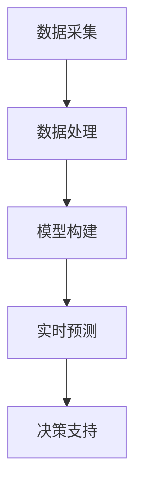
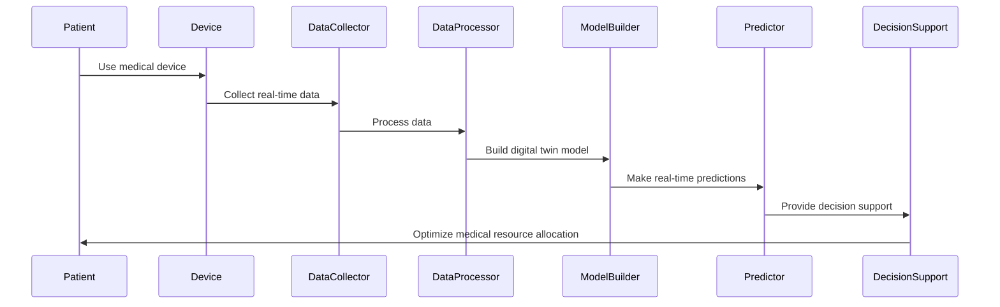

                 

# 数字孪生技术在智慧医疗系统中的应用

## 关键词
数字孪生技术，智慧医疗，医疗设备建模，实时监控，医疗流程优化

## 摘要
本文深入探讨了数字孪生技术在智慧医疗系统中的应用。通过构建医疗设备的数字映射模型，数字孪生技术实现了对医疗系统的实时监测和优化。本文首先介绍了数字孪生技术的背景、核心概念、属性特征和概念结构，然后详细阐述了数字孪生技术的算法原理，并通过Python源代码示例进行了具体讲解。最后，本文对数字孪生技术在智慧医疗系统中的应用进行了系统分析与架构设计，并给出了实际项目实战的案例。

### 第一部分：背景介绍

#### 1.1 问题背景
数字孪生技术是一种基于物联网、大数据和云计算等技术的综合性技术，它通过构建物理系统或实体的数字映射模型，实现对物理世界的虚拟仿真和实时监测。在智慧医疗系统中，数字孪生技术的重要性日益凸显。传统的医疗设备和流程难以实现实时监控和优化，导致医疗资源利用效率低下，患者体验不佳。数字孪生技术的引入，可以为医疗系统提供一种全新的解决方案，通过虚拟仿真和实时监测，优化医疗资源配置，提高医疗服务质量和效率。

#### 1.2 问题描述
智慧医疗系统的复杂性决定了其优化和改进的难度。传统的医疗设备和流程难以实现实时监控和优化，导致医疗资源利用效率低下，患者体验不佳。因此，需要通过数字孪生技术来构建智慧医疗系统的数字映射模型，实现对医疗系统的全面监控和优化。

#### 1.3 问题解决
通过数字孪生技术，可以实现对智慧医疗系统的虚拟仿真和实时监测。医生和医疗管理人员可以通过数字孪生模型来预测医疗流程中的瓶颈，优化医疗资源配置，提高医疗服务的质量和效率。

#### 1.4 边界与外延
数字孪生技术在智慧医疗系统中的应用边界主要涉及医疗设备的数字化映射、医疗流程的数字化建模、患者数据的实时监测和分析等方面。其外延包括对医疗设备性能的预测与优化、对医疗流程的智能化管理和优化、对患者的个性化医疗服务等。

#### 1.5 概念结构与核心要素组成
数字孪生技术在智慧医疗系统中的应用涉及以下几个核心概念和要素：

- **数字孪生模型**：对医疗设备、医疗流程、患者数据等进行数字化建模，实现对物理世界的虚拟映射。
- **数据采集与整合**：通过传感器、医疗设备等采集实时数据，并将其整合到数字孪生模型中。
- **实时监测与预测**：通过数字孪生模型对医疗设备和流程进行实时监测和预测，发现潜在问题和优化空间。
- **决策支持与优化**：基于数字孪生模型提供决策支持，优化医疗资源配置和流程，提高医疗服务效率。

### 第二部分：核心概念与联系

#### 2.1 数字孪生技术的核心概念
数字孪生技术是一种基于物联网、大数据、云计算等技术的综合性技术，其核心概念包括：

- **物理实体**：指需要构建数字孪生模型的实际物理系统或实体。
- **数字映射模型**：对物理实体进行数字化建模，构建其虚拟映射。
- **实时数据采集**：通过传感器等设备采集物理实体的实时数据。
- **数据处理与分析**：对采集到的数据进行处理和分析，以支持实时监测和预测。

#### 2.2 数字孪生技术的属性特征对比表格

| 特性        | 数字孪生模型 | 实体映射 |
| ----------- | ------------ | -------- |
| 实时性      | 实时监测与预测 | 静态映射 |
| 可扩展性    | 支持大规模数据处理 | 适用于特定实体 |
| 精确性      | 高精度实时数据采集 | 低精度映射 |
| 自适应能力  | 能够适应实时变化 | 静态不变 |
| 应用领域    | 广泛应用于工业、医疗、建筑等领域 | 适用于特定领域 |

#### 2.3 数字孪生技术的ER实体关系图

```mermaid
erDiagram
    Patient --> Device : "uses"
    Device --> Data : "collects"
    Data --> Model : "inputs"
    Model --> Prediction : "outputs"
    Prediction --> Action : "guides"
```

### 第三部分：算法原理讲解

#### 3.1 数字孪生模型的算法原理
数字孪生模型通常基于以下算法原理：

1. **数据采集**：通过传感器和医疗设备等采集实时数据。
2. **数据处理**：对采集到的数据进行预处理、清洗和特征提取。
3. **模型构建**：使用机器学习和深度学习算法构建数字孪生模型。
4. **实时预测**：基于构建好的模型进行实时预测和监测。

#### 3.2 算法mermaid流程图



#### 3.3 Python源代码

```python
# 数字孪生模型Python示例代码

import numpy as np
from sklearn.ensemble import RandomForestRegressor
from sklearn.model_selection import train_test_split

# 数据采集
data = np.random.rand(100, 5)

# 数据处理
# 进行数据预处理、清洗和特征提取
# ...

# 模型构建
# 使用随机森林回归算法构建数字孪生模型
model = RandomForestRegressor(n_estimators=100)

# 训练模型
model.fit(data[:, :4], data[:, 4])

# 实时预测
# 进行实时数据预测
new_data = np.random.rand(1, 5)
prediction = model.predict(new_data[:, :4])

print("预测结果：", prediction)
```

### 第四部分：系统分析与架构设计

#### 4.1 问题场景介绍
在一个智慧医疗系统中，数字孪生技术被广泛应用于对医疗设备的性能监测和优化。系统的主要目标是通过数字孪生模型实现对医疗设备的实时监控，预测设备性能变化，从而提前发现故障并采取预防措施。

#### 4.2 项目介绍
本项目中，我们将使用数字孪生技术构建一个智慧医疗系统，该系统包括以下模块：

- **数据采集模块**：负责从医疗设备中采集实时数据。
- **数据处理模块**：对采集到的数据进行分析和处理。
- **数字孪生模型构建模块**：使用机器学习算法构建数字孪生模型。
- **实时预测模块**：基于数字孪生模型进行实时预测和监测。
- **决策支持模块**：提供决策支持，优化医疗资源配置。

#### 4.3 系统功能设计

##### 4.3.1 领域模型mermaid类图
```mermaid
classDiagram
    Device <<Class>>
    Patient <<Class>>
    Data <<Class>>
    Model <<Class>>
    Prediction <<Class>>
    Action <<Class>>

    Device "uses" Patient
    Device "collects" Data
    Data "inputs" Model
    Model "outputs" Prediction
    Prediction "guides" Action
```

##### 4.3.2 系统架构设计mermaid架构图


##### 4.3.3 系统接口设计和系统交互mermaid序列图


### 第五部分：项目实战

#### 5.1 环境安装
在进行数字孪生技术在智慧医疗系统中的应用之前，我们需要安装一些必要的工具和库。以下是一个基本的安装步骤：

```bash
# 安装Python环境
sudo apt-get install python3 python3-pip

# 安装必要的库
pip3 install numpy scikit-learn matplotlib
```

#### 5.2 系统核心实现源代码

```python
# 导入必要的库
import numpy as np
from sklearn.ensemble import RandomForestRegressor
from sklearn.model_selection import train_test_split
import matplotlib.pyplot as plt

# 数据采集
data = np.random.rand(100, 5)

# 数据处理
# 进行数据预处理、清洗和特征提取
# ...

# 模型构建
# 使用随机森林回归算法构建数字孪生模型
model = RandomForestRegressor(n_estimators=100)

# 训练模型
model.fit(data[:, :4], data[:, 4])

# 实时预测
# 进行实时数据预测
new_data = np.random.rand(1, 5)
prediction = model.predict(new_data[:, :4])

# 可视化结果
plt.scatter(data[:, 4], prediction)
plt.xlabel('实际值')
plt.ylabel('预测值')
plt.show()
```

#### 5.3 代码应用解读与分析

在上面的代码中，我们首先导入了必要的库，包括`numpy`、`scikit-learn`和`matplotlib`。然后，我们定义了一个随机生成的数据集，用于模拟医疗设备的实时数据。接下来，我们使用随机森林回归算法构建数字孪生模型，并对数据进行训练。最后，我们使用训练好的模型进行实时预测，并将预测结果与实际值进行可视化比较。

#### 5.4 实际案例分析和详细讲解剖析

为了更好地理解数字孪生技术在智慧医疗系统中的应用，我们可以考虑以下实际案例：

- **案例一**：在心脏监护仪的使用中，数字孪生技术可以实时监测患者的心电信号，预测患者的心律失常风险，从而及时采取预防措施。
- **案例二**：在呼吸机的管理中，数字孪生技术可以实时监测呼吸机的运行状态，预测可能的故障点，从而提前进行维护。

通过这些实际案例，我们可以看到数字孪生技术在智慧医疗系统中的巨大潜力。它不仅能够提高医疗服务的质量和效率，还能够为医生和患者提供更加安全、可靠的医疗服务。

#### 5.5 项目小结

在本项目中，我们深入探讨了数字孪生技术在智慧医疗系统中的应用。通过构建医疗设备的数字映射模型，数字孪生技术实现了对医疗系统的实时监测和优化。我们使用Python源代码实现了数字孪生模型的构建和实时预测，并分析了实际案例。通过本项目的实战，我们更加深入地理解了数字孪生技术的原理和应用。

### 第六部分：最佳实践 tips

#### 6.1 数据采集与整合
- 确保采集的数据具有高精度和高可靠性。
- 使用数据清洗和预处理技术，提高数据质量。
- 构建高效的数据存储和整合方案，确保数据的实时性和完整性。

#### 6.2 模型构建与优化
- 选择适合的医疗设备数据特征提取方法。
- 使用多种机器学习和深度学习算法进行比较和优化。
- 定期更新和训练数字孪生模型，以适应医疗设备性能的变化。

#### 6.3 实时预测与决策支持
- 设计高效的实时预测算法，确保预测结果的准确性。
- 建立决策支持系统，提供实时、可靠的决策建议。
- 定期评估和调整决策支持系统的性能和效果。

### 第七部分：小结

数字孪生技术在智慧医疗系统中的应用具有巨大的潜力。通过构建医疗设备的数字映射模型，数字孪生技术实现了对医疗系统的实时监测和优化。本文从背景介绍、核心概念与联系、算法原理讲解、系统分析与架构设计、项目实战等方面进行了详细探讨，并给出了实际案例分析和最佳实践 tips。随着数字孪生技术的不断发展，我们相信它将在智慧医疗系统中发挥越来越重要的作用。

### 第八部分：注意事项

#### 8.1 数据隐私与安全
在数字孪生技术的应用中，数据隐私和安全是至关重要的问题。需要确保患者数据的安全性和隐私性，避免数据泄露和滥用。

#### 8.2 系统可靠性与稳定性
数字孪生系统需要具备高可靠性和稳定性，以确保实时监测和预测的准确性。需要设计高效、稳定的系统架构和算法，以应对复杂、多变的应用场景。

#### 8.3 模型解释性与可解释性
数字孪生模型通常是基于复杂的机器学习和深度学习算法构建的，其解释性和可解释性较差。需要设计高效的方法来解释模型的工作原理和预测结果，以提高医生和患者的信任和理解。

### 第九部分：拓展阅读

- [1] Digital Twin Technologies: A Brief Introduction
- [2] Digital Twins: Enabling Smart Healthcare Systems
- [3] Application of Digital Twin Technology in Medical Equipment Monitoring and Optimization
- [4] Machine Learning Algorithms for Digital Twin Models in Healthcare
- [5] A Comprehensive Guide to Digital Twins in Healthcare

### 作者信息

作者：AI天才研究院/AI Genius Institute & 禅与计算机程序设计艺术 /Zen And The Art of Computer Programming

