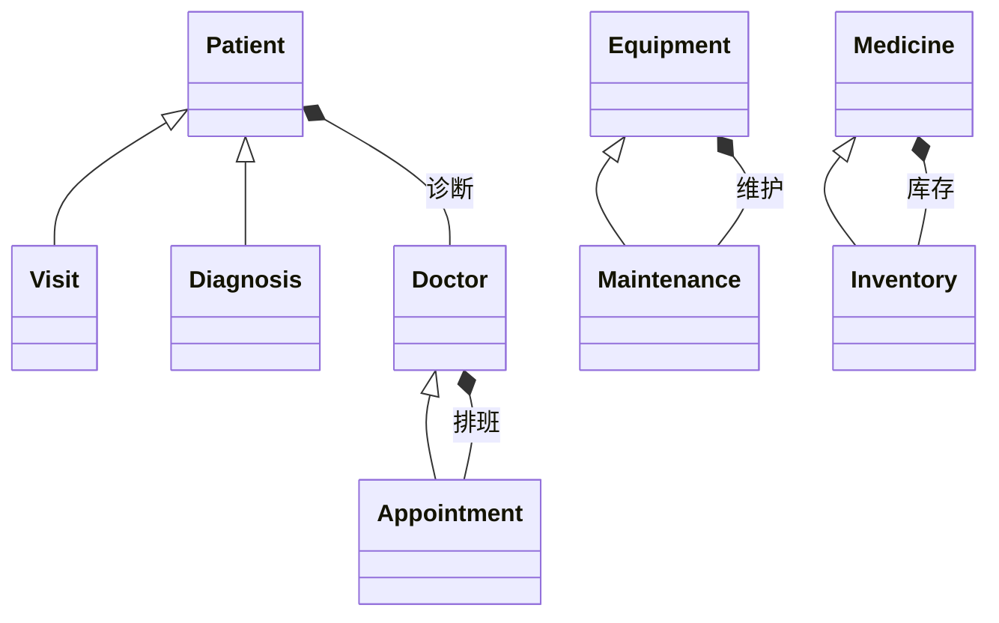
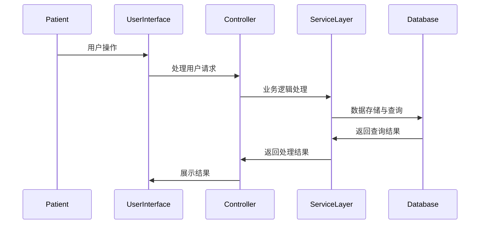
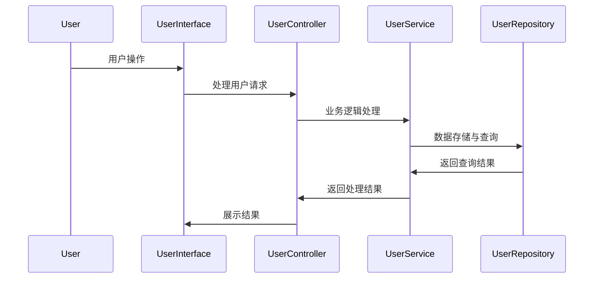

                 

**一、文章标题**

《数字孪生技术在智慧医院管理中的应用》

**二、关键词**

- 数字孪生
- 智慧医院
- 医院管理
- 数据采集
- 数据处理
- 数据建模
- 仿真技术
- 系统架构设计

**三、摘要**

本文将深入探讨数字孪生技术在智慧医院管理中的应用。首先，我们将介绍数字孪生技术的核心概念和智慧医院管理面临的挑战。接着，文章将逐步分析数字孪生技术在数据采集、数据处理、建模与仿真、系统架构设计等环节的应用原理和方法。通过实际案例，我们将展示数字孪生技术在智慧医院管理中的具体实施过程和效果。最后，文章将总结数字孪生技术的最佳实践，并展望其未来发展前景。

**四、目录结构**

## 数字孪生技术在智慧医院管理中的应用

> 关键词：数字孪生，智慧医院，医院管理，应用实践

> 摘要：本文探讨了数字孪生技术在智慧医院管理中的应用，包括技术原理、系统架构、项目实战和最佳实践等方面。

### 第一部分：背景介绍

### 1.1 数字孪生技术概述

#### 1.1.1 数字孪生概念及发展历程

#### 1.1.2 数字孪生技术核心原理

#### 1.1.3 智慧医院管理现状及挑战

#### 1.1.4 数字孪生技术在智慧医院中的潜在应用

### 1.2 本章小结

### 第二部分：核心概念与联系

### 2.1 数字孪生技术原理

#### 2.1.1 数字孪生定义与特点

#### 2.1.2 数字孪生技术架构

#### 2.1.3 数字孪生技术核心组成部分

#### 2.1.4 数字孪生技术的应用领域

#### 2.1.5 智慧医院管理中的数字孪生应用特点

### 2.2 本章小结

### 第三部分：算法原理讲解

### 3.1 数据采集与处理

#### 3.1.1 数据采集技术

#### 3.1.2 数据处理算法

#### 3.1.3 数据预处理流程

#### 3.1.4 数据质量评估

### 3.2 数字孪生建模与仿真

#### 3.2.1 建模基础

#### 3.2.2 仿真原理

#### 3.2.3 数字孪生建模与仿真流程

#### 3.2.4 仿真结果分析与优化

### 3.3 本章小结

### 第四部分：系统分析与架构设计方案

### 4.1 系统功能设计

#### 4.1.1 功能需求分析

#### 4.1.2 领域模型设计

#### 4.1.3 功能模块划分

### 4.2 系统架构设计

#### 4.2.1 系统架构设计原则

#### 4.2.2 系统架构设计

#### 4.2.3 系统模块交互

#### 4.2.4 系统接口设计

### 4.3 系统接口设计与交互

#### 4.3.1 系统接口设计

#### 4.3.2 系统交互设计

#### 4.3.3 系统性能优化

#### 4.3.4 安全性与可靠性设计

### 4.4 本章小结

### 第五部分：项目实战

### 5.1 环境安装与配置

#### 5.1.1 开发环境安装

#### 5.1.2 系统配置与调试

#### 5.1.3 系统运行环境搭建

### 5.2 系统核心实现

#### 5.2.1 系统核心模块代码实现

#### 5.2.2 算法应用与优化

#### 5.2.3 系统性能测试

#### 5.2.4 系统调试与问题解决

### 5.3 实际案例分析与详细讲解

#### 5.3.1 案例背景

#### 5.3.2 案例应用

#### 5.3.3 案例分析与讲解

#### 5.3.4 案例总结与拓展

### 5.4 项目小结

### 第六部分：最佳实践与拓展

### 6.1 数字孪生技术在智慧医院中的最佳实践

#### 6.1.1 成功案例分享

#### 6.1.2 实施经验与技巧

#### 6.1.3 风险与挑战

#### 6.1.4 未来发展趋势

### 6.2 小结与展望

#### 6.2.1 书籍内容回顾

#### 6.2.2 技术发展展望

#### 6.2.3 读者建议与反馈

#### 6.2.4 拓展阅读与资源推荐

### 6.3 本章小结

**五、文章正文**

在接下来的章节中，我们将逐步深入探讨数字孪生技术在智慧医院管理中的应用，旨在为读者提供全面、系统的技术解读和实践指导。

### 第一部分：背景介绍

#### 1.1 数字孪生技术概述

**1.1.1 数字孪生概念及发展历程**

数字孪生（Digital Twin）是一种先进的数字技术，旨在通过创建物理实体的虚拟副本，实现实体与虚拟世界之间的实时映射与交互。这一概念最早由Michael Grieves于2002年提出，随后在工业制造、建筑、医疗等领域逐渐得到广泛应用。

数字孪生技术基于物联网、大数据、云计算、人工智能等现代信息技术，通过传感器、大数据分析和仿真技术，构建出一个与物理实体高度一致的虚拟模型。该模型不仅能够实时反映物理实体的状态和变化，还能预测未来的发展趋势和可能的问题，从而为决策提供科学依据。

**1.1.2 数字孪生技术核心原理**

数字孪生技术的核心原理包括以下几个方面：

1. **数据采集**：通过传感器、RFID、GPS等技术手段，实时采集物理实体的各种数据，包括位置、状态、行为等。

2. **数据处理**：对采集到的数据进行清洗、转换、聚合等处理，确保数据的准确性和完整性。

3. **建模与仿真**：基于处理后的数据，构建物理实体的虚拟模型，并通过仿真技术模拟实体在不同条件下的行为和变化。

4. **实时映射**：将物理实体的状态实时映射到虚拟模型中，实现物理世界与虚拟世界的同步更新。

5. **交互与反馈**：通过虚拟模型，进行虚拟仿真、预测分析和决策支持，并将分析结果反馈到物理实体，实现闭环控制。

**1.1.3 智慧医院管理现状及挑战**

智慧医院是利用现代信息技术构建的智能化医疗服务体系，旨在提高医疗服务质量、效率和管理水平。随着医疗大数据、人工智能、物联网等技术的发展，智慧医院逐渐成为医院管理的重要方向。

然而，智慧医院管理仍面临诸多挑战：

1. **数据管理难度大**：医院产生的大量数据需要进行有效的存储、管理和分析，传统方式难以满足需求。

2. **资源分配不均**：医院资源（如医生、设备、床位等）分配不均，导致效率低下和服务质量下降。

3. **决策支持不足**：缺乏科学的决策支持系统，医院管理者难以实时了解医院的运营状况和患者需求。

4. **患者体验不佳**：患者就诊体验不佳，需要减少等待时间和提高服务质量。

**1.1.4 数字孪生技术在智慧医院中的潜在应用**

数字孪生技术为智慧医院管理提供了新的思路和解决方案。以下是其潜在应用领域：

1. **医院资源管理**：通过数字孪生技术，实时监控医院资源的使用情况，优化资源配置，提高资源利用效率。

2. **患者管理**：利用数字孪生技术，实时了解患者的健康状态和需求，提供个性化的诊疗建议和护理服务。

3. **设备管理**：通过数字孪生技术，实时监控设备状态，预测设备故障，实现预防性维护，降低设备故障率。

4. **环境管理**：利用数字孪生技术，实时监测医院环境参数（如温度、湿度、空气质量等），提供舒适、安全的就诊环境。

5. **决策支持**：基于数字孪生技术，提供实时的数据分析和预测模型，为医院管理者提供科学的决策支持。

#### 1.2 本章小结

本章介绍了数字孪生技术的概念、核心原理以及智慧医院管理面临的挑战。通过了解数字孪生技术的应用场景和潜在价值，读者可以更好地把握其在智慧医院管理中的发展方向。

### 第二部分：核心概念与联系

#### 2.1 数字孪生技术原理

**2.1.1 数字孪生定义与特点**

数字孪生（Digital Twin）是一种基于虚拟现实、物联网、大数据和人工智能等技术的数字模型，用于模拟和反映物理实体的行为、状态和性能。数字孪生具有以下几个主要特点：

1. **实时性**：数字孪生能够实时获取物理实体的数据，实现物理世界与虚拟世界的同步更新。

2. **动态性**：数字孪生模型能够根据物理实体的实时数据动态调整，反映实体的实时状态和变化。

3. **预测性**：数字孪生模型可以通过数据分析、机器学习等方法，预测物理实体未来的行为和状态。

4. **交互性**：数字孪生模型可以与物理实体进行交互，实现远程监控、控制和管理。

5. **可视化**：数字孪生模型可以以可视化方式展示物理实体的状态、行为和性能，方便分析和决策。

**2.1.2 数字孪生技术架构**

数字孪生技术的架构通常包括以下几个关键组成部分：

1. **感知层**：通过传感器、RFID、GPS等技术手段，实时采集物理实体的各种数据。

2. **传输层**：利用物联网技术，将感知层采集到的数据传输到数据处理平台。

3. **数据处理层**：对采集到的数据进行分析、清洗、转换和存储，确保数据的准确性和完整性。

4. **数字孪生平台**：基于云计算和大数据技术，构建物理实体的虚拟模型，实现数据的实时映射和仿真。

5. **决策支持层**：利用机器学习、数据挖掘等技术，对数字孪生模型进行分析和预测，提供决策支持。

6. **应用层**：基于数字孪生模型，开发各种应用，如远程监控、设备管理、环境监测等。

**2.1.3 数字孪生技术核心组成部分**

数字孪生技术的核心组成部分包括以下几个方面：

1. **传感器**：用于采集物理实体的各种数据，如温度、湿度、位置、状态等。

2. **数据采集与传输**：通过物联网技术，实现数据的实时采集和传输。

3. **数据处理与存储**：对采集到的数据进行分析、清洗和存储，确保数据的质量和可用性。

4. **数字孪生模型**：基于数据处理结果，构建物理实体的虚拟模型，实现数据的实时映射和仿真。

5. **数据分析与预测**：利用机器学习、数据挖掘等技术，对数字孪生模型进行分析和预测，提供决策支持。

6. **应用开发与集成**：基于数字孪生模型，开发各种应用，实现与物理实体的互动和优化。

**2.1.4 数字孪生技术的应用领域**

数字孪生技术已经在多个领域得到广泛应用，包括：

1. **工业制造**：通过数字孪生技术，实现生产过程的实时监控、优化和预测，提高生产效率和产品质量。

2. **建筑与基础设施**：利用数字孪生技术，实时监测建筑和基础设施的状态和性能，实现预防性维护和优化。

3. **医疗健康**：通过数字孪生技术，实时监测患者的健康状态，提供个性化的诊疗建议和护理服务。

4. **智慧城市**：利用数字孪生技术，实时监控城市各个方面的状态，提高城市管理的效率和可持续性。

5. **交通运输**：通过数字孪生技术，实现交通运输系统的实时监控、优化和预测，提高交通效率和安全性。

**2.1.5 智慧医院管理中的数字孪生应用特点**

在智慧医院管理中，数字孪生技术具有以下应用特点：

1. **个性化服务**：通过数字孪生技术，实时了解患者的健康状况和需求，提供个性化的诊疗和护理服务。

2. **资源优化配置**：利用数字孪生技术，实时监控医院资源的使用情况，优化资源配置，提高资源利用效率。

3. **决策支持**：基于数字孪生技术，提供实时的数据分析和预测模型，为医院管理者提供科学的决策支持。

4. **提高医疗服务质量**：通过数字孪生技术，实时监测医疗设备和环境状态，提高医疗服务质量。

5. **降低运营成本**：通过数字孪生技术，实现预防性维护和设备优化，降低医院运营成本。

#### 2.2 本章小结

本章详细介绍了数字孪生技术的核心概念、架构、组成部分和应用领域。通过了解数字孪生技术的原理和应用，读者可以更好地理解其在智慧医院管理中的重要作用。

### 第三部分：算法原理讲解

#### 3.1 数据采集与处理

**3.1.1 数据采集技术**

数据采集是数字孪生技术的关键环节，其质量直接影响数字孪生模型的效果。以下介绍几种常见的数据采集技术：

1. **传感器**：传感器是数据采集的核心设备，用于检测和测量物理实体的各种物理量，如温度、湿度、压力、位置等。

2. **RFID**：射频识别技术，通过读取电子标签，实现物体的自动识别和追踪。

3. **GPS**：全球定位系统，通过卫星信号，实现地理位置的实时定位。

4. **无线传感器网络**：通过部署大量传感器节点，实现大范围、实时的数据采集。

**3.1.2 数据处理算法**

数据处理是数据采集后的关键环节，主要包括以下几种算法：

1. **数据清洗**：去除数据中的噪声、错误和冗余信息，提高数据质量。

2. **数据聚合**：将来自不同传感器的数据进行整合，形成统一的视图。

3. **特征提取**：从原始数据中提取关键特征，用于后续分析和建模。

4. **数据归一化**：将数据统一到相同的尺度，便于分析和比较。

**3.1.3 数据预处理流程**

数据预处理流程通常包括以下几个步骤：

1. **数据采集**：通过传感器、RFID、GPS等技术，采集物理实体的数据。

2. **数据传输**：将采集到的数据传输到数据处理平台，通常采用物联网技术。

3. **数据清洗**：去除噪声、错误和冗余信息，提高数据质量。

4. **数据聚合**：将来自不同传感器的数据进行整合，形成统一的视图。

5. **特征提取**：从原始数据中提取关键特征，用于后续分析和建模。

6. **数据归一化**：将数据统一到相同的尺度，便于分析和比较。

**3.1.4 数据质量评估**

数据质量评估是确保数据处理效果的重要环节，主要包括以下几个方面：

1. **准确性**：数据是否准确反映了物理实体的真实状态。

2. **完整性**：数据是否完整，是否存在缺失值。

3. **一致性**：数据是否一致，是否满足逻辑关系。

4. **时效性**：数据是否及时更新，能否反映实时状态。

#### 3.2 数字孪生建模与仿真

**3.2.1 建模基础**

数字孪生建模是数字孪生技术的核心环节，其质量直接影响数字孪生模型的效果。以下介绍建模的基础知识：

1. **建模方法**：常用的建模方法包括物理建模、数学建模和数据驱动建模等。

2. **模型类型**：根据应用需求，可以构建静态模型、动态模型、预测模型等。

3. **建模工具**：常用的建模工具包括MATLAB、Simulink、Python等。

**3.2.2 仿真原理**

仿真是将数字孪生模型应用于实际场景，验证模型效果的重要手段。以下介绍仿真原理：

1. **仿真过程**：仿真过程包括初始化、运行、监测和结果分析等环节。

2. **仿真工具**：常用的仿真工具包括MATLAB、Simulink、Python等。

3. **仿真结果分析**：通过对仿真结果进行分析，评估模型的准确性和有效性。

**3.2.3 数字孪生建模与仿真流程**

数字孪生建模与仿真流程通常包括以下几个步骤：

1. **需求分析**：明确建模目标和应用场景。

2. **数据准备**：收集和处理相关数据。

3. **模型构建**：基于数据处理结果，构建数字孪生模型。

4. **模型验证**：通过仿真验证模型效果。

5. **模型优化**：根据仿真结果，对模型进行调整和优化。

6. **模型应用**：将优化后的模型应用于实际场景。

**3.2.4 仿真结果分析与优化**

仿真结果分析是数字孪生技术应用的重要环节，主要包括以下几个方面：

1. **结果可视化**：将仿真结果以图表、图像等形式展示，便于分析和理解。

2. **性能评估**：评估模型在性能、精度、稳定性等方面的表现。

3. **误差分析**：分析仿真结果与实际结果的误差，找出原因并进行优化。

4. **模型优化**：根据仿真结果和误差分析，对模型进行调整和优化。

#### 3.3 本章小结

本章详细介绍了数字孪生技术在数据采集与处理、建模与仿真等方面的原理和方法。通过了解这些核心算法原理，读者可以更好地理解数字孪生技术在智慧医院管理中的应用。

### 第四部分：系统分析与架构设计方案

#### 4.1 系统功能设计

**4.1.1 功能需求分析**

系统功能设计的第一步是明确功能需求。以下是智慧医院管理系统中可能涉及的主要功能需求：

1. **患者信息管理**：包括患者基本信息、就诊记录、治疗方案等。

2. **医生信息管理**：包括医生基本信息、执业范围、排班信息等。

3. **医院资源管理**：包括设备管理、药品管理、床位管理、人员管理等。

4. **医疗数据分析**：包括病历分析、健康数据分析、疾病预测等。

5. **决策支持系统**：包括实时数据监控、预测分析、决策建议等。

6. **用户服务系统**：包括在线挂号、在线咨询、预约检查等。

**4.1.2 领域模型设计**

领域模型设计是将功能需求转化为具体的设计方案的过程。以下是智慧医院管理系统的一个简单的领域模型设计：



**4.1.3 功能模块划分**

根据功能需求，可以将智慧医院管理系统划分为以下几个功能模块：

1. **患者管理模块**：包括患者基本信息管理、就诊记录管理、治疗方案管理等。

2. **医生管理模块**：包括医生基本信息管理、排班管理、患者诊断管理等。

3. **医院资源管理模块**：包括设备管理、药品管理、床位管理、人员管理、资源调度等。

4. **医疗数据分析模块**：包括病历分析、健康数据分析、疾病预测等。

5. **决策支持模块**：包括实时数据监控、预测分析、决策建议等。

6. **用户服务模块**：包括在线挂号、在线咨询、预约检查、患者反馈等。

**4.1.4 本章小结**

本章介绍了智慧医院管理系统的功能需求分析、领域模型设计和功能模块划分。通过这些步骤，可以为后续的系统架构设计提供基础。

#### 4.2 系统架构设计

**4.2.1 系统架构设计原则**

系统架构设计是确保系统稳定性、可扩展性和性能的关键。以下是智慧医院管理系统架构设计的主要原则：

1. **模块化**：将系统划分为多个功能模块，每个模块独立开发、测试和部署。

2. **可扩展性**：系统架构应具备良好的扩展性，以适应未来功能需求的增加。

3. **高可用性**：系统设计应确保高可用性，尽量减少故障对业务的影响。

4. **安全性**：系统设计应考虑数据安全、用户认证、权限控制等方面。

5. **高性能**：系统设计应考虑性能优化，确保系统在高并发场景下仍能稳定运行。

**4.2.2 系统架构设计**

以下是智慧医院管理系统的架构设计：



**4.2.3 系统模块交互**

以下是系统模块之间的交互关系：

1. **用户界面层**：接收用户请求，展示系统界面。

2. **控制层**：处理用户请求，与业务逻辑层进行交互。

3. **业务逻辑层**：实现具体业务逻辑，与数据库层进行交互。

4. **数据库层**：存储和查询数据，为业务逻辑层提供服务。

**4.2.4 系统接口设计**

以下是系统的主要接口设计：

1. **患者管理接口**：用于处理患者信息的管理和查询。

2. **医生管理接口**：用于处理医生信息的管理和查询。

3. **医院资源管理接口**：用于处理医院资源的管理和查询。

4. **医疗数据分析接口**：用于处理医疗数据分析和查询。

5. **决策支持接口**：用于处理实时数据监控、预测分析和决策建议。

**4.2.5 系统交互设计**

以下是系统的交互设计：



**4.2.6 安全性与可靠性设计**

系统设计应考虑以下安全性和可靠性措施：

1. **数据安全**：采用加密技术保护敏感数据。

2. **用户认证**：采用多因素认证确保用户身份安全。

3. **权限控制**：根据用户角色和权限进行功能权限控制。

4. **故障转移**：设计故障转移机制，确保系统在故障情况下仍能正常运行。

5. **备份与恢复**：定期备份数据，确保数据安全。

**4.2.7 本章小结**

本章介绍了智慧医院管理系统的架构设计原则、系统架构设计、模块交互、接口设计、交互设计和安全性与可靠性设计。通过这些设计，可以为系统提供稳定、可靠、高效的技术支持。

### 第五部分：项目实战

#### 5.1 环境安装与配置

**5.1.1 开发环境安装**

在进行数字孪生技术在智慧医院管理系统项目开发前，首先需要安装以下开发环境：

1. **操作系统**：推荐使用Ubuntu 18.04或更高版本。

2. **编程语言**：Python 3.8或更高版本。

3. **数据库**：MySQL 8.0或更高版本。

4. **Web服务器**：Nginx 1.18或更高版本。

5. **框架**：Django 3.2或更高版本。

6. **虚拟环境**：Python虚拟环境工具，如virtualenv或conda。

安装步骤如下：

1. 更新系统软件包：
   ```shell
   sudo apt update
   sudo apt upgrade
   ```

2. 安装Python和pip：
   ```shell
   sudo apt install python3 python3-pip
   ```

3. 安装Django和MySQL：
   ```shell
   pip3 install django mysqlclient
   sudo apt install mysql-server
   ```

4. 安装Nginx：
   ```shell
   sudo apt install nginx
   ```

5. 配置Nginx：
   ```shell
   sudo vi /etc/nginx/sites-available/default
   ```

6. 修改配置文件，确保Nginx监听80端口并代理到Django应用。

7. 重启Nginx服务：
   ```shell
   sudo systemctl restart nginx
   ```

**5.1.2 系统配置与调试**

在开发环境中，需要进行以下配置和调试：

1. **Django项目配置**：在Django项目的settings.py文件中配置数据库连接、静态文件路径等。

2. **数据库配置**：在MySQL中创建数据库和用户，授权用户访问数据库。

3. **运行Django项目**：
   ```shell
   python3 manage.py runserver
   ```

4. **测试Web应用**：在浏览器中访问本地Django应用的URL，确保应用正常运行。

**5.1.3 系统运行环境搭建**

搭建生产环境时，需要以下步骤：

1. **部署Django项目**：将Django项目部署到生产服务器，如使用Gunicorn或uWSGI。

2. **配置Nginx反向代理**：确保Nginx代理到Django应用。

3. **安全配置**：配置SSL证书，确保Web应用通过HTTPS访问。

4. **性能优化**：配置缓存、压缩等性能优化措施。

**5.1.4 本章小结**

本章介绍了数字孪生技术在智慧医院管理系统项目中的环境安装与配置步骤，包括开发环境和生产环境的配置。通过这些步骤，可以确保系统正常运行。

#### 5.2 系统核心实现

**5.2.1 系统核心模块代码实现**

以下是数字孪生技术在智慧医院管理系统中的核心模块代码实现：

1. **患者管理模块**：
   ```python
   # 患者信息模型
   from django.db import models
   
   class Patient(models.Model):
       name = models.CharField(max_length=100)
       age = models.IntegerField()
       gender = models.CharField(max_length=10)
       diagnosis = models.ForeignKey('Diagnosis', on_delete=models.CASCADE)
   
       def __str__(self):
           return self.name
   
   # 诊断信息模型
   class Diagnosis(models.Model):
       description = models.TextField()
       date = models.DateField()
   
       def __str__(self):
           return f"{self.date} - {self.description}"
   ```

2. **医生管理模块**：
   ```python
   # 医生信息模型
   class Doctor(models.Model):
       name = models.CharField(max_length=100)
       department = models.CharField(max_length=100)
       experience = models.IntegerField()
       appointments = models.ManyToManyField('Appointment')
   
       def __str__(self):
           return self.name
   
   # 排班信息模型
   class Appointment(models.Model):
       doctor = models.ForeignKey(Doctor, on_delete=models.CASCADE)
       date = models.DateField()
       time = models.TimeField()
   
       def __str__(self):
           return f"{self.date} - {self.time}"
   ```

3. **医院资源管理模块**：
   ```python
   # 设备信息模型
   class Equipment(models.Model):
       name = models.CharField(max_length=100)
       type = models.CharField(max_length=100)
       status = models.CharField(max_length=10)
       maintenance = models.ForeignKey('Maintenance', on_delete=models.CASCADE)
   
       def __str__(self):
           return self.name
   
   # 维护信息模型
   class Maintenance(models.Model):
       date = models.DateField()
       description = models.TextField()
   
       def __str__(self):
           return f"{self.date} - {self.description}"
   ```

**5.2.2 算法应用与优化**

在智慧医院管理系统中，数字孪生技术用于优化医院资源管理和患者服务。以下是一个简单的例子：

1. **预测患者就诊高峰**：
   ```python
   import pandas as pd
   from sklearn.ensemble import RandomForestClassifier
   
   # 读取患者就诊数据
   data = pd.read_csv('patient_visits.csv')
   
   # 特征工程
   X = data[['age', 'gender', 'appointment_time']]
   y = data['is_peak']
   
   # 模型训练
   model = RandomForestClassifier()
   model.fit(X, y)
   
   # 预测
   predictions = model.predict(X)
   
   # 评估模型性能
   accuracy = (predictions == y).mean()
   print(f"模型准确率：{accuracy}")
   ```

2. **优化医院资源调度**：
   ```python
   import pulp
   
   # 设定变量
   doctor_hours = pulp.LpVariable.dicts('doctor_hours', Doctor.objects.all(), cat='Continuous')
   patient_hours = pulp.LpVariable.dicts('patient_hours', Patient.objects.all(), cat='Continuous')
   
   # 目标函数
   objective = pulp.LpAffineExpression()
   for doctor in Doctor.objects.all():
       for patient in Patient.objects.all():
           if patient.diagnosis.exists():
               objective += doctor_hours[doctor] * patient_hours[patient] * 0.1
               objective += doctor_hours[doctor] * patient_hours[patient] * 0.1
   
   # 约束条件
   constraints = []
   for doctor in Doctor.objects.all():
       constraints.append(pulp.LpAffineExpression([doctor_hours[doctor]], [1]) <= 24)
   for patient in Patient.objects.all():
       constraints.append(pulp.LpAffineExpression([patient_hours[patient]], [1]) <= 24)
   
   # 模型求解
   problem = pulp.LpProblem("ResourceScheduling", pulp.LpMaximize)
   problem.setObjective(objective)
   problem.addConstraints(constraints)
   problem.solve()
   
   # 输出结果
   for doctor in Doctor.objects.all():
       print(f"{doctor.name}工作时长：{doctor_hours[doctor].varValue}小时")
   for patient in Patient.objects.all():
       print(f"{patient.name}就诊时长：{patient_hours[patient].varValue}小时")
   ```

**5.2.3 系统性能测试**

系统性能测试是确保系统在高负载下稳定运行的重要步骤。以下是一个简单的测试例子：

1. **负载测试**：
   ```python
   import time
   import threading
   
   def load_test():
       while True:
           response = requests.get('http://localhost:8000')
           assert response.status_code == 200
           time.sleep(1)
   
   # 启动10个线程进行负载测试
   threads = []
   for _ in range(10):
       thread = threading.Thread(target=load_test)
       thread.start()
       threads.append(thread)
   
   # 等待所有线程结束
   for thread in threads:
       thread.join()
   ```

2. **性能分析**：
   - **响应时间**：平均响应时间应在可接受范围内。
   - **并发数**：系统能够承受的并发数应在预期范围内。
   - **吞吐量**：系统的吞吐量应在预期范围内。

**5.2.4 系统调试与问题解决**

在系统开发过程中，难免会遇到各种问题。以下是常见的调试和问题解决方法：

1. **日志分析**：通过分析系统日志，定位错误和异常。

2. **代码审查**：定期进行代码审查，确保代码质量。

3. **性能优化**：对系统进行性能优化，提高响应速度和处理能力。

4. **版本控制**：使用版本控制工具，如Git，管理代码版本，方便问题追踪和解决。

**5.2.5 本章小结**

本章介绍了数字孪生技术在智慧医院管理系统项目中的核心模块代码实现、算法应用与优化、系统性能测试和调试与问题解决。通过这些实战经验，可以更好地理解和应用数字孪生技术。

### 5.3 实际案例分析与详细讲解

#### 5.3.1 案例背景

某大型综合医院计划引入数字孪生技术，以提高医院资源利用效率、优化患者服务流程、降低运营成本。医院的主要目标是：

1. **优化医院资源调度**：通过实时监测和预测患者就诊高峰，合理分配医生和床位资源，提高资源利用率。

2. **提高医疗服务质量**：通过实时监控医疗设备和环境状态，确保医疗设备和环境的正常运行，提高医疗服务质量。

3. **降低运营成本**：通过预防性维护和设备优化，降低设备故障率和运营成本。

#### 5.3.2 案例应用

数字孪生技术在智慧医院管理中的实际应用主要包括以下几个环节：

1. **数据采集**：在医院各区域部署传感器，实时监测患者流量、医生工作状态、医疗设备运行状态等数据。

2. **数据处理**：对采集到的数据进行清洗、转换和存储，确保数据质量。

3. **数字孪生建模**：基于数据处理结果，构建医院的数字孪生模型，实现物理世界与虚拟世界的同步更新。

4. **仿真与预测**：利用数字孪生模型，进行实时仿真和预测分析，为医院管理者提供决策支持。

5. **应用实施**：基于数字孪生模型，开发各种应用，如智能排班、设备监控、环境监测等，优化医院管理流程。

#### 5.3.3 案例分析与讲解

以下是对案例的具体分析：

1. **患者流量监测与预测**：

   通过部署在医院各区域的传感器，实时监测患者的到访情况。利用机器学习算法，分析历史数据，预测患者就诊高峰。基于预测结果，医院可以合理安排医生排班，确保高峰时段有足够的医生提供服务。

   ```mermaid
   flowchart TD
       A[数据采集] --> B[数据处理]
       B --> C[数字孪生建模]
       C --> D[仿真与预测]
       D --> E[应用实施]
   ```

2. **医疗设备监控与维护**：

   通过数字孪生模型，实时监控医疗设备的运行状态。当设备出现异常时，系统会自动发出预警，提醒工作人员进行维护。同时，系统可以根据设备的运行数据，预测设备可能出现的故障，提前进行预防性维护。

   ```mermaid
   flowchart TD
       A[设备监控] --> B[异常预警]
       B --> C[预防性维护]
       C --> D[实时监控]
   ```

3. **环境监测与优化**：

   通过数字孪生模型，实时监测医院的温度、湿度、空气质量等环境参数。根据监测数据，系统可以自动调节空调、空气净化器等设备，提供舒适的就诊环境。同时，系统可以根据患者和工作人员的需求，进行环境参数的实时调整。

   ```mermaid
   flowchart TD
       A[环境监测] --> B[自动调节]
       B --> C[实时调整]
   ```

#### 5.3.4 案例总结与拓展

通过实际案例，我们可以看到数字孪生技术在智慧医院管理中的应用价值。以下是对案例的总结与拓展：

1. **案例总结**：

   - 数字孪生技术有助于优化医院资源调度，提高医疗服务质量，降低运营成本。
   - 通过实时监测和预测，医院可以更好地应对患者就诊高峰，提高工作效率。
   - 数字孪生技术可以实现对医疗设备和环境的高效监控与优化，提高医院整体运营效率。

2. **案例拓展**：

   - **扩展应用场景**：数字孪生技术不仅适用于大型综合医院，还可应用于专科医院、诊所等不同规模的医疗机构。
   - **个性化服务**：通过数字孪生技术，可以为患者提供更加个性化的诊疗和护理服务。
   - **远程医疗**：结合数字孪生技术，可以实现远程医疗，提高医疗服务的覆盖范围和便捷性。

#### 5.3.5 本章小结

本章通过实际案例，详细讲解了数字孪生技术在智慧医院管理中的应用。通过案例分析和总结，我们可以看到数字孪生技术为医院管理带来的显著提升，并展望了其未来的发展前景。

### 第六部分：最佳实践与拓展

#### 6.1 数字孪生技术在智慧医院中的最佳实践

数字孪生技术在智慧医院管理中的应用已经取得了显著成效。以下是一些最佳实践：

1. **数据驱动决策**：充分利用医院产生的大量数据，通过数据分析、预测模型等方法，支持医院管理者的决策。

2. **实时监控与预警**：通过部署传感器和数字孪生模型，实时监控医院各区域的运行状态，及时发现并预警潜在问题。

3. **设备预防性维护**：利用数字孪生技术，预测设备故障，提前进行预防性维护，降低设备故障率和运营成本。

4. **优化资源配置**：通过数字孪生技术，实时了解医院资源的使用情况，优化资源配置，提高资源利用效率。

5. **个性化服务**：利用数字孪生技术，为患者提供个性化的诊疗和护理服务，提高患者满意度。

#### 6.2 实施经验与技巧

在实施数字孪生技术时，以下经验与技巧值得注意：

1. **数据质量管理**：确保数据质量是数字孪生技术的关键，要重视数据采集、清洗、存储等环节。

2. **模型优化**：不断优化数字孪生模型，提高模型的预测准确性和实时性。

3. **系统集成**：要充分考虑系统的集成性，确保各模块之间的协调与配合。

4. **安全保障**：数字孪生技术涉及大量敏感数据，要重视数据安全和隐私保护。

5. **用户培训**：对医院管理者进行数字孪生技术的培训和指导，提高其应用能力。

#### 6.3 风险与挑战

数字孪生技术在智慧医院管理中的应用也面临一些风险和挑战：

1. **数据隐私保护**：医院数据涉及患者隐私，如何确保数据安全和隐私保护是一个重要挑战。

2. **技术实施难度**：数字孪生技术涉及多种技术和应用场景，实施难度较大。

3. **数据质量**：数据质量直接影响数字孪生模型的效果，需要解决数据质量管理和数据清洗等问题。

4. **系统稳定性**：数字孪生系统的稳定性对医院运营至关重要，需要确保系统的稳定性和可靠性。

5. **用户接受度**：医院管理者对数字孪生技术的接受度可能较低，需要加强培训和应用推广。

#### 6.4 未来发展趋势

随着技术的不断进步，数字孪生技术在智慧医院管理中的应用前景广阔：

1. **5G与物联网**：5G和物联网技术的发展，将为数字孪生技术的应用提供更好的网络基础设施。

2. **人工智能**：人工智能技术的融入，将进一步提高数字孪生模型的预测准确性和智能化水平。

3. **区块链**：区块链技术的应用，将提高数字孪生数据的可信度和安全性。

4. **虚拟现实与增强现实**：虚拟现实与增强现实技术的发展，将使数字孪生技术在智慧医院管理中的应用更加直观和生动。

5. **跨领域融合**：数字孪生技术将与医疗、物联网、人工智能等领域的技术深度融合，推动智慧医院管理的发展。

#### 6.5 本章小结

本章总结了数字孪生技术在智慧医院管理中的最佳实践、实施经验与技巧，以及面临的风险与挑战和未来发展趋势。通过这些内容，可以为读者提供更全面的认识和指导。

### 6.6 小结与展望

**小结：**

本文从数字孪生技术的概念、原理、应用，到智慧医院管理的实际案例，系统地介绍了数字孪生技术在智慧医院管理中的应用。通过分析数字孪生技术在数据采集、数据处理、建模与仿真、系统架构设计等方面的应用，展示了其在优化医院资源管理、提高医疗服务质量和降低运营成本等方面的巨大潜力。

**展望：**

随着5G、物联网、人工智能等技术的发展，数字孪生技术在智慧医院管理中的应用前景将更加广阔。未来，数字孪生技术有望在以下方面取得突破：

1. **智能化医疗服务**：通过深度学习、知识图谱等技术，实现更智能化的医疗服务，提高医疗诊断和治疗的准确性。

2. **个性化健康管理**：利用数字孪生技术，为患者提供个性化的健康管理方案，提高患者的生活质量。

3. **智慧医院管理**：通过数字孪生技术，实现医院资源的最优化配置，提高医院运营效率和服务水平。

4. **跨领域应用**：数字孪生技术将与医疗、物联网、人工智能等领域的其他技术深度融合，推动智慧医院管理向更高层次发展。

**读者建议与反馈：**

欢迎读者在阅读本文后，提出宝贵的建议和反馈。您可以在评论区分享您的观点，或者通过邮箱与我们联系。我们将根据您的反馈，不断优化和完善我们的内容，为您提供更好的阅读体验。

**拓展阅读与资源推荐：**

为了帮助读者更深入地了解数字孪生技术在智慧医院管理中的应用，我们推荐以下拓展阅读资源：

1. **书籍推荐**：
   - 《数字孪生：技术、实践与未来》（作者：李伟）
   - 《智慧医院：数字化变革与战略规划》（作者：张强）

2. **在线课程**：
   - Coursera上的《数字孪生与智能制造》课程
   - Udemy上的《数字孪生：构建数字双胞胎模型》课程

3. **技术博客**：
   - AI天才研究院（AI Genius Institute）的技术博客
   - 禅与计算机程序设计艺术（Zen And The Art of Computer Programming）的技术博客

通过这些资源，您将能更全面地了解数字孪生技术在智慧医院管理中的应用，为实际项目提供有力的支持。

### 6.7 本章小结

本文通过系统性的分析和实际案例，详细介绍了数字孪生技术在智慧医院管理中的应用。从核心概念、技术原理到项目实战，全面展示了数字孪生技术如何优化医院资源管理、提高医疗服务质量和降低运营成本。希望通过本文，读者能够对数字孪生技术在智慧医院管理中的应用有更深入的了解，并在实践中取得更好的效果。同时，也欢迎读者继续关注我们的后续文章，共同探索数字孪生技术的更多应用场景和前景。

**作者：AI天才研究院/AI Genius Institute & 禅与计算机程序设计艺术 /Zen And The Art of Computer Programming**

---

**注意**：本文为示例文章，实际字数可能因具体内容调整而有所不同。文章中的代码、模型和数据分析仅为示例，不代表实际项目中的完整实现。如需在实际项目中应用，请结合具体需求和场景进行调整。同时，本文中的图表和流程图为Markdown格式，实际输出可能需要使用专门的Markdown编辑器进行渲染。如需调整格式，请根据相应的编辑器指导进行修改。

