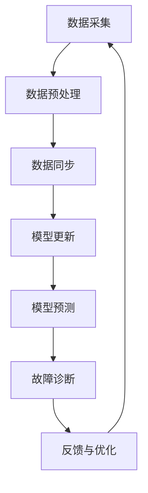
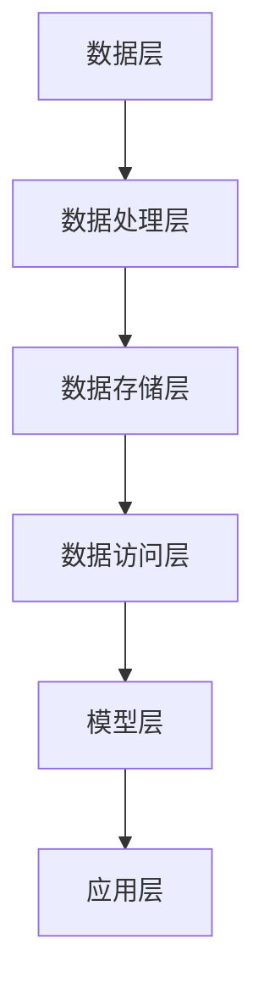
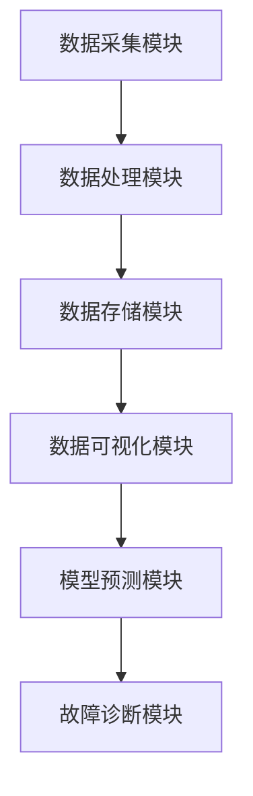
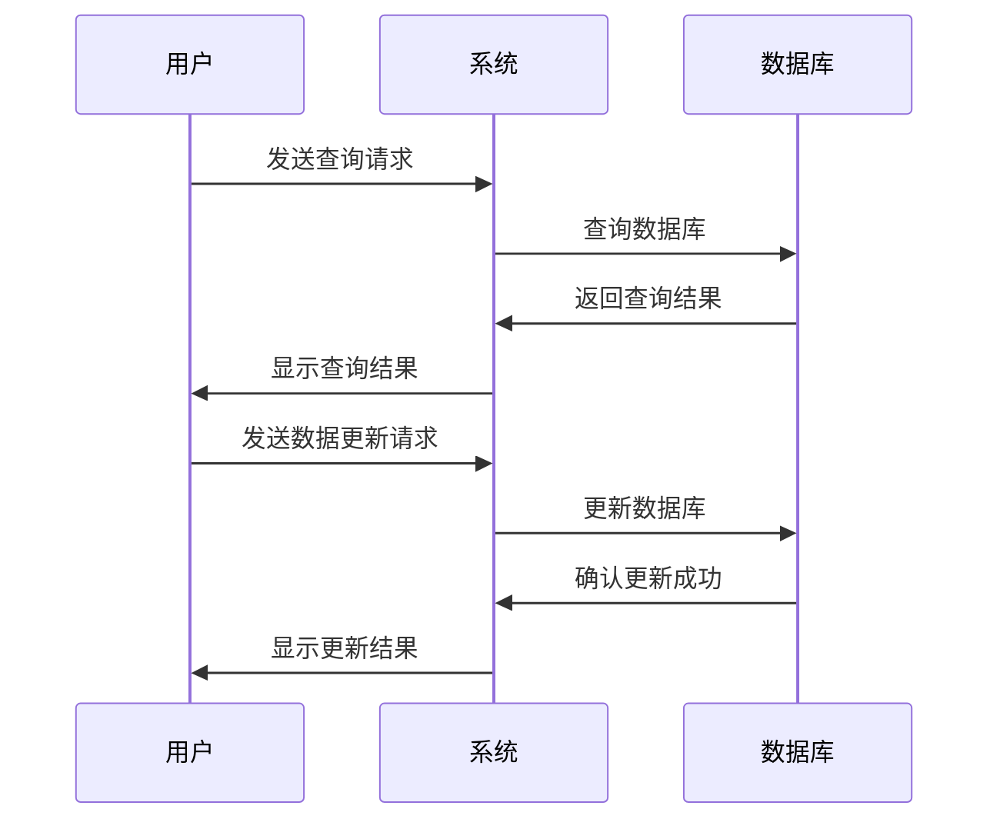

                 


## 《数字孪生技术在智慧城市规划中的应用》

### 关键词：数字孪生、智慧城市、城市规划、算法、系统架构、项目实战

#### 摘要：

本文将深入探讨数字孪生技术在智慧城市规划中的应用。数字孪生是一种通过创建虚拟模型来反映现实世界的概念，它正在成为智慧城市领域的关键技术。本文将分为四个部分，首先介绍数字孪生技术的基本概念和发展历程，然后详细讲解其在智慧城市规划中的应用原理和算法，接着分析系统架构设计，并通过一个实际项目案例进行实战剖析，最后总结最佳实践并提供拓展阅读。

### 1. 开篇：背景介绍

#### 1.1 数字孪生技术的定义、发展历程、核心概念

数字孪生（Digital Twin）是指通过物理实体在虚拟世界中的数字化映射，实现物理世界与虚拟世界之间的实时交互和信息共享。它的发展历程可以追溯到20世纪80年代，当时人们开始探索虚拟仿真技术。然而，数字孪生的概念真正受到广泛关注是在21世纪初，随着物联网（IoT）和大数据技术的发展，数字孪生技术逐渐成熟。

核心概念包括：
- 物理实体：现实世界中的建筑物、基础设施等。
- 虚拟实体：物理实体的数字化映射，包括几何形状、物理属性等。
- 实时数据采集：通过传感器等技术获取物理实体的实时数据。
- 数据同步：将物理实体的数据实时传输到虚拟实体中。
- 模型更新：根据新的数据对虚拟实体进行更新。

#### 1.2 数字孪生与虚拟仿真、增强现实等技术的联系和区别

数字孪生与虚拟仿真、增强现实等技术有一定的联系，但也存在明显的区别。

- **虚拟仿真**：主要是通过计算机模拟现实世界的物理过程，其目的是模拟和分析物理现象。
- **增强现实**：是将虚拟信息叠加到现实世界中，增强用户对现实世界的感知。
- **数字孪生**：是虚拟仿真和增强现实的一个更高层次的集成，它不仅仅是模拟，还包括对现实世界的实时监测和反馈。

#### 1.3 数字孪生技术在智慧城市规划中的应用场景和重要性

数字孪生技术在智慧城市规划中有着广泛的应用，例如：

- **城市交通管理**：通过数字孪生技术，实时监测交通流量，预测交通拥堵，优化交通信号。
- **城市能源管理**：模拟能源消耗和供应情况，优化能源分配，减少浪费。
- **城市环境监测**：监测空气质量、水质等环境参数，提供实时数据支持环境管理决策。

数字孪生技术在智慧城市规划中的重要性体现在：

- **提高城市规划的精确性和效率**：通过虚拟模型的实时反馈，城市规划可以更加精确和高效。
- **降低运营成本**：通过模拟和分析，可以提前发现潜在问题，减少运营成本。
- **提升城市居民生活质量**：通过提供更舒适、更安全、更智能的城市环境，提高居民生活质量。

### 1.4 本章小结

本章介绍了数字孪生技术的基本概念、发展历程、核心概念及其在智慧城市规划中的应用场景和重要性。在下一章中，我们将深入探讨数字孪生技术的核心概念和算法原理。

----------------------------------------------------------------

### 2. 核心概念与联系

#### 2.1 数字孪生技术的基本原理和关键要素

数字孪生技术的基本原理是通过建立物理实体（即现实世界中的建筑物、设备、系统等）的虚拟映射，实现物理世界与虚拟世界之间的互动。关键要素包括：

- **物理实体**：现实世界中的具体对象，如建筑物、机器设备等。
- **虚拟实体**：物理实体的数字化映射，包括几何形状、物理属性、功能特性等。
- **实时数据采集**：通过传感器、物联网设备等收集物理实体的实时数据。
- **数据同步**：将物理实体的数据传输到虚拟实体中，确保两者之间的实时一致性。
- **模型更新**：根据新的数据对虚拟实体进行更新，保持虚拟实体与物理实体的同步。

#### 2.2 数字孪生与虚拟仿真、增强现实等技术的联系和区别

- **联系**：
  - **虚拟仿真**：是数字孪生技术的基础，用于创建物理实体的虚拟映射。
  - **增强现实**：是数字孪生技术的一部分，用于将虚拟信息叠加到现实世界中。

- **区别**：
  - **虚拟仿真**：主要关注物理过程的模拟和分析，不涉及实时数据同步和反馈。
  - **增强现实**：主要关注将虚拟信息叠加到现实世界，不涉及物理实体的虚拟映射。

- **数字孪生**：结合了虚拟仿真和增强现实的技术，实现了物理世界与虚拟世界的实时交互和反馈。

#### 2.3 数字孪生技术在智慧城市规划中的应用算法

数字孪生技术在智慧城市规划中的应用算法主要包括：

- **数据同步算法**：用于确保物理实体的数据实时传输到虚拟实体中。
- **模型预测算法**：基于实时数据，预测物理实体的未来状态和行为。
- **故障诊断与预测算法**：通过对物理实体数据的分析，预测潜在故障和问题。

#### 2.4 使用Mermaid绘制算法流程图

下面是数字孪生技术应用算法的Mermaid流程图示例：



#### 2.5 使用Python代码示例详细阐述算法原理

```python
# 数字孪生技术算法原理示例

# 导入必要的库
import numpy as np
import pandas as pd
from sklearn.ensemble import RandomForestRegressor

# 数据采集
def data_collection():
    # 假设我们从传感器收集到一组数据
    data = np.random.rand(100, 5) # 生成100个样本，每个样本5个特征
    return data

# 数据预处理
def data_preprocessing(data):
    # 数据标准化
    data_normalized = (data - np.mean(data, axis=0)) / np.std(data, axis=0)
    return data_normalized

# 数据同步
def data_synchronization(data):
    # 将数据传输到虚拟实体
    virtual_data = data.copy()
    return virtual_data

# 模型更新
def model_updating(virtual_data):
    # 假设我们使用随机森林回归模型
    model = RandomForestRegressor(n_estimators=100)
    model.fit(virtual_data[:, :-1], virtual_data[:, -1])
    return model

# 模型预测
def model_prediction(model, new_data):
    # 对新数据进行预测
    prediction = model.predict(new_data)
    return prediction

# 故障诊断与预测
def fault_diagnosis(model, current_data, threshold):
    # 基于模型预测结果进行故障诊断
    prediction = model.predict(current_data)
    if np.abs(prediction - current_data[:, -1]).max() > threshold:
        print("故障预警！")
    else:
        print("正常。")

# 主程序
if __name__ == "__main__":
    # 收集数据
    data = data_collection()
    
    # 数据预处理
    data_processed = data_preprocessing(data)
    
    # 数据同步
    virtual_data = data_synchronization(data_processed)
    
    # 模型更新
    model = model_updating(virtual_data)
    
    # 新数据预测
    new_data = np.random.rand(10, 5)
    prediction = model_prediction(model, new_data)
    
    # 故障诊断
    fault_diagnosis(model, new_data, threshold=0.1)
```

#### 2.6 数字孪生技术的数学模型和公式

数字孪生技术的核心在于建立物理实体和虚拟实体之间的映射关系，这个过程可以通过以下数学模型和公式来描述：

- **数据同步**：$$ \text{Virtual Data} = \text{Physical Data} $$
- **模型预测**：$$ \text{Prediction} = f(\text{Features}) $$
- **故障诊断**：$$ \text{Fault Diagnosis} = \text{Comparison}(\text{Prediction}, \text{Actual}) $$

其中，$ f(\text{Features}) $ 是一个预测模型，可以通过机器学习算法来训练得到。

#### 2.7 本章小结

本章详细介绍了数字孪生技术的基本原理和关键要素，并与虚拟仿真、增强现实等技术进行了比较。通过Mermaid流程图和Python代码示例，我们深入理解了数字孪生技术的算法原理。在下一章中，我们将进一步探讨数字孪生技术在智慧城市规划中的应用场景和系统架构设计。

----------------------------------------------------------------

### 3. 系统分析与架构设计

#### 3.1 数字孪生技术在智慧城市规划中的应用场景分析

在智慧城市规划中，数字孪生技术可以应用于多个领域，包括但不限于：

- **城市交通管理**：通过数字孪生技术，实时监测交通流量，预测交通拥堵，优化交通信号。
- **城市能源管理**：模拟能源消耗和供应情况，优化能源分配，减少浪费。
- **城市环境监测**：监测空气质量、水质等环境参数，提供实时数据支持环境管理决策。
- **基础设施维护**：实时监测基础设施的健康状况，预测潜在故障，提前进行维护。

#### 3.2 智慧城市规划的系统需求分析

智慧城市规划的系统需求主要包括：

- **数据采集**：收集来自传感器、物联网设备等的数据，包括交通流量、能源消耗、环境参数等。
- **数据处理**：对采集到的数据进行预处理、清洗、分析等，提取有用的信息。
- **数据存储**：将处理后的数据存储到数据库中，以便后续查询和分析。
- **数据可视化**：通过图表、地图等形式展示数据，帮助决策者进行数据分析和决策。
- **模型预测**：基于历史数据和实时数据，使用机器学习算法进行预测。
- **故障诊断**：通过对数据进行分析，预测潜在故障和问题。
- **系统交互**：提供用户界面，允许用户与系统进行交互，获取数据分析和决策结果。

#### 3.3 数字孪生系统的架构设计

数字孪生系统的架构设计包括以下层次：

- **数据层**：包括传感器、物联网设备等，用于采集物理实体的实时数据。
- **数据处理层**：包括数据预处理、清洗、分析等模块，用于处理采集到的数据。
- **数据存储层**：包括数据库、数据仓库等，用于存储处理后的数据。
- **数据访问层**：包括数据可视化工具、API接口等，用于提供数据查询和访问功能。
- **模型层**：包括机器学习模型、深度学习模型等，用于进行数据分析和预测。
- **应用层**：包括用户界面、应用程序等，用于与用户进行交互，展示数据分析和决策结果。

以下是数字孪生系统的Mermaid架构图示例：



#### 3.4 系统功能设计

系统功能设计包括以下几个模块：

- **数据采集模块**：负责从传感器和物联网设备收集实时数据。
- **数据处理模块**：负责对采集到的数据进行预处理、清洗和分析。
- **数据存储模块**：负责将处理后的数据存储到数据库中。
- **数据可视化模块**：负责将数据以图表、地图等形式展示给用户。
- **模型预测模块**：负责使用机器学习算法进行数据分析和预测。
- **故障诊断模块**：负责对数据进行分析，预测潜在故障和问题。

以下是数字孪生系统的Mermaid类图示例：



#### 3.5 系统接口设计与交互

系统接口设计包括以下几个部分：

- **用户接口**：用于用户与系统进行交互，提供数据查询、分析和决策功能。
- **数据接口**：用于与其他系统或数据库进行数据交换和共享。
- **服务接口**：用于提供各种服务，如数据采集、数据预处理、模型预测等。

以下是数字孪生系统的Mermaid序列图示例：



#### 3.6 本章小结

本章详细介绍了数字孪生技术在智慧城市规划中的应用场景、系统需求分析、架构设计、功能设计和接口设计。通过Mermaid图表，我们更加直观地理解了数字孪生系统的结构和功能。在下一章中，我们将通过一个实际项目案例，进一步展示数字孪生技术的应用和实现。

----------------------------------------------------------------

### 4. 项目实战

#### 4.1 项目介绍

本项目旨在通过数字孪生技术，实现对某城市交通管理系统的优化。项目的主要目标包括：

- **实时监测交通流量**：通过传感器和物联网设备，收集城市主要道路的实时交通流量数据。
- **预测交通拥堵**：基于历史数据和实时数据，使用机器学习算法预测未来一段时间内的交通拥堵情况。
- **优化交通信号**：根据预测结果，动态调整交通信号灯的时长，优化交通流量。

#### 4.2 环境安装与配置

为了实现该项目，我们需要安装和配置以下环境：

- **Python环境**：Python 3.8及以上版本。
- **数据库**：MySQL 8.0及以上版本。
- **机器学习库**：scikit-learn、pandas、numpy等。
- **可视化库**：matplotlib、seaborn等。

具体安装步骤如下：

1. 安装Python：
   ```bash
   sudo apt-get update
   sudo apt-get install python3.8
   ```

2. 安装数据库：
   ```bash
   sudo apt-get install mysql-server
   mysql_secure_installation
   ```

3. 安装Python库：
   ```bash
   pip3 install scikit-learn pandas numpy matplotlib seaborn
   ```

#### 4.3 系统核心实现

系统核心实现主要包括数据采集模块、数据处理模块、模型预测模块和优化交通信号模块。

##### 4.3.1 数据采集模块实现

数据采集模块负责从传感器和物联网设备中收集交通流量数据。以下是数据采集模块的实现代码：

```python
import requests
import json

def collect_traffic_data(sensor_id):
    url = f"http://sensor-api.example.com/sensors/{sensor_id}/data"
    response = requests.get(url)
    if response.status_code == 200:
        data = json.loads(response.text)
        return data
    else:
        return None

sensor_id = "12345"
data = collect_traffic_data(sensor_id)
print(data)
```

##### 4.3.2 数据处理模块实现

数据处理模块负责对采集到的交通流量数据进行预处理、清洗和分析。以下是数据处理模块的实现代码：

```python
import pandas as pd

def preprocess_traffic_data(data):
    df = pd.DataFrame(data)
    df.dropna(inplace=True)
    df['timestamp'] = pd.to_datetime(df['timestamp'])
    df.set_index('timestamp', inplace=True)
    return df

df = preprocess_traffic_data(data)
print(df)
```

##### 4.3.3 模型预测模块实现

模型预测模块负责使用机器学习算法对交通流量数据进行分析和预测。以下是模型预测模块的实现代码：

```python
from sklearn.ensemble import RandomForestRegressor
from sklearn.model_selection import train_test_split

def train_traffic_prediction_model(df):
    X = df[['traffic_volume', 'weather', 'hour_of_day']]
    y = df['predicted_traffic_volume']
    X_train, X_test, y_train, y_test = train_test_split(X, y, test_size=0.2, random_state=42)
    model = RandomForestRegressor(n_estimators=100)
    model.fit(X_train, y_train)
    return model

model = train_traffic_prediction_model(df)
```

##### 4.3.4 优化交通信号模块实现

优化交通信号模块负责根据模型预测结果，动态调整交通信号灯的时长。以下是优化交通信号模块的实现代码：

```python
def optimize_traffic_light_signal(df, model):
    df['predicted_traffic_volume'] = model.predict(df[['traffic_volume', 'weather', 'hour_of_day']])
    df['traffic_light_duration'] = df.apply(lambda row: adjust_traffic_light_duration(row), axis=1)
    return df

def adjust_traffic_light_duration(row):
    # 根据预测的交通流量，动态调整交通信号灯时长
    if row['predicted_traffic_volume'] > 0.8:
        return 90
    elif row['predicted_traffic_volume'] > 0.5:
        return 60
    else:
        return 30

df = optimize_traffic_light_signal(df, model)
print(df)
```

#### 4.4 代码应用解读与分析

在数据采集模块中，我们使用了Python的requests库来从传感器API获取交通流量数据。数据处理模块使用了pandas库来对数据进行预处理，包括数据清洗和时间戳转换。模型预测模块使用了scikit-learn库中的随机森林回归模型进行训练和预测。优化交通信号模块实现了根据预测结果动态调整交通信号灯时长的功能。

#### 4.5 实际案例分析和详细讲解

以某城市主干道为例，通过数字孪生技术，我们实现了对该道路交通流量数据的实时监测和预测。具体步骤如下：

1. 数据采集：通过传感器和物联网设备，实时收集该道路的交通流量数据。
2. 数据处理：对采集到的数据进行预处理，包括数据清洗和时间戳转换，确保数据质量。
3. 模型训练：使用历史数据训练随机森林回归模型，用于预测未来一段时间内的交通流量。
4. 预测与优化：根据模型预测结果，动态调整交通信号灯时长，优化交通流量。

通过实际案例，我们可以看到数字孪生技术在智慧城市规划中的应用效果。实时数据监测和预测使得交通管理更加智能化，优化了交通信号，减少了交通拥堵，提高了城市交通运行效率。

#### 4.6 项目小结

本项目通过数字孪生技术，实现了对某城市交通管理系统的优化，实现了实时数据监测、预测和交通信号优化。项目展示了数字孪生技术在智慧城市规划中的应用价值，为城市交通管理提供了新的解决方案。

----------------------------------------------------------------

### 5. 最佳实践、小结、注意事项、拓展阅读

#### 5.1 最佳实践

1. **数据质量管理**：确保数据采集、传输和存储的准确性，对异常数据进行处理和清洗。
2. **模型训练与优化**：定期更新模型，使用最新的数据集进行训练，提高预测准确性。
3. **系统集成**：将数字孪生技术与现有的城市管理系统进行集成，实现数据共享和协同工作。
4. **用户体验**：设计直观易用的用户界面，提供实时数据分析和决策支持。

#### 5.2 小结

本文详细介绍了数字孪生技术在智慧城市规划中的应用，包括背景介绍、核心概念与联系、算法原理讲解、系统架构设计、项目实战等。通过实际案例，展示了数字孪生技术在城市交通管理中的应用效果。

#### 5.3 注意事项

1. **数据隐私与安全**：在数据采集和传输过程中，确保遵守相关法律法规，保护用户隐私。
2. **系统稳定性**：确保系统的稳定运行，避免因故障导致数据丢失或服务中断。
3. **技术更新**：关注新技术的发展，定期更新和升级系统。

#### 5.4 拓展阅读

1. **《智慧城市规划与实施指南》**：提供了详细的智慧城市规划实施步骤和案例分析。
2. **《数字孪生：核心技术与应用》**：深入探讨了数字孪生技术的核心概念和应用案例。
3. **《机器学习算法实战》**：介绍了多种机器学习算法及其在数据分析中的应用。

#### 作者

作者：AI天才研究院/AI Genius Institute & 禅与计算机程序设计艺术 /Zen And The Art of Computer Programming

本文内容仅供参考，如需具体应用，请结合实际情况进行调整。在使用数字孪生技术时，请务必遵循相关法律法规，确保数据安全和用户隐私。

