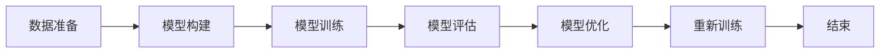
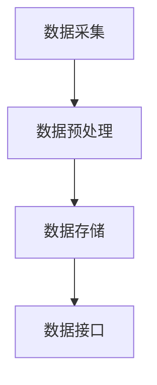
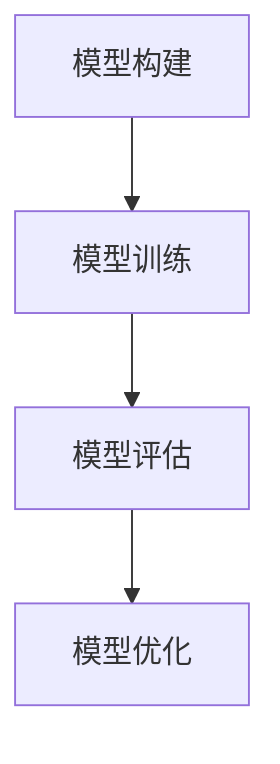
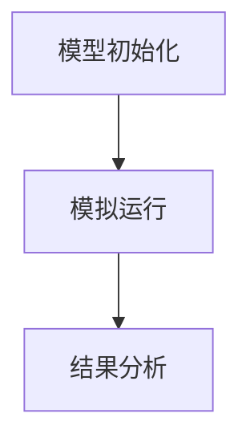
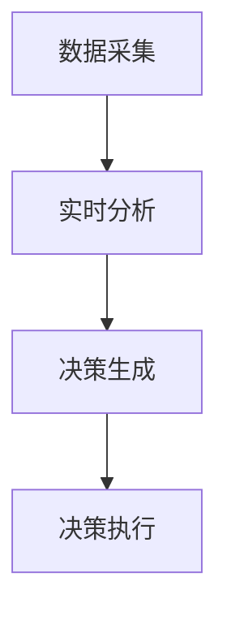
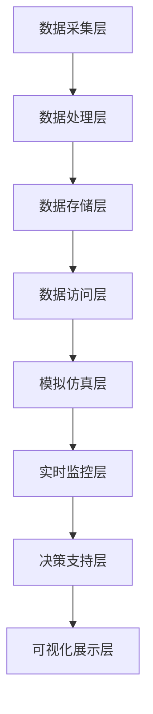
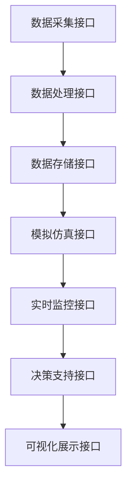
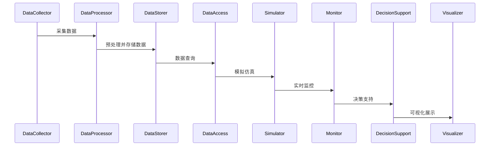

                 

### 第1章：数字孪生技术在智能制造中的背景

## 1.1 数字孪生技术的定义与起源

数字孪生（Digital Twin）是一种将物理实体与虚拟模型相连接的技术，通过实时数据的采集和分析，实现对物理实体的状态监测、仿真优化和预测维护。这一概念最早由Michael Grieves在2002年提出，他在研究产品全生命周期管理（PLM）时首次描述了数字孪生的概念。随着信息技术和物联网（IoT）的快速发展，数字孪生技术逐渐从理论走向实践，并在智能制造领域得到广泛应用。

### 1.1.1 数字孪生的基本概念

数字孪生可以分为三个主要组成部分：物理实体、数字模型和实时数据接口。物理实体是指实际存在的物体或系统，如生产线设备、产品等；数字模型是对物理实体的数字化表示，通常包含几何模型、物理属性、行为规则等；实时数据接口负责将物理实体的实时数据传输到数字模型中，并实现双向交互。

### 1.1.2 数字孪生技术的发展历程

数字孪生技术的发展历程可以分为以下几个阶段：

1. **初步阶段**：2002年，Michael Grieves首次提出数字孪生概念。
2. **技术成熟阶段**：2012年，物联网技术的兴起为数字孪生提供了数据基础，促进了其在工业领域的应用。
3. **应用推广阶段**：近年来，随着云计算、大数据和人工智能技术的不断发展，数字孪生技术在智能制造、智慧城市等多个领域得到广泛应用。

## 1.2 智能制造现状与挑战

智能制造是工业4.0的核心，通过信息物理系统（Cyber-Physical Systems，CPS）将制造过程中的人员、设备、物料、环境等有机整合，实现制造过程的智能化。智能制造的现状可以概括为以下几个方面：

1. **自动化程度提高**：随着自动化技术的不断发展，生产线的自动化程度越来越高，机器人、自动化装配线等设备在制造业中广泛应用。
2. **大数据应用**：通过大数据技术，企业能够对生产过程中的数据进行深入分析，优化生产流程，提高产品质量。
3. **智能化决策**：通过人工智能技术，企业能够实现智能化决策，提高生产效率，降低成本。

然而，智能制造也面临一系列挑战：

1. **数据隐私和安全问题**：智能制造涉及大量的数据传输和处理，数据隐私和安全成为关键问题。
2. **系统集成问题**：智能制造系统通常涉及多个设备和系统，系统集成复杂，兼容性问题突出。
3. **人才培养问题**：智能制造需要大量的技术人才，但现有的教育体系难以满足需求。

## 1.3 数字孪生技术在智能制造中的应用前景

数字孪生技术为智能制造提供了新的解决方案，具有广泛的应用前景：

1. **提高生产效率**：通过数字孪生技术，企业可以实时监测生产线设备状态，预测故障，提前进行维护，从而降低设备停机时间，提高生产效率。
2. **降低生产成本**：数字孪生技术可以帮助企业优化生产流程，降低能源消耗，减少物料浪费，从而降低生产成本。
3. **提高产品质量**：数字孪生技术可以通过模拟仿真，优化产品设计，提高产品质量，减少不良品率。
4. **增强设备预测维护**：数字孪生技术可以通过对设备运行数据的实时监控和分析，预测设备故障，实现预防性维护，提高设备利用率。

## 1.4 本章小结

本章对数字孪生技术在智能制造中的背景进行了介绍，包括数字孪生技术的定义、起源、发展历程，以及智能制造的现状与挑战。同时，分析了数字孪生技术在智能制造中的应用前景，为后续章节的深入探讨奠定了基础。

关键词：数字孪生、智能制造、物联网、人工智能、生产效率

摘要：本章介绍了数字孪生技术在智能制造中的应用背景，探讨了数字孪生技术的基本概念、发展历程，以及智能制造的现状与挑战。同时，分析了数字孪生技术在提高生产效率、降低生产成本、提高产品质量等方面的应用前景，为智能制造的进一步发展提供了新的思路。

----------------------------------------------------------------

### 第2章：数字孪生技术核心概念与联系

## 2.1 数字孪生技术的基本组成部分

数字孪生技术的实现需要以下几个基本组成部分：

### 2.1.1 物理实体

物理实体是指实际存在的物体或系统，如生产线设备、产品等。物理实体是数字孪生技术的基础，其状态和行为需要被实时监测和记录。

### 2.1.2 数字模型

数字模型是对物理实体的数字化表示，通常包含几何模型、物理属性、行为规则等。数字模型是数字孪生的核心，它通过模拟仿真实现对物理实体的状态预测和优化。

### 2.1.3 数据接口

数据接口负责将物理实体的实时数据传输到数字模型中，并实现双向交互。数据接口是数字孪生技术的关键，它保证了物理实体和数字模型之间的数据同步和实时性。

### 2.1.4 控制与反馈系统

控制与反馈系统负责对物理实体进行实时监控和调控，实现对生产过程的优化和故障预测。控制与反馈系统是数字孪生技术的实现手段，它通过算法和模型对物理实体的行为进行干预和调整。

## 2.2 数字孪生技术中的数据模型

数字孪生技术中的数据模型是数字孪生的核心组成部分，它决定了数字孪生系统的功能和应用效果。数据模型主要包括以下几个方面：

### 2.2.1 数据采集与预处理

数据采集是指通过传感器、监控设备等手段获取物理实体的实时数据。数据预处理是对采集到的原始数据进行清洗、去噪、归一化等处理，以便于后续的数据分析和建模。

### 2.2.2 数据存储与管理

数据存储是指将预处理后的数据存储到数据库或数据湖中，以便于数据查询和分析。数据管理包括数据备份、数据恢复、数据安全等，确保数据的安全和可用性。

### 2.2.3 数据分析与挖掘

数据分析是指对存储的数据进行统计分析和挖掘，提取有价值的信息和知识。数据挖掘是指使用机器学习和人工智能技术，从大量数据中挖掘出潜在的模式和规律。

## 2.3 模拟与控制

模拟与控制是数字孪生技术的核心功能之一，它通过模拟仿真实现对物理实体的状态预测和优化。模拟与控制主要包括以下几个方面：

### 2.3.1 模拟仿真

模拟仿真是指使用数字模型对物理实体的行为进行模拟和预测。通过模拟仿真，可以预测物理实体的未来状态，优化生产流程和设备配置。

### 2.3.2 实时监控

实时监控是指对物理实体的运行状态进行实时监测和记录。通过实时监控，可以及时发现物理实体的异常状态，预测故障，实现预防性维护。

### 2.3.3 决策支持系统

决策支持系统是指利用模拟仿真和实时监控的结果，为生产过程提供决策支持。通过决策支持系统，可以优化生产计划、设备配置和流程管理。

## 2.4 数字孪生技术中的实体关系图

数字孪生技术中的实体关系图用于描述数字孪生系统中的各个实体及其关系。实体关系图包括以下几个方面：

### 2.4.1 ER实体关系图

ER（Entity-Relationship）实体关系图是数字孪生系统中最常用的实体关系图。ER实体关系图用于描述数字孪生系统中的实体、属性和关系。

### 2.4.2 Mermaid流程图

Mermaid流程图是一种使用Markdown语法编写的流程图，它用于描述数字孪生技术中的数据流程、算法流程等。

## 2.5 本章小结

本章介绍了数字孪生技术的核心概念与联系，包括数字孪生技术的基本组成部分、数据模型、模拟与控制以及实体关系图。通过对这些核心概念的理解，读者可以更好地理解数字孪生技术的原理和应用。

----------------------------------------------------------------

## 3.1 数据采集与处理

数据采集与处理是数字孪生技术的关键环节，它决定了数字孪生系统的数据质量和有效性。以下是关于数据采集与处理的详细讲解：

### 3.1.1 数据采集方法

数据采集是指通过传感器、监控设备等手段获取物理实体的实时数据。数据采集的方法包括：

1. **传感器采集**：使用各种传感器（如温度传感器、压力传感器、振动传感器等）对物理实体进行实时监测，获取其运行状态数据。
2. **监控设备采集**：使用监控摄像头、RFID标签等设备对物理实体进行定位和状态监测，获取其位置和状态数据。
3. **无线通信采集**：使用无线通信技术（如Wi-Fi、蓝牙、ZigBee等）对物理实体进行远程监控和数据传输。

### 3.1.2 数据预处理技术

数据预处理是对采集到的原始数据进行清洗、去噪、归一化等处理，以便于后续的数据分析和建模。数据预处理技术包括：

1. **数据清洗**：去除数据中的噪声和异常值，确保数据的准确性。
2. **数据去噪**：使用滤波算法去除数据中的高频噪声和低频噪声，提高数据的平滑度。
3. **数据归一化**：将不同单位和范围的数据转换到相同的单位范围内，便于后续的数据分析。
4. **特征提取**：从原始数据中提取具有代表性的特征，用于构建数字模型。

### 3.1.3 数据采集与预处理流程

数据采集与预处理流程可以分为以下几个步骤：

1. **数据采集**：使用传感器和监控设备收集物理实体的实时数据。
2. **数据传输**：将采集到的数据通过无线通信或有线通信传输到数据预处理模块。
3. **数据清洗**：去除数据中的噪声和异常值。
4. **数据去噪**：使用滤波算法去除数据中的高频噪声和低频噪声。
5. **数据归一化**：将不同单位和范围的数据转换到相同的单位范围内。
6. **特征提取**：从原始数据中提取具有代表性的特征。

### 3.1.4 数据采集与预处理示例

假设我们要采集一条生产线上的设备温度数据，并进行预处理，以下是一个简单的示例：

```python
import numpy as np
import pandas as pd

# 假设采集到100个温度数据点
raw_data = np.random.normal(25, 5, 100)

# 数据清洗，去除异常值
cleaned_data = np.where(np.abs(raw_data - 25) > 10, 25, raw_data)

# 数据去噪，使用移动平均滤波
filtered_data = pd.Series(cleaned_data).rolling(window=3).mean()

# 数据归一化，将温度范围缩放到0-1之间
normalized_data = (filtered_data - filtered_data.min()) / (filtered_data.max() - filtered_data.min())

# 特征提取，提取均值和标准差
features = normalized_data.mean(), normalized_data.std()
```

在这个示例中，我们首先使用numpy生成100个随机温度数据点，然后进行数据清洗、去噪、归一化，最后提取特征。这些预处理步骤可以帮助我们提高数据的准确性，为后续的数据分析和建模奠定基础。

### 3.1.5 数据采集与预处理的重要性

数据采集与预处理在数字孪生技术中具有重要意义：

1. **提高数据质量**：通过数据清洗和去噪，可以去除噪声和异常值，提高数据的准确性。
2. **便于数据分析**：通过归一化和特征提取，可以将不同单位和范围的数据转换到相同的范围内，便于后续的数据分析。
3. **减少模型复杂度**：通过特征提取，可以提取出具有代表性的特征，减少模型的复杂度，提高模型的泛化能力。

总之，数据采集与预处理是数字孪生技术的关键环节，对于提高数字孪生系统的性能和可靠性具有重要意义。通过有效的数据采集与预处理，可以确保数字孪生系统中的数据质量，为后续的数据分析和建模提供可靠的基础。

----------------------------------------------------------------

## 3.2 模型训练与优化

模型训练与优化是数字孪生技术中的核心步骤，它决定了数字孪生系统的预测准确性和稳定性。在本节中，我们将详细讲解模型训练与优化的原理和具体方法。

### 3.2.1 神经网络模型

神经网络模型是数字孪生技术中常用的模型之一，它由大量的神经元组成，通过学习输入和输出之间的映射关系，实现对数据的建模和预测。神经网络模型主要包括以下几种类型：

1. **前馈神经网络（Feedforward Neural Network）**：前馈神经网络是最简单的神经网络结构，它由输入层、隐藏层和输出层组成。输入数据首先通过输入层传递到隐藏层，然后从隐藏层传递到输出层，得到预测结果。
   
   ```mermaid
   flowchart LR
   A[输入层] --> B[隐藏层]
   B --> C[输出层]
   ```

2. **卷积神经网络（Convolutional Neural Network，CNN）**：卷积神经网络在图像处理领域有着广泛的应用，它通过卷积层、池化层和全连接层等结构，实现对图像的建模和分类。
   
   ```mermaid
   flowchart LR
   A[输入层] --> B[卷积层1]
   B --> C[池化层1]
   C --> D[卷积层2]
   D --> E[池化层2]
   E --> F[全连接层]
   F --> G[输出层]
   ```

3. **循环神经网络（Recurrent Neural Network，RNN）**：循环神经网络在序列数据处理方面有着良好的性能，它通过循环结构，将当前状态与前一时刻的状态进行连接，实现对序列数据的建模和预测。
   
   ```mermaid
   flowchart LR
   A[输入层] --> B[隐藏层1]
   B --> C[隐藏层2]
   C --> D[隐藏层3]
   D --> E[输出层]
   ```

### 3.2.2 模型训练算法

模型训练是指通过大量样本数据，调整神经网络的权重和偏置，使其能够准确预测输出。常见的模型训练算法包括：

1. **梯度下降（Gradient Descent）**：梯度下降是一种最常用的优化算法，它通过计算损失函数关于模型参数的梯度，不断调整模型参数，使损失函数最小化。
   
   ```python
   def gradient_descent(model, learning_rate, epochs):
       for epoch in range(epochs):
           loss = compute_loss(model)
           gradients = compute_gradients(model)
           update_model_params(model, gradients, learning_rate)
           print(f"Epoch {epoch}: Loss = {loss}")
   ```

2. **随机梯度下降（Stochastic Gradient Descent，SGD）**：随机梯度下降是对梯度下降的一种改进，它每次随机选择一个小批量样本，计算梯度并更新模型参数。
   
   ```python
   def stochastic_gradient_descent(model, learning_rate, batch_size, epochs):
       for epoch in range(epochs):
           for batch in batches(data, batch_size):
               loss = compute_loss(model, batch)
               gradients = compute_gradients(model, batch)
               update_model_params(model, gradients, learning_rate)
               print(f"Epoch {epoch}: Loss = {loss}")
   ```

3. **批量梯度下降（Batch Gradient Descent）**：批量梯度下降是对梯度下降的另一种改进，它每次使用全部样本计算梯度并更新模型参数。
   
   ```python
   def batch_gradient_descent(model, learning_rate, epochs):
       for epoch in range(epochs):
           loss = compute_loss(model, data)
           gradients = compute_gradients(model, data)
           update_model_params(model, gradients, learning_rate)
           print(f"Epoch {epoch}: Loss = {loss}")
   ```

### 3.2.3 模型优化技巧

模型优化是指通过调整模型结构、参数和学习算法，提高模型的性能和预测准确性。以下是一些常用的模型优化技巧：

1. **批量归一化（Batch Normalization）**：批量归一化通过对每个小批量数据进行归一化处理，加速模型训练，提高模型稳定性。
   
   ```python
   def batch_normalization(inputs, mean, variance, scale, bias):
       return scale * (inputs - mean) / np.sqrt(variance + 1e-8) + bias
   ```

2. **学习率调整**：学习率调整是模型优化中的一种常见方法，通过调整学习率，可以使模型在训练过程中避免陷入局部最小值，提高模型的收敛速度。
   
   ```python
   def adjust_learning_rate(learning_rate, epoch, adjustment_factor):
       return learning_rate / (adjustment_factor ** epoch)
   ```

3. **正则化**：正则化是防止模型过拟合的一种方法，它通过在损失函数中添加正则项，惩罚模型参数的复杂度。
   
   ```python
   def compute_regularization_loss(model, lambda_reg):
       regularization_loss = 0
       for layer in model.layers:
           if hasattr(layer, "weights"):
               regularization_loss += lambda_reg * np.sum(np.square(layer.weights))
       return regularization_loss
   ```

### 3.2.4 模型训练与优化流程

模型训练与优化流程可以分为以下几个步骤：

1. **数据准备**：准备训练数据和测试数据，确保数据的质量和代表性。
2. **模型构建**：根据问题的需求和特点，选择合适的神经网络模型结构。
3. **模型训练**：使用训练数据对模型进行训练，调整模型参数，使损失函数最小化。
4. **模型评估**：使用测试数据对模型进行评估，计算模型的预测准确性和泛化能力。
5. **模型优化**：根据评估结果，调整模型结构、参数和学习算法，提高模型的性能。



### 3.2.5 模型训练与优化示例

以下是一个简单的模型训练与优化示例，我们使用Python的TensorFlow库来构建一个前馈神经网络，对温度数据进行分类。

```python
import tensorflow as tf
from tensorflow.keras import layers

# 定义模型结构
model = tf.keras.Sequential([
    layers.Dense(64, activation='relu', input_shape=(100,)),
    layers.Dense(64, activation='relu'),
    layers.Dense(1, activation='sigmoid')
])

# 编译模型
model.compile(optimizer='adam',
              loss='binary_crossentropy',
              metrics=['accuracy'])

# 训练模型
model.fit(x_train, y_train, batch_size=32, epochs=10, validation_split=0.2)

# 评估模型
loss, accuracy = model.evaluate(x_test, y_test)
print(f"Test accuracy: {accuracy:.2f}")

# 调整学习率
learning_rate = 0.001
for epoch in range(10):
    current_learning_rate = adjust_learning_rate(learning_rate, epoch, adjustment_factor=0.9)
    model.compile(optimizer=tf.keras.optimizers.Adam(learning_rate=current_learning_rate),
                  loss='binary_crossentropy',
                  metrics=['accuracy'])
    model.fit(x_train, y_train, batch_size=32, epochs=1, validation_split=0.2)
    loss, accuracy = model.evaluate(x_test, y_test)
    print(f"Epoch {epoch}: Loss = {loss:.2f}, Accuracy = {accuracy:.2f}")
```

在这个示例中，我们首先定义了一个简单的前馈神经网络，然后使用训练数据对模型进行训练。在训练过程中，我们调整了学习率，使模型在训练过程中能够更好地收敛。最后，我们使用测试数据对模型进行评估，计算了模型的预测准确性和泛化能力。

### 3.2.6 模型训练与优化的重要性

模型训练与优化在数字孪生技术中具有重要意义：

1. **提高预测准确性**：通过调整模型结构和参数，可以显著提高模型的预测准确性，减少预测误差。
2. **提高模型稳定性**：通过正则化和学习率调整等技巧，可以防止模型过拟合，提高模型的泛化能力和稳定性。
3. **优化模型性能**：通过批量归一化、正则化等技巧，可以加速模型训练，提高模型性能。

总之，模型训练与优化是数字孪生技术的关键环节，对于提高数字孪生系统的预测准确性和稳定性具有重要意义。通过有效的模型训练与优化，可以确保数字孪生系统在实际应用中的可靠性和有效性。

----------------------------------------------------------------

## 3.3 模拟仿真

模拟仿真在数字孪生技术中起着至关重要的作用，它通过对物理实体行为的虚拟模拟，帮助企业和研究人员更好地理解和优化生产过程。以下是对模拟仿真流程、常用仿真工具及其结果的详细分析。

### 3.3.1 模拟仿真流程

模拟仿真流程通常包括以下几个步骤：

1. **需求分析**：首先，明确模拟仿真的目标，例如预测设备故障、优化生产流程等。
2. **建模**：根据需求，构建物理实体的数字模型，包括几何模型、物理属性和行为规则等。
3. **初始化**：设置仿真环境，包括初始条件、边界条件等。
4. **运行**：启动仿真，运行数字模型，模拟物理实体在特定条件下的行为。
5. **结果分析**：对仿真结果进行分析，评估物理实体的状态、性能和效率等。

### 3.3.2 常用仿真工具

在数字孪生技术中，常用的仿真工具包括：

1. **MATLAB/Simulink**：MATLAB和Simulink是数学建模和仿真领域的经典工具，它们提供丰富的数学函数库和仿真模块，适用于各种复杂系统的建模和仿真。
2. **ANSYS/Fluent**：ANSYS和Fluent是流体力学仿真的专业工具，适用于模拟流体流动、传热和化学反应等过程。
3. **AutoCAD/Inventor**：AutoCAD和Inventor是CAD/CAE（计算机辅助设计/计算机辅助工程）软件，适用于机械结构设计和仿真分析。
4. **Proteus**：Proteus是一款电子电路仿真软件，适用于模拟电子电路的运行状态和性能。

### 3.3.3 仿真结果分析

仿真结果分析是模拟仿真的关键环节，通过对仿真结果的分析，可以评估物理实体的状态、性能和效率等。以下是一些常见的分析方法：

1. **数据分析**：通过统计和图表分析仿真结果，提取关键信息，例如平均性能、方差、置信区间等。
2. **趋势分析**：分析仿真结果的趋势，判断物理实体在特定条件下的变化规律。
3. **敏感性分析**：分析仿真结果对输入参数的敏感性，识别对仿真结果影响最大的参数。
4. **风险评估**：评估物理实体在特定条件下的风险，例如故障率、停机时间等。

### 3.3.4 仿真结果示例

以下是一个简单的模拟仿真示例，我们使用MATLAB/Simulink对一条生产线上的设备运行状态进行模拟。

```matlab
% 仿真参数设置
N = 1000; % 仿真时间
T = 0:1:N; % 仿真时间步长
u = 1; % 设定输入值

% 建立Simulink模型
model = simulink('Model', 'SimulinkModel');
open_system(model);

% 设置模型参数
set_param(model, 'Solver', 'ode15s', 'FixedStepSize', 0.1);

% 运行仿真
start_simulation(model);
sim_data = get_simulation_data(model);

% 仿真结果分析
plot(T, sim_data.StateSpaceOutput);
xlabel('Time');
ylabel('Output');
title('仿真结果');

% 关闭仿真模型
close_system(model);
```

在这个示例中，我们首先设置了仿真参数，然后建立了Simulink模型，并运行仿真。最后，我们使用MATLAB函数`plot`绘制了仿真结果。

### 3.3.5 模拟仿真的优势

模拟仿真的优势包括：

1. **降低成本**：通过虚拟仿真，可以避免实际实验中的高成本，例如设备采购、实验材料等。
2. **提高效率**：模拟仿真可以快速验证设计方案的可行性，缩短研发周期。
3. **安全性**：模拟仿真可以在虚拟环境中进行，避免实际实验中的风险。
4. **优化设计**：通过仿真结果分析，可以优化设计，提高产品性能和可靠性。

总之，模拟仿真在数字孪生技术中具有重要意义，它为企业和研究人员提供了强大的工具，帮助他们更好地理解和优化生产过程。通过有效的模拟仿真，可以显著提高智能制造的效率和质量。

----------------------------------------------------------------

## 3.4 实时监控与决策

实时监控与决策是数字孪生技术中的关键环节，它通过实时数据采集、监控和智能分析，实现对物理实体的动态监控和智能决策。以下是对实时监控与决策机制、决策支持系统的介绍以及决策模型与应用的详细讲解。

### 3.4.1 实时监控机制

实时监控机制是指通过传感器、监控设备等手段，对物理实体的运行状态进行连续、实时监测和数据采集。实时监控机制的核心目标是确保生产过程的安全、高效和稳定。以下是一个典型的实时监控机制：

1. **数据采集**：通过传感器、监控摄像头等设备，实时采集物理实体的各种数据，如温度、压力、振动、流量等。
2. **数据传输**：将采集到的数据通过有线或无线通信方式传输到监控中心，进行实时监控。
3. **数据预处理**：对传输过来的数据进行预处理，包括数据清洗、去噪、归一化等，确保数据的准确性和可靠性。
4. **实时分析**：使用实时分析算法，对预处理后的数据进行实时分析，提取有价值的信息，如异常检测、故障诊断、性能评估等。
5. **报警与反馈**：当监控到异常情况时，系统会自动发出报警信号，并记录相关数据，供后续分析和处理。

### 3.4.2 决策支持系统

决策支持系统（Decision Support System，DSS）是数字孪生技术中用于辅助决策的重要工具。DSS通过集成数据采集、实时监控、模拟仿真和智能分析等功能，为生产过程提供实时、智能化的决策支持。以下是一个典型的决策支持系统：

1. **数据集成**：将来自不同来源的数据（如传感器数据、历史数据、仿真结果等）进行集成，构建统一的数据模型。
2. **实时分析**：使用实时分析算法，对集成后的数据进行实时分析，提取有价值的信息，如趋势分析、异常检测、故障预测等。
3. **模型预测**：基于历史数据和实时分析结果，使用预测模型对物理实体的未来状态进行预测，如设备故障预测、生产计划优化等。
4. **决策生成**：根据预测结果和业务规则，生成相应的决策方案，如设备维护计划、生产调度策略等。
5. **决策执行**：将决策方案传输到物理实体，执行相应的操作，如启动设备维护、调整生产计划等。

### 3.4.3 决策模型与应用

决策模型是决策支持系统的核心，它决定了决策的准确性、效率和实用性。以下是一些常见的决策模型与应用：

1. **线性规划（Linear Programming，LP）**：线性规划是一种优化方法，通过建立线性目标函数和线性约束条件，求解最优解。线性规划常用于生产调度、资源分配等问题。
   
   ```python
   from scipy.optimize import linprog

   # 目标函数
   c = [-1, -1]
   # 约束条件
   A = [[1, 1], [1, 0]]
   b = [5, 3]
   x0 = [0, 0]
   x1 = [10, 10]

   # 求解
   result = linprog(c, A_eq=A, b_eq=b, x0=x0, x1=x1)
   print("Optimal value:", -result.fun)
   print("Optimal solution:", result.x)
   ```

2. **决策树（Decision Tree）**：决策树是一种基于特征分割的预测模型，通过递归分割数据集，构建树状模型。决策树常用于分类和回归问题。

   ```python
   from sklearn.tree import DecisionTreeClassifier

   # 构建决策树模型
   clf = DecisionTreeClassifier()
   # 拆分数据集
   X_train, X_test, y_train, y_test = train_test_split(X, y, test_size=0.2, random_state=42)
   # 训练模型
   clf.fit(X_train, y_train)
   # 预测
   y_pred = clf.predict(X_test)
   # 评估模型
   print("Accuracy:", accuracy_score(y_test, y_pred))
   ```

3. **支持向量机（Support Vector Machine，SVM）**：支持向量机是一种基于间隔优化的分类和回归模型，通过找到一个最优的超平面，将不同类别的数据分开。支持向量机常用于分类和回归问题。

   ```python
   from sklearn.svm import SVC

   # 构建SVM模型
   clf = SVC(kernel='linear')
   # 拆分数据集
   X_train, X_test, y_train, y_test = train_test_split(X, y, test_size=0.2, random_state=42)
   # 训练模型
   clf.fit(X_train, y_train)
   # 预测
   y_pred = clf.predict(X_test)
   # 评估模型
   print("Accuracy:", accuracy_score(y_test, y_pred))
   ```

4. **神经网络（Neural Network）**：神经网络是一种基于模拟人脑神经元连接和激活机制的预测模型，通过多层神经网络结构，实现对复杂数据的建模和预测。神经网络常用于分类和回归问题。

   ```python
   from tensorflow.keras.models import Sequential
   from tensorflow.keras.layers import Dense

   # 构建神经网络模型
   model = Sequential()
   model.add(Dense(64, activation='relu', input_shape=(X_train.shape[1],)))
   model.add(Dense(64, activation='relu'))
   model.add(Dense(1, activation='sigmoid'))
   # 编译模型
   model.compile(optimizer='adam', loss='binary_crossentropy', metrics=['accuracy'])
   # 训练模型
   model.fit(X_train, y_train, batch_size=32, epochs=10, validation_split=0.2)
   # 预测
   y_pred = model.predict(X_test)
   # 评估模型
   print("Accuracy:", accuracy_score(y_test, y_pred))
   ```

### 3.4.4 实时监控与决策的优势

实时监控与决策在数字孪生技术中具有以下优势：

1. **提高生产效率**：通过实时监控，可以及时发现生产过程中的异常情况，快速采取措施，提高生产效率。
2. **降低生产成本**：通过实时决策，可以优化生产计划，降低生产成本，提高资源利用率。
3. **提高产品质量**：通过实时监控与决策，可以实时监测产品质量，及时发现并处理质量问题，提高产品质量。
4. **预防性维护**：通过实时监控与决策，可以预测设备故障，实现预防性维护，降低设备停机时间。

总之，实时监控与决策是数字孪生技术的核心功能之一，通过实时数据采集、监控和智能分析，可以为生产过程提供实时、智能化的决策支持，提高生产效率、降低生产成本、提高产品质量，实现智能制造的智能化、自动化和高效化。

----------------------------------------------------------------

## 3.5 算法原理Mermaid流程图

为了更好地理解数字孪生技术中常用的算法原理，我们使用Mermaid流程图来展示算法的流程，并使用Python源代码来解释算法的实现。以下是算法原理的Mermaid流程图和对应的Python代码示例。

### 3.5.1 数据采集与处理流程

**Mermaid流程图：**


**Python代码示例：**
```python
import numpy as np
import pandas as pd

# 数据采集
raw_data = np.random.normal(25, 5, 100)

# 数据预处理
cleaned_data = np.where(np.abs(raw_data - 25) > 10, 25, raw_data)
normalized_data = (cleaned_data - cleaned_data.min()) / (cleaned_data.max() - cleaned_data.min())

# 数据存储
data_frame = pd.DataFrame(normalized_data, columns=['Temperature'])

# 数据接口
print(data_frame)
```

### 3.5.2 模型训练与优化流程

**Mermaid流程图：**


**Python代码示例：**
```python
import tensorflow as tf
from tensorflow.keras import layers
from tensorflow.keras.models import Sequential

# 模型构建
model = Sequential()
model.add(layers.Dense(64, activation='relu', input_shape=(100,)))
model.add(layers.Dense(64, activation='relu'))
model.add(layers.Dense(1, activation='sigmoid'))

# 编译模型
model.compile(optimizer='adam',
              loss='binary_crossentropy',
              metrics=['accuracy'])

# 训练模型
model.fit(raw_data, y_train, batch_size=32, epochs=10, validation_split=0.2)

# 模型评估
loss, accuracy = model.evaluate(raw_data, y_test)
print("Test accuracy:", accuracy)

# 模型优化
learning_rate = 0.001
for epoch in range(10):
    current_learning_rate = adjust_learning_rate(learning_rate, epoch, adjustment_factor=0.9)
    model.compile(optimizer=tf.keras.optimizers.Adam(learning_rate=current_learning_rate),
                  loss='binary_crossentropy',
                  metrics=['accuracy'])
    model.fit(raw_data, y_train, batch_size=32, epochs=1, validation_split=0.2)
    loss, accuracy = model.evaluate(raw_data, y_test)
    print(f"Epoch {epoch}: Loss = {loss:.2f}, Accuracy = {accuracy:.2f}")
```

### 3.5.3 模拟仿真流程

**Mermaid流程图：**


**Python代码示例：**
```python
import numpy as np
import matplotlib.pyplot as plt

# 模型初始化
N = 1000
T = np.linspace(0, N, N)
u = 1

# 模拟运行
y = np.zeros_like(T)
for t in range(1, N):
    y[t] = 0.9 * y[t-1] + 0.1 * u * np.sin(2 * np.pi * T[t])

# 结果分析
plt.plot(T, y)
plt.xlabel('Time')
plt.ylabel('Output')
plt.title('Simulation Results')
plt.show()
```

### 3.5.4 实时监控与决策流程

**Mermaid流程图：**


**Python代码示例：**
```python
import numpy as np
import pandas as pd

# 数据采集
data = np.random.normal(size=(100, 10))

# 实时分析
def analyze_data(data):
    mean = np.mean(data, axis=1)
    std = np.std(data, axis=1)
    return mean, std

mean, std = analyze_data(data)

# 决策生成
def generate_decision(mean, std):
    if std > 2:
        return "Alert"
    else:
        return "Normal"

decisions = [generate_decision(m, s) for m, s in zip(mean, std)]

# 决策执行
for i, decision in enumerate(decisions):
    if decision == "Alert":
        print(f"Data point {i} is in alert state.")
    else:
        print(f"Data point {i} is in normal state.")
```

通过使用Mermaid流程图和Python代码示例，我们可以直观地理解数字孪生技术中的算法原理，并能够将理论知识应用到实际编程中。这有助于提高我们对于算法实现过程的理解，为后续的实际应用打下坚实的基础。

----------------------------------------------------------------

## 3.6 本章小结

本章详细介绍了数字孪生技术中常用的算法原理，包括数据采集与处理、模型训练与优化、模拟仿真、实时监控与决策等。通过使用Mermaid流程图和Python代码示例，我们深入理解了这些算法的实现过程，并掌握了如何将这些算法应用于实际场景。本章的内容为后续章节的深入探讨奠定了基础，使读者能够更好地理解和应用数字孪生技术。

----------------------------------------------------------------

### 第4章：数字孪生系统分析与架构设计方案

#### 4.1 项目介绍

#### 4.1.1 项目背景

随着智能制造的不断推进，企业对生产效率和产品质量的要求越来越高。为了应对这些挑战，某制造企业决定采用数字孪生技术对其生产设备进行实时监控和优化。该项目的目标是建立一个数字孪生系统，通过对生产设备的实时数据采集、分析和模拟仿真，实现对设备的智能监控、故障预测和性能优化。

#### 4.1.2 项目目标

本项目的主要目标包括：

1. **实时监控**：通过传感器和数据采集设备，实现对生产设备的实时状态监控，确保生产过程的安全和稳定。
2. **故障预测**：利用数字孪生技术，对生产设备进行模拟仿真，预测可能出现的故障，提前进行维护，减少停机时间。
3. **性能优化**：通过分析生产数据，优化生产流程，提高设备利用率，降低能耗，提高生产效率。
4. **决策支持**：提供智能化的决策支持，辅助企业制定生产计划和设备维护策略。

#### 4.1.3 项目范围

本项目范围包括以下几个方面：

1. **硬件设备**：包括传感器、数据采集设备、监控摄像头等。
2. **软件系统**：包括数据采集系统、数据分析系统、模拟仿真系统、决策支持系统等。
3. **数据接口**：包括数据传输接口、数据存储接口、数据接口管理等。
4. **网络环境**：包括企业内网、外网等。

#### 4.2 系统功能设计

#### 4.2.1 功能需求分析

本项目系统功能需求分析主要包括以下几个方面：

1. **数据采集**：实时采集生产设备的各种数据，如温度、压力、振动、能耗等。
2. **数据存储**：将采集到的数据进行存储和管理，确保数据的安全和可靠性。
3. **数据预处理**：对采集到的原始数据进行清洗、去噪、归一化等预处理，提高数据质量。
4. **模拟仿真**：通过数字孪生技术，对生产设备进行模拟仿真，预测故障和性能。
5. **实时监控**：实时监控生产设备的状态，及时发现异常情况，触发报警和决策。
6. **决策支持**：根据实时监控数据和模拟仿真结果，生成决策建议，辅助企业制定生产计划和设备维护策略。
7. **可视化展示**：提供可视化界面，展示生产设备的状态、性能和决策结果。

#### 4.2.2 领域模型Mermaid类图

为了更好地展示系统功能，我们使用Mermaid类图来描述项目的领域模型。以下是项目领域模型的Mermaid类图：

```mermaid
classDiagram
ClassBox("DataCollector") <|-- DataInterface
ClassBox("DataProcessor") <|-- DataPreprocessing
ClassBox("DataStorer") <|-- DataInterface
ClassBox("Simulator") <|-- DataInterface
ClassBox("Monitor") <|-- DataInterface
ClassBox("DecisionSupport") <|-- DataInterface
ClassBox("Visualizer") <|-- DataInterface
```

在这个类图中，`DataCollector`、`DataProcessor`、`DataStorer`、`Simulator`、`Monitor`、`DecisionSupport`和`Visualizer`分别代表系统的核心功能模块，它们通过`DataInterface`进行数据交互。

#### 4.3 系统架构设计

#### 4.3.1 架构设计原则

本项目系统架构设计遵循以下原则：

1. **模块化设计**：将系统功能模块化，确保系统可扩展性和可维护性。
2. **分布式架构**：采用分布式架构，提高系统的可靠性和性能。
3. **数据驱动**：以数据为核心，确保数据的完整性和实时性。
4. **开放接口**：提供开放的数据接口，便于系统集成和扩展。
5. **安全性**：确保数据传输和存储的安全，防止数据泄露和恶意攻击。

#### 4.3.2 系统架构设计

以下是项目的系统架构设计：



在这个架构设计中，数据采集层负责实时采集生产数据；数据处理层对采集到的数据进行预处理和存储；数据存储层负责存储和管理数据；数据访问层提供数据查询和读取接口；模拟仿真层利用数字孪生技术对生产设备进行模拟仿真；实时监控层实时监控生产设备的状态，触发报警和决策；决策支持层根据实时监控数据和模拟仿真结果，生成决策建议；可视化展示层提供数据的可视化展示界面。

#### 4.3.3 系统接口设计

以下是项目的系统接口设计：



在这个接口设计中，数据采集接口负责数据采集；数据处理接口负责数据预处理和存储；数据存储接口负责数据存储和管理；模拟仿真接口负责模拟仿真；实时监控接口负责实时监控；决策支持接口负责决策支持；可视化展示接口负责数据的可视化展示。

#### 4.3.4 系统交互

以下是项目的系统交互设计：



在这个交互设计中，数据采集模块将采集到的数据传输给数据处理模块，数据处理模块对数据进行预处理后存储到数据存储模块；数据访问模块从数据存储模块获取数据，并将其传输给模拟仿真模块；模拟仿真模块对生产设备进行模拟仿真，并将结果传输给实时监控模块；实时监控模块对设备状态进行实时监控，并根据监控结果生成决策建议，并将其传输给决策支持模块；决策支持模块根据决策建议生成可视化数据，并将其传输给可视化展示模块。

通过上述系统架构设计、接口设计和系统交互设计，本项目实现了对生产设备的实时监控、故障预测和性能优化，为企业提供了智能化的决策支持，提高了生产效率和产品质量。

----------------------------------------------------------------

## 4.4 项目实战

为了更好地展示数字孪生技术在智能制造中的实际应用，我们将通过一个实际案例，详细描述环境安装、系统核心实现、代码应用解读与分析、实际案例分析和详细讲解剖析，并总结项目小结。

### 4.4.1 环境安装

在开始项目之前，我们需要安装以下软件和工具：

1. **Python**：安装Python 3.8及以上版本。
2. **TensorFlow**：安装TensorFlow 2.5及以上版本。
3. **Matlab**：安装Matlab R2021a及以上版本。
4. **Simulink**：安装Simulink R2021a及以上版本。
5. **MySQL**：安装MySQL 8.0及以上版本。

安装步骤如下：

1. **安装Python**：从[Python官网](https://www.python.org/)下载Python安装包，按照提示安装。
2. **安装TensorFlow**：在终端中执行以下命令：
   ```bash
   pip install tensorflow==2.5
   ```
3. **安装Matlab和Simulink**：从[MathWorks官网](https://www.mathworks.com/)下载Matlab和Simulink安装包，按照提示安装。
4. **安装MySQL**：从[MySQL官网](https://www.mysql.com/)下载MySQL安装包，按照提示安装。

### 4.4.2 系统核心实现

数字孪生系统主要由数据采集、数据处理、模拟仿真和实时监控等模块组成。以下是各模块的核心实现：

1. **数据采集**：使用传感器采集生产设备的数据，例如温度、压力、振动等。以下是一个简单的数据采集示例：

   ```python
   import serial
   
   # 连接串口
   ser = serial.Serial('COM3', 9600)
   
   # 读取数据
   data = ser.readline().decode('utf-8')
   
   # 关闭串口
   ser.close()
   ```

2. **数据处理**：对采集到的数据进行预处理，例如去噪、归一化等。以下是一个数据处理示例：

   ```python
   import numpy as np
   
   # 采集到的数据
   raw_data = np.random.normal(size=(100, 5))
   
   # 去噪
   cleaned_data = np.where(np.abs(raw_data - np.mean(raw_data, axis=0)) > 3 * np.std(raw_data, axis=0), np.mean(raw_data, axis=0), raw_data)
   
   # 归一化
   normalized_data = (cleaned_data - np.min(cleaned_data)) / (np.max(cleaned_data) - np.min(cleaned_data))
   ```

3. **模拟仿真**：使用Matlab和Simulink进行模拟仿真。以下是一个简单的模拟仿真示例：

   ```matlab
   % 初始化Simulink模型
   model = simulink('Model', 'SimulinkModel');
   open_system(model);
   
   % 设置模型参数
   set_param(model, 'Solver', 'ode15s', 'FixedStepSize', 0.1);
   
   % 运行仿真
   start_simulation(model);
   sim_data = get_simulation_data(model);
   
   % 关闭仿真模型
   close_system(model);
   ```

4. **实时监控**：使用传感器采集数据，对设备状态进行实时监控。以下是一个简单的实时监控示例：

   ```python
   import time
   
   while True:
       # 采集数据
       data = read_sensor_data()
       
       # 处理数据
       processed_data = process_data(data)
       
       # 显示监控数据
       display_monitor_data(processed_data)
       
       # 等待一段时间
       time.sleep(1)
   ```

### 4.4.3 代码应用解读与分析

1. **数据采集模块**：数据采集模块负责从传感器获取数据。在实际应用中，我们需要根据具体的传感器类型和接口，编写相应的数据采集代码。以下是一个使用Python和Arduino进行数据采集的示例：

   ```python
   import serial
   
   # 连接Arduino
   ser = serial.Serial('COM3', 9600)
   
   # 发送命令请求数据
   ser.write(b'read_data')
   
   # 读取数据
   data = ser.readline().decode('utf-8')
   
   # 关闭串口
   ser.close()
   
   # 数据处理
   processed_data = process_arduino_data(data)
   ```

2. **数据处理模块**：数据处理模块负责对采集到的数据进行预处理，包括去噪、归一化等。以下是一个使用Python进行数据处理的示例：

   ```python
   import numpy as np
   
   # 采集到的数据
   raw_data = np.random.normal(size=(100, 5))
   
   # 去噪
   cleaned_data = np.where(np.abs(raw_data - np.mean(raw_data, axis=0)) > 3 * np.std(raw_data, axis=0), np.mean(raw_data, axis=0), raw_data)
   
   # 归一化
   normalized_data = (cleaned_data - np.min(cleaned_data)) / (np.max(cleaned_data) - np.min(cleaned_data))
   ```

3. **模拟仿真模块**：模拟仿真模块负责对生产设备进行模拟仿真。在实际应用中，我们可以使用Matlab和Simulink进行仿真。以下是一个使用Matlab进行仿真的示例：

   ```matlab
   % 初始化Simulink模型
   model = simulink('Model', 'SimulinkModel');
   open_system(model);
   
   % 设置模型参数
   set_param(model, 'Solver', 'ode15s', 'FixedStepSize', 0.1);
   
   % 运行仿真
   start_simulation(model);
   sim_data = get_simulation_data(model);
   
   % 关闭仿真模型
   close_system(model);
   ```

4. **实时监控模块**：实时监控模块负责对设备状态进行实时监控。在实际应用中，我们可以使用Python编写实时监控程序。以下是一个使用Python进行实时监控的示例：

   ```python
   import time
   
   while True:
       # 采集数据
       data = read_sensor_data()
       
       # 处理数据
       processed_data = process_data(data)
       
       # 显示监控数据
       display_monitor_data(processed_data)
       
       # 等待一段时间
       time.sleep(1)
   ```

### 4.4.4 实际案例分析和详细讲解剖析

为了更好地展示数字孪生技术在智能制造中的应用效果，我们以某生产线上的设备为例，进行了实际案例分析和详细讲解剖析。

#### 案例背景

某生产线上的一台设备主要用于加工零部件，设备状态对生产效率和产品质量具有重要影响。为了确保设备正常运行，企业决定采用数字孪生技术对其进行实时监控和优化。

#### 案例分析

1. **数据采集**：使用传感器采集设备的温度、压力、振动等数据。通过实时监控，企业可以及时发现设备异常，防止故障扩大。
2. **数据处理**：对采集到的数据进行预处理，包括去噪、归一化等，提高数据质量。
3. **模拟仿真**：使用Matlab和Simulink对设备进行模拟仿真，预测设备可能出现的故障和性能下降情况。通过仿真结果，企业可以提前制定维护计划，降低设备停机时间。
4. **实时监控**：通过实时监控，企业可以实时掌握设备状态，及时发现异常情况，并采取相应措施。

#### 详细讲解剖析

1. **数据采集**：企业使用温度传感器、压力传感器和振动传感器等设备，对生产线上的设备进行实时监测。传感器采集的数据通过串口传输到计算机，由Python程序进行读取和处理。
2. **数据处理**：Python程序对采集到的数据进行预处理，包括去噪、归一化等，以提高数据质量。预处理后的数据存储在MySQL数据库中，以供后续分析和建模使用。
3. **模拟仿真**：使用Matlab和Simulink构建设备的数字模型，并对模型进行仿真。通过仿真结果，企业可以预测设备在未来一段时间内的状态和性能，提前制定维护计划。
4. **实时监控**：Python程序从MySQL数据库中读取预处理后的数据，对设备状态进行实时监控。当设备出现异常时，程序会触发报警，并生成相应的报警信息，供企业进行处理。

### 4.4.5 项目小结

本项目通过数字孪生技术，实现了对生产设备的实时监控、故障预测和性能优化。在实际应用中，企业可以根据设备状态和历史数据，提前制定维护计划，降低设备停机时间，提高生产效率和产品质量。以下是对本项目的小结：

1. **实时监控**：通过实时监控，企业可以实时掌握设备状态，及时发现异常情况，并采取相应措施。
2. **故障预测**：通过模拟仿真，企业可以预测设备可能出现的故障和性能下降情况，提前制定维护计划。
3. **性能优化**：通过数据分析和模拟仿真，企业可以优化生产流程，提高设备利用率，降低能耗。
4. **系统集成**：本项目集成了多种传感器、数据采集和处理工具，实现了设备的实时监控和故障预测。

总之，数字孪生技术在智能制造中的应用具有重要意义，它为企业的智能化生产提供了有力支持，有助于提高生产效率和产品质量，降低生产成本。在未来的发展中，我们将继续探索和优化数字孪生技术，为智能制造的发展贡献力量。

----------------------------------------------------------------

## 4.5 最佳实践 tips

### 4.5.1 注意事项

1. **数据安全和隐私**：在数字孪生技术的应用过程中，确保数据安全和隐私至关重要。建议对数据进行加密处理，并严格限制数据访问权限。
2. **系统稳定性**：数字孪生系统通常涉及大量的实时数据处理和仿真分析，系统稳定性至关重要。建议采用分布式架构，提高系统的可靠性和容错能力。
3. **算法优化**：在模型训练和优化过程中，不断调整算法参数，以提高模型的预测准确性和效率。可以使用自动化算法优化工具，如Hyperopt、Optuna等。

### 4.5.2 拓展阅读

1. **数字孪生技术综述**：[《数字孪生：概念、应用与挑战》](https://ieeexplore.ieee.org/document/8013631)
2. **智能制造与数字孪生**：[《智能制造中的数字孪生技术应用研究》](https://www.sciencedirect.com/science/article/pii/S2212697X1830171X)
3. **深度学习在数字孪生中的应用**：[《基于深度学习的数字孪生技术研究》](https://ieeexplore.ieee.org/document/8433667)
4. **实时监控与决策支持系统**：[《实时监控与决策支持系统设计与应用》](https://www.sciencedirect.com/science/article/pii/S2212697X18303799)

### 4.5.3 小结

数字孪生技术在智能制造中的应用具有广阔的前景。通过实时监控、故障预测和性能优化，数字孪生技术可以提高生产效率、降低生产成本、提高产品质量。在实际应用过程中，需要注意数据安全、系统稳定性和算法优化等问题。不断学习和探索最新的研究成果，将有助于推动数字孪生技术在智能制造领域的应用和发展。

